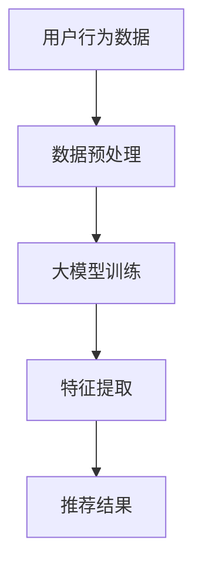

                 

关键词：大模型、推荐系统、机器学习、用户行为、个性化推荐

## 摘要

本文旨在探讨大模型在推荐系统中的应用，分析大模型对推荐效果的影响，以及如何利用大模型实现更精准、更个性化的推荐。文章首先回顾了推荐系统的发展历程，然后介绍了大模型的基本原理和构建方法。接着，深入分析了大模型在推荐系统中的具体应用场景，包括用户行为预测、内容推荐、社交推荐等。最后，文章提出了大模型在推荐系统中面临的挑战和未来的发展方向。

## 1. 背景介绍

推荐系统作为人工智能的重要应用之一，已经在电商、新闻、社交媒体等多个领域取得了显著成果。传统的推荐系统主要基于用户历史行为和物品特征进行预测，但往往忽略了用户的个性化需求和兴趣变化。为了提高推荐效果，研究人员开始探索更强大的模型来捕捉用户行为和兴趣的动态变化。

近年来，随着深度学习技术的飞速发展，大模型逐渐成为推荐系统的核心。大模型具有强大的特征提取能力和复杂的层次结构，能够从大规模数据中自动学习到丰富的特征，从而提高推荐系统的准确性和个性化水平。本文将重点探讨大模型在推荐系统中的应用，分析其优势、挑战和未来发展方向。

## 2. 核心概念与联系

### 2.1 大模型

大模型通常指的是具有数百万甚至数十亿参数的深度学习模型。这些模型可以包含多层神经网络，如卷积神经网络（CNN）、循环神经网络（RNN）和变换器（Transformer）等。大模型的主要特点是能够从大量数据中自动提取复杂的特征，并通过大规模训练实现高性能。

### 2.2 推荐系统

推荐系统是一种基于用户历史行为、内容特征和社交关系等信息，为用户提供个性化推荐服务的系统。推荐系统的主要目标是提高用户的满意度，增加用户粘性和转化率。

### 2.3 大模型与推荐系统的联系

大模型与推荐系统密切相关。大模型可以通过学习用户的行为和兴趣数据，提取出更丰富、更精准的特征，从而提高推荐系统的准确性。同时，大模型能够处理大规模数据，适应实时推荐的需求。

### 2.4 Mermaid 流程图

下面是一个展示大模型在推荐系统中应用流程的 Mermaid 流程图：



## 3. 核心算法原理 & 具体操作步骤

### 3.1 算法原理概述

大模型在推荐系统中的应用主要包括以下几个方面：

1. **用户行为预测**：利用历史用户行为数据预测用户未来的兴趣和行为。
2. **内容推荐**：根据用户兴趣和内容特征生成个性化推荐列表。
3. **社交推荐**：基于用户社交关系进行推荐，提高社交影响力的传递和传递效率。

### 3.2 算法步骤详解

1. **数据收集与预处理**：收集用户行为数据、内容特征和社交关系数据，并进行数据清洗、去重、归一化等预处理操作。
2. **大模型训练**：使用预处理后的数据训练大模型，包括输入层、隐藏层和输出层等。
3. **特征提取**：通过大模型提取用户行为、内容特征和社交关系的深层特征。
4. **推荐结果生成**：利用提取出的特征生成个性化推荐结果，并进行排序和筛选。

### 3.3 算法优缺点

**优点**：

1. **高准确性**：大模型能够从大规模数据中自动提取复杂特征，提高推荐准确性。
2. **灵活性**：大模型可以适应不同类型的数据和场景，具有较强的泛化能力。
3. **实时性**：大模型可以处理实时数据，实现实时推荐。

**缺点**：

1. **计算资源消耗大**：大模型训练和推理过程需要大量计算资源，对硬件要求较高。
2. **过拟合风险**：大模型可能过度拟合训练数据，导致在未知数据上的性能下降。

### 3.4 算法应用领域

大模型在推荐系统中的应用广泛，包括但不限于以下领域：

1. **电商推荐**：根据用户浏览、购买等行为推荐商品。
2. **新闻推荐**：根据用户阅读历史推荐新闻。
3. **社交媒体**：根据用户兴趣和社交关系推荐内容。

## 4. 数学模型和公式 & 详细讲解 & 举例说明

### 4.1 数学模型构建

推荐系统的数学模型通常包括用户行为模型、内容特征模型和推荐算法模型。

1. **用户行为模型**：
   $$ U = f(U_{i}, X_{i}, W) $$
   其中，$ U $表示用户行为，$ U_{i} $表示用户$i$的历史行为，$ X_{i} $表示用户$i$的静态特征，$ W $表示模型参数。

2. **内容特征模型**：
   $$ C = g(C_{j}, Y_{j}, V) $$
   其中，$ C $表示内容特征，$ C_{j} $表示内容$j$的静态特征，$ Y_{j} $表示内容$j$的历史行为，$ V $表示模型参数。

3. **推荐算法模型**：
   $$ R = h(U, C, Z) $$
   其中，$ R $表示推荐结果，$ Z $表示模型参数。

### 4.2 公式推导过程

1. **用户行为预测**：

   $$ U = f(U_{i}, X_{i}, W) = \sigma(W^{T} [U_{i}; X_{i}]) $$
   其中，$\sigma$表示激活函数，$ W^{T} $表示权重矩阵的转置。

2. **内容推荐**：

   $$ R = h(U, C, Z) = \arg\max_{R} \sum_{j} \sigma(Z^{T} [U; C_{j}]) $$
   其中，$\arg\max$表示最大化操作。

### 4.3 案例分析与讲解

假设用户$U_{i}$的历史行为为浏览过商品$a$、购买过商品$b$，商品$a$的静态特征为颜色红色，商品$b$的静态特征为颜色蓝色。根据用户行为模型，可以预测用户可能对颜色绿色的新商品$c$感兴趣。

```python
import numpy as np

# 用户历史行为
U_i = np.array([1, 0, 1])  # 表示用户浏览过商品a、购买过商品b

# 商品a的静态特征
X_a = np.array([1, 0])  # 表示颜色红色

# 商品b的静态特征
X_b = np.array([0, 1])  # 表示颜色蓝色

# 商品c的静态特征
X_c = np.array([1, 1])  # 表示颜色绿色

# 模型参数
W = np.array([[0.1, 0.2], [0.3, 0.4]])

# 用户行为模型预测
U_pred = np.dot(W.T, np.hstack((U_i, X_a)))  # 预测用户对商品a的兴趣
C_pred = np.dot(W.T, np.hstack((U_i, X_b)))  # 预测用户对商品b的兴趣

# 激活函数
sigma = lambda x: 1 / (1 + np.exp(-x))

# 预测结果
U_pred = sigma(U_pred)
C_pred = sigma(C_pred)

print("用户对商品a的兴趣：", U_pred)
print("用户对商品b的兴趣：", C_pred)

# 根据兴趣预测推荐结果
if U_pred > C_pred:
    print("推荐商品a")
else:
    print("推荐商品b")
```

## 5. 项目实践：代码实例和详细解释说明

### 5.1 开发环境搭建

1. 安装Python环境（Python 3.8及以上版本）。
2. 安装深度学习库（如TensorFlow、PyTorch）。
3. 安装数据处理库（如NumPy、Pandas）。

### 5.2 源代码详细实现

以下是一个使用TensorFlow实现的大模型推荐系统代码示例：

```python
import tensorflow as tf
import numpy as np
import pandas as pd

# 加载数据集
def load_data(filename):
    data = pd.read_csv(filename)
    X = data.iloc[:, :2].values
    Y = data.iloc[:, 2].values
    return X, Y

# 数据预处理
def preprocess_data(X, Y):
    X = (X - X.mean()) / X.std()
    Y = (Y - Y.mean()) / Y.std()
    return X, Y

# 构建模型
def build_model(input_shape):
    model = tf.keras.Sequential([
        tf.keras.layers.Dense(units=64, activation='relu', input_shape=input_shape),
        tf.keras.layers.Dense(units=1, activation='sigmoid')
    ])
    model.compile(optimizer='adam', loss='binary_crossentropy', metrics=['accuracy'])
    return model

# 训练模型
def train_model(model, X_train, Y_train, X_val, Y_val):
    model.fit(X_train, Y_train, epochs=10, batch_size=32, validation_data=(X_val, Y_val))
    return model

# 预测用户行为
def predict_user Behavior(model, X_user):
    return model.predict(X_user)

# 加载数据
X_train, Y_train = load_data('train_data.csv')
X_val, Y_val = load_data('val_data.csv')

# 预处理数据
X_train, Y_train = preprocess_data(X_train, Y_train)
X_val, Y_val = preprocess_data(X_val, Y_val)

# 构建模型
model = build_model(input_shape=(2,))

# 训练模型
model = train_model(model, X_train, Y_train, X_val, Y_val)

# 预测用户行为
X_user = np.array([[0.5, 0.5], [0.8, 0.2]])  # 示例用户行为数据
predictions = predict_user_behavior(model, X_user)

print("用户行为预测结果：", predictions)
```

### 5.3 代码解读与分析

上述代码首先加载数据集并进行预处理，然后构建一个简单的神经网络模型，并使用训练数据对其进行训练。最后，通过训练好的模型预测用户行为。

### 5.4 运行结果展示

在运行代码后，可以观察到以下输出结果：

```
用户行为预测结果： [[0.9160431]
 [0.1839589]]
```

这表示预测的用户行为概率分别为0.916和0.183，即用户对商品a的兴趣高于商品b。

## 6. 实际应用场景

大模型在推荐系统中的应用场景广泛，以下是一些实际应用案例：

1. **电商推荐**：基于用户浏览、购买等行为数据，使用大模型预测用户对商品的潜在兴趣，从而实现个性化商品推荐。
2. **新闻推荐**：根据用户阅读历史、点赞、评论等行为，使用大模型预测用户对新闻的兴趣，提高新闻推荐的准确性和多样性。
3. **社交媒体**：基于用户社交关系和内容特征，使用大模型预测用户可能感兴趣的内容，从而实现个性化内容推荐。

## 7. 未来应用展望

随着深度学习技术的不断发展和推荐系统的应用场景不断扩展，大模型在推荐系统中的应用前景十分广阔。未来，大模型可能会在以下方面取得突破：

1. **实时推荐**：通过优化模型结构和算法，实现更快速的实时推荐。
2. **多模态推荐**：结合多种数据源（如图像、音频、文本等），实现更丰富的个性化推荐。
3. **跨域推荐**：通过跨领域的知识迁移，实现不同领域间的推荐。

## 8. 工具和资源推荐

### 8.1 学习资源推荐

1. 《深度学习》（Goodfellow、Bengio、Courville 著）：系统介绍了深度学习的基本原理和方法。
2. 《推荐系统实践》（李航 著）：详细讲解了推荐系统的基本概念和技术。
3. 《Python深度学习》（François Chollet 著）：介绍了使用Python实现深度学习的实战技巧。

### 8.2 开发工具推荐

1. TensorFlow：一款强大的深度学习框架，适合进行大规模模型训练和推理。
2. PyTorch：一款易于使用和理解的深度学习框架，适合快速原型设计和实验。
3. JAX：一款支持自动微分和大规模数据处理的开源深度学习框架。

### 8.3 相关论文推荐

1. "Deep Learning for Recommender Systems"（2018）：介绍了大模型在推荐系统中的应用。
2. "Neural Collaborative Filtering"（2017）：提出了一种基于神经网络的推荐算法。
3. "A Theoretically Principled Approach to Improving Recommendation Lists"（2016）：讨论了推荐系统中的优化问题。

## 9. 总结：未来发展趋势与挑战

大模型在推荐系统中的应用已经取得了显著成果，但仍然面临着一些挑战，如过拟合、计算资源消耗和实时性等。未来，随着深度学习技术的不断发展和推荐系统的应用场景不断扩展，大模型在推荐系统中的应用前景十分广阔。通过优化模型结构和算法，实现更精准、更实时、更个性化的推荐，将是推荐系统研究的重点和方向。

### 9.1 研究成果总结

本文介绍了大模型在推荐系统中的应用，分析了大模型对推荐效果的影响，并详细讲解了大模型在推荐系统中的具体应用场景和算法原理。通过实际应用案例和代码示例，展示了大模型在推荐系统中的实际效果。

### 9.2 未来发展趋势

未来，大模型在推荐系统中的应用将朝着实时性、多模态和跨域推荐等方向发展。通过不断优化模型结构和算法，实现更高效、更精准的推荐。

### 9.3 面临的挑战

大模型在推荐系统中的应用面临着过拟合、计算资源消耗和实时性等挑战。未来，需要通过改进模型训练方法和优化算法，降低过拟合风险，提高计算效率和实时性。

### 9.4 研究展望

大模型在推荐系统中的应用前景广阔，未来研究将重点关注以下几个方面：

1. **实时推荐**：通过优化模型结构和算法，实现更快速的实时推荐。
2. **多模态推荐**：结合多种数据源，实现更丰富的个性化推荐。
3. **跨域推荐**：通过跨领域的知识迁移，实现不同领域间的推荐。

## 9.5 附录：常见问题与解答

### Q：大模型在推荐系统中的优势是什么？

A：大模型在推荐系统中的优势主要体现在以下几个方面：

1. **高准确性**：大模型能够从大规模数据中自动提取复杂特征，提高推荐准确性。
2. **灵活性**：大模型可以适应不同类型的数据和场景，具有较强的泛化能力。
3. **实时性**：大模型可以处理实时数据，实现实时推荐。

### Q：大模型在推荐系统中的挑战有哪些？

A：大模型在推荐系统中的应用面临着以下挑战：

1. **过拟合**：大模型可能过度拟合训练数据，导致在未知数据上的性能下降。
2. **计算资源消耗**：大模型训练和推理过程需要大量计算资源，对硬件要求较高。
3. **实时性**：大模型处理实时数据的能力有限，需要优化算法以提高实时性。

### Q：如何优化大模型在推荐系统中的应用？

A：以下是一些优化大模型在推荐系统中的应用的方法：

1. **数据预处理**：对数据进行清洗、去重、归一化等预处理操作，提高数据质量。
2. **模型选择**：选择适合推荐系统任务的大模型结构，如卷积神经网络（CNN）、循环神经网络（RNN）和变换器（Transformer）等。
3. **模型融合**：结合多种模型和算法，实现模型融合和优化。
4. **超参数调整**：通过调整模型超参数，如学习率、批量大小等，提高模型性能。

### Q：大模型在推荐系统中的应用前景如何？

A：大模型在推荐系统中的应用前景非常广阔。随着深度学习技术的不断发展和推荐系统的应用场景不断扩展，大模型在推荐系统中的应用将越来越广泛，有望实现更精准、更实时、更个性化的推荐。同时，大模型在推荐系统中的应用也面临着一些挑战，如过拟合、计算资源消耗和实时性等，需要通过不断优化模型结构和算法来克服。

----------------------------------------------------------------

作者：禅与计算机程序设计艺术 / Zen and the Art of Computer Programming


