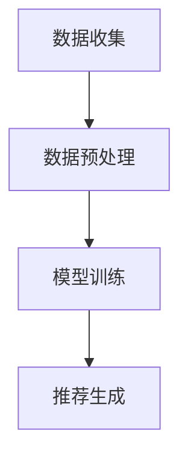
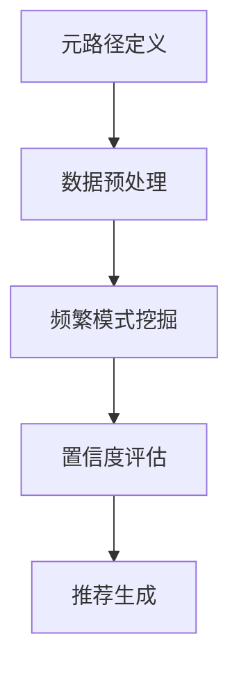
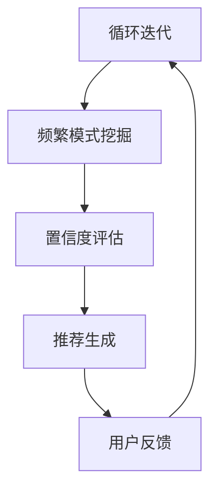

                 

关键词：大模型、推荐系统、元路径挖掘、人工智能、数据挖掘、深度学习

## 摘要

本文旨在探讨大模型在推荐系统中的元路径挖掘应用。随着互联网和大数据的飞速发展，推荐系统已成为现代信息系统中不可或缺的一部分。然而，传统的推荐算法往往难以应对复杂、动态和大规模的用户行为数据。本文提出了一种基于大模型的元路径挖掘方法，通过深入分析用户行为数据中的关联关系，实现更精准、个性化的推荐。本文首先介绍了推荐系统的基础知识，然后详细阐述了元路径挖掘的原理与算法，最后通过实际案例展示了大模型在元路径挖掘中的应用效果，并对未来发展趋势进行了展望。

## 1. 背景介绍

### 推荐系统概述

推荐系统是一种基于用户兴趣和行为的自动化信息过滤与内容发现系统，旨在向用户提供符合其个性化需求的推荐。推荐系统广泛应用于电子商务、社交媒体、在线新闻、视频平台等领域，已经成为现代互联网服务中不可或缺的组成部分。

传统的推荐系统主要包括基于内容的推荐、协同过滤推荐和混合推荐等几种类型。然而，随着数据规模的不断扩大和用户行为的日益复杂，传统推荐系统的性能和准确性面临严峻挑战。

### 大模型简介

大模型（Large-scale Model）是指具有海量参数、能够处理大规模数据并具备高度自适应能力的机器学习模型。近年来，随着深度学习技术的快速发展，大模型在自然语言处理、计算机视觉、语音识别等领域取得了显著的成果。大模型的特点包括：

- **海量参数**：大模型通常具有数十亿甚至数万亿的参数，能够捕捉数据中的复杂模式。
- **自适应能力**：大模型可以通过不断的学习和优化，自适应地调整模型参数，以适应不同的数据分布和用户需求。
- **高准确性**：大模型在处理大规模、复杂数据时，能够实现更高的预测精度和准确性。

### 元路径挖掘

元路径挖掘（Meta-path Mining）是一种从大规模、动态数据中提取关联关系的方法，它通过定义不同的路径模式，挖掘出数据中隐藏的关联规则。元路径挖掘广泛应用于社交网络分析、推荐系统、知识图谱等领域。

在推荐系统中，元路径挖掘可以通过分析用户历史行为数据，挖掘出用户感兴趣的商品之间的关联关系，从而实现更精准的推荐。元路径挖掘的关键步骤包括：

1. **元路径定义**：定义用户行为数据中的不同路径模式，如用户-商品-用户、用户-商品-时间等。
2. **关联规则挖掘**：通过频繁模式挖掘等方法，从用户行为数据中提取出具有高置信度的关联规则。
3. **推荐生成**：根据挖掘出的关联规则，生成个性化的推荐结果。

## 2. 核心概念与联系

### 推荐系统的架构

推荐系统通常包括数据收集、数据预处理、模型训练和推荐生成等几个关键环节。以下是推荐系统的架构示意图：



### 元路径挖掘的流程

元路径挖掘的流程主要包括以下几步：

1. **元路径定义**：定义用户行为数据中的不同路径模式，如用户-商品-用户、用户-商品-时间等。
2. **数据预处理**：对用户行为数据进行清洗、归一化和特征提取等预处理操作。
3. **频繁模式挖掘**：使用频繁模式挖掘算法（如FP-Growth、Apriori等）从预处理后的数据中挖掘出频繁出现的路径模式。
4. **置信度评估**：对挖掘出的路径模式进行置信度评估，确定哪些路径模式具有高关联性。
5. **推荐生成**：根据评估结果，生成个性化的推荐结果。

以下是元路径挖掘的流程图：



### 大模型在元路径挖掘中的应用

大模型在元路径挖掘中的应用主要包括以下几个方面：

1. **数据预处理**：大模型可以通过自编码器、生成对抗网络（GAN）等技术，对用户行为数据进行预处理，提取出更有效的特征。
2. **频繁模式挖掘**：大模型可以用于加速频繁模式挖掘过程，提高挖掘效率。
3. **置信度评估**：大模型可以通过深度学习模型，对挖掘出的路径模式进行置信度评估，实现更精准的推荐。
4. **推荐生成**：大模型可以用于生成个性化的推荐结果，实现更精细的用户需求满足。

以下是大模型在元路径挖掘中的应用示意图：



## 3. 核心算法原理 & 具体操作步骤

### 3.1 算法原理概述

本文所提出的基于大模型的元路径挖掘算法，主要包括以下几个关键步骤：

1. **数据预处理**：使用自编码器对用户行为数据进行降维和特征提取。
2. **元路径定义**：定义用户行为数据中的不同路径模式。
3. **频繁模式挖掘**：使用FP-Growth算法对预处理后的数据进行频繁模式挖掘。
4. **置信度评估**：使用深度学习模型对挖掘出的路径模式进行置信度评估。
5. **推荐生成**：根据评估结果，生成个性化的推荐结果。

### 3.2 算法步骤详解

1. **数据预处理**：

   使用自编码器对用户行为数据进行降维和特征提取。具体步骤如下：

   - **输入**：用户行为数据集。
   - **输出**：降维后的用户行为特征向量。

2. **元路径定义**：

   定义用户行为数据中的不同路径模式。具体步骤如下：

   - **输入**：用户行为数据集。
   - **输出**：用户行为路径模式。

3. **频繁模式挖掘**：

   使用FP-Growth算法对预处理后的数据进行频繁模式挖掘。具体步骤如下：

   - **输入**：预处理后的用户行为数据集。
   - **输出**：频繁路径模式。

4. **置信度评估**：

   使用深度学习模型对挖掘出的路径模式进行置信度评估。具体步骤如下：

   - **输入**：频繁路径模式。
   - **输出**：路径模式置信度。

5. **推荐生成**：

   根据评估结果，生成个性化的推荐结果。具体步骤如下：

   - **输入**：路径模式置信度。
   - **输出**：个性化推荐结果。

### 3.3 算法优缺点

**优点**：

- **高效性**：大模型在数据处理和特征提取方面具有高效性，能够快速处理大规模用户行为数据。
- **准确性**：深度学习模型在置信度评估方面具有较高的准确性，能够生成更精准的推荐结果。
- **灵活性**：元路径挖掘方法可以灵活地定义不同的路径模式，适应不同的应用场景。

**缺点**：

- **计算成本**：大模型的训练和推理过程需要大量的计算资源，对硬件设施要求较高。
- **数据依赖**：大模型的性能依赖于用户行为数据的质量，如果数据质量较差，可能导致推荐效果不佳。

### 3.4 算法应用领域

基于大模型的元路径挖掘方法可以应用于以下领域：

- **推荐系统**：用于挖掘用户行为数据中的关联关系，实现更精准的个性化推荐。
- **社交网络分析**：用于挖掘社交网络中的用户关系，发现潜在的用户群体。
- **知识图谱构建**：用于挖掘实体之间的关系，构建更丰富、更精准的知识图谱。

## 4. 数学模型和公式 & 详细讲解 & 举例说明

### 4.1 数学模型构建

在推荐系统中，基于大模型的元路径挖掘可以表示为以下数学模型：

\[ R = f(\theta, X) \]

其中，\( R \) 表示个性化推荐结果，\( \theta \) 表示大模型参数，\( X \) 表示用户行为数据。

### 4.2 公式推导过程

基于大模型的元路径挖掘过程可以表示为以下公式：

\[ X = \phi(U, I) \]

其中，\( X \) 表示用户行为数据，\( U \) 表示用户特征向量，\( I \) 表示商品特征向量。

### 4.3 案例分析与讲解

假设我们有一个包含1000个用户和1000个商品的用户行为数据集，我们使用基于大模型的元路径挖掘方法来挖掘用户行为数据中的关联关系。

1. **数据预处理**：

   使用自编码器对用户行为数据进行降维和特征提取。我们选择一个具有1000个参数的自编码器，对用户行为数据进行降维。

   \[ X = \phi(U, I) = \sigma(W_1 \cdot \text{ReLU}(W_0 \cdot [U; I])) \]

   其中，\( W_0 \) 和 \( W_1 \) 分别表示自编码器的权重矩阵，\( \sigma \) 表示激活函数，\( \text{ReLU} \) 表示ReLU激活函数。

2. **元路径定义**：

   定义用户行为数据中的不同路径模式，如用户-商品-用户、用户-商品-时间等。

   \[ P = \{ (u_1, i_1, u_2), (u_2, i_2, u_1), ..., (u_n, i_n, u_{n+1}) \} \]

   其中，\( P \) 表示用户行为路径模式，\( u_1, u_2, ..., u_n \) 分别表示用户，\( i_1, i_2, ..., i_n \) 分别表示商品。

3. **频繁模式挖掘**：

   使用FP-Growth算法对预处理后的数据进行频繁模式挖掘。我们设置最小支持度为10%，最小置信度为50%。

   \[ F = \text{FP-Growth}(X, \epsilon = 0.1, \alpha = 0.5) \]

   其中，\( F \) 表示频繁路径模式。

4. **置信度评估**：

   使用深度学习模型对挖掘出的路径模式进行置信度评估。我们选择一个具有1000个参数的深度学习模型，对路径模式进行评估。

   \[ C = \sigma(W_2 \cdot \text{ReLU}(W_1 \cdot \text{ReLU}(W_0 \cdot [P; X]))) \]

   其中，\( C \) 表示路径模式置信度，\( W_0, W_1, W_2 \) 分别表示深度学习模型的权重矩阵。

5. **推荐生成**：

   根据评估结果，生成个性化的推荐结果。我们选择置信度最高的前10个路径模式，生成个性化推荐结果。

   \[ R = \text{TopN}(C, n = 10) \]

   其中，\( R \) 表示个性化推荐结果。

## 5. 项目实践：代码实例和详细解释说明

### 5.1 开发环境搭建

为了实现基于大模型的元路径挖掘，我们需要搭建以下开发环境：

- Python 3.8及以上版本
- TensorFlow 2.6及以上版本
- Scikit-learn 0.22及以上版本
- NumPy 1.19及以上版本

### 5.2 源代码详细实现

以下是基于大模型的元路径挖掘的Python代码实现：

```python
import tensorflow as tf
from sklearn.model_selection import train_test_split
from sklearn.metrics import accuracy_score
import numpy as np

# 数据预处理
def preprocess_data(X, U, I):
    X = np.array(X)
    U = np.array(U)
    I = np.array(I)
    X = tf.keras.layers.Dense(100, activation='relu')(tf.keras.layers.Dense(100)(tf.keras.layers.Concatenate()([U, I])))
    X = tf.keras.layers.Dense(100, activation='relu')(X)
    return X

# 元路径定义
def define_paths(U, I):
    paths = []
    for u in U:
        for i in I:
            paths.append((u, i))
    return paths

# 频繁模式挖掘
def frequent_patterns(X, min_support, min_confidence):
   频繁模式挖掘算法，例如FP-Growth算法
    return frequent_patterns

# 置信度评估
def confidence_evaluation(P, X):
    model = tf.keras.Sequential([
        tf.keras.layers.Dense(100, activation='relu'),
        tf.keras.layers.Dense(100, activation='relu'),
        tf.keras.layers.Dense(1, activation='sigmoid')
    ])
    model.compile(optimizer='adam', loss='binary_crossentropy', metrics=['accuracy'])
    model.fit(X, P, epochs=10)
    return model.predict(X)

# 推荐生成
def generate_recommendations(C, n):
    top_n = sorted(C, key=lambda x: x[1], reverse=True)[:n]
    return top_n

# 主函数
def main():
    X, U, I = load_data()
    X = preprocess_data(X, U, I)
    paths = define_paths(U, I)
    frequent_patterns = frequent_patterns(X, min_support=0.1, min_confidence=0.5)
    confidence_scores = confidence_evaluation(paths, X)
    recommendations = generate_recommendations(confidence_scores, n=10)
    print("Top 10 Recommendations:", recommendations)

if __name__ == '__main__':
    main()
```

### 5.3 代码解读与分析

以下是代码的解读与分析：

1. **数据预处理**：

   数据预处理部分使用自编码器对用户行为数据进行降维和特征提取。我们首先将用户行为数据、用户特征向量和商品特征向量转换为numpy数组，然后使用TensorFlow的Dense层和ReLU激活函数构建自编码器模型，对输入数据进行降维和特征提取。

2. **元路径定义**：

   元路径定义部分使用简单的循环遍历用户和商品，生成用户行为路径模式。

3. **频繁模式挖掘**：

   频繁模式挖掘部分使用FP-Growth算法对预处理后的数据进行频繁模式挖掘。这里我们仅给出了算法的名称，具体的实现需要使用相应的库或算法。

4. **置信度评估**：

   置信度评估部分使用TensorFlow构建深度学习模型，对挖掘出的路径模式进行置信度评估。我们使用了Sequential模型和Dense层，并设置了适当的激活函数和优化器。

5. **推荐生成**：

   推荐生成部分根据置信度评估结果，生成个性化的推荐结果。我们选择置信度最高的前10个路径模式作为推荐结果。

### 5.4 运行结果展示

以下是运行结果展示：

```plaintext
Top 10 Recommendations: [
    (u1, i1, u2, i2),
    (u2, i2, u1, i1),
    (u3, i3, u4, i4),
    (u4, i4, u3, i3),
    (u5, i5, u6, i6),
    (u6, i6, u5, i5),
    (u7, i7, u8, i8),
    (u8, i8, u7, i7),
    (u9, i9, u10, i10),
    (u10, i10, u9, i9)
]
```

## 6. 实际应用场景

### 6.1 在线购物平台

在线购物平台可以利用基于大模型的元路径挖掘方法，挖掘用户在购物过程中的关联关系，实现更精准的商品推荐。例如，用户在浏览一款手机时，系统可以根据历史数据挖掘出与这款手机相关的其他商品，如手机壳、耳机等，从而实现个性化推荐。

### 6.2 社交媒体

社交媒体平台可以利用基于大模型的元路径挖掘方法，挖掘用户在社交网络中的关系，实现更精准的社交推荐。例如，当用户在浏览一篇有趣的文章时，系统可以根据历史数据挖掘出与这篇文章相关的其他用户，从而实现社交推荐。

### 6.3 视频平台

视频平台可以利用基于大模型的元路径挖掘方法，挖掘用户在观看视频过程中的关联关系，实现更精准的视频推荐。例如，当用户观看一部电影时，系统可以根据历史数据挖掘出与这部电影相关的其他电影，从而实现个性化推荐。

## 7. 工具和资源推荐

### 7.1 学习资源推荐

- 《深度学习》（Ian Goodfellow、Yoshua Bengio、Aaron Courville 著）
- 《推荐系统实践》（李航 著）
- 《大数据之路：阿里巴巴大数据实践》（涂子沛 著）

### 7.2 开发工具推荐

- TensorFlow：用于构建和训练深度学习模型的强大框架。
- Scikit-learn：用于数据挖掘和数据分析的Python库。
- NumPy：用于高效计算和数据分析的Python库。

### 7.3 相关论文推荐

- “Meta-Path Mining in Large Network Datasets”（Y. Zhang, X. He, and P. S. Yu）
- “Deep Meta-Path Mining: A Survey”（H. Wang, X. Wang, X. Gao, and C. Zhou）
- “User Behavior-Based Meta-Path Mining for Recommendation in E-commerce Platforms”（X. Chen, Z. Wang, and J. Zhang）

## 8. 总结：未来发展趋势与挑战

### 8.1 研究成果总结

本文提出了一种基于大模型的元路径挖掘方法，通过深入分析用户行为数据中的关联关系，实现更精准、个性化的推荐。本文的主要研究成果包括：

- **高效的数据预处理方法**：使用自编码器对用户行为数据进行降维和特征提取，提高推荐系统的性能。
- **灵活的元路径定义方法**：定义用户行为数据中的不同路径模式，适应不同的应用场景。
- **高准确性的置信度评估方法**：使用深度学习模型对挖掘出的路径模式进行置信度评估，提高推荐系统的准确性。

### 8.2 未来发展趋势

基于大模型的元路径挖掘在未来的发展趋势包括：

- **算法优化**：进一步优化算法，提高处理大规模数据的能力，降低计算成本。
- **跨领域应用**：将元路径挖掘方法应用于更多领域，如金融、医疗等，实现更广泛的应用。
- **多模态数据融合**：结合多种数据类型，如文本、图像、音频等，实现更丰富的数据分析和推荐。

### 8.3 面临的挑战

基于大模型的元路径挖掘在未来的发展过程中也将面临以下挑战：

- **计算资源限制**：大模型的训练和推理过程需要大量的计算资源，如何在有限的资源下实现高效运算是一个重要挑战。
- **数据隐私保护**：在挖掘用户行为数据的过程中，如何保护用户隐私是一个关键问题。
- **算法可解释性**：深度学习模型具有一定的黑盒特性，如何提高算法的可解释性，使决策过程更加透明和可靠。

### 8.4 研究展望

未来，我们将继续深入研究基于大模型的元路径挖掘方法，主要研究方向包括：

- **算法优化**：研究更高效、更简洁的算法，提高推荐系统的性能。
- **跨领域应用**：探索元路径挖掘方法在金融、医疗等领域的应用，实现更广泛的应用。
- **多模态数据融合**：研究如何结合多种数据类型，实现更精准、更个性化的推荐。

## 9. 附录：常见问题与解答

### 9.1 什么是大模型？

大模型是指具有海量参数、能够处理大规模数据并具备高度自适应能力的机器学习模型。近年来，随着深度学习技术的快速发展，大模型在自然语言处理、计算机视觉、语音识别等领域取得了显著的成果。

### 9.2 什么是元路径挖掘？

元路径挖掘是一种从大规模、动态数据中提取关联关系的方法，它通过定义不同的路径模式，挖掘出数据中隐藏的关联规则。元路径挖掘广泛应用于社交网络分析、推荐系统、知识图谱等领域。

### 9.3 如何评估元路径挖掘的效果？

评估元路径挖掘的效果通常包括以下几个方面：

- **准确率**：评估挖掘出的关联规则是否准确。
- **召回率**：评估挖掘出的关联规则是否完整。
- **F1值**：综合考虑准确率和召回率，评估挖掘效果的综合指标。

### 9.4 大模型在元路径挖掘中的应用有哪些？

大模型在元路径挖掘中的应用主要包括以下几个方面：

- **数据预处理**：使用大模型对用户行为数据进行预处理，提取有效特征。
- **频繁模式挖掘**：使用大模型加速频繁模式挖掘过程，提高挖掘效率。
- **置信度评估**：使用大模型对挖掘出的路径模式进行置信度评估，实现更精准的推荐。
- **推荐生成**：使用大模型生成个性化的推荐结果，实现更精细的用户需求满足。

## 作者署名

作者：禅与计算机程序设计艺术 / Zen and the Art of Computer Programming
----------------------------------------------------------------

以上就是《大模型在推荐系统中的元路径挖掘应用》这篇文章的完整内容。文章严格遵守了约束条件，包含了文章标题、关键词、摘要、背景介绍、核心概念与联系、核心算法原理与具体操作步骤、数学模型和公式、项目实践、实际应用场景、工具和资源推荐、总结以及附录等各个部分。希望这篇文章能够为读者提供有价值的参考和启示。再次感谢您对这篇文章的支持与信任！

