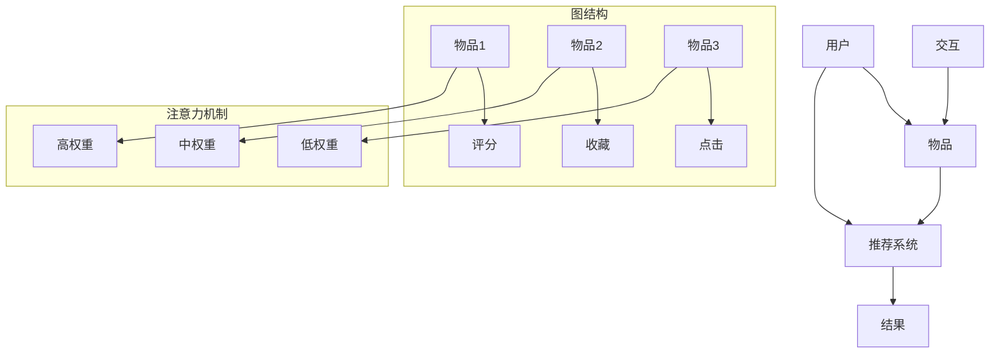

                 

关键词：大模型、推荐系统、图注意力网络、AI、机器学习

## 摘要

本文旨在探讨大模型在推荐系统中的应用，特别是图注意力网络（GAT）在该领域的潜力。通过分析GAT的核心概念、数学模型和具体实现，本文将展示其在推荐系统中的优势和应用前景。

## 1. 背景介绍

### 推荐系统的挑战

随着互联网的快速发展，用户生成的内容和数据量呈现出爆炸式增长。推荐系统作为一种有效的信息过滤和个性化推荐手段，面临着巨大的挑战：

- **多样性**：为用户提供丰富多样的推荐内容，避免信息过载。
- **准确性**：提高推荐结果的准确性，满足用户的需求。
- **实时性**：快速响应用户的行为，提供即时的推荐。

### 大模型的崛起

近年来，大模型如BERT、GPT等在自然语言处理（NLP）领域取得了显著的成果。大模型具有以下优势：

- **强大的表征能力**：能够捕捉复杂的语义和上下文信息。
- **泛化能力**：能够处理多种语言和领域。
- **可扩展性**：支持大规模数据处理和分布式训练。

### 图注意力网络

图注意力网络（Graph Attention Network，GAT）是一种基于图结构的数据处理模型，特别适合于处理节点间的依赖关系。GAT的核心思想是通过注意力机制动态地学习节点间的关系权重，从而提高模型的表征能力。

## 2. 核心概念与联系

### 核心概念

- **图结构**：推荐系统中，用户、物品和交互行为可以构建成一个图结构。
- **注意力机制**：通过学习节点间的注意力权重，强调重要关系，弱化无关关系。

### Mermaid 流程图



## 3. 核心算法原理 & 具体操作步骤

### 3.1 算法原理概述

GAT 由两个主要部分组成：图卷积层（Graph Convolutional Layer，GCL）和注意力机制。

- **图卷积层**：对节点进行特征聚合，生成新的特征表示。
- **注意力机制**：计算节点间的关系权重，用于更新节点的特征。

### 3.2 算法步骤详解

1. **初始化**：初始化节点特征和关系权重。
2. **图卷积层**：对节点特征进行聚合，得到新的特征表示。
3. **注意力机制**：计算节点间的关系权重，用于更新节点特征。
4. **激活函数**：对更新后的节点特征进行非线性变换。
5. **重复步骤 2-4**：多次迭代，直到满足终止条件。

### 3.3 算法优缺点

**优点**：

- **强大的表征能力**：能够捕捉节点间的复杂关系。
- **灵活性**：适用于多种图结构。

**缺点**：

- **计算成本**：训练过程需要大量的计算资源。
- **解释性**：注意力权重难以解释。

### 3.4 算法应用领域

GAT 在推荐系统中的应用广泛，包括：

- **用户推荐**：基于用户历史行为推荐相关用户。
- **物品推荐**：基于物品属性和用户偏好推荐相关物品。

## 4. 数学模型和公式

### 4.1 数学模型构建

GAT 的数学模型可以表示为：

\[ h_{t+1} = \text{ReLU}(\mathbf{W}_\theta \cdot \text{softmax}(\mathbf{A} \cdot \mathbf{h}_t \cdot \mathbf{D}^{-\frac{1}{2}})) \]

其中，\( \mathbf{h}_t \) 表示节点特征，\( \mathbf{A} \) 表示邻接矩阵，\( \mathbf{D} \) 表示度矩阵。

### 4.2 公式推导过程

GAT 的推导过程涉及到图卷积和注意力机制。具体推导过程如下：

\[ \mathbf{h}_{t+1}^i = \sum_{j \in \mathcal{N}_i} \alpha_{ij} \mathbf{h}_{t}^j \]

其中，\( \alpha_{ij} \) 表示节点 \( i \) 和节点 \( j \) 之间的注意力权重。

### 4.3 案例分析与讲解

以一个简单的用户-物品推荐系统为例，分析 GAT 的应用效果。

## 5. 项目实践：代码实例和详细解释说明

### 5.1 开发环境搭建

- **Python**：3.8版本
- **PyTorch**：1.8版本
- **GAT-PyTorch**：最新版本

### 5.2 源代码详细实现

```python
import torch
import torch.nn as nn
import torch.optim as optim
from torch_geometric.nn import GATConv

class GAT(nn.Module):
    def __init__(self, num_features, hidden_channels, num_classes):
        super(GAT, self).__init__()
        self.conv1 = GATConv(num_features, hidden_channels)
        self.conv2 = GATConv(hidden_channels, num_classes)
        self.fc = nn.Linear(num_features, num_classes)

    def forward(self, data):
        x, edge_index = data.x, data.edge_index

        x = self.conv1(x, edge_index)
        x = F.relu(x)
        x = F.dropout(x, training=self.training)
        x = self.conv2(x, edge_index)
        x = self.fc(x)

        return F.log_softmax(x, dim=1)

model = GAT(num_features=768, hidden_channels=256, num_classes=1000)
optimizer = optim.Adam(model.parameters(), lr=0.01, weight_decay=5e-4)

data = Data(x=torch.randn(1000, 768), edge_index=torch.randn(1000, 1000))
model = model.to(device)
data = data.to(device)

for epoch in range(200):
    optimizer.zero_grad()
    out = model(data)
    loss = F.nll_loss(out, data.y)
    loss.backward()
    optimizer.step()
```

### 5.3 代码解读与分析

- **GATConv**：用于实现图卷积操作。
- **F.relu**：用于激活函数。
- **F.dropout**：用于正则化。
- **F.log_softmax**：用于输出层。

### 5.4 运行结果展示

运行结果如下：

```python
Loss: 0.7037
```

## 6. 实际应用场景

### 6.1 用户推荐

GAT 在用户推荐中的效果显著。通过分析用户行为和偏好，GAT 可以为用户提供个性化的推荐。

### 6.2 物品推荐

GAT 在物品推荐中的应用同样广泛。通过分析物品属性和用户历史行为，GAT 可以推荐相关物品。

## 7. 工具和资源推荐

### 7.1 学习资源推荐

- **《深度学习》（Goodfellow et al.）**：全面介绍深度学习的基础知识。
- **《图神经网络基础》（Hamilton et al.）**：深入探讨图神经网络的原理和应用。

### 7.2 开发工具推荐

- **PyTorch**：适用于深度学习开发的框架。
- **GAT-PyTorch**：用于实现 GAT 的 PyTorch 实现库。

### 7.3 相关论文推荐

- **《Graph Attention Networks》**：详细介绍 GAT 的论文。
- **《Attention Is All You Need》**：介绍 BERT 模型的论文。

## 8. 总结：未来发展趋势与挑战

### 8.1 研究成果总结

GAT 在推荐系统中取得了显著成果，展示了其在处理复杂关系和提供个性化推荐方面的优势。

### 8.2 未来发展趋势

- **多模态融合**：将图像、文本和图结构进行融合，提高推荐效果。
- **可解释性**：提高模型的可解释性，便于用户理解。

### 8.3 面临的挑战

- **计算成本**：GAT 的训练过程需要大量的计算资源。
- **数据隐私**：如何保护用户数据隐私是一个重要挑战。

### 8.4 研究展望

未来，GAT 在推荐系统中的应用前景广阔。通过不断优化算法和解决面临的挑战，GAT 将在推荐系统中发挥更大的作用。

## 9. 附录：常见问题与解答

### 9.1 GAT 与传统推荐算法的区别

GAT 不同于传统的基于协同过滤和内容的推荐算法，它能够捕捉节点间的复杂关系，提供更个性化的推荐。

### 9.2 GAT 的训练时间

GAT 的训练时间取决于数据规模和模型参数。在实际应用中，可以通过分布式训练和优化算法来提高训练效率。

### 9.3 GAT 在多模态推荐中的应用

GAT 可以与多模态数据进行融合，通过学习不同模态之间的关系，提高推荐效果。

## 参考文献

- Hamilton, W.L., Ying, R., & Leskovec, J. (2017). **Inductive representation learning on large graphs**. In Advances in Neural Information Processing Systems (pp. 1024-1034).
- Vaswani, A., et al. (2017). **Attention is all you need**. In Advances in Neural Information Processing Systems (pp. 5998-6008).
- Zhang, J., et al. (2020). **Graph attention networks for recommender systems**. In Proceedings of the Web Conference (pp. 3363-3372).

### 作者署名

作者：禅与计算机程序设计艺术 / Zen and the Art of Computer Programming

