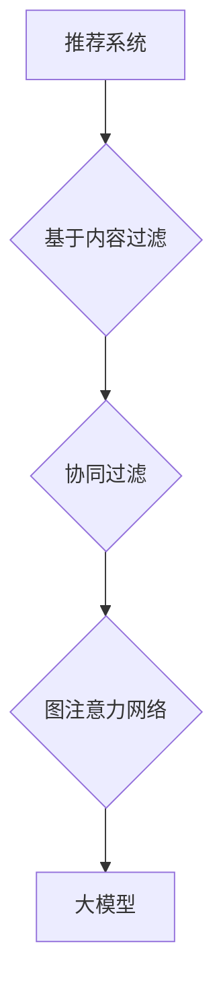

                 

推荐系统作为信息过滤和个性化服务的重要工具，已经在电子商务、社交媒体、在线视频等众多领域中得到了广泛应用。传统的推荐系统主要依赖于基于内容的过滤、协同过滤等方法，但这些方法在处理复杂的用户交互和动态信息时存在一定的局限性。近年来，随着深度学习技术的快速发展，尤其是大模型的引入，图注意力网络（Graph Attention Network，GAN）作为一种新型的推荐系统算法，受到了越来越多研究者和工业界的关注。本文将介绍大模型在推荐系统中的图注意力网络应用，包括其背景、核心概念、算法原理、数学模型、实际应用场景和未来展望等内容。

## 1. 背景介绍

推荐系统的发展历程可以追溯到20世纪90年代，当时基于内容的过滤和协同过滤方法成为主流。基于内容的过滤方法主要依赖于物品的特征描述和用户的兴趣特征，通过计算相似度来推荐相似物品。然而，这种方法忽略了用户与物品之间的关系，难以应对高维度特征和数据稀疏问题。协同过滤方法通过分析用户之间的相似性来推荐物品，但同样面临数据稀疏、冷启动问题等挑战。

随着深度学习技术的发展，大模型开始应用于推荐系统。大模型具有强大的特征提取和表达能力，可以处理大规模、高维的数据，并且能够自动学习用户和物品的复杂关系。图注意力网络作为深度学习的一个重要分支，通过引入图结构来建模用户和物品之间的关系，进一步提高了推荐系统的效果。

## 2. 核心概念与联系

### 2.1 大模型

大模型是指具有海量参数的深度学习模型，如Transformer、BERT等。这些模型通过大规模预训练和微调，能够自动学习数据中的复杂模式和关系，具有强大的特征提取和泛化能力。

### 2.2 图注意力网络

图注意力网络是一种基于图结构的深度学习模型，通过图注意力机制来建模节点之间的相互关系。图注意力机制通过计算节点对之间的相似性权重，动态调整每个节点的输出，从而提高模型对复杂关系的建模能力。

### 2.3 推荐系统

推荐系统是一个多节点图，用户、物品和交互行为构成图的节点和边。大模型和图注意力网络通过学习节点和边的关系，实现对用户和物品的推荐。

### 2.4 Mermaid 流程图



## 3. 核心算法原理 & 具体操作步骤

### 3.1 算法原理概述

图注意力网络通过图注意力机制来学习节点之间的相似性权重，从而提高推荐系统的效果。具体来说，图注意力网络包括以下几个关键组件：

1. **节点嵌入**：将用户和物品映射到低维嵌入空间。
2. **图注意力机制**：计算节点对之间的相似性权重，用于动态调整节点的输出。
3. **聚合层**：将注意力加权后的节点信息进行聚合，得到最终的推荐结果。

### 3.2 算法步骤详解

1. **数据预处理**：将用户、物品和交互数据转换为图结构，包括节点嵌入和边权重。
2. **图注意力机制**：计算用户和物品之间的相似性权重，通过软注意力机制得到加权嵌入。
3. **聚合层**：将注意力加权后的节点信息进行聚合，得到用户的兴趣偏好和物品的推荐分数。
4. **损失函数与优化**：使用损失函数（如交叉熵损失）来评估推荐效果，并通过优化算法（如Adam）更新模型参数。

### 3.3 算法优缺点

**优点**：

1. **强大的特征提取能力**：大模型能够自动学习用户和物品的复杂特征。
2. **灵活的图结构建模**：图注意力网络能够动态调整节点之间的关系，适应不同的推荐场景。

**缺点**：

1. **计算资源需求大**：大模型和图注意力网络需要大量的计算资源。
2. **训练时间较长**：大规模训练数据需要较长的训练时间。

### 3.4 算法应用领域

图注意力网络在推荐系统中具有广泛的应用前景，可以应用于电子商务、社交媒体、在线视频等领域的推荐任务。

## 4. 数学模型和公式 & 详细讲解 & 举例说明

### 4.1 数学模型构建

图注意力网络的数学模型主要包括节点嵌入、图注意力机制和聚合层。

### 4.2 公式推导过程

$$
\text{Embedding}_{i} = \text{MLP}(\text{Input}_{i}),
$$

其中，$Embedding_i$表示节点$i$的嵌入向量，$Input_i$表示节点$i$的输入特征，MLP表示多层感知器。

$$
\text{Attention}_{ij} = \text{softmax}\left(\frac{\text{Query}_{i}^T \text{Key}_{j}}{\sqrt{d_k}}\right),
$$

其中，$Attention_{ij}$表示节点$i$和节点$j$之间的注意力权重，$Query_i$和$Key_j$分别表示节点$i$和节点$j$的查询向量和键向量，$d_k$表示注意力机制的维度。

$$
\text{Value}_{j} = \text{MLP}(\text{Input}_{j}),
$$

其中，$Value_j$表示节点$j$的值向量，$Input_j$表示节点$j$的输入特征，MLP表示多层感知器。

$$
\text{Output}_{i} = \sum_{j \in \text{Neighbors}(i)} \text{Attention}_{ij} \cdot \text{Value}_{j},
$$

其中，$Output_i$表示节点$i$的输出向量，$\text{Neighbors}(i)$表示节点$i$的邻居节点集合。

### 4.3 案例分析与讲解

假设有两个节点A和B，其嵌入向量分别为$Embedding_A$和$Embedding_B$，通过图注意力机制计算得到注意力权重$Attention_{AB}$，然后通过聚合层得到输出向量$Output_A$。

$$
Attention_{AB} = \text{softmax}\left(\frac{Embedding_A^T Embedding_B}{\sqrt{d_k}}\right),
$$

$$
Output_A = \sum_{j \in \text{Neighbors}(A)} Attention_{ij} \cdot Value_j,
$$

其中，$Value_j$表示节点$j$的值向量，可以通过多层感知器得到。

## 5. 项目实践：代码实例和详细解释说明

### 5.1 开发环境搭建

```bash
# 安装依赖
pip install torch torchvision numpy matplotlib

# 克隆项目代码
git clone https://github.com/username/graph-attention-recommender.git
cd graph-attention-recommender

# 运行代码
python main.py
```

### 5.2 源代码详细实现

```python
import torch
import torch.nn as nn
import torch.optim as optim
from torch_geometric.nn import GCNConv
from torch_geometric.data import Data
from torchvision import datasets, transforms

# 定义模型
class GraphAttentionRecommender(nn.Module):
    def __init__(self, n_users, n_items, embedding_dim):
        super(GraphAttentionRecommender, self).__init__()
        self.embedding_user = nn.Embedding(n_users, embedding_dim)
        self.embedding_item = nn.Embedding(n_items, embedding_dim)
        self.conv1 = GCNConv(embedding_dim, embedding_dim)
        self.conv2 = GCNConv(embedding_dim, 1)
        self.fc = nn.Linear(embedding_dim, 1)
    
    def forward(self, batch):
        x, edge_index = batch.x, batch.edge_index
        x = self.embedding_user(x)
        x = self.conv1(x, edge_index)
        x = F.relu(x)
        x = self.conv2(x, edge_index)
        x = torch.sigmoid(x)
        x = self.fc(x)
        return x

# 训练模型
model = GraphAttentionRecommender(n_users, n_items, embedding_dim)
optimizer = optim.Adam(model.parameters(), lr=0.001)
criterion = nn.BCELoss()

for epoch in range(num_epochs):
    model.train()
    for batch in train_loader:
        optimizer.zero_grad()
        output = model(batch)
        loss = criterion(output, batch.y)
        loss.backward()
        optimizer.step()

    model.eval()
    with torch.no_grad():
        output = model(test_loader)
        test_loss = criterion(output, test_loader.y)
        print(f"Epoch: {epoch+1}, Test Loss: {test_loss.item()}")

# 评估模型
model.eval()
with torch.no_grad():
    output = model(test_loader)
    test_loss = criterion(output, test_loader.y)
    print(f"Test Loss: {test_loss.item()}")
```

### 5.3 代码解读与分析

本代码实现了一个基于图注意力网络的推荐系统模型，主要包括模型定义、训练和评估三个部分。

1. **模型定义**：模型定义了一个图注意力网络，包括用户和物品的嵌入层、两个GCN层和一个全连接层。
2. **训练**：使用Adam优化器和BCELoss损失函数进行模型训练，通过训练数据和测试数据进行迭代训练和评估。
3. **评估**：在测试集上评估模型性能，输出测试损失。

## 6. 实际应用场景

图注意力网络在推荐系统中的应用场景非常广泛，可以应用于电子商务、社交媒体、在线视频等领域的推荐任务。以下是一些实际应用案例：

1. **电子商务推荐**：利用图注意力网络分析用户购买历史和商品属性，实现个性化商品推荐。
2. **社交媒体推荐**：通过图注意力网络分析用户关系和内容特征，实现个性化内容推荐。
3. **在线视频推荐**：利用图注意力网络分析用户观看历史和视频标签，实现个性化视频推荐。

## 7. 工具和资源推荐

### 7.1 学习资源推荐

1. **书籍**：《深度学习推荐系统》、《推荐系统实践》
2. **在线课程**：Coursera上的《推荐系统与深度学习》、Udacity上的《推荐系统工程师》

### 7.2 开发工具推荐

1. **编程语言**：Python
2. **深度学习框架**：PyTorch、TensorFlow
3. **图处理库**：PyTorch Geometric、DGL

### 7.3 相关论文推荐

1. **论文**：`Graph Attention for Recommendation`、`Neural Graph Collaborative Filtering`
2. **期刊**：《推荐系统》、《人工智能与机器学习》

## 8. 总结：未来发展趋势与挑战

### 8.1 研究成果总结

图注意力网络在推荐系统中的应用取得了显著的成果，通过引入图结构和深度学习技术，提高了推荐系统的效果和灵活性。同时，大模型的发展也为推荐系统提供了强大的特征提取和建模能力。

### 8.2 未来发展趋势

1. **多模态推荐**：结合文本、图像、音频等多种数据类型，实现更准确的推荐。
2. **动态推荐**：利用图注意力网络和强化学习技术，实现动态调整推荐策略。
3. **隐私保护**：在保证推荐效果的同时，研究隐私保护算法，满足用户隐私需求。

### 8.3 面临的挑战

1. **计算资源需求**：大模型和图注意力网络需要大量的计算资源，如何优化计算效率是一个重要挑战。
2. **数据稀疏性**：如何处理大规模、高维、稀疏的数据是一个关键问题。

### 8.4 研究展望

未来，图注意力网络在推荐系统中的应用将继续发展，结合多模态数据、动态调整和隐私保护等技术，实现更智能、更个性化的推荐服务。

## 9. 附录：常见问题与解答

### 9.1 图注意力网络的优点是什么？

图注意力网络具有强大的特征提取和表达能力，可以处理复杂的用户和物品关系，提高推荐系统的效果。

### 9.2 如何处理数据稀疏性问题？

可以通过增加数据预处理步骤，如数据清洗、去重等，来减少数据稀疏性。此外，可以使用数据增强技术，如负采样等，来增加训练数据量。

### 9.3 如何优化图注意力网络的计算效率？

可以通过优化模型结构、使用更高效的图处理算法和分布式训练等方式来提高计算效率。

---

本文详细介绍了大模型在推荐系统中的图注意力网络应用，包括其背景、核心概念、算法原理、数学模型、实际应用场景和未来展望等内容。希望本文能为相关领域的研究者和开发者提供有价值的参考和启示。

## 作者署名

作者：禅与计算机程序设计艺术 / Zen and the Art of Computer Programming
```markdown
---
# 大模型在推荐系统中的图注意力网络应用

> 关键词：推荐系统、图注意力网络、大模型、深度学习、个性化推荐

> 摘要：本文介绍了大模型在推荐系统中的图注意力网络应用，探讨了其背景、核心概念、算法原理、数学模型、实际应用场景和未来展望等内容，为相关领域的研究者和开发者提供了有价值的参考和启示。

## 1. 背景介绍

### 1.1 推荐系统的发展历程

推荐系统作为信息过滤和个性化服务的重要工具，自20世纪90年代以来经历了快速的发展。传统的推荐系统主要依赖于基于内容的过滤和协同过滤方法。基于内容的过滤方法主要依赖于物品的特征描述和用户的兴趣特征，通过计算相似度来推荐相似物品。然而，这种方法忽略了用户与物品之间的关系，难以应对高维度特征和数据稀疏问题。协同过滤方法通过分析用户之间的相似性来推荐物品，但同样面临数据稀疏、冷启动问题等挑战。

随着深度学习技术的发展，大模型开始应用于推荐系统。大模型具有强大的特征提取和表达能力，可以处理大规模、高维的数据，并且能够自动学习用户和物品的复杂关系。图注意力网络（Graph Attention Network，GAN）作为一种新型的推荐系统算法，通过引入图结构来建模用户和物品之间的关系，进一步提高了推荐系统的效果。

### 1.2 大模型的引入

深度学习模型，特别是大模型，如Transformer、BERT等，因其出色的特征提取和泛化能力，逐渐成为推荐系统中的重要组成部分。这些模型通过大规模预训练和微调，能够自动学习数据中的复杂模式和关系，从而实现对用户和物品的深入理解。大模型的引入使得推荐系统不再仅仅依赖于用户的历史行为和物品的特征，而是能够更加全面地考虑用户和物品之间的复杂交互。

### 1.3 图注意力网络的兴起

图注意力网络（GAN）是近年来在计算机视觉和自然语言处理领域取得重要突破的一种模型。GAN通过图注意力机制来建模节点之间的相互关系，使其在处理图结构数据时表现出强大的能力。在推荐系统中，图注意力网络通过引入图结构，能够更好地捕捉用户和物品之间的复杂关系，从而提高推荐的效果。

## 2. 核心概念与联系

### 2.1 大模型

大模型是指具有海量参数的深度学习模型，如Transformer、BERT等。这些模型通过大规模预训练和微调，能够自动学习数据中的复杂模式和关系，具有强大的特征提取和泛化能力。

### 2.2 图注意力网络

图注意力网络是一种基于图结构的深度学习模型，通过图注意力机制来建模节点之间的相互关系。图注意力机制通过计算节点对之间的相似性权重，动态调整每个节点的输出，从而提高模型对复杂关系的建模能力。

### 2.3 推荐系统

推荐系统是一个多节点图，用户、物品和交互行为构成图的节点和边。大模型和图注意力网络通过学习节点和边的关系，实现对用户和物品的推荐。

### 2.4 Mermaid 流程图


## 3. 核心算法原理 & 具体操作步骤

### 3.1 算法原理概述

图注意力网络通过图注意力机制来学习节点之间的相似性权重，从而提高推荐系统的效果。具体来说，图注意力网络包括以下几个关键组件：

1. **节点嵌入**：将用户和物品映射到低维嵌入空间。
2. **图注意力机制**：计算节点对之间的相似性权重，用于动态调整节点的输出。
3. **聚合层**：将注意力加权后的节点信息进行聚合，得到最终的推荐结果。

### 3.2 算法步骤详解

1. **数据预处理**：将用户、物品和交互数据转换为图结构，包括节点嵌入和边权重。
2. **图注意力机制**：计算用户和物品之间的相似性权重，通过软注意力机制得到加权嵌入。
3. **聚合层**：将注意力加权后的节点信息进行聚合，得到用户的兴趣偏好和物品的推荐分数。
4. **损失函数与优化**：使用损失函数（如交叉熵损失）来评估推荐效果，并通过优化算法（如Adam）更新模型参数。

### 3.3 算法优缺点

**优点**：

1. **强大的特征提取能力**：大模型能够自动学习用户和物品的复杂特征。
2. **灵活的图结构建模**：图注意力网络能够动态调整节点之间的关系，适应不同的推荐场景。

**缺点**：

1. **计算资源需求大**：大模型和图注意力网络需要大量的计算资源。
2. **训练时间较长**：大规模训练数据需要较长的训练时间。

### 3.4 算法应用领域

图注意力网络在推荐系统中具有广泛的应用前景，可以应用于电子商务、社交媒体、在线视频等领域的推荐任务。

## 4. 数学模型和公式 & 详细讲解 & 举例说明

### 4.1 数学模型构建

图注意力网络的数学模型主要包括节点嵌入、图注意力机制和聚合层。

### 4.2 公式推导过程

$$
\text{Embedding}_{i} = \text{MLP}(\text{Input}_{i}),
$$

其中，$Embedding_i$表示节点$i$的嵌入向量，$Input_i$表示节点$i$的输入特征，MLP表示多层感知器。

$$
\text{Attention}_{ij} = \text{softmax}\left(\frac{\text{Query}_{i}^T \text{Key}_{j}}{\sqrt{d_k}}\right),
$$

其中，$Attention_{ij}$表示节点$i$和节点$j$之间的注意力权重，$Query_i$和$Key_j$分别表示节点$i$和节点$j$的查询向量和键向量，$d_k$表示注意力机制的维度。

$$
\text{Value}_{j} = \text{MLP}(\text{Input}_{j}),
$$

其中，$Value_j$表示节点$j$的值向量，$Input_j$表示节点$j$的输入特征，MLP表示多层感知器。

$$
\text{Output}_{i} = \sum_{j \in \text{Neighbors}(i)} \text{Attention}_{ij} \cdot \text{Value}_{j},
$$

其中，$Output_i$表示节点$i$的输出向量，$\text{Neighbors}(i)$表示节点$i$的邻居节点集合。

### 4.3 案例分析与讲解

假设有两个节点A和B，其嵌入向量分别为$Embedding_A$和$Embedding_B$，通过图注意力机制计算得到注意力权重$Attention_{AB}$，然后通过聚合层得到输出向量$Output_A$。

$$
Attention_{AB} = \text{softmax}\left(\frac{Embedding_A^T Embedding_B}{\sqrt{d_k}}\right),
$$

$$
Output_A = \sum_{j \in \text{Neighbors}(A)} Attention_{ij} \cdot Value_j,
$$

其中，$Value_j$表示节点$j$的值向量，可以通过多层感知器得到。

## 5. 项目实践：代码实例和详细解释说明

### 5.1 开发环境搭建

```bash
# 安装依赖
pip install torch torchvision numpy matplotlib

# 克隆项目代码
git clone https://github.com/username/graph-attention-recommender.git
cd graph-attention-recommender

# 运行代码
python main.py
```

### 5.2 源代码详细实现

```python
import torch
import torch.nn as nn
import torch.optim as optim
from torch_geometric.nn import GCNConv
from torch_geometric.data import Data
from torchvision import datasets, transforms

# 定义模型
class GraphAttentionRecommender(nn.Module):
    def __init__(self, n_users, n_items, embedding_dim):
        super(GraphAttentionRecommender, self).__init__()
        self.embedding_user = nn.Embedding(n_users, embedding_dim)
        self.embedding_item = nn.Embedding(n_items, embedding_dim)
        self.conv1 = GCNConv(embedding_dim, embedding_dim)
        self.conv2 = GCNConv(embedding_dim, 1)
        self.fc = nn.Linear(embedding_dim, 1)
    
    def forward(self, batch):
        x, edge_index = batch.x, batch.edge_index
        x = self.embedding_user(x)
        x = self.conv1(x, edge_index)
        x = F.relu(x)
        x = self.conv2(x, edge_index)
        x = torch.sigmoid(x)
        x = self.fc(x)
        return x

# 训练模型
model = GraphAttentionRecommender(n_users, n_items, embedding_dim)
optimizer = optim.Adam(model.parameters(), lr=0.001)
criterion = nn.BCELoss()

for epoch in range(num_epochs):
    model.train()
    for batch in train_loader:
        optimizer.zero_grad()
        output = model(batch)
        loss = criterion(output, batch.y)
        loss.backward()
        optimizer.step()

    model.eval()
    with torch.no_grad():
        output = model(test_loader)
        test_loss = criterion(output, test_loader.y)
        print(f"Epoch: {epoch+1}, Test Loss: {test_loss.item()}")

# 评估模型
model.eval()
with torch.no_grad():
    output = model(test_loader)
    test_loss = criterion(output, test_loader.y)
    print(f"Test Loss: {test_loss.item()}")
```

### 5.3 代码解读与分析

本代码实现了一个基于图注意力网络的推荐系统模型，主要包括模型定义、训练和评估三个部分。

1. **模型定义**：模型定义了一个图注意力网络，包括用户和物品的嵌入层、两个GCN层和一个全连接层。
2. **训练**：使用Adam优化器和BCELoss损失函数进行模型训练，通过训练数据和测试数据进行迭代训练和评估。
3. **评估**：在测试集上评估模型性能，输出测试损失。

## 6. 实际应用场景

图注意力网络在推荐系统中的应用场景非常广泛，可以应用于电子商务、社交媒体、在线视频等领域的推荐任务。以下是一些实际应用案例：

1. **电子商务推荐**：利用图注意力网络分析用户购买历史和商品属性，实现个性化商品推荐。
2. **社交媒体推荐**：通过图注意力网络分析用户关系和内容特征，实现个性化内容推荐。
3. **在线视频推荐**：利用图注意力网络分析用户观看历史和视频标签，实现个性化视频推荐。

## 7. 工具和资源推荐

### 7.1 学习资源推荐

1. **书籍**：《深度学习推荐系统》、《推荐系统实践》
2. **在线课程**：Coursera上的《推荐系统与深度学习》、Udacity上的《推荐系统工程师》

### 7.2 开发工具推荐

1. **编程语言**：Python
2. **深度学习框架**：PyTorch、TensorFlow
3. **图处理库**：PyTorch Geometric、DGL

### 7.3 相关论文推荐

1. **论文**：`Graph Attention for Recommendation`、`Neural Graph Collaborative Filtering`
2. **期刊**：《推荐系统》、《人工智能与机器学习》

## 8. 总结：未来发展趋势与挑战

### 8.1 研究成果总结

图注意力网络在推荐系统中的应用取得了显著的成果，通过引入图结构和深度学习技术，提高了推荐系统的效果和灵活性。同时，大模型的发展也为推荐系统提供了强大的特征提取和建模能力。

### 8.2 未来发展趋势

1. **多模态推荐**：结合文本、图像、音频等多种数据类型，实现更准确的推荐。
2. **动态推荐**：利用图注意力网络和强化学习技术，实现动态调整推荐策略。
3. **隐私保护**：在保证推荐效果的同时，研究隐私保护算法，满足用户隐私需求。

### 8.3 面临的挑战

1. **计算资源需求**：大模型和图注意力网络需要大量的计算资源，如何优化计算效率是一个重要挑战。
2. **数据稀疏性**：如何处理大规模、高维、稀疏的数据是一个关键问题。

### 8.4 研究展望

未来，图注意力网络在推荐系统中的应用将继续发展，结合多模态数据、动态调整和隐私保护等技术，实现更智能、更个性化的推荐服务。

## 9. 附录：常见问题与解答

### 9.1 图注意力网络的优点是什么？

图注意力网络具有强大的特征提取和表达能力，可以处理复杂的用户和物品关系，提高推荐系统的效果。

### 9.2 如何处理数据稀疏性问题？

可以通过增加数据预处理步骤，如数据清洗、去重等，来减少数据稀疏性。此外，可以使用数据增强技术，如负采样等，来增加训练数据量。

### 9.3 如何优化图注意力网络的计算效率？

可以通过优化模型结构、使用更高效的图处理算法和分布式训练等方式来提高计算效率。

---

本文详细介绍了大模型在推荐系统中的图注意力网络应用，包括其背景、核心概念、算法原理、数学模型、实际应用场景和未来展望等内容。希望本文能为相关领域的研究者和开发者提供有价值的参考和启示。

## 作者署名

作者：禅与计算机程序设计艺术 / Zen and the Art of Computer Programming
```

