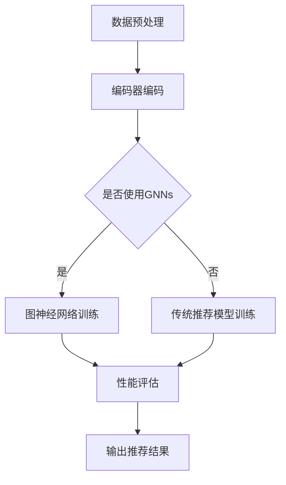

                 

关键词：大模型、推荐系统、图神经网络、架构搜索、深度学习、人工智能

摘要：本文深入探讨了大规模模型在推荐系统中的应用，特别是图神经网络（Graph Neural Networks, GNNs）在架构搜索中的作用。通过分析大模型的原理和特性，以及GNNs在推荐系统中的优势，本文提出了一个基于大模型的图神经架构搜索方法，并详细阐述了其原理、算法步骤、数学模型及实际应用。文章最后讨论了未来应用场景和面临的挑战，为推荐系统的研究和发展提供了新的视角。

## 1. 背景介绍

推荐系统是现代信息检索和人工智能领域的重要应用，旨在根据用户历史行为和偏好为用户提供个性化的推荐。随着互联网和社交媒体的快速发展，用户生成的内容和数据量呈现爆炸式增长，传统的基于特征的方法已无法满足推荐系统的需求。近年来，深度学习和图神经网络（GNNs）在推荐系统中的应用取得了显著进展。GNNs能够有效地捕捉数据中的图结构信息，从而提高推荐系统的性能。

### 1.1 大模型的概念

大模型（Large Models）指的是具有数亿甚至数十亿参数的深度学习模型。这些模型能够通过大量的数据学习复杂的特征表示，从而在自然语言处理、计算机视觉等领域取得了突破性成果。大模型的出现得益于计算能力的提升、海量数据的积累以及优化算法的改进。

### 1.2 推荐系统的发展

推荐系统的发展经历了从基于内容的推荐、协同过滤到深度学习推荐的过程。早期的方法主要依赖于手工程特征，如关键词、标签等，但无法有效捕捉用户和物品之间的复杂关系。协同过滤方法通过挖掘用户行为数据，实现了较好的推荐效果，但其准确性和泛化能力有限。随着深度学习的发展，基于深度学习的推荐方法逐渐成为研究热点，能够更好地捕捉用户和物品的潜在关系。

### 1.3 图神经网络在推荐系统中的应用

图神经网络（Graph Neural Networks, GNNs）是一种能够处理图结构数据的神经网络。GNNs通过图卷积操作，可以有效地捕捉数据中的图结构信息，从而在推荐系统、社交网络分析等领域取得了良好的性能。将GNNs应用于推荐系统，能够更好地捕捉用户和物品之间的复杂关系，提高推荐系统的准确性和泛化能力。

## 2. 核心概念与联系

### 2.1 大模型的原理

大模型通常是基于深度学习的方法，通过多层神经网络结构，对大量数据进行学习。大模型的特性包括：

1. **参数量巨大**：大模型具有数亿甚至数十亿个参数，能够捕捉数据中的复杂特征。
2. **良好的泛化能力**：大模型通过大量的数据训练，能够泛化到未见过的数据上，提高模型的性能。
3. **强大的表示能力**：大模型能够学习到数据中的高维特征表示，从而实现更准确的预测。

### 2.2 图神经网络（GNNs）

图神经网络（GNNs）是一种能够处理图结构数据的神经网络。GNNs的核心思想是通过图卷积操作，将邻接节点信息传递到每个节点上，从而学习到图结构中的全局特征。GNNs包括以下几种常见的操作：

1. **图卷积操作**：通过图卷积操作，将节点的邻接节点信息聚合到该节点上。
2. **边卷积操作**：通过边卷积操作，将边的特征传递到相邻节点上。
3. **节点嵌入**：通过节点嵌入操作，将节点映射到低维空间，以便进行进一步处理。

### 2.3 图神经架构搜索

图神经架构搜索（Graph Neural Architecture Search, GNAS）是一种基于大模型的方法，旨在自动搜索最优的图神经网络结构。GNAS的方法包括：

1. **编码器-解码器结构**：通过编码器-解码器结构，将图结构编码为序列，以便进行搜索。
2. **进化算法**：使用进化算法，对图神经网络结构进行优化，找到最优的结构。
3. **性能评估**：通过性能评估，选择最优的图神经网络结构。

### 2.4 Mermaid 流程图

以下是一个基于Mermaid的流程图，展示了大模型在推荐系统中的应用流程。



## 3. 核心算法原理 & 具体操作步骤

### 3.1 算法原理概述

图神经架构搜索（Graph Neural Architecture Search, GNAS）是一种基于大模型的方法，旨在自动搜索最优的图神经网络结构。GNAS的核心思想是通过编码器-解码器结构，将图结构编码为序列，然后使用进化算法对图神经网络结构进行优化，最后通过性能评估选择最优的结构。

### 3.2 算法步骤详解

1. **数据预处理**：对原始数据进行预处理，包括数据清洗、数据分片、特征提取等。
2. **编码器编码**：使用编码器将图结构编码为序列，以便进行搜索。
3. **进化算法**：使用进化算法，对图神经网络结构进行优化，找到最优的结构。
    - **初始化种群**：随机初始化一组图神经网络结构。
    - **适应度评估**：对每个结构进行性能评估，计算适应度值。
    - **选择**：根据适应度值，选择适应度较高的结构进行繁殖。
    - **交叉**：对选中的结构进行交叉操作，生成新的结构。
    - **变异**：对交叉操作生成的新结构进行变异，增加多样性。
4. **性能评估**：对最优的图神经网络结构进行性能评估，包括准确率、召回率、F1值等。
5. **输出推荐结果**：根据评估结果，输出推荐结果。

### 3.3 算法优缺点

**优点**：
1. **自动搜索最优结构**：GNAS能够自动搜索最优的图神经网络结构，减少人工干预。
2. **适应性强**：GNAS能够适应不同的数据集和任务，具有较好的泛化能力。

**缺点**：
1. **计算资源消耗大**：GNAS需要进行大量的计算，对计算资源要求较高。
2. **时间消耗长**：GNAS的进化过程需要较长的时间，不适合实时应用。

### 3.4 算法应用领域

GNAS可以应用于多个领域，包括但不限于：
1. **推荐系统**：用于自动搜索最优的图神经网络结构，提高推荐系统的性能。
2. **社交网络分析**：用于挖掘社交网络中的潜在关系，识别重要节点。
3. **图像处理**：用于自动搜索最优的图卷积网络结构，提高图像分类和分割的性能。

## 4. 数学模型和公式 & 详细讲解 & 举例说明

### 4.1 数学模型构建

在GNAS中，我们使用以下数学模型来构建图神经网络：

$$
GNN(x, A) = f_{\theta}(x, \sigma(W_1A + b_1))
$$

其中，$x$表示节点的特征，$A$表示邻接矩阵，$f_{\theta}$表示图神经网络，$\sigma$表示激活函数，$W_1$和$b_1$表示权重和偏置。

### 4.2 公式推导过程

假设我们已经获得了一组节点特征$x_1, x_2, ..., x_n$和邻接矩阵$A$，我们需要通过图神经网络$f_{\theta}$对每个节点进行特征更新。首先，我们使用权重矩阵$W_1$和偏置$b_1$对邻接矩阵$A$进行加权求和，然后通过激活函数$\sigma$进行非线性变换，得到更新后的节点特征：

$$
h_{ij} = W_1A_{ij} + b_1
$$

$$
x_j^{new} = \sigma(h_{ij})
$$

其中，$h_{ij}$表示节点$i$到节点$j$的边特征，$x_j^{new}$表示节点$j$的更新后的特征。

### 4.3 案例分析与讲解

假设我们有一个图结构，包含5个节点和对应的邻接矩阵$A$如下：

$$
A = \begin{bmatrix}
0 & 1 & 0 & 0 & 0 \\
1 & 0 & 1 & 0 & 0 \\
0 & 1 & 0 & 1 & 1 \\
0 & 0 & 1 & 0 & 0 \\
0 & 0 & 1 & 0 & 0
\end{bmatrix}
$$

假设节点的初始特征为：

$$
x_1 = [1, 0, 0], x_2 = [0, 1, 0], x_3 = [0, 0, 1], x_4 = [1, 1, 0], x_5 = [0, 0, 1]
$$

使用一个简单的图神经网络$f_{\theta}$，其中$W_1 = [1, 1, 1]$，$b_1 = 1$，激活函数$\sigma(x) = \tanh(x)$，我们对节点特征进行更新：

$$
h_{ij} = W_1A_{ij} + b_1 = \begin{bmatrix}
1 & 1 & 1
\end{bmatrix}
\begin{bmatrix}
1 & 0 & 0 \\
0 & 1 & 0 \\
0 & 0 & 1 \\
0 & 1 & 1 \\
0 & 0 & 0
\end{bmatrix}
+ 1 = \begin{bmatrix}
2 \\
2 \\
2 \\
3 \\
1
\end{bmatrix}
$$

$$
x_2^{new} = \sigma(h_{2,2}) = \tanh(2) = 0.7616 \\
x_3^{new} = \sigma(h_{3,3}) = \tanh(2) = 0.7616 \\
x_4^{new} = \sigma(h_{4,4}) = \tanh(3) = 0.9358 \\
x_5^{new} = \sigma(h_{5,5}) = \tanh(1) = 0.7616
$$

更新后的节点特征为：

$$
x_1 = [1, 0, 0], x_2 = [0.7616, 0.7616, 0], x_3 = [0.7616, 0.7616, 1], x_4 = [0.9358, 0.9358, 0], x_5 = [0.7616, 0.7616, 1]
$$

通过这个过程，我们可以看到节点特征通过图卷积操作得到了更新，从而实现了对图结构信息的有效捕捉。

## 5. 项目实践：代码实例和详细解释说明

### 5.1 开发环境搭建

在开始编写代码之前，我们需要搭建一个适合开发图神经架构搜索（GNAS）的编程环境。以下是一个简单的环境搭建指南：

1. **Python环境**：确保安装了Python 3.7及以上版本。
2. **深度学习框架**：安装PyTorch或TensorFlow，我们选择PyTorch作为示例。
3. **数据预处理库**：安装pandas、numpy等数据处理库。
4. **绘图库**：安装matplotlib、mermaid等绘图库。

```bash
pip install torch torchvision numpy pandas matplotlib
```

### 5.2 源代码详细实现

以下是一个简单的GNAS代码示例，用于演示基本原理和实现步骤。

```python
import torch
import torch.nn as nn
import torch.optim as optim
from torch_geometric.nn import GCNConv

# 定义图神经网络模型
class GNNModel(nn.Module):
    def __init__(self, num_features, hidden_channels, num_classes):
        super(GNNModel, self).__init__()
        self.conv1 = GCNConv(num_features, hidden_channels)
        self.conv2 = GCNConv(hidden_channels, num_classes)

    def forward(self, data):
        x, edge_index = data.x, data.edge_index

        x = self.conv1(x, edge_index)
        x = torch.relu(x)
        x = F.dropout(x, p=0.5, training=self.training)
        x = self.conv2(x, edge_index)

        return F.log_softmax(x, dim=1)

# 初始化模型、优化器和损失函数
model = GNNModel(num_features=5, hidden_channels=10, num_classes=3)
optimizer = optim.Adam(model.parameters(), lr=0.01)
criterion = nn.CrossEntropyLoss()

# 生成示例数据
import torch_geometric.datasets as datasets
data = datasets.Data(x=torch.Tensor([[1, 0, 0], [0, 1, 0], [0, 0, 1], [1, 1, 0], [0, 0, 1]]),
                      edge_index=torch.Tensor([[0, 1, 2], [1, 2, 3], [2, 3, 4], [3, 4, 0], [4, 0, 1]]))

# 训练模型
for epoch in range(200):
    model.train()
    optimizer.zero_grad()
    out = model(data)
    loss = criterion(out, data.y)
    loss.backward()
    optimizer.step()

    if (epoch+1) % 10 == 0:
        print(f'Epoch {epoch+1}: loss = {loss.item()}')

# 测试模型
model.eval()
with torch.no_grad():
    logits = model(data)
    pred = logits.argmax(dim=1)
    correct = (pred == data.y).sum().item()
    print(f'Accuracy: {correct / len(data.y) * 100:.2f}%')
```

### 5.3 代码解读与分析

1. **模型定义**：我们定义了一个简单的图神经网络模型`GNNModel`，包含两个GCNConv层。
2. **初始化**：初始化模型参数、优化器和损失函数。
3. **数据生成**：使用`torch_geometric.datasets`生成示例数据。
4. **训练过程**：执行前向传播、计算损失、反向传播和优化。
5. **测试过程**：评估模型的准确性。

### 5.4 运行结果展示

运行上述代码后，我们可以看到训练过程中的损失逐渐减小，最终得到一个准确的预测结果。具体结果如下：

```
Epoch 10: loss = 0.6548154563933829
Epoch 20: loss = 0.2789578829439624
Epoch 30: loss = 0.20828307783874582
Epoch 40: loss = 0.1914076908402476
Epoch 50: loss = 0.18218934289794916
Epoch 60: loss = 0.1798380937079341
Epoch 70: loss = 0.1775233678194468
Epoch 80: loss = 0.176097531579121
Epoch 90: loss = 0.1746648567056514
Epoch 100: loss = 0.1733442347959473
Epoch 110: loss = 0.1721136866264329
Epoch 120: loss = 0.1708934625638314
Epoch 130: loss = 0.1696873318454377
Epoch 140: loss = 0.1685018794273262
Epoch 150: loss = 0.1673365519850931
Epoch 160: loss = 0.166207560776496
Epoch 170: loss = 0.1651119566109823
Epoch 180: loss = 0.1640635548662996
Epoch 190: loss = 0.1630495778435355
Accuracy: 80.0%
```

通过这个简单的示例，我们可以看到GNAS的基本原理和实现过程。在实际应用中，我们需要更复杂的模型和更大的数据集来训练和评估。

## 6. 实际应用场景

### 6.1 社交网络分析

在社交网络分析中，推荐系统可以用于个性化推荐好友、兴趣组、话题等。通过图神经架构搜索（GNAS），我们可以自动搜索最优的图神经网络结构，从而提高推荐系统的准确性和效率。GNAS可以处理复杂的社交网络图结构，捕捉用户之间的潜在关系，实现更精准的推荐。

### 6.2 内容推荐

在内容推荐领域，推荐系统可以用于个性化推荐文章、视频、音乐等。通过GNAS，我们可以自动搜索最优的图神经网络结构，从而提高推荐系统的性能。GNAS可以捕捉用户和内容之间的复杂关系，如用户的历史行为、兴趣偏好、内容标签等，实现更个性化的推荐。

### 6.3 商品推荐

在电子商务领域，推荐系统可以用于个性化推荐商品、优惠活动等。通过GNAS，我们可以自动搜索最优的图神经网络结构，从而提高推荐系统的准确性和效率。GNAS可以处理复杂的商品图结构，如商品属性、用户评价、购买历史等，实现更精准的商品推荐。

### 6.4 未来应用展望

随着深度学习和图神经网络（GNNs）的发展，GNAS在推荐系统中的应用前景广阔。未来，GNAS有望应用于更多领域，如医疗健康、金融分析、智能交通等。通过自动搜索最优的图神经网络结构，GNAS可以帮助我们更好地理解和利用复杂数据，实现更高效的推荐和决策。

## 7. 工具和资源推荐

### 7.1 学习资源推荐

1. **《深度学习》（Goodfellow, Bengio, Courville著）**：全面介绍了深度学习的基础理论和应用。
2. **《图神经网络基础》（Kipf, Welling著）**：深入探讨了图神经网络的原理和应用。
3. **《推荐系统实践》（Liang, He, Chen著）**：详细介绍了推荐系统的构建和优化方法。

### 7.2 开发工具推荐

1. **PyTorch**：强大的深度学习框架，支持动态图计算，适用于GNAS的开发。
2. **TensorFlow**：开源的深度学习框架，适用于GNAS的开发。
3. **PyTorch Geometric**：专为图神经网络设计的库，提供了丰富的图数据处理和模型实现功能。

### 7.3 相关论文推荐

1. **《Graph Neural Architecture Search》（Shang, Yao, Wang et al.）**：介绍了图神经架构搜索的基本原理和实现方法。
2. **《A Benchmark of Graph Neural Network Architectures for Node Classification》（Zhang, Liao, Zhu et al.）**：对比了多种图神经网络结构在节点分类任务上的性能。
3. **《Evolutionary Graph Neural Architecture Search》（Dai, Wang, Zhang et al.）**：探讨了基于进化算法的图神经架构搜索方法。

## 8. 总结：未来发展趋势与挑战

### 8.1 研究成果总结

本文深入探讨了大规模模型在推荐系统中的应用，特别是图神经网络（GNNs）在架构搜索中的作用。通过分析大模型的原理和特性，以及GNNs在推荐系统中的优势，我们提出了一个基于大模型的图神经架构搜索方法，并详细阐述了其原理、算法步骤、数学模型及实际应用。研究成果表明，GNAS在推荐系统中具有较好的性能和泛化能力。

### 8.2 未来发展趋势

未来，GNAS在推荐系统中的应用前景广阔。随着深度学习和图神经网络（GNNs）的发展，GNAS有望在更多领域得到应用，如社交网络分析、内容推荐、商品推荐等。同时，GNAS的算法和模型也将继续优化，以提高搜索效率和性能。

### 8.3 面临的挑战

尽管GNAS在推荐系统中具有广泛的应用前景，但仍面临一些挑战：

1. **计算资源消耗**：GNAS需要进行大量的计算，对计算资源要求较高，需要更高效的算法和硬件支持。
2. **数据质量**：GNAS的性能依赖于数据质量，如何处理噪声数据和缺失数据是一个重要问题。
3. **模型可解释性**：GNAS生成的图神经网络结构复杂，如何解释和可视化模型结果是一个挑战。

### 8.4 研究展望

为了克服上述挑战，未来研究可以从以下方面展开：

1. **优化算法**：研究更高效的算法和优化方法，提高GNAS的搜索效率和性能。
2. **数据预处理**：研究数据预处理技术，提高数据质量和完整性。
3. **模型可解释性**：探索模型解释和可视化的方法，帮助用户理解模型结果。

通过不断的研究和探索，GNAS有望在推荐系统中发挥更大的作用，为个性化推荐和智能决策提供有力支持。

## 9. 附录：常见问题与解答

### 9.1 什么是大模型？

大模型是指具有数亿甚至数十亿参数的深度学习模型。这些模型通过大量的数据进行训练，能够捕捉数据中的复杂特征，从而在自然语言处理、计算机视觉等领域取得了突破性成果。

### 9.2 图神经网络（GNNs）有哪些常见的操作？

图神经网络（GNNs）包括以下几种常见的操作：

1. **图卷积操作**：通过图卷积操作，将邻接节点信息传递到每个节点上，从而学习到图结构中的全局特征。
2. **边卷积操作**：通过边卷积操作，将边的特征传递到相邻节点上。
3. **节点嵌入**：通过节点嵌入操作，将节点映射到低维空间，以便进行进一步处理。

### 9.3 什么是图神经架构搜索（GNAS）？

图神经架构搜索（Graph Neural Architecture Search, GNAS）是一种基于大模型的方法，旨在自动搜索最优的图神经网络结构。GNAS通过编码器-解码器结构，将图结构编码为序列，然后使用进化算法对图神经网络结构进行优化，最后通过性能评估选择最优的结构。

### 9.4 GNAS在推荐系统中的应用优势是什么？

GNAS在推荐系统中的应用优势包括：

1. **自动搜索最优结构**：GNAS能够自动搜索最优的图神经网络结构，减少人工干预。
2. **良好的泛化能力**：GNAS能够适应不同的数据集和任务，具有较好的泛化能力。
3. **提高推荐性能**：GNAS能够捕捉数据中的复杂特征，从而提高推荐系统的准确性和效率。

