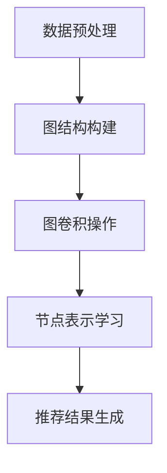

                 

关键词：大模型、推荐系统、图神经网络、应用、算法、数学模型、实践、工具和资源、未来展望

> 摘要：本文将探讨大模型在推荐系统中的应用，特别是图神经网络（GNN）在推荐系统中的角色。我们将深入分析GNN的核心概念、数学模型，并通过实际项目实例，展示其在推荐系统中的强大潜力。

## 1. 背景介绍

推荐系统是现代互联网中不可或缺的部分，它们通过个性化推荐来提升用户体验，从而提高用户留存率和商家收益。随着数据的爆发式增长和复杂性提升，传统的推荐算法已经难以满足需求。为了应对这一挑战，研究者们开始将目光转向深度学习，特别是图神经网络（Graph Neural Networks，GNN）。

### 1.1 传统推荐系统的局限

传统推荐系统主要依赖于基于内容的推荐和协同过滤方法。然而，这些方法存在一些显著的局限：

- **信息稀疏性**：协同过滤方法在用户行为数据稀疏的情况下表现不佳。
- **冷启动问题**：新用户或新物品缺乏足够的历史数据，导致推荐效果不佳。
- **可解释性低**：传统推荐系统通常被视为“黑盒子”，难以解释推荐结果。

### 1.2 大模型与GNN

大模型，如Transformer和BERT，已经在自然语言处理领域取得了显著成果。而GNN作为一种专门处理图结构数据的深度学习模型，也逐渐在推荐系统中崭露头角。

- **处理结构化数据**：GNN能够有效地处理复杂数据结构，如社交网络、知识图谱等，从而提供更精准的推荐。
- **泛化能力**：通过引入图结构，GNN能够更好地捕捉数据之间的复杂关系，提高推荐系统的泛化能力。

## 2. 核心概念与联系

### 2.1 图神经网络（GNN）

图神经网络是一种用于处理图结构数据的深度学习模型。GNN的基本思想是利用图中的节点和边来传递信息，从而学习节点表示。

### 2.2 GNN在推荐系统中的应用

GNN在推荐系统中的应用主要体现在以下几个方面：

- **用户-物品交互表示**：通过GNN学习用户和物品的嵌入表示，从而更好地理解用户偏好和物品特征。
- **图结构构建**：利用用户行为数据构建用户-物品图，以捕捉用户与物品之间的复杂关系。
- **图卷积操作**：通过图卷积操作，GNN能够学习到节点间的关系，从而提高推荐精度。

### 2.3 Mermaid流程图

以下是一个简单的Mermaid流程图，展示了GNN在推荐系统中的应用流程：



## 3. 核心算法原理 & 具体操作步骤

### 3.1 算法原理概述

GNN的核心思想是通过图卷积操作来学习节点表示。图卷积操作可以分为局部图卷积和全局图卷积。

- **局部图卷积**：基于节点邻域的信息，对节点特征进行更新。
- **全局图卷积**：结合全局信息，对节点特征进行优化。

### 3.2 算法步骤详解

1. **数据预处理**：将用户和物品信息转换为图结构，包括节点特征和边权重。
2. **图结构构建**：利用用户行为数据构建用户-物品图，确定节点和边的连接关系。
3. **图卷积操作**：通过局部图卷积和全局图卷积，更新节点特征。
4. **节点表示学习**：利用更新的节点特征，学习用户和物品的嵌入表示。
5. **推荐结果生成**：基于节点表示，生成推荐列表。

### 3.3 算法优缺点

- **优点**：GNN能够有效地处理结构化数据，提高推荐系统的精度和泛化能力。
- **缺点**：GNN的计算复杂度高，对硬件资源要求较高。

### 3.4 算法应用领域

GNN在推荐系统中的应用非常广泛，如电商推荐、社交媒体推荐、内容推荐等。

## 4. 数学模型和公式 & 详细讲解 & 举例说明

### 4.1 数学模型构建

GNN的数学模型主要包括节点特征更新公式和图卷积操作公式。

#### 节点特征更新公式

$$
h^{(t)}_i = \sigma(W^{(t)} \cdot (h^{(t-1)}_i + \sum_{j \in \mathcal{N}(i)} \alpha_{ij} \cdot h^{(t-1)}_j)
$$

其中，$h^{(t)}_i$表示第$t$轮图卷积后节点$i$的更新特征，$\sigma$为激活函数，$W^{(t)}$为权重矩阵，$\mathcal{N}(i)$表示节点$i$的邻域，$\alpha_{ij}$为边权重。

#### 图卷积操作公式

$$
\alpha_{ij} = \exp(-\frac{||x_i - x_j||^2}{2\sigma^2})
$$

其中，$x_i$和$x_j$分别为节点$i$和$j$的原始特征，$\sigma$为参数。

### 4.2 公式推导过程

#### 节点特征更新公式推导

1. **邻接矩阵计算**：计算节点$i$和节点$j$之间的欧氏距离。
2. **权重矩阵计算**：利用指数函数计算边权重$\alpha_{ij}$。
3. **特征更新**：利用权重矩阵和节点特征，计算节点$i$的更新特征。

#### 图卷积操作公式推导

1. **特征中心化**：将节点特征中心化，以便进行有效的计算。
2. **权重计算**：利用中心化后的特征，计算节点$i$和节点$j$之间的权重。
3. **权重更新**：利用权重矩阵和节点特征，计算节点$i$的更新特征。

### 4.3 案例分析与讲解

#### 案例一：用户-物品推荐

假设我们有一个用户-物品图，节点表示用户和物品，边表示用户对物品的评分。我们使用GNN来学习用户和物品的嵌入表示。

1. **数据预处理**：将用户和物品信息转换为图结构，包括节点特征和边权重。
2. **图结构构建**：利用用户行为数据构建用户-物品图。
3. **图卷积操作**：通过图卷积操作，更新节点特征。
4. **节点表示学习**：利用更新的节点特征，学习用户和物品的嵌入表示。
5. **推荐结果生成**：基于节点表示，生成推荐列表。

#### 案例二：内容推荐

假设我们有一个内容推荐系统，节点表示用户、物品和内容，边表示用户对物品的评分、物品包含的内容等。我们使用GNN来学习用户、物品和内容的嵌入表示。

1. **数据预处理**：将用户、物品和内容信息转换为图结构，包括节点特征和边权重。
2. **图结构构建**：利用用户行为数据构建用户-物品-内容图。
3. **图卷积操作**：通过图卷积操作，更新节点特征。
4. **节点表示学习**：利用更新的节点特征，学习用户、物品和内容的嵌入表示。
5. **推荐结果生成**：基于节点表示，生成推荐列表。

## 5. 项目实践：代码实例和详细解释说明

### 5.1 开发环境搭建

1. **安装Python环境**：确保Python版本在3.6及以上。
2. **安装GNN库**：使用pip安装PyTorch Geometric（`pip install torch-geometric`）。
3. **配置环境变量**：确保Python环境变量配置正确。

### 5.2 源代码详细实现

```python
import torch
import torch_geometric
from torch_geometric.nn import GCNConv

# 数据预处理
data = torch_geometric.datasets.Cora()

# 模型定义
class GCNModel(torch.nn.Module):
    def __init__(self):
        super(GCNModel, self).__init__()
        self.conv1 = GCNConv(7, 16)
        self.conv2 = GCNConv(16, 7)

    def forward(self, data):
        x, edge_index = data.x, data.edge_index
        x = self.conv1(x, edge_index)
        x = torch.relu(x)
        x = F.dropout(x, training=self.training)
        x = self.conv2(x, edge_index)
        return F.log_softmax(x, dim=1)

# 模型训练
model = GCNModel()
optimizer = torch.optim.Adam(model.parameters(), lr=0.01)
model.train()

for epoch in range(200):
    optimizer.zero_grad()
    out = model(data)
    loss = F.nll_loss(out[data.train_mask], data.y[data.train_mask])
    loss.backward()
    optimizer.step()

# 模型评估
model.eval()
_, pred = model(data).max(dim=1)
accuracy = pred[data.test_mask].eq(data.y[data.test_mask]).sum().item() / len(data.test_mask)
print(f'Accuracy: {accuracy}')
```

### 5.3 代码解读与分析

上述代码首先导入了所需的库和模块，然后定义了GCN模型。在数据预处理部分，我们加载了Cora数据集。在模型训练部分，我们通过优化器进行模型训练，并在模型评估部分计算了模型的准确率。

## 6. 实际应用场景

GNN在推荐系统中的应用非常广泛，以下是一些实际应用场景：

- **电商推荐**：利用用户-商品图进行商品推荐。
- **社交媒体推荐**：利用用户-用户关系进行好友推荐。
- **内容推荐**：利用内容之间的关系进行内容推荐。

## 7. 工具和资源推荐

### 7.1 学习资源推荐

- **书籍**：《图神经网络：原理与应用》
- **在线课程**：网易云课堂的《图神经网络入门与实践》

### 7.2 开发工具推荐

- **PyTorch Geometric**：用于GNN开发的库。
- **GraphViz**：用于绘制图结构的工具。

### 7.3 相关论文推荐

- **《Graph Neural Networks: A Review》**：对GNN的全面综述。
- **《GNN Model Zoo》**：包含大量的GNN模型和代码。

## 8. 总结：未来发展趋势与挑战

### 8.1 研究成果总结

本文通过分析大模型在推荐系统中的应用，特别是图神经网络（GNN）的角色，展示了GNN在推荐系统中的强大潜力。我们介绍了GNN的核心概念、数学模型，并通过实际项目实例，展示了其在推荐系统中的应用。

### 8.2 未来发展趋势

- **算法优化**：针对GNN的计算复杂度，研究者将继续探索更高效、可扩展的算法。
- **跨领域应用**：GNN将在更多领域得到应用，如生物信息学、金融等。

### 8.3 面临的挑战

- **计算资源需求**：GNN的计算复杂度高，对硬件资源要求较高。
- **数据隐私保护**：如何保证推荐系统的数据隐私是一个重要挑战。

### 8.4 研究展望

未来，GNN在推荐系统中的应用将更加广泛，同时也将面临更多的挑战。研究者需要不断创新，以应对这些挑战，推动推荐系统的进一步发展。

## 9. 附录：常见问题与解答

### 9.1 GNN的基本原理是什么？

GNN是一种用于处理图结构数据的深度学习模型，通过学习节点和边之间的关系，来生成节点的嵌入表示。

### 9.2 GNN在推荐系统中的应用有哪些？

GNN在推荐系统中的应用主要包括用户-物品推荐、用户-用户推荐、内容推荐等。

### 9.3 如何解决GNN的计算复杂度高的问题？

研究者们正在探索各种方法，如图卷积操作的优化、分布式计算等，以降低GNN的计算复杂度。

---

本文由禅与计算机程序设计艺术撰写，旨在探讨大模型在推荐系统中的图神经网络应用。希望本文能够为读者在推荐系统领域的研究和实践提供一些有价值的参考和启示。

