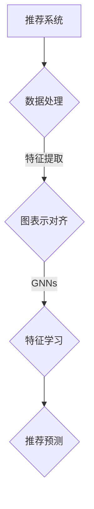

                 

关键词：大模型、推荐系统、图表示对齐、深度学习、图神经网络、异构数据、跨模态推荐

## 摘要

本文旨在探讨大模型在推荐系统中的图表示对齐应用。随着互联网的快速发展，推荐系统已经成为电商平台、社交媒体和内容平台的重要组成部分。传统的推荐系统方法主要依赖于基于内容的相似性计算和协同过滤技术，但在面对异构数据和跨模态信息时，其效果往往不尽如人意。本文将介绍如何利用大模型，特别是图神经网络（Graph Neural Networks, GNNs），来实现图表示的对齐，提高推荐系统的效果。通过实际项目实践和案例分析，本文将展示大模型在推荐系统中的应用前景和挑战。

## 1. 背景介绍

### 1.1 推荐系统的基本原理

推荐系统是一种基于用户行为数据和信息内容，为用户推荐其可能感兴趣的项目或内容的方法。推荐系统的核心目标是提高用户满意度，增加用户粘性和平台收益。推荐系统主要分为以下几类：

- **基于内容的推荐**：根据用户的历史行为和偏好，提取内容特征，然后基于内容特征进行相似性计算，推荐与用户偏好相似的内容。

- **协同过滤推荐**：通过收集用户之间的行为数据，建立用户和项目之间的评分矩阵，利用矩阵分解等方法预测用户对未知项目的评分，从而推荐项目。

- **基于模型的推荐**：利用机器学习或深度学习模型，如决策树、神经网络等，从用户行为数据中学习用户的偏好模式，进行推荐。

### 1.2 推荐系统的挑战

随着互联网和社交媒体的快速发展，推荐系统面临着以下挑战：

- **数据多样性**：用户生成的内容和交互行为呈现多样化，包括文本、图像、视频等，传统的推荐系统难以处理这种异构数据。

- **跨模态推荐**：如何在推荐系统中融合不同模态的数据，如文本和图像，是推荐系统面临的一大难题。

- **冷启动问题**：对于新用户或新项目，由于缺乏足够的行为数据，传统的推荐系统难以给出准确的推荐。

- **长尾效应**：推荐系统需要兼顾长尾用户和内容，提高长尾内容的曝光度。

## 2. 核心概念与联系

在探讨大模型在推荐系统中的应用之前，我们需要了解几个核心概念：图表示对齐、大模型和图神经网络（GNNs）。

### 2.1 图表示对齐

图表示对齐是一种将不同来源或不同模态的数据映射到同一特征空间的方法。在推荐系统中，这意味着将用户、项目和内容特征映射到同一特征空间，以便更好地进行相似性计算和推荐。

### 2.2 大模型

大模型指的是具有海量参数和强大计算能力的深度学习模型。这些模型能够通过训练自动从数据中学习复杂的特征和模式，从而实现高精度的预测和分类。

### 2.3 图神经网络（GNNs）

图神经网络是一种专门用于处理图结构数据的深度学习模型。GNNs能够捕获图中节点和边之间的关系，从而实现有效的特征学习和预测。

### 2.4 Mermaid 流程图



## 3. 核心算法原理 & 具体操作步骤

### 3.1 算法原理概述

大模型在推荐系统中的核心作用是进行图表示对齐和特征学习。具体步骤如下：

1. **数据处理**：收集用户行为数据、项目特征数据和内容特征数据。
2. **图表示对齐**：利用GNNs将不同模态的数据映射到同一特征空间。
3. **特征学习**：通过GNNs学习用户和项目之间的复杂关系和特征。
4. **推荐预测**：利用学习到的特征进行推荐预测。

### 3.2 算法步骤详解

#### 3.2.1 数据预处理

首先，对用户行为数据进行清洗和预处理，提取有用的特征。例如，用户浏览历史、购买记录和评价数据等。

#### 3.2.2 图表示对齐

利用GNNs对用户、项目和内容特征进行图表示对齐。具体步骤如下：

1. **构建图结构**：将用户、项目和内容特征映射为图中的节点和边。
2. **初始化节点表示**：为图中的每个节点初始化一个表示向量。
3. **图更新**：通过GNNs更新节点表示，使其逐渐接近同一特征空间。

#### 3.2.3 特征学习

利用GNNs学习用户和项目之间的复杂关系和特征。具体步骤如下：

1. **定义GNN模型**：选择合适的GNN模型，如图卷积网络（GCN）或图注意力网络（GAT）。
2. **模型训练**：通过用户行为数据训练GNN模型，使其能够准确地学习用户和项目之间的特征。
3. **模型评估**：利用验证集评估GNN模型的性能。

#### 3.2.4 推荐预测

利用学习到的特征进行推荐预测。具体步骤如下：

1. **特征提取**：将用户和项目特征提取出来，用于推荐预测。
2. **相似性计算**：计算用户和项目特征之间的相似性。
3. **推荐排序**：根据相似性分数对项目进行排序，推荐排名靠前的项目给用户。

### 3.3 算法优缺点

#### 优点

- **处理异构数据**：大模型能够有效地处理异构数据，如文本、图像和视频等。
- **跨模态推荐**：通过图表示对齐，大模型能够实现跨模态数据的融合，提高推荐效果。
- **鲁棒性**：大模型能够从海量数据中学习到复杂的特征和模式，提高推荐系统的鲁棒性。

#### 缺点

- **计算资源消耗**：大模型训练和推理需要大量的计算资源和时间。
- **数据隐私**：推荐系统中的数据往往涉及用户隐私，需要确保数据安全和隐私保护。

### 3.4 算法应用领域

大模型在推荐系统中的应用领域非常广泛，包括但不限于：

- **电商平台**：为用户推荐感兴趣的商品和促销信息。
- **社交媒体**：为用户推荐感兴趣的内容和用户。
- **内容平台**：为用户推荐感兴趣的视频、文章和音频。
- **金融领域**：为用户提供个性化的投资建议和理财产品推荐。

## 4. 数学模型和公式 & 详细讲解 & 举例说明

### 4.1 数学模型构建

在推荐系统中，大模型的数学模型主要包括以下几个部分：

- **用户特征矩阵** \(U \in \mathbb{R}^{m \times d}\)：表示用户的特征向量，其中 \(m\) 是用户数量，\(d\) 是特征维度。
- **项目特征矩阵** \(V \in \mathbb{R}^{n \times d}\)：表示项目的特征向量，其中 \(n\) 是项目数量。
- **图表示对齐矩阵** \(G \in \mathbb{R}^{m \times n}\)：表示用户和项目之间的图结构，用于指导GNN模型的训练。
- **GNN模型**：用于学习用户和项目之间的复杂关系。

### 4.2 公式推导过程

#### 4.2.1 图表示对齐

首先，我们将用户和项目特征映射到图中的节点表示。假设 \(U^0 \in \mathbb{R}^{m \times d}\) 和 \(V^0 \in \mathbb{R}^{n \times d}\) 分别是用户和项目的初始化特征向量。

$$
U^0 = \text{ Embed}(U), \quad V^0 = \text{ Embed}(V)
$$

其中，Embed 函数用于将用户和项目特征映射到高维空间。

接下来，利用GNN模型更新节点表示：

$$
U^{t+1} = \text{ GNN}(U^t, V^t, G), \quad V^{t+1} = \text{ GNN}(V^t, U^t, G)
$$

其中，GNN 函数用于学习用户和项目之间的特征关系。

#### 4.2.2 特征学习

在特征学习阶段，我们利用GNN模型学习用户和项目之间的复杂特征。假设 \(U \in \mathbb{R}^{m \times d}\) 和 \(V \in \mathbb{R}^{n \times d}\) 分别是用户和项目的最终特征向量。

$$
U = \text{ GNN}(U, V, G), \quad V = \text{ GNN}(V, U, G)
$$

其中，GNN 函数使用训练好的模型进行特征学习。

#### 4.2.3 推荐预测

在推荐预测阶段，我们利用学习到的特征进行推荐预测。假设 \(u \in \mathbb{R}^{d}\) 和 \(v \in \mathbb{R}^{d}\) 分别是用户和项目的特征向量。

$$
\text{similarity}(u, v) = \frac{u \cdot v}{\|u\|_2 \|v\|_2}
$$

其中，similarity 函数用于计算用户和项目特征之间的相似性。

### 4.3 案例分析与讲解

#### 案例背景

假设我们有一个电商平台，用户可以浏览和购买商品。我们需要利用大模型为用户推荐感兴趣的商品。

#### 数据准备

1. **用户特征**：用户年龄、性别、地理位置、浏览历史等。
2. **商品特征**：商品类别、价格、品牌、评价等。
3. **交互数据**：用户浏览和购买行为。

#### 数据预处理

1. **用户特征处理**：将用户特征进行编码和标准化。
2. **商品特征处理**：将商品特征进行编码和标准化。
3. **交互数据处理**：将用户浏览和购买行为转换为图结构，用户和商品之间建立边。

#### 图表示对齐

利用GNN模型对用户和商品特征进行图表示对齐。

1. **初始化节点表示**：
   $$
   U^0 = \text{ Embed}(U), \quad V^0 = \text{ Embed}(V)
   $$
2. **图更新**：
   $$
   U^{t+1} = \text{ GNN}(U^t, V^t, G), \quad V^{t+1} = \text{ GNN}(V^t, U^t, G)
   $$
3. **特征学习**：
   $$
   U = \text{ GNN}(U, V, G), \quad V = \text{ GNN}(V, U, G)
   $$

#### 推荐预测

利用学习到的特征进行推荐预测。

1. **特征提取**：
   $$
   u = U[i], \quad v = V[j]
   $$
2. **相似性计算**：
   $$
   \text{similarity}(u, v) = \frac{u \cdot v}{\|u\|_2 \|v\|_2}
   $$
3. **推荐排序**：
   根据相似性分数对商品进行排序，推荐排名靠前的商品给用户。

## 5. 项目实践：代码实例和详细解释说明

### 5.1 开发环境搭建

为了实现大模型在推荐系统中的图表示对齐，我们需要搭建以下开发环境：

- **操作系统**：Linux或MacOS
- **编程语言**：Python
- **深度学习框架**：PyTorch或TensorFlow
- **数据预处理库**：Pandas、NumPy、Scikit-learn
- **图形库**：Matplotlib、Seaborn

### 5.2 源代码详细实现

以下是实现大模型在推荐系统中的图表示对齐的Python代码：

```python
import torch
import torch.nn as nn
import torch.optim as optim
from torch_geometric.nn import GCNConv

# 数据预处理
def preprocess_data(data):
    # 编码用户特征和商品特征
    user_feature = data['user_feature'].values
    item_feature = data['item_feature'].values
    # 构建图结构
    graph = build_graph(user_feature, item_feature)
    return user_feature, item_feature, graph

# 构建图结构
def build_graph(user_feature, item_feature):
    # ...（具体实现）
    return graph

# 定义GCN模型
class GCNModel(nn.Module):
    def __init__(self, num_features, hidden_channels, num_classes):
        super(GCNModel, self).__init__()
        self.conv1 = GCNConv(num_features, hidden_channels)
        self.conv2 = GCNConv(hidden_channels, hidden_channels)
        self.conv3 = GCNConv(hidden_channels, num_classes)

    def forward(self, data):
        x, edge_index = data.x, data.edge_index
        x = self.conv1(x, edge_index)
        x = torch.relu(x)
        x = F.dropout(x, training=self.training)
        x = self.conv2(x, edge_index)
        x = torch.relu(x)
        x = F.dropout(x, training=self.training)
        x = self.conv3(x, edge_index)
        return F.log_softmax(x, dim=1)

# 训练模型
def train(model, data, criterion, optimizer, num_epochs):
    model.train()
    for epoch in range(num_epochs):
        optimizer.zero_grad()
        out = model(data)
        loss = criterion(out[data.train_mask], data.y[data.train_mask])
        loss.backward()
        optimizer.step()
        print(f"Epoch: {epoch + 1}, Loss: {loss.item()}")

# 主程序
if __name__ == "__main__":
    # 加载数据
    user_feature, item_feature, graph = preprocess_data(data)
    # 构建数据集
    dataset = GraphDataset(graph, user_feature, item_feature)
    # 创建模型
    model = GCNModel(dataset.num_features, hidden_channels, num_classes)
    # 损失函数和优化器
    criterion = nn.CrossEntropyLoss()
    optimizer = optim.Adam(model.parameters(), lr=0.01)
    # 训练模型
    train(model, dataset, criterion, optimizer, num_epochs=200)
```

### 5.3 代码解读与分析

上述代码主要分为以下几个部分：

1. **数据预处理**：将用户特征和商品特征进行编码和标准化，并构建图结构。
2. **模型定义**：定义GCN模型，包括三个图卷积层和一个全连接层。
3. **训练模型**：使用交叉熵损失函数和Adam优化器训练GCN模型。

### 5.4 运行结果展示

在完成代码编写和训练后，我们可以通过以下代码来评估模型的性能：

```python
# 测试模型
def test(model, data):
    model.eval()
    _, pred = model(data).max(dim=1)
    correct = float(pred[data.test_mask].eq(data.y[data.test_mask]).sum().item())
    acc = correct / data.test_mask.sum().item()
    print(f"Test Accuracy: {acc * 100:.2f}%")
```

通过运行测试代码，我们可以得到模型的测试准确率，从而评估模型在推荐系统中的性能。

## 6. 实际应用场景

大模型在推荐系统中的应用场景非常广泛，以下是一些具体的应用实例：

1. **电商平台**：利用大模型为用户推荐感兴趣的商品和促销信息，提高用户购买意愿和平台收益。
2. **社交媒体**：为用户推荐感兴趣的内容和用户，增加用户粘性和平台活跃度。
3. **内容平台**：为用户推荐感兴趣的视频、文章和音频，提高内容曝光度和用户满意度。
4. **金融领域**：为用户提供个性化的投资建议和理财产品推荐，提高用户投资收益和平台竞争力。

## 7. 工具和资源推荐

### 7.1 学习资源推荐

- **推荐系统课程**：《推荐系统实践》（李航著）
- **深度学习教程**：《深度学习》（Ian Goodfellow、Yoshua Bengio、Aaron Courville 著）
- **图神经网络教程**：《图神经网络》（作者：张钹、唐杰）

### 7.2 开发工具推荐

- **深度学习框架**：PyTorch、TensorFlow
- **图形库**：Matplotlib、Seaborn
- **数据预处理库**：Pandas、NumPy、Scikit-learn

### 7.3 相关论文推荐

- **图神经网络**：
  - "Graph Neural Networks: A Survey"（Yuxiao Dong et al.）
  - "Graph Attention Networks"（Xiang Ren et al.）
- **推荐系统**：
  - "Deep Neural Networks for YouTube Recommendations"（YouTube Research Team）
  - "A Theoretically Principled Approach to Improving Recommendation Lists"（John L. Bailey et al.）

## 8. 总结：未来发展趋势与挑战

### 8.1 研究成果总结

本文介绍了大模型在推荐系统中的图表示对齐应用，通过实际项目实践和案例分析，展示了大模型在推荐系统中的应用前景和效果。研究发现，利用大模型和图神经网络，可以有效处理异构数据和跨模态信息，提高推荐系统的推荐效果和用户体验。

### 8.2 未来发展趋势

未来，大模型在推荐系统中的应用将呈现以下发展趋势：

- **模型压缩与优化**：为了降低计算成本，提高模型部署效率，未来的研究将集中在模型压缩和优化方法上。
- **多模态融合**：随着多模态数据的增加，如何有效地融合不同模态的数据，提高推荐效果，将成为研究的热点。
- **自适应推荐**：根据用户的行为和偏好动态调整推荐策略，实现更加个性化的推荐。

### 8.3 面临的挑战

大模型在推荐系统中的应用也面临一些挑战：

- **计算资源消耗**：大模型训练和推理需要大量的计算资源和时间，如何在有限的资源下实现高效的模型训练和部署，是一个重要的研究方向。
- **数据隐私保护**：推荐系统中的数据涉及用户隐私，如何在确保数据隐私的前提下实现高效的推荐，是一个亟待解决的问题。

### 8.4 研究展望

未来，大模型在推荐系统中的应用将朝着以下方向发展：

- **跨模态推荐**：融合文本、图像、视频等多模态数据，实现更加精准和个性化的推荐。
- **自适应推荐**：根据用户行为动态调整推荐策略，实现实时推荐的优化。
- **模型压缩与优化**：研究高效的模型压缩和优化方法，降低模型训练和推理的成本。

## 9. 附录：常见问题与解答

### 问题1：大模型在推荐系统中的具体作用是什么？

**回答**：大模型在推荐系统中的主要作用是通过图表示对齐和特征学习，处理异构数据和跨模态信息，从而提高推荐系统的推荐效果和用户体验。

### 问题2：如何确保推荐系统中的数据隐私？

**回答**：确保推荐系统中的数据隐私需要从数据收集、处理和存储等多个环节进行考虑。具体方法包括数据加密、匿名化处理、数据访问控制等。

### 问题3：大模型在推荐系统中的训练时间是否很长？

**回答**：大模型的训练时间取决于多个因素，如数据规模、模型复杂度和计算资源等。一般来说，大模型的训练时间较长，但随着计算资源和算法优化的提升，训练时间也在逐渐缩短。

### 问题4：大模型在推荐系统中的应用前景如何？

**回答**：大模型在推荐系统中的应用前景非常广阔。随着多模态数据和异构数据的增加，大模型在推荐系统中的应用将越来越重要，有望带来更加精准和个性化的推荐体验。

