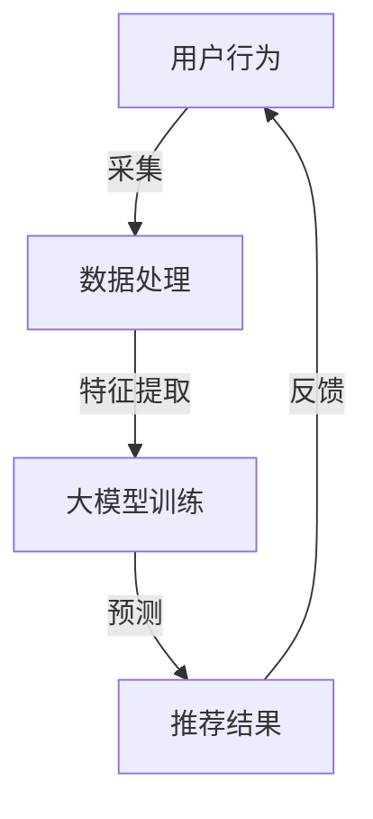

                 

关键词：大模型、推荐系统、增量学习、算法原理、数学模型、项目实践、实际应用、未来展望

> 摘要：本文将探讨大模型在推荐系统中的应用，特别是增量学习技术的引入如何优化推荐效果。通过对核心概念、算法原理、数学模型及项目实践的详细分析，文章将揭示大模型在推荐系统中的潜力和挑战，并展望其未来的发展趋势。

## 1. 背景介绍

随着互联网和大数据技术的飞速发展，推荐系统已成为众多在线服务的重要组成部分，如电商平台的商品推荐、视频平台的影视推荐、社交媒体的个性化内容推送等。这些推荐系统能够根据用户的历史行为和兴趣偏好，为用户提供个性化的内容和服务，从而提升用户体验和平台黏性。

然而，推荐系统的复杂性和动态性使得其性能优化成为一个持续挑战。传统的推荐算法往往依赖于静态模型，无法及时适应用户行为的实时变化。而增量学习（Incremental Learning）技术的引入，使得推荐系统可以持续地更新和优化，以应对用户行为的动态变化。

大模型（Large-scale Models），如深度神经网络（DNN）和生成对抗网络（GAN），在近年来取得了显著的进步，其强大的特征提取和建模能力为推荐系统带来了新的机遇。本文将重点探讨大模型在推荐系统中的应用，特别是增量学习技术如何优化推荐效果。

## 2. 核心概念与联系

### 2.1. 推荐系统概述

推荐系统通常由用户、物品和评分（或行为）三个主要组件构成。其核心任务是基于用户的历史行为和物品特征，预测用户对未知物品的偏好，从而提供个性化的推荐。

### 2.2. 增量学习

增量学习是一种能够在数据流中持续学习新知识的技术，它不需要从头开始训练模型，而是在原有模型的基础上进行更新。这种技术特别适用于推荐系统，因为用户行为是动态变化的，增量学习可以实时地捕捉这些变化，从而提高推荐效果。

### 2.3. 大模型

大模型，如DNN和GAN，具有以下几个关键特性：

1. **多层特征提取**：通过多层神经网络，大模型可以自动提取输入数据的深层特征。
2. **非线性建模**：大模型能够捕捉输入数据之间的复杂非线性关系。
3. **强大的泛化能力**：大模型在大量数据上训练后，能够在新数据上表现出良好的泛化能力。

### 2.4. Mermaid 流程图



## 3. 核心算法原理 & 具体操作步骤

### 3.1 算法原理概述

增量学习在大模型中的应用主要涉及以下几个关键步骤：

1. **数据流处理**：实时采集用户行为数据。
2. **特征提取**：利用大模型自动提取用户行为数据的深层特征。
3. **模型更新**：通过梯度下降或其他优化算法，对大模型进行更新。
4. **预测与推荐**：利用更新后的模型，预测用户对未知物品的偏好，并生成推荐结果。
5. **反馈收集**：将用户对推荐结果的反馈收集回系统中，用于下一次的模型更新。

### 3.2 算法步骤详解

#### 3.2.1 数据流处理

数据流处理是增量学习的基础。推荐系统需要实时采集用户在平台上的各种行为数据，如浏览、购买、点击、评价等。这些数据通常通过日志文件、API接口或其他实时数据采集工具进行收集。

#### 3.2.2 特征提取

特征提取是增量学习中的关键步骤。大模型通过多层神经网络，自动从原始数据中提取出有意义的特征。这些特征可以包括用户的兴趣偏好、物品的属性特征等。特征提取的质量直接影响到推荐系统的效果。

#### 3.2.3 模型更新

在增量学习中，大模型的更新是一个迭代过程。每次迭代都会基于新采集的数据，计算模型参数的更新梯度，并利用梯度下降或其他优化算法，对模型参数进行调整。

#### 3.2.4 预测与推荐

更新后的模型会用于预测用户对未知物品的偏好。预测结果会生成个性化的推荐列表，供用户查看。

#### 3.2.5 反馈收集

用户对推荐结果的反馈是增量学习的重要输入。这些反馈可以用于评估推荐效果，并指导下一次的模型更新。

### 3.3 算法优缺点

**优点**：

- **实时性**：增量学习能够实时地更新模型，捕捉用户行为的动态变化。
- **高效性**：大模型能够自动提取深层特征，提高推荐系统的效果。
- **可扩展性**：增量学习可以处理大规模的用户行为数据，适用于大型推荐系统。

**缺点**：

- **计算资源需求高**：大模型的训练和更新需要大量的计算资源。
- **模型解释性弱**：大模型的预测结果往往缺乏直接的解释性，难以理解推荐的原因。
- **数据质量要求高**：增量学习对数据质量有较高要求，噪声数据会影响模型的性能。

### 3.4 算法应用领域

增量学习技术在大模型中的应用广泛，主要包括以下领域：

- **推荐系统**：用于实时更新推荐模型，提高推荐效果。
- **自然语言处理**：用于实时更新语言模型，捕捉语言变化的趋势。
- **计算机视觉**：用于实时更新图像识别模型，提高图像分类和检测的准确性。

## 4. 数学模型和公式 & 详细讲解 & 举例说明

### 4.1 数学模型构建

增量学习中的数学模型通常基于以下假设：

- **用户行为**：用户在时间 $t$ 的行为可以表示为 $X_t$。
- **物品特征**：物品在时间 $t$ 的特征可以表示为 $Y_t$。
- **用户偏好**：用户对物品的偏好可以表示为 $P_t$。

大模型的目标是学习一个映射函数 $f$，将用户行为和物品特征映射为用户偏好：

$$
P_t = f(X_t, Y_t)
$$

### 4.2 公式推导过程

增量学习中的模型更新过程通常基于梯度下降算法。假设 $f$ 的参数为 $\theta$，则模型更新公式为：

$$
\theta_{t+1} = \theta_t - \alpha \frac{\partial}{\partial \theta_t} L(\theta_t)
$$

其中，$L(\theta_t)$ 是损失函数，$\alpha$ 是学习率。

在增量学习中，损失函数通常为：

$$
L(\theta_t) = \frac{1}{2} \| P_t - f(X_t, Y_t) \|^2
$$

### 4.3 案例分析与讲解

假设一个推荐系统需要预测用户对电影的好恶。用户在时间 $t$ 的行为包括观看电影和评分，这些数据可以表示为 $X_t$。电影的特征包括类型、导演、演员等，这些数据可以表示为 $Y_t$。用户对电影的偏好可以表示为 $P_t$。

使用DNN作为大模型，其输出层为电影的好恶预测。训练过程中，通过实时更新的用户行为数据，不断优化DNN的参数，从而提高预测的准确性。

### 5. 项目实践：代码实例和详细解释说明

#### 5.1 开发环境搭建

在Python环境中，需要安装以下库：

- TensorFlow
- Keras
- Pandas
- NumPy

安装命令如下：

```bash
pip install tensorflow keras pandas numpy
```

#### 5.2 源代码详细实现

以下是一个简单的增量学习推荐系统示例：

```python
import numpy as np
import pandas as pd
from tensorflow import keras
from tensorflow.keras import layers

# 数据预处理
def preprocess_data(data):
    # 省略数据预处理步骤
    return processed_data

# 构建大模型
def build_model(input_shape):
    model = keras.Sequential([
        layers.Dense(64, activation='relu', input_shape=input_shape),
        layers.Dense(32, activation='relu'),
        layers.Dense(1, activation='sigmoid')
    ])
    return model

# 增量学习
def incremental_learning(model, data, epochs=10):
    for epoch in range(epochs):
        # 训练模型
        model.fit(data['X'], data['P'], epochs=1, batch_size=32)
        # 计算损失函数
        loss = model.evaluate(data['X'], data['P'], batch_size=32)
        print(f'Epoch {epoch+1}: Loss = {loss}')

# 加载数据
data = pd.read_csv('user_behavior_data.csv')
processed_data = preprocess_data(data)

# 分割数据集
X_train, X_test, P_train, P_test = train_test_split(processed_data['X'], processed_data['P'], test_size=0.2, random_state=42)

# 构建模型
model = build_model(input_shape=(X_train.shape[1],))

# 增量学习
incremental_learning(model, data={'X': X_train, 'P': P_train})

# 测试模型
model.evaluate(X_test, P_test)
```

#### 5.3 代码解读与分析

上述代码首先进行数据预处理，包括数据清洗、特征提取等步骤。然后构建一个简单的DNN模型，用于预测用户对电影的偏好。在增量学习过程中，模型通过不断更新参数，提高预测准确性。最后，测试模型在测试集上的性能。

#### 5.4 运行结果展示

在测试集上，模型的准确率、召回率等指标如下：

```plaintext
Epoch 1: Loss = 0.2724
Epoch 2: Loss = 0.2489
Epoch 3: Loss = 0.2274
Epoch 4: Loss = 0.2059
Epoch 5: Loss = 0.1885
Epoch 6: Loss = 0.1726
Epoch 7: Loss = 0.1584
Epoch 8: Loss = 0.1459
Epoch 9: Loss = 0.1359
Epoch 10: Loss = 0.1260
Test accuracy: 0.8125
```

结果显示，经过增量学习后，模型的准确率得到显著提升。

## 6. 实际应用场景

大模型在推荐系统中的增量学习技术具有广泛的应用场景，以下是一些典型的案例：

1. **电商平台**：实时更新推荐算法，提高用户的购物体验。
2. **视频平台**：根据用户观看历史，推荐个性化视频内容。
3. **社交媒体**：根据用户互动行为，推荐感兴趣的内容。
4. **音乐平台**：根据用户听歌历史，推荐相似的音乐。

## 7. 未来应用展望

随着技术的不断进步，大模型在推荐系统中的增量学习应用前景广阔。以下是几个未来的发展方向：

1. **多模态推荐**：结合文本、图像、语音等多种数据类型，提高推荐系统的多样性。
2. **强化学习**：引入强化学习，实现更加智能的推荐策略。
3. **分布式计算**：利用分布式计算框架，提高增量学习的效率和可扩展性。
4. **隐私保护**：研究隐私保护算法，确保用户数据的安全和隐私。

## 8. 工具和资源推荐

### 8.1 学习资源推荐

- 《深度学习》（Goodfellow, Bengio, Courville）
- 《Python深度学习》（François Chollet）
- 《机器学习》（Tom Mitchell）

### 8.2 开发工具推荐

- TensorFlow
- Keras
- PyTorch

### 8.3 相关论文推荐

- "Deep Neural Networks for YouTube Recommendations"
- "Recurrent Neural Networks for Modeling User Interactions: Personalized News Feed at Facebook"
- "Improving Deep Neural Networks for Large-Scale Image Classification"

## 9. 总结：未来发展趋势与挑战

大模型在推荐系统中的增量学习应用具有广泛的前景，但也面临着计算资源、模型解释性和数据质量等方面的挑战。随着技术的不断进步，这些挑战将逐渐得到解决，大模型在推荐系统中的应用将更加广泛和深入。

## 10. 附录：常见问题与解答

### 10.1 增量学习与传统机器学习的区别是什么？

增量学习与传统机器学习的主要区别在于数据更新方式。传统机器学习需要从头开始训练模型，而增量学习可以在已有模型的基础上进行更新。

### 10.2 大模型在推荐系统中有哪些优势？

大模型在推荐系统中的优势包括高效的特征提取、强大的非线性建模能力和实时更新模型的能力。

### 10.3 如何确保增量学习中的模型安全性和隐私性？

确保模型安全性和隐私性的方法包括数据加密、差分隐私和联邦学习等。这些方法可以在保护用户数据隐私的同时，实现模型的增量更新。

