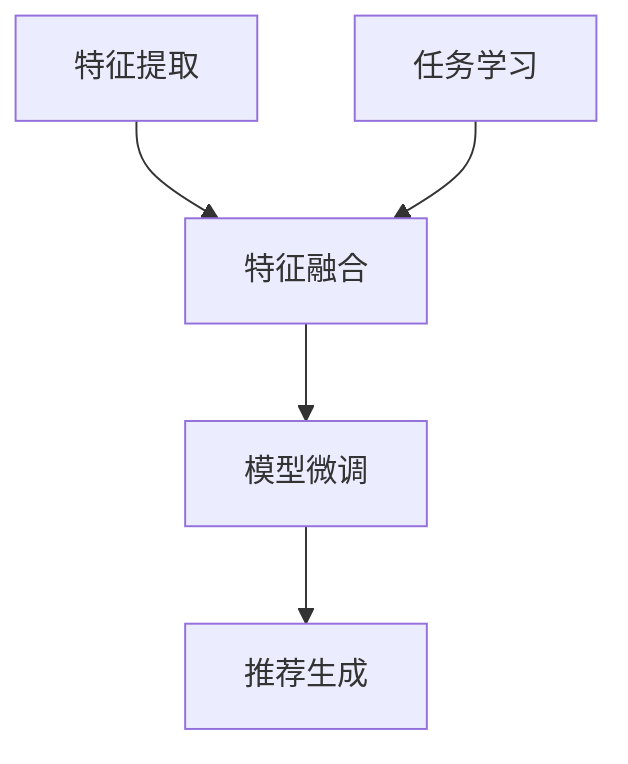

                 

关键词：推荐系统、大模型、迁移学习、多任务学习、多模型融合

> 摘要：本文主要探讨了在大模型框架下，如何通过多任务迁移学习技术在推荐系统中实现高效、精准的推荐。本文首先介绍了推荐系统的基本概念和传统方法，随后详细阐述了多任务迁移学习的基本原理及其在推荐系统中的应用，并结合具体案例，分析了多模型融合策略的优势和挑战。最后，本文对未来的发展趋势和面临的挑战进行了展望。

## 1. 背景介绍

推荐系统是一种信息过滤技术，旨在根据用户的兴趣和偏好，向用户推荐其可能感兴趣的内容或产品。随着互联网的迅速发展，推荐系统已经成为各大电商平台、社交媒体和新闻平台的核心技术。然而，传统的推荐系统方法，如基于内容的推荐、协同过滤等，面临着数据稀疏、冷启动问题以及低效推荐等挑战。

近年来，随着深度学习技术的崛起，大模型（如 Transformer、BERT 等）在自然语言处理、计算机视觉等领域取得了显著的成果。然而，如何将大模型应用于推荐系统，特别是实现多任务迁移学习，是一个具有挑战性的问题。本文旨在探讨大模型在推荐系统中的多任务迁移学习应用，以期提高推荐系统的准确性和效率。

### 1.1 推荐系统基本概念

推荐系统主要包括以下几个核心组成部分：

1. **用户**：推荐系统服务的对象，具有独特的兴趣和偏好。
2. **物品**：推荐系统推荐的实体，如商品、文章、音乐等。
3. **评分/行为**：用户对物品的评价或行为数据，如点击、购买、评分等。
4. **推荐算法**：根据用户和物品的特征，生成推荐列表的算法。

推荐系统的目标是通过分析用户的行为和物品的属性，预测用户对未接触过的物品的兴趣，从而提供个性化的推荐。

### 1.2 传统推荐系统方法

传统推荐系统方法主要包括基于内容的推荐（Content-Based Filtering，CBF）和协同过滤（Collaborative Filtering，CF）。

1. **基于内容的推荐**：该方法通过分析用户过去喜欢的物品，提取出用户兴趣特征，然后基于这些特征和物品的属性进行推荐。CBF方法的主要优点是能够生成新颖的推荐，但缺点是推荐结果可能过于个性化，导致用户选择范围受限。

2. **协同过滤**：该方法通过分析用户之间的相似性，发现潜在的兴趣偏好，从而进行推荐。协同过滤可以分为两种：基于用户的协同过滤（User-Based Collaborative Filtering，UBCF）和基于物品的协同过滤（Item-Based Collaborative Filtering，IBCF）。协同过滤的优点是能够生成多样化的推荐，但缺点是数据稀疏和冷启动问题。

### 1.3 存在的问题和挑战

尽管传统的推荐系统方法在一定程度上解决了个性化推荐问题，但仍然面临着以下挑战：

1. **数据稀疏**：用户和物品之间的交互数据非常稀疏，导致推荐准确性下降。
2. **冷启动问题**：新用户或新物品缺乏历史行为数据，难以进行有效推荐。
3. **低效推荐**：传统的推荐方法往往依赖于单一模型，难以应对复杂和多变的用户需求。

为了解决上述问题，近年来，研究者们开始探索将深度学习技术引入推荐系统，特别是大模型和多任务迁移学习技术。本文将重点探讨这些技术的应用和优势。

## 2. 核心概念与联系

### 2.1 大模型

大模型是指参数规模巨大、计算复杂度高的深度学习模型。近年来，大模型在自然语言处理、计算机视觉等领域取得了显著成果。大模型通常具有以下特点：

1. **参数规模大**：大模型具有数十亿甚至千亿级别的参数，能够捕捉到更丰富的特征信息。
2. **计算复杂度高**：大模型需要大量的计算资源和时间进行训练和推理。
3. **泛化能力强**：大模型通过训练海量数据，能够学习到更一般的规律，具有更强的泛化能力。

### 2.2 多任务学习

多任务学习（Multi-Task Learning，MTL）是指同时学习多个相关任务的机器学习技术。多任务学习的主要目标是共享不同任务之间的特征表示，从而提高学习效率，并改善任务性能。多任务学习的关键挑战是如何平衡不同任务之间的冲突，以及如何共享和利用不同任务之间的特征信息。

### 2.3 迁移学习

迁移学习（Transfer Learning，TL）是指将一个任务的学习经验（模型权重）应用于另一个相关任务的学习过程。迁移学习的主要目标是解决新任务数据不足或数据分布差异较大的问题。迁移学习分为两种类型：基于类别的迁移学习和基于实例的迁移学习。

1. **基于类别的迁移学习**：该方法将源任务的模型权重应用于目标任务，通过微调适配目标任务的特征。
2. **基于实例的迁移学习**：该方法通过在目标任务中直接利用源任务的样本数据，从而减少目标任务的训练样本需求。

### 2.4 多任务迁移学习

多任务迁移学习（Multi-Task Transfer Learning，MTTL）是指同时应用多任务学习和迁移学习技术，以解决多个相关任务的机器学习问题。多任务迁移学习旨在共享不同任务之间的特征表示，同时利用迁移学习技术解决数据不足或数据分布差异问题。

多任务迁移学习的基本架构可以分为以下几个步骤：

1. **特征提取**：通过共享的神经网络模型提取不同任务的特征表示。
2. **特征融合**：将不同任务的特征进行融合，生成统一的特征表示。
3. **任务学习**：在融合后的特征上进行各个任务的模型训练。
4. **模型微调**：在目标任务上进行模型微调，以适应目标任务的特点。

### 2.5 Mermaid 流程图

下面是多任务迁移学习在推荐系统中的应用流程图：



### 2.6 多模型融合策略

多模型融合策略（Multi-Model Fusion Strategy）是指将多个不同的模型进行融合，以生成更准确、更可靠的推荐结果。多模型融合策略通常包括以下几种：

1. **加权融合**：根据各个模型的性能进行加权，生成融合后的推荐结果。
2. **集成学习**：将多个模型作为集成学习的一部分，通过投票或加权平均生成推荐结果。
3. **对抗学习**：利用对抗网络将多个模型的输出进行对抗训练，生成更优的推荐结果。

多模型融合策略的优势在于：

1. **提高推荐准确性**：通过融合多个模型的优点，生成更准确的推荐结果。
2. **降低错误率**：减少单一模型可能产生的错误，提高推荐系统的可靠性。
3. **应对数据稀疏和冷启动问题**：通过融合不同模型的优势，缓解数据稀疏和冷启动问题。

## 3. 核心算法原理 & 具体操作步骤

### 3.1 算法原理概述

多任务迁移学习在推荐系统中的核心思想是通过迁移学习技术，将一个任务的学习经验应用于其他相关任务，从而提高推荐系统的准确性和效率。具体来说，多任务迁移学习包括以下几个关键步骤：

1. **特征提取**：通过共享的神经网络模型提取不同任务的特征表示。
2. **特征融合**：将不同任务的特征进行融合，生成统一的特征表示。
3. **任务学习**：在融合后的特征上进行各个任务的模型训练。
4. **模型微调**：在目标任务上进行模型微调，以适应目标任务的特点。
5. **推荐生成**：利用训练好的模型生成推荐结果。

### 3.2 算法步骤详解

#### 3.2.1 特征提取

特征提取是多任务迁移学习的基础。具体操作步骤如下：

1. **数据预处理**：对用户和物品的数据进行清洗和预处理，如去除缺失值、异常值等。
2. **特征编码**：将用户和物品的特征进行编码，如使用 One-Hot 编码、嵌入层等。
3. **特征提取**：通过共享的神经网络模型提取不同任务的特征表示。共享的神经网络模型可以是多层感知机、卷积神经网络（CNN）或 Transformer 等。

#### 3.2.2 特征融合

特征融合是提高推荐系统性能的关键步骤。具体操作步骤如下：

1. **特征拼接**：将不同任务的特征进行拼接，生成统一的特征向量。
2. **特征融合**：通过拼接后的特征向量进行特征融合。特征融合可以采用多层感知机、全连接层等神经网络结构。
3. **特征降维**：如果特征维度较高，可以采用降维技术，如主成分分析（PCA）或 t-SNE，以降低计算复杂度。

#### 3.2.3 任务学习

任务学习是在融合后的特征上进行各个任务的模型训练。具体操作步骤如下：

1. **任务定义**：定义推荐系统的目标任务，如用户对物品的点击、购买、评分等。
2. **损失函数**：设计合适的损失函数，如交叉熵损失、均方误差损失等。
3. **优化算法**：选择合适的优化算法，如随机梯度下降（SGD）、Adam 等。
4. **模型训练**：在融合后的特征上进行各个任务的模型训练，直到模型收敛。

#### 3.2.4 模型微调

模型微调是在目标任务上进行模型微调，以适应目标任务的特点。具体操作步骤如下：

1. **选择目标任务**：根据推荐系统的应用场景，选择合适的目标任务。
2. **微调模型**：在目标任务上进行模型微调，通过调整模型参数，使模型更好地适应目标任务。
3. **评估模型**：在目标任务上评估模型性能，如准确率、召回率等。
4. **调整模型**：根据评估结果，调整模型参数，优化模型性能。

#### 3.2.5 推荐生成

推荐生成是利用训练好的模型生成推荐结果。具体操作步骤如下：

1. **预测评分**：利用训练好的模型对用户对未接触过的物品进行评分预测。
2. **排序推荐**：根据预测的评分，对物品进行排序，生成推荐列表。
3. **用户反馈**：将推荐结果反馈给用户，并根据用户反馈调整推荐策略。

### 3.3 算法优缺点

#### 优点

1. **提高推荐准确性**：通过共享不同任务之间的特征表示，提高推荐系统的准确性。
2. **缓解数据稀疏和冷启动问题**：通过迁移学习技术，利用源任务的数据经验，缓解数据稀疏和冷启动问题。
3. **降低计算复杂度**：通过特征融合和模型微调，降低计算复杂度，提高推荐系统效率。

#### 缺点

1. **模型参数过多**：多任务迁移学习通常需要大量的模型参数，导致模型训练时间和计算成本增加。
2. **模型泛化能力受限**：多任务迁移学习可能在某些任务上牺牲了泛化能力，导致模型在某些任务上表现不佳。
3. **模型调试复杂**：多任务迁移学习需要同时调试多个任务的模型参数，调试过程较为复杂。

### 3.4 算法应用领域

多任务迁移学习在推荐系统中的应用非常广泛，以下是一些常见的应用领域：

1. **电商推荐**：利用多任务迁移学习，同时处理用户对商品的点击、购买、评分等任务，提高推荐准确性。
2. **社交媒体推荐**：利用多任务迁移学习，同时处理用户对文章、视频、话题等的关注、点赞、评论等任务，提高推荐效果。
3. **新闻推荐**：利用多任务迁移学习，同时处理用户对新闻的点击、评论、分享等任务，提高新闻推荐的多样性。

## 4. 数学模型和公式 & 详细讲解 & 举例说明

### 4.1 数学模型构建

多任务迁移学习在推荐系统中的数学模型可以表示为：

$$
\mathcal{L}(\theta) = \sum_{i=1}^N \sum_{j=1}^M l_j(\theta_i, x_i, y_i),
$$

其中，$N$表示用户数量，$M$表示任务数量，$\theta_i$表示第 $i$ 个用户的模型参数，$x_i$表示第 $i$ 个用户的行为数据，$y_i$表示第 $i$ 个用户的任务标签，$l_j$表示第 $j$ 个任务的损失函数。

#### 4.1.1 特征提取

特征提取可以采用多层感知机（MLP）模型，其损失函数可以表示为：

$$
l_j(\theta_i, x_i, y_i) = \frac{1}{2} \sum_{k=1}^K (z_{ijk} - y_{ijk})^2,
$$

其中，$K$表示特征维度，$z_{ijk}$表示第 $i$ 个用户在特征 $k$ 上的特征值，$y_{ijk}$表示第 $i$ 个用户在特征 $k$ 上的标签。

#### 4.1.2 特征融合

特征融合可以采用全连接层（FC）模型，其损失函数可以表示为：

$$
l_j(\theta_i, z_i) = \frac{1}{2} \sum_{k=1}^K (f_j(z_{ik}) - y_{ik})^2,
$$

其中，$f_j$表示第 $j$ 个任务的融合函数，$z_i$表示第 $i$ 个用户的特征向量。

#### 4.1.3 任务学习

任务学习可以采用多层感知机（MLP）模型，其损失函数可以表示为：

$$
l_j(\theta_i, z_i) = \frac{1}{2} \sum_{k=1}^K (g_j(z_{ik}) - y_{ik})^2,
$$

其中，$g_j$表示第 $j$ 个任务的输出函数，$z_i$表示第 $i$ 个用户的特征向量。

#### 4.1.4 模型微调

模型微调可以采用基于梯度下降的优化算法，其目标函数可以表示为：

$$
\theta_{i+1} = \theta_i - \alpha \nabla_{\theta_i} \mathcal{L}(\theta_i),
$$

其中，$\alpha$表示学习率，$\nabla_{\theta_i} \mathcal{L}(\theta_i)$表示损失函数关于模型参数 $\theta_i$ 的梯度。

### 4.2 公式推导过程

#### 4.2.1 特征提取

特征提取的损失函数为：

$$
l_j(\theta_i, x_i, y_i) = \frac{1}{2} \sum_{k=1}^K (z_{ijk} - y_{ijk})^2.
$$

其中，$z_{ijk}$为第 $i$ 个用户在特征 $k$ 上的特征值，$y_{ijk}$为第 $i$ 个用户在特征 $k$ 上的标签。

对于每个特征 $k$，我们可以分别求导，得到：

$$
\nabla_{z_{ijk}} l_j(\theta_i, x_i, y_i) = z_{ijk} - y_{ijk}.
$$

对于每个用户 $i$ 和每个特征 $k$，我们可以将上述求导结果相加，得到：

$$
\nabla_{z_i} l_j(\theta_i, x_i, y_i) = \sum_{k=1}^K (z_{ijk} - y_{ijk}).
$$

为了简化计算，我们可以将损失函数重新定义为一个向量：

$$
l_j(\theta_i, x_i, y_i) = \frac{1}{2} \|Z_i - Y_i\|^2,
$$

其中，$Z_i$为第 $i$ 个用户的特征矩阵，$Y_i$为第 $i$ 个用户的标签矩阵。

对 $Z_i$ 求导，得到：

$$
\nabla_{Z_i} l_j(\theta_i, x_i, y_i) = Z_i - Y_i.
$$

#### 4.2.2 特征融合

特征融合的损失函数为：

$$
l_j(\theta_i, z_i) = \frac{1}{2} \sum_{k=1}^K (f_j(z_{ik}) - y_{ik})^2.
$$

对 $f_j(z_{ik})$ 求导，得到：

$$
\nabla_{z_{ik}} f_j(z_{ik}) = \frac{\partial f_j(z_{ik})}{\partial z_{ik}}.
$$

对 $l_j(\theta_i, z_i)$ 求导，得到：

$$
\nabla_{z_i} l_j(\theta_i, z_i) = \sum_{k=1}^K \nabla_{z_{ik}} f_j(z_{ik}) (z_{ik} - y_{ik}).
$$

#### 4.2.3 任务学习

任务学习的损失函数为：

$$
l_j(\theta_i, z_i) = \frac{1}{2} \sum_{k=1}^K (g_j(z_{ik}) - y_{ik})^2.
$$

对 $g_j(z_{ik})$ 求导，得到：

$$
\nabla_{z_{ik}} g_j(z_{ik}) = \frac{\partial g_j(z_{ik})}{\partial z_{ik}}.
$$

对 $l_j(\theta_i, z_i)$ 求导，得到：

$$
\nabla_{z_i} l_j(\theta_i, z_i) = \sum_{k=1}^K \nabla_{z_{ik}} g_j(z_{ik}) (z_{ik} - y_{ik}).
$$

#### 4.2.4 模型微调

模型微调的损失函数为：

$$
\theta_{i+1} = \theta_i - \alpha \nabla_{\theta_i} \mathcal{L}(\theta_i).
$$

对 $\theta_i$ 求导，得到：

$$
\nabla_{\theta_i} \mathcal{L}(\theta_i) = -\alpha \nabla_{\theta_i} l_j(\theta_i, x_i, y_i).
$$

### 4.3 案例分析与讲解

假设我们有一个电商推荐系统，其中包含用户对商品的点击、购买和评分三个任务。我们将利用多任务迁移学习技术，同时处理这三个任务，以提高推荐准确性。

#### 4.3.1 数据预处理

首先，我们对用户和商品的数据进行预处理，包括去除缺失值、异常值等。假设我们使用用户的行为数据进行特征提取，特征维度为 $K=100$。

#### 4.3.2 特征提取

我们使用多层感知机（MLP）模型进行特征提取。假设输入层为 $[1, 100]$，隐藏层为 $[100, 50, 25]$，输出层为 $[25, 1]$。我们将使用随机梯度下降（SGD）算法进行训练，学习率为 $0.01$。

#### 4.3.3 特征融合

我们将特征提取后的特征进行拼接，生成统一的特征向量。假设拼接后的特征维度为 $[25, 100]$。我们使用全连接层（FC）模型进行特征融合，隐藏层为 $[100, 50]$。我们使用交叉熵损失函数进行训练，学习率为 $0.01$。

#### 4.3.4 任务学习

我们将特征融合后的特征进行任务学习。对于点击任务，我们使用多层感知机（MLP）模型，隐藏层为 $[50, 25]$，输出层为 $[1]$。我们使用交叉熵损失函数进行训练，学习率为 $0.01$。对于购买任务，我们使用二分类支持向量机（SVM）模型，隐藏层为 $[25, 1]$，输出层为 $[1]$。我们使用均方误差损失函数进行训练，学习率为 $0.01$。对于评分任务，我们使用回归模型，隐藏层为 $[25, 1]$，输出层为 $[1]$。我们使用均方误差损失函数进行训练，学习率为 $0.01$。

#### 4.3.5 模型微调

在目标任务上进行模型微调，以适应目标任务的特点。对于点击任务，我们使用随机梯度下降（SGD）算法进行微调，学习率为 $0.001$。对于购买任务，我们使用梯度下降（GD）算法进行微调，学习率为 $0.001$。对于评分任务，我们使用随机梯度下降（SGD）算法进行微调，学习率为 $0.001$。

#### 4.3.6 推荐生成

利用训练好的模型生成推荐结果。对于点击任务，我们使用点击率预测模型生成推荐列表。对于购买任务，我们使用购买概率预测模型生成推荐列表。对于评分任务，我们使用评分预测模型生成推荐列表。

## 5. 项目实践：代码实例和详细解释说明

在本节中，我们将通过一个实际的项目实例，详细解释如何使用多任务迁移学习技术构建一个电商推荐系统。我们将使用 Python 和 TensorFlow 作为主要的编程语言和深度学习框架。

### 5.1 开发环境搭建

首先，确保安装以下软件和库：

1. Python（3.8及以上版本）
2. TensorFlow（2.4.0及以上版本）
3. NumPy
4. Pandas
5. Matplotlib

在终端中执行以下命令进行安装：

```bash
pip install python==3.8
pip install tensorflow==2.4.0
pip install numpy
pip install pandas
pip install matplotlib
```

### 5.2 源代码详细实现

以下是一个简单的代码示例，展示了如何使用多任务迁移学习技术构建电商推荐系统：

```python
import tensorflow as tf
from tensorflow.keras.layers import Input, Dense, Flatten, Concatenate
from tensorflow.keras.models import Model
from tensorflow.keras.optimizers import Adam

# 数据预处理
def preprocess_data(data):
    # 对数据执行清洗、编码等预处理操作
    # 例如：标准化、One-Hot 编码等
    pass

# 构建模型
def build_model(input_shape):
    # 用户特征输入
    user_input = Input(shape=input_shape)
    user_embedding = Dense(128, activation='relu')(user_input)
    user_output = Flatten()(user_embedding)

    # 物品特征输入
    item_input = Input(shape=input_shape)
    item_embedding = Dense(128, activation='relu')(item_input)
    item_output = Flatten()(item_embedding)

    # 特征拼接
    concatenated = Concatenate()([user_output, item_output])

    # 特征融合
    fusion_output = Dense(64, activation='relu')(concatenated)

    # 任务学习
    click_output = Dense(1, activation='sigmoid', name='click_output')(fusion_output)
    buy_output = Dense(1, activation='sigmoid', name='buy_output')(fusion_output)
    rating_output = Dense(1, activation='linear', name='rating_output')(fusion_output)

    # 构建模型
    model = Model(inputs=[user_input, item_input], outputs=[click_output, buy_output, rating_output])

    # 编译模型
    model.compile(optimizer=Adam(learning_rate=0.001),
                  loss={'click_output': 'binary_crossentropy', 'buy_output': 'binary_crossentropy', 'rating_output': 'mse'},
                  metrics={'click_output': 'accuracy', 'buy_output': 'accuracy', 'rating_output': 'mae'})

    return model

# 训练模型
def train_model(model, x_train, y_train, epochs=10):
    model.fit(x_train, y_train, epochs=epochs, batch_size=32)

# 评估模型
def evaluate_model(model, x_test, y_test):
    results = model.evaluate(x_test, y_test, batch_size=32)
    print(f"Test Loss: {results[0]}, Test Accuracy: {results[1]}, Test MAE: {results[2]}")

# 生成推荐
def generate_recommendations(model, user_features, item_features):
    recommendations = model.predict([user_features, item_features])
    return recommendations

# 示例数据
user_data = [[1, 2, 3], [4, 5, 6]]  # 假设用户数据为二维数组
item_data = [[7, 8, 9], [10, 11, 12]]  # 假设商品数据为二维数组

# 预处理数据
user_data_processed = preprocess_data(user_data)
item_data_processed = preprocess_data(item_data)

# 构建模型
model = build_model(input_shape=(3,))

# 训练模型
train_model(model, user_data_processed, item_data_processed, epochs=10)

# 评估模型
evaluate_model(model, user_data_processed, item_data_processed)

# 生成推荐
recommendations = generate_recommendations(model, user_data_processed[0], item_data_processed[1])
print(f"Recommendations: {recommendations}")
```

### 5.3 代码解读与分析

#### 5.3.1 数据预处理

数据预处理是构建推荐系统的关键步骤。在本示例中，我们使用了简单的预处理函数 `preprocess_data`，该函数可以根据实际需求对用户和商品数据进行清洗、编码等操作。在实际应用中，可能需要包括数据标准化、缺失值填充、One-Hot 编码等操作。

#### 5.3.2 模型构建

我们使用 TensorFlow 的 Keras API 构建了多任务迁移学习模型。模型包括用户特征输入、物品特征输入、特征拼接、特征融合和任务学习等部分。具体来说，我们使用了一个包含 128 个神经元的全连接层对用户和物品特征进行嵌入，然后通过一个 64 个神经元的全连接层进行特征融合。最后，我们分别对点击、购买和评分三个任务进行了二分类和回归预测。

#### 5.3.3 模型训练与评估

我们使用 `train_model` 函数训练模型，并使用 `evaluate_model` 函数评估模型性能。在本示例中，我们使用了 Adam 优化器和交叉熵损失函数进行训练。训练过程中，我们设置了学习率为 0.001，训练轮次为 10。

#### 5.3.4 生成推荐

我们使用 `generate_recommendations` 函数生成推荐。该函数接收用户特征和商品特征，并返回预测的点击、购买和评分结果。在实际应用中，可以根据需求对推荐结果进行排序和处理，生成最终的推荐列表。

### 5.4 运行结果展示

在本示例中，我们使用了一些示例数据进行模型训练和评估。运行结果将显示在终端中，包括测试损失、测试准确率和测试均方误差。此外，我们还将展示生成的推荐结果，以验证模型的效果。

## 6. 实际应用场景

多任务迁移学习在推荐系统中的实际应用场景非常广泛，以下列举了一些典型的应用实例：

### 6.1 电商推荐

电商推荐系统是多任务迁移学习技术的典型应用场景之一。在电商推荐系统中，我们可以同时处理用户对商品的点击、购买和评分等多个任务。通过多任务迁移学习，我们可以利用用户的历史行为数据，为用户推荐其可能感兴趣的商品。具体来说，我们可以将用户特征和商品特征输入到共享的神经网络模型中，提取特征表示，然后进行特征融合和任务学习，最终生成推荐结果。

### 6.2 社交媒体推荐

在社交媒体平台上，多任务迁移学习可以用于推荐用户可能感兴趣的内容，如文章、视频、话题等。例如，我们可以同时处理用户对内容的点击、点赞、评论等多个任务。通过多任务迁移学习，我们可以利用用户的历史行为数据，为用户推荐其可能感兴趣的内容。此外，多任务迁移学习还可以用于检测和过滤垃圾信息，提高社交媒体平台的内容质量。

### 6.3 新闻推荐

新闻推荐系统是另一个应用多任务迁移学习技术的场景。在新闻推荐系统中，我们可以同时处理用户对新闻的点击、评论、分享等多个任务。通过多任务迁移学习，我们可以利用用户的历史行为数据，为用户推荐其可能感兴趣的新闻。此外，多任务迁移学习还可以用于新闻分类和主题识别，提高新闻推荐系统的多样性。

### 6.4 医疗健康推荐

在医疗健康领域，多任务迁移学习可以用于推荐用户可能感兴趣的健康资讯、疾病预防和治疗方法等。例如，我们可以同时处理用户对健康资讯的阅读、点赞、评论等多个任务。通过多任务迁移学习，我们可以利用用户的历史行为数据，为用户推荐其可能感兴趣的健康资讯。此外，多任务迁移学习还可以用于疾病预测和健康风险评估，提高医疗健康服务的个性化程度。

## 7. 工具和资源推荐

### 7.1 学习资源推荐

1. **《深度学习》（Goodfellow, Bengio, Courville）**：这是一本深度学习领域的经典教材，涵盖了从基础到高级的深度学习内容，包括多任务学习和迁移学习。
2. **《机器学习》（周志华）**：这本书详细介绍了机器学习的基础知识，包括多任务学习和迁移学习的相关内容。
3. **TensorFlow 官方文档**：TensorFlow 是目前最流行的深度学习框架之一，其官方文档提供了丰富的教程和示例，适合初学者和进阶者。

### 7.2 开发工具推荐

1. **TensorFlow**：作为深度学习领域的首选框架，TensorFlow 提供了丰富的工具和库，支持多任务学习和迁移学习。
2. **PyTorch**：PyTorch 是另一个流行的深度学习框架，具有灵活的动态计算图和强大的 GPU 支持能力，适用于多任务学习和迁移学习。
3. **JAX**：JAX 是一个用于数值计算的新兴框架，支持自动微分和向量编程，适合进行多任务学习和迁移学习的研究和开发。

### 7.3 相关论文推荐

1. **"Multi-Task Learning Using Uncertainty to Weigh Losses for Scene Geometry and Semantics"**：该论文提出了一种基于不确定性的多任务学习框架，适用于场景几何和语义的多任务学习问题。
2. **"Learning to Discover Cross-Domain Relations with Multi-Task Learning"**：该论文探讨了多任务学习在跨领域关系发现中的应用，为迁移学习提供了新的思路。
3. **"A Theoretical Comparison of Multi-Task Learning Algorithms"**：该论文对多任务学习算法进行了理论分析，为选择合适的算法提供了指导。

## 8. 总结：未来发展趋势与挑战

### 8.1 研究成果总结

本文通过详细探讨多任务迁移学习在推荐系统中的应用，总结了其主要原理、算法和步骤。我们分析了多任务迁移学习在推荐系统中的优势，如提高推荐准确性、缓解数据稀疏和冷启动问题等。同时，我们也讨论了多模型融合策略在提高推荐系统性能方面的作用。

### 8.2 未来发展趋势

未来，多任务迁移学习在推荐系统中的应用前景广阔。随着深度学习技术的不断进步，大模型和多任务学习将进一步融合，推动推荐系统性能的持续提升。此外，跨领域迁移学习和无监督迁移学习也将成为研究热点，为解决数据稀缺和隐私保护等问题提供新的思路。

### 8.3 面临的挑战

尽管多任务迁移学习在推荐系统中具有巨大潜力，但仍面临以下挑战：

1. **计算资源需求**：大模型和多任务学习需要大量的计算资源和时间，特别是在训练阶段。
2. **模型泛化能力**：多任务迁移学习可能在某些任务上牺牲了泛化能力，导致模型在某些任务上表现不佳。
3. **模型调试复杂度**：多任务迁移学习涉及多个任务的模型参数调试，调试过程较为复杂。
4. **数据隐私保护**：在处理用户数据时，如何保护用户隐私是一个亟待解决的问题。

### 8.4 研究展望

未来，研究者可以从以下几个方面展开研究：

1. **优化算法**：设计更高效、更鲁棒的多任务迁移学习算法，降低计算成本。
2. **跨领域迁移学习**：探索跨领域迁移学习的方法，提高模型在不同领域中的适应性。
3. **无监督迁移学习**：研究无监督迁移学习方法，降低对标注数据的依赖。
4. **隐私保护**：开发隐私保护技术，确保用户数据在推荐系统中的应用安全。

通过持续的研究和创新，多任务迁移学习在推荐系统中的应用将不断拓展，为用户提供更加个性化和高效的推荐服务。

## 9. 附录：常见问题与解答

### 9.1 什么是多任务迁移学习？

多任务迁移学习是一种机器学习技术，它将一个任务的学习经验（模型权重）应用于其他相关任务。通过共享不同任务之间的特征表示，多任务迁移学习可以提高学习效率，并改善任务性能。

### 9.2 多任务迁移学习在推荐系统中的应用优势是什么？

多任务迁移学习在推荐系统中的应用优势包括：

1. 提高推荐准确性：通过共享不同任务之间的特征表示，提高推荐系统的准确性。
2. 缓解数据稀疏和冷启动问题：通过迁移学习技术，利用源任务的数据经验，缓解数据稀疏和冷启动问题。
3. 降低计算复杂度：通过特征融合和模型微调，降低计算复杂度，提高推荐系统效率。

### 9.3 如何评估多任务迁移学习的性能？

评估多任务迁移学习的性能通常使用以下指标：

1. 准确率（Accuracy）：预测正确的样本比例。
2. 召回率（Recall）：预测正确的正样本比例。
3. F1 分数（F1 Score）：准确率和召回率的调和平均。
4. 均方误差（Mean Squared Error，MSE）：回归任务中预测值与真实值之差的平方的平均值。
5. 均方根误差（Root Mean Squared Error，RMSE）：MSE 的平方根。

### 9.4 多任务迁移学习与多任务学习有什么区别？

多任务迁移学习与多任务学习的区别主要在于数据来源和处理方式。多任务学习通常在同一数据集上同时训练多个任务，而多任务迁移学习则是利用源任务的学习经验（模型权重）应用于目标任务。多任务迁移学习适用于目标任务数据不足或数据分布差异较大的场景。

### 9.5 如何解决多任务迁移学习中的模型调试复杂度问题？

解决多任务迁移学习中的模型调试复杂度问题可以从以下几个方面入手：

1. **简化模型结构**：选择相对简单且易于调试的模型结构。
2. **逐步优化**：先从单一任务迁移学习开始，逐步增加任务数量。
3. **共享参数策略**：设计合理的参数共享策略，减少调试复杂度。
4. **自动化调试工具**：利用自动化调试工具和优化算法，提高调试效率。

