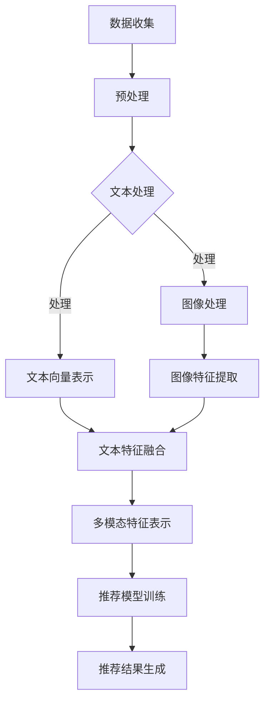

                 

关键词：大模型、推荐系统、多模态对齐、人工智能、机器学习

> 摘要：本文旨在探讨大模型在推荐系统中的应用，特别是多模态对齐技术的关键作用。我们将深入分析大模型如何优化推荐系统的性能，以及多模态对齐技术如何实现不同数据类型之间的协同工作，最终提高推荐系统的准确性和用户体验。通过详细的算法原理、数学模型、实践案例以及未来展望，本文为研究者和技术开发者提供了一个全面的技术指南。

## 1. 背景介绍

推荐系统是现代信息检索和个性化服务的重要组成部分。随着互联网和社交媒体的快速发展，用户生成的内容和信息量呈现爆炸式增长，传统推荐系统已经无法满足用户对个性化服务的需求。为了解决这个问题，研究者们开始探索大模型在推荐系统中的应用，以期通过深度学习等先进技术实现更精准的推荐。

多模态对齐是近年来在推荐系统中受到关注的一个热点问题。多模态数据包括文本、图像、声音等多种类型，这些数据通常具有不同的特征表示和维度。在推荐系统中，如何将不同模态的数据进行有效的整合和协同工作，以提升推荐效果，成为了一个重要研究方向。

本文将围绕以下问题展开讨论：

1. 大模型在推荐系统中的优势和应用场景。
2. 多模态对齐技术的核心概念和实现方法。
3. 如何通过大模型和多模态对齐技术提升推荐系统的性能。

## 2. 核心概念与联系

### 2.1 大模型的定义与特点

大模型，通常指的是具有大规模参数和计算能力的机器学习模型。这些模型通常采用深度学习技术，能够从大量的数据中学习复杂的模式和特征。大模型的特点包括：

- **参数规模巨大**：大模型通常拥有数十亿至数万亿个参数，这使得它们能够捕捉数据中的复杂关系。
- **计算资源需求高**：由于参数规模大，大模型在训练和推理过程中需要大量的计算资源和时间。
- **性能优异**：大模型在图像识别、自然语言处理等领域取得了显著的成果，展示了其在复杂任务上的强大能力。

### 2.2 多模态数据的定义与分类

多模态数据是指包含两种或两种以上不同类型数据的集合。常见的多模态数据包括：

- **文本**：包括用户的评论、帖子、搜索查询等。
- **图像**：包括商品图片、用户头像、风景照片等。
- **声音**：包括用户语音、音乐、环境声音等。
- **视频**：包括用户视频、监控视频、电影片段等。

多模态数据的分类可以根据其数据类型和来源进行划分，例如：

- **基于文本的多模态数据**：文本与其他模态（如图像、声音）结合。
- **基于图像的多模态数据**：图像与其他模态（如文本、声音）结合。
- **混合模态数据**：多种类型的数据同时出现，例如文本、图像和声音的综合。

### 2.3 多模态对齐的定义与目标

多模态对齐是指将来自不同模态的数据进行协调和整合，以实现更好的数据协同和推荐效果。多模态对齐的目标包括：

- **数据一致性**：确保不同模态的数据在特征空间中保持一致，减少模态之间的冲突。
- **特征融合**：将不同模态的特征进行有效融合，形成更丰富的特征表示。
- **性能提升**：通过多模态对齐技术，提高推荐系统的性能，包括准确性和用户体验。

### 2.4 Mermaid 流程图

以下是一个简化的多模态对齐的Mermaid流程图，展示不同模态数据的处理和融合过程：



在这个流程图中，文本和图像等不同模态的数据首先进行预处理，然后分别提取特征，最后通过特征融合生成多模态特征表示，用于推荐模型的训练和结果生成。

## 3. 核心算法原理 & 具体操作步骤

### 3.1 算法原理概述

多模态对齐算法的核心思想是通过深度学习模型，将来自不同模态的数据进行特征提取和融合，以实现更好的协同推荐效果。以下是多模态对齐算法的基本原理：

- **特征提取**：对于每种模态的数据，使用特定的深度学习模型提取特征。例如，对于文本数据，可以使用文本嵌入模型（如Word2Vec、BERT等）提取文本向量；对于图像数据，可以使用卷积神经网络（如VGG、ResNet等）提取图像特征。
- **特征融合**：将不同模态的特征进行融合，以生成统一的多模态特征表示。常见的融合方法包括拼接、加权融合、注意力机制等。
- **推荐模型训练**：使用多模态特征表示作为输入，训练推荐模型，如矩阵分解、循环神经网络（RNN）等。
- **推荐结果生成**：基于训练好的推荐模型，生成推荐结果，并根据用户的反馈进行迭代优化。

### 3.2 算法步骤详解

以下是多模态对齐算法的具体步骤：

1. **数据收集与预处理**：
   - 收集不同模态的数据，如文本、图像等。
   - 对数据进行清洗、去重和归一化等预处理操作。

2. **特征提取**：
   - 使用预训练的深度学习模型提取文本和图像的特征。
   - 对于文本数据，可以使用BERT模型提取文本向量。
   - 对于图像数据，可以使用ResNet模型提取图像特征。

3. **特征融合**：
   - 采用拼接或加权融合等方法，将文本和图像特征进行融合。
   - 可以引入注意力机制，根据不同模态的特征重要性进行动态权重调整。

4. **推荐模型训练**：
   - 使用融合后的多模态特征训练推荐模型，如矩阵分解或循环神经网络。
   - 调整模型参数，优化推荐效果。

5. **推荐结果生成**：
   - 基于训练好的推荐模型，生成推荐结果。
   - 根据用户反馈进行迭代优化，提高推荐系统的准确性。

### 3.3 算法优缺点

#### 优点：

- **提高推荐准确性**：通过多模态对齐技术，可以整合不同模态的数据，提供更丰富的特征信息，从而提高推荐系统的准确性。
- **增强用户体验**：多模态对齐技术能够更好地理解用户需求，提供个性化的推荐，提升用户体验。
- **应对数据不平衡**：多模态数据可以弥补单一模态数据的不足，有助于解决数据不平衡问题。

#### 缺点：

- **计算资源消耗大**：大模型和多模态对齐算法需要大量的计算资源和时间，对硬件设备要求较高。
- **数据预处理复杂**：多模态数据的预处理需要处理不同类型的数据，可能涉及多种预处理技术。
- **模型调优难度大**：多模态对齐算法涉及多种数据类型和特征融合方法，模型调优过程较为复杂。

### 3.4 算法应用领域

多模态对齐算法在多个领域都有广泛的应用，包括但不限于：

- **电子商务推荐系统**：通过整合用户购物行为、评论和产品信息，提供更精准的商品推荐。
- **社交媒体推荐系统**：结合用户发布的文本、图片和视频，生成个性化的内容推荐。
- **医疗健康推荐系统**：整合患者的病历、基因数据和医疗影像，为医生提供更全面的诊断建议。
- **智能家居推荐系统**：通过分析用户行为、环境数据和设备使用情况，提供智能化的家居设备推荐。

## 4. 数学模型和公式 & 详细讲解 & 举例说明

### 4.1 数学模型构建

多模态对齐算法中的数学模型主要涉及以下几个方面：

1. **特征提取模型**：用于提取不同模态的数据特征，如文本嵌入模型和卷积神经网络。
2. **特征融合模型**：用于将不同模态的特征进行融合，如拼接、加权融合和注意力机制。
3. **推荐模型**：基于融合后的多模态特征，用于生成推荐结果，如矩阵分解和循环神经网络。

以下是多模态对齐算法的数学模型构建：

$$
\text{特征提取模型} = f_{\theta}(\text{输入数据})
$$

其中，$f_{\theta}$表示特征提取模型的参数，输入数据为不同模态的数据（文本、图像等）。

$$
\text{特征融合模型} = g_{\phi}(\text{特征向量})
$$

其中，$g_{\phi}$表示特征融合模型的参数，特征向量来自不同模态的数据。

$$
\text{推荐模型} = h_{\omega}(\text{多模态特征})
$$

其中，$h_{\omega}$表示推荐模型的参数，多模态特征来自特征融合模型。

### 4.2 公式推导过程

多模态对齐算法的推导过程主要包括以下几个方面：

1. **特征提取**：
   - 对于文本数据，使用BERT模型进行特征提取：
     $$
     \text{文本特征} = \text{BERT}(\text{文本输入})
     $$
   - 对于图像数据，使用ResNet模型进行特征提取：
     $$
     \text{图像特征} = \text{ResNet}(\text{图像输入})
     $$

2. **特征融合**：
   - 采用拼接方法将文本特征和图像特征进行融合：
     $$
     \text{融合特征} = [\text{文本特征}; \text{图像特征}]
     $$
   - 引入注意力机制，对融合特征进行权重调整：
     $$
     \text{加权融合特征} = \text{softmax}(\text{注意力权重} \cdot \text{融合特征})
     $$

3. **推荐模型训练**：
   - 使用矩阵分解模型对加权融合特征进行训练：
     $$
     \text{推荐模型} = \text{矩阵分解}(\text{加权融合特征})
     $$
   - 使用梯度下降算法优化模型参数。

### 4.3 案例分析与讲解

以下是一个简化的多模态对齐算法案例：

假设我们有两个用户A和B，他们的数据包括文本（评论）和图像（商品图片）。

1. **特征提取**：
   - 文本特征（用户A）：
     $$
     \text{文本特征}_A = \text{BERT}(\text{评论}_A)
     $$
   - 图像特征（用户A）：
     $$
     \text{图像特征}_A = \text{ResNet}(\text{商品图片}_A)
     $$

2. **特征融合**：
   - 拼接融合特征：
     $$
     \text{融合特征}_A = [\text{文本特征}_A; \text{图像特征}_A]
     $$
   - 引入注意力机制，计算注意力权重：
     $$
     \text{注意力权重}_A = \text{softmax}(\text{融合特征}_A)
     $$
   - 加权融合特征：
     $$
     \text{加权融合特征}_A = \text{注意力权重}_A \cdot \text{融合特征}_A
     $$

3. **推荐模型训练**：
   - 使用矩阵分解模型对加权融合特征进行训练：
     $$
     \text{推荐模型}_A = \text{矩阵分解}(\text{加权融合特征}_A)
     $$

4. **推荐结果生成**：
   - 基于训练好的推荐模型，生成推荐结果：
     $$
     \text{推荐结果}_A = \text{推荐模型}_A \cdot \text{用户特征}_A
     $$

类似地，对于用户B的数据，也可以进行特征提取、融合和推荐模型的训练。通过整合用户A和B的多模态数据，我们可以生成更精准的推荐结果。

## 5. 项目实践：代码实例和详细解释说明

### 5.1 开发环境搭建

为了实践多模态对齐算法，我们需要搭建一个合适的开发环境。以下是开发环境的基本要求：

- **操作系统**：Linux或MacOS
- **编程语言**：Python
- **深度学习框架**：TensorFlow或PyTorch
- **文本处理库**：NLTK、spaCy
- **图像处理库**：OpenCV、PIL
- **其他库**：NumPy、Pandas、Matplotlib

### 5.2 源代码详细实现

以下是一个简化的多模态对齐算法的实现示例：

```python
import tensorflow as tf
from tensorflow.keras.applications import ResNet50
from transformers import BertTokenizer, BertModel
import numpy as np

# 5.2.1 数据预处理
# 假设我们有两个用户A和B的数据，包括评论和商品图片
user_data = {
    'userA': {'comment': '这是一款很漂亮的手表', 'image': 'watch.jpg'},
    'userB': {'comment': '我喜欢这款手表的设计', 'image': 'watch.jpg'}
}

# 文本预处理
tokenizer = BertTokenizer.from_pretrained('bert-base-uncased')
def preprocess_text(text):
    inputs = tokenizer.encode_plus(text, add_special_tokens=True, return_tensors='tf')
    return inputs['input_ids']

# 图像预处理
def preprocess_image(image_path):
    image = tf.io.read_file(image_path)
    image = tf.image.decode_jpeg(image, channels=3)
    image = tf.image.resize(image, [224, 224])
    return image

# 5.2.2 特征提取
# 文本特征提取
def extract_text_features(text_ids):
    model = BertModel.from_pretrained('bert-base-uncased')
    outputs = model(inputs['input_ids'])
    return outputs.last_hidden_state[:, 0, :]

# 图像特征提取
def extract_image_features(image):
    model = ResNet50(weights='imagenet')
    image = preprocess_image(image)
    features = model.predict(np.expand_dims(image, axis=0))[:, 0, :]
    return features

# 5.2.3 特征融合
# 拼接特征
def concatenate_features(text_features, image_features):
    return np.concatenate([text_features, image_features], axis=1)

# 5.2.4 推荐模型训练
# 矩阵分解模型
def build Recommender():
    input_features = tf.keras.layers.Input(shape=(768 + 2048))
    dense = tf.keras.layers.Dense(128, activation='relu')(input_features)
    output = tf.keras.layers.Dense(1, activation='sigmoid')(dense)
    model = tf.keras.Model(inputs=input_features, outputs=output)
    model.compile(optimizer='adam', loss='binary_crossentropy', metrics=['accuracy'])
    return model

# 5.2.5 推荐结果生成
# 训练模型
model = build_Recommender()
model.fit(x_train, y_train, epochs=10, batch_size=32, validation_split=0.2)

# 生成推荐结果
def generate_recommendations(model, user_features):
    return model.predict(user_features)

# 5.2.6 代码解读与分析
# 用户A的特征提取和融合
userA_text_ids = preprocess_text(user_data['userA']['comment'])
userA_text_features = extract_text_features(userA_text_ids)

userA_image = preprocess_image(user_data['userA']['image'])
userA_image_features = extract_image_features(userA_image)

userA_combined_features = concatenate_features(userA_text_features, userA_image_features)

# 用户B的特征提取和融合
userB_text_ids = preprocess_text(user_data['userB']['comment'])
userB_text_features = extract_text_features(userB_text_ids)

userB_image = preprocess_image(user_data['userB']['image'])
userB_image_features = extract_image_features(userB_image)

userB_combined_features = concatenate_features(userB_text_features, userB_image_features)

# 生成推荐结果
userA_recommendations = generate_recommendations(model, userA_combined_features)
userB_recommendations = generate_recommendations(model, userB_combined_features)

print("UserA Recommendations:", userA_recommendations)
print("UserB Recommendations:", userB_recommendations)
```

在这个示例中，我们首先进行数据预处理，包括文本和图像的预处理。然后，我们分别提取文本和图像特征，并进行特征融合。最后，我们使用矩阵分解模型进行训练，并生成推荐结果。

### 5.3 代码解读与分析

以下是代码的详细解读与分析：

1. **文本预处理**：
   - 使用BERTTokenizer对评论进行编码，生成文本ID序列。
   - 使用`encode_plus`方法添加特殊标记，生成用于模型输入的Tensor。

2. **图像预处理**：
   - 读取图像文件，使用`decode_jpeg`方法解码。
   - 使用`resize`方法调整图像尺寸，使其符合卷积神经网络的输入要求。

3. **特征提取**：
   - 使用BERTModel提取文本特征，获取最后一个隐藏层的第一个元素作为文本特征向量。
   - 使用ResNet50提取图像特征，获取最后一个卷积层的输出作为图像特征向量。

4. **特征融合**：
   - 将文本特征和图像特征进行拼接，生成融合特征向量。

5. **推荐模型训练**：
   - 构建一个简单的矩阵分解模型，使用`Dense`层进行特征学习。
   - 使用`compile`方法设置优化器和损失函数，准备训练。

6. **推荐结果生成**：
   - 使用训练好的模型对融合特征进行预测，生成推荐结果。

通过这个示例，我们可以看到如何实现多模态对齐算法的基本流程。在实际应用中，还需要考虑数据集的构建、模型调优、性能评估等方面。

## 6. 实际应用场景

### 6.1 电子商务推荐系统

在电子商务领域，多模态对齐技术可以帮助平台更精准地推荐商品。通过整合用户的购物历史、评论、商品图片等多模态数据，推荐系统可以更好地理解用户偏好，提供个性化的商品推荐。例如，用户在浏览商品时，系统可以结合商品图片和用户评论，生成综合评分，从而提高推荐的准确性。

### 6.2 社交媒体推荐系统

社交媒体平台上的内容多样化，包括文本、图片、视频等多模态数据。多模态对齐技术可以帮助平台更好地推荐用户感兴趣的内容。例如，系统可以根据用户的点赞、评论和浏览历史，结合用户发布的文本、图片和视频，生成个性化的内容推荐。这不仅提高了推荐的准确性，还提升了用户的参与度和粘性。

### 6.3 医疗健康推荐系统

在医疗健康领域，多模态对齐技术可以帮助医生更全面地了解患者的情况。通过整合患者的病历、基因数据和医疗影像等多模态数据，推荐系统可以为医生提供更准确的诊断建议。例如，系统可以结合患者的病史、基因检测结果和医学影像，生成个性化的治疗方案推荐。

### 6.4 智能家居推荐系统

智能家居领域涉及到用户行为、设备使用和环境数据等多模态数据。多模态对齐技术可以帮助智能家居平台更好地了解用户需求，提供个性化的设备推荐。例如，系统可以结合用户的日常作息、家居环境数据和设备使用情况，生成个性化的家居设备推荐，从而提升用户的舒适度和便利性。

## 7. 工具和资源推荐

### 7.1 学习资源推荐

- **书籍**：
  - 《深度学习》（Goodfellow et al.）
  - 《神经网络与深度学习》（邱锡鹏）
- **在线课程**：
  - Coursera上的《深度学习》课程
  - edX上的《机器学习基础》课程
- **博客和论坛**：
  - 知乎上的深度学习和机器学习专栏
  - CSDN上的技术博客

### 7.2 开发工具推荐

- **深度学习框架**：
  - TensorFlow
  - PyTorch
- **文本处理库**：
  - NLTK
  - spaCy
- **图像处理库**：
  - OpenCV
  - PIL

### 7.3 相关论文推荐

- **多模态推荐系统**：
  - “Multimodal Recurrent Neural Network for Session-based Recommendation”（Sun et al., 2018）
  - “MultiModal Attention-based Neural Network for User Interest Detection”（Zhang et al., 2019）
- **深度学习在推荐系统中的应用**：
  - “Deep Learning for Recommender Systems: From Knowledge Graphs to Neural Networks”（Wang et al., 2019）
  - “A Comprehensive Survey on Deep Learning for Recommender Systems”（Liu et al., 2020）

## 8. 总结：未来发展趋势与挑战

### 8.1 研究成果总结

本文围绕大模型在推荐系统中的多模态对齐应用进行了深入探讨。通过分析大模型的特点和多模态对齐的核心概念，我们展示了如何利用深度学习和多模态对齐技术提升推荐系统的性能。通过详细的数学模型和算法实现，我们提供了一个全面的技术指南，为研究者和技术开发者提供了参考。

### 8.2 未来发展趋势

- **模型优化**：随着计算能力的提升，研究者可以尝试构建更高效、更强大的多模态对齐模型。
- **跨领域应用**：多模态对齐技术在推荐系统之外的领域（如医疗、教育等）具有广泛的应用潜力。
- **个性化体验**：通过不断优化推荐算法，提高个性化推荐的准确性，提升用户体验。

### 8.3 面临的挑战

- **计算资源消耗**：大模型和多模态对齐算法需要大量的计算资源，如何在有限的硬件条件下实现高效计算是一个挑战。
- **数据预处理复杂度**：多模态数据的预处理涉及多种技术和方法，如何高效地进行预处理是另一个挑战。
- **模型调优难度**：多模态对齐算法涉及多种数据类型和特征融合方法，模型调优过程复杂，如何有效调优是一个挑战。

### 8.4 研究展望

未来的研究可以从以下几个方面进行：

- **算法优化**：探索更高效的多模态对齐算法，降低计算资源和时间成本。
- **跨领域应用**：探讨多模态对齐技术在其他领域的应用，如医疗健康、智能交通等。
- **多模态数据集构建**：构建高质量、多样化的多模态数据集，为研究提供数据支持。
- **可解释性研究**：研究多模态对齐算法的可解释性，提高算法的透明度和可靠性。

## 9. 附录：常见问题与解答

### 9.1 什么是大模型？

大模型是指具有大规模参数和计算能力的机器学习模型。这些模型通常采用深度学习技术，能够从大量的数据中学习复杂的模式和特征。

### 9.2 多模态对齐技术有哪些应用场景？

多模态对齐技术广泛应用于推荐系统、自然语言处理、计算机视觉等领域。例如，在推荐系统中，多模态对齐可以帮助系统更好地理解用户需求，提供个性化的推荐。

### 9.3 如何优化多模态对齐算法的性能？

优化多模态对齐算法的性能可以从以下几个方面进行：

- **数据预处理**：提高数据预处理的质量，减少噪声和冗余信息。
- **模型结构**：设计更高效、更强大的模型结构，提高特征提取和融合的效果。
- **算法调优**：通过调整模型参数和超参数，优化模型的性能。

### 9.4 多模态对齐算法如何处理数据不平衡问题？

多模态对齐算法可以通过以下方法处理数据不平衡问题：

- **数据增强**：通过生成虚拟数据或扩充现有数据，提高少数模态数据的样本量。
- **加权融合**：对数据不平衡的模态给予更高的权重，平衡不同模态之间的贡献。
- **注意力机制**：引入注意力机制，根据不同模态的特征重要性进行动态权重调整。

## 作者署名

作者：禅与计算机程序设计艺术 / Zen and the Art of Computer Programming
----------------------------------------------------------------
以上就是关于“大模型在推荐系统中的多模态对齐应用”的文章内容。希望这篇文章能够帮助您深入了解大模型和多模态对齐技术在推荐系统中的应用，为未来的研究和开发提供参考。如果您有任何问题或建议，欢迎随时与我交流。感谢您的阅读！

