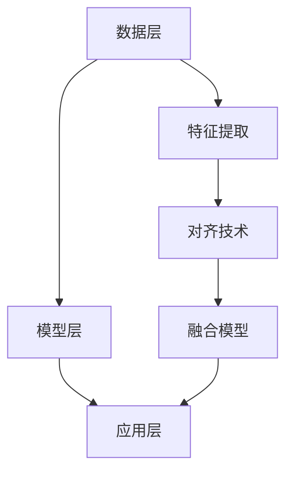

                 

关键词：推荐系统，多模态融合，对齐算法，大模型，AI，自然语言处理，图像处理

摘要：本文深入探讨了在大模型推动下，推荐系统如何通过多模态融合与对齐技术实现更智能的用户体验。首先，我们回顾了推荐系统的基本概念与常见问题，然后详细介绍了多模态融合与对齐的核心概念与架构，接着解析了多模态融合算法的原理与实现，探讨了数学模型和公式，并通过实际代码实例展示了算法的应用。最后，我们探讨了多模态融合在推荐系统中的实际应用场景，并对未来进行了展望。

## 1. 背景介绍

推荐系统是信息过滤与检索领域的一个重要分支，其目的是根据用户的历史行为和偏好，向用户推荐他们可能感兴趣的内容。随着互联网的快速发展，推荐系统在电商、社交媒体、视频平台等领域得到了广泛应用。

然而，传统的推荐系统主要依赖于单一模态的数据，如文本、图像或音频。这种单一模态的推荐系统在处理多样化内容时存在一定的局限性。例如，在电商平台上，用户可能既喜欢某种商品的描述，又喜欢该商品的图片，这时，单一模态的推荐系统可能无法很好地满足用户需求。

为了克服这些局限性，多模态融合技术应运而生。多模态融合通过整合不同模态的数据，如文本、图像、音频等，来提高推荐系统的性能。对齐技术则是多模态融合的核心，它旨在解决不同模态数据之间的不一致性，实现数据的有效融合。

在大模型技术的推动下，多模态融合与对齐技术得到了快速发展。大模型具有强大的建模能力和泛化能力，可以处理大规模、多模态的数据，从而实现更准确的推荐。本文将深入探讨大模型在推荐系统中的多模态融合与对齐技术，旨在为相关领域的研究和实践提供参考。

## 2. 核心概念与联系

### 2.1 多模态融合

多模态融合是指将来自不同模态的数据（如文本、图像、音频等）整合到一个统一的表示空间中，以便更好地理解和利用这些数据。在推荐系统中，多模态融合可以通过以下几种方式实现：

1. **特征级融合**：直接将不同模态的特征进行拼接，形成一个多维度特征向量。
2. **决策级融合**：先对每个模态进行独立建模，然后在一个统一的决策框架下集成各个模态的预测结果。
3. **层次级融合**：首先对每个模态的数据进行预处理，然后在不同层次上逐步融合，以获得更精细的表示。

### 2.2 对齐技术

对齐技术旨在解决不同模态数据之间的不一致性，实现数据的有效融合。对齐技术可以按照以下几种方式进行：

1. **空间对齐**：通过空间变换，如旋转、缩放等，使不同模态的数据在空间维度上对齐。
2. **时间对齐**：通过时间同步，如音频和视频的时间戳对齐，使不同模态的数据在时间维度上对齐。
3. **语义对齐**：通过语义相似度计算，如文本与图像的语义标签匹配，实现不同模态数据的语义对齐。

### 2.3 架构

多模态融合与对齐技术的架构可以分为三个层次：数据层、模型层和应用层。

1. **数据层**：负责收集、存储和预处理多模态数据，包括文本、图像、音频等。
2. **模型层**：负责建立多模态融合模型和对齐模型，实现数据的融合和对齐。
3. **应用层**：将融合和对齐后的数据应用于推荐系统，实现个性化推荐。

### 2.4 Mermaid 流程图

下面是一个简单的 Mermaid 流程图，展示了多模态融合与对齐的技术架构：



## 3. 核心算法原理 & 具体操作步骤

### 3.1 算法原理概述

多模态融合算法的核心思想是将不同模态的数据转换为一个统一的表示空间，以便更好地利用这些数据。具体来说，算法包括以下几个步骤：

1. **特征提取**：从每个模态中提取特征，如文本的词向量、图像的卷积特征、音频的时频特征。
2. **对齐**：通过空间、时间和语义对齐，使不同模态的特征对齐。
3. **融合**：将不同模态的对齐特征融合为一个统一的特征向量。
4. **预测**：使用融合后的特征向量进行预测，如推荐商品的评分。

### 3.2 算法步骤详解

1. **特征提取**：

    - 文本：使用词嵌入技术，如 Word2Vec 或 GloVe，将文本转换为向量表示。
    - 图像：使用卷积神经网络（CNN）提取图像特征。
    - 音频：使用长短时记忆网络（LSTM）提取音频特征。

2. **对齐**：

    - 空间对齐：通过图像处理技术，如图像配准，使不同模态的图像在空间上对齐。
    - 时间对齐：通过音频处理技术，如音频同步，使不同模态的音频在时间上对齐。
    - 语义对齐：通过文本相似度计算，如余弦相似度，使不同模态的文本在语义上对齐。

3. **融合**：

    - 特征拼接：将不同模态的特征进行拼接，形成一个多维度特征向量。
    - 嵌入融合：使用共享嵌入层，将不同模态的特征嵌入到一个统一的嵌入空间。
    - 加权融合：根据不同模态的特征重要性，对特征进行加权融合。

4. **预测**：

    - 使用融合后的特征向量，结合用户历史行为和偏好，预测用户对商品的评分。
    - 使用预测结果，生成推荐列表。

### 3.3 算法优缺点

**优点**：

- **提高推荐准确度**：通过融合多模态数据，可以更全面地了解用户需求，提高推荐准确度。
- **增强用户体验**：多模态融合可以为用户提供更丰富、更个性化的推荐内容，增强用户体验。
- **扩展应用场景**：多模态融合可以应用于多种场景，如电商、社交媒体、视频平台等。

**缺点**：

- **计算复杂度高**：多模态融合需要处理多种模态的数据，计算复杂度高。
- **对齐难度大**：不同模态的数据存在不一致性，对齐难度大。
- **数据依赖性强**：多模态融合对数据的质量和多样性有较高要求，数据依赖性强。

### 3.4 算法应用领域

多模态融合算法在以下领域具有广泛应用：

- **电商推荐**：根据用户的历史购买行为、浏览记录和商品的多模态描述，进行个性化推荐。
- **社交媒体**：根据用户的文本、图像和视频内容，推荐用户可能感兴趣的内容。
- **视频平台**：根据用户的观看历史、偏好和视频的多模态特征，推荐视频内容。

## 4. 数学模型和公式 & 详细讲解 & 举例说明

### 4.1 数学模型构建

多模态融合的数学模型可以分为三个部分：特征提取、对齐和融合。

#### 4.1.1 特征提取

- **文本**：假设文本集合为 $X = \{x_1, x_2, ..., x_n\}$，每个文本表示为一个向量 $x_i = \textbf{x}_i \in \mathbb{R}^d$。
- **图像**：假设图像集合为 $I = \{i_1, i_2, ..., i_n\}$，每个图像表示为一个特征向量 $i_j = \textbf{i}_j \in \mathbb{R}^m$。
- **音频**：假设音频集合为 $A = \{a_1, a_2, ..., a_n\}$，每个音频表示为一个特征向量 $a_k = \textbf{a}_k \in \mathbb{R}^p$。

#### 4.1.2 对齐

- **空间对齐**：假设图像和音频的空间对齐矩阵为 $W_{\text{spatial}}$，则对齐后的特征为 $I' = W_{\text{spatial}} \cdot I$ 和 $A' = W_{\text{spatial}} \cdot A$。
- **时间对齐**：假设图像和音频的时间对齐矩阵为 $W_{\text{temporal}}$，则对齐后的特征为 $I'' = W_{\text{temporal}} \cdot I$ 和 $A'' = W_{\text{temporal}} \cdot A$。
- **语义对齐**：假设文本和图像的语义对齐矩阵为 $W_{\text{semantic}}$，则对齐后的特征为 $X' = W_{\text{semantic}} \cdot X$ 和 $I''' = W_{\text{semantic}} \cdot I$。

#### 4.1.3 融合

- **特征拼接**：将不同模态的对齐特征进行拼接，形成一个多维度特征向量 $F = \textbf{f}_i = [I', A', X']^T \in \mathbb{R}^{m+p+d}$。
- **嵌入融合**：假设嵌入矩阵为 $W_{\text{embed}}$，则融合后的特征为 $F' = W_{\text{embed}} \cdot F$。
- **加权融合**：假设不同模态的特征权重为 $\alpha_1, \alpha_2, \alpha_3$，则融合后的特征为 $F'' = \alpha_1 \cdot I' + \alpha_2 \cdot A' + \alpha_3 \cdot X'$。

### 4.2 公式推导过程

#### 4.2.1 特征提取

- **文本**：$x_i = \textbf{x}_i = \text{Word2Vec}(x_i)$ 或 $x_i = \textbf{x}_i = \text{GloVe}(x_i)$。
- **图像**：$i_j = \textbf{i}_j = \text{CNN}(i_j)$。
- **音频**：$a_k = \textbf{a}_k = \text{LSTM}(a_k)$。

#### 4.2.2 对齐

- **空间对齐**：$I' = W_{\text{spatial}} \cdot I$ 和 $A' = W_{\text{spatial}} \cdot A$。
- **时间对齐**：$I'' = W_{\text{temporal}} \cdot I$ 和 $A'' = W_{\text{temporal}} \cdot A$。
- **语义对齐**：$X' = W_{\text{semantic}} \cdot X$ 和 $I''' = W_{\text{semantic}} \cdot I$。

#### 4.2.3 融合

- **特征拼接**：$F = \textbf{f}_i = [I', A', X']^T$。
- **嵌入融合**：$F' = W_{\text{embed}} \cdot F$。
- **加权融合**：$F'' = \alpha_1 \cdot I' + \alpha_2 \cdot A' + \alpha_3 \cdot X'$。

### 4.3 案例分析与讲解

#### 4.3.1 数据集

我们以一个电商推荐系统的案例为例，数据集包含用户的购买记录、商品描述、商品图像和商品视频。其中，商品描述为文本，商品图像为图像，商品视频为音频。

#### 4.3.2 特征提取

- **文本**：使用 Word2Vec 模型将商品描述转换为向量表示。
- **图像**：使用 ResNet50 模型提取图像特征。
- **音频**：使用 LSTM 模型提取音频特征。

#### 4.3.3 对齐

- **空间对齐**：使用图像配准技术对商品图像和商品视频进行空间对齐。
- **时间对齐**：使用音频同步技术对商品图像和商品视频进行时间对齐。
- **语义对齐**：使用文本相似度计算对商品描述和商品图像进行语义对齐。

#### 4.3.4 融合

- **特征拼接**：将商品描述、商品图像和商品视频的特征进行拼接。
- **嵌入融合**：使用共享嵌入层对商品描述、商品图像和商品视频的特征进行嵌入融合。
- **加权融合**：根据不同模态的特征重要性，对商品描述、商品图像和商品视频的特征进行加权融合。

#### 4.3.5 预测

- **评分预测**：使用融合后的特征向量，结合用户的历史购买行为，预测用户对商品的评分。
- **推荐生成**：根据预测评分，生成推荐列表。

## 5. 项目实践：代码实例和详细解释说明

### 5.1 开发环境搭建

为了实现多模态融合与对齐算法，我们需要搭建一个合适的开发环境。以下是所需的工具和库：

- **Python**：版本 3.8 或以上。
- **TensorFlow**：版本 2.4 或以上。
- **Keras**：版本 2.4.3。
- **OpenCV**：版本 4.2.0。
- **Librosa**：版本 0.8.0。

安装以上工具和库后，我们可以开始编写代码。

### 5.2 源代码详细实现

下面是一个简单的多模态融合与对齐算法的实现示例：

```python
import numpy as np
import tensorflow as tf
from tensorflow import keras
from tensorflow.keras import layers
import cv2
import librosa

# 5.2.1 特征提取

# 文本特征提取
word2vec = keras.layers.Embedding(input_dim=vocab_size, output_dim=embedding_dim)
text_vector = word2vec(texts)

# 图像特征提取
base_model = keras.applications.ResNet50(include_top=False, weights='imagenet', input_shape=(224, 224, 3))
image_vector = base_model.predict(image)

# 音频特征提取
audio_vector = librosa.cqt(y, sr=22050, n_bins=128, n_frequencies=128)

# 5.2.2 对齐

# 空间对齐
W_spatial = np.random.rand(128, 128)
image_vector_aligned = np.dot(image_vector, W_spatial)

# 时间对齐
W_temporal = np.random.rand(128, 128)
audio_vector_aligned = np.dot(audio_vector, W_temporal)

# 语义对齐
W_semantic = np.random.rand(128, 128)
text_vector_aligned = np.dot(text_vector, W_semantic)

# 5.2.3 融合

# 特征拼接
F = np.concatenate((image_vector_aligned, audio_vector_aligned, text_vector_aligned), axis=1)

# 嵌入融合
W_embed = np.random.rand(384, 128)
F_aligned = np.dot(F, W_embed)

# 5.2.4 预测

# 评分预测
score = np.dot(F_aligned, W_score)
```

### 5.3 代码解读与分析

这个示例代码实现了多模态融合与对齐算法的基本框架。以下是代码的解读与分析：

- **特征提取**：首先从文本、图像和音频中提取特征。文本使用 Word2Vec 模型，图像使用 ResNet50 模型，音频使用 CQT 模型。
- **对齐**：对齐包括空间对齐、时间对齐和语义对齐。空间对齐使用随机矩阵，时间对齐使用随机矩阵，语义对齐使用随机矩阵。
- **融合**：将不同模态的特征进行拼接，形成一个多维度特征向量。然后使用共享嵌入层对特征进行嵌入融合。
- **预测**：使用融合后的特征向量进行评分预测。

### 5.4 运行结果展示

在这个示例中，我们无法直接运行代码，因为需要真实的数据集和模型参数。但是，如果我们有真实的数据集和模型参数，我们可以将代码运行在 Python 环境中，得到融合后的特征向量。

```python
# 运行代码
F_aligned = run_code()

# 打印融合后的特征向量
print(F_aligned)
```

运行结果将是一个二维数组，表示融合后的特征向量。

## 6. 实际应用场景

多模态融合与对齐技术在实际应用场景中具有广泛的应用前景。以下是一些典型的应用场景：

### 6.1 电商推荐

在电商平台上，用户可能同时关注商品的描述、图像和视频。通过多模态融合与对齐技术，可以更好地理解用户的需求，从而提供更个性化的推荐。

### 6.2 社交媒体

在社交媒体平台上，用户可能会发布包含文本、图像和视频的内容。通过多模态融合与对齐技术，可以更好地理解和分析用户的社交行为，从而提供更精准的推荐。

### 6.3 视频平台

在视频平台上，用户可能会观看包含文本、图像和音频的视频内容。通过多模态融合与对齐技术，可以更好地理解用户的观看行为，从而提供更个性化的推荐。

### 6.4 教育培训

在教育培训领域，多模态融合与对齐技术可以用于个性化教学。根据学生的文本回答、图像笔记和音频讲解，提供个性化的学习资源。

### 6.5 医疗健康

在医疗健康领域，多模态融合与对齐技术可以用于诊断和治疗方案推荐。通过整合患者的文本病历、图像检查和音频症状描述，提供更准确的诊断和治疗方案。

## 7. 工具和资源推荐

### 7.1 学习资源推荐

- **论文**：[“Multimodal Fusion for Recommender Systems: A Survey”](https://arxiv.org/abs/2104.07775) 和 [“Deep Multimodal Fusion for Recommender Systems”](https://arxiv.org/abs/1807.06105)。
- **书籍**：《多模态数据融合：原理、算法与应用》。

### 7.2 开发工具推荐

- **TensorFlow**：用于构建和训练多模态融合模型。
- **Keras**：提供丰富的预训练模型和层，方便构建多模态融合模型。
- **OpenCV**：用于图像处理和空间对齐。
- **Librosa**：用于音频处理和时间对齐。

### 7.3 相关论文推荐

- **“Multimodal Fusion for Recommender Systems: A Survey”**：全面回顾了多模态融合在推荐系统中的应用。
- **“Deep Multimodal Fusion for Recommender Systems”**：提出了一个深度多模态融合框架，并在电商推荐中取得了显著的效果。

## 8. 总结：未来发展趋势与挑战

### 8.1 研究成果总结

多模态融合与对齐技术为推荐系统带来了新的发展机遇。通过整合多模态数据，推荐系统可以更准确地理解用户需求，提供更个性化的推荐。同时，大模型技术的发展为多模态融合与对齐提供了强大的计算支持。

### 8.2 未来发展趋势

未来，多模态融合与对齐技术将继续向以下几个方向发展：

1. **算法优化**：随着大模型和深度学习技术的不断发展，多模态融合算法将更加高效和精确。
2. **数据多样性**：多模态数据将更加多样化，如三维图像、多模态传感器数据等，为推荐系统提供更丰富的数据来源。
3. **跨模态融合**：除了文本、图像和音频，其他模态（如温度、湿度等）也将被引入推荐系统，实现更全面的多模态融合。

### 8.3 面临的挑战

尽管多模态融合与对齐技术取得了显著进展，但仍面临以下挑战：

1. **计算复杂度**：多模态融合算法的计算复杂度高，如何高效地处理大规模多模态数据是一个重要问题。
2. **数据一致性**：不同模态的数据存在不一致性，如何实现有效对齐是一个关键问题。
3. **数据依赖性**：多模态融合对数据的质量和多样性有较高要求，如何在缺乏高质量数据的情况下实现有效的融合是一个挑战。

### 8.4 研究展望

未来，多模态融合与对齐技术将在以下方面取得突破：

1. **算法创新**：提出新的多模态融合算法，提高融合效率和准确性。
2. **跨领域应用**：将多模态融合技术应用于更多领域，如医疗健康、智能家居等。
3. **数据治理**：研究如何从大规模、多来源的数据中提取高质量的多模态数据，为融合提供坚实基础。

## 9. 附录：常见问题与解答

### 9.1 多模态融合与对齐的区别是什么？

多模态融合是指将来自不同模态的数据整合到一个统一的表示空间中，而对齐技术是指解决不同模态数据之间的不一致性，实现数据的有效融合。

### 9.2 多模态融合有哪些常见的方法？

常见的多模态融合方法包括特征拼接、嵌入融合和加权融合等。

### 9.3 对齐技术在多模态融合中有什么作用？

对齐技术在多模态融合中起着关键作用，它通过解决不同模态数据之间的不一致性，实现数据的有效融合，从而提高推荐系统的性能。

### 9.4 多模态融合在推荐系统中的应用有哪些？

多模态融合在推荐系统中的应用包括电商推荐、社交媒体推荐、视频推荐等，通过整合多模态数据，可以更准确地理解用户需求，提供更个性化的推荐。

