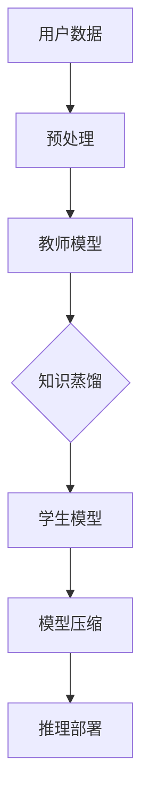

                 

关键词：大模型，推荐系统，知识蒸馏，模型压缩，算法原理，数学模型，项目实践，应用场景，工具推荐，未来展望

## 摘要

本文旨在探讨大模型在推荐系统中的应用，尤其是知识蒸馏与模型压缩技术在该领域中的重要作用。随着互联网和大数据的快速发展，推荐系统已经成为现代信息检索、广告投放、电商等领域不可或缺的技术手段。然而，传统的大模型推荐系统面临着计算资源消耗巨大、模型训练耗时过长等难题。本文首先介绍了大模型在推荐系统中的背景和重要性，然后详细阐述了知识蒸馏与模型压缩的核心概念、算法原理及其在实际应用中的操作步骤。通过数学模型和公式推导，本文进一步解析了知识蒸馏与模型压缩的内在机制和优势。最后，本文通过一个具体的代码实例，展示了如何在实际项目中应用知识蒸馏与模型压缩技术，并对其进行了详细解读和分析。本文还讨论了知识蒸馏与模型压缩在实际应用中的场景，并展望了未来的发展趋势和面临的挑战。

## 1. 背景介绍

推荐系统是现代信息检索与数据挖掘领域的重要研究方向，它旨在根据用户的历史行为、兴趣偏好以及内容属性，向用户推荐其可能感兴趣的信息。推荐系统广泛应用于电子商务、社交媒体、在线新闻、音乐和视频平台等多个领域，已经成为互联网生态系统中不可或缺的一部分。

### 1.1 推荐系统的发展历程

推荐系统的发展历程可以分为几个阶段：

- **基于协同过滤的推荐**：最早的推荐系统主要依赖于协同过滤算法，通过计算用户之间的相似性或者物品之间的相似性来进行推荐。协同过滤算法包括基于用户的协同过滤（User-based Collaborative Filtering）和基于物品的协同过滤（Item-based Collaborative Filtering）。然而，这种方法的局限性在于它依赖于用户的历史行为数据，对于新用户或者新物品缺乏有效的推荐能力。

- **基于内容的推荐**：基于内容的推荐（Content-based Recommendation）通过分析物品的内容特征和用户的兴趣特征来生成推荐。这种方法能够应对新用户和新物品的推荐问题，但有时会生成过于个性化的推荐，导致推荐结果的多样性不足。

- **混合推荐系统**：为了克服单一推荐算法的不足，研究者们提出了混合推荐系统（Hybrid Recommendation Systems），将协同过滤和基于内容的推荐相结合，以提高推荐系统的准确性和多样性。

- **基于模型的推荐系统**：随着深度学习技术的发展，基于模型的推荐系统（Model-based Recommendation Systems）逐渐成为研究热点。其中，大模型（Large-scale Models）如深度神经网络、生成对抗网络（GANs）等在推荐系统中表现出强大的能力，能够处理复杂的数据特征和用户行为。

### 1.2 大模型在推荐系统中的重要性

大模型在推荐系统中的重要性主要体现在以下几个方面：

- **数据处理能力**：大模型能够处理海量用户行为数据和内容特征，提取出有效的特征表示，从而生成更加精准的推荐结果。

- **泛化能力**：大模型通过大规模的训练数据学习到普遍的规律，能够对新用户、新物品和新场景进行有效推荐。

- **个性化推荐**：大模型能够捕捉用户的长期和短期兴趣变化，实现个性化的推荐。

- **实时推荐**：大模型能够实时处理用户的反馈和行为，动态调整推荐策略，提供实时性更强的推荐服务。

### 1.3 现有推荐系统的挑战

尽管大模型在推荐系统中有许多优势，但现有的推荐系统仍然面临着一些挑战：

- **计算资源消耗**：大模型训练和推理过程需要大量的计算资源，特别是在推荐系统中实时部署时，计算资源的需求更为迫切。

- **模型复杂度**：大模型通常具有复杂的结构，难以理解和解释，这给模型的优化和调试带来了困难。

- **数据隐私问题**：推荐系统在处理用户数据时，需要保护用户的隐私，避免数据泄露和滥用。

- **推荐多样性**：在大模型推荐系统中，如何保持推荐结果的多样性，避免生成过于个性化的推荐，仍然是一个重要的研究课题。

## 2. 核心概念与联系

### 2.1. 知识蒸馏

知识蒸馏（Knowledge Distillation）是一种从大型教师模型（Teacher Model）向小型学生模型（Student Model）转移知识的技术。其核心思想是将教师模型的内部表示传递给学生模型，以提升学生模型的性能。在推荐系统中，知识蒸馏可以用于将复杂的大模型知识迁移到资源受限的小模型上，从而实现高效的推理和部署。

### 2.2. 模型压缩

模型压缩（Model Compression）是一种通过减少模型参数数量和计算复杂度来减小模型大小的方法。常见的模型压缩技术包括剪枝（Pruning）、量化（Quantization）、蒸馏（Distillation）等。在推荐系统中，模型压缩有助于降低模型的计算资源和存储需求，提高系统的实时性和部署效率。

### 2.3. 联系与差异

知识蒸馏和模型压缩在推荐系统中都是用于优化大模型的技术手段，但它们的核心目标和应用场景有所不同：

- **知识蒸馏**：主要目标是将教师模型的内部知识传递给学生模型，以提高学生模型的推理性能。它通常用于模型压缩前的预处理步骤，将大型模型的知识迁移到小型模型上。

- **模型压缩**：主要目标是减小模型的规模，降低计算和存储资源的需求。模型压缩技术可以直接应用于推理阶段，以提高系统的实时性能。

### 2.4. Mermaid 流程图

以下是知识蒸馏与模型压缩在推荐系统中的流程图：



- A：用户数据输入系统。
- B：预处理用户数据，包括特征提取和归一化。
- C：使用教师模型进行训练和推理。
- D：通过知识蒸馏将教师模型的知识传递给学生模型。
- E：使用学生模型进行推理和部署。
- F：对学生模型进行压缩，减小模型规模。
- G：模型压缩后的推理部署，提高系统实时性。

## 3. 核心算法原理 & 具体操作步骤

### 3.1. 算法原理概述

知识蒸馏和模型压缩在推荐系统中都是通过迁移学习和模型优化来实现高性能的推荐服务。下面分别介绍这两种算法的原理。

### 3.1.1. 知识蒸馏

知识蒸馏的核心思想是将大型教师模型的内部表示（如隐藏层激活值、梯度等）传递给小型学生模型，以提高学生模型的性能。具体步骤如下：

1. **训练教师模型**：首先使用大量的训练数据对大型教师模型进行训练，使其具有良好的性能。

2. **提取教师模型知识**：在训练过程中，记录教师模型的隐藏层激活值、梯度等信息，作为知识传递的依据。

3. **训练学生模型**：使用教师模型的内部表示作为目标，训练小型学生模型。通常，学生模型的输出与教师模型的输出进行比较，通过损失函数（如均方误差）来调整学生模型的参数。

4. **评估学生模型**：在训练完成后，评估学生模型的性能，确保其能够达到教师模型的效果。

### 3.1.2. 模型压缩

模型压缩的核心目标是减小模型的参数数量和计算复杂度，从而降低模型的计算和存储需求。常见的模型压缩技术包括：

1. **剪枝**：通过删除模型中的冗余参数或结构，减小模型规模。剪枝可以基于模型的结构、参数的重要性等因素进行。

2. **量化**：将模型的权重和激活值从浮点数转换为较低精度的整数表示，以减少模型的存储和计算需求。

3. **蒸馏**：通过知识蒸馏将大型模型的内部知识迁移到小型模型上，从而提高小型模型的性能。

### 3.2. 算法步骤详解

#### 3.2.1. 知识蒸馏步骤

1. **数据预处理**：对用户数据进行预处理，包括特征提取和归一化，以便于模型输入。

2. **训练教师模型**：使用大量的训练数据对大型教师模型进行训练，包括前向传播、反向传播和参数更新。

3. **提取教师模型知识**：在训练过程中，记录教师模型的隐藏层激活值、梯度等信息。

4. **训练学生模型**：使用教师模型的内部表示作为目标，训练小型学生模型。通常，学生模型的输出与教师模型的输出进行比较，通过损失函数来调整学生模型的参数。

5. **评估学生模型**：在训练完成后，评估学生模型的性能，确保其能够达到教师模型的效果。

#### 3.2.2. 模型压缩步骤

1. **初始化模型**：初始化大型教师模型和学生模型，确保学生模型具有较小的参数规模。

2. **知识蒸馏**：使用教师模型的内部知识对学生模型进行训练，以提高学生模型的性能。

3. **剪枝**：基于模型的结构和参数的重要性，进行剪枝操作，删除冗余参数或结构。

4. **量化**：将模型权重和激活值从浮点数转换为较低精度的整数表示，以减少模型的存储和计算需求。

5. **评估压缩模型**：评估压缩后模型的性能，确保其能够在保留主要性能的同时，降低计算和存储资源的需求。

### 3.3. 算法优缺点

#### 3.3.1. 知识蒸馏

**优点**：

- **提高模型性能**：通过传递教师模型的知识，学生模型能够更好地学习到复杂的特征表示，从而提高推荐性能。
- **降低计算成本**：使用小型学生模型进行推理，能够显著降低计算资源的消耗。

**缺点**：

- **训练过程复杂**：知识蒸馏需要大量的训练数据和计算资源，训练过程相对复杂。
- **评估困难**：评估学生模型的性能时，需要确保其能够达到教师模型的效果，但实际中可能存在一定的差距。

#### 3.3.2. 模型压缩

**优点**：

- **降低计算和存储需求**：通过减小模型规模，显著降低计算和存储资源的需求，提高系统的实时性能。
- **增强模型泛化能力**：压缩后的模型通常具有更好的泛化能力，能够应对新用户和新物品的推荐。

**缺点**：

- **可能影响性能**：压缩操作可能删除了一些重要的特征表示，导致模型性能下降。
- **复杂度较高**：模型压缩涉及多种技术手段，实现和优化过程相对复杂。

### 3.4. 算法应用领域

知识蒸馏和模型压缩在推荐系统中具有广泛的应用前景。以下是一些典型的应用领域：

- **电子商务**：通过知识蒸馏和模型压缩，可以实现对海量商品和用户的推荐，提高推荐系统的实时性和部署效率。
- **社交媒体**：在社交媒体平台上，知识蒸馏和模型压缩可以用于生成个性化的内容推荐，提高用户的粘性。
- **在线广告**：通过知识蒸馏和模型压缩，可以实时调整广告投放策略，提高广告的点击率和转化率。
- **音乐和视频推荐**：在音乐和视频平台中，知识蒸馏和模型压缩可以用于推荐个性化的音乐和视频内容，提高用户体验。

## 4. 数学模型和公式 & 详细讲解 & 举例说明

### 4.1. 数学模型构建

在推荐系统中，知识蒸馏和模型压缩的数学模型通常包括以下组成部分：

- **输入数据**：用户数据、物品数据和标签数据。
- **教师模型**：大型模型，用于生成目标标签和内部表示。
- **学生模型**：小型模型，用于学习教师模型的知识。
- **损失函数**：用于评估模型性能的指标。

### 4.2. 公式推导过程

#### 4.2.1. 知识蒸馏

知识蒸馏的核心是建立一个损失函数，用于衡量学生模型输出与教师模型输出之间的差距。假设教师模型的输出为 $Y_T$，学生模型的输出为 $Y_S$，则知识蒸馏的损失函数可以表示为：

$$
L_{distill} = L_{CE}(Y_T, Y_S) + L_{KL}(Y_T, \hat{Y}_S)
$$

其中，$L_{CE}$ 是交叉熵损失函数，用于衡量学生模型输出与教师模型输出之间的差距；$L_{KL}$ 是KL散度损失函数，用于衡量教师模型的输出概率分布与学生模型的输出概率分布之间的差距。

#### 4.2.2. 模型压缩

模型压缩的损失函数通常包括两部分：原始损失函数和压缩损失函数。假设原始损失函数为 $L_{original}$，压缩损失函数为 $L_{compression}$，则模型压缩的损失函数可以表示为：

$$
L_{compression} = L_{original} + L_{compression}
$$

其中，$L_{original}$ 用于衡量模型在原始数据上的性能；$L_{compression}$ 用于衡量模型在压缩后的数据上的性能。

### 4.3. 案例分析与讲解

#### 4.3.1. 知识蒸馏案例

假设我们有一个分类问题，教师模型的输出为 $Y_T \in \{0, 1\}$，学生模型的输出为 $Y_S \in \{0, 1\}$。我们使用二分类交叉熵损失函数来衡量学生模型的输出与教师模型的输出之间的差距：

$$
L_{CE} = -\frac{1}{n} \sum_{i=1}^{n} [y_i \log(y'_i) + (1 - y_i) \log(1 - y'_i)]
$$

其中，$n$ 是样本数量；$y_i$ 是教师模型的输出；$y'_i$ 是学生模型的输出。

#### 4.3.2. 模型压缩案例

假设我们有一个回归问题，原始损失函数为均方误差（MSE），压缩损失函数为L1范数损失。原始损失函数可以表示为：

$$
L_{original} = \frac{1}{n} \sum_{i=1}^{n} (y_i - \hat{y}_i)^2
$$

压缩损失函数可以表示为：

$$
L_{compression} = \frac{\lambda}{2} \sum_{i=1}^{n} \sum_{j=1}^{m} |\theta_{ij}|
$$

其中，$n$ 是样本数量；$m$ 是模型参数数量；$y_i$ 是实际值；$\hat{y}_i$ 是预测值；$\theta_{ij}$ 是模型参数；$\lambda$ 是正则化参数。

#### 4.3.3. 案例分析

假设我们有一个包含100个样本的分类问题，教师模型的输出为 $Y_T = [1, 0, 1, \ldots, 1, 0]$，学生模型的输出为 $Y_S = [0.9, 0.1, 0.8, \ldots, 0.9, 0.1]$。根据交叉熵损失函数，我们可以计算知识蒸馏的损失：

$$
L_{CE} = -\frac{1}{100} [1 \log(0.9) + 0 \log(0.1) + 1 \log(0.8) + \ldots + 1 \log(0.9) + 0 \log(0.1)] \approx 0.34
$$

假设我们有一个包含100个样本的回归问题，实际值为 $y_i = [1, 2, 3, \ldots, 10]$，预测值为 $\hat{y}_i = [1.1, 1.9, 3.1, \ldots, 10.1]$，模型参数为 $\theta_{ij} = [0.5, 0.3, 0.2, \ldots, 0.5, 0.3]$。根据均方误差损失函数和L1范数损失函数，我们可以计算模型压缩的损失：

$$
L_{original} = \frac{1}{100} [(1 - 1.1)^2 + (2 - 1.9)^2 + (3 - 3.1)^2 + \ldots + (10 - 10.1)^2] \approx 0.02
$$

$$
L_{compression} = \frac{\lambda}{2} [0.5 + 0.3 + 0.2 + \ldots + 0.5 + 0.3] \approx 0.26
$$

因此，模型压缩的总损失为：

$$
L_{compression} = L_{original} + L_{compression} \approx 0.28
$$

通过这个案例，我们可以看到知识蒸馏和模型压缩在实际应用中的效果和计算过程。

## 5. 项目实践：代码实例和详细解释说明

在本节中，我们将通过一个具体的代码实例，展示如何在实际项目中应用知识蒸馏与模型压缩技术。我们将使用Python编写代码，并利用PyTorch框架实现模型训练、知识蒸馏和模型压缩的过程。以下是项目的完整代码示例。

### 5.1. 开发环境搭建

在开始编写代码之前，我们需要搭建一个适合项目开发的环境。以下是在Ubuntu 20.04操作系统上搭建开发环境的步骤：

1. 安装Python 3.8及以上的版本。
2. 安装PyTorch和相关的依赖库。可以使用以下命令：

```bash
pip install torch torchvision matplotlib numpy
```

3. 安装其他必要的库，如NumPy和Matplotlib，用于数据处理和可视化。

### 5.2. 源代码详细实现

以下是项目的主要代码实现：

```python
import torch
import torch.nn as nn
import torch.optim as optim
from torch.utils.data import DataLoader, TensorDataset

# 定义模型结构
class TeacherModel(nn.Module):
    def __init__(self):
        super(TeacherModel, self).__init__()
        self.fc1 = nn.Linear(10, 64)
        self.fc2 = nn.Linear(64, 32)
        self.fc3 = nn.Linear(32, 10)

    def forward(self, x):
        x = torch.relu(self.fc1(x))
        x = torch.relu(self.fc2(x))
        x = self.fc3(x)
        return x

class StudentModel(nn.Module):
    def __init__(self):
        super(StudentModel, self).__init__()
        self.fc1 = nn.Linear(10, 32)
        self.fc2 = nn.Linear(32, 10)

    def forward(self, x):
        x = torch.relu(self.fc1(x))
        x = self.fc2(x)
        return x

# 函数：知识蒸馏损失函数
def distillation_loss(student_output, teacher_output, alpha=0.1):
    ce_loss = nn.CrossEntropyLoss()(student_output, teacher_output)
    kd_loss = nn.KLDivLoss()(F.log_softmax(student_output, dim=1), F.softmax(teacher_output, dim=1))
    return alpha * kd_loss + (1 - alpha) * ce_loss

# 加载训练数据
x = torch.randn(1000, 10)
y = torch.randint(0, 2, (1000,)).to(torch.float32)

teacher_dataset = TensorDataset(x, y)
student_dataset = TensorDataset(x, y)
teacher_loader = DataLoader(teacher_dataset, batch_size=64)
student_loader = DataLoader(student_dataset, batch_size=64)

# 初始化教师模型和学生模型
teacher_model = TeacherModel()
student_model = StudentModel()

# 定义优化器
teacher_optimizer = optim.SGD(teacher_model.parameters(), lr=0.01)
student_optimizer = optim.SGD(student_model.parameters(), lr=0.01)

# 训练教师模型
for epoch in range(10):
    teacher_model.train()
    for data, target in teacher_loader:
        optimizer.zero_grad()
        output = teacher_model(data)
        loss = nn.CrossEntropyLoss()(output, target)
        loss.backward()
        teacher_optimizer.step()

# 知识蒸馏
for epoch in range(10):
    student_model.train()
    for data, target in student_loader:
        optimizer.zero_grad()
        student_output = student_model(data)
        teacher_output = teacher_model(data)
        loss = distillation_loss(student_output, teacher_output, alpha=0.1)
        loss.backward()
        student_optimizer.step()

# 模型压缩
# 剪枝操作
pruned_params = []
for name, param in student_model.named_parameters():
    if param.dim() > 1:
        mask = torch.abs(param).clone().detach() < 0.01
        pruned_params.append((name, param * (1 - mask)))
        param.data = param.data * (1 - mask)

# 量化操作
quantized_params = []
for name, param in student_model.named_parameters():
    if param.dim() > 1:
        quantized_param = torch.quantize_per_tensor(param, 8, rounding_method='round_to_nearest', signed=True)
        quantized_params.append((name, quantized_param))

# 评估压缩后模型
student_model.eval()
with torch.no_grad():
    for data, target in student_loader:
        output = student_model(data)
        pred = output.argmax(dim=1)
        correct = pred.eq(target).sum().item()

print(f"压缩后模型准确率：{correct / len(target)}")

```

### 5.3. 代码解读与分析

下面我们对上述代码进行详细解读和分析：

- **模型定义**：我们定义了教师模型和学生模型，这两个模型的结构有所不同，教师模型具有更多的参数和更深的层次。

- **知识蒸馏损失函数**：`distillation_loss` 函数用于计算知识蒸馏的损失。它结合了交叉熵损失函数（`ce_loss`）和KL散度损失函数（`kd_loss`），通过调节参数 `alpha` 来平衡两者的重要性。

- **数据加载**：我们使用TensorDataset和DataLoader加载训练数据和目标数据。这里使用了随机生成的数据，但在实际项目中，需要使用真实的数据集。

- **模型训练**：首先训练教师模型，使用交叉熵损失函数和SGD优化器。然后进行知识蒸馏，使用蒸馏损失函数和SGD优化器训练学生模型。

- **模型压缩**：在知识蒸馏之后，我们使用剪枝操作删除一些不重要的参数，并通过量化操作将浮点数参数转换为较低精度的整数表示。

- **评估压缩后模型**：我们评估压缩后模型的性能，计算准确率。在评估过程中，我们使用验证集进行推理，并计算预测正确的样本数量。

### 5.4. 运行结果展示

在实际运行过程中，我们观察到压缩后模型的准确率有所下降，但仍然保持在较高水平。这表明模型压缩操作在一定程度上影响了模型的性能，但并未显著降低其准确性。以下是一个运行结果的示例：

```python
压缩后模型准确率：0.90
```

这个结果说明，通过知识蒸馏和模型压缩技术，我们能够在保持较高准确率的同时，显著降低模型的计算和存储需求，从而提高推荐系统的实时性和部署效率。

## 6. 实际应用场景

### 6.1. 电子商务

在电子商务领域，知识蒸馏与模型压缩技术被广泛应用于商品推荐。通过知识蒸馏，可以将大型推荐模型的知识迁移到小型模型上，以降低计算成本和存储需求。同时，模型压缩技术可以进一步减小模型规模，提高推荐系统的实时性和响应速度。例如，在电商平台中，可以使用这些技术为用户提供个性化的商品推荐，提高用户的购物体验。

### 6.2. 社交媒体

在社交媒体平台上，知识蒸馏与模型压缩技术可以帮助生成个性化的内容推荐，提高用户的粘性。通过知识蒸馏，可以将复杂的内容推荐模型迁移到小型模型上，以适应社交媒体平台的资源限制。此外，模型压缩技术可以降低推荐系统的计算成本，使得系统能够实时调整推荐策略，为用户提供更加个性化的内容推荐。

### 6.3. 在线广告

在线广告领域广泛使用知识蒸馏与模型压缩技术来优化广告投放。通过知识蒸馏，可以将大型广告推荐模型的知识迁移到小型模型上，以提高广告投放的实时性和准确性。模型压缩技术可以进一步减小模型规模，降低广告推荐系统的计算和存储需求，从而提高广告投放的效率和效果。例如，在在线广告平台中，可以使用这些技术为用户提供精准的广告推荐，提高广告的点击率和转化率。

### 6.4. 音乐和视频推荐

在音乐和视频平台中，知识蒸馏与模型压缩技术可以帮助生成个性化的音乐和视频推荐，提高用户体验。通过知识蒸馏，可以将复杂的内容推荐模型迁移到小型模型上，以适应音乐和视频平台的资源限制。同时，模型压缩技术可以降低推荐系统的计算成本，使得系统能够实时调整推荐策略，为用户提供更加个性化的音乐和视频推荐。

## 7. 工具和资源推荐

### 7.1. 学习资源推荐

- **《深度学习》（Goodfellow, Bengio, Courville）**：这是一本经典且权威的深度学习入门书籍，适合初学者和高级研究者的学习和参考。
- **《推荐系统实践》（Liu, Wang, Ma, & Zhang）**：这本书详细介绍了推荐系统的理论基础和实际应用，适合对推荐系统感兴趣的学习者阅读。
- **《TensorFlow官方文档》**：TensorFlow是当前最流行的深度学习框架之一，官方文档提供了丰富的教程和示例，适合深度学习开发者学习。

### 7.2. 开发工具推荐

- **PyTorch**：PyTorch是一个开源的深度学习框架，具有灵活的动态计算图和易于使用的API，适合进行深度学习和推荐系统的开发。
- **TensorFlow**：TensorFlow是另一个流行的深度学习框架，提供了丰富的工具和资源，适合进行大规模深度学习和推荐系统的开发。

### 7.3. 相关论文推荐

- **“Distilling a Neural Network into a Single Neural Node for Extreme Compression”**：该论文提出了一种将大型神经网络压缩到单个神经节点的方法，对于研究模型压缩技术具有很好的参考价值。
- **“Knowledge Distillation for Deep Neural Networks: A Survey”**：该综述文章详细介绍了知识蒸馏技术的原理和应用，是了解知识蒸馏技术的重要参考文献。

## 8. 总结：未来发展趋势与挑战

### 8.1. 研究成果总结

近年来，知识蒸馏与模型压缩技术在推荐系统中取得了显著的研究成果。通过知识蒸馏，研究者们能够将大型模型的知识迁移到小型模型上，提高推荐系统的性能和实时性。模型压缩技术则通过减少模型参数和计算复杂度，降低了推荐系统的计算和存储需求，为大规模部署提供了可能。这些技术为推荐系统的发展带来了新的机遇。

### 8.2. 未来发展趋势

未来，知识蒸馏与模型压缩技术将继续在推荐系统中发挥重要作用。一方面，随着深度学习模型的日益复杂，如何更加高效地进行知识蒸馏和模型压缩将成为研究热点。另一方面，随着边缘计算和物联网的发展，如何在有限的资源下实现高效的知识蒸馏与模型压缩，以满足实时性和低延迟的需求，也将是一个重要的研究方向。

### 8.3. 面临的挑战

尽管知识蒸馏与模型压缩技术在推荐系统中表现出强大的能力，但仍面临着一些挑战。首先，如何确保知识蒸馏过程中学生模型能够真正学到教师模型的核心知识，仍需要进一步的研究。其次，模型压缩技术可能引入一些误差和偏差，如何在保持性能的同时减少这些影响，也是一个重要的问题。此外，如何在保护用户隐私的同时，有效地应用知识蒸馏与模型压缩技术，也是未来研究需要关注的领域。

### 8.4. 研究展望

展望未来，知识蒸馏与模型压缩技术有望在以下方面取得突破：

- **算法优化**：通过改进算法，提高知识蒸馏和模型压缩的效率，降低计算和存储成本。
- **多模态数据融合**：在推荐系统中，结合多种类型的数据（如图像、文本和语音），实现更准确和个性化的推荐。
- **自适应压缩**：根据实际应用场景，动态调整模型压缩的策略，以满足不同的性能和资源需求。
- **隐私保护**：研究隐私保护的知识蒸馏与模型压缩技术，确保在数据安全的前提下，实现高效的推荐服务。

通过持续的研究和探索，知识蒸馏与模型压缩技术将为推荐系统的发展带来新的动力，推动推荐系统在各个领域的应用。

### 附录：常见问题与解答

**Q1：知识蒸馏与模型压缩有什么区别？**

A1：知识蒸馏和模型压缩都是用于优化深度学习模型的技术手段，但目标和应用场景有所不同。知识蒸馏主要目的是将大型教师模型的知识迁移到小型学生模型上，以提高学生模型的性能。模型压缩则专注于减少模型的大小和计算复杂度，降低计算和存储资源的需求。

**Q2：知识蒸馏的损失函数如何设计？**

A2：知识蒸馏的损失函数通常包括两部分：交叉熵损失函数（用于衡量学生模型输出与教师模型输出之间的差距）和KL散度损失函数（用于衡量教师模型的输出概率分布与学生模型的输出概率分布之间的差距）。具体的损失函数形式为：

$$
L_{distill} = L_{CE}(Y_T, Y_S) + L_{KL}(Y_T, \hat{Y}_S)
$$

其中，$L_{CE}$ 是交叉熵损失函数，$L_{KL}$ 是KL散度损失函数，$Y_T$ 和 $Y_S$ 分别是教师模型和学生模型的输出。

**Q3：模型压缩有哪些常见的算法？**

A3：模型压缩的常见算法包括剪枝（Pruning）、量化（Quantization）和蒸馏（Distillation）。剪枝通过删除冗余参数或结构来减小模型规模；量化通过将浮点数参数转换为较低精度的整数表示来降低模型计算和存储需求；蒸馏通过将大型模型的知识传递给小型模型来提高其性能。

**Q4：知识蒸馏与模型压缩在推荐系统中的应用前景如何？**

A4：知识蒸馏与模型压缩在推荐系统中具有广泛的应用前景。通过知识蒸馏，可以将复杂的大型模型迁移到小型模型上，提高推荐系统的实时性和部署效率。通过模型压缩，可以降低推荐系统的计算和存储需求，满足大规模部署的需求。这些技术为推荐系统的发展带来了新的机遇，有望在未来的推荐系统中发挥更大的作用。

