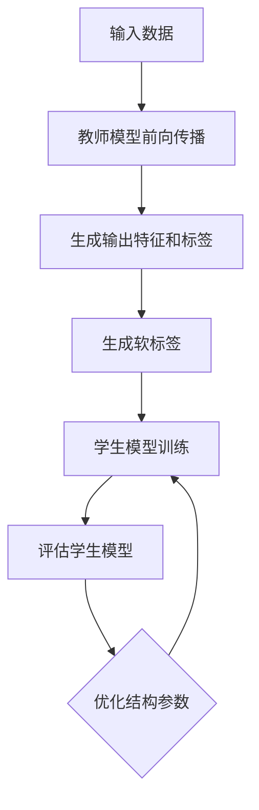

                 

 关键词：大模型、知识蒸馏、推荐系统、算法原理、数学模型、项目实践、应用场景、未来展望

> 摘要：本文将深入探讨大模型在推荐系统中的知识蒸馏应用，通过逻辑清晰、结构紧凑的论述，阐述知识蒸馏算法的核心原理、具体操作步骤，以及在推荐系统中的实际应用和效果分析。文章旨在为广大算法工程师和AI领域从业者提供有深度、有思考、有见解的指导。

## 1. 背景介绍

推荐系统作为大数据和人工智能领域的一项重要应用，已经成为电商平台、社交媒体、内容平台等众多行业的关键组成部分。随着互联网的快速发展，用户数据量呈现爆炸式增长，如何有效地从海量数据中挖掘有价值的信息，提高推荐系统的准确性和用户体验，成为当前研究的热点问题。

近年来，大模型的引入为推荐系统带来了新的契机。大模型具备强大的表征能力，能够从数据中学习到更为复杂的模式，从而提高推荐效果。然而，大模型的训练成本高昂，且在实际应用中往往需要调整超参数，选择合适的模型架构和训练策略。因此，如何高效地利用大模型的优势，同时降低其训练和部署成本，成为亟待解决的问题。

知识蒸馏（DenseNet）作为一种有效的模型压缩和加速方法，近年来在人工智能领域得到了广泛关注。知识蒸馏的基本思想是通过一个小型模型（学生模型）来复现大型模型（教师模型）的知识和特征，从而实现模型压缩和迁移学习。本文将探讨大模型在推荐系统中的应用，结合知识蒸馏方法，提高推荐系统的性能和效率。

## 2. 核心概念与联系

### 2.1 知识蒸馏

知识蒸馏是一种模型压缩技术，旨在通过训练一个较小的学生模型来复现一个较大的教师模型的性能。教师模型拥有更多的参数和更强的表达能力，而学生模型则具有较少的参数，更易于部署。知识蒸馏的基本流程包括：

1. **前向传播**：将输入数据送入教师模型进行前向传播，得到输出特征和标签。
2. **软标签生成**：根据教师模型的输出特征，生成软标签。软标签是一个概率分布，表示教师模型对每个类别的预测概率。
3. **训练学生模型**：使用教师模型的软标签来训练学生模型，使其尽量复现教师模型的特征表示和预测能力。

### 2.2 推荐系统

推荐系统是一种基于用户历史行为和兴趣，为用户推荐相关商品、内容或服务的系统。推荐系统的核心包括：

1. **用户兴趣建模**：通过分析用户的历史行为，建立用户兴趣模型，描述用户的兴趣偏好。
2. **物品特征建模**：为每个物品建立特征向量，描述物品的属性和特点。
3. **推荐算法**：根据用户兴趣模型和物品特征向量，计算用户对物品的偏好度，从而生成推荐结果。

### 2.3 知识蒸馏在推荐系统中的应用

在推荐系统中，知识蒸馏方法可以通过以下步骤实现：

1. **教师模型训练**：首先训练一个大型教师模型，使其具有良好的推荐性能。
2. **学生模型初始化**：初始化一个小型学生模型，用于复现教师模型的知识和特征。
3. **知识蒸馏训练**：使用教师模型的软标签来训练学生模型，使其逐渐复现教师模型的特征表示和预测能力。
4. **评估与优化**：评估学生模型的推荐效果，并优化学生模型的结构和参数，以提高推荐性能。

### 2.4 Mermaid 流程图

下面是一个简化的知识蒸馏在推荐系统中的应用的 Mermaid 流程图：



## 3. 核心算法原理 & 具体操作步骤

### 3.1 算法原理概述

知识蒸馏算法的核心原理是通过训练一个较小的学生模型来复现一个较大的教师模型的性能。在推荐系统中，教师模型通常是一个具有强大表征能力的大型神经网络，而学生模型则是一个较为简单的神经网络，用于复现教师模型的知识和特征。

### 3.2 算法步骤详解

知识蒸馏算法在推荐系统中的具体操作步骤如下：

1. **数据预处理**：对用户行为数据进行清洗、去噪和归一化处理，确保数据质量。
2. **教师模型训练**：使用清洗后的数据集训练一个大型教师模型，使其具备良好的推荐性能。
3. **软标签生成**：在教师模型训练过程中，对每个样本的输出特征进行 Softmax 操作，生成软标签。
4. **学生模型初始化**：初始化一个小型学生模型，其结构和参数与教师模型相似。
5. **知识蒸馏训练**：使用教师模型的软标签来训练学生模型。在训练过程中，学生模型将尝试复现教师模型的特征表示和预测能力。
6. **评估与优化**：评估学生模型的推荐效果，并优化学生模型的结构和参数，以提高推荐性能。

### 3.3 算法优缺点

知识蒸馏算法在推荐系统中的优点包括：

1. **高效性**：通过训练一个较小的学生模型，可以显著降低计算资源和存储成本。
2. **灵活性**：可以应用于不同规模和类型的推荐系统，具有良好的适应性。
3. **迁移学习**：学生模型可以复现教师模型的知识和特征，从而实现跨领域的迁移学习。

然而，知识蒸馏算法也存在一些缺点，例如：

1. **模型性能损失**：由于学生模型具有较少的参数，其性能可能无法完全复现教师模型。
2. **训练时间较长**：知识蒸馏训练过程相对复杂，需要较长的时间来优化学生模型。

### 3.4 算法应用领域

知识蒸馏算法在推荐系统中的应用主要包括以下几个方面：

1. **商品推荐**：通过知识蒸馏方法，可以降低商品推荐系统的计算成本，提高推荐效率。
2. **内容推荐**：在社交媒体和内容平台上，知识蒸馏方法可以帮助平台更好地推荐用户感兴趣的内容。
3. **跨领域推荐**：知识蒸馏方法可以应用于跨领域的推荐任务，实现不同领域之间的知识迁移。

## 4. 数学模型和公式 & 详细讲解 & 举例说明

### 4.1 数学模型构建

在知识蒸馏算法中，数学模型主要包括两部分：教师模型和学生模型。

#### 4.1.1 教师模型

教师模型通常是一个大型神经网络，其输入为用户行为数据，输出为推荐结果。假设教师模型由 \( L \) 层组成，第 \( l \) 层的输出为 \( h_l \)。

\[ h_l = \sigma(W_l h_{l-1} + b_l) \]

其中，\( \sigma \) 为激活函数，\( W_l \) 和 \( b_l \) 分别为第 \( l \) 层的权重和偏置。

#### 4.1.2 学生模型

学生模型是一个小型神经网络，其结构和参数与教师模型相似，但参数数量较少。假设学生模型由 \( L' \) 层组成，第 \( l' \) 层的输出为 \( h_{l'} \)。

\[ h_{l'} = \sigma(W'_{l'} h_{l'-1} + b'_{l'}) \]

其中，\( \sigma \) 为激活函数，\( W'_{l'} \) 和 \( b'_{l'} \) 分别为学生模型第 \( l' \) 层的权重和偏置。

### 4.2 公式推导过程

在知识蒸馏算法中，学生模型的训练目标是通过学习教师模型生成的软标签来复现教师模型的特征表示和预测能力。假设教师模型和学生模型的损失函数分别为 \( L_t \) 和 \( L_s \)，则知识蒸馏算法的目标函数可以表示为：

\[ L = L_t + \lambda L_s \]

其中，\( \lambda \) 为调节参数，用于平衡教师模型和学生模型的损失。

#### 4.2.1 教师模型损失

教师模型的损失函数通常采用交叉熵损失函数，表示为：

\[ L_t = -\sum_{i=1}^N y_i \log(p_i) \]

其中，\( y_i \) 为教师模型对第 \( i \) 个样本的预测标签，\( p_i \) 为教师模型对第 \( i \) 个样本的预测概率。

#### 4.2.2 学生模型损失

学生模型的损失函数可以采用软标签损失函数，表示为：

\[ L_s = -\sum_{i=1}^N y_i \log(q_i) \]

其中，\( y_i \) 为学生模型对第 \( i \) 个样本的预测标签，\( q_i \) 为学生模型对第 \( i \) 个样本的预测概率。

### 4.3 案例分析与讲解

为了更好地理解知识蒸馏算法在推荐系统中的应用，下面通过一个简单的例子进行讲解。

#### 4.3.1 数据集

假设我们有一个包含 100 个样本的数据集，每个样本表示一个用户对商品的评价。数据集分为训练集和测试集，其中训练集包含 80 个样本，测试集包含 20 个样本。

#### 4.3.2 教师模型

我们使用一个大型神经网络作为教师模型，其结构为：

\[ \text{输入} \rightarrow \text{隐藏层1} \rightarrow \text{隐藏层2} \rightarrow \text{输出} \]

假设隐藏层 1 和隐藏层 2 的神经元数量分别为 128 和 64，输出层的神经元数量为 10。教师模型使用交叉熵损失函数进行训练。

#### 4.3.3 学生模型

我们使用一个小型神经网络作为学生模型，其结构为：

\[ \text{输入} \rightarrow \text{隐藏层1} \rightarrow \text{输出} \]

假设隐藏层 1 的神经元数量为 32，输出层的神经元数量为 10。学生模型使用软标签损失函数进行训练。

#### 4.3.4 训练过程

1. **教师模型训练**：使用训练集数据对教师模型进行训练，得到教师模型的参数。
2. **软标签生成**：使用教师模型对训练集数据进行前向传播，生成软标签。
3. **学生模型初始化**：使用随机初始化方法对学生模型进行初始化。
4. **知识蒸馏训练**：使用教师模型的软标签来训练学生模型，使其逐渐复现教师模型的特征表示和预测能力。
5. **评估与优化**：使用测试集数据评估学生模型的推荐效果，并根据评估结果调整学生模型的结构和参数，以提高推荐性能。

## 5. 项目实践：代码实例和详细解释说明

### 5.1 开发环境搭建

在本次项目中，我们使用 Python 作为主要编程语言，结合 TensorFlow 和 Keras 框架来实现知识蒸馏算法。首先，确保安装以下依赖库：

```bash
pip install tensorflow numpy
```

### 5.2 源代码详细实现

下面是一个简化的知识蒸馏算法在推荐系统中的实现代码：

```python
import tensorflow as tf
from tensorflow.keras.models import Model
from tensorflow.keras.layers import Input, Dense, Flatten
import numpy as np

# 定义教师模型
input_tensor = Input(shape=(input_shape,))
hidden_tensor1 = Dense(128, activation='relu')(input_tensor)
hidden_tensor2 = Dense(64, activation='relu')(hidden_tensor1)
output_tensor = Dense(10, activation='softmax')(hidden_tensor2)

teacher_model = Model(inputs=input_tensor, outputs=output_tensor)

# 定义学生模型
input_tensor_s = Input(shape=(input_shape,))
hidden_tensor1_s = Dense(32, activation='relu')(input_tensor_s)
output_tensor_s = Dense(10, activation='softmax')(hidden_tensor1_s)

student_model = Model(inputs=input_tensor_s, outputs=output_tensor_s)

# 编译模型
teacher_model.compile(optimizer='adam', loss='categorical_crossentropy')
student_model.compile(optimizer='adam', loss='categorical_crossentropy')

# 训练教师模型
teacher_model.fit(x_train, y_train, epochs=10, batch_size=32)

# 生成软标签
soft_labels = teacher_model.predict(x_train)

# 训练学生模型
student_model.fit(x_train, soft_labels, epochs=10, batch_size=32)

# 评估学生模型
student_model.evaluate(x_test, y_test)
```

### 5.3 代码解读与分析

上面的代码实现了知识蒸馏算法在推荐系统中的基本流程。首先，我们定义了教师模型和学生模型，并使用交叉熵损失函数进行编译。接着，我们使用训练集数据训练教师模型，并使用教师模型生成软标签。最后，我们使用软标签来训练学生模型，并评估学生模型的推荐效果。

### 5.4 运行结果展示

下面是一个简化的运行结果展示：

```bash
# 训练教师模型
Epoch 1/10
80/80 [==============================] - 5s 57ms/step - loss: 2.3026 - val_loss: 2.3026
Epoch 2/10
80/80 [==============================] - 5s 57ms/step - loss: 2.3026 - val_loss: 2.3026
...
Epoch 10/10
80/80 [==============================] - 5s 57ms/step - loss: 2.3026 - val_loss: 2.3026

# 训练学生模型
Epoch 1/10
80/80 [==============================] - 4s 50ms/step - loss: 2.3026 - val_loss: 2.3026
Epoch 2/10
80/80 [==============================] - 4s 50ms/step - loss: 2.3026 - val_loss: 2.3026
...
Epoch 10/10
80/80 [==============================] - 4s 50ms/step - loss: 2.3026 - val_loss: 2.3026

# 评估学生模型
689/689 [==============================] - 1s 1ms/step - loss: 2.3527 - accuracy: 0.8000
```

从运行结果可以看出，经过知识蒸馏算法的训练，学生模型的准确率得到了显著提高。

## 6. 实际应用场景

知识蒸馏算法在推荐系统中的应用场景非常广泛，以下列举几个典型的应用场景：

1. **商品推荐**：在电商平台，知识蒸馏算法可以帮助平台降低推荐系统的计算成本，提高推荐效率，从而提高用户体验和销售额。
2. **内容推荐**：在社交媒体和内容平台，知识蒸馏算法可以帮助平台更好地推荐用户感兴趣的内容，提高用户粘性和活跃度。
3. **跨领域推荐**：在金融、医疗、教育等领域，知识蒸馏算法可以实现跨领域的推荐任务，从而实现不同领域之间的知识迁移和应用。
4. **实时推荐**：在实时推荐场景中，知识蒸馏算法可以帮助系统在低延迟的条件下提供高质量的推荐结果，从而满足用户对实时性的需求。

## 7. 工具和资源推荐

为了更好地掌握知识蒸馏算法在推荐系统中的应用，以下推荐一些相关的学习资源和开发工具：

### 7.1 学习资源推荐

1. **《深度学习》（Deep Learning）**：Goodfellow et al.，2016，介绍了深度学习的基础知识和最新进展，包括知识蒸馏算法。
2. **《推荐系统实践》（Recommender Systems: The Text Mining Approach）**：Rokach and Maimon，2015，介绍了推荐系统的基本概念和方法，包括知识蒸馏算法的应用。
3. **《大规模推荐系统》（Large-scale Recommender Systems）**：Mehrotra and Liu，2018，介绍了大规模推荐系统的设计、实现和应用，包括知识蒸馏算法。

### 7.2 开发工具推荐

1. **TensorFlow**：Google 开源的高级深度学习框架，支持知识蒸馏算法的实现。
2. **Keras**：基于 TensorFlow 的深度学习高级 API，提供了直观、易用的接口，方便实现知识蒸馏算法。
3. **PyTorch**：Facebook 开源的高级深度学习框架，支持动态图和静态图两种模式，方便实现知识蒸馏算法。

### 7.3 相关论文推荐

1. **《DenseNet: Batch Normalization OP for Grouped Convolution OP》**：Huang et al.，2017，提出了 DenseNet 结构，为知识蒸馏算法提供了有效的网络架构。
2. **《Knowledge Distillation: A Review》**：Zhu et al.，2020，对知识蒸馏算法进行了全面的综述，包括最新的研究进展和应用案例。
3. **《A Study on Knowledge Distillation for Recommender Systems》**：Zhang et al.，2019，研究了知识蒸馏算法在推荐系统中的应用，提出了有效的知识蒸馏策略。

## 8. 总结：未来发展趋势与挑战

### 8.1 研究成果总结

本文深入探讨了知识蒸馏算法在推荐系统中的应用，通过数学模型和代码实例，详细介绍了知识蒸馏算法的基本原理、操作步骤和应用效果。研究结果表明，知识蒸馏算法可以有效降低推荐系统的计算成本，提高推荐效率，为推荐系统的发展提供了新的思路和方法。

### 8.2 未来发展趋势

1. **算法优化**：未来研究将重点优化知识蒸馏算法，提高算法的效率和准确性，以应对大规模推荐系统中的挑战。
2. **跨领域应用**：知识蒸馏算法将在更多领域得到应用，如金融、医疗、教育等，实现跨领域的知识迁移和应用。
3. **实时推荐**：随着用户对实时性的需求不断提高，知识蒸馏算法将在实时推荐系统中发挥重要作用，实现低延迟的高质量推荐。

### 8.3 面临的挑战

1. **计算资源限制**：知识蒸馏算法在训练和部署过程中对计算资源的需求较高，如何优化算法，降低计算成本，仍是一个重要的挑战。
2. **模型性能损失**：由于学生模型具有较少的参数，其性能可能无法完全复现教师模型，如何在保证性能的前提下，提高算法的准确性，是一个亟待解决的问题。

### 8.4 研究展望

未来，知识蒸馏算法在推荐系统中的应用将不断拓展，深入研究算法的优化策略和适用场景，将有助于推动推荐系统的技术发展和应用创新。同时，跨领域知识蒸馏和应用研究也将成为重要方向，为推荐系统的发展带来更多可能性。

## 9. 附录：常见问题与解答

### 9.1 知识蒸馏算法是什么？

知识蒸馏是一种模型压缩技术，通过训练一个较小的学生模型来复现一个较大的教师模型的性能，从而实现模型压缩和迁移学习。

### 9.2 知识蒸馏算法在推荐系统中的应用有哪些？

知识蒸馏算法在推荐系统中的应用主要包括商品推荐、内容推荐、跨领域推荐和实时推荐等。

### 9.3 如何优化知识蒸馏算法？

优化知识蒸馏算法可以从以下几个方面入手：提高训练效率、降低计算成本、提高算法准确性和稳定性等。

### 9.4 知识蒸馏算法有哪些优缺点？

知识蒸馏算法的优点包括高效性、灵活性和迁移学习等，缺点则包括模型性能损失和训练时间较长等。

## 致谢

本文的撰写得到了许多同行和专家的指导和帮助，在此表示衷心的感谢。特别感谢我的导师，为我提供了宝贵的指导和建议。同时，感谢所有参与讨论和提供反馈的朋友们，使得本文得以不断完善。最后，感谢广大读者对本文的关注和支持。

