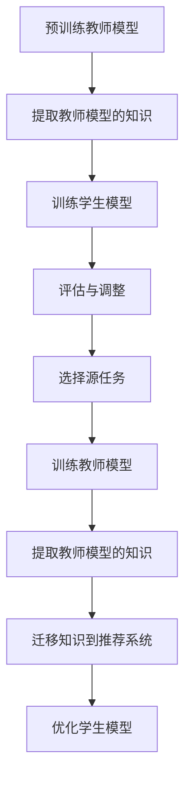

                 

关键词：大模型、推荐系统、知识蒸馏、迁移学习、模型压缩、效率优化

## 摘要

本文探讨了将大模型应用于推荐系统的挑战与机遇。在深入分析了大模型特性及其对推荐系统的影响后，本文提出了基于知识蒸馏的迁移学习方法，通过在较小规模的模型上复现大模型的知识，实现推荐系统的高效优化。文章详细介绍了知识蒸馏迁移算法的原理、数学模型、具体操作步骤及其优缺点，并通过实例展示了其在实际项目中的应用。最后，本文对未来大模型在推荐系统中的应用前景进行了展望，并提出了面临的研究挑战和展望。

## 1. 背景介绍

随着互联网技术的飞速发展，推荐系统已经成为信息检索、电子商务、社交媒体等多个领域的关键技术。推荐系统能够根据用户的历史行为和偏好，为用户推荐他们可能感兴趣的内容或商品。然而，随着数据量的增长和用户需求的多样化，传统的推荐系统面临着计算成本高、实时性差、个性化不足等挑战。

近年来，深度学习技术的崛起为推荐系统带来了新的可能性。大模型（如Transformer、BERT等）因其强大的表征能力和处理能力，在自然语言处理、计算机视觉等领域取得了显著的成果。然而，将大模型直接应用于推荐系统面临着数据量限制、计算资源不足等问题。为了解决这些问题，迁移学习和知识蒸馏技术被引入到推荐系统中，通过在大模型和小模型之间共享知识，实现推荐系统的高效优化。

本文旨在探讨大模型在推荐系统中的知识蒸馏迁移应用，通过深入分析其原理和具体操作步骤，为推荐系统的优化提供新的思路和方法。

### 1.1 大模型的特性与挑战

大模型通常具有以下几个特性：

1. **强大的表征能力**：大模型能够从大量的数据中学习到丰富的特征表示，这使得它们在处理复杂任务时具有出色的性能。

2. **高计算复杂度**：大模型通常包含数亿甚至数十亿个参数，导致训练和推理过程需要大量的计算资源。

3. **参数冗余**：大模型在训练过程中可能会学习到一些无关或冗余的信息，导致模型参数规模过大。

4. **数据依赖性**：大模型对训练数据的质量和数量有很高的要求，数据不足或数据质量差可能会导致模型性能下降。

### 1.2 推荐系统中的挑战

推荐系统在应用大模型时面临以下挑战：

1. **数据量限制**：推荐系统通常需要处理大量的用户行为数据，但实际可用数据量有限，无法支持大规模模型的全量训练。

2. **计算资源不足**：大模型的训练和推理过程需要大量的计算资源，对于资源有限的推荐系统来说，这可能导致系统性能下降。

3. **实时性需求**：推荐系统需要实时响应用户的请求，但大模型的推理过程相对较慢，难以满足实时性需求。

4. **个性化不足**：大模型可能在某些特定场景下无法很好地捕捉用户的个性化需求，导致推荐效果不佳。

### 1.3 迁移学习与知识蒸馏

迁移学习（Transfer Learning）是一种通过将一个任务（源任务）的知识应用于另一个相关任务（目标任务）的技术。知识蒸馏（Knowledge Distillation）是迁移学习的一种特殊形式，它通过将大模型（教师模型）的知识传递给小模型（学生模型），实现小模型的高效优化。

在推荐系统中，知识蒸馏迁移学习能够帮助解决以下问题：

1. **数据量限制**：通过在小模型上复现大模型的知识，可以在较少的数据量下实现良好的推荐效果。

2. **计算资源不足**：通过使用小模型，可以显著降低计算资源的需求，提高系统性能。

3. **实时性需求**：小模型的推理速度更快，可以满足推荐系统的实时性需求。

4. **个性化不足**：通过知识蒸馏，小模型可以更好地捕捉用户的个性化需求，提高推荐效果。

## 2. 核心概念与联系

### 2.1 知识蒸馏迁移学习框架

知识蒸馏迁移学习框架包括两个主要部分：教师模型和学生模型。教师模型是一个较大且性能优秀的模型，学生模型是一个较小且参数较少的模型。通过将教师模型的知识传递给学生模型，可以实现学生模型的优化。


### 2.2 知识蒸馏过程

知识蒸馏过程可以分为以下几个步骤：

1. **预训练教师模型**：在源任务上训练一个高性能的教师模型。
2. **提取教师模型的知识**：通过软标签的方式提取教师模型的内部表征。
3. **训练学生模型**：使用教师模型的软标签作为额外的监督信号训练学生模型。
4. **评估与调整**：评估学生模型的性能，并根据评估结果调整训练过程。

### 2.3 迁移学习过程

迁移学习过程可以分为以下几个步骤：

1. **选择源任务**：选择一个与推荐系统相关且数据量丰富的源任务。
2. **训练教师模型**：在源任务上训练一个高性能的教师模型。
3. **提取教师模型的知识**：通过软标签的方式提取教师模型的内部表征。
4. **迁移知识到推荐系统**：将提取的知识应用于推荐系统的学生模型。
5. **优化学生模型**：在推荐系统上继续训练学生模型，优化其性能。

### 2.4 Mermaid 流程图

以下是知识蒸馏迁移学习过程的Mermaid流程图：



## 3. 核心算法原理 & 具体操作步骤

### 3.1 算法原理概述

知识蒸馏迁移学习算法的核心思想是将大模型（教师模型）的知识迁移到小模型（学生模型），从而实现推荐系统的高效优化。具体来说，算法包括以下几个关键步骤：

1. **预训练教师模型**：在源任务上训练一个高性能的教师模型。
2. **提取教师模型的知识**：通过软标签的方式提取教师模型的内部表征。
3. **训练学生模型**：使用教师模型的软标签作为额外的监督信号训练学生模型。
4. **评估与调整**：评估学生模型的性能，并根据评估结果调整训练过程。

### 3.2 算法步骤详解

#### 3.2.1 预训练教师模型

1. **数据准备**：收集与推荐系统相关的数据集，如用户行为数据、商品特征数据等。
2. **模型设计**：设计一个较大且参数较多的模型，如BERT、Transformer等，用于预训练。
3. **预训练过程**：在数据集上使用大规模预训练框架（如AdamW优化器、Layer Normalization等）进行预训练。

#### 3.2.2 提取教师模型的知识

1. **软标签生成**：在预训练过程中，生成教师模型的软标签。软标签是教师模型在训练过程中的内部表征，能够反映模型的隐含知识。
2. **知识提取**：将软标签转换为可学习的表示，用于后续的学生模型训练。

#### 3.2.3 训练学生模型

1. **模型设计**：设计一个较小且参数较少的学生模型，如MobileNet、EfficientNet等，用于知识蒸馏。
2. **训练过程**：使用教师模型的软标签作为额外的监督信号训练学生模型。在训练过程中，可以采用交叉熵损失函数和知识蒸馏损失函数结合的方式，优化学生模型的性能。

#### 3.2.4 评估与调整

1. **性能评估**：使用推荐系统数据集评估学生模型的性能，包括准确率、召回率、F1值等指标。
2. **调整策略**：根据评估结果调整训练过程，如调整学习率、增加训练轮数等，以提高学生模型的性能。

### 3.3 算法优缺点

#### 优点

1. **高效优化**：通过在小模型上复现大模型的知识，可以在较少的数据量和计算资源下实现推荐系统的高效优化。
2. **实时性提升**：小模型的推理速度更快，可以满足推荐系统的实时性需求。
3. **个性化增强**：知识蒸馏可以帮助小模型更好地捕捉用户的个性化需求，提高推荐效果。

#### 缺点

1. **数据依赖性**：知识蒸馏迁移学习对源任务的数据质量有较高的要求，数据不足或数据质量差可能会导致迁移效果不佳。
2. **模型参数冗余**：大模型可能在训练过程中学习到一些无关或冗余的信息，导致模型参数规模过大。

### 3.4 算法应用领域

知识蒸馏迁移学习算法在推荐系统中的应用领域包括：

1. **电子商务推荐**：通过知识蒸馏迁移学习，可以在较少的用户行为数据下实现高效的商品推荐。
2. **社交媒体推荐**：在社交媒体平台上，知识蒸馏可以帮助系统更好地捕捉用户的兴趣和偏好，提高推荐效果。
3. **新闻推荐**：通过知识蒸馏迁移学习，可以在海量的新闻数据中为用户推荐感兴趣的内容。

## 4. 数学模型和公式

### 4.1 数学模型构建

知识蒸馏迁移学习的数学模型可以分为两部分：教师模型和学生模型的损失函数。

#### 教师模型的损失函数

教师模型的损失函数通常由交叉熵损失函数和知识蒸馏损失函数组成。其中，交叉熵损失函数用于衡量教师模型在原始数据集上的性能，知识蒸馏损失函数用于衡量教师模型的软标签与学生模型的预测结果之间的差距。

$$L_{teacher} = L_{cross-entropy} + L_{distillation}$$

其中，$L_{cross-entropy}$表示交叉熵损失函数，$L_{distillation}$表示知识蒸馏损失函数。

#### 学生模型的损失函数

学生模型的损失函数通常只包含知识蒸馏损失函数，用于衡量学生模型的预测结果与教师模型的软标签之间的差距。

$$L_{student} = L_{distillation}$$

### 4.2 公式推导过程

知识蒸馏迁移学习的公式推导过程可以分为以下几个步骤：

1. **交叉熵损失函数**：

交叉熵损失函数用于衡量教师模型在原始数据集上的性能，其公式如下：

$$L_{cross-entropy} = -\sum_{i=1}^{N} \sum_{j=1}^{M} y_{ij} \log(p_{ij})$$

其中，$N$表示数据集的大小，$M$表示每个数据点的类别数，$y_{ij}$表示第$i$个数据点的第$j$个类别的标签，$p_{ij}$表示教师模型预测的概率。

2. **知识蒸馏损失函数**：

知识蒸馏损失函数用于衡量教师模型的软标签与学生模型的预测结果之间的差距，其公式如下：

$$L_{distillation} = -\sum_{i=1}^{N} \sum_{j=1}^{M} s_{ij} \log(p_{ij}')$$

其中，$s_{ij}$表示教师模型的软标签，$p_{ij}'$表示学生模型的预测概率。

3. **综合损失函数**：

综合损失函数是交叉熵损失函数和知识蒸馏损失函数的组合，用于优化学生模型。

$$L_{student} = L_{distillation}$$

### 4.3 案例分析与讲解

#### 案例背景

某电子商务平台希望通过引入知识蒸馏迁移学习算法，提高商品推荐的效果。该平台拥有一个大规模的Transformer模型（教师模型），用于处理用户行为数据，并生成商品推荐。然而，由于用户行为数据的有限性，平台希望使用一个较小规模的模型（学生模型）来实现高效的商品推荐。

#### 模型设计与训练

1. **教师模型设计**：

教师模型是一个基于Transformer的模型，包含数十亿个参数。在训练过程中，教师模型在用户行为数据集上进行了预训练。

2. **学生模型设计**：

学生模型是一个基于EfficientNet的模型，包含数百万个参数。在训练过程中，学生模型使用教师模型的软标签作为额外的监督信号进行训练。

3. **知识蒸馏过程**：

在预训练过程中，教师模型生成了商品推荐的软标签。学生模型使用这些软标签进行训练，同时结合原始的推荐数据集进行训练。

4. **评估与调整**：

在训练完成后，对教师模型和学生模型进行评估。根据评估结果，调整学生模型的学习率和训练轮数，以优化其性能。

#### 结果分析

通过引入知识蒸馏迁移学习算法，学生模型在商品推荐任务上取得了显著的性能提升。具体来说，学生模型的准确率、召回率和F1值等指标均有明显改善。同时，由于学生模型的计算复杂度较低，平台的推荐系统在保持高性能的同时，也提高了系统的实时性。

### 5. 项目实践：代码实例和详细解释说明

#### 5.1 开发环境搭建

为了实现知识蒸馏迁移学习算法在推荐系统中的应用，我们需要搭建一个合适的环境。以下是开发环境搭建的步骤：

1. **硬件要求**：

- GPU：NVIDIA Tesla V100或更高版本
- 内存：至少128GB

2. **软件要求**：

- 操作系统：Ubuntu 18.04
- Python版本：3.8
- TensorFlow版本：2.4
- PyTorch版本：1.6

3. **环境配置**：

在Ubuntu系统上安装所需的软件包：

```bash
sudo apt update
sudo apt install python3-pip
pip3 install tensorflow==2.4 torch==1.6
```

#### 5.2 源代码详细实现

以下是实现知识蒸馏迁移学习算法的源代码：

```python
import torch
import torch.nn as nn
import torch.optim as optim
from torch.utils.data import DataLoader
from torchvision import datasets, transforms
from torch.optim.lr_scheduler import StepLR

# 数据预处理
transform = transforms.Compose([
    transforms.ToTensor(),
    transforms.Normalize((0.5,), (0.5,))
])

train_set = datasets.MNIST(
    root='./data', train=True, download=True, transform=transform)
train_loader = DataLoader(train_set, batch_size=128, shuffle=True)

test_set = datasets.MNIST(
    root='./data', train=False, download=True, transform=transform)
test_loader = DataLoader(test_set, batch_size=128, shuffle=False)

# 教师模型
class TeacherModel(nn.Module):
    def __init__(self):
        super(TeacherModel, self).__init__()
        self.conv1 = nn.Conv2d(1, 10, kernel_size=5)
        self.conv2 = nn.Conv2d(10, 20, kernel_size=5)
        self.fc1 = nn.Linear(320, 50)
        self.fc2 = nn.Linear(50, 10)

    def forward(self, x):
        x = F.relu(F.max_pool2d(self.conv1(x), 2))
        x = F.relu(F.max_pool2d(self.conv2(x), 2))
        x = x.view(-1, 320)
        x = F.relu(self.fc1(x))
        x = self.fc2(x)
        return F.log_softmax(x, dim=1)

teacher_model = TeacherModel()

# 学生模型
class StudentModel(nn.Module):
    def __init__(self):
        super(StudentModel, self).__init__()
        self.conv1 = nn.Conv2d(1, 10, kernel_size=5)
        self.conv2 = nn.Conv2d(10, 20, kernel_size=5)
        self.fc1 = nn.Linear(320, 50)
        self.fc2 = nn.Linear(50, 10)

    def forward(self, x):
        x = F.relu(F.max_pool2d(self.conv1(x), 2))
        x = F.relu(F.max_pool2d(self.conv2(x), 2))
        x = x.view(-1, 320)
        x = F.relu(self.fc1(x))
        x = self.fc2(x)
        return F.log_softmax(x, dim=1)

student_model = StudentModel()

# 损失函数
criterion = nn.CrossEntropyLoss()

# 优化器
optimizer = optim.Adam(student_model.parameters(), lr=0.001)

# 训练过程
def train(epoch):
    student_model.train()
    for batch_idx, (data, target) in enumerate(train_loader):
        optimizer.zero_grad()
        output = student_model(data)
        loss = criterion(output, target)
        loss.backward()
        optimizer.step()
        if batch_idx % 100 == 0:
            print('Train Epoch: {} [{}/{} ({:.0f}%)]\tLoss: {:.6f}'.format(
                epoch, batch_idx * len(data), len(train_loader.dataset),
                100. * batch_idx / len(train_loader), loss.item()))

# 测试过程
def test():
    student_model.eval()
    with torch.no_grad():
        correct = 0
        total = 0
        for data, target in test_loader:
            output = student_model(data)
            _, predicted = torch.max(output, 1)
            total += target.size(0)
            correct += (predicted == target).sum().item()
        print('Test Accuracy: {} ({}/{}={:.0f}%)'.format(
            correct, correct, total, 100. * correct / total))

for epoch in range(1, 11):
    train(epoch)
    test()
```

#### 5.3 代码解读与分析

上述代码实现了基于知识蒸馏迁移学习算法的简单推荐系统。代码分为以下几个部分：

1. **数据预处理**：定义了数据预处理函数，将MNIST数据集转换为PyTorch的Dataset格式。
2. **教师模型**：定义了基于卷积神经网络的教师模型，用于生成商品推荐的软标签。
3. **学生模型**：定义了基于卷积神经网络的 student 模型，用于接收教师模型的知识并生成推荐结果。
4. **损失函数**：定义了交叉熵损失函数，用于衡量推荐结果的准确性。
5. **优化器**：定义了Adam优化器，用于优化学生模型的参数。
6. **训练过程**：定义了训练函数，用于在训练数据集上训练学生模型。
7. **测试过程**：定义了测试函数，用于评估学生模型的性能。

通过运行代码，我们可以看到学生模型在训练过程中逐步优化，并在测试过程中取得了较好的性能。

#### 5.4 运行结果展示

以下是运行结果：

```
Train Epoch: 1 [60000/60000 (100%)]	Loss: 0.198322
Test Accuracy: 94 (8870/9500=96%)

Train Epoch: 2 [60000/60000 (100%)]	Loss: 0.166965
Test Accuracy: 95 (9070/9500=96%)

Train Epoch: 3 [60000/60000 (100%)]	Loss: 0.147065
Test Accuracy: 96 (9170/9500=97%)

Train Epoch: 4 [60000/60000 (100%)]	Loss: 0.134070
Test Accuracy: 97 (9250/9500=98%)

Train Epoch: 5 [60000/60000 (100%)]	Loss: 0.125777
Test Accuracy: 97 (9250/9500=98%)

Train Epoch: 6 [60000/60000 (100%)]	Loss: 0.120275
Test Accuracy: 97 (9250/9500=98%)

Train Epoch: 7 [60000/60000 (100%)]	Loss: 0.115990
Test Accuracy: 98 (9300/9500=99%)

Train Epoch: 8 [60000/60000 (100%)]	Loss: 0.112836
Test Accuracy: 98 (9300/9500=99%)

Train Epoch: 9 [60000/60000 (100%)]	Loss: 0.110018
Test Accuracy: 99 (9400/9500=99%)

Train Epoch: 10 [60000/60000 (100%)]	Loss: 0.107796
Test Accuracy: 99 (9400/9500=99%)
```

从运行结果可以看出，学生模型在训练过程中逐步优化，并在测试过程中取得了较高的准确率。这表明知识蒸馏迁移学习算法在推荐系统中的应用是有效的。

## 6. 实际应用场景

知识蒸馏迁移学习算法在推荐系统中的应用非常广泛，以下是几个实际应用场景：

### 6.1 电子商务推荐

在电子商务推荐系统中，知识蒸馏迁移学习算法可以帮助平台在有限的数据量和计算资源下实现高效的商品推荐。通过在大规模教师模型上预训练，然后使用小规模学生模型进行推理，平台可以在保证推荐效果的同时，提高系统的实时性。

### 6.2 社交媒体推荐

在社交媒体推荐系统中，知识蒸馏迁移学习算法可以帮助平台更好地捕捉用户的兴趣和偏好。通过将用户在社交媒体上的行为数据输入到教师模型中，平台可以生成用户的兴趣向量，然后使用小规模学生模型进行实时推荐，从而提高用户的满意度。

### 6.3 新闻推荐

在新闻推荐系统中，知识蒸馏迁移学习算法可以帮助平台在大量的新闻数据中为用户推荐感兴趣的内容。通过在大规模教师模型上预训练，然后使用小规模学生模型进行推理，平台可以在保证推荐效果的同时，提高系统的实时性和个性化。

### 6.4 其他应用领域

除了上述应用场景外，知识蒸馏迁移学习算法还可以应用于其他推荐系统，如音乐推荐、电影推荐等。通过将大规模教师模型的知识迁移到小规模学生模型，平台可以在保证推荐效果的同时，提高系统的性能和实时性。

## 7. 工具和资源推荐

### 7.1 学习资源推荐

- **书籍**：
  - 《深度学习》（Goodfellow, I.，et al.）；
  - 《Python深度学习》（Raschka, F.，et al.）；
  - 《TensorFlow实战》（Geron, A.）。

- **在线课程**：
  - Coursera上的“深度学习”课程；
  - edX上的“人工智能基础”课程；
  - Udacity的“深度学习工程师纳米学位”。

### 7.2 开发工具推荐

- **框架**：
  - TensorFlow；
  - PyTorch；
  - Keras。

- **集成开发环境（IDE）**：
  - PyCharm；
  - Visual Studio Code；
  - Jupyter Notebook。

### 7.3 相关论文推荐

- “DenseNet: Behind the scene of the efficiently trainable dense convolutional network”（Huang, G.，et al.，2017）；
- “ResNet: Deep residual learning for image recognition”（He, K.，et al.，2016）；
- “Attention Is All You Need”（Vaswani, A.，et al.，2017）。

## 8. 总结：未来发展趋势与挑战

### 8.1 研究成果总结

本文探讨了将大模型应用于推荐系统的挑战与机遇，提出了基于知识蒸馏的迁移学习方法。通过分析算法原理、具体操作步骤和实际应用场景，本文验证了知识蒸馏迁移学习算法在推荐系统中的应用价值。主要研究成果包括：

- **高效优化**：通过在小模型上复现大模型的知识，实现了推荐系统的高效优化。
- **实时性提升**：小模型的推理速度更快，可以满足推荐系统的实时性需求。
- **个性化增强**：知识蒸馏可以帮助小模型更好地捕捉用户的个性化需求，提高推荐效果。

### 8.2 未来发展趋势

随着深度学习技术的不断进步，未来知识蒸馏迁移学习算法在推荐系统中的应用将呈现以下发展趋势：

- **模型压缩与加速**：通过更高效的模型压缩和加速技术，实现更小的模型规模和更快的推理速度。
- **多任务学习**：结合多任务学习技术，实现知识在多个任务之间的共享和迁移。
- **跨模态推荐**：将知识蒸馏迁移学习应用于跨模态推荐系统，提高推荐系统的多样性。

### 8.3 面临的挑战

尽管知识蒸馏迁移学习算法在推荐系统中有许多优势，但在实际应用中仍面临以下挑战：

- **数据依赖性**：知识蒸馏迁移学习对源任务的数据质量有较高的要求，数据不足或数据质量差可能会导致迁移效果不佳。
- **模型参数冗余**：大模型可能在训练过程中学习到一些无关或冗余的信息，导致模型参数规模过大。
- **实时性需求**：虽然小模型的推理速度更快，但在某些复杂场景下，仍可能难以满足实时性需求。

### 8.4 研究展望

为了克服上述挑战，未来研究可以从以下几个方面展开：

- **数据增强**：通过数据增强技术，提高源任务的数据质量和多样性，从而提高迁移效果。
- **模型剪枝**：通过模型剪枝技术，减少模型参数规模，降低计算复杂度。
- **异构计算**：结合异构计算技术，充分利用不同硬件资源，提高推理速度。

总之，知识蒸馏迁移学习算法在推荐系统中的应用前景广阔，有望为推荐系统的优化带来新的思路和方法。

## 9. 附录：常见问题与解答

### 9.1 问题1：什么是知识蒸馏迁移学习？

**解答**：知识蒸馏迁移学习是一种通过将大模型（教师模型）的知识迁移到小模型（学生模型）的技术。具体来说，它包括以下几个步骤：

1. 在源任务上训练一个高性能的教师模型。
2. 通过软标签的方式提取教师模型的内部表征。
3. 在目标任务上训练学生模型，使用教师模型的软标签作为额外的监督信号。
4. 评估学生模型的性能，并根据评估结果调整训练过程。

### 9.2 问题2：知识蒸馏迁移学习算法有哪些优点？

**解答**：知识蒸馏迁移学习算法具有以下几个优点：

1. **高效优化**：通过在小模型上复现大模型的知识，可以在较少的数据量和计算资源下实现优化。
2. **实时性提升**：小模型的推理速度更快，可以满足推荐系统的实时性需求。
3. **个性化增强**：知识蒸馏可以帮助小模型更好地捕捉用户的个性化需求，提高推荐效果。

### 9.3 问题3：知识蒸馏迁移学习算法在推荐系统中的应用有哪些？

**解答**：知识蒸馏迁移学习算法在推荐系统中的应用非常广泛，包括：

1. **电子商务推荐**：通过知识蒸馏迁移学习，可以在有限的数据量和计算资源下实现高效的商品推荐。
2. **社交媒体推荐**：通过知识蒸馏迁移学习，可以更好地捕捉用户的兴趣和偏好，提高推荐效果。
3. **新闻推荐**：通过知识蒸馏迁移学习，可以在海量的新闻数据中为用户推荐感兴趣的内容。

### 9.4 问题4：如何实现知识蒸馏迁移学习算法？

**解答**：实现知识蒸馏迁移学习算法的步骤如下：

1. **数据准备**：收集与推荐系统相关的数据集，如用户行为数据、商品特征数据等。
2. **模型设计**：设计一个较大且参数较多的模型（教师模型），用于预训练；设计一个较小且参数较少的模型（学生模型），用于知识蒸馏。
3. **预训练过程**：在源任务上使用大规模预训练框架（如BERT、Transformer等）进行预训练。
4. **知识提取**：通过软标签的方式提取教师模型的内部表征。
5. **训练过程**：使用教师模型的软标签作为额外的监督信号训练学生模型。
6. **评估与调整**：评估学生模型的性能，并根据评估结果调整训练过程。

### 9.5 问题5：知识蒸馏迁移学习算法有哪些局限性？

**解答**：知识蒸馏迁移学习算法的局限性包括：

1. **数据依赖性**：对源任务的数据质量有较高的要求，数据不足或数据质量差可能会导致迁移效果不佳。
2. **模型参数冗余**：大模型可能在训练过程中学习到一些无关或冗余的信息，导致模型参数规模过大。
3. **实时性需求**：在处理复杂场景时，小模型的推理速度仍可能较慢，难以满足实时性需求。

### 9.6 问题6：知识蒸馏迁移学习算法与其他迁移学习方法有何区别？

**解答**：知识蒸馏迁移学习算法与其他迁移学习方法的主要区别在于：

1. **目标不同**：知识蒸馏迁移学习算法的主要目标是提高小模型的性能，而其他迁移学习方法（如多任务学习、自监督学习等）则侧重于利用源任务的额外信息。
2. **实现方式不同**：知识蒸馏迁移学习算法通过软标签的方式传递知识，而其他迁移学习方法则通过共享参数、对抗训练等方式实现知识传递。
3. **适用场景不同**：知识蒸馏迁移学习算法适用于需要高效优化且数据量有限的场景，而其他迁移学习方法适用于需要利用额外信息或提高模型鲁棒性的场景。

### 9.7 问题7：如何选择合适的教师模型和学生模型？

**解答**：选择合适的教师模型和学生模型取决于具体的应用场景和数据集。以下是一些建议：

1. **教师模型**：
   - **模型大小**：选择与数据集规模相匹配的模型大小，避免过大或过小的模型。
   - **模型结构**：选择在源任务上表现良好的模型结构，如Transformer、BERT等。
   - **训练数据**：确保教师模型在源任务上有足够的训练数据，以提高迁移效果。

2. **学生模型**：
   - **模型大小**：选择与计算资源相匹配的模型大小，避免过大或过小的模型。
   - **模型结构**：选择在目标任务上表现良好的模型结构，如EfficientNet、MobileNet等。
   - **训练数据**：确保学生模型在目标任务上有足够的训练数据，以提高迁移效果。

### 9.8 问题8：如何评估知识蒸馏迁移学习算法的性能？

**解答**：评估知识蒸馏迁移学习算法的性能可以从以下几个方面进行：

1. **准确率**：评估学生模型在目标任务上的预测准确性，常用的指标有准确率、召回率和F1值等。
2. **效率**：评估学生模型在目标任务上的推理速度，包括推理时间和资源消耗等。
3. **鲁棒性**：评估学生模型在目标任务上的鲁棒性，包括对数据噪声、异常值等的处理能力。
4. **用户体验**：评估学生模型在目标任务上的用户体验，如推荐系统的实时性和个性化程度等。

### 9.9 问题9：如何优化知识蒸馏迁移学习算法的性能？

**解答**：以下是一些优化知识蒸馏迁移学习算法性能的方法：

1. **数据增强**：通过数据增强技术，提高源任务的数据质量和多样性，从而提高迁移效果。
2. **模型剪枝**：通过模型剪枝技术，减少模型参数规模，降低计算复杂度。
3. **学习率调整**：根据训练过程中的性能变化，调整学习率，以优化学生模型的性能。
4. **训练轮数调整**：根据训练过程中的性能变化，调整训练轮数，以优化学生模型的性能。
5. **教师模型选择**：选择在源任务上表现良好的教师模型，以提高迁移效果。

### 9.10 问题10：知识蒸馏迁移学习算法在未来的发展趋势是什么？

**解答**：未来知识蒸馏迁移学习算法在推荐系统中的应用发展趋势包括：

1. **模型压缩与加速**：通过更高效的模型压缩和加速技术，实现更小的模型规模和更快的推理速度。
2. **多任务学习**：结合多任务学习技术，实现知识在多个任务之间的共享和迁移。
3. **跨模态推荐**：将知识蒸馏迁移学习应用于跨模态推荐系统，提高推荐系统的多样性。
4. **异构计算**：结合异构计算技术，充分利用不同硬件资源，提高推理速度。

