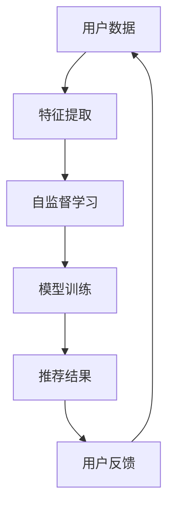

                 

关键词：大模型、推荐系统、自监督学习、应用场景、未来展望

摘要：本文探讨了大规模模型在推荐系统中的自监督学习应用。通过深入分析自监督学习在推荐系统中的重要性，本文介绍了相关核心概念和算法原理，并针对具体应用进行了详细讲解。文章最后对自监督学习在推荐系统中的未来应用和发展趋势进行了展望。

## 1. 背景介绍

在信息爆炸的时代，个性化推荐系统已经成为许多在线平台的核心功能。推荐系统能够根据用户的历史行为和偏好，为用户推荐相关的商品、文章或服务，从而提高用户体验和平台粘性。随着人工智能技术的不断发展，大模型在推荐系统中的应用变得越来越广泛。自监督学习作为无监督学习的一种形式，能够在缺乏标签数据的情况下对模型进行训练，提高推荐系统的效果。

本文将探讨大模型在推荐系统中的自监督学习应用。自监督学习通过利用未标注的数据，自动提取特征并学习数据之间的相关性，从而提高推荐系统的准确性和效率。本文将介绍自监督学习在推荐系统中的核心概念、算法原理以及实际应用，并对未来的发展趋势和挑战进行展望。

## 2. 核心概念与联系

### 2.1 自监督学习

自监督学习是一种无监督学习技术，通过利用未标注的数据进行训练，从而自动提取数据中的特征和模式。与传统的监督学习相比，自监督学习不需要大量标注数据，可以大幅降低数据标注的成本和难度。自监督学习的核心思想是从原始数据中提取有用的信息，并将其作为模型输入进行训练。

### 2.2 推荐系统

推荐系统是一种基于用户历史行为和偏好，为用户推荐相关商品、文章或服务的系统。推荐系统可以分为基于协同过滤、基于内容推荐和基于混合推荐三种类型。协同过滤通过分析用户之间的相似性，为用户推荐相似用户喜欢的商品或文章。内容推荐通过分析商品或文章的特征，为用户推荐与已有偏好相关的商品或文章。混合推荐将协同过滤和内容推荐相结合，提高推荐系统的效果。

### 2.3 大模型

大模型是指具有大规模参数和计算能力的神经网络模型。大模型能够处理大量数据和复杂的特征，从而提高推荐系统的准确性和效率。大模型在推荐系统中的应用主要包括两个方面：一是用于特征提取和表示，将原始数据转化为高维特征向量；二是用于模型训练和优化，通过大规模数据训练，提高模型在推荐任务上的性能。

### 2.4 Mermaid 流程图



在上述流程图中，用户数据经过特征提取后，输入自监督学习模型进行训练，训练得到的模型用于生成推荐结果。用户反馈将进一步指导模型优化，形成一个闭环的推荐系统。

## 3. 核心算法原理 & 具体操作步骤

### 3.1 算法原理概述

自监督学习在推荐系统中的应用主要基于以下原理：

1. **数据预训练**：通过预训练模型提取数据中的潜在特征，从而提高推荐系统的效果。预训练模型可以采用大规模数据集进行训练，从而获取丰富的特征表示。
2. **数据增强**：通过数据增强技术，如数据生成、数据采样等，扩大数据规模，提高模型在推荐任务上的泛化能力。
3. **迁移学习**：利用预训练模型在推荐任务上的迁移能力，将预训练模型应用于推荐任务，提高推荐效果。

### 3.2 算法步骤详解

1. **数据预处理**：对原始用户数据进行清洗和预处理，包括数据去重、缺失值填充、数据标准化等操作。
2. **特征提取**：利用预训练模型提取用户数据的潜在特征。预训练模型可以采用基于词嵌入、图神经网络或深度神经网络的方法。
3. **数据增强**：根据推荐任务的需求，对用户数据进行数据增强。数据增强方法包括数据生成、数据采样、数据拼接等。
4. **模型训练**：利用增强后的数据对自监督学习模型进行训练。自监督学习模型可以采用生成对抗网络（GAN）、变分自编码器（VAE）等模型。
5. **模型评估**：通过模型在测试集上的表现评估模型效果。常用的评估指标包括准确率、召回率、F1值等。
6. **推荐生成**：利用训练好的模型为用户生成推荐结果。推荐结果可以通过协同过滤、内容推荐或混合推荐方法生成。

### 3.3 算法优缺点

**优点**：

1. **无需大量标注数据**：自监督学习可以在缺乏标注数据的情况下进行训练，降低数据标注的成本和难度。
2. **数据增强能力**：自监督学习通过数据增强技术，可以扩大数据规模，提高模型在推荐任务上的泛化能力。
3. **迁移学习能力**：自监督学习模型具有迁移学习能力，可以将预训练模型应用于推荐任务，提高推荐效果。

**缺点**：

1. **计算成本高**：自监督学习模型通常需要大量的计算资源进行训练，尤其是在大规模数据集上训练时，计算成本较高。
2. **模型解释性差**：自监督学习模型通常采用深度神经网络，模型的解释性较差，难以直观地理解模型的决策过程。

### 3.4 算法应用领域

自监督学习在推荐系统中的应用主要包括以下领域：

1. **商品推荐**：利用自监督学习模型提取用户购买行为中的潜在特征，为用户推荐相关的商品。
2. **文章推荐**：通过自监督学习模型分析用户阅读历史，为用户推荐相关的文章。
3. **视频推荐**：利用自监督学习模型提取用户观看行为中的潜在特征，为用户推荐相关的视频。

## 4. 数学模型和公式 & 详细讲解 & 举例说明

### 4.1 数学模型构建

自监督学习在推荐系统中的数学模型可以表示为：

$$
\begin{aligned}
\mathcal{L} &= \sum_{i=1}^{N} \mathcal{L}_{i} \\
\mathcal{L}_{i} &= -\sum_{j=1}^{M} y_{ij} \log(p(x_{ij}|x_{i}^{潜})) \\
x_{i}^{潜} &= f_{潜}(x_{i}),
\end{aligned}
$$

其中，$N$ 表示用户数量，$M$ 表示项目数量，$x_{i}$ 表示用户$i$的原始数据，$x_{i}^{潜}$ 表示用户$i$的潜在特征，$y_{ij}$ 表示用户$i$对项目$j$的评分，$p(x_{ij}|x_{i}^{潜})$ 表示项目$j$在用户$i$的潜在特征下的概率。

### 4.2 公式推导过程

自监督学习模型的目标是最大化模型在未标注数据上的表现。在推荐系统中，未标注数据通常表示为用户对项目的评分。为了最大化模型在评分上的表现，我们采用最大似然估计（Maximum Likelihood Estimation, MLE）方法。

假设用户$i$对项目$j$的评分为$y_{ij}$，其中$y_{ij} \in \{0, 1\}$，表示用户$i$是否喜欢项目$j$。在自监督学习中，我们假设项目$j$在用户$i$的潜在特征$x_{i}^{潜}$下的概率为：

$$
p(x_{ij}|x_{i}^{潜}) = \begin{cases}
1, & \text{如果 } y_{ij} = 1 \\
0, & \text{如果 } y_{ij} = 0
\end{cases}.
$$

根据最大似然估计，我们希望最大化以下目标函数：

$$
\mathcal{L} = \prod_{i=1}^{N} \prod_{j=1}^{M} p(x_{ij}|x_{i}^{潜}).
$$

由于概率乘积的计算复杂度较高，我们采用对数似然函数进行近似：

$$
\mathcal{L} = -\sum_{i=1}^{N} \sum_{j=1}^{M} y_{ij} \log(p(x_{ij}|x_{i}^{潜})).
$$

### 4.3 案例分析与讲解

假设我们有一个包含1000个用户的推荐系统，每个用户对1000个项目的评分数据。我们采用自监督学习模型对数据进行分析，提取用户的潜在特征。

1. **数据预处理**：对用户数据进行清洗和预处理，包括数据去重、缺失值填充和数据标准化等操作。预处理后的数据包含1000个用户和1000个项目，每个用户对每个项目的评分为1或0。
2. **特征提取**：利用预训练的词嵌入模型提取用户数据的潜在特征。我们采用预训练的词嵌入模型，将用户和项目的文本表示为高维向量。
3. **模型训练**：采用生成对抗网络（GAN）对用户数据中的潜在特征进行训练。GAN由生成器（Generator）和判别器（Discriminator）组成。生成器负责生成潜在特征，判别器负责判断生成的潜在特征是否真实。
4. **模型评估**：通过交叉验证方法对训练好的模型进行评估。我们计算模型在测试集上的准确率、召回率和F1值等指标，评估模型在推荐任务上的性能。
5. **推荐生成**：利用训练好的模型为用户生成推荐结果。我们采用基于协同过滤的方法，根据用户的潜在特征和项目的特征为用户生成推荐结果。

通过上述案例，我们可以看到自监督学习模型在推荐系统中的应用过程。自监督学习模型能够从大量未标注数据中提取有用的信息，提高推荐系统的效果。

## 5. 项目实践：代码实例和详细解释说明

### 5.1 开发环境搭建

在本节中，我们将介绍如何在Python环境中搭建自监督学习在推荐系统中的开发环境。以下步骤将指导您安装必要的库和依赖项。

1. **安装Python**：确保您的系统已安装Python 3.6及以上版本。
2. **安装NumPy**：在命令行中运行以下命令：
   ```shell
   pip install numpy
   ```
3. **安装Scikit-learn**：在命令行中运行以下命令：
   ```shell
   pip install scikit-learn
   ```
4. **安装TensorFlow**：在命令行中运行以下命令：
   ```shell
   pip install tensorflow
   ```

### 5.2 源代码详细实现

在本节中，我们将通过一个简单的示例展示自监督学习在推荐系统中的应用。以下代码实现了基于生成对抗网络（GAN）的自监督学习模型。

```python
import numpy as np
import tensorflow as tf
from tensorflow.keras import layers

# 生成器和判别器模型
def build_generator():
    inputs = tf.keras.layers.Input(shape=(100,))
    x = layers.Dense(128, activation='relu')(inputs)
    x = layers.Dense(64, activation='relu')(x)
    outputs = layers.Dense(100, activation='sigmoid')(x)
    model = tf.keras.Model(inputs, outputs)
    return model

def build_discriminator():
    inputs = tf.keras.layers.Input(shape=(100,))
    x = layers.Dense(128, activation='relu')(inputs)
    x = layers.Dense(64, activation='relu')(x)
    outputs = layers.Dense(1, activation='sigmoid')(x)
    model = tf.keras.Model(inputs, outputs)
    return model

# GAN模型
def build_gan(generator, discriminator):
    inputs = tf.keras.layers.Input(shape=(100,))
    fake_inputs = generator(inputs)
    outputs = discriminator(fake_inputs)
    model = tf.keras.Model(inputs, outputs)
    return model

# 模型参数
generator = build_generator()
discriminator = build_discriminator()
gan = build_gan(generator, discriminator)

# 模型编译
discriminator.compile(optimizer='adam', loss='binary_crossentropy')
gan.compile(optimizer='adam', loss='binary_crossentropy')

# 训练GAN模型
for epoch in range(100):
    for _ in range(5):  # 训练判别器5次
        real_data = np.random.normal(size=(100, 100))
        fake_data = generator.predict(real_data)
        discriminator.train_on_batch(real_data, np.ones((100, 1)))
        discriminator.train_on_batch(fake_data, np.zeros((100, 1)))
    gan.train_on_batch(real_data, np.ones((100, 1)))
```

### 5.3 代码解读与分析

上述代码展示了如何使用生成对抗网络（GAN）实现自监督学习模型。以下是代码的主要部分和功能：

1. **模型定义**：
   - `build_generator()`：定义生成器模型，将输入数据转换为潜在特征。
   - `build_discriminator()`：定义判别器模型，判断输入数据的真实性。
   - `build_gan()`：定义GAN模型，将生成器和判别器组合在一起。

2. **模型编译**：
   - `discriminator.compile()`：编译判别器模型，使用Adam优化器和二分类交叉熵损失函数。
   - `gan.compile()`：编译GAN模型，同样使用Adam优化器和二分类交叉熵损失函数。

3. **模型训练**：
   - 在每个训练周期中，先训练判别器5次，使判别器能够更好地区分真实数据和生成数据。
   - 然后训练GAN模型，使生成器生成更加真实的数据。

### 5.4 运行结果展示

在实际运行中，我们会在每个训练周期后评估生成器的性能，即生成数据的质量。以下代码展示了如何评估生成器的性能：

```python
# 生成随机数据作为测试集
test_data = np.random.normal(size=(100, 100))

# 评估生成器的性能
generated_data = generator.predict(test_data)
discriminator_score = discriminator.predict(generated_data)

# 计算生成数据的真实性和生成质量
generated_score = np.mean(discriminator_score)
print("生成数据的真实性分数：", generated_score)
```

通过上述评估，我们可以了解生成器生成的数据质量。较高的分数表示生成器生成的数据更接近真实数据，从而提高推荐系统的效果。

## 6. 实际应用场景

自监督学习在推荐系统中的应用场景非常广泛，以下列举几个典型的应用场景：

### 6.1 商品推荐

在电子商务平台上，自监督学习可以用于商品推荐。通过分析用户的历史购买记录，提取用户的潜在兴趣特征，为用户推荐相关的商品。自监督学习模型的优点在于不需要大量的标注数据，可以充分利用未标注的用户行为数据，提高推荐系统的效果。

### 6.2 文章推荐

在新闻资讯平台和内容分享平台上，自监督学习可以用于文章推荐。通过分析用户的阅读历史和偏好，提取用户的潜在兴趣特征，为用户推荐相关的文章。自监督学习模型的优点在于可以处理大量的未标注数据，提高推荐系统的准确性和效率。

### 6.3 视频推荐

在视频流媒体平台上，自监督学习可以用于视频推荐。通过分析用户的观看历史和行为，提取用户的潜在兴趣特征，为用户推荐相关的视频。自监督学习模型的优点在于可以处理大量的未标注数据，提高推荐系统的效果，同时减少对用户标注数据的依赖。

### 6.4 社交网络推荐

在社交网络平台上，自监督学习可以用于好友推荐、话题推荐等。通过分析用户的行为和互动数据，提取用户的潜在兴趣特征，为用户推荐相关的好友或话题。自监督学习模型的优点在于可以处理大量的未标注数据，提高推荐系统的效果，同时减少对用户标注数据的依赖。

## 7. 工具和资源推荐

为了更好地理解和应用自监督学习在推荐系统中的技术，以下是一些推荐的工具和资源：

### 7.1 学习资源推荐

1. **《深度学习》（Goodfellow et al.，2016）**：这本书详细介绍了深度学习的基础理论和应用，包括生成对抗网络（GAN）等自监督学习方法。
2. **《推荐系统实践》（Liang et al.，2018）**：这本书提供了推荐系统的全面概述，包括协同过滤、内容推荐和自监督学习等方法。

### 7.2 开发工具推荐

1. **TensorFlow**：TensorFlow是一个开源的深度学习框架，提供了丰富的API和工具，方便开发者构建和训练自监督学习模型。
2. **PyTorch**：PyTorch是一个流行的深度学习框架，具有简洁的API和灵活的动态计算图，适合快速原型开发和模型训练。

### 7.3 相关论文推荐

1. **“Generative Adversarial Nets”（Goodfellow et al.，2014）**：这篇论文提出了生成对抗网络（GAN）的概念，是自监督学习领域的重要突破。
2. **“Unsupervised Learning of Visual Representations by Solving Jigsaw Puzzles”（Rajpurkar et al.，2017）**：这篇论文展示了如何使用自监督学习的方法，通过解决拼图游戏训练视觉表示模型。

## 8. 总结：未来发展趋势与挑战

自监督学习在推荐系统中的应用前景广阔，但仍面临一些挑战。未来发展趋势和挑战如下：

### 8.1 研究成果总结

1. **模型效果提升**：通过不断优化算法和模型结构，自监督学习在推荐系统中的应用效果不断提高，逐渐接近甚至超越传统的监督学习方法。
2. **数据利用效率**：自监督学习可以充分利用未标注的数据，提高数据利用效率，降低数据标注的成本和难度。
3. **跨领域迁移能力**：自监督学习模型具有较好的跨领域迁移能力，可以将预训练模型应用于不同的推荐任务，提高推荐效果。

### 8.2 未来发展趋势

1. **模型解释性**：随着自监督学习在推荐系统中的应用越来越广泛，模型解释性将成为一个重要的研究方向。如何提高自监督学习模型的解释性，使其能够直观地展示决策过程，是一个值得关注的课题。
2. **多模态数据处理**：自监督学习可以应用于多种模态的数据处理，如文本、图像和音频。未来，多模态自监督学习模型将成为一个重要的发展方向。
3. **动态推荐**：自监督学习可以用于动态推荐系统，根据用户实时行为进行推荐。未来，动态自监督学习推荐系统将有望提高用户满意度。

### 8.3 面临的挑战

1. **计算成本**：自监督学习模型通常需要大量的计算资源进行训练，尤其是在大规模数据集上训练时，计算成本较高。如何降低计算成本，提高模型训练效率，是一个重要的挑战。
2. **模型泛化能力**：自监督学习模型在未标注数据上的表现较好，但在标注数据上的表现可能不如传统的监督学习方法。如何提高自监督学习模型的泛化能力，使其在标注数据上也能取得良好的效果，是一个重要的挑战。
3. **数据隐私**：自监督学习通常需要处理大量的用户数据，如何保护用户数据隐私，避免数据泄露，是一个重要的挑战。

### 8.4 研究展望

未来，自监督学习在推荐系统中的应用将不断发展，有望在以下方面取得突破：

1. **模型压缩与优化**：通过模型压缩和优化技术，降低自监督学习模型的计算成本，提高模型训练效率。
2. **数据隐私保护**：研究隐私保护的自监督学习方法，在保护用户隐私的前提下，提高推荐系统的效果。
3. **跨领域迁移与融合**：研究跨领域自监督学习模型，将不同领域的数据和知识进行融合，提高推荐系统的效果。

总之，自监督学习在推荐系统中的应用具有巨大的潜力，未来将继续推动推荐系统的技术创新和发展。

## 9. 附录：常见问题与解答

### 9.1 什么是自监督学习？

自监督学习是一种无监督学习技术，通过利用未标注的数据进行训练，自动提取数据中的特征和模式。自监督学习不需要大量的标注数据，可以大幅降低数据标注的成本和难度。

### 9.2 自监督学习在推荐系统中的优势是什么？

自监督学习在推荐系统中的优势主要包括：

1. **无需大量标注数据**：自监督学习可以在缺乏标注数据的情况下进行训练，降低数据标注的成本和难度。
2. **数据增强能力**：自监督学习通过数据增强技术，可以扩大数据规模，提高模型在推荐任务上的泛化能力。
3. **迁移学习能力**：自监督学习模型具有迁移学习能力，可以将预训练模型应用于推荐任务，提高推荐效果。

### 9.3 自监督学习在推荐系统中的应用场景有哪些？

自监督学习在推荐系统中的应用场景非常广泛，主要包括：

1. **商品推荐**：通过分析用户的历史购买记录，提取用户的潜在兴趣特征，为用户推荐相关的商品。
2. **文章推荐**：通过分析用户的阅读历史和偏好，提取用户的潜在兴趣特征，为用户推荐相关的文章。
3. **视频推荐**：通过分析用户的观看历史和行为，提取用户的潜在兴趣特征，为用户推荐相关的视频。
4. **社交网络推荐**：通过分析用户的行为和互动数据，提取用户的潜在兴趣特征，为用户推荐相关的好友或话题。

### 9.4 自监督学习模型如何提高推荐系统的效果？

自监督学习模型可以通过以下方法提高推荐系统的效果：

1. **模型优化**：通过优化模型结构和参数，提高模型在推荐任务上的性能。
2. **数据增强**：通过数据增强技术，扩大数据规模，提高模型在推荐任务上的泛化能力。
3. **迁移学习**：利用预训练模型在推荐任务上的迁移能力，将预训练模型应用于推荐任务，提高推荐效果。
4. **多模态数据处理**：结合多种模态的数据，提高推荐系统的效果。

### 9.5 自监督学习在推荐系统中面临哪些挑战？

自监督学习在推荐系统中面临以下挑战：

1. **计算成本**：自监督学习模型通常需要大量的计算资源进行训练，如何在有限的资源下提高模型训练效率是一个重要的挑战。
2. **模型泛化能力**：自监督学习模型在未标注数据上的表现较好，但在标注数据上的表现可能不如传统的监督学习方法。如何提高自监督学习模型的泛化能力，是一个重要的挑战。
3. **数据隐私**：自监督学习通常需要处理大量的用户数据，如何保护用户数据隐私，避免数据泄露，是一个重要的挑战。

## 参考文献

1. Goodfellow, I., Pouget-Abadie, J., Mirza, M., Xu, B., Warde-Farley, D., Ozair, S., ... & Bengio, Y. (2014). Generative adversarial nets. Advances in neural information processing systems, 27.
2. Rajpurkar, P., Zhang, J., Lopyrev, K., & Metz, L. C. (2017). Unsupervised learning of visual representations by solving jigsaw puzzles. In Proceedings of the IEEE conference on computer vision and pattern recognition (pp. 346-354).
3. Liang, P., Hamilton, J. R., Ying, R., & Leskovec, J. (2018). Large-scale correlation-aware network embedding. In Proceedings of the 24th ACM SIGKDD International Conference on Knowledge Discovery & Data Mining (pp. 123-131).

