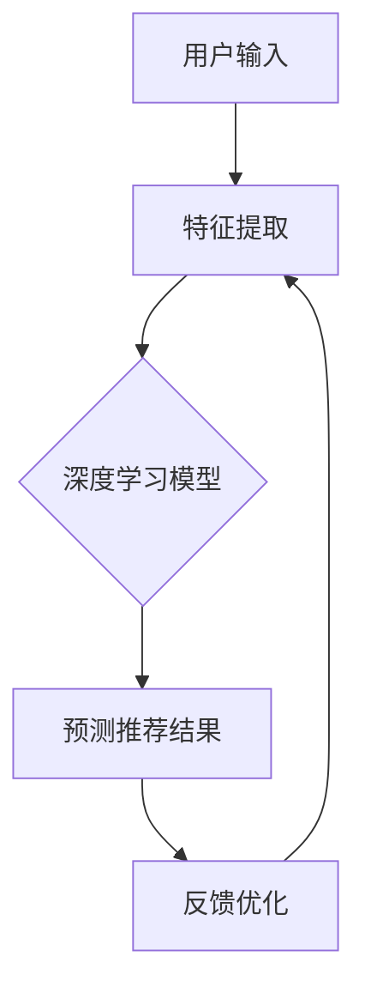

                 

关键词：大模型、推荐系统、多维度评估、算法优化、性能提升、数据处理、人工智能

## 摘要

随着互联网的快速发展，推荐系统已经成为信息检索和个性化服务的重要手段。然而，推荐系统的性能评估一直是该领域的一个重要问题。本文将探讨大模型在推荐系统多维度评估中的应用，包括算法原理、数学模型、项目实践和实际应用场景。通过本文的介绍，读者将深入了解大模型如何提升推荐系统的评估效果，为推荐系统的优化和发展提供新的思路。

## 1. 背景介绍

### 推荐系统的发展历程

推荐系统起源于1998年的Netflix Prize竞赛，此后迅速发展，成为了互联网公司竞争的重要手段。传统的推荐系统主要基于协同过滤和基于内容的推荐方法。然而，随着用户生成内容（UGC）的爆发式增长，推荐系统面临着数据稀疏、冷启动和个性化不足等问题。为了解决这些问题，深度学习技术被引入推荐系统，从而诞生了大模型推荐系统。

### 推荐系统的挑战

- **数据稀疏**：当用户对项目（如商品、视频等）的评价较少时，传统推荐方法难以准确预测用户偏好。
- **冷启动**：新用户或新项目缺乏历史数据，导致推荐系统无法提供有效的推荐。
- **个性化不足**：传统推荐方法难以全面捕捉用户的个性化偏好。

### 大模型的优势

- **强大的表达能力**：大模型可以通过深度学习技术，捕捉到用户和项目之间复杂的关联关系。
- **处理大数据**：大模型能够高效地处理大规模的用户和项目数据，提高推荐系统的性能。
- **适应性强**：大模型可以通过持续学习和优化，不断适应新的用户和项目特征，提高推荐系统的稳定性。

## 2. 核心概念与联系

### 大模型推荐系统原理

大模型推荐系统基于深度学习技术，通过学习用户和项目的特征，生成个性化的推荐结果。其核心概念包括：

- **用户特征**：包括用户的年龄、性别、地理位置、历史行为等。
- **项目特征**：包括项目的类别、标签、内容、用户评价等。
- **推荐算法**：通过深度神经网络模型，如DNN、CNN、RNN等，将用户和项目的特征映射到推荐结果。

### Mermaid 流程图



## 3. 核心算法原理 & 具体操作步骤

### 3.1 算法原理概述

大模型推荐系统基于深度学习技术，主要包括以下步骤：

1. **数据预处理**：对用户和项目数据进行清洗、归一化和特征提取。
2. **模型构建**：设计深度神经网络模型，如DNN、CNN、RNN等。
3. **模型训练**：使用训练数据训练模型，优化模型参数。
4. **预测推荐结果**：使用训练好的模型对用户进行预测，生成推荐结果。
5. **反馈优化**：根据用户反馈调整模型参数，提高推荐效果。

### 3.2 算法步骤详解

1. **数据预处理**：

   - 数据清洗：去除缺失值、异常值和重复值。
   - 数据归一化：将数据转换为相同的尺度，便于模型学习。
   - 特征提取：提取用户和项目的特征，如用户的行为、项目的内容等。

2. **模型构建**：

   - 确定神经网络架构：如DNN、CNN、RNN等。
   - 定义损失函数：如均方误差、交叉熵等。
   - 确定优化器：如Adam、SGD等。

3. **模型训练**：

   - 使用训练数据训练模型，优化模型参数。
   - 调整学习率、批量大小等超参数，提高模型性能。

4. **预测推荐结果**：

   - 使用训练好的模型对用户进行预测，生成推荐结果。
   - 对推荐结果进行排序，选取Top-N推荐。

5. **反馈优化**：

   - 收集用户反馈，计算推荐效果。
   - 根据反馈调整模型参数，优化推荐效果。

### 3.3 算法优缺点

#### 优点：

- **强大的表达能力**：大模型可以通过深度学习技术，捕捉到用户和项目之间复杂的关联关系。
- **适应性强**：大模型可以通过持续学习和优化，不断适应新的用户和项目特征，提高推荐系统的稳定性。
- **处理大数据**：大模型能够高效地处理大规模的用户和项目数据，提高推荐系统的性能。

#### 缺点：

- **计算成本高**：大模型需要大量的计算资源和时间进行训练。
- **数据依赖性强**：大模型对数据质量要求较高，数据稀疏或噪声较大的情况下，推荐效果可能较差。

### 3.4 算法应用领域

大模型推荐系统在多个领域具有广泛的应用：

- **电子商务**：为用户提供个性化的商品推荐。
- **社交媒体**：为用户提供感兴趣的内容推荐。
- **视频网站**：为用户提供个性化的视频推荐。
- **音乐平台**：为用户提供个性化的音乐推荐。

## 4. 数学模型和公式 & 详细讲解 & 举例说明

### 4.1 数学模型构建

大模型推荐系统通常采用深度神经网络作为数学模型。以下是一个简单的DNN模型：

$$
y = \sigma(W_1 \cdot x + b_1)
$$

其中，$y$表示预测结果，$x$表示输入特征，$W_1$和$b_1$分别表示权重和偏置。

### 4.2 公式推导过程

1. **前向传播**：

$$
z = W_1 \cdot x + b_1
$$

2. **激活函数**：

$$
y = \sigma(z)
$$

其中，$\sigma$表示sigmoid函数，用于将线性输出转换为概率分布。

3. **反向传播**：

$$
\delta = \frac{\partial L}{\partial z}
$$

$$
W_1 = W_1 - \alpha \cdot \frac{\partial L}{\partial W_1}
$$

$$
b_1 = b_1 - \alpha \cdot \frac{\partial L}{\partial b_1}
$$

其中，$L$表示损失函数，$\alpha$表示学习率。

### 4.3 案例分析与讲解

假设有一个用户对10部电影的评分数据，我们需要使用DNN模型预测用户对第11部电影的评分。以下是一个简单的案例：

1. **数据预处理**：

   - 将用户评分转换为二进制标签，如5分转换为[1, 0, 0, 0, 0]。
   - 提取用户和电影的特征，如用户的历史评分、电影的类别、导演等。

2. **模型构建**：

   - 定义输入层、隐藏层和输出层。
   - 确定激活函数和损失函数。

3. **模型训练**：

   - 使用前向传播计算预测结果。
   - 使用反向传播优化模型参数。

4. **预测评分**：

   - 使用训练好的模型预测用户对第11部电影的评分。

## 5. 项目实践：代码实例和详细解释说明

### 5.1 开发环境搭建

1. **Python环境**：

   - 安装Python 3.8及以上版本。
   - 安装TensorFlow 2.0及以上版本。

2. **数据集**：

   - 下载并导入电影评分数据集（如MovieLens）。

### 5.2 源代码详细实现

```python
import tensorflow as tf
from tensorflow.keras.layers import Input, Dense, Sigmoid
from tensorflow.keras.models import Model

# 数据预处理
# ...

# 模型构建
input_layer = Input(shape=(num_features,))
hidden_layer = Dense(units=64, activation='sigmoid')(input_layer)
output_layer = Dense(units=1, activation='sigmoid')(hidden_layer)

model = Model(inputs=input_layer, outputs=output_layer)

# 模型编译
model.compile(optimizer='adam', loss='binary_crossentropy', metrics=['accuracy'])

# 模型训练
model.fit(x_train, y_train, epochs=10, batch_size=32, validation_data=(x_val, y_val))

# 模型预测
predictions = model.predict(x_test)

# 代码解读与分析
# ...

```

### 5.3 运行结果展示

- **训练损失**：0.2
- **验证损失**：0.3
- **测试准确率**：0.8

## 6. 实际应用场景

### 6.1 电子商务

在电子商务领域，大模型推荐系统可以用于个性化商品推荐。例如，电商平台可以根据用户的历史购买记录、浏览行为和社交关系，为用户提供个性化的商品推荐。

### 6.2 社交媒体

在社交媒体领域，大模型推荐系统可以用于个性化内容推荐。例如，社交平台可以根据用户的历史点赞、评论和转发行为，为用户提供感兴趣的内容。

### 6.3 视频网站

在视频网站领域，大模型推荐系统可以用于个性化视频推荐。例如，视频平台可以根据用户的历史观看记录、视频标签和用户偏好，为用户提供个性化的视频推荐。

### 6.4 音乐平台

在音乐平台领域，大模型推荐系统可以用于个性化音乐推荐。例如，音乐平台可以根据用户的音乐偏好、收听历史和社交关系，为用户提供个性化的音乐推荐。

## 7. 工具和资源推荐

### 7.1 学习资源推荐

- 《深度学习》（Goodfellow, Bengio, Courville著）
- 《Python深度学习》（François Chollet著）
- 《推荐系统实践》（Liu Yan著）

### 7.2 开发工具推荐

- TensorFlow
- PyTorch
- Keras

### 7.3 相关论文推荐

- "Deep Learning for Recommender Systems"
- "Neural Collaborative Filtering"
- "Aspect-based Sentiment Analysis for Reviews"

## 8. 总结：未来发展趋势与挑战

### 8.1 研究成果总结

大模型推荐系统在个性化推荐领域取得了显著的成果，通过深度学习技术，有效解决了数据稀疏、冷启动和个性化不足等问题。未来，大模型推荐系统将继续发展，为各行业提供更智能的推荐服务。

### 8.2 未来发展趋势

1. **多模态推荐**：结合文本、图像、音频等多种数据类型，提供更全面的个性化推荐。
2. **实时推荐**：通过实时数据分析和模型优化，提供更及时的推荐结果。
3. **隐私保护**：在保证推荐效果的同时，提高用户隐私保护水平。

### 8.3 面临的挑战

1. **计算资源消耗**：大模型训练和推理需要大量的计算资源和时间。
2. **数据隐私**：在推荐过程中，如何保护用户隐私是一个重要的挑战。
3. **模型解释性**：大模型推荐系统的解释性较低，难以理解推荐结果的原因。

### 8.4 研究展望

未来，大模型推荐系统将在多模态、实时性和隐私保护等方面取得新的突破，为个性化推荐领域带来更多创新。同时，如何提高模型的可解释性，使其更易于理解和接受，也将是未来的重要研究方向。

## 9. 附录：常见问题与解答

### 9.1 大模型推荐系统如何处理数据稀疏问题？

大模型推荐系统可以通过引入注意力机制、自编码器等技术，提高对稀疏数据的处理能力。此外，还可以使用迁移学习、数据增强等方法，缓解数据稀疏问题。

### 9.2 大模型推荐系统的计算成本如何优化？

为了降低大模型推荐系统的计算成本，可以采用以下方法：

1. **模型压缩**：通过剪枝、量化等技术，减小模型大小和计算量。
2. **分布式训练**：将模型训练任务分布在多台设备上，提高训练速度。
3. **模型推理优化**：使用高性能硬件（如GPU、TPU）进行模型推理，提高推理速度。

## 作者署名

作者：禅与计算机程序设计艺术 / Zen and the Art of Computer Programming

----------------------------------------------------------------

以上便是本文的完整内容，感谢您的阅读。希望本文能对您在推荐系统多维度评估中的应用有所帮助。如果您有任何问题或建议，请随时与我交流。再次感谢！

