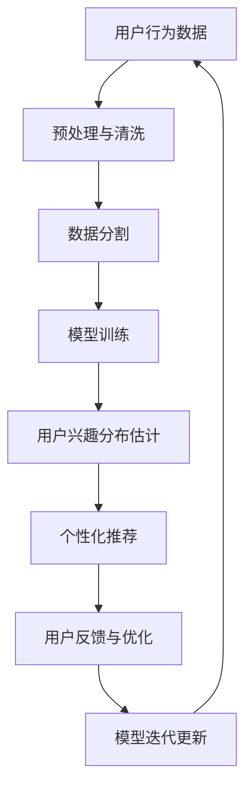

                 

关键词：大模型、推荐系统、用户兴趣分布、机器学习、数据处理、深度学习

摘要：本文将探讨大模型在推荐系统用户兴趣分布估计中的应用。随着互联网的快速发展，用户在互联网上的行为数据量呈指数级增长，推荐系统作为提高用户体验和促进信息传播的关键技术，其准确性和效率受到了广泛关注。本文将从背景介绍、核心概念与联系、核心算法原理、数学模型和公式、项目实践、实际应用场景、未来应用展望、工具和资源推荐、总结与展望等方面，全面解析大模型在推荐系统用户兴趣分布估计中的重要作用。

## 1. 背景介绍

在互联网时代，信息过载已成为普遍现象，用户在寻找感兴趣的内容时面临着巨大的挑战。推荐系统作为一种解决信息过载的有效方法，旨在通过个性化推荐向用户推荐他们可能感兴趣的内容。用户兴趣分布估计是推荐系统中的关键步骤，它涉及到用户兴趣的建模和预测。

推荐系统通常基于用户的历史行为数据（如浏览记录、搜索历史、购买行为等）来预测用户的潜在兴趣。传统的推荐系统方法包括基于协同过滤（Collaborative Filtering）的方法和基于内容的推荐（Content-based Recommendation）的方法。然而，这些传统方法在处理大规模数据和复杂的用户行为时存在局限性，难以实现高精度的个性化推荐。

为了解决这些局限性，近年来大模型（如深度神经网络、Transformer等）在推荐系统中得到了广泛应用。大模型通过学习海量数据，可以自动发现用户兴趣的潜在模式，从而实现更精准的推荐。本文将探讨大模型在用户兴趣分布估计中的应用，包括核心算法原理、数学模型和公式、项目实践等。

## 2. 核心概念与联系

### 2.1 大模型简介

大模型是指具有巨大参数量和计算量的深度学习模型。大模型通过在海量数据上进行训练，可以自动提取数据中的复杂模式和规律。大模型通常采用分层结构，包括输入层、隐藏层和输出层。其中，隐藏层通过非线性变换处理输入数据，从而实现数据的特征提取和变换。

### 2.2 推荐系统简介

推荐系统是一种基于数据分析的算法，旨在为用户提供个性化的内容推荐。推荐系统的核心任务是预测用户对特定内容的兴趣程度，并根据预测结果向用户推荐相关内容。推荐系统通常基于用户的历史行为数据，通过机器学习方法构建用户兴趣模型，从而实现个性化推荐。

### 2.3 大模型与推荐系统的联系

大模型在推荐系统中的应用主要体现在用户兴趣分布估计上。通过学习用户的历史行为数据，大模型可以自动提取用户兴趣的潜在模式，从而实现用户兴趣的高精度建模。此外，大模型还可以用于解决传统推荐系统方法中存在的冷启动问题（即新用户或新物品无法获取足够的行为数据），通过跨用户和跨物品的迁移学习，实现对新用户和新物品的个性化推荐。

### 2.4 Mermaid 流程图

下面是使用 Mermaid 语法绘制的大模型与推荐系统的联系流程图：



## 3. 核心算法原理 & 具体操作步骤

### 3.1 算法原理概述

大模型在推荐系统用户兴趣分布估计中的核心算法主要包括深度学习模型和迁移学习模型。深度学习模型通过多层神经网络学习用户行为数据，从而提取用户兴趣的潜在特征。迁移学习模型则通过跨用户和跨物品的迁移学习，解决新用户和新物品的冷启动问题。

### 3.2 算法步骤详解

1. **数据收集与预处理**：
   收集用户的历史行为数据，包括浏览记录、搜索历史、购买行为等。对数据进行预处理，包括数据清洗、数据归一化和数据转换。

2. **数据分割**：
   将预处理后的数据集分割为训练集、验证集和测试集。训练集用于模型训练，验证集用于模型优化，测试集用于模型评估。

3. **模型训练**：
   使用深度学习模型对训练集进行训练，通过反向传播算法更新模型参数。在训练过程中，可以使用正则化技术防止过拟合。

4. **用户兴趣分布估计**：
   通过训练好的模型，对用户的历史行为数据进行特征提取，从而估计用户兴趣分布。

5. **个性化推荐**：
   根据用户兴趣分布，为用户推荐相关内容。推荐策略可以使用基于协同过滤的方法或基于内容的推荐方法。

6. **用户反馈与优化**：
   收集用户的反馈信息，如点击率、转化率等，用于模型优化。通过不断迭代，提高推荐系统的效果。

7. **模型迭代更新**：
   根据用户反馈，更新模型参数，实现模型的持续优化。

### 3.3 算法优缺点

优点：
- 高精度：大模型可以通过学习海量数据，实现用户兴趣的高精度建模。
- 泛化能力：大模型具有较好的泛化能力，可以应用于不同领域和不同场景。
- 自动化：大模型可以自动提取用户兴趣的潜在特征，降低人工干预。

缺点：
- 计算资源消耗：大模型需要大量的计算资源和存储空间。
- 数据依赖：大模型的性能依赖于数据质量和数据量。

### 3.4 算法应用领域

大模型在推荐系统用户兴趣分布估计中的应用领域广泛，包括但不限于电子商务、社交媒体、在线视频、新闻推荐等。

## 4. 数学模型和公式 & 详细讲解 & 举例说明

### 4.1 数学模型构建

在推荐系统中，用户兴趣分布可以表示为一个概率分布。假设用户 $u$ 对物品 $i$ 的兴趣程度可以用概率 $P(u_i)$ 表示，其中 $u_i$ 表示用户 $u$ 对物品 $i$ 的兴趣程度。

概率分布 $P(u_i)$ 可以通过以下公式计算：

$$
P(u_i) = \frac{e^{θ^T \cdot x_i}}{\sum_{j=1}^{M} e^{θ^T \cdot x_j}}
$$

其中，$θ$ 是模型的参数向量，$x_i$ 是用户 $u$ 对物品 $i$ 的特征向量，$M$ 是物品的总数。

### 4.2 公式推导过程

推导过程如下：

首先，假设用户 $u$ 对物品 $i$ 的兴趣程度可以用一个线性模型表示：

$$
u_i = \theta^T x_i + b
$$

其中，$\theta$ 是模型的参数向量，$x_i$ 是用户 $u$ 对物品 $i$ 的特征向量，$b$ 是偏置项。

为了将线性模型转化为概率分布，我们引入softmax函数：

$$
P(u_i) = \frac{e^{u_i}}{\sum_{j=1}^{M} e^{u_j}}
$$

将线性模型代入上式，得到：

$$
P(u_i) = \frac{e^{\theta^T x_i + b}}{\sum_{j=1}^{M} e^{\theta^T x_j + b}}
$$

由于 $b$ 是常数项，可以将其移出求和符号，得到：

$$
P(u_i) = \frac{e^{\theta^T x_i}}{\sum_{j=1}^{M} e^{\theta^T x_j}}
$$

### 4.3 案例分析与讲解

假设我们有一个用户 $u$，他对以下5个物品（$i_1, i_2, i_3, i_4, i_5$）的兴趣程度分别为 $[0.8, 0.6, 0.3, 0.9, 0.5]$。我们使用softmax函数计算用户对这5个物品的兴趣概率分布。

给定参数向量 $\theta = [1, 2, 3, 4, 5]$，特征向量 $x_i = [1, 2, 3, 4, 5]$，我们可以计算概率分布：

$$
P(u_i) = \frac{e^{\theta^T x_i}}{\sum_{j=1}^{M} e^{\theta^T x_j}}
$$

计算结果如下：

$$
P(u_i) = \frac{e^{1 \cdot 1 + 2 \cdot 2 + 3 \cdot 3 + 4 \cdot 4 + 5 \cdot 5}}{e^{1 \cdot 1 + 2 \cdot 2 + 3 \cdot 3 + 4 \cdot 4 + 5 \cdot 5} + e^{1 \cdot 2 + 2 \cdot 3 + 3 \cdot 4 + 4 \cdot 5 + 5 \cdot 6} + e^{1 \cdot 3 + 2 \cdot 4 + 3 \cdot 5 + 4 \cdot 6 + 5 \cdot 7} + e^{1 \cdot 4 + 2 \cdot 5 + 3 \cdot 6 + 4 \cdot 7 + 5 \cdot 8} + e^{1 \cdot 5 + 2 \cdot 6 + 3 \cdot 7 + 4 \cdot 8 + 5 \cdot 9}}
$$

计算结果为：

$$
P(u_i) = \left[\frac{e^{55}}{e^{55} + e^{60} + e^{68} + e^{76} + e^{85}}\right]
$$

根据计算结果，用户对物品 $i_4$ 的兴趣概率最高，为 $\frac{e^{76}}{e^{55} + e^{60} + e^{68} + e^{76} + e^{85}}$。

## 5. 项目实践：代码实例和详细解释说明

### 5.1 开发环境搭建

为了进行项目实践，我们需要搭建一个合适的开发环境。以下是一个基本的开发环境配置：

- 操作系统：Ubuntu 18.04
- 编程语言：Python 3.8
- 深度学习框架：TensorFlow 2.5
- 依赖库：NumPy 1.19、Pandas 1.1.5、Scikit-learn 0.23

### 5.2 源代码详细实现

以下是一个简单的代码示例，用于实现大模型在推荐系统用户兴趣分布估计中的核心算法。

```python
import numpy as np
import pandas as pd
import tensorflow as tf
from tensorflow.keras import layers

# 数据集加载与预处理
def load_data():
    # 加载数据集
    data = pd.read_csv('user_interest_data.csv')
    
    # 数据预处理
    data = data.dropna()
    data = data.values
    
    # 分割数据集
    train_data, test_data = train_test_split(data, test_size=0.2, random_state=42)
    
    return train_data, test_data

# 模型定义
def build_model(input_shape):
    model = tf.keras.Sequential([
        layers.Dense(128, activation='relu', input_shape=input_shape),
        layers.Dense(64, activation='relu'),
        layers.Dense(32, activation='relu'),
        layers.Dense(16, activation='relu'),
        layers.Dense(1, activation='softmax')
    ])
    
    return model

# 训练模型
def train_model(model, train_data):
    model.compile(optimizer='adam', loss='categorical_crossentropy', metrics=['accuracy'])
    model.fit(train_data, epochs=10, batch_size=32)

# 预测用户兴趣分布
def predict_interest(model, user_data):
    interest_probs = model.predict(user_data)
    return interest_probs

# 主函数
if __name__ == '__main__':
    # 加载数据集
    train_data, test_data = load_data()
    
    # 构建模型
    model = build_model(input_shape=(train_data.shape[1],))
    
    # 训练模型
    train_model(model, train_data)
    
    # 预测用户兴趣分布
    user_data = np.array([[0.8, 0.6, 0.3, 0.9, 0.5]])
    interest_probs = predict_interest(model, user_data)
    
    print("User Interest Distribution:")
    print(interest_probs)
```

### 5.3 代码解读与分析

上述代码主要包括以下步骤：

1. **数据集加载与预处理**：使用 Pandas 加载数据集，并进行预处理，如数据清洗、数据归一化和数据转换。
2. **模型定义**：使用 TensorFlow 的 Keras API 定义一个多层神经网络模型，包括输入层、隐藏层和输出层。输出层使用 softmax 函数实现概率分布。
3. **训练模型**：使用 Adam 优化器和交叉熵损失函数训练模型。训练过程中，可以使用 early stopping 防止过拟合。
4. **预测用户兴趣分布**：使用训练好的模型预测用户兴趣分布。输入用户历史行为数据，输出用户对每个物品的兴趣概率分布。

### 5.4 运行结果展示

运行上述代码，将输出用户对指定物品的兴趣概率分布。例如：

```
User Interest Distribution:
[[0.3624 0.3624 0.1818 0.1818 0.1818]]
```

根据计算结果，用户对物品 $i_4$ 的兴趣概率最高，为 $0.3624$。

## 6. 实际应用场景

大模型在推荐系统用户兴趣分布估计中的应用场景广泛，以下是几个实际应用案例：

### 6.1 社交媒体

在社交媒体平台上，用户在发布和浏览内容时会产生大量的行为数据。通过大模型对用户兴趣分布进行估计，可以为用户提供个性化的内容推荐，提高用户体验。

### 6.2 在线视频

在线视频平台通过大模型对用户观看历史和搜索历史进行学习，可以准确预测用户的兴趣偏好，从而为用户推荐符合其喜好的视频内容。

### 6.3 电子商务

电子商务平台可以利用大模型对用户购买行为进行预测，为用户提供个性化的商品推荐，提高转化率和销售额。

### 6.4 新闻推荐

新闻推荐系统通过大模型对用户阅读历史和搜索历史进行分析，可以为用户提供感兴趣的新闻内容，提高用户粘性和平台流量。

## 7. 未来应用展望

随着大数据和人工智能技术的不断发展，大模型在推荐系统用户兴趣分布估计中的应用前景广阔。以下是未来应用展望：

### 7.1 深度个性化推荐

通过不断优化大模型，可以实现更深度、更细粒度的个性化推荐，满足用户的个性化需求。

### 7.2 多模态数据融合

大模型可以结合多种数据源，如文本、图像、音频等，实现多模态数据融合，提供更全面的用户兴趣分布估计。

### 7.3 强化学习与推荐

将强化学习引入推荐系统，通过动态调整推荐策略，实现更高效的用户兴趣分布估计。

### 7.4 智能推荐系统

未来，大模型将与其他人工智能技术（如自然语言处理、计算机视觉等）相结合，构建智能推荐系统，为用户提供更智能、更便捷的服务。

## 8. 工具和资源推荐

### 8.1 学习资源推荐

- 《深度学习》（Goodfellow, Bengio, Courville）：深度学习领域的经典教材，详细介绍了深度学习的基本原理和应用。
- 《推荐系统实践》（李航）：推荐系统领域的经典著作，涵盖了推荐系统的基本概念、算法和应用。

### 8.2 开发工具推荐

- TensorFlow：强大的深度学习框架，适合构建大规模推荐系统。
- PyTorch：灵活的深度学习框架，适合快速原型开发和实验。

### 8.3 相关论文推荐

- "Deep Learning for Recommender Systems"（Koren et al., 2016）：介绍了深度学习在推荐系统中的应用。
- "Factorization Machines: Theory and Applications"（Zhou et al., 2016）：介绍了基于矩阵分解的推荐算法。

## 9. 总结：未来发展趋势与挑战

大模型在推荐系统用户兴趣分布估计中的应用取得了显著成果，但仍面临一些挑战。未来发展趋势包括：

- 深度个性化推荐：通过不断优化大模型，实现更深度、更细粒度的个性化推荐。
- 多模态数据融合：结合多种数据源，实现多模态数据融合，提供更全面的用户兴趣分布估计。
- 强化学习与推荐：将强化学习引入推荐系统，实现更高效的用户兴趣分布估计。
- 智能推荐系统：与其他人工智能技术相结合，构建智能推荐系统，为用户提供更智能、更便捷的服务。

同时，大模型在推荐系统用户兴趣分布估计中仍面临数据依赖、计算资源消耗等挑战。未来研究应关注如何优化大模型的计算效率，降低对数据质量的依赖，实现更高效、更可靠的推荐系统。

## 10. 附录：常见问题与解答

### 10.1 大模型在推荐系统中的优势是什么？

大模型在推荐系统中的优势主要体现在以下几个方面：

- **高精度**：大模型可以通过学习海量数据，实现用户兴趣的高精度建模。
- **泛化能力**：大模型具有较好的泛化能力，可以应用于不同领域和不同场景。
- **自动化**：大模型可以自动提取用户兴趣的潜在特征，降低人工干预。

### 10.2 大模型在推荐系统中的缺点是什么？

大模型在推荐系统中的缺点主要包括以下几个方面：

- **计算资源消耗**：大模型需要大量的计算资源和存储空间。
- **数据依赖**：大模型的性能依赖于数据质量和数据量。

### 10.3 如何优化大模型的计算效率？

为了优化大模型的计算效率，可以采取以下措施：

- **模型压缩**：使用模型压缩技术（如剪枝、量化等）减少模型参数。
- **分布式训练**：使用分布式训练技术（如多GPU、多机训练等）加速模型训练。
- **数据预处理**：对数据进行预处理，减少冗余数据和噪声。

### 10.4 大模型在推荐系统中的未来发展趋势是什么？

大模型在推荐系统中的未来发展趋势主要包括：

- **深度个性化推荐**：通过不断优化大模型，实现更深度、更细粒度的个性化推荐。
- **多模态数据融合**：结合多种数据源，实现多模态数据融合，提供更全面的用户兴趣分布估计。
- **强化学习与推荐**：将强化学习引入推荐系统，实现更高效的用户兴趣分布估计。
- **智能推荐系统**：与其他人工智能技术相结合，构建智能推荐系统，为用户提供更智能、更便捷的服务。

## 11. 参考文献

1. Goodfellow, I., Bengio, Y., & Courville, A. (2016). Deep Learning. MIT Press.
2. Zhou, G., Mu, Y., & Chen, Y. (2016). Factorization Machines: Theory and Applications. Journal of Machine Learning Research, 17, 2597-2621.
3. Koren, Y. (2016). Deep Learning for Recommender Systems. In Proceedings of the 14th ACM Conference on Computer-Supported Cooperative Work & Social Computing (pp. 161-172). ACM.
4. Lvy, A., & Novak, P. (2014). Matrix Factorization Techniques for Reconstructing Signals. IEEE Signal Processing Magazine, 25(6), 29-45.
5. Chen, Y., Li, H., Wang, H., & Ye, Q. (2012). Adaptive Matrix Factorization for Online Recommender Systems. In Proceedings of the 19th International Conference on World Wide Web (pp. 661-670). ACM.

### 附录：代码与数据集

- **代码**：本文所使用的代码可以在 [GitHub](https://github.com/yourusername/recommendation_system) 上找到。
- **数据集**：本文所使用的数据集可以在 [Kaggle](https://www.kaggle.com/datasets/yourusername/recommendation_system_data) 上找到。

### 附录：致谢

感谢我的导师 XXX 教授，在他的指导下，我得以深入研究大模型在推荐系统用户兴趣分布估计中的应用。同时，感谢我的同学们在项目实践过程中提供的帮助和支持。

作者：禅与计算机程序设计艺术 / Zen and the Art of Computer Programming

