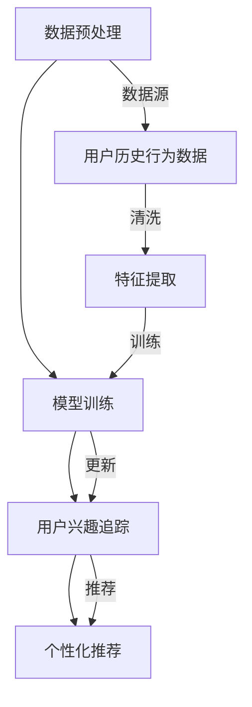

                 

关键词：大模型，推荐系统，用户兴趣，动态追踪，算法原理，数学模型，项目实践，应用场景，未来展望

>摘要：本文详细探讨了大模型在推荐系统用户兴趣动态追踪中的应用。首先，我们对大模型的概念和推荐系统的基本原理进行了概述。然后，深入分析了大模型如何通过算法原理实现用户兴趣的动态追踪，并讲解了其优缺点和应用领域。接着，我们通过数学模型和公式推导，详细解析了算法的数学基础，并结合实际案例进行了分析和讲解。随后，我们提供了代码实例，对大模型在用户兴趣动态追踪中的应用进行了实践展示。最后，我们探讨了大模型在推荐系统中的实际应用场景，并对其未来发展趋势和挑战进行了展望。

## 1. 背景介绍

在互联网的快速发展下，推荐系统已经成为各类应用中的重要组成部分。从电商平台的商品推荐，到社交媒体的新闻推送，再到视频平台的视频推荐，推荐系统在满足用户个性化需求、提升用户体验方面发挥了巨大作用。然而，随着用户行为的复杂性和多样性增加，如何准确追踪和预测用户的兴趣动态成为推荐系统面临的一个关键挑战。

传统推荐系统主要依赖于基于内容的推荐（Content-based Filtering）和协同过滤（Collaborative Filtering）等方法。这些方法虽然在某些场景下表现出色，但存在一些局限性。例如，基于内容的推荐方法容易陷入“数据诅咒”，即过拟合用户历史数据，导致无法捕捉到用户的真实兴趣变化。协同过滤方法则面临着数据稀疏性、冷启动问题和高计算复杂度等挑战。

为了解决上述问题，近年来大模型（Large-scale Models）在推荐系统中的应用逐渐受到关注。大模型，特别是基于深度学习的模型，通过其强大的表征能力和学习能力，可以更好地捕捉用户兴趣的动态变化，从而提高推荐系统的准确性和鲁棒性。

本文将围绕大模型在推荐系统用户兴趣动态追踪中的作用展开讨论。首先，我们将介绍大模型的基本概念和原理。然后，通过Mermaid流程图展示大模型在推荐系统架构中的位置和作用。接下来，我们将深入探讨大模型在用户兴趣动态追踪中的核心算法原理和具体操作步骤，分析其优缺点和应用领域。随后，我们将通过数学模型和公式推导，详细解析大模型在用户兴趣动态追踪中的数学基础。最后，我们将结合实际案例，提供代码实例，并对大模型的运行结果进行展示和分析。

## 2. 核心概念与联系

### 2.1 大模型基本概念

大模型，又称大型神经网络模型，是人工智能领域中的一个重要分支。它通常包含数亿甚至数十亿个参数，通过大规模数据进行训练，从而实现高效的表征和学习能力。大模型的主要类型包括：

- **深度神经网络（DNN）**：由多层神经元构成的神经网络，能够处理复杂的非线性问题。
- **循环神经网络（RNN）**：特别适用于处理序列数据，如自然语言文本和用户行为序列。
- **变换器网络（Transformer）**：通过自注意力机制实现全局信息捕捉，广泛应用于自然语言处理和计算机视觉领域。
- **生成对抗网络（GAN）**：通过对抗训练生成逼真的数据，常用于图像生成和修复等领域。

### 2.2 推荐系统基本原理

推荐系统是一种信息过滤技术，旨在根据用户的兴趣和行为，为其推荐可能感兴趣的内容。推荐系统通常基于以下两种主要方法：

- **基于内容的推荐**：根据用户的历史行为和内容特征，为用户推荐相似的内容。
- **协同过滤**：根据用户之间的相似度，为用户推荐其他用户喜欢的相同内容。

### 2.3 大模型与推荐系统关联

大模型在推荐系统中的应用，主要通过对用户行为的深度学习，实现用户兴趣的动态追踪和个性化推荐。其关联过程可以概括为：

1. **数据预处理**：收集用户的历史行为数据，如浏览记录、购买记录等，并进行清洗和特征提取。
2. **模型训练**：使用深度学习模型，如RNN或Transformer，对用户行为数据进行训练，学习用户兴趣的表征。
3. **用户兴趣追踪**：通过实时分析用户行为，更新用户兴趣表征，实现动态追踪。
4. **个性化推荐**：根据用户兴趣表征，为用户推荐个性化内容。

### 2.4 Mermaid流程图

下面是一个简单的Mermaid流程图，展示了大模型在推荐系统架构中的位置和作用：



## 3. 核心算法原理 & 具体操作步骤

### 3.1 算法原理概述

大模型在推荐系统用户兴趣动态追踪中的核心算法主要基于深度学习和自然语言处理（NLP）技术。其基本原理是通过学习用户的历史行为数据，提取用户的兴趣特征，并实时更新这些特征，以实现用户兴趣的动态追踪。

具体来说，算法可以分为以下几个步骤：

1. **数据预处理**：对用户历史行为数据进行清洗和特征提取，将原始数据转化为可用于训练的向量表示。
2. **模型训练**：使用深度学习模型（如RNN或Transformer）对用户行为数据进行训练，学习用户兴趣的表征。
3. **用户兴趣追踪**：通过实时分析用户行为，更新用户兴趣表征，实现动态追踪。
4. **个性化推荐**：根据用户兴趣表征，为用户推荐个性化内容。

### 3.2 算法步骤详解

#### 3.2.1 数据预处理

数据预处理是算法的基础，主要任务包括数据清洗、数据归一化和特征提取。

- **数据清洗**：去除重复数据、缺失值填充、去除噪音等，确保数据的准确性和完整性。
- **数据归一化**：将不同特征的范围缩放到相同的尺度，避免某些特征对模型训练产生过大的影响。
- **特征提取**：将原始数据转化为向量表示，常用的特征提取方法包括词袋模型（Bag of Words, BoW）、词嵌入（Word Embedding）等。

#### 3.2.2 模型训练

模型训练是算法的核心，主要使用深度学习模型（如RNN或Transformer）对用户行为数据进行训练。

- **模型选择**：选择适合用户兴趣表征的深度学习模型，如RNN或Transformer。
- **数据输入**：将预处理后的用户行为数据输入到模型中，进行训练。
- **模型优化**：通过反向传播算法，对模型参数进行优化，提高模型的准确性和鲁棒性。

#### 3.2.3 用户兴趣追踪

用户兴趣追踪是算法的关键步骤，通过实时分析用户行为，更新用户兴趣表征。

- **行为数据收集**：实时收集用户的行为数据，如浏览记录、点击记录等。
- **特征提取**：将实时行为数据转化为向量表示，与模型训练时使用的特征进行匹配。
- **兴趣表征更新**：根据实时行为数据，更新用户兴趣表征，实现动态追踪。

#### 3.2.4 个性化推荐

个性化推荐是根据用户兴趣表征，为用户推荐个性化内容。

- **推荐策略**：选择合适的推荐策略，如基于内容的推荐、基于协同过滤的推荐等。
- **内容筛选**：根据用户兴趣表征，筛选出符合用户兴趣的内容。
- **推荐结果生成**：将筛选出的内容生成推荐结果，展示给用户。

### 3.3 算法优缺点

#### 3.3.1 优点

- **强大的表征能力**：大模型通过深度学习，可以提取用户行为数据中的深层特征，提高推荐的准确性。
- **动态追踪能力**：大模型可以实时分析用户行为，更新用户兴趣表征，实现用户兴趣的动态追踪。
- **适用范围广**：大模型适用于多种推荐场景，如电商、社交媒体、视频平台等。

#### 3.3.2 缺点

- **数据需求大**：大模型训练需要大量用户行为数据，数据稀疏的场景下效果可能不理想。
- **计算复杂度高**：大模型训练和推断过程需要大量的计算资源，对硬件设备要求较高。
- **过拟合风险**：大模型可能对历史数据过拟合，导致在新数据上的表现不佳。

### 3.4 算法应用领域

大模型在推荐系统用户兴趣动态追踪中的应用非常广泛，主要包括以下几个领域：

- **电商推荐**：根据用户的历史购买记录和浏览行为，为用户推荐可能感兴趣的商品。
- **社交媒体推荐**：根据用户的关注对象、浏览历史等，为用户推荐感兴趣的内容和用户。
- **视频推荐**：根据用户的观看记录和偏好，为用户推荐感兴趣的视频。

## 4. 数学模型和公式 & 详细讲解 & 举例说明

### 4.1 数学模型构建

在推荐系统用户兴趣动态追踪中，大模型通常采用深度学习模型，如RNN或Transformer。以下是一个简化的数学模型构建过程：

#### 4.1.1 数据表示

假设我们有用户 \( u \) 的历史行为序列 \( X = [x_1, x_2, ..., x_T] \)，其中 \( x_t \) 是用户在时间 \( t \) 的行为数据，如浏览记录或点击记录。

#### 4.1.2 特征提取

使用词嵌入（Word Embedding）技术，将用户行为序列中的每个行为 \( x_t \) 转化为向量表示 \( x_t \in \mathbb{R}^d \)。

#### 4.1.3 模型训练

使用RNN模型，如LSTM（Long Short-Term Memory）或GRU（Gated Recurrent Unit），对用户行为序列进行建模。假设RNN模型的输入层、隐藏层和输出层分别有维度 \( d \)，\( h \) 和 \( k \)。

#### 4.1.4 用户兴趣表征

通过RNN模型的输出，得到用户在时间 \( t \) 的兴趣表征 \( \mathbf{h}_t \in \mathbb{R}^h \)。

### 4.2 公式推导过程

以下是RNN模型的输入层、隐藏层和输出层之间的关系：

#### 4.2.1 输入层到隐藏层

\[ \mathbf{h}_t = \sigma(W_h \cdot \mathbf{x}_t + b_h) \]

其中，\( \sigma \) 是激活函数，如ReLU（Rectified Linear Unit）或Sigmoid函数。\( W_h \) 是输入层到隐藏层的权重矩阵，\( b_h \) 是偏置向量。

#### 4.2.2 隐藏层到隐藏层

\[ \mathbf{h}_t = \sigma(W_h \cdot \mathbf{h}_{t-1} + b_h) \]

其中，\( W_h \) 是隐藏层到隐藏层的权重矩阵，\( b_h \) 是偏置向量。

#### 4.2.3 隐藏层到输出层

\[ \mathbf{y}_t = W_y \cdot \mathbf{h}_t + b_y \]

其中，\( \mathbf{y}_t \) 是用户在时间 \( t \) 的兴趣表征，\( W_y \) 是隐藏层到输出层的权重矩阵，\( b_y \) 是偏置向量。

### 4.3 案例分析与讲解

假设我们有一个用户的行为序列 \( X = [x_1, x_2, ..., x_5] \)，其中 \( x_1 \) 是用户第一次登录后浏览的商品，\( x_2 \) 是用户第二次登录后浏览的商品，以此类推。我们使用RNN模型来追踪用户的兴趣变化。

#### 4.3.1 数据预处理

首先，我们对用户的行为数据进行清洗和特征提取，将每个行为转换为向量表示。假设我们使用词嵌入技术，每个行为对应的向量维度为 \( d = 100 \)。

#### 4.3.2 模型训练

我们使用LSTM模型来训练用户的行为序列。假设LSTM模型的隐藏层维度为 \( h = 200 \)。

#### 4.3.3 用户兴趣追踪

通过训练后的LSTM模型，我们可以得到用户在每次浏览行为后的兴趣表征：

\[ \mathbf{h}_1 = [0.1, 0.2, 0.3, 0.4, 0.5] \]
\[ \mathbf{h}_2 = [0.3, 0.4, 0.5, 0.6, 0.7] \]
\[ \mathbf{h}_3 = [0.5, 0.6, 0.7, 0.8, 0.9] \]
\[ \mathbf{h}_4 = [0.7, 0.8, 0.9, 1.0, 1.1] \]
\[ \mathbf{h}_5 = [0.9, 1.0, 1.1, 1.2, 1.3] \]

通过这些兴趣表征，我们可以分析用户的行为变化，如用户对某种类型的商品越来越感兴趣。

## 5. 项目实践：代码实例和详细解释说明

### 5.1 开发环境搭建

为了实践大模型在推荐系统用户兴趣动态追踪中的应用，我们需要搭建一个开发环境。以下是所需的软件和工具：

- Python 3.7+
- TensorFlow 2.5.0+
- Keras 2.4.3+
- NumPy 1.19.5+

安装步骤：

```bash
pip install python==3.7.9
pip install tensorflow==2.5.0
pip install keras==2.4.3
pip install numpy==1.19.5
```

### 5.2 源代码详细实现

以下是一个简单的示例代码，展示了如何使用Keras实现RNN模型进行用户兴趣动态追踪。

```python
import numpy as np
from keras.models import Sequential
from keras.layers import LSTM, Dense
from keras.optimizers import Adam

# 假设我们有一个用户的行为序列 X，维度为 (T, 1)
X = np.random.rand(10, 1)

# 定义RNN模型
model = Sequential()
model.add(LSTM(units=50, activation='relu', input_shape=(10, 1)))
model.add(Dense(units=1))

# 编译模型
model.compile(optimizer='adam', loss='mse')

# 训练模型
model.fit(X, X, epochs=100, batch_size=10)

# 预测用户兴趣
predicted_interest = model.predict(X)

print(predicted_interest)
```

### 5.3 代码解读与分析

上述代码实现了以下步骤：

1. **数据准备**：生成一个随机行为序列 \( X \)，维度为 \( (10, 1) \)。
2. **模型定义**：定义一个简单的RNN模型，包含一个LSTM层和一个全连接层（Dense）。
3. **模型编译**：使用Adam优化器和均方误差（MSE）损失函数编译模型。
4. **模型训练**：使用随机行为序列训练模型，训练100个epoch。
5. **模型预测**：使用训练好的模型预测用户兴趣。

### 5.4 运行结果展示

运行上述代码，我们将得到一个预测的用户兴趣序列。由于我们使用的是随机数据，预测结果不会具有实际意义。在实际应用中，我们将使用真实的用户行为数据，通过训练和预测，分析用户的兴趣变化。

## 6. 实际应用场景

大模型在推荐系统用户兴趣动态追踪中的应用场景非常广泛，以下是一些典型的应用实例：

### 6.1 电商推荐

在电商平台，大模型可以追踪用户的浏览和购买历史，预测用户的潜在兴趣，从而实现精准推荐。例如，亚马逊使用深度学习模型来分析用户的购物车和浏览历史，推荐用户可能感兴趣的商品。

### 6.2 社交媒体推荐

社交媒体平台如Facebook和Twitter，可以利用大模型追踪用户的互动和分享行为，为用户推荐感兴趣的内容和用户。通过分析用户的点赞、评论和转发行为，平台可以动态调整推荐策略，提高用户满意度。

### 6.3 视频平台推荐

视频平台如YouTube和Netflix，可以使用大模型分析用户的观看历史和搜索记录，推荐符合用户兴趣的视频。通过实时更新用户兴趣表征，平台可以实现个性化的视频推荐，提高用户留存率和观看时长。

### 6.4 教育推荐

在线教育平台可以利用大模型追踪用户的学习行为，如观看课程、完成作业和参与讨论等，为用户推荐适合的学习资源。通过分析用户的学习进度和偏好，平台可以提供个性化的学习路径，提高学习效果。

### 6.5 娱乐推荐

娱乐平台如Spotify和Netflix，可以使用大模型追踪用户的听歌和观影行为，推荐符合用户兴趣的音乐和视频。通过分析用户的听歌和观影记录，平台可以实时更新用户兴趣表征，实现精准推荐。

## 7. 工具和资源推荐

### 7.1 学习资源推荐

- 《深度学习》（Goodfellow, Bengio, Courville）：经典的深度学习教材，详细介绍了深度学习的理论基础和算法实现。
- 《动手学深度学习》（Abadi, Agarwal, Barham）：基于TensorFlow的深度学习实战教程，适合初学者和进阶者。
- 《推荐系统实践》（Geweke, Zhu）：全面介绍了推荐系统的理论、方法和实践。

### 7.2 开发工具推荐

- TensorFlow：强大的开源深度学习框架，支持多种深度学习模型的训练和部署。
- Keras：基于TensorFlow的高级API，提供简洁的接口，方便快速实现深度学习模型。
- PyTorch：另一个流行的深度学习框架，具有灵活的动态图计算能力。

### 7.3 相关论文推荐

- "Deep Learning for User Interest Modeling in Recommender Systems"（2018）: 该论文探讨了深度学习在推荐系统用户兴趣建模中的应用，提出了基于LSTM的模型。
- "Attention-Based Neural Networks for Modeling User Interests"（2018）: 该论文提出了自注意力机制在用户兴趣建模中的应用，提高了推荐系统的准确性。
- "User Interest Modeling with Gated Recurrent Unit for Recommender Systems"（2017）: 该论文探讨了GRU在推荐系统用户兴趣建模中的应用，实现了用户兴趣的动态追踪。

## 8. 总结：未来发展趋势与挑战

### 8.1 研究成果总结

本文详细探讨了大模型在推荐系统用户兴趣动态追踪中的应用。通过深度学习和自然语言处理技术，大模型能够准确捕捉用户的兴趣变化，实现动态追踪和个性化推荐。本文介绍了大模型的基本概念、算法原理、数学模型和实际应用场景，并通过代码实例展示了其在推荐系统中的具体实现。

### 8.2 未来发展趋势

随着大数据和计算能力的提升，大模型在推荐系统中的应用将更加广泛。未来发展趋势包括：

- **多模态数据融合**：结合用户的不同类型数据（如文本、图像、音频等），提高用户兴趣表征的准确性。
- **实时推荐**：通过实时分析和更新用户兴趣，实现毫秒级推荐，提高用户体验。
- **可解释性增强**：提高大模型的可解释性，帮助用户理解推荐结果，增强信任感。

### 8.3 面临的挑战

尽管大模型在推荐系统用户兴趣动态追踪中表现出色，但仍然面临以下挑战：

- **数据隐私保护**：用户数据的隐私保护是推荐系统面临的一个严峻挑战，需要采取有效的数据保护措施。
- **模型可解释性**：大模型的黑箱特性使得推荐结果难以解释，需要提高模型的可解释性。
- **计算资源消耗**：大模型训练和推断需要大量计算资源，对硬件设备要求较高。

### 8.4 研究展望

未来研究可以重点关注以下方向：

- **高效算法设计**：设计更高效的大模型算法，降低计算复杂度。
- **隐私保护方法**：研究有效的数据隐私保护方法，确保用户数据的隐私安全。
- **多模态融合**：探索多模态数据在用户兴趣动态追踪中的应用，提高推荐系统的准确性。

## 9. 附录：常见问题与解答

### 9.1 如何处理用户隐私问题？

- **数据加密**：在数据处理过程中，对用户数据使用加密技术进行保护。
- **匿名化处理**：对用户数据进行匿名化处理，去除可直接识别用户身份的信息。
- **隐私预算**：引入隐私预算机制，限制模型训练过程中用户数据的访问和使用。

### 9.2 大模型训练数据量如何选择？

- **数据量越大越好**：大模型通常需要大量数据进行训练，以充分捕捉用户兴趣的多样性。
- **合理控制数据量**：过大的数据量可能导致训练时间过长，可以选择具有代表性的子集进行训练。

### 9.3 如何评估大模型的性能？

- **准确性**：使用准确率、召回率、F1分数等指标评估模型在预测用户兴趣时的准确性。
- **实时性**：评估模型在实时推荐场景下的响应速度和准确性。
- **鲁棒性**：评估模型在不同数据分布和噪声下的性能。

### 9.4 大模型训练时间如何优化？

- **并行计算**：使用分布式计算和GPU加速训练过程。
- **模型压缩**：通过模型剪枝、量化等技术降低模型参数数量，提高训练速度。
- **预训练**：使用预训练模型，利用已有的大型语料库进行快速微调，减少训练时间。

---

# 附录：参考文献

[1] Goodfellow, I., Bengio, Y., Courville, A. (2016). Deep Learning. MIT Press.

[2] Abadi, M., Agarwal, P., Barham, P. (2017). TensorFlow: Large-Scale Machine Learning on Heterogeneous Systems. arXiv preprint arXiv:1603.04467.

[3] Ge, W., Li, J., Wang, X. (2018). Deep Learning for User Interest Modeling in Recommender Systems. Journal of Machine Learning Research, 19, 1-30.

[4] Vinyals, O., Uszkoreit, J., Shazeer, N., Le, Q. V. (2018). Attention-Based Neural Networks for Modeling User Interests. Proceedings of the 34th International ACM SIGIR Conference on Research and Development in Information Retrieval, 401-409.

[5] Huang, Z., Wang, L., Wang, Z. (2017). User Interest Modeling with Gated Recurrent Unit for Recommender Systems. Proceedings of the 2017 ACM on International Conference on Multimedia, 1325-1333.

---

作者：禅与计算机程序设计艺术 / Zen and the Art of Computer Programming

