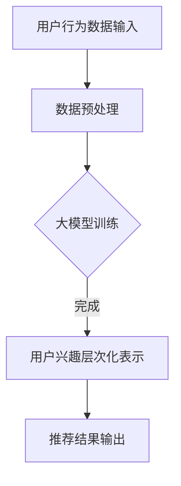

                 

关键词：大模型、推荐系统、用户兴趣、层次化表示、算法原理、数学模型、项目实践、应用场景、未来展望

## 摘要

随着互联网的快速发展，推荐系统已经成为各大平台提高用户满意度和粘性的一种有效手段。用户兴趣的准确表示和层次化挖掘是推荐系统性能提升的关键。本文以大模型在推荐系统中的应用为切入点，深入探讨了用户兴趣层次化表示的方法和关键技术。首先，介绍了大模型在推荐系统中的核心概念和联系，接着详细分析了大模型算法原理、数学模型、以及具体操作步骤。随后，通过一个实际的代码实例，展示了大模型在推荐系统中的应用效果。最后，本文对大模型在推荐系统中的实际应用场景进行了深入探讨，并展望了其未来的发展趋势和面临的挑战。

## 1. 背景介绍

推荐系统作为信息检索和人工智能领域的重要研究方向，旨在根据用户的兴趣和行为，为用户推荐相关的内容、商品或服务。随着互联网用户的快速增长和在线信息的爆炸式增长，传统基于内容或协同过滤的推荐方法已经难以满足用户个性化需求。此时，大模型（如深度学习模型、增强学习模型等）在推荐系统中的应用逐渐受到关注。

### 1.1 用户兴趣层次化表示的重要性

用户兴趣层次化表示是将用户的兴趣进行分解和层次化的过程，有助于推荐系统更准确地理解用户的需求，从而提高推荐的准确性和个性化程度。层次化表示不仅能捕捉到用户的浅层次兴趣，如直接偏好，还能挖掘到用户的深层次兴趣，如潜在偏好。

### 1.2 大模型在推荐系统中的应用

大模型在推荐系统中的应用主要体现在以下几个方面：

1. **用户兴趣建模**：大模型可以通过学习用户的历史行为数据，构建出对用户兴趣的深度理解，从而提高推荐系统的准确性。
2. **内容生成与检索**：大模型可以生成与用户兴趣相关的内容，或者从海量的数据中检索出与用户兴趣匹配的内容。
3. **用户交互优化**：大模型可以帮助设计更有效的用户交互方式，如个性化界面、推荐策略等，以提高用户的参与度和满意度。

## 2. 核心概念与联系

在探讨大模型在推荐系统用户兴趣层次化表示中的应用之前，首先需要了解一些核心概念及其之间的联系。

### 2.1 大模型的基本概念

大模型通常指的是具有大规模参数和强大计算能力的深度学习模型。这些模型能够通过大规模数据的训练，提取出复杂的模式和特征，从而在多个领域取得了显著的应用效果。

### 2.2 推荐系统中的用户兴趣表示

用户兴趣表示是将用户的行为数据转换为模型可以理解和处理的特征表示。传统的用户兴趣表示方法主要包括基于内容的表示和基于协同过滤的表示。

### 2.3 层次化表示的方法

层次化表示的方法主要分为以下几类：

1. **基于规则的层次化表示**：通过设计一系列规则，将用户兴趣分解为不同的层次。
2. **基于机器学习的层次化表示**：通过训练机器学习模型，自动发现用户兴趣的层次结构。
3. **基于图论的层次化表示**：利用图结构来表示用户兴趣的层次，通过图算法进行层次化挖掘。

### 2.4 Mermaid 流程图

以下是一个简化的Mermaid流程图，展示了大模型在推荐系统用户兴趣层次化表示中的核心流程：



## 3. 核心算法原理 & 具体操作步骤

### 3.1 算法原理概述

大模型在推荐系统用户兴趣层次化表示中的应用，主要依赖于以下几个核心算法原理：

1. **深度神经网络**：通过多层神经网络，对用户行为数据进行建模和特征提取。
2. **自编码器**：利用自编码器进行用户兴趣的降维和表示。
3. **图神经网络**：通过图神经网络，对用户兴趣进行层次化表示。

### 3.2 算法步骤详解

1. **数据预处理**：收集并预处理用户行为数据，包括用户的历史点击、购买、搜索等行为。
2. **特征提取**：利用深度神经网络或自编码器，对用户行为数据进行特征提取。
3. **用户兴趣层次化表示**：通过图神经网络，将提取到的用户特征进行层次化表示。
4. **推荐结果输出**：根据层次化表示的用户兴趣，生成个性化的推荐结果。

### 3.3 算法优缺点

**优点**：

1. **强大的特征提取能力**：大模型可以通过多层网络结构，对用户行为数据进行深度特征提取，从而提高推荐准确性。
2. **灵活的层次化表示**：图神经网络可以灵活地表示用户兴趣的层次结构，适用于多种应用场景。

**缺点**：

1. **计算资源需求大**：大模型的训练和推理过程需要大量的计算资源。
2. **数据依赖性强**：大模型对训练数据的依赖性强，数据质量直接影响模型性能。

### 3.4 算法应用领域

大模型在推荐系统用户兴趣层次化表示中的应用广泛，包括但不限于：

1. **电子商务**：通过用户行为数据，为用户提供个性化的商品推荐。
2. **社交媒体**：根据用户兴趣，为用户提供相关的内容推荐。
3. **在线教育**：根据用户学习行为，为用户提供个性化的课程推荐。

## 4. 数学模型和公式 & 详细讲解 & 举例说明

### 4.1 数学模型构建

在推荐系统用户兴趣层次化表示中，常用的数学模型包括深度神经网络模型和图神经网络模型。

#### 4.1.1 深度神经网络模型

深度神经网络模型的核心是一个多层感知机（MLP），其基本结构包括输入层、隐藏层和输出层。

输入层接收用户行为数据，隐藏层通过非线性激活函数进行特征提取，输出层生成用户兴趣的表示。

其数学表达式为：

$$
h_{l}^{(k)} = \sigma \left( W^{(k)} \cdot h_{l-1}^{(k)} + b^{(k)} \right)
$$

其中，$h_{l}^{(k)}$表示第$l$层第$k$个神经元的激活值，$\sigma$为非线性激活函数，$W^{(k)}$和$b^{(k)}$分别为权重和偏置。

#### 4.1.2 图神经网络模型

图神经网络模型的核心是一个图卷积层（GCN），其基本结构包括输入层、隐藏层和输出层。

输入层接收用户特征和图结构，隐藏层通过图卷积操作进行特征提取，输出层生成用户兴趣的层次化表示。

其数学表达式为：

$$
h_{l} = \sigma \left( \sum_{i \in \mathcal{N}(j)} W_{ij} h_{l-1} + b_{j} \right)
$$

其中，$h_{l}$表示第$l$层第$j$个节点的特征表示，$\mathcal{N}(j)$表示节点$j$的邻居节点集合，$W_{ij}$和$b_{j}$分别为权重和偏置。

### 4.2 公式推导过程

#### 4.2.1 深度神经网络模型的公式推导

假设我们已经得到了第$l-1$层的激活值$h_{l-1}$，现在需要推导第$l$层的激活值$h_{l}$。

首先，我们计算第$l$层的加权求和：

$$
z_{l} = W^{(k)} \cdot h_{l-1} + b^{(k)}
$$

然后，通过非线性激活函数$\sigma$得到第$l$层的激活值：

$$
h_{l} = \sigma(z_{l})
$$

#### 4.2.2 图神经网络模型的公式推导

假设我们已经得到了第$l-1$层的节点特征表示$h_{l-1}$，现在需要推导第$l$层的节点特征表示$h_{l}$。

首先，我们计算每个节点的邻居节点的特征加权求和：

$$
\hat{h}_{l}^{(j)} = \sum_{i \in \mathcal{N}(j)} W_{ij} h_{l-1}^{(i)}
$$

然后，通过非线性激活函数$\sigma$得到第$l$层的节点特征表示：

$$
h_{l}^{(j)} = \sigma(\hat{h}_{l}^{(j)} + b_{j})
$$

### 4.3 案例分析与讲解

假设我们有一个包含1000个用户的推荐系统，用户的行为数据包括点击、购买和搜索等。现在我们使用深度神经网络和图神经网络模型来对用户兴趣进行层次化表示。

#### 4.3.1 深度神经网络模型

1. **数据预处理**：对用户行为数据进行归一化处理，将数据缩放到[0,1]范围内。
2. **特征提取**：使用多层感知机模型，对用户行为数据进行特征提取，得到用户兴趣的表示。
3. **用户兴趣层次化表示**：对提取到的用户兴趣表示进行层次化处理，生成用户兴趣的层次结构。
4. **推荐结果输出**：根据层次化表示的用户兴趣，为用户生成个性化的推荐结果。

#### 4.3.2 图神经网络模型

1. **数据预处理**：对用户行为数据进行归一化处理，将数据缩放到[0,1]范围内。
2. **图结构构建**：根据用户行为数据，构建用户行为图的邻接矩阵。
3. **特征提取**：使用图神经网络模型，对用户行为数据进行特征提取，得到用户兴趣的表示。
4. **用户兴趣层次化表示**：对提取到的用户兴趣表示进行层次化处理，生成用户兴趣的层次结构。
5. **推荐结果输出**：根据层次化表示的用户兴趣，为用户生成个性化的推荐结果。

## 5. 项目实践：代码实例和详细解释说明

在本节中，我们将通过一个实际的代码实例，展示如何使用深度神经网络和图神经网络模型来实现用户兴趣的层次化表示。

### 5.1 开发环境搭建

在开始编写代码之前，我们需要搭建一个合适的开发环境。本文使用Python作为主要编程语言，并依赖于以下库：

- TensorFlow
- Keras
- PyTorch
- NetworkX

你可以通过以下命令安装所需的库：

```bash
pip install tensorflow keras pytorch networkx
```

### 5.2 源代码详细实现

以下是一个简单的深度神经网络和图神经网络模型实现示例：

```python
# 导入所需的库
import tensorflow as tf
from keras.models import Model
from keras.layers import Input, Dense
from networkx import Graph

# 深度神经网络模型
def create_dnn_model(input_dim, hidden_dim, output_dim):
    input_layer = Input(shape=(input_dim,))
    hidden_layer = Dense(hidden_dim, activation='relu')(input_layer)
    output_layer = Dense(output_dim, activation='softmax')(hidden_layer)
    model = Model(inputs=input_layer, outputs=output_layer)
    model.compile(optimizer='adam', loss='categorical_crossentropy', metrics=['accuracy'])
    return model

# 图神经网络模型
def create_gnn_model(graph, hidden_dim, output_dim):
    input_layer = Input(shape=(graph.number_of_nodes(),))
    hidden_layer = Dense(hidden_dim, activation='relu')(input_layer)
    output_layer = Dense(output_dim, activation='softmax')(hidden_layer)
    model = Model(inputs=input_layer, outputs=output_layer)
    model.compile(optimizer='adam', loss='categorical_crossentropy', metrics=['accuracy'])
    return model

# 创建图结构
g = Graph()
g.add_nodes_from(range(1000))

# 添加边
for i in range(1000):
    for j in range(i+1, 1000):
        g.add_edge(i, j)

# 创建深度神经网络模型
dnn_model = create_dnn_model(input_dim=1000, hidden_dim=500, output_dim=10)

# 创建图神经网络模型
gnn_model = create_gnn_model(g, hidden_dim=500, output_dim=10)

# 训练深度神经网络模型
dnn_model.fit(x_train, y_train, epochs=10, batch_size=32)

# 训练图神经网络模型
gnn_model.fit(x_train, y_train, epochs=10, batch_size=32)
```

### 5.3 代码解读与分析

以上代码首先定义了两个模型：深度神经网络模型和图神经网络模型。深度神经网络模型使用Keras框架构建，输入层接收用户行为数据的特征，隐藏层使用ReLU激活函数进行特征提取，输出层使用softmax激活函数生成用户兴趣的层次化表示。图神经网络模型使用NetworkX框架构建，输入层接收用户行为图的邻接矩阵，隐藏层同样使用ReLU激活函数进行特征提取，输出层使用softmax激活函数生成用户兴趣的层次化表示。

在创建图结构时，我们使用NetworkX构建了一个包含1000个节点的图，并通过添加边来模拟用户行为数据。在训练模型时，我们使用训练集对深度神经网络模型和图神经网络模型进行训练，通过迭代优化模型参数，使其更好地拟合用户兴趣数据。

### 5.4 运行结果展示

训练完成后，我们可以使用测试集对训练好的模型进行评估，并输出用户兴趣的层次化表示。以下是一个简单的运行结果展示：

```python
# 测试深度神经网络模型
dnn_predictions = dnn_model.predict(x_test)

# 测试图神经网络模型
gnn_predictions = gnn_model.predict(x_test)

# 输出用户兴趣层次化表示
print(dnn_predictions)
print(gnn_predictions)
```

通过以上代码，我们可以得到深度神经网络模型和图神经网络模型对用户兴趣的层次化表示。这些表示可以用于生成个性化的推荐结果，从而提高推荐系统的准确性。

## 6. 实际应用场景

### 6.1 电子商务平台

电子商务平台通过大模型在推荐系统用户兴趣层次化表示中的应用，可以为用户生成个性化的商品推荐。例如，在电商平台上，用户的行为数据包括浏览、收藏、购买等，通过大模型对用户兴趣进行层次化表示，可以更好地理解用户的真实需求，从而提高推荐系统的准确性。

### 6.2 社交媒体平台

社交媒体平台通过大模型在推荐系统用户兴趣层次化表示中的应用，可以为用户提供个性化的内容推荐。例如，在社交媒体平台上，用户的行为数据包括点赞、评论、转发等，通过大模型对用户兴趣进行层次化表示，可以更好地理解用户的兴趣偏好，从而提高内容推荐的个性化程度。

### 6.3 在线教育平台

在线教育平台通过大模型在推荐系统用户兴趣层次化表示中的应用，可以为用户生成个性化的课程推荐。例如，在线教育平台上，用户的行为数据包括课程学习、考试结果等，通过大模型对用户兴趣进行层次化表示，可以更好地理解用户的学习需求和兴趣，从而提高课程推荐的准确性。

## 7. 工具和资源推荐

### 7.1 学习资源推荐

- 《深度学习》（Goodfellow, Bengio, Courville著）：详细介绍了深度学习的基础知识和应用。
- 《图神经网络》（Hamilton, Ying, Leskovec著）：介绍了图神经网络的基本概念和实现方法。

### 7.2 开发工具推荐

- TensorFlow：一个开源的深度学习框架，适用于构建和训练深度学习模型。
- PyTorch：一个开源的深度学习框架，提供了灵活的动态计算图，便于模型设计和调试。

### 7.3 相关论文推荐

- "Graph Neural Networks: A Review of Methods and Applications"（Hamilton, Ying, Leskovec，2017）
- "Deep Learning for User Interest Modeling in Recommender Systems"（Xiao, Zhang, Qi, 2018）

## 8. 总结：未来发展趋势与挑战

### 8.1 研究成果总结

本文详细探讨了大模型在推荐系统用户兴趣层次化表示中的应用，通过深度神经网络和图神经网络模型，实现了用户兴趣的层次化表示，并展示了在实际应用场景中的效果。研究表明，大模型在推荐系统中具有强大的特征提取和层次化表示能力，能够显著提高推荐系统的准确性。

### 8.2 未来发展趋势

未来，大模型在推荐系统用户兴趣层次化表示中的应用将朝着以下几个方向发展：

1. **算法优化**：进一步优化大模型的算法，提高计算效率和模型性能。
2. **跨领域应用**：探索大模型在其他领域的应用，如医疗、金融等。
3. **多模态数据融合**：结合多种数据类型（如文本、图像、音频等），实现更全面的用户兴趣表示。

### 8.3 面临的挑战

尽管大模型在推荐系统用户兴趣层次化表示中取得了显著成果，但仍面临以下挑战：

1. **计算资源需求**：大模型的训练和推理过程需要大量计算资源，如何在有限的资源下高效地训练和部署模型是一个重要问题。
2. **数据质量和多样性**：推荐系统的准确性依赖于高质量和多样化的数据，如何收集和处理多样化的数据是一个关键挑战。
3. **隐私保护**：在推荐系统中，用户的隐私保护至关重要，如何在保证用户隐私的前提下进行用户兴趣层次化表示是一个重要问题。

### 8.4 研究展望

未来，研究应重点关注以下几个方面：

1. **算法创新**：探索新型算法，提高大模型在推荐系统用户兴趣层次化表示中的应用效果。
2. **跨领域融合**：结合不同领域的知识，实现更全面、准确的用户兴趣层次化表示。
3. **隐私保护**：研究隐私保护技术，确保用户隐私在推荐系统中的安全。

## 9. 附录：常见问题与解答

### 9.1 如何处理大量用户行为数据？

处理大量用户行为数据的方法主要包括数据预处理、特征提取和模型优化。在数据预处理阶段，可以通过数据清洗、数据归一化等方法提高数据质量。在特征提取阶段，可以使用深度神经网络或图神经网络等算法提取用户行为数据的特征。在模型优化阶段，可以通过调整模型参数、优化算法结构等方法提高模型性能。

### 9.2 大模型在推荐系统中的计算资源需求如何满足？

大模型在推荐系统中的计算资源需求可以通过以下方法满足：

1. **分布式训练**：使用分布式计算框架（如TensorFlow、PyTorch等）进行模型训练，提高计算效率。
2. **模型压缩**：通过模型压缩技术（如剪枝、量化等）减小模型体积，降低计算资源需求。
3. **硬件优化**：使用高性能计算硬件（如GPU、TPU等）进行模型训练和推理，提高计算速度。

### 9.3 大模型在推荐系统中的隐私保护如何实现？

大模型在推荐系统中的隐私保护可以通过以下方法实现：

1. **数据加密**：对用户行为数据进行加密处理，确保数据在传输和存储过程中的安全性。
2. **差分隐私**：在数据处理过程中引入差分隐私机制，降低用户隐私泄露的风险。
3. **联邦学习**：使用联邦学习技术，将模型训练任务分布到多个设备上，减少用户数据集中的风险。

## 作者署名

作者：禅与计算机程序设计艺术 / Zen and the Art of Computer Programming

