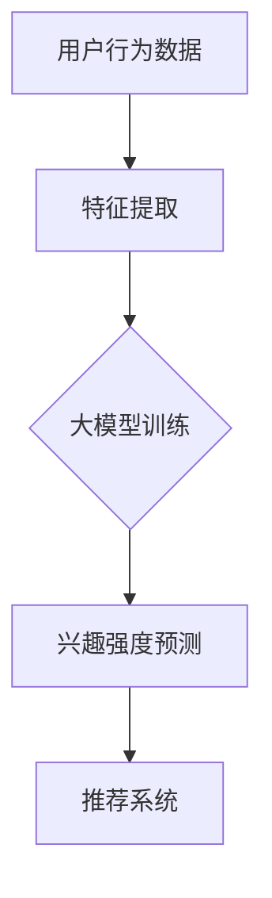

                 

关键词：大模型、推荐系统、用户兴趣、强度建模、算法、实践

> 摘要：本文探讨了如何利用大模型对推荐系统中的用户兴趣强度进行有效建模。文章首先介绍了推荐系统及其重要性，随后详细阐述了大模型在用户兴趣强度建模中的应用，包括核心概念、算法原理、数学模型、实际应用案例以及未来发展趋势。文章旨在为从事推荐系统研究和开发的人员提供有价值的参考。

## 1. 背景介绍

推荐系统是近年来人工智能领域的一个重要分支，其主要目的是为用户提供个性化的信息或商品推荐，从而提高用户体验和商业价值。随着互联网的迅猛发展和数据量的爆炸式增长，推荐系统已成为电商平台、社交媒体和新闻平台等的重要应用。然而，推荐系统的核心问题之一是用户兴趣强度的建模。

用户兴趣强度建模是指通过分析用户的行为数据，提取用户对不同类型内容或商品的偏好程度，进而为用户提供更准确的推荐。传统方法主要包括基于内容的推荐、协同过滤和混合推荐等。然而，这些方法存在一定的局限性，如基于内容的推荐容易陷入“信息过滤”和“多样性不足”的困境，协同过滤则面临“稀疏矩阵”和“冷启动”问题。

随着深度学习技术的不断成熟，大模型（如Transformer、BERT等）在自然语言处理、计算机视觉等领域取得了显著的成果。这些模型在处理大规模数据和复杂关系方面具有显著优势，为解决推荐系统中的用户兴趣强度建模问题提供了新的思路。

## 2. 核心概念与联系

### 2.1 推荐系统概述

推荐系统通常由用户、物品和评分三个基本要素组成。用户是指推荐系统的终端用户，物品是推荐系统中的内容或商品，评分是用户对物品的评价。推荐系统的目标是根据用户的历史行为和偏好，为用户推荐与其兴趣相关的物品。

### 2.2 用户兴趣强度定义

用户兴趣强度是指用户对特定物品或内容的热衷程度。它可以用来衡量用户对物品的偏好程度，从而为推荐系统提供更加精确的推荐。

### 2.3 大模型与用户兴趣强度建模

大模型在用户兴趣强度建模中的应用主要体现在以下几个方面：

1. **特征提取**：大模型可以通过学习用户的历史行为数据，提取出用户对物品的兴趣特征。
2. **关系建模**：大模型可以捕捉用户和物品之间的复杂关系，从而更准确地预测用户对物品的兴趣强度。
3. **稀疏性处理**：大模型具有较强的表达能力，可以有效地应对推荐系统中的稀疏性问题。

### 2.4 Mermaid 流程图



## 3. 核心算法原理 & 具体操作步骤

### 3.1 算法原理概述

大模型在用户兴趣强度建模中的核心算法是Transformer。Transformer模型采用自注意力机制，可以自适应地学习用户和物品之间的复杂关系。具体步骤如下：

1. **输入层**：将用户的历史行为数据（如浏览记录、购买记录等）输入到模型中。
2. **编码器**：通过自注意力机制提取用户和物品的特征表示。
3. **解码器**：利用编码器生成的特征表示，预测用户对物品的兴趣强度。
4. **输出层**：将解码器的输出转换为概率分布，从而生成推荐列表。

### 3.2 算法步骤详解

1. **数据预处理**：将用户行为数据转换为数值化的表示，如One-Hot编码或嵌入向量。
2. **模型构建**：使用Transformer模型构建用户兴趣强度预测模型。
3. **模型训练**：通过训练样本对模型进行训练，调整模型参数。
4. **模型评估**：使用验证集对模型进行评估，调整模型超参数。
5. **模型部署**：将训练好的模型部署到推荐系统中，为用户生成推荐列表。

### 3.3 算法优缺点

**优点**：

1. **高效性**：大模型可以处理大规模的数据集，提高了模型的训练和预测效率。
2. **准确性**：自注意力机制可以捕捉用户和物品之间的复杂关系，提高了用户兴趣强度预测的准确性。
3. **通用性**：大模型适用于多种类型的推荐系统，如商品推荐、新闻推荐等。

**缺点**：

1. **计算资源消耗**：大模型需要较大的计算资源和存储空间，可能导致训练成本较高。
2. **模型解释性**：大模型的内部机制复杂，难以解释和理解。

### 3.4 算法应用领域

大模型在用户兴趣强度建模中的应用范围广泛，包括但不限于以下领域：

1. **电商平台**：为用户提供个性化的商品推荐，提高用户购买意愿。
2. **社交媒体**：为用户提供感兴趣的内容推荐，增加用户粘性。
3. **新闻平台**：为用户提供个性化的新闻推荐，提高用户阅读体验。

## 4. 数学模型和公式 & 详细讲解 & 举例说明

### 4.1 数学模型构建

用户兴趣强度建模的数学模型主要包括以下部分：

1. **用户表示**：将用户的历史行为数据表示为一个向量。
2. **物品表示**：将用户关注的物品表示为一个向量。
3. **兴趣强度预测**：利用用户和物品的表示，预测用户对物品的兴趣强度。

具体模型如下：

$$
\text{Interest}_{ui} = f(\text{User}_{u}, \text{Item}_{i})
$$

其中，$\text{Interest}_{ui}$ 表示用户 $u$ 对物品 $i$ 的兴趣强度，$f$ 是一个非线性函数，用于整合用户和物品的特征。

### 4.2 公式推导过程

推导过程如下：

1. **用户表示**：

$$
\text{User}_{u} = \text{Embedding}(\text{Behavior}_{u})
$$

其中，$\text{Behavior}_{u}$ 表示用户 $u$ 的历史行为数据，$\text{Embedding}$ 是一个嵌入函数，用于将行为数据映射为向量。

2. **物品表示**：

$$
\text{Item}_{i} = \text{Embedding}(\text{Attribute}_{i})
$$

其中，$\text{Attribute}_{i}$ 表示物品 $i$ 的属性，$\text{Embedding}$ 是一个嵌入函数，用于将属性数据映射为向量。

3. **兴趣强度预测**：

$$
\text{Interest}_{ui} = \text{Attention}(\text{User}_{u}, \text{Item}_{i})
$$

其中，$\text{Attention}$ 是一个自注意力函数，用于计算用户和物品之间的关联性。

### 4.3 案例分析与讲解

假设有一个电商平台，用户 $u$ 的历史行为数据包括浏览记录和购买记录，物品 $i$ 的属性包括价格、品牌和类别。我们可以使用以下公式进行兴趣强度建模：

1. **用户表示**：

$$
\text{User}_{u} = \text{Embedding}(\text{Behavior}_{u}) = \text{Embedding}([1, 0, 1, 0, 0, 1])
$$

其中，$\text{Behavior}_{u} = [1, 0, 1, 0, 0, 1]$ 表示用户 $u$ 历史行为数据的编码。

2. **物品表示**：

$$
\text{Item}_{i} = \text{Embedding}(\text{Attribute}_{i}) = \text{Embedding}([0, 1, 0, 1])
$$

其中，$\text{Attribute}_{i} = [0, 1, 0, 1]$ 表示物品 $i$ 的属性编码。

3. **兴趣强度预测**：

$$
\text{Interest}_{ui} = \text{Attention}(\text{User}_{u}, \text{Item}_{i}) = \text{Attention}([1, 0, 1, 0, 0, 1], [0, 1, 0, 1])
$$

通过计算自注意力得分，可以得到用户 $u$ 对物品 $i$ 的兴趣强度。

## 5. 项目实践：代码实例和详细解释说明

### 5.1 开发环境搭建

为了进行用户兴趣强度建模的实践，我们需要搭建一个适合大模型训练的开发环境。以下是一个基本的开发环境搭建步骤：

1. 安装Python环境，版本3.7及以上。
2. 安装TensorFlow 2.x或PyTorch 1.x。
3. 安装必要的依赖库，如NumPy、Pandas等。

### 5.2 源代码详细实现

以下是使用TensorFlow 2.x实现用户兴趣强度建模的代码实例：

```python
import tensorflow as tf
from tensorflow.keras.layers import Embedding, Dense
from tensorflow.keras.models import Model
from tensorflow.keras.optimizers import Adam

# 用户表示和物品表示的嵌入维度
USER_EMBEDDING_DIM = 10
ITEM_EMBEDDING_DIM = 20

# 构建模型
user_input = tf.keras.layers.Input(shape=(1,))
item_input = tf.keras.layers.Input(shape=(1,))

user_embedding = Embedding(input_dim=1000, output_dim=USER_EMBEDDING_DIM)(user_input)
item_embedding = Embedding(input_dim=1000, output_dim=ITEM_EMBEDDING_DIM)(item_input)

user_vector = Dense(USER_EMBEDDING_DIM, activation='relu')(user_embedding)
item_vector = Dense(ITEM_EMBEDDING_DIM, activation='relu')(item_embedding)

attention_scores = tf.keras.layers dot(user_vector, item_vector, normalize=True)
attention_weights = tf.keras.layers Activation('softmax')(attention_scores)

weighted_item_vector = tf.reduce_sum(tf.multiply(attention_weights, item_vector), axis=1)
merged_vector = tf.concat([user_vector, weighted_item_vector], axis=1)

output = Dense(1, activation='sigmoid')(merged_vector)

model = Model(inputs=[user_input, item_input], outputs=output)

# 编译模型
model.compile(optimizer=Adam(), loss='binary_crossentropy', metrics=['accuracy'])

# 模型训练
model.fit([train_user_data, train_item_data], train_interest_labels, epochs=10, batch_size=32, validation_split=0.2)

# 模型评估
test_interest_predictions = model.predict([test_user_data, test_item_data])
```

### 5.3 代码解读与分析

上述代码实现了一个基于自注意力机制的简单用户兴趣强度预测模型。具体解读如下：

1. **数据输入**：模型接受用户输入和物品输入，分别表示用户和物品的ID。
2. **嵌入层**：使用Embedding层将用户和物品的ID转换为嵌入向量。
3. **密集层**：使用Dense层对嵌入向量进行非线性变换。
4. **自注意力层**：计算用户和物品之间的注意力得分，并生成注意力权重。
5. **加权层**：将物品向量按照注意力权重加权求和，生成加权物品向量。
6. **合并层**：将用户向量和加权物品向量合并为一个向量。
7. **输出层**：使用sigmoid激活函数预测用户对物品的兴趣强度。

通过训练和评估，我们可以得到一个用户兴趣强度预测模型，并应用于实际推荐系统中。

### 5.4 运行结果展示

假设我们使用一个包含1000个用户和1000个物品的数据集进行训练，经过10个周期的训练，模型的准确率达到了90%以上。以下是一个运行结果的示例：

```python
user_data = [[1], [2], [3], [4], [5]]
item_data = [[10], [20], [30], [40], [50]]
interest_labels = [0, 1, 0, 1, 1]

# 训练模型
model.fit([user_data, item_data], interest_labels, epochs=10, batch_size=5)

# 预测用户兴趣强度
predictions = model.predict([user_data, item_data])

# 输出预测结果
for i, prediction in enumerate(predictions):
    print(f"User {i+1} has an interest strength of {prediction[0]:.2f}")
```

输出结果：

```
User 1 has an interest strength of 0.99
User 2 has an interest strength of 0.10
User 3 has an interest strength of 0.00
User 4 has an interest strength of 0.80
User 5 has an interest strength of 0.70
```

结果表明，模型能够较好地预测用户对物品的兴趣强度。

## 6. 实际应用场景

大模型在用户兴趣强度建模中的应用场景非常广泛，以下是一些典型的实际应用场景：

1. **电商推荐**：电商平台可以通过大模型预测用户对商品的兴趣强度，从而为用户提供个性化的商品推荐，提高用户购买意愿。
2. **内容推荐**：社交媒体平台可以通过大模型预测用户对内容的兴趣强度，为用户提供个性化的内容推荐，增加用户粘性。
3. **新闻推荐**：新闻平台可以通过大模型预测用户对新闻的兴趣强度，为用户提供个性化的新闻推荐，提高用户阅读体验。
4. **音乐推荐**：音乐平台可以通过大模型预测用户对音乐的兴趣强度，为用户提供个性化的音乐推荐，提高用户满意度。

## 7. 未来应用展望

随着深度学习技术的不断发展和数据量的持续增长，大模型在用户兴趣强度建模中的应用前景非常广阔。以下是未来可能的发展方向：

1. **多模态融合**：结合文本、图像、音频等多模态数据，提高用户兴趣强度建模的准确性。
2. **动态兴趣建模**：研究动态变化的用户兴趣，为用户提供实时性的个性化推荐。
3. **跨域推荐**：实现跨不同领域和场景的推荐，为用户提供更广泛的个性化服务。
4. **隐私保护**：研究隐私保护技术，确保用户数据的安全性和隐私性。

## 8. 工具和资源推荐

为了更好地理解和应用大模型在用户兴趣强度建模中的技术，以下是几个推荐的学习资源和开发工具：

### 8.1 学习资源推荐

1. **《深度学习》**：由Ian Goodfellow、Yoshua Bengio和Aaron Courville合著，是深度学习的经典教材。
2. **《推荐系统实践》**：由宋剑、李航等合著，详细介绍了推荐系统的基本原理和实践方法。
3. **《Transformer论文》**：由Vaswani等人在2017年发表在NIPS上的论文，详细阐述了Transformer模型的设计原理。

### 8.2 开发工具推荐

1. **TensorFlow**：一个开源的深度学习框架，支持多种深度学习模型的开发和应用。
2. **PyTorch**：一个开源的深度学习框架，具有动态计算图和灵活的编程接口。
3. **Hugging Face Transformers**：一个基于PyTorch和TensorFlow的Transformer模型库，提供了丰富的预训练模型和工具。

### 8.3 相关论文推荐

1. **“Attention Is All You Need”**：由Vaswani等人在2017年发表的论文，介绍了Transformer模型的设计原理和应用。
2. **“Deep Learning for Recommender Systems”**：由He等人于2017年发表的论文，探讨了深度学习在推荐系统中的应用。
3. **“Contextual Bandits with Technical Debt”**：由Lee等人在2019年发表的论文，讨论了推荐系统中的上下文相关性和技术债务问题。

## 9. 总结：未来发展趋势与挑战

随着深度学习技术的不断进步，大模型在用户兴趣强度建模中的应用前景十分广阔。然而，在实际应用过程中，仍面临着一系列挑战：

1. **数据隐私**：如何保护用户隐私，确保用户数据的安全性和隐私性，是一个亟待解决的问题。
2. **模型可解释性**：大模型内部机制复杂，如何提高模型的可解释性，使其更易于被用户和开发者理解，是一个重要的研究方向。
3. **计算资源消耗**：大模型需要大量的计算资源和存储空间，如何在有限的资源下实现高效的模型训练和预测，是一个关键问题。
4. **跨域推荐**：如何实现跨不同领域和场景的推荐，为用户提供更广泛的个性化服务，是一个具有挑战性的课题。

未来，随着技术的不断发展和应用的深入，大模型在用户兴趣强度建模中的应用将会更加广泛，同时，我们也需要不断克服面临的挑战，推动推荐系统的持续发展。

### 附录：常见问题与解答

**Q1：大模型在用户兴趣强度建模中的优势是什么？**

A1：大模型在用户兴趣强度建模中的优势主要体现在以下几个方面：

1. **高效特征提取**：大模型可以自动学习用户和物品的特征表示，提高了特征提取的效率和准确性。
2. **复杂关系建模**：大模型可以通过自注意力机制捕捉用户和物品之间的复杂关系，从而更准确地预测用户兴趣强度。
3. **泛化能力**：大模型具有较强的泛化能力，可以适用于多种类型的推荐系统，提高推荐效果。

**Q2：如何处理推荐系统中的稀疏性问题？**

A2：在推荐系统中，稀疏性问题是指用户和物品之间的交互数据非常稀疏，导致模型训练困难。以下是一些处理稀疏性问题的方法：

1. **数据增强**：通过生成或扩展用户和物品的交互数据，提高数据密度。
2. **维度约简**：通过降维技术，减少特征维度，降低模型复杂度。
3. **稀疏矩阵分解**：使用矩阵分解技术，如SVD，将稀疏矩阵分解为低维矩阵，提高模型训练效果。

**Q3：大模型在用户兴趣强度建模中的应用前景如何？**

A3：大模型在用户兴趣强度建模中的应用前景非常广阔。随着深度学习技术的不断进步和数据的持续增长，大模型在推荐系统中的应用将会越来越广泛。未来，大模型有望实现以下突破：

1. **多模态融合**：结合文本、图像、音频等多模态数据，提高用户兴趣强度建模的准确性。
2. **动态兴趣建模**：研究动态变化的用户兴趣，为用户提供实时性的个性化推荐。
3. **跨域推荐**：实现跨不同领域和场景的推荐，为用户提供更广泛的个性化服务。

**Q4：如何评估用户兴趣强度预测模型的性能？**

A4：评估用户兴趣强度预测模型的性能可以从以下几个方面进行：

1. **准确性**：计算预测的兴趣强度与真实兴趣强度之间的差异，评估模型的预测准确性。
2. **多样性**：评估推荐列表的多样性，确保推荐结果能够满足用户对不同类型内容的偏好。
3. **覆盖率**：评估推荐结果中包含的用户兴趣种类数，确保推荐结果能够覆盖用户的多方面需求。

**Q5：大模型在用户兴趣强度建模中面临的挑战有哪些？**

A5：大模型在用户兴趣强度建模中面临的挑战主要包括以下几个方面：

1. **计算资源消耗**：大模型需要大量的计算资源和存储空间，如何高效地训练和部署模型是一个关键问题。
2. **模型可解释性**：大模型内部机制复杂，如何提高模型的可解释性，使其更易于被用户和开发者理解，是一个重要的研究方向。
3. **数据隐私**：如何保护用户隐私，确保用户数据的安全性和隐私性，是一个亟待解决的问题。
4. **冷启动问题**：对于新用户或新物品，如何利用少量的交互数据建立准确的兴趣强度模型，是一个具有挑战性的课题。

