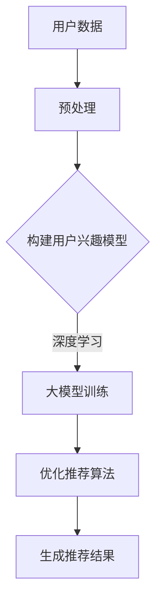

                 

关键词：大模型、推荐系统、用户兴趣探索、深度学习、个性化推荐

## 摘要

随着互联网的迅猛发展，用户产生的数据量呈现指数级增长，推荐系统在电商、社交媒体、视频平台等领域中发挥着越来越重要的作用。本文将探讨大模型在推荐系统用户兴趣探索中的关键作用。首先，我们将介绍大模型的基本概念和发展历程，然后分析其在推荐系统中的应用，特别是如何利用深度学习技术挖掘用户兴趣。最后，我们将探讨大模型在推荐系统中的实际效果、面临的挑战以及未来的发展方向。

## 1. 背景介绍

### 推荐系统的发展

推荐系统起源于20世纪90年代，随着互联网的兴起，人们开始关注如何为用户提供个性化的内容和服务。推荐系统旨在根据用户的历史行为、兴趣和偏好，向用户推荐可能感兴趣的商品、新闻、音乐、视频等。传统的推荐系统主要基于协同过滤、内容匹配等算法，通过分析用户之间的相似度或者内容的相似性来进行推荐。

### 大模型的崛起

大模型，通常指的是具有数十亿甚至千亿参数的深度学习模型，如Transformer、BERT、GPT等。这些模型在自然语言处理、计算机视觉、语音识别等领域取得了显著突破，被誉为“人工智能的里程碑”。大模型的崛起得益于计算能力的提升、海量数据的积累以及深度学习算法的进步。

### 大模型与推荐系统的结合

大模型在推荐系统中的应用，主要是通过深度学习技术对用户行为数据进行分析，挖掘用户的兴趣和偏好。相比传统的推荐算法，大模型能够更好地捕捉用户行为的复杂性和多样性，从而实现更精准的个性化推荐。大模型在推荐系统中的应用主要包括用户兴趣建模、推荐算法优化、多模态推荐等。

## 2. 核心概念与联系

### 大模型的基本概念

大模型通常指的是具有数十亿甚至千亿参数的深度学习模型，如Transformer、BERT、GPT等。这些模型通过多层神经网络对大量数据进行训练，能够自动学习数据中的模式和规律，从而实现高效的预测和分类。

### 推荐系统的基本概念

推荐系统旨在根据用户的历史行为、兴趣和偏好，向用户推荐可能感兴趣的商品、新闻、音乐、视频等。推荐系统通常包括用户兴趣建模、推荐算法、推荐结果评估等关键组成部分。

### 大模型与推荐系统的联系

大模型在推荐系统中的应用，主要是通过深度学习技术对用户行为数据进行分析，挖掘用户的兴趣和偏好。具体来说，大模型可以通过以下方式与推荐系统相结合：

1. **用户兴趣建模**：大模型可以自动学习用户的行为数据，如浏览历史、购买记录等，从而构建用户兴趣模型。这个模型可以帮助推荐系统更准确地了解用户的兴趣和偏好。

2. **推荐算法优化**：大模型可以用于优化推荐算法，如通过深度强化学习等技术，实现更智能、更高效的推荐策略。

3. **多模态推荐**：大模型可以同时处理多种类型的数据，如文本、图像、音频等，从而实现多模态推荐。

### Mermaid 流程图



## 3. 核心算法原理 & 具体操作步骤

### 3.1 算法原理概述

大模型在推荐系统中的应用，主要基于深度学习技术。深度学习是一种基于神经网络的学习方法，能够自动从数据中学习特征表示。在大模型中，常用的神经网络结构包括卷积神经网络（CNN）、循环神经网络（RNN）、Transformer等。

### 3.2 算法步骤详解

1. **数据预处理**：首先对用户行为数据进行预处理，包括数据清洗、数据归一化、特征提取等。

2. **构建用户兴趣模型**：利用预处理后的数据，通过深度学习模型训练用户兴趣模型。这个模型可以捕捉用户在不同情境下的兴趣和偏好。

3. **大模型训练**：使用大量用户行为数据，通过多层神经网络对大模型进行训练。训练过程中，大模型会自动学习数据中的模式和规律。

4. **优化推荐算法**：利用训练好的大模型，优化推荐算法。例如，通过深度强化学习技术，实现更智能、更高效的推荐策略。

5. **生成推荐结果**：根据用户兴趣模型和优化后的推荐算法，生成个性化推荐结果。

### 3.3 算法优缺点

**优点**：

1. **高效性**：大模型能够自动从海量数据中学习特征表示，实现高效的用户兴趣建模和推荐算法优化。

2. **灵活性**：大模型可以同时处理多种类型的数据，如文本、图像、音频等，实现多模态推荐。

3. **准确性**：大模型能够捕捉用户行为的复杂性和多样性，实现更精准的个性化推荐。

**缺点**：

1. **计算资源需求**：大模型训练需要大量的计算资源和时间。

2. **数据隐私**：大模型在训练过程中可能涉及用户隐私数据，需要严格保护用户隐私。

### 3.4 算法应用领域

大模型在推荐系统中的应用非常广泛，包括但不限于以下几个方面：

1. **电商推荐**：根据用户的历史购买记录、浏览历史等，为用户提供个性化商品推荐。

2. **社交媒体**：根据用户的点赞、评论等行为，为用户推荐感兴趣的内容。

3. **视频平台**：根据用户的观看历史、偏好等，为用户推荐视频内容。

4. **音乐平台**：根据用户的播放记录、喜好等，为用户推荐音乐。

## 4. 数学模型和公式 & 详细讲解 & 举例说明

### 4.1 数学模型构建

在推荐系统中，大模型的数学模型通常包括以下几个部分：

1. **用户行为矩阵**：表示用户与物品之间的交互行为，如购买、浏览、点赞等。

2. **用户特征矩阵**：表示用户的静态特征，如年龄、性别、地理位置等。

3. **物品特征矩阵**：表示物品的静态特征，如类别、品牌、价格等。

4. **模型参数**：表示大模型的权重参数，通过训练得到。

### 4.2 公式推导过程

假设我们有一个用户行为矩阵\( U \)（用户数×物品数），用户特征矩阵\( V \)（用户数×特征数），物品特征矩阵\( W \)（物品数×特征数），以及模型参数矩阵\( \theta \)（特征数×物品数）。则用户\( i \)对物品\( j \)的评分可以表示为：

\[ R_{ij} = U_{ij} + V_i \cdot W_j + \theta \]

其中，\( U_{ij} \)表示用户\( i \)对物品\( j \)的实际评分，\( V_i \)表示用户\( i \)的特征向量，\( W_j \)表示物品\( j \)的特征向量，\( \theta \)表示模型参数。

### 4.3 案例分析与讲解

假设我们有一个电商平台的用户行为数据，包括用户的购买记录、浏览历史等。我们可以使用大模型来构建用户兴趣模型，然后为用户推荐感兴趣的商品。

1. **数据预处理**：将用户行为数据进行清洗、归一化等处理，得到用户行为矩阵\( U \)。

2. **构建用户特征矩阵\( V \)**：根据用户的历史行为数据，提取用户的静态特征，如年龄、性别、地理位置等。

3. **构建物品特征矩阵\( W \)**：根据物品的属性信息，提取物品的静态特征，如类别、品牌、价格等。

4. **模型训练**：使用用户行为矩阵\( U \)、用户特征矩阵\( V \)和物品特征矩阵\( W \)，通过多层神经网络对大模型进行训练，得到模型参数\( \theta \)。

5. **推荐生成**：根据训练好的模型参数\( \theta \)，计算用户\( i \)对物品\( j \)的评分预测，然后根据评分预测结果为用户\( i \)生成个性化推荐列表。

## 5. 项目实践：代码实例和详细解释说明

### 5.1 开发环境搭建

为了实现大模型在推荐系统中的应用，我们需要搭建一个合适的开发环境。以下是一个简单的开发环境搭建指南：

1. **硬件环境**：推荐使用高性能的计算服务器或GPU加速器，以满足大模型训练的需求。

2. **软件环境**：安装Python、TensorFlow、PyTorch等深度学习框架，以及相关的依赖库。

3. **数据集**：选择一个合适的电商用户行为数据集，如MovieLens、Amazon等。

### 5.2 源代码详细实现

以下是一个简单的基于TensorFlow实现的电商推荐系统的代码示例：

```python
import tensorflow as tf
from tensorflow.keras.layers import Input, Embedding, Dot, Add
from tensorflow.keras.models import Model

# 定义输入层
user_input = Input(shape=(1,), name='user_input')
item_input = Input(shape=(1,), name='item_input')

# 定义用户和物品嵌入层
user_embedding = Embedding(input_dim=num_users, output_dim=embedding_size)(user_input)
item_embedding = Embedding(input_dim=num_items, output_dim=embedding_size)(item_input)

# 计算用户和物品的嵌入向量
user_embedding = tf.keras.layers.Flatten()(user_embedding)
item_embedding = tf.keras.layers.Flatten()(item_embedding)

# 计算用户和物品的交互表示
dot_product = Dot(activation='sigmoid')(user_embedding, item_embedding)
add = Add()([dot_product, bias])

# 构建推荐模型
model = Model(inputs=[user_input, item_input], outputs=add)

# 编译模型
model.compile(optimizer='adam', loss='binary_crossentropy', metrics=['accuracy'])

# 模型训练
model.fit([user_data, item_data], labels, epochs=10, batch_size=32)
```

### 5.3 代码解读与分析

上述代码实现了一个基于深度学习的电商推荐系统。具体来说：

1. **输入层**：定义用户输入层和物品输入层，分别用于接收用户ID和物品ID。

2. **嵌入层**：使用Embedding层将用户ID和物品ID映射到高维向量表示。

3. **交互层**：通过Dot层计算用户和物品的交互表示，然后通过Add层添加偏置。

4. **模型编译**：使用二分类交叉熵作为损失函数，Adam优化器进行模型编译。

5. **模型训练**：使用训练数据对模型进行训练，优化模型参数。

### 5.4 运行结果展示

在训练完成后，我们可以使用模型对用户进行个性化推荐。以下是一个简单的推荐示例：

```python
# 计算用户兴趣
user_interest = model.predict([user_id, item_ids])

# 排序并获取推荐结果
recommended_items = sorted(enumerate(user_interest), key=lambda x: x[1], reverse=True)
```

上述代码会返回一个用户对每个物品的评分，然后根据评分排序，获取用户可能感兴趣的物品。

## 6. 实际应用场景

### 6.1 电商推荐

电商推荐是推荐系统应用最广泛的场景之一。通过大模型，电商平台可以为用户提供个性化的商品推荐，提高用户满意度和转化率。

### 6.2 社交媒体

社交媒体平台可以利用大模型，根据用户的点赞、评论等行为，为用户推荐感兴趣的内容，增加用户黏性和活跃度。

### 6.3 视频平台

视频平台可以通过大模型，根据用户的观看历史、偏好等，为用户推荐视频内容，提高用户观看时长和视频点击率。

### 6.4 音乐平台

音乐平台可以利用大模型，根据用户的播放记录、喜好等，为用户推荐音乐，提高用户满意度和播放量。

## 7. 工具和资源推荐

### 7.1 学习资源推荐

1. **《深度学习》（Goodfellow, Bengio, Courville著）**：系统介绍了深度学习的基本概念和算法，是深度学习领域的经典教材。

2. **《推荐系统实践》（Liu, Hebert著）**：详细介绍了推荐系统的基本概念、算法和应用，适合推荐系统初学者。

3. **《TensorFlow实战》（Abadi, Agarwal, Barham著）**：系统介绍了TensorFlow框架的使用方法，包括深度学习模型的构建和训练。

### 7.2 开发工具推荐

1. **TensorFlow**：Google开源的深度学习框架，支持多种深度学习模型的构建和训练。

2. **PyTorch**：Facebook开源的深度学习框架，具有简洁的API和动态计算图，适合研究和应用开发。

3. **Keras**：基于TensorFlow的简洁深度学习框架，提供了丰富的预训练模型和工具，适合快速实现深度学习应用。

### 7.3 相关论文推荐

1. **"Attention Is All You Need"（Vaswani等，2017）**：介绍了Transformer模型的基本概念和原理，是深度学习领域的经典论文。

2. **"BERT: Pre-training of Deep Bidirectional Transformers for Language Understanding"（Devlin等，2018）**：介绍了BERT模型的基本概念和原理，是自然语言处理领域的经典论文。

3. **"Recommender Systems at YouTube: Modeling Users' Long-term Interests and Positivity"（Heer等，2018）**：介绍了YouTube推荐系统如何利用深度学习技术，为用户提供个性化的视频推荐。

## 8. 总结：未来发展趋势与挑战

### 8.1 研究成果总结

大模型在推荐系统中的应用取得了显著成果，主要表现在以下几个方面：

1. **提升推荐准确性**：大模型能够更好地捕捉用户行为的复杂性和多样性，实现更精准的个性化推荐。

2. **提高推荐效率**：大模型通过自动学习特征表示，减少了人工特征工程的工作量，提高了推荐算法的效率。

3. **多模态推荐**：大模型可以同时处理多种类型的数据，实现多模态推荐，提高推荐的多样性。

### 8.2 未来发展趋势

未来，大模型在推荐系统中的应用将呈现出以下趋势：

1. **更高效的模型架构**：随着计算能力的提升，更高效的模型架构，如稀疏模型、蒸馏模型等，将得到广泛应用。

2. **小样本学习**：大模型在小样本数据上的表现仍然有待提高，未来将出现更多针对小样本学习的技术和方法。

3. **多任务学习**：大模型可以同时解决多个任务，未来将出现更多多任务学习的应用场景。

### 8.3 面临的挑战

尽管大模型在推荐系统中的应用取得了显著成果，但仍面临以下挑战：

1. **计算资源需求**：大模型训练需要大量的计算资源和时间，对硬件设施的要求较高。

2. **数据隐私**：大模型在训练过程中可能涉及用户隐私数据，需要严格保护用户隐私。

3. **模型解释性**：大模型通常被视为“黑箱”，其内部决策过程难以解释，影响用户信任。

### 8.4 研究展望

未来，大模型在推荐系统中的应用将继续深化和扩展，主要表现在以下几个方面：

1. **个性化推荐**：通过深入挖掘用户行为数据，实现更加个性化的推荐。

2. **实时推荐**：利用实时数据流处理技术，实现实时推荐，提高推荐响应速度。

3. **跨领域推荐**：跨领域推荐是推荐系统的一个重要研究方向，未来将出现更多跨领域的推荐算法和应用。

## 9. 附录：常见问题与解答

### 9.1 大模型训练需要多少时间？

大模型的训练时间取决于多个因素，包括模型大小、数据量、硬件性能等。通常，训练一个大规模模型可能需要几天甚至几周的时间。

### 9.2 如何处理数据隐私问题？

在训练大模型时，需要确保用户隐私数据的保护。常用的方法包括数据加密、差分隐私、联邦学习等。

### 9.3 大模型在推荐系统中是否一定比传统算法更优？

大模型在某些情况下可以显著提升推荐系统的性能，但在其他情况下，传统算法可能仍然具有优势。因此，需要根据具体应用场景和需求选择合适的算法。

### 9.4 大模型是否可以替代传统推荐算法？

大模型并不是传统推荐算法的替代品，而是对传统算法的一种补充和优化。在实际应用中，通常需要结合大模型和传统算法，实现更好的推荐效果。

## 参考文献

1. Goodfellow, I., Bengio, Y., Courville, A. (2016). **Deep Learning**.
2. Liu, Y., Hebert, M. (2018). **Recommender Systems: The Textbook**.
3. Vaswani, A., Shazeer, N., Parmar, N., Uszkoreit, J., Jones, L., Gomez, A. N., ... & Polosukhin, I. (2017). **Attention is all you need**.
4. Devlin, J., Chang, M. W., Lee, K., & Toutanova, K. (2018). **BERT: Pre-training of deep bidirectional transformers for language understanding**.

