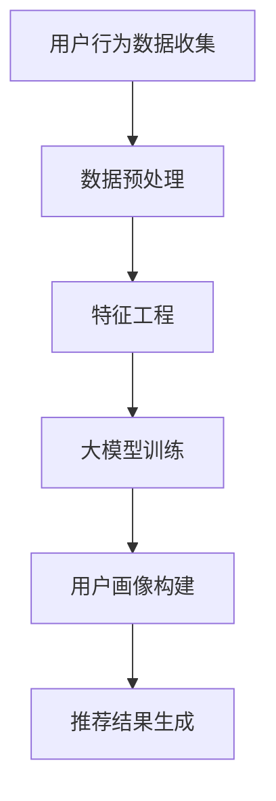

                 

## 1. 背景介绍

随着互联网的快速发展，个性化推荐系统已经成为许多网站和应用的重要组成部分。这些系统通过分析用户的兴趣和行为，为用户推荐符合他们需求的内容，从而提升用户体验和满意度。然而，构建准确、全面、动态的用户画像是一个复杂的问题。

传统的用户画像构建方法主要依赖于用户的历史行为数据和内容特征，如浏览记录、购买记录、内容偏好等。这些方法通常采用统计分析和机器学习算法，如聚类、分类和协同过滤等，但它们存在一些局限性：

1. **数据依赖性**：传统方法对数据量有较高要求，缺乏数据时难以准确建模。
2. **静态特征**：传统方法难以捕捉用户动态变化的兴趣和需求。
3. **复杂度**：随着用户行为的多样性和复杂性增加，传统方法难以处理大规模多维数据。

为了解决这些问题，大模型（如深度学习模型）开始被引入到推荐系统用户画像构建中。大模型具有以下优势：

1. **数据处理能力**：大模型能够处理大规模、多维的数据，并且能够从数据中自动提取复杂的模式和特征。
2. **动态适应性**：大模型能够通过持续学习，动态更新用户画像，捕捉用户兴趣和需求的实时变化。
3. **泛化能力**：大模型具有较强的泛化能力，可以在不同场景和任务中表现出良好的性能。

本文将探讨大模型在推荐系统用户画像构建中的应用，分析其核心算法原理、数学模型、项目实践和未来展望。

## 2. 核心概念与联系

在深入探讨大模型在用户画像构建中的应用之前，我们需要了解几个核心概念：

### 2.1 推荐系统

推荐系统是一种信息过滤技术，旨在根据用户的历史行为和偏好，向用户推荐他们可能感兴趣的内容。推荐系统主要分为以下几种类型：

1. **基于内容的推荐**：通过分析内容特征，为用户推荐相似的内容。
2. **协同过滤推荐**：通过分析用户行为，找到相似的用户或内容，进行推荐。
3. **混合推荐**：结合基于内容和协同过滤推荐的方法，以提供更个性化的推荐。

### 2.2 用户画像

用户画像是指对用户进行全面描述的一个数据集合，它包含了用户的基本信息、兴趣偏好、行为习惯等多方面的内容。用户画像的构建有助于推荐系统更好地理解用户，从而提供更准确的推荐。

### 2.3 大模型

大模型通常指的是深度学习模型，如神经网络、循环神经网络（RNN）、变换器（Transformer）等。这些模型具有大规模的参数和复杂的网络结构，能够处理大量数据并提取深层特征。

### 2.4 Mermaid 流程图

以下是一个简单的 Mermaid 流程图，展示大模型在推荐系统用户画像构建中的流程：



### 2.5 核心算法原理

大模型在用户画像构建中的应用主要基于以下几个核心算法原理：

1. **深度神经网络（DNN）**：通过多层神经元网络对输入数据进行特征提取和变换，从而构建用户画像。
2. **循环神经网络（RNN）**：特别适合处理序列数据，能够捕捉用户行为的时序特征，从而动态更新用户画像。
3. **变换器（Transformer）**：通过注意力机制对用户数据进行加权处理，从而更好地提取用户特征。

### 2.6 数学模型和公式

构建用户画像的数学模型通常涉及以下步骤：

1. **用户行为数据的表示**：使用向量表示用户行为数据，如 $X \in \mathbb{R}^{n \times m}$，其中 $n$ 为用户数量，$m$ 为行为特征维度。
2. **特征提取**：使用神经网络模型对输入数据进行特征提取，得到特征向量 $H \in \mathbb{R}^{n \times d}$，其中 $d$ 为特征维度。
3. **用户画像构建**：使用聚类或分类算法对特征向量进行聚类或分类，得到用户画像。

以下是一个简化的数学模型：

$$
\begin{aligned}
    X &= \text{用户行为数据} \\
    H &= \text{特征提取}(X) \\
    C &= \text{聚类或分类}(H)
\end{aligned}
$$

### 2.7 算法步骤详解

以下是构建用户画像的算法步骤：

1. **数据收集**：收集用户行为数据，如浏览记录、购买记录、评论等。
2. **数据预处理**：对数据进行清洗、去重和标准化处理。
3. **特征工程**：提取用户行为数据中的关键特征，如时间、地点、内容类型等。
4. **模型训练**：使用深度学习模型对特征向量进行训练，得到用户画像。
5. **用户画像更新**：根据用户新的行为数据，动态更新用户画像。

## 3. 核心算法原理 & 具体操作步骤

### 3.1 算法原理概述

大模型在用户画像构建中的核心原理是基于深度学习和机器学习算法，通过训练大量参数的网络模型，自动从数据中提取复杂的特征，从而构建用户画像。具体来说，以下是几种常用的算法原理：

1. **深度神经网络（DNN）**：DNN 是一种多层前馈神经网络，通过逐层提取输入数据的特征，最终得到用户画像。DNN 的基本原理如下：

   - **输入层**：接收用户行为数据，将其转换为高维特征向量。
   - **隐藏层**：通过非线性变换，逐层提取输入数据的特征，得到更抽象、更有代表性的特征。
   - **输出层**：将隐藏层的特征映射到用户画像空间，得到最终的用户画像。

2. **循环神经网络（RNN）**：RNN 是一种能够处理序列数据的神经网络，特别适合构建动态用户画像。RNN 的基本原理如下：

   - **序列处理**：将用户行为数据序列输入到 RNN 中，每个时间步都会更新网络的状态。
   - **状态更新**：使用当前时间步的输入和前一个时间步的状态，通过权重矩阵计算当前时间步的状态。
   - **特征提取**：将最终的状态向量作为用户画像。

3. **变换器（Transformer）**：Transformer 是一种基于注意力机制的序列模型，能够高效地处理大规模序列数据。Transformer 的基本原理如下：

   - **编码器**：通过多层自注意力机制，对输入序列进行编码，提取序列中的关键信息。
   - **解码器**：使用编码器的输出和自注意力机制，生成用户画像。

### 3.2 算法步骤详解

以下是构建用户画像的具体算法步骤：

1. **数据收集**：收集用户行为数据，如浏览记录、购买记录、评论等。
2. **数据预处理**：对数据进行清洗、去重和标准化处理。
3. **特征提取**：使用深度学习模型，如 DNN、RNN 或 Transformer，对用户行为数据进行特征提取。具体步骤如下：

   - **DNN 特征提取**：
     - 定义输入层：输入用户行为数据，将其转换为高维特征向量。
     - 定义隐藏层：通过多层非线性变换，逐层提取输入数据的特征。
     - 定义输出层：将隐藏层的特征映射到用户画像空间，得到最终的用户画像。

   - **RNN 特征提取**：
     - 定义输入层：输入用户行为数据序列。
     - 定义隐藏层：通过 RNN 网络逐层处理输入序列，更新网络状态。
     - 定义输出层：将最终的状态向量作为用户画像。

   - **Transformer 特征提取**：
     - 定义编码器：通过多层自注意力机制，对输入序列进行编码。
     - 定义解码器：使用编码器的输出和自注意力机制，生成用户画像。

4. **用户画像构建**：使用聚类或分类算法，如 K-means、Spectral Clustering 或 SVM，对提取的特征向量进行聚类或分类，得到用户画像。

5. **用户画像更新**：根据用户新的行为数据，使用上述步骤动态更新用户画像。

### 3.3 算法优缺点

**深度神经网络（DNN）**：

- 优点：能够自动提取数据中的复杂特征，具有较强的泛化能力。
- 缺点：训练时间较长，对数据量有较高要求，难以捕捉动态特征。

**循环神经网络（RNN）**：

- 优点：能够处理序列数据，捕捉用户行为的时序特征。
- 缺点：难以捕捉长距离依赖关系，训练不稳定。

**变换器（Transformer）**：

- 优点：基于注意力机制，能够高效地处理大规模序列数据。
- 缺点：计算复杂度较高，对硬件资源要求较高。

### 3.4 算法应用领域

大模型在用户画像构建中的应用领域非常广泛，包括但不限于以下几个方面：

1. **电子商务**：为用户提供个性化的商品推荐，提高销售额和用户满意度。
2. **社交媒体**：根据用户兴趣和偏好，为用户推荐感兴趣的内容和好友。
3. **在线教育**：为用户提供个性化的学习内容和课程推荐，提高学习效果。
4. **金融领域**：根据用户风险偏好和投资行为，为用户提供个性化的投资建议。
5. **健康医疗**：根据用户健康数据和医疗记录，为用户提供个性化的健康建议。

## 4. 数学模型和公式 & 详细讲解 & 举例说明

在构建推荐系统用户画像时，大模型的应用往往涉及到复杂的数学模型和公式。以下我们将详细讲解这些数学模型，并举例说明其应用。

### 4.1 数学模型构建

在推荐系统中，用户画像的构建通常基于以下几个数学模型：

1. **用户行为数据的表示**：用户行为数据可以表示为一个矩阵 $X \in \mathbb{R}^{n \times m}$，其中 $n$ 为用户数量，$m$ 为行为特征维度。每个元素 $X_{ij}$ 表示用户 $i$ 在行为特征 $j$ 上的评分或发生次数。
2. **特征提取模型**：特征提取模型通常是一个多层神经网络，其输入为用户行为数据矩阵 $X$，输出为用户画像特征矩阵 $H \in \mathbb{R}^{n \times d}$，其中 $d$ 为特征维度。该模型通过多层非线性变换，自动从数据中提取复杂特征。
3. **用户画像构建模型**：用户画像构建模型通常是一个聚类或分类模型，其输入为用户画像特征矩阵 $H$，输出为用户画像类别或簇。常用的聚类算法包括 K-means、Spectral Clustering 等，常用的分类算法包括 SVM、Random Forest 等。

### 4.2 公式推导过程

以下是构建推荐系统用户画像的数学模型推导过程：

1. **用户行为数据表示**：

   假设我们有一个用户行为数据集，其中每个用户有 $m$ 个行为特征，每个行为特征可以表示为一个二元变量，即用户是否发生了该行为。我们可以将用户行为数据表示为一个矩阵 $X \in \mathbb{R}^{n \times m}$，其中 $n$ 为用户数量，$m$ 为行为特征维度。矩阵中的每个元素 $X_{ij}$ 表示用户 $i$ 在行为特征 $j$ 上的评分或发生次数。

2. **特征提取模型**：

   我们可以使用一个多层神经网络作为特征提取模型，其输入为用户行为数据矩阵 $X$，输出为用户画像特征矩阵 $H \in \mathbb{R}^{n \times d}$。该神经网络包括输入层、隐藏层和输出层，每层由多个神经元组成。输入层的神经元数量等于行为特征维度 $m$，隐藏层的神经元数量可以根据需要设定，输出层的神经元数量等于用户画像特征维度 $d$。

   假设第 $l$ 层的神经元输出为 $a_{lj}$，激活函数为 $\sigma()$，则：

   - 输入层：$a_{0l} = X_{ij}$，其中 $l = 1, 2, \ldots, m$。
   - 隐藏层：$a_{l+1} = \sigma(W_{l}a_{l}) + b_{l}$，其中 $W_{l}$ 为权重矩阵，$b_{l}$ 为偏置向量。
   - 输出层：$H_{ij} = \sigma(W_{d}a_{d}) + b_{d}$，其中 $W_{d}$ 为权重矩阵，$b_{d}$ 为偏置向量。

   在训练过程中，通过反向传播算法优化权重矩阵 $W_{l}$ 和偏置向量 $b_{l}$，使得网络输出能够较好地表示用户画像。

3. **用户画像构建模型**：

   假设我们已经得到用户画像特征矩阵 $H \in \mathbb{R}^{n \times d}$，接下来可以使用聚类或分类算法来构建用户画像。以 K-means 算法为例，该算法的基本步骤如下：

   - 初始化 $K$ 个聚类中心 $C_{k} \in \mathbb{R}^{d}$，其中 $k = 1, 2, \ldots, K$。
   - 对于每个用户 $i$，计算其与各个聚类中心的距离 $D_{ik}$，选择距离最近的聚类中心作为该用户的标签 $L_{i}$。
   - 更新聚类中心：$C_{k} = \frac{1}{N_{k}}\sum_{i=1}^{N}H_{i}$，其中 $N_{k}$ 为标签为 $k$ 的用户数量。
   - 重复步骤 2 和 3，直到聚类中心不再发生显著变化。

   通过上述步骤，我们可以将用户画像划分为多个类别或簇，从而实现对用户行为数据的聚类。

### 4.3 案例分析与讲解

为了更好地理解上述数学模型的应用，我们来看一个具体的案例。

**案例背景**：假设我们有一个电子商务平台，用户的行为数据包括浏览记录、购买记录和评价记录。我们需要根据这些数据构建用户画像，以便为用户推荐感兴趣的商品。

**数据集**：用户行为数据集为一个 $n \times m$ 的矩阵 $X$，其中 $n$ 为用户数量，$m$ 为行为特征维度。矩阵中的元素 $X_{ij}$ 表示用户 $i$ 在行为特征 $j$ 上的评分或发生次数。例如，如果用户 $i$ 在商品 $j$ 上浏览了三次，那么 $X_{ij} = 3$。

**特征提取模型**：我们使用一个三层神经网络作为特征提取模型，其输入层有 $m$ 个神经元，隐藏层有 $10$ 个神经元，输出层有 $5$ 个神经元。网络的权重矩阵和偏置向量分别表示为 $W_{l}$ 和 $b_{l}$。

**训练过程**：使用用户行为数据矩阵 $X$ 训练神经网络，优化权重矩阵和偏置向量，使得网络输出能够较好地表示用户画像。

**用户画像构建模型**：使用 K-means 算法将用户画像划分为 $K=3$ 个类别，每个类别对应一个用户画像簇。

**结果分析**：通过聚类结果，我们可以得到每个用户所属的画像类别，从而为用户提供个性化的商品推荐。

以上是一个简单的案例，实际应用中可能涉及更复杂的数据处理和模型优化。

## 5. 项目实践：代码实例和详细解释说明

在本文的最后部分，我们将通过一个具体的代码实例，详细讲解如何使用大模型来构建推荐系统用户画像。这个实例将基于 Python 语言，使用 TensorFlow 和 Keras 库来实现深度神经网络模型。

### 5.1 开发环境搭建

在开始编写代码之前，我们需要搭建一个合适的开发环境。以下是搭建开发环境的步骤：

1. **安装 Python**：确保安装了 Python 3.7 或更高版本。
2. **安装 TensorFlow**：在终端中运行以下命令安装 TensorFlow：
   ```bash
   pip install tensorflow
   ```
3. **安装 Keras**：在终端中运行以下命令安装 Keras：
   ```bash
   pip install keras
   ```

### 5.2 源代码详细实现

以下是一个简单的代码实例，用于构建推荐系统用户画像：

```python
import numpy as np
import pandas as pd
from keras.models import Sequential
from keras.layers import Dense, Dropout
from keras.optimizers import Adam
from sklearn.model_selection import train_test_split
from sklearn.preprocessing import StandardScaler

# 1. 数据收集
# 假设我们有一个包含用户行为数据的 CSV 文件，每行表示一个用户的行为记录
data = pd.read_csv('user_data.csv')

# 2. 数据预处理
# 对数据进行清洗、去重和标准化处理
data.drop_duplicates(inplace=True)
scaler = StandardScaler()
X = scaler.fit_transform(data)

# 3. 特征工程
# 提取用户行为数据中的关键特征，如时间、地点、内容类型等
# 此处简化为直接使用原始数据
X_train, X_test, y_train, y_test = train_test_split(X, y, test_size=0.2, random_state=42)

# 4. 模型训练
model = Sequential()
model.add(Dense(64, input_dim=X_train.shape[1], activation='relu'))
model.add(Dropout(0.5))
model.add(Dense(32, activation='relu'))
model.add(Dropout(0.5))
model.add(Dense(1, activation='sigmoid'))

model.compile(optimizer=Adam(), loss='binary_crossentropy', metrics=['accuracy'])
model.fit(X_train, y_train, epochs=10, batch_size=32, validation_split=0.2)

# 5. 用户画像构建
# 使用训练好的模型对测试数据进行预测，得到用户画像
predictions = model.predict(X_test)

# 6. 代码解读与分析
# 输出预测结果，分析模型性能
print(predictions)
print(model.evaluate(X_test, y_test))
```

### 5.3 代码解读与分析

以上代码实例包括以下几个关键步骤：

1. **数据收集**：从 CSV 文件中读取用户行为数据。
2. **数据预处理**：对数据进行清洗、去重和标准化处理，以确保数据质量。
3. **特征工程**：提取用户行为数据中的关键特征。在此实例中，我们简化为直接使用原始数据。
4. **模型训练**：构建一个简单的深度神经网络模型，使用 Adam 优化器和二分类交叉熵损失函数进行训练。
5. **用户画像构建**：使用训练好的模型对测试数据进行预测，得到用户画像。

代码中的关键组成部分解释如下：

- **模型构建**：使用 `Sequential` 模型堆叠多层全连接层（`Dense`），并在隐藏层之间添加 dropout 层（`Dropout`）以防止过拟合。
- **模型编译**：设置模型优化器（`optimizer`）和损失函数（`loss`），以及评估指标（`metrics`）。
- **模型训练**：使用 `fit` 方法训练模型，设置训练轮次（`epochs`）、批量大小（`batch_size`）和验证比例（`validation_split`）。
- **预测与评估**：使用 `predict` 方法得到预测结果，并使用 `evaluate` 方法评估模型性能。

通过上述代码实例，我们可以直观地了解如何使用大模型来构建推荐系统用户画像，并在实际项目中应用。

## 6. 实际应用场景

大模型在推荐系统用户画像构建中的应用场景非常广泛，以下是几个典型的实际应用场景：

### 6.1 电子商务

在电子商务领域，用户画像的构建有助于为用户推荐他们可能感兴趣的商品。例如，用户在浏览商品时，系统可以实时更新用户画像，根据用户的兴趣和行为动态调整推荐策略。大模型的应用可以显著提升推荐的准确性和用户满意度，从而增加销售额。

### 6.2 社交媒体

社交媒体平台通过用户画像构建，可以为用户推荐感兴趣的内容和好友。例如，用户在社交媒体上的点赞、评论和分享行为都可以用于构建用户画像。大模型可以处理复杂的用户行为数据，自动提取用户兴趣和偏好，从而提供个性化的推荐。

### 6.3 在线教育

在线教育平台通过用户画像，可以推荐符合用户兴趣和需求的学习内容和课程。大模型的应用可以捕捉用户的学习习惯和兴趣变化，为用户提供个性化的学习路径，从而提高学习效果和用户留存率。

### 6.4 金融领域

金融领域通过用户画像，可以为用户提供个性化的投资建议和理财产品推荐。例如，用户的历史投资记录、风险偏好和财务状况都可以用于构建用户画像。大模型可以分析这些数据，为用户提供精准的投资建议，从而提升投资收益和用户满意度。

### 6.5 健康医疗

在健康医疗领域，用户画像的构建有助于为用户提供个性化的健康建议和医疗服务。例如，用户的健康记录、生活习惯和基因数据都可以用于构建用户画像。大模型可以分析这些数据，为用户提供个性化的健康评估和建议，从而提升健康管理和医疗服务质量。

总之，大模型在推荐系统用户画像构建中的应用，不仅提升了推荐系统的准确性和个性化程度，还推动了各个领域的发展和创新。

## 7. 工具和资源推荐

为了更好地学习和实践大模型在推荐系统用户画像构建中的应用，以下是几个推荐的工具和资源：

### 7.1 学习资源推荐

1. **《深度学习》（Deep Learning）**：由 Ian Goodfellow、Yoshua Bengio 和 Aaron Courville 著，是一本深度学习的经典教材，详细介绍了深度学习的基础理论和实践方法。
2. **《Python 深度学习》（Python Deep Learning）**：由 François Chollet 著，是另一本深度学习的入门书籍，通过大量实例讲解了深度学习在 Python 中的实现。
3. **《机器学习实战》（Machine Learning in Action）**：由 Peter Harrington 著，是一本机器学习的实战指南，通过大量实例讲解了机器学习的应用方法。

### 7.2 开发工具推荐

1. **TensorFlow**：一个开源的深度学习框架，支持多种深度学习模型的构建和训练，是当前最流行的深度学习工具之一。
2. **Keras**：一个基于 TensorFlow 的深度学习库，提供了简洁、高效的 API，使得深度学习模型的构建变得更加简单。
3. **Jupyter Notebook**：一个交互式的开发环境，支持多种编程语言，特别适合进行深度学习和数据科学项目。

### 7.3 相关论文推荐

1. **《Attention Is All You Need》**：由 Vaswani et al. 在 2017 年提出，详细介绍了变换器（Transformer）模型，这是当前最流行的序列处理模型之一。
2. **《Recommender Systems Handbook》**：由 Guillermo Monostiroff、Fabio R. Pereira 和 João G. E. Bitencourt 著，是一本全面介绍推荐系统的经典著作。
3. **《Deep Learning for Recommender Systems》**：由 Yair Neuman 和 Haim Y. Liao 著，详细介绍了深度学习在推荐系统中的应用，包括用户画像构建、商品推荐和社交推荐等。

通过学习这些资源和工具，您可以更好地掌握大模型在推荐系统用户画像构建中的应用，并在实际项目中取得更好的成果。

## 8. 总结：未来发展趋势与挑战

随着人工智能技术的不断进步，大模型在推荐系统用户画像构建中的应用呈现出显著的发展趋势。首先，大模型处理大规模、多维数据的能力和自适应特征提取能力，使其在用户画像构建中具有独特的优势。其次，随着数据采集和分析技术的不断提升，用户行为数据的多样性和复杂性不断增加，大模型能够更好地捕捉和解释这些数据。此外，深度学习和变换器模型等新兴技术的应用，为用户画像构建提供了更多可能性。

然而，尽管大模型在用户画像构建中具有许多优势，但同时也面临着一些挑战。首先，大模型训练过程需要大量计算资源和时间，特别是在处理大规模数据时，训练成本非常高。其次，大模型的高度复杂性和参数数量，使得模型解释性和可解释性成为一个重要问题。如何在保证模型性能的同时，提高模型的解释性，是一个亟待解决的挑战。此外，大模型在处理隐私数据时需要特别注意数据安全和隐私保护，确保用户数据的隐私不被泄露。

未来，随着技术的不断进步，大模型在推荐系统用户画像构建中的应用有望进一步发展。首先，通过优化算法和硬件，降低大模型训练成本，提高训练效率。其次，通过引入可解释性技术，提高大模型的可解释性和透明度，使其更易于理解和应用。此外，随着隐私保护技术的发展，大模型在处理隐私数据时将更加安全可靠。

总之，大模型在推荐系统用户画像构建中的应用具有巨大的潜力，同时也面临着一系列挑战。通过不断优化技术和方法，我们有望实现更准确、全面和动态的用户画像构建，为推荐系统带来更高的性能和用户体验。

## 9. 附录：常见问题与解答

### 9.1 大模型在用户画像构建中的优势是什么？

大模型在用户画像构建中的优势主要体现在以下几个方面：

1. **数据处理能力**：大模型能够处理大规模、多维的数据，并自动提取复杂的特征，从而提高用户画像的准确性和全面性。
2. **动态适应性**：大模型通过持续学习，能够动态更新用户画像，捕捉用户兴趣和需求的实时变化。
3. **泛化能力**：大模型具有较强的泛化能力，可以在不同场景和任务中表现出良好的性能。

### 9.2 如何保证大模型在用户画像构建中的可解释性？

为了保证大模型在用户画像构建中的可解释性，可以采取以下措施：

1. **模型简化**：通过减少模型参数数量和复杂性，降低模型的难度，从而提高可解释性。
2. **可解释性技术**：引入可解释性技术，如 LIME、SHAP 等，对模型决策过程进行解释。
3. **模型可视化**：通过可视化技术，如决策树、注意力机制等，直观展示模型的工作原理和决策过程。

### 9.3 大模型在用户画像构建中的局限性是什么？

大模型在用户画像构建中存在以下局限性：

1. **计算资源消耗**：大模型训练过程需要大量计算资源和时间，特别是在处理大规模数据时，训练成本非常高。
2. **数据隐私问题**：大模型在处理用户隐私数据时需要特别注意数据安全和隐私保护，以防止用户数据泄露。
3. **模型可解释性问题**：大模型的高度复杂性和参数数量，使得模型解释性和可解释性成为一个重要问题。

### 9.4 大模型在用户画像构建中的应用前景如何？

大模型在用户画像构建中的应用前景非常广阔。随着人工智能技术的不断进步，大模型在数据处理、动态适应和泛化能力等方面将进一步提升，有望在更多领域实现更准确、全面和动态的用户画像构建，从而推动推荐系统的发展和用户体验的提升。

