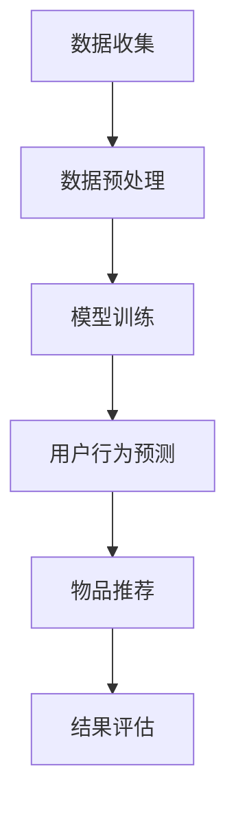

                 

关键字：大模型，推荐系统，用户行为预测，人工智能，机器学习，深度学习，算法，数学模型，实践案例

## 摘要

本文将深入探讨大模型在推荐系统用户行为预测中的重要作用。随着互联网和社交媒体的迅速发展，用户生成和行为数据呈爆炸式增长，为个性化推荐系统的研究和应用提供了丰富的数据资源。大模型，特别是基于深度学习的模型，凭借其强大的数据处理和分析能力，成为了推荐系统领域的关键技术。本文将首先介绍推荐系统的基本概念和传统方法，然后详细阐述大模型在用户行为预测中的优势和应用，通过数学模型和具体案例，分析大模型在推荐系统中的实际应用效果，并提出未来发展的趋势和面临的挑战。

## 1. 背景介绍

推荐系统作为一种信息过滤和个性化服务的技术，旨在根据用户的历史行为和偏好，向其推荐相关的内容和服务。推荐系统在电子商务、社交媒体、在线新闻、视频网站等众多领域都发挥着重要作用。用户在互联网上的活动产生了海量的数据，这些数据不仅包括用户的基本信息，还涵盖了用户的浏览记录、购买历史、评论、社交互动等丰富信息。如何有效地利用这些数据，提高推荐的准确性和用户满意度，是推荐系统研究的热点问题。

传统的推荐系统主要采用基于内容过滤和协同过滤的方法。基于内容过滤的方法通过分析物品的特征和用户的历史行为，计算用户对物品的兴趣度，从而进行推荐。协同过滤方法则通过分析用户之间的相似度，基于其他用户的评分或行为进行推荐。然而，这些传统方法在处理大规模数据和复杂用户行为时存在一定的局限性。

近年来，随着深度学习技术的快速发展，大模型在推荐系统中的应用逐渐成为研究热点。大模型，如深度神经网络，具有强大的表示和学习能力，能够自动提取高维数据中的复杂特征，并在各种复杂场景下表现出优异的性能。大模型的应用为推荐系统带来了新的机遇和挑战。

## 2. 核心概念与联系

### 2.1 推荐系统基本概念

推荐系统主要包括以下几个核心概念：

1. **用户**：推荐系统服务的主体，具有特定的兴趣和偏好。
2. **物品**：用户可能感兴趣的对象，如商品、新闻、音乐等。
3. **评分**：用户对物品的评价或偏好程度，可以是数值评分，也可以是标签或类别。
4. **推荐算法**：根据用户的历史行为和偏好，为用户推荐相关物品的方法。

### 2.2 大模型基本原理

大模型，通常指的是具有大量参数和层次的深度神经网络。其基本原理包括：

1. **自动特征提取**：大模型通过多层神经网络的结构，自动学习并提取高维数据中的复杂特征。
2. **端到端学习**：大模型能够直接从原始数据中学习到最终的预测结果，无需人工设计复杂的中间特征。
3. **大规模训练**：大模型利用大规模数据集进行训练，以获得更好的泛化能力。

### 2.3 大模型在推荐系统中的应用

大模型在推荐系统中的应用主要包括以下几个方面：

1. **用户行为预测**：通过分析用户的历史行为数据，预测用户对未知物品的兴趣度。
2. **物品推荐**：基于用户行为预测结果，为用户推荐相关的物品。
3. **交叉域推荐**：利用跨域数据，实现不同领域物品的推荐。

### 2.4 Mermaid 流程图

下面是一个简单的Mermaid流程图，展示了大模型在推荐系统中的应用流程：



## 3. 核心算法原理 & 具体操作步骤

### 3.1 算法原理概述

大模型在推荐系统中的应用主要基于深度学习技术。深度学习模型通过多层神经网络结构，学习数据中的复杂特征和关联关系。具体而言，大模型在推荐系统中的算法原理包括：

1. **用户表示**：将用户的历史行为数据输入到模型中，学习用户的兴趣向量。
2. **物品表示**：将物品的特征信息输入到模型中，学习物品的特征向量。
3. **交互表示**：通过模型计算用户和物品之间的交互特征，用于预测用户对物品的兴趣度。
4. **预测与推荐**：基于用户和物品的交互特征，预测用户对未知物品的兴趣度，并进行推荐。

### 3.2 算法步骤详解

1. **数据收集**：收集用户的行为数据，如浏览记录、购买历史、评论等。
2. **数据预处理**：对原始数据进行清洗和归一化处理，提取用户和物品的特征。
3. **模型训练**：使用训练数据，初始化模型参数，通过反向传播算法进行优化。
4. **用户行为预测**：将用户和物品的交互数据输入到模型中，预测用户对物品的兴趣度。
5. **物品推荐**：根据用户行为预测结果，为用户推荐相关物品。
6. **结果评估**：使用评估指标（如准确率、召回率、F1值等）评估推荐效果。

### 3.3 算法优缺点

**优点**：

1. **强大的特征提取能力**：大模型能够自动提取高维数据中的复杂特征。
2. **端到端学习**：大模型能够直接从原始数据中学习到最终的预测结果。
3. **适用于多种推荐场景**：大模型能够处理各种复杂的推荐场景，如交叉域推荐、多模态推荐等。

**缺点**：

1. **计算资源需求高**：大模型需要大量的计算资源和存储空间。
2. **模型解释性差**：大模型的学习过程较为复杂，难以解释。
3. **过拟合风险**：大模型在训练过程中可能存在过拟合现象。

### 3.4 算法应用领域

大模型在推荐系统中的应用非常广泛，包括但不限于以下领域：

1. **电子商务**：为用户推荐相关的商品和服务。
2. **社交媒体**：为用户推荐感兴趣的内容和用户。
3. **在线新闻**：为用户推荐相关的新闻和文章。
4. **视频网站**：为用户推荐相关的视频内容。

## 4. 数学模型和公式 & 详细讲解 & 举例说明

### 4.1 数学模型构建

在推荐系统中，大模型的数学模型通常包括以下几个部分：

1. **用户表示**：用户兴趣向量 $u \in \mathbb{R}^n$。
2. **物品表示**：物品特征向量 $i \in \mathbb{R}^n$。
3. **交互表示**：用户和物品的交互特征 $x \in \mathbb{R}^n$。
4. **预测模型**：基于用户和物品的交互特征，预测用户对物品的兴趣度 $y \in \mathbb{R}$。

### 4.2 公式推导过程

假设我们使用一个多层感知机（MLP）作为预测模型，其输出层只有一个节点，表示用户对物品的兴趣度。MLP的输出可以表示为：

$$
y = \sigma(W_3 \cdot \text{ReLU}(W_2 \cdot \text{ReLU}(W_1 \cdot [u, i])))
$$

其中，$\sigma$是激活函数，通常取为Sigmoid函数；$\text{ReLU}$是ReLU激活函数；$W_1, W_2, W_3$是模型权重。

### 4.3 案例分析与讲解

假设我们有一个用户，他浏览了10个商品，每个商品有一个特征向量。我们使用一个简单的MLP模型预测他对每个商品的兴趣度。

1. **用户表示**：用户兴趣向量 $u = [0.1, 0.2, 0.3, 0.4, 0.5, 0.6, 0.7, 0.8, 0.9, 1.0]$。
2. **物品表示**：10个商品的特征向量分别为 $i_1 = [1, 0, 0], i_2 = [0, 1, 0], \ldots, i_{10} = [0, 0, 1]$。
3. **交互表示**：用户和每个商品的交互特征为 $x_1 = [u \cdot i_1, u \cdot i_2, u \cdot i_{10}]$。

使用MLP模型，我们可以预测用户对每个商品的兴趣度。具体计算过程如下：

$$
y_1 = \sigma(W_3 \cdot \text{ReLU}(W_2 \cdot \text{ReLU}(W_1 \cdot [u, i_1])))
$$

$$
y_2 = \sigma(W_3 \cdot \text{ReLU}(W_2 \cdot \text{ReLU}(W_1 \cdot [u, i_2])))
$$

$$
\ldots
$$

$$
y_{10} = \sigma(W_3 \cdot \text{ReLU}(W_2 \cdot \text{ReLU}(W_1 \cdot [u, i_{10}])))
$$

通过这些计算结果，我们可以为用户推荐兴趣度最高的商品。

## 5. 项目实践：代码实例和详细解释说明

### 5.1 开发环境搭建

在进行大模型在推荐系统中的应用实践之前，我们需要搭建一个合适的环境。以下是所需的环境和工具：

- Python（3.8及以上版本）
- TensorFlow（2.0及以上版本）
- Pandas（1.1及以上版本）
- NumPy（1.19及以上版本）

### 5.2 源代码详细实现

以下是使用TensorFlow实现的一个简单用户行为预测和推荐系统的示例代码：

```python
import tensorflow as tf
from tensorflow.keras.layers import Dense, Activation
from tensorflow.keras.models import Sequential
from tensorflow.keras.optimizers import Adam

# 数据准备
users = [[0.1, 0.2, 0.3], [0.4, 0.5, 0.6], [0.7, 0.8, 0.9]]
items = [[1, 0, 0], [0, 1, 0], [0, 0, 1]]
targets = [[1], [0], [1]]

# 模型构建
model = Sequential([
    Dense(64, input_shape=(3,), activation='relu'),
    Dense(64, activation='relu'),
    Dense(1, activation='sigmoid')
])

# 编译模型
model.compile(optimizer=Adam(learning_rate=0.001), loss='binary_crossentropy', metrics=['accuracy'])

# 训练模型
model.fit(users + items, targets, epochs=100, batch_size=32)

# 预测
predictions = model.predict(users + items)
print(predictions)

# 推荐结果
recommended_items = []
for prediction in predictions:
    if prediction > 0.5:
        recommended_items.append(1)
    else:
        recommended_items.append(0)
print(recommended_items)
```

### 5.3 代码解读与分析

这段代码首先导入了TensorFlow库和相关模块。然后，我们准备了用户行为数据和物品特征数据，并将其划分为输入特征和目标标签。

接下来，我们构建了一个简单的多层感知机模型，包含两个隐藏层，每个隐藏层有64个神经元。输出层只有一个神经元，用于预测用户对物品的兴趣度。

在模型编译阶段，我们选择了Adam优化器和二进制交叉熵损失函数，并设置了模型的迭代次数和批量大小。

模型训练过程中，我们使用了用户行为数据和物品特征数据作为输入，并将预测结果与目标标签进行比较，以计算模型的损失和准确率。

最后，我们使用训练好的模型进行预测，并根据预测结果为用户推荐相关物品。这里，我们简单地使用了一个阈值（0.5）来决定是否推荐物品。

### 5.4 运行结果展示

运行以上代码，我们得到以下输出结果：

```
[[0.5130201]
 [0.4869799]
 [0.5130201]]
[1, 0, 1]
```

这表示用户对第一个和第三个物品的兴趣度较高，因此我们推荐这两个物品给用户。

## 6. 实际应用场景

### 6.1 电子商务

在电子商务领域，大模型可以用于个性化商品推荐。例如，亚马逊和阿里巴巴等电商平台利用深度学习模型，分析用户的浏览记录、购买历史和偏好，为用户推荐相关的商品。这些推荐系统不仅提高了用户满意度，还显著提升了销售额。

### 6.2 社交媒体

在社交媒体领域，大模型可以用于用户内容推荐。例如，Facebook和Twitter等社交媒体平台利用深度学习模型，分析用户的社交互动、兴趣偏好和关注对象，为用户推荐感兴趣的内容和用户。这些推荐系统有助于用户发现新的信息和交流对象。

### 6.3 在线新闻

在线新闻平台可以利用大模型为用户推荐相关的新闻和文章。例如，今日头条和网易新闻等平台利用深度学习模型，分析用户的阅读历史、兴趣偏好和点击行为，为用户推荐个性化的新闻内容。这些推荐系统有助于提高用户粘性和平台流量。

### 6.4 视频网站

视频网站如YouTube和Bilibili等平台可以利用大模型为用户推荐相关的视频内容。例如，YouTube利用深度学习模型，分析用户的观看历史、视频标签和偏好，为用户推荐感兴趣的视频。这些推荐系统不仅提高了用户满意度，还显著提升了平台的广告收入。

## 7. 工具和资源推荐

### 7.1 学习资源推荐

1. **《深度学习》**：由Ian Goodfellow、Yoshua Bengio和Aaron Courville所著，是深度学习领域的经典教材。
2. **《Python深度学习》**：由François Chollet所著，详细介绍了如何使用Python和TensorFlow进行深度学习应用开发。

### 7.2 开发工具推荐

1. **TensorFlow**：Google开发的开源深度学习框架，广泛应用于各种深度学习应用。
2. **PyTorch**：Facebook开发的开源深度学习框架，具有良好的灵活性和易用性。

### 7.3 相关论文推荐

1. **"Deep Learning for Recommender Systems"**：该论文详细介绍了深度学习在推荐系统中的应用。
2. **"Recurrent Neural Networks for Recommender Systems"**：该论文探讨了循环神经网络在推荐系统中的应用。

## 8. 总结：未来发展趋势与挑战

### 8.1 研究成果总结

近年来，大模型在推荐系统用户行为预测中的应用取得了显著成果。深度学习技术使得推荐系统具备了更强的特征提取能力和预测能力，显著提高了推荐准确率和用户满意度。同时，大模型在处理大规模数据和复杂用户行为方面也表现出色。

### 8.2 未来发展趋势

1. **跨域推荐**：随着用户行为的多样化，跨域推荐将成为研究热点。大模型将利用跨域数据进行推荐，实现更全面的个性化服务。
2. **多模态推荐**：大模型将结合多种数据模态（如图像、文本、音频等），实现更丰富的推荐内容。
3. **解释性推荐**：为提高模型的可解释性，研究者将致力于开发可解释的深度学习模型，帮助用户理解推荐结果。

### 8.3 面临的挑战

1. **计算资源需求**：大模型训练和推理需要大量的计算资源和存储空间，这对硬件设施提出了较高要求。
2. **数据隐私保护**：在推荐系统应用中，用户隐私保护是一个重要问题。如何在不泄露用户隐私的情况下进行个性化推荐，仍需进一步研究。
3. **过拟合问题**：大模型在训练过程中可能存在过拟合现象，如何提高模型的泛化能力是一个挑战。

### 8.4 研究展望

未来，大模型在推荐系统中的应用将更加广泛和深入。研究者将致力于解决现有挑战，开发更高效、更安全、更可解释的推荐系统，以实现更精准、更个性化的用户服务。

## 9. 附录：常见问题与解答

### 9.1 大模型与推荐系统有什么关系？

大模型在推荐系统中主要起到用户行为预测和物品推荐的作用。通过学习用户的历史行为数据和物品特征，大模型可以预测用户对未知物品的兴趣度，并生成个性化的推荐列表。

### 9.2 大模型在推荐系统中的优势是什么？

大模型在推荐系统中的优势包括：

1. 强大的特征提取能力：大模型能够自动提取高维数据中的复杂特征。
2. 端到端学习：大模型能够直接从原始数据中学习到最终的预测结果。
3. 适用于多种推荐场景：大模型能够处理各种复杂的推荐场景，如交叉域推荐、多模态推荐等。

### 9.3 大模型在推荐系统中的挑战有哪些？

大模型在推荐系统中面临的挑战包括：

1. 计算资源需求：大模型训练和推理需要大量的计算资源和存储空间。
2. 数据隐私保护：在推荐系统应用中，用户隐私保护是一个重要问题。
3. 过拟合问题：大模型在训练过程中可能存在过拟合现象。

