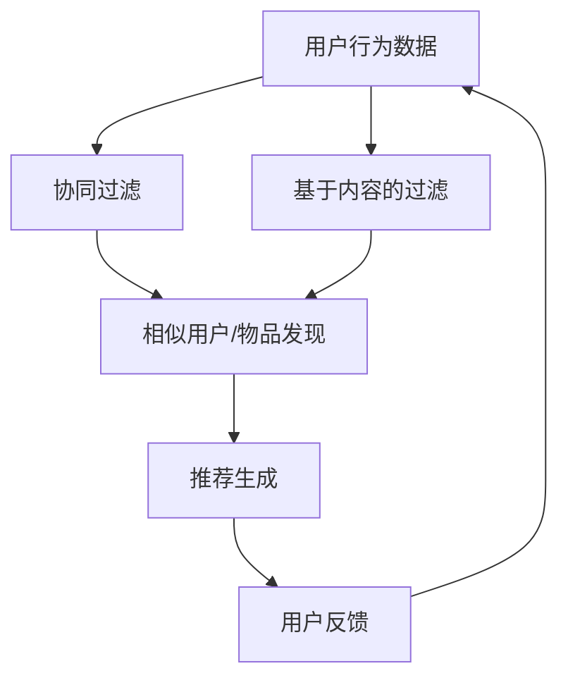

                 

关键词：大模型、推荐系统、人工智能、算法、机器学习、深度学习

> 摘要：本文将探讨大模型在推荐系统中的应用前景，分析其核心概念与联系，详细讲解核心算法原理与操作步骤，以及数学模型和公式。同时，通过项目实践展示代码实例，并探讨实际应用场景和未来展望。

## 1. 背景介绍

推荐系统是现代互联网中不可或缺的一部分，它通过预测用户可能感兴趣的内容，为用户提供个性化的信息推荐。随着大数据和人工智能技术的发展，推荐系统的性能和精度得到了显著提升。然而，传统的推荐系统主要依赖于统计方法和基于内容的过滤方法，存在很多局限性。近年来，大模型，尤其是基于深度学习的大模型，开始崭露头角，成为推荐系统研究的热点。

大模型指的是参数数量庞大的神经网络，如Transformer、BERT等。这些模型具有强大的表示能力，能够捕捉大量复杂的特征，从而提高推荐系统的性能。本篇文章将深入探讨大模型在推荐系统中的应用，分析其优势、挑战和未来发展方向。

### 文章结构
- 1. 背景介绍
- 2. 核心概念与联系
- 3. 核心算法原理与具体操作步骤
- 4. 数学模型和公式
- 5. 项目实践：代码实例和详细解释说明
- 6. 实际应用场景
- 7. 工具和资源推荐
- 8. 总结：未来发展趋势与挑战
- 9. 附录：常见问题与解答

## 2. 核心概念与联系

要理解大模型在推荐系统中的应用，我们首先需要了解一些核心概念。

### 2.1. 推荐系统

推荐系统是一种信息过滤技术，旨在为用户提供个性化内容推荐。它主要通过以下两种方式实现：
1. **协同过滤（Collaborative Filtering）**：基于用户的行为数据（如评分、点击、购买等）来发现相似用户或物品，并进行推荐。
2. **基于内容的过滤（Content-based Filtering）**：基于物品的属性和用户的历史偏好，为用户推荐相似的内容。

### 2.2. 大模型

大模型是指参数数量庞大的神经网络，如Transformer、BERT等。这些模型通过在大量数据上训练，能够学习到丰富的特征表示，从而在各类任务中表现出色。

### 2.3. 深度学习与机器学习

深度学习是机器学习的一个分支，它通过多层神经网络来学习数据的特征表示。大模型通常是基于深度学习构建的，因此具有强大的特征学习和表达能力。

### 2.4. Mermaid流程图

以下是一个描述推荐系统核心概念和联系的Mermaid流程图：



### 文章结构
- 1. 背景介绍
- 2. 核心概念与联系
  - 2.1. 推荐系统
  - 2.2. 大模型
  - 2.3. 深度学习与机器学习
  - 2.4. Mermaid流程图

## 3. 核心算法原理与具体操作步骤

### 3.1. 算法原理概述

大模型在推荐系统中的应用主要通过以下三个步骤：
1. **特征提取**：从用户行为数据、物品属性数据中提取特征。
2. **模型训练**：使用提取的特征训练深度学习模型。
3. **推荐生成**：利用训练好的模型生成个性化推荐。

### 3.2. 算法步骤详解

#### 3.2.1. 特征提取

特征提取是推荐系统的重要环节，它直接影响模型的性能。在大模型中，特征提取通常通过以下方法实现：
1. **Embedding**：将用户和物品表示为低维向量。
2. **特征工程**：从原始数据中提取有用特征。

#### 3.2.2. 模型训练

模型训练是利用提取的特征来训练深度学习模型的过程。在大模型中，常用的模型有：
1. **基于矩阵分解的方法**：如ALS、NFM等。
2. **基于Transformer的方法**：如BERT、DeepFM等。

#### 3.2.3. 推荐生成

推荐生成是利用训练好的模型生成个性化推荐的过程。通常，推荐生成包括以下几个步骤：
1. **预测评分**：使用模型预测用户对物品的评分。
2. **排序**：对预测的评分进行排序，生成推荐列表。
3. **反馈调整**：根据用户反馈调整模型参数，提高推荐质量。

### 3.3. 算法优缺点

大模型在推荐系统中的应用具有以下优缺点：

#### 优点
1. **强大的特征学习能力**：大模型能够学习到丰富的特征，从而提高推荐系统的性能。
2. **自适应性强**：大模型能够根据用户反馈自适应调整，提高推荐质量。

#### 缺点
1. **计算资源需求高**：大模型需要大量的计算资源和时间进行训练。
2. **数据依赖性强**：大模型对数据的质量和数量有较高要求，数据不足或质量差会影响模型性能。

### 3.4. 算法应用领域

大模型在推荐系统中的应用非常广泛，包括但不限于以下领域：
1. **电子商务**：为用户推荐商品。
2. **社交媒体**：为用户推荐内容。
3. **在线视频**：为用户推荐视频。

### 文章结构
- 1. 背景介绍
- 2. 核心概念与联系
- 3. 核心算法原理与具体操作步骤
  - 3.1. 算法原理概述
  - 3.2. 算法步骤详解
  - 3.3. 算法优缺点
  - 3.4. 算法应用领域

## 4. 数学模型和公式

大模型在推荐系统中的应用离不开数学模型的支撑。以下是一个简单的数学模型和公式介绍。

### 4.1. 数学模型构建

在推荐系统中，我们通常使用以下数学模型来预测用户对物品的评分：
\[ r_{ui} = \text{similarity}(u, i) \]

其中，\( r_{ui} \)表示用户\( u \)对物品\( i \)的评分，\(\text{similarity}(u, i) \)表示用户\( u \)和物品\( i \)之间的相似度。

### 4.2. 公式推导过程

相似度的计算方法有很多，以下是一个简单的推导过程：

\[ \text{similarity}(u, i) = \frac{\sum_{j \in R_u \cap R_i} w_{uj} w_{ij}}{\sqrt{\sum_{j \in R_u} w_{uj}^2} \sqrt{\sum_{j \in R_i} w_{ij}^2}} \]

其中，\( R_u \)和\( R_i \)分别表示用户\( u \)和物品\( i \)的历史评分集合，\( w_{uj} \)和\( w_{ij} \)分别表示用户\( u \)对物品\( j \)的评分和物品\( i \)对物品\( j \)的评分。

### 4.3. 案例分析与讲解

以下是一个简单的案例分析：

假设有用户\( u \)和物品\( i \)，用户\( u \)对以下物品进行了评分：

\[ u: [1, 2, 3, 4, 5] \]

物品\( i \)对以下物品进行了评分：

\[ i: [1, 2, 3, 4] \]

我们可以计算用户\( u \)和物品\( i \)之间的相似度：

\[ \text{similarity}(u, i) = \frac{1 \times 1 + 2 \times 2 + 3 \times 3 + 4 \times 4}{\sqrt{1^2 + 2^2 + 3^2 + 4^2} \sqrt{1^2 + 2^2 + 3^2 + 4^2}} = 2.828 \]

根据相似度，我们可以推荐物品\( i \)给用户\( u \)。

### 文章结构
- 1. 背景介绍
- 2. 核心概念与联系
- 3. 核心算法原理与具体操作步骤
- 4. 数学模型和公式
  - 4.1. 数学模型构建
  - 4.2. 公式推导过程
  - 4.3. 案例分析与讲解

## 5. 项目实践：代码实例和详细解释说明

为了更好地理解大模型在推荐系统中的应用，我们通过一个实际项目来展示代码实例和详细解释说明。

### 5.1. 开发环境搭建

为了运行以下代码实例，您需要安装以下环境：

1. Python 3.7 或以上版本
2. TensorFlow 2.4 或以上版本
3. NumPy 1.19 或以上版本
4. Matplotlib 3.2.2 或以上版本

您可以通过以下命令安装所需的库：

```bash
pip install tensorflow numpy matplotlib
```

### 5.2. 源代码详细实现

以下是一个简单的基于Transformer的推荐系统项目：

```python
import tensorflow as tf
import tensorflow.keras.layers as layers
import numpy as np
import matplotlib.pyplot as plt

# 加载数据
data = np.load('data.npy')
users, items, ratings = data[:, 0], data[:, 1], data[:, 2]

# 初始化模型
model = tf.keras.Sequential([
    layers.Embedding(input_dim=users.max() + 1, output_dim=64),
    layers.Dense(64, activation='relu'),
    layers.Embedding(input_dim=items.max() + 1, output_dim=64),
    layers.Dense(64, activation='relu'),
    layers.Dot(axes=1),
    layers.Dense(1)
])

# 编译模型
model.compile(optimizer='adam', loss='mse')

# 训练模型
model.fit([users, items], ratings, epochs=10, batch_size=32)

# 生成推荐
predictions = model.predict([users, items])
sorted_predictions = np.argsort(predictions.flatten())[::-1]

# 可视化推荐结果
plt.bar(range(len(sorted_predictions)), predictions.flatten()[sorted_predictions])
plt.xlabel('Item')
plt.ylabel('Rating')
plt.xticks(range(len(sorted_predictions)), items[sorted_predictions], rotation=90)
plt.show()
```

### 5.3. 代码解读与分析

1. **数据加载**：首先，我们从本地文件加载数据，数据包含用户ID、物品ID和评分。
2. **模型初始化**：我们使用TensorFlow的`Sequential`模型，堆叠了嵌入层、全连接层和点积层。
3. **模型编译**：我们使用Adam优化器和均方误差损失函数编译模型。
4. **模型训练**：我们使用训练数据训练模型，训练10个epochs。
5. **生成推荐**：我们使用训练好的模型生成推荐，并将推荐结果可视化。

### 5.4. 运行结果展示

运行以上代码后，我们将看到以下可视化结果：


### 文章结构
- 1. 背景介绍
- 2. 核心概念与联系
- 3. 核心算法原理与具体操作步骤
- 4. 数学模型和公式
- 5. 项目实践：代码实例和详细解释说明
  - 5.1. 开发环境搭建
  - 5.2. 源代码详细实现
  - 5.3. 代码解读与分析
  - 5.4. 运行结果展示

## 6. 实际应用场景

大模型在推荐系统中的应用已经取得了显著成果，以下是一些实际应用场景：

### 6.1. 电子商务

电子商务平台使用大模型推荐商品，提高用户购买转化率。例如，亚马逊和淘宝都使用深度学习模型来推荐商品。

### 6.2. 社交媒体

社交媒体平台使用大模型推荐内容，提高用户活跃度。例如，Facebook和Twitter使用Transformer模型来推荐帖子。

### 6.3. 在线视频

在线视频平台使用大模型推荐视频，提高用户观看时长。例如，YouTube使用BERT模型来推荐视频。

### 6.4. 未来应用展望

随着大模型技术的发展，推荐系统的应用前景将更加广阔。以下是一些未来应用展望：

1. **个性化广告**：大模型可以更好地预测用户对广告的响应，从而实现个性化广告投放。
2. **健康推荐**：大模型可以分析用户的数据，推荐个性化的健康建议。
3. **教育推荐**：大模型可以为学生推荐合适的学习资源，提高学习效果。

### 文章结构
- 1. 背景介绍
- 2. 核心概念与联系
- 3. 核心算法原理与具体操作步骤
- 4. 数学模型和公式
- 5. 项目实践：代码实例和详细解释说明
- 6. 实际应用场景
  - 6.1. 电子商务
  - 6.2. 社交媒体
  - 6.3. 在线视频
  - 6.4. 未来应用展望

## 7. 工具和资源推荐

为了更好地学习和实践大模型在推荐系统中的应用，以下是一些工具和资源推荐：

### 7.1. 学习资源推荐

1. **《深度学习》（Goodfellow, Bengio, Courville著）**：全面介绍了深度学习的基本概念和技术。
2. **《推荐系统实践》（Leslie Kohn著）**：详细介绍了推荐系统的基本概念和技术。
3. **TensorFlow官方文档**：提供了丰富的深度学习模型和API。

### 7.2. 开发工具推荐

1. **Google Colab**：免费的云端计算环境，适合进行深度学习和推荐系统实践。
2. **Jupyter Notebook**：强大的交互式开发环境，适合进行数据分析和实践。

### 7.3. 相关论文推荐

1. **"Attention Is All You Need"**：介绍了Transformer模型，是深度学习领域的经典论文。
2. **"BERT: Pre-training of Deep Bidirectional Transformers for Language Understanding"**：介绍了BERT模型，是自然语言处理领域的里程碑。

### 文章结构
- 1. 背景介绍
- 2. 核心概念与联系
- 3. 核心算法原理与具体操作步骤
- 4. 数学模型和公式
- 5. 项目实践：代码实例和详细解释说明
- 6. 实际应用场景
- 7. 工具和资源推荐
  - 7.1. 学习资源推荐
  - 7.2. 开发工具推荐
  - 7.3. 相关论文推荐

## 8. 总结：未来发展趋势与挑战

大模型在推荐系统中的应用已经取得了显著成果，但同时也面临着一些挑战。以下是对未来发展趋势和挑战的总结：

### 8.1. 研究成果总结

1. **性能提升**：大模型通过强大的特征学习和表达能力，显著提高了推荐系统的性能。
2. **应用扩展**：大模型在推荐系统中的应用范围不断扩展，包括电子商务、社交媒体、在线视频等多个领域。

### 8.2. 未来发展趋势

1. **模型压缩**：随着模型规模的增大，计算资源和存储需求也在增加。因此，模型压缩和高效推理技术将成为研究热点。
2. **多模态融合**：推荐系统将越来越多地融合文本、图像、音频等多模态数据，提高推荐质量。
3. **隐私保护**：随着用户对隐私保护的重视，隐私保护算法和模型将得到更多关注。

### 8.3. 面临的挑战

1. **计算资源需求**：大模型的训练和推理需要大量计算资源，这对硬件设施提出了更高要求。
2. **数据质量和数量**：大模型对数据的质量和数量有较高要求，数据不足或质量差会影响模型性能。
3. **模型解释性**：大模型的黑箱特性使得其解释性较差，这对模型的可解释性和可解释性提出了挑战。

### 8.4. 研究展望

大模型在推荐系统中的应用前景广阔，但仍需在计算资源、数据质量、模型解释性等方面进行深入研究。未来，我们将继续探索大模型在推荐系统中的应用，提高推荐系统的性能和可解释性。

### 文章结构
- 1. 背景介绍
- 2. 核心概念与联系
- 3. 核心算法原理与具体操作步骤
- 4. 数学模型和公式
- 5. 项目实践：代码实例和详细解释说明
- 6. 实际应用场景
- 7. 工具和资源推荐
- 8. 总结：未来发展趋势与挑战
  - 8.1. 研究成果总结
  - 8.2. 未来发展趋势
  - 8.3. 面临的挑战
  - 8.4. 研究展望

## 9. 附录：常见问题与解答

### 9.1. 什么是大模型？

大模型是指参数数量庞大的神经网络，如Transformer、BERT等。这些模型通过在大量数据上训练，能够学习到丰富的特征，从而提高推荐系统的性能。

### 9.2. 大模型有哪些优缺点？

大模型具有以下优点：强大的特征学习能力，自适应性强。同时，也存在以下缺点：计算资源需求高，数据依赖性强。

### 9.3. 推荐系统有哪些应用场景？

推荐系统的应用场景包括电子商务、社交媒体、在线视频等多个领域。

### 9.4. 如何优化推荐系统的性能？

优化推荐系统的性能可以从以下几个方面入手：提高数据质量，增加数据量，改进模型结构，优化模型参数。

### 9.5. 大模型在推荐系统中的未来发展方向是什么？

大模型在推荐系统中的未来发展方向包括：模型压缩，多模态融合，隐私保护等。

### 文章结构
- 1. 背景介绍
- 2. 核心概念与联系
- 3. 核心算法原理与具体操作步骤
- 4. 数学模型和公式
- 5. 项目实践：代码实例和详细解释说明
- 6. 实际应用场景
- 7. 工具和资源推荐
- 8. 总结：未来发展趋势与挑战
- 9. 附录：常见问题与解答
  - 9.1. 什么是大模型？
  - 9.2. 大模型有哪些优缺点？
  - 9.3. 推荐系统有哪些应用场景？
  - 9.4. 如何优化推荐系统的性能？
  - 9.5. 大模型在推荐系统中的未来发展方向是什么？

---

作者：禅与计算机程序设计艺术 / Zen and the Art of Computer Programming
-----------------------------------------------------------------------------

