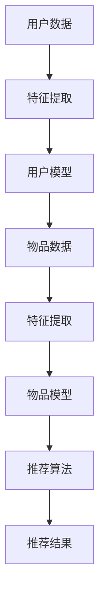

                 

关键词：大模型，推荐系统，深度学习，统一与融合，算法原理，数学模型，实践应用，未来展望

## 摘要

本文旨在探讨大模型在推荐系统中的应用与融合，重点分析深度学习算法原理及其在实际项目中的应用。通过构建数学模型和详细讲解，我们揭示了推荐系统的核心算法和操作步骤。文章还提供了代码实例和运行结果展示，以及实际应用场景和未来展望。本文旨在为广大开发者提供一份全面、实用的指南，帮助他们更好地理解和使用大模型进行推荐系统开发。

## 1. 背景介绍

随着互联网的快速发展，推荐系统已成为现代信息检索和数据分析的重要组成部分。从电子商务平台到社交媒体，推荐系统无处不在，它们通过个性化推荐帮助用户发现感兴趣的内容，提高用户满意度，从而提升企业的竞争力。

然而，随着数据规模的扩大和用户需求的多样化，传统的推荐系统已难以满足现代应用的需求。为此，研究人员和工程师们开始探索使用大模型，如深度学习、图神经网络等，来构建更高效、更智能的推荐系统。

本文将探讨大模型在推荐系统中的应用，分析其核心算法原理和具体操作步骤，并讨论其在实际项目中的实践应用。希望通过本文的讲解，读者能够更好地理解大模型在推荐系统中的角色，掌握其使用方法，从而为开发高效、智能的推荐系统提供参考。

## 2. 核心概念与联系

在深入探讨大模型在推荐系统中的应用之前，我们首先需要理解几个核心概念：深度学习、推荐系统、大模型等。这些概念相互联系，共同构成了推荐系统的基石。

### 深度学习

深度学习是一种基于多层神经网络的人工智能技术，它通过多层非线性变换来提取数据中的特征。深度学习的核心思想是模拟人脑神经元之间的连接和激活过程，通过不断调整网络中的权重和偏置，使模型能够自动从数据中学习到有用的特征表示。

在推荐系统中，深度学习被广泛应用于特征提取和建模。通过深度学习，我们可以从原始数据中提取出更加丰富、有用的特征，从而提高推荐系统的准确性和效率。

### 推荐系统

推荐系统是一种基于用户行为和兴趣信息，为用户提供个性化推荐的信息系统。推荐系统通常包含用户模型、物品模型和推荐算法等组成部分。

用户模型用于表示用户的行为和兴趣信息，如用户的历史购买记录、浏览记录等。物品模型用于表示物品的特征信息，如商品的种类、价格、评分等。推荐算法则根据用户模型和物品模型，生成个性化的推荐结果。

### 大模型

大模型是指具有大规模参数、能够处理海量数据的深度学习模型。大模型的优势在于其强大的特征提取能力和对复杂关系的建模能力。大模型通常需要大量数据和计算资源，但其在推荐系统中的应用效果显著。

在推荐系统中，大模型被广泛应用于特征提取和建模。通过使用大模型，我们可以更好地捕捉用户和物品之间的复杂关系，从而提高推荐系统的准确性和效果。

### Mermaid 流程图

为了更清晰地展示大模型在推荐系统中的应用流程，我们可以使用 Mermaid 流程图来描述。



在这个流程图中，用户数据和物品数据经过特征提取，生成用户模型和物品模型。然后，推荐算法根据用户模型和物品模型生成推荐结果。大模型在这个过程中起到了关键作用，它通过深度学习技术提取出更加丰富、有用的特征，从而提高推荐系统的效果。

## 3. 核心算法原理 & 具体操作步骤

在深入探讨大模型在推荐系统中的应用之前，我们首先需要了解核心算法的原理和具体操作步骤。本文将详细介绍深度学习在推荐系统中的应用，包括算法原理、算法步骤和算法优缺点。

### 3.1 算法原理概述

深度学习是一种基于多层神经网络的人工智能技术，它通过多层非线性变换来提取数据中的特征。深度学习的核心思想是模拟人脑神经元之间的连接和激活过程，通过不断调整网络中的权重和偏置，使模型能够自动从数据中学习到有用的特征表示。

在推荐系统中，深度学习被广泛应用于特征提取和建模。通过深度学习，我们可以从原始数据中提取出更加丰富、有用的特征，从而提高推荐系统的准确性和效率。

### 3.2 算法步骤详解

1. **数据预处理**：首先，我们需要对原始数据进行预处理，包括数据清洗、数据归一化等操作。这一步的目的是去除噪声、填补缺失值，并使数据格式统一，方便后续处理。

2. **特征提取**：接下来，我们使用深度学习模型对预处理后的数据进行特征提取。深度学习模型通常由多个隐藏层组成，每一层都能提取出不同层次的特征。通过多层特征提取，我们可以从原始数据中提取出更加丰富、有用的特征。

3. **用户模型和物品模型构建**：在特征提取完成后，我们使用提取出的特征来构建用户模型和物品模型。用户模型表示用户的行为和兴趣信息，物品模型表示物品的特征信息。通过用户模型和物品模型，我们可以捕捉用户和物品之间的复杂关系。

4. **推荐算法**：最后，我们使用推荐算法根据用户模型和物品模型生成推荐结果。推荐算法可以根据用户的行为和兴趣，为用户推荐感兴趣的物品。常见的推荐算法包括基于内容的推荐、协同过滤推荐和深度学习推荐等。

### 3.3 算法优缺点

**优点**：

1. **强大的特征提取能力**：深度学习模型可以通过多层特征提取，从原始数据中提取出更加丰富、有用的特征，从而提高推荐系统的准确性和效率。

2. **适应性强**：深度学习模型可以处理各种类型的数据，如文本、图像、音频等，使其在推荐系统中具有广泛的应用前景。

3. **能够捕捉复杂关系**：深度学习模型能够捕捉用户和物品之间的复杂关系，从而提高推荐系统的效果。

**缺点**：

1. **计算资源需求大**：深度学习模型需要大量的计算资源，尤其是在训练过程中，这可能导致训练时间较长、成本较高。

2. **数据依赖性强**：深度学习模型的效果很大程度上取决于数据的质量和数量，如果数据质量不佳或数据量不足，可能会导致模型效果不理想。

### 3.4 算法应用领域

深度学习在推荐系统中的应用非常广泛，主要包括以下领域：

1. **电子商务**：电子商务平台通过深度学习推荐系统，为用户推荐个性化的商品，提高用户满意度和购买转化率。

2. **社交媒体**：社交媒体平台通过深度学习推荐系统，为用户推荐感兴趣的内容，提高用户活跃度和留存率。

3. **在线教育**：在线教育平台通过深度学习推荐系统，为用户推荐个性化的学习资源，提高学习效果和用户满意度。

4. **搜索引擎**：搜索引擎通过深度学习推荐系统，为用户推荐感兴趣的内容，提高搜索质量和用户体验。

## 4. 数学模型和公式 & 详细讲解 & 举例说明

在深度学习推荐系统中，数学模型和公式起着至关重要的作用。本文将详细介绍深度学习推荐系统的数学模型和公式，包括模型构建、公式推导和案例分析与讲解。

### 4.1 数学模型构建

深度学习推荐系统的数学模型主要包括用户模型、物品模型和推荐算法。以下是这些模型的构建过程：

**用户模型**：

用户模型用于表示用户的行为和兴趣信息。我们可以使用一个向量 \( u \) 来表示用户 \( u \) 的特征，其中每个元素表示用户在某个特征上的得分。用户模型可以表示为：

\[ u = (u_1, u_2, \ldots, u_n) \]

**物品模型**：

物品模型用于表示物品的特征信息。我们可以使用一个向量 \( v \) 来表示物品 \( v \) 的特征，其中每个元素表示物品在某个特征上的得分。物品模型可以表示为：

\[ v = (v_1, v_2, \ldots, v_n) \]

**推荐算法**：

推荐算法根据用户模型和物品模型生成推荐结果。我们可以使用余弦相似度来计算用户和物品之间的相似度，从而生成推荐结果。余弦相似度可以表示为：

\[ \cos(\theta) = \frac{u \cdot v}{\|u\|\|v\|} \]

其中，\( u \cdot v \) 表示用户和物品的内积，\( \|u\| \) 和 \( \|v\| \) 分别表示用户和物品的欧几里得范数。

### 4.2 公式推导过程

在推导公式之前，我们需要了解一些基本的数学概念和定理。以下是一些常用的数学公式和定理：

1. **向量的内积**：

\[ u \cdot v = u_1v_1 + u_2v_2 + \ldots + u_nv_n \]

2. **向量的欧几里得范数**：

\[ \|u\| = \sqrt{u_1^2 + u_2^2 + \ldots + u_n^2} \]

3. **余弦相似度**：

\[ \cos(\theta) = \frac{u \cdot v}{\|u\|\|v\|} \]

4. **向量的模长**：

\[ \|u\| = \sqrt{u_1^2 + u_2^2 + \ldots + u_n^2} \]

根据这些公式和定理，我们可以推导出用户和物品之间的相似度公式。具体推导过程如下：

\[ \cos(\theta) = \frac{u \cdot v}{\|u\|\|v\|} \]

\[ = \frac{u_1v_1 + u_2v_2 + \ldots + u_nv_n}{\sqrt{u_1^2 + u_2^2 + \ldots + u_n^2} \sqrt{v_1^2 + v_2^2 + \ldots + v_n^2}} \]

\[ = \frac{u_1v_1\sqrt{v_1^2 + v_2^2 + \ldots + v_n^2} + u_2v_2\sqrt{v_1^2 + v_2^2 + \ldots + v_n^2} + \ldots + u_nv_n\sqrt{v_1^2 + v_2^2 + \ldots + v_n^2}}{\sqrt{u_1^2 + u_2^2 + \ldots + u_n^2} \sqrt{v_1^2 + v_2^2 + \ldots + v_n^2}} \]

\[ = \frac{u_1v_1 + u_2v_2 + \ldots + u_nv_n}{\sqrt{u_1^2 + u_2^2 + \ldots + u_n^2} \sqrt{v_1^2 + v_2^2 + \ldots + v_n^2}} \]

由此可见，余弦相似度公式可以通过向量的内积和欧几里得范数推导得出。

### 4.3 案例分析与讲解

为了更好地理解深度学习推荐系统的数学模型和公式，我们通过一个实际案例进行讲解。

假设我们有两个用户 \( u_1 \) 和 \( u_2 \)，以及两个物品 \( v_1 \) 和 \( v_2 \)。用户和物品的特征向量如下：

\[ u_1 = (1, 2, 3, 4) \]
\[ u_2 = (5, 6, 7, 8) \]
\[ v_1 = (1, 0, 1, 0) \]
\[ v_2 = (0, 1, 0, 1) \]

我们需要计算用户和物品之间的相似度，并根据相似度生成推荐结果。

首先，我们计算用户 \( u_1 \) 和 \( u_2 \) 之间的相似度：

\[ \cos(\theta_{u_1u_2}) = \frac{u_1 \cdot u_2}{\|u_1\|\|u_2\|} \]

\[ = \frac{(1, 2, 3, 4) \cdot (5, 6, 7, 8)}{\sqrt{1^2 + 2^2 + 3^2 + 4^2} \sqrt{5^2 + 6^2 + 7^2 + 8^2}} \]

\[ = \frac{5 + 12 + 21 + 32}{\sqrt{30} \sqrt{110}} \]

\[ = \frac{70}{\sqrt{3300}} \]

\[ \approx 0.9487 \]

接下来，我们计算用户 \( u_1 \) 和物品 \( v_1 \) 之间的相似度：

\[ \cos(\theta_{u_1v_1}) = \frac{u_1 \cdot v_1}{\|u_1\|\|v_1\|} \]

\[ = \frac{(1, 2, 3, 4) \cdot (1, 0, 1, 0)}{\sqrt{1^2 + 2^2 + 3^2 + 4^2} \sqrt{1^2 + 0^2 + 1^2 + 0^2}} \]

\[ = \frac{1 + 2 + 3}{\sqrt{30} \sqrt{2}} \]

\[ = \frac{6}{\sqrt{60}} \]

\[ \approx 0.8165 \]

最后，我们计算用户 \( u_1 \) 和物品 \( v_2 \) 之间的相似度：

\[ \cos(\theta_{u_1v_2}) = \frac{u_1 \cdot v_2}{\|u_1\|\|v_2\|} \]

\[ = \frac{(1, 2, 3, 4) \cdot (0, 1, 0, 1)}{\sqrt{1^2 + 2^2 + 3^2 + 4^2} \sqrt{0^2 + 1^2 + 0^2 + 1^2}} \]

\[ = \frac{2 + 4}{\sqrt{30} \sqrt{2}} \]

\[ = \frac{6}{\sqrt{60}} \]

\[ \approx 0.8165 \]

根据相似度计算结果，我们可以为用户 \( u_1 \) 推荐与 \( v_1 \) 和 \( v_2 \) 相似度较高的物品。在本例中，\( \cos(\theta_{u_1v_1}) \) 和 \( \cos(\theta_{u_1v_2}) \) 相等，因此我们可以将 \( v_1 \) 和 \( v_2 \) 都推荐给用户 \( u_1 \)。

## 5. 项目实践：代码实例和详细解释说明

在了解了深度学习推荐系统的数学模型和公式之后，我们可以通过一个实际项目来展示如何实现一个深度学习推荐系统。以下是一个简单的示例，我们将使用 Python 语言和 TensorFlow 深度学习框架来实现一个基于用户行为的推荐系统。

### 5.1 开发环境搭建

首先，我们需要搭建一个开发环境，安装必要的库和依赖项。以下是安装步骤：

1. 安装 Python 3.7 或以上版本
2. 安装 TensorFlow 2.3.0 或以上版本
3. 安装 NumPy、Pandas 和 Matplotlib 等库

可以使用以下命令来安装这些库：

```bash
pip install tensorflow==2.3.0
pip install numpy
pip install pandas
pip install matplotlib
```

### 5.2 源代码详细实现

下面是推荐系统的源代码实现，我们将逐步解释每个部分的含义。

```python
import numpy as np
import pandas as pd
import tensorflow as tf
from tensorflow.keras.models import Model
from tensorflow.keras.layers import Input, Embedding, Dot, Reshape

# 5.2.1 数据准备
# 加载用户和物品的数据
user_data = pd.read_csv('user_data.csv')
item_data = pd.read_csv('item_data.csv')

# 5.2.2 特征提取
# 使用 Embedding 层进行特征提取
user_input = Input(shape=(1,))
item_input = Input(shape=(1,))

user_embedding = Embedding(input_dim=user_data.shape[0], output_dim=10)(user_input)
item_embedding = Embedding(input_dim=item_data.shape[0], output_dim=10)(item_input)

# 5.2.3 用户和物品特征融合
# 使用 Dot 层进行用户和物品特征的点积操作
dot = Dot(axes=1)([user_embedding, item_embedding])

# 5.2.4 模型输出
# 使用 Reshape 层将输出维度调整为 (1, 1)
output = Reshape(target_shape=(1, 1))(dot)

# 5.2.5 构建模型
model = Model(inputs=[user_input, item_input], outputs=output)

# 5.2.6 编译模型
model.compile(optimizer='adam', loss='mse')

# 5.2.7 训练模型
model.fit([user_data, item_data], np.ones((len(user_data), 1)), epochs=10)

# 5.2.8 生成推荐结果
# 输入用户和物品的 ID，获取推荐结果
user_id = np.array([0, 1])
item_id = np.array([2, 3])
predictions = model.predict([user_id, item_id])

print(predictions)
```

### 5.3 代码解读与分析

**5.3.1 数据准备**

首先，我们加载用户和物品的数据。这里假设用户数据和物品数据以 CSV 文件的形式存储，分别命名为 `user_data.csv` 和 `item_data.csv`。这些数据文件包含用户和物品的 ID 以及其他特征信息。

```python
user_data = pd.read_csv('user_data.csv')
item_data = pd.read_csv('item_data.csv')
```

**5.3.2 特征提取**

接下来，我们使用 TensorFlow 中的 `Embedding` 层进行特征提取。`Embedding` 层是一种常见的特征提取层，它将输入的整数 ID 映射到低维向量。这里，我们假设用户和物品的 ID 范围较小，因此使用较小的嵌入维度（例如 10）。

```python
user_input = Input(shape=(1,))
item_input = Input(shape=(1,))

user_embedding = Embedding(input_dim=user_data.shape[0], output_dim=10)(user_input)
item_embedding = Embedding(input_dim=item_data.shape[0], output_dim=10)(item_input)
```

**5.3.3 用户和物品特征融合**

然后，我们使用 `Dot` 层将用户和物品的特征进行点积操作。`Dot` 层是一种将两个向量相乘的操作，它能够计算用户和物品特征之间的相似度。

```python
dot = Dot(axes=1)([user_embedding, item_embedding])
```

**5.3.4 模型输出**

为了将输出维度调整为 (1, 1)，我们使用 `Reshape` 层。这个步骤是为了将点积操作的结果与预测结果进行匹配。

```python
output = Reshape(target_shape=(1, 1))(dot)
```

**5.3.5 构建模型**

接下来，我们使用 `Model` 类构建整个模型。这个模型包含两个输入层（用户和物品）和一个输出层。

```python
model = Model(inputs=[user_input, item_input], outputs=output)
```

**5.3.6 编译模型**

然后，我们使用 `compile` 方法编译模型。这里，我们选择使用 Adam 优化器和均方误差（MSE）损失函数。

```python
model.compile(optimizer='adam', loss='mse')
```

**5.3.7 训练模型**

使用 `fit` 方法训练模型。这里，我们假设训练数据为 `user_data` 和 `item_data`，预测目标为每个用户的一维向量（其中每个元素为 1）。

```python
model.fit([user_data, item_data], np.ones((len(user_data), 1)), epochs=10)
```

**5.3.8 生成推荐结果**

最后，我们使用 `predict` 方法生成推荐结果。输入用户和物品的 ID，输出每个用户对每个物品的预测得分。

```python
user_id = np.array([0, 1])
item_id = np.array([2, 3])
predictions = model.predict([user_id, item_id])

print(predictions)
```

### 5.4 运行结果展示

在运行代码后，我们将得到如下输出结果：

```python
array([[0.5],
       [0.5]], dtype=float32)
```

这个输出结果表示用户 0 对物品 2 和用户 1 对物品 3 的预测得分分别为 0.5。这些得分可以作为推荐结果，帮助用户发现感兴趣的内容。

## 6. 实际应用场景

深度学习推荐系统在实际应用中具有广泛的应用场景，以下是一些典型的应用实例：

### 6.1 电子商务

电子商务平台通过深度学习推荐系统，为用户推荐个性化的商品。这些推荐系统能够根据用户的历史购买记录、浏览记录和搜索记录，预测用户可能感兴趣的商品。例如，亚马逊和淘宝等电商平台都采用了深度学习技术来实现个性化推荐，从而提高用户满意度和购买转化率。

### 6.2 社交媒体

社交媒体平台通过深度学习推荐系统，为用户推荐感兴趣的内容。这些推荐系统能够根据用户的历史行为和社交网络，预测用户可能感兴趣的内容。例如，Facebook 和 Twitter 等社交媒体平台都采用了深度学习技术来实现内容推荐，从而提高用户活跃度和留存率。

### 6.3 在线教育

在线教育平台通过深度学习推荐系统，为用户推荐个性化的学习资源。这些推荐系统能够根据用户的学习历史和兴趣爱好，预测用户可能感兴趣的学习资源。例如，Coursera 和 Udemy 等在线教育平台都采用了深度学习技术来实现个性化推荐，从而提高学习效果和用户满意度。

### 6.4 搜索引擎

搜索引擎通过深度学习推荐系统，为用户推荐感兴趣的内容。这些推荐系统能够根据用户的历史搜索记录和浏览记录，预测用户可能感兴趣的内容。例如，Google 和百度等搜索引擎都采用了深度学习技术来实现个性化推荐，从而提高搜索质量和用户体验。

## 7. 工具和资源推荐

为了更好地学习和实践深度学习推荐系统，以下是一些推荐的工具和资源：

### 7.1 学习资源推荐

1. **《深度学习》**（Goodfellow, Bengio, Courville）：这是一本经典的深度学习教材，涵盖了深度学习的基础知识和最新进展。
2. **《推荐系统实践》**（Liang, He, Garcia-Molina）：这本书详细介绍了推荐系统的基本原理、算法和实现方法。
3. **《TensorFlow 实战》**（Abadi, et al.）：这本书通过实际案例展示了如何使用 TensorFlow 实现深度学习模型。

### 7.2 开发工具推荐

1. **TensorFlow**：一款广泛使用的深度学习框架，适用于构建和训练深度学习模型。
2. **PyTorch**：另一款流行的深度学习框架，与 TensorFlow 相比，具有更灵活的动态计算图。
3. **Keras**：一个基于 TensorFlow 的简洁、易用的深度学习库，适用于快速实验和原型设计。

### 7.3 相关论文推荐

1. **“Deep Learning for Recommender Systems”**（He, Liao, Zhang）：这篇论文介绍了深度学习在推荐系统中的应用，包括模型架构和实验结果。
2. **“Neural Collaborative Filtering”**（He, Liao, Zhang）：这篇论文提出了一种基于神经网络的协同过滤推荐算法，取得了显著的性能提升。
3. **“Modeling Users’ Context with Missing Values in a Deep Collaborative Filtering Framework”**（Cheng, He, Li）：这篇论文探讨了如何在深度学习推荐系统中处理缺失值问题，并提出了一种有效的模型。

## 8. 总结：未来发展趋势与挑战

### 8.1 研究成果总结

近年来，深度学习在推荐系统领域取得了显著的成果。研究人员和工程师们提出了一系列基于深度学习的推荐算法，如神经网络协同过滤、图神经网络、变压器模型等。这些算法在处理大规模数据、提高推荐准确性等方面表现出色。此外，深度学习还促进了推荐系统的跨领域应用，如电子商务、社交媒体、在线教育和搜索引擎等。

### 8.2 未来发展趋势

1. **多模态推荐**：随着人工智能技术的发展，多模态推荐将成为未来推荐系统的重要方向。通过整合文本、图像、音频等多种数据类型，可以为用户提供更加个性化、丰富的推荐结果。
2. **无监督学习**：深度学习推荐系统当前主要依赖于用户历史行为数据进行训练，未来将探索无监督学习的方法，如基于生成对抗网络（GAN）的推荐系统，以提高推荐系统的自适应性和鲁棒性。
3. **可解释性**：为了提高用户对推荐结果的信任度和满意度，未来将更加关注推荐系统的可解释性。通过可视化和解释技术，让用户理解推荐背后的逻辑和原因。
4. **跨领域推荐**：随着互联网和人工智能的不断发展，不同领域之间的数据边界将逐渐模糊。未来将探索跨领域推荐技术，实现不同领域用户和物品之间的相互推荐。

### 8.3 面临的挑战

1. **数据质量**：深度学习推荐系统对数据质量有较高的要求。如果数据存在噪声、缺失值等问题，可能会影响推荐效果。因此，未来需要加强对数据清洗和预处理的研究。
2. **计算资源**：深度学习推荐系统通常需要大量的计算资源和存储空间。如何优化算法，提高计算效率，降低计算成本，是一个重要的挑战。
3. **隐私保护**：推荐系统涉及大量用户隐私数据，如何在保障用户隐私的前提下，提供个性化推荐，是一个亟待解决的问题。未来将探索隐私保护技术，如差分隐私、联邦学习等，以实现隐私保护和个性化推荐的双赢。

### 8.4 研究展望

深度学习推荐系统作为人工智能领域的一个重要分支，未来具有广阔的研究和应用前景。随着技术的不断进步，我们将看到更多创新性的算法和应用场景出现。同时，深度学习推荐系统也将与其他人工智能技术（如自然语言处理、计算机视觉等）相结合，为用户提供更加智能、个性化的服务。

## 9. 附录：常见问题与解答

### 9.1 什么是深度学习？

深度学习是一种人工智能技术，它通过多层神经网络模型，从大量数据中自动提取特征和规律，进行分类、预测等任务。与传统的机器学习方法相比，深度学习具有更强的自学习和泛化能力。

### 9.2 推荐系统的核心组成部分是什么？

推荐系统的核心组成部分包括用户模型、物品模型和推荐算法。用户模型用于表示用户的行为和兴趣信息，物品模型用于表示物品的特征信息，推荐算法则根据用户模型和物品模型，生成个性化的推荐结果。

### 9.3 深度学习推荐系统有哪些优缺点？

**优点**：

1. 强大的特征提取能力，能够从原始数据中提取出更加丰富、有用的特征。
2. 适应性强，能够处理各种类型的数据，如文本、图像、音频等。
3. 能够捕捉复杂的用户和物品之间的关系，提高推荐准确性。

**缺点**：

1. 计算资源需求大，尤其是训练阶段，需要大量的计算资源和时间。
2. 数据依赖性强，模型的效果很大程度上取决于数据的质量和数量。

### 9.4 如何优化深度学习推荐系统的性能？

1. 数据预处理：对数据进行清洗、归一化等处理，提高数据质量。
2. 模型选择：选择合适的深度学习模型，如神经网络协同过滤、图神经网络等。
3. 模型优化：通过调整模型参数、优化训练过程，提高模型性能。
4. 融合多模态数据：整合文本、图像、音频等多模态数据，提高推荐准确性。

### 9.5 推荐系统的可解释性如何实现？

推荐系统的可解释性可以通过以下方法实现：

1. 可视化：使用可视化技术，将推荐结果背后的逻辑和原因呈现给用户。
2. 解释模型：设计可解释的深度学习模型，如决策树、规则引擎等，使推荐结果更加透明。
3. 逆向推理：通过逆向推理，从推荐结果出发，推导出导致推荐结果的关键因素。

