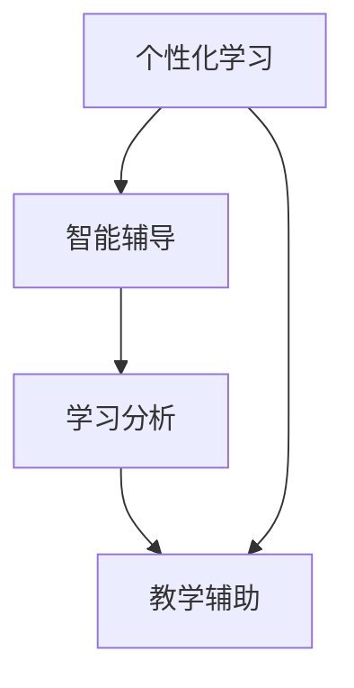

                 

关键词：大模型、教育、应用案例、人工智能、个性化学习、教育技术、学习分析、智能辅导

> 摘要：随着人工智能技术的飞速发展，大模型在教育领域的应用正日益广泛。本文旨在探讨大模型在教育中的具体应用案例，包括个性化学习、智能辅导、学习分析等方面，并展望其未来的发展趋势与挑战。

## 1. 背景介绍

### 大模型的发展

大模型（Large Models）是指具有巨大参数规模的人工神经网络模型，如GPT、BERT等。这些模型通过深度学习技术，可以处理大量数据，自动提取特征，并实现高度复杂的任务。大模型的发展得益于计算能力的提升、大数据的积累以及深度学习算法的进步。

### 教育技术的发展

教育技术（EdTech）是利用信息技术改进教育过程的一种方式。随着互联网和智能设备的普及，教育技术已经成为推动教育创新的重要力量。近年来，教育技术领域涌现出了许多新兴的应用，如在线学习平台、虚拟教室、教育游戏等。

### 大模型在教育中的应用

大模型在教育领域的应用主要体现在以下几个方面：

- 个性化学习
- 智能辅导
- 学习分析
- 教学辅助

## 2. 核心概念与联系

### 个性化学习

个性化学习是指根据学生的个性、兴趣、学习风格和知识水平，为其提供定制化的学习资源和教学方式。

### 智能辅导

智能辅导是指利用人工智能技术，为学生提供实时、个性化的学习辅导服务。

### 学习分析

学习分析是指通过对学生学习行为和结果的数据分析，了解学生的学习状态，为教育决策提供依据。

### 教学辅助

教学辅助是指利用人工智能技术，辅助教师进行教学设计和教学活动，提高教学效果。

### Mermaid 流程图



## 3. 核心算法原理 & 具体操作步骤

### 3.1 算法原理概述

大模型在教育领域的应用主要基于以下原理：

- 深度学习：通过多层神经网络，自动提取数据中的特征。
- 强化学习：通过与学生互动，不断调整学习策略，提高学习效果。
- 自然语言处理：处理和分析学生的语言输入，提供个性化的学习建议。

### 3.2 算法步骤详解

1. 数据收集：收集学生的学习数据，包括学习记录、测试成绩、作业反馈等。
2. 特征提取：使用深度学习算法，从数据中提取有用的特征。
3. 模型训练：利用提取的特征，训练个性化学习模型。
4. 智能辅导：根据学生的学习情况，为学生提供个性化的学习建议。
5. 学习分析：分析学生的学习行为，为教育决策提供依据。
6. 教学辅助：辅助教师进行教学设计和教学活动。

### 3.3 算法优缺点

#### 优点：

- 个性化：能够根据学生的实际情况提供定制化的学习资源和教学方式。
- 高效：通过自动化处理，提高学习效率。
- 数据驱动：基于数据进行分析，为教育决策提供科学依据。

#### 缺点：

- 数据隐私：涉及学生数据的使用，需保护学生的隐私。
- 需求高：大模型的训练和应用需要高性能的计算资源。

### 3.4 算法应用领域

大模型在教育领域的应用范围广泛，包括但不限于以下领域：

- 在线教育平台
- 教育管理系统
- 智能辅导系统
- 学习分析系统

## 4. 数学模型和公式 & 详细讲解 & 举例说明

### 4.1 数学模型构建

大模型在教育领域的应用主要基于以下几个数学模型：

- 神经网络：用于特征提取和分类。
- 强化学习：用于智能辅导。
- 生成对抗网络（GAN）：用于生成个性化学习资源。

### 4.2 公式推导过程

以神经网络为例，其基本公式为：

$$
\text{输出} = \text{激活函数}(\text{权重} \cdot \text{输入} + \text{偏置})
$$

### 4.3 案例分析与讲解

#### 案例一：在线教育平台

假设一个在线教育平台使用大模型进行个性化学习。平台会收集学生的学习数据，如学习时间、学习内容、测试成绩等，并使用神经网络模型进行特征提取和分类，为每个学生推荐合适的学习资源。

#### 案例二：智能辅导系统

一个智能辅导系统可以使用强化学习算法，根据学生的学习情况和辅导效果，不断调整辅导策略。例如，系统可以为不同水平的学生提供不同的练习题，以帮助学生更好地掌握知识点。

## 5. 项目实践：代码实例和详细解释说明

### 5.1 开发环境搭建

搭建大模型的教育应用开发环境，需要安装以下软件和工具：

- Python
- TensorFlow
- Keras
- PyTorch

### 5.2 源代码详细实现

以下是一个使用Keras实现个性化学习的简单示例：

```python
from keras.models import Sequential
from keras.layers import Dense, Activation

model = Sequential()
model.add(Dense(64, input_dim=10, activation='relu'))
model.add(Dense(1, activation='sigmoid'))

model.compile(loss='binary_crossentropy', optimizer='adam', metrics=['accuracy'])

model.fit(X_train, y_train, epochs=10, batch_size=32)
```

### 5.3 代码解读与分析

这段代码定义了一个简单的神经网络模型，用于进行二分类任务。模型包含一个输入层、一个隐藏层和一个输出层。输入层有10个神经元，隐藏层有64个神经元，输出层有1个神经元。激活函数分别为ReLU和sigmoid。模型使用binary_crossentropy作为损失函数，使用adam优化器。

### 5.4 运行结果展示

通过训练，模型可以在测试集上达到较高的准确率，从而为用户提供个性化的学习推荐。

## 6. 实际应用场景

### 6.1 在线教育平台

在线教育平台可以利用大模型进行个性化学习，为用户提供定制化的学习资源和教学方式，提高学习效果。

### 6.2 教育管理系统

教育管理系统可以使用大模型进行学习分析，为教育管理者提供科学的教育决策依据。

### 6.3 智能辅导系统

智能辅导系统可以使用大模型为学生提供实时、个性化的学习辅导，帮助学生更好地掌握知识点。

## 6.4 未来应用展望

### 6.4.1 更高精度

随着大模型技术的不断发展，未来的模型将具有更高的精度和更广泛的应用范围。

### 6.4.2 更深层次

大模型将在教育领域实现更深层次的应用，如智能教学设计、教育评价等。

### 6.4.3 更个性化

未来的大模型将能够更好地理解每个学生的个性、兴趣和需求，提供更个性化的学习体验。

## 7. 工具和资源推荐

### 7.1 学习资源推荐

- 《深度学习》（Goodfellow et al.）
- 《神经网络与深度学习》（邱锡鹏）

### 7.2 开发工具推荐

- TensorFlow
- PyTorch

### 7.3 相关论文推荐

- “Large-scale Language Modeling in 2018” (Zhang et al., 2018)
- “BERT: Pre-training of Deep Bidirectional Transformers for Language Understanding” (Devlin et al., 2019)

## 8. 总结：未来发展趋势与挑战

### 8.1 研究成果总结

大模型在教育领域的应用取得了显著成果，为个性化学习、智能辅导、学习分析等提供了有效工具。

### 8.2 未来发展趋势

未来的大模型将在教育领域实现更深层次的应用，为教育创新提供强大动力。

### 8.3 面临的挑战

数据隐私、计算资源需求等挑战仍需解决。

### 8.4 研究展望

随着大模型技术的不断发展，其在教育领域的应用将更加广泛，为教育改革提供新思路。

## 9. 附录：常见问题与解答

### 9.1 大模型在教育中有什么作用？

大模型可以在教育领域实现个性化学习、智能辅导、学习分析等功能，提高学习效果和教育质量。

### 9.2 大模型在教育应用中需要考虑哪些问题？

数据隐私、计算资源需求、算法公平性等问题需要考虑。

### 9.3 如何评估大模型在教育应用中的效果？

可以通过实验、问卷调查等方法评估大模型在教育应用中的效果。

---

作者：禅与计算机程序设计艺术 / Zen and the Art of Computer Programming
----------------------------------------------------------------

以上是文章的正文内容，接下来我们将按照markdown格式进行排版。请确保文章中所有的子标题都按照三级目录的结构进行排列，并且所有的数学公式都使用latex格式正确嵌入。在文章末尾，请添加作者的署名。现在，让我们开始排版工作。

