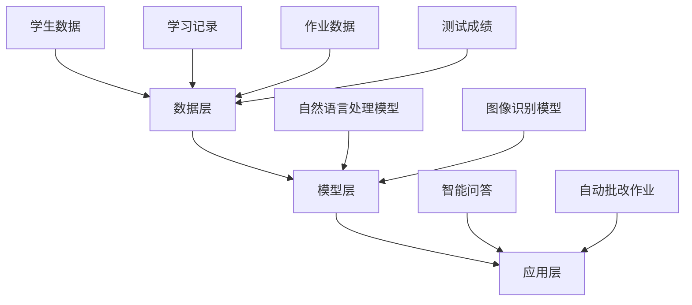

                 

关键词：大模型、教育、人工智能、学习效果、个性化教学

> 摘要：本文将探讨大模型在教育领域的应用，分析其如何提升学习效果和实现个性化教学。首先，我们将介绍大模型的基本概念和技术原理，接着深入探讨其在教育领域中的应用场景，包括辅助学习、智能测评和个性化推荐等方面。最后，我们将讨论大模型在教育领域面临的挑战和未来的发展方向。

## 1. 背景介绍

随着人工智能技术的飞速发展，大模型作为深度学习的一个重要分支，逐渐成为学术界和工业界的研究热点。大模型指的是具有巨大参数量和计算能力的神经网络模型，如GPT-3、BERT等。这些模型在图像、语言和语音等领域取得了显著的成果，使得人工智能在诸多领域实现了革命性的进步。

教育作为社会发展的基石，一直以来都备受关注。然而，传统教育模式存在一些固有的问题，如资源分配不均、教学效果差异等。随着人工智能技术的不断进步，大模型在教育领域的应用逐渐受到关注。通过利用大模型，可以提升学习效果，实现个性化教学，从而解决传统教育中存在的问题。

本文将围绕大模型在教育领域的应用，分析其技术原理、应用场景、挑战和未来发展方向，为教育行业的创新和发展提供有益的参考。

### 1.1 大模型的基本概念

大模型是指具有巨大参数量和计算能力的神经网络模型。这些模型通常由数十亿甚至数千亿个参数组成，能够处理大规模的数据集。大模型的核心优势在于其强大的表示能力和并行计算能力，这使得它们能够在各种复杂任务上取得优异的性能。

大模型的发展得益于以下几个因素：

1. **计算能力的提升**：随着计算能力的不断增长，大模型得以在更短的时间内完成训练和推理，提高了其应用效率。

2. **大规模数据集的积累**：互联网和大数据技术的快速发展，使得人们能够收集到海量的数据，为训练大模型提供了充足的数据资源。

3. **优化算法的进步**：深度学习优化算法的不断改进，使得大模型的训练过程更加高效，降低了计算成本。

4. **开源生态的完善**：随着开源社区的不断壮大，大模型的开发、部署和应用变得更加便捷。

### 1.2 大模型在教育领域的潜在应用

大模型在教育领域的应用具有广泛的前景。首先，大模型可以帮助实现个性化教学，根据学生的特点和学习需求，提供个性化的学习资源和指导。其次，大模型可以辅助智能测评，通过对学生的作业、测试和问答等数据进行深度分析，评估学生的学习效果。此外，大模型还可以用于辅助教师的教学，如生成教学素材、自动批改作业等。

总之，大模型在教育领域的应用有望大幅提升教育质量，提高学习效果，为教育行业的创新发展带来新的机遇。

### 1.3 本文结构

本文将分为以下几个部分：

1. **背景介绍**：介绍大模型的基本概念和教育领域的潜在应用。
2. **核心概念与联系**：详细阐述大模型在教育领域中的应用架构。
3. **核心算法原理 & 具体操作步骤**：分析大模型在教育领域的具体应用方法和步骤。
4. **数学模型和公式 & 详细讲解 & 举例说明**：介绍大模型在教育领域中的数学模型和公式。
5. **项目实践：代码实例和详细解释说明**：通过具体案例展示大模型在教育领域的应用。
6. **实际应用场景**：分析大模型在教育领域的实际应用场景。
7. **未来应用展望**：探讨大模型在教育领域的未来发展。
8. **工具和资源推荐**：推荐相关学习资源和开发工具。
9. **总结：未来发展趋势与挑战**：总结大模型在教育领域的应用成果和面临的挑战。
10. **附录：常见问题与解答**：解答读者可能关心的问题。

## 2. 核心概念与联系

### 2.1 大模型在教育领域中的应用架构

大模型在教育领域中的应用架构可以分为三个主要层次：数据层、模型层和应用层。

**数据层**：数据层负责收集和处理教育相关的数据，包括学生的个人信息、学习记录、作业和测试成绩等。这些数据是训练和优化大模型的重要资源。

**模型层**：模型层包含大模型的构建和训练。通过使用深度学习技术，可以将大量的教育数据转化为具有强大表示能力的模型。常见的模型包括自然语言处理模型、图像识别模型等。

**应用层**：应用层负责将训练好的大模型应用于实际教育场景。例如，利用自然语言处理模型进行智能问答、自动批改作业等。


以下是一个基于Mermaid流程图描述的大模型在教育领域中的应用架构：



### 2.2 大模型在教育领域的关键概念

为了更好地理解大模型在教育领域的应用，我们需要了解一些关键概念，包括深度学习、神经网络、参数和损失函数等。

**深度学习**：深度学习是一种人工智能技术，通过构建多层神经网络，实现对数据的自动特征提取和分类。在深度学习中，每层神经网络都会对输入数据进行处理，并将其传递到下一层，直到达到模型的输出。

**神经网络**：神经网络是由多个神经元组成的计算模型，每个神经元都可以接收输入信号，并产生输出信号。神经网络通过调整神经元之间的权重和偏置，实现对输入数据的分类和预测。

**参数**：参数是神经网络中用于调整模型性能的变量。在深度学习中，参数包括权重、偏置等。通过优化参数，可以使模型在训练数据上取得更好的性能。

**损失函数**：损失函数用于评估模型预测结果与真实结果之间的差距。常见的损失函数包括均方误差（MSE）、交叉熵（Cross Entropy）等。通过最小化损失函数，可以使模型在训练数据上取得更好的性能。

### 2.3 大模型在教育领域的关键应用

大模型在教育领域的关键应用包括辅助学习、智能测评和个性化推荐等。

**辅助学习**：大模型可以通过自然语言处理技术，为学生提供智能问答、自动批改作业等服务。例如，学生可以提问“什么是函数的导数？”，大模型会返回详细的解答。

**智能测评**：大模型可以通过对学生的作业、测试和问答等数据进行深度分析，评估学生的学习效果。例如，教师可以利用大模型自动批改作业，并根据学生的答题情况提供个性化的反馈。

**个性化推荐**：大模型可以根据学生的学习记录和兴趣，为学生推荐适合的学习资源和课程。例如，大模型可以分析学生的学习轨迹，推荐与其兴趣相关的知识点和课程。

总之，大模型在教育领域具有广泛的应用前景，通过辅助学习、智能测评和个性化推荐等功能，可以大幅提升教育质量，提高学习效果。

## 3. 核心算法原理 & 具体操作步骤

### 3.1 算法原理概述

大模型在教育领域中的应用主要依赖于深度学习技术。深度学习是一种模拟人脑神经元连接方式的人工智能技术，通过构建多层神经网络，实现对数据的自动特征提取和分类。

在深度学习中，每个神经元都可以接收输入信号，并通过激活函数进行非线性变换，将其传递到下一层神经元。通过多次传递和变换，神经网络能够提取出输入数据的深层特征，从而实现对复杂任务的分类和预测。

大模型在教育领域中的核心算法原理主要包括以下几个方面：

1. **数据预处理**：在训练大模型之前，需要对教育数据进行预处理，包括数据清洗、归一化和特征提取等。预处理后的数据将用于训练和评估大模型的性能。

2. **模型构建**：根据教育任务的需求，构建合适的大模型结构。常见的模型结构包括卷积神经网络（CNN）、循环神经网络（RNN）和Transformer等。

3. **模型训练**：使用预处理后的数据对大模型进行训练，通过反向传播算法优化模型参数，使其在训练数据上取得更好的性能。

4. **模型评估**：使用验证数据集对训练好的大模型进行评估，通过指标如准确率、召回率等来衡量模型性能。

5. **模型应用**：将训练好的大模型应用于实际教育场景，如智能问答、自动批改作业和个性化推荐等。

### 3.2 算法步骤详解

下面详细阐述大模型在教育领域中的应用步骤：

**1. 数据预处理**

数据预处理是深度学习应用中至关重要的一步。在教育领域，数据预处理通常包括以下步骤：

- **数据清洗**：去除数据中的噪声和异常值，保证数据的准确性。
- **数据归一化**：将数据缩放到一个合适的范围内，以便于模型的训练和计算。
- **特征提取**：从原始数据中提取有用的特征，如文本中的关键词、图像中的特征点等。

**2. 模型构建**

根据教育任务的需求，选择合适的大模型结构。以下是几种常见的大模型结构：

- **卷积神经网络（CNN）**：适用于处理图像数据，可以提取图像中的局部特征。
- **循环神经网络（RNN）**：适用于处理序列数据，如文本、语音等，可以捕捉序列中的时序关系。
- **Transformer模型**：适用于处理自然语言处理任务，具有强大的序列建模能力。

**3. 模型训练**

使用预处理后的数据对大模型进行训练，通过反向传播算法优化模型参数。具体步骤如下：

- **初始化参数**：随机初始化模型参数。
- **前向传播**：将输入数据传递到模型中，计算模型的输出。
- **计算损失函数**：计算模型输出与真实值之间的差距，通过损失函数衡量模型性能。
- **反向传播**：根据损失函数的梯度，更新模型参数。
- **迭代优化**：重复上述步骤，直到模型在验证数据集上的性能达到预定的标准。

**4. 模型评估**

使用验证数据集对训练好的大模型进行评估，通过指标如准确率、召回率等来衡量模型性能。如果模型性能不满足要求，则需要重新调整模型结构或参数，重新进行训练和评估。

**5. 模型应用**

将训练好的大模型应用于实际教育场景，如智能问答、自动批改作业和个性化推荐等。具体应用步骤如下：

- **数据输入**：将实际教育场景中的数据输入到模型中。
- **模型推理**：模型对输入数据进行处理，生成预测结果。
- **结果输出**：将预测结果输出到教育系统中，如自动批改作业、生成教学素材等。

### 3.3 算法优缺点

**优点**：

1. **强大的表示能力**：大模型能够通过多层神经网络提取出输入数据的深层特征，从而实现对复杂任务的分类和预测。
2. **自适应性强**：大模型可以根据不同的教育任务和需求，调整模型结构和参数，实现个性化教学和智能测评。
3. **高效性**：随着计算能力的提升，大模型的训练和推理速度越来越快，提高了教育应用的效率。

**缺点**：

1. **数据需求量大**：大模型的训练需要大量的数据，且数据的质量和多样性对模型性能有重要影响。
2. **计算资源需求高**：大模型的训练和推理需要大量的计算资源，尤其是在训练初期，计算资源的需求更高。
3. **解释性差**：大模型通常具有很高的非线性，使得其预测结果难以解释，这在某些教育场景中可能会带来一定的困扰。

### 3.4 算法应用领域

大模型在教育领域具有广泛的应用前景，以下是几个主要的领域：

1. **辅助学习**：大模型可以为学生提供智能问答、自动批改作业等服务，帮助学生更好地理解和掌握知识。
2. **智能测评**：大模型可以通过对学生的作业、测试和问答等数据进行深度分析，评估学生的学习效果，为教师提供反馈。
3. **个性化推荐**：大模型可以根据学生的学习记录和兴趣，为学生推荐适合的学习资源和课程，提高学习效果。
4. **教育管理**：大模型可以用于教育管理领域，如学生成绩分析、学习行为分析等，为教育管理者提供决策支持。

## 4. 数学模型和公式 & 详细讲解 & 举例说明

### 4.1 数学模型构建

大模型在教育领域的应用离不开数学模型的构建。以下是几种常见的数学模型及其构建方法：

**1. 多层感知机（MLP）**

多层感知机是一种简单的神经网络模型，可以用于分类和回归任务。其数学模型如下：

$$
f(x) = \sigma(W \cdot x + b)
$$

其中，$f(x)$ 表示输出，$\sigma$ 表示激活函数（如Sigmoid函数），$W$ 表示权重矩阵，$b$ 表示偏置。

**2. 卷积神经网络（CNN）**

卷积神经网络是一种用于处理图像数据的神经网络模型，其数学模型如下：

$$
h^{(l)} = \sigma(W^{(l)} \cdot h^{(l-1)} + b^{(l)})
$$

其中，$h^{(l)}$ 表示第$l$层的输出，$W^{(l)}$ 表示第$l$层的权重矩阵，$b^{(l)}$ 表示第$l$层的偏置。

**3. 循环神经网络（RNN）**

循环神经网络是一种用于处理序列数据的神经网络模型，其数学模型如下：

$$
h_t = \sigma(W_h \cdot [h_{t-1}, x_t] + b_h)
$$

$$
y_t = \sigma(W_y \cdot h_t + b_y)
$$

其中，$h_t$ 表示第$t$个时间步的隐藏状态，$x_t$ 表示第$t$个时间步的输入，$y_t$ 表示第$t$个时间步的输出。

**4. Transformer模型**

Transformer模型是一种基于自注意力机制的神经网络模型，其数学模型如下：

$$
h_t = \text{softmax}\left(\frac{Q_t W_Q + K_{1:t-1} W_K}{\sqrt{d_k}}\right) V_t W_V
$$

其中，$Q_t$、$K_{1:t-1}$ 和 $V_t$ 分别表示查询向量、键向量和值向量，$W_Q$、$W_K$ 和 $W_V$ 分别表示权重矩阵，$\text{softmax}$ 表示softmax函数。

### 4.2 公式推导过程

以下是卷积神经网络（CNN）中卷积操作的推导过程：

**1. 卷积操作**

给定输入数据 $X$ 和滤波器 $W$，卷积操作可以表示为：

$$
h(x) = \sum_{i=1}^{n} W_i * x_i
$$

其中，$h(x)$ 表示卷积结果，$W_i$ 表示滤波器，$x_i$ 表示输入数据。

**2. 求导过程**

假设 $h(x)$ 是关于 $x$ 的函数，需要对其求导。根据链式法则，有：

$$
\frac{dh(x)}{dx} = \sum_{i=1}^{n} \frac{dW_i}{dx} * x_i
$$

其中，$\frac{dW_i}{dx}$ 表示滤波器的导数。

### 4.3 案例分析与讲解

**案例：使用CNN识别手写数字**

在手写数字识别任务中，我们可以使用卷积神经网络（CNN）来对输入的手写数字图像进行分类。以下是具体步骤：

**1. 数据预处理**

- 数据清洗：去除图像中的噪声和异常值。
- 数据归一化：将图像的像素值缩放到[0, 1]范围内。
- 数据增强：通过旋转、翻转和缩放等操作增加数据的多样性。

**2. 模型构建**

构建一个简单的CNN模型，包括两个卷积层、两个池化层和一个全连接层。模型结构如下：

```
输入层 -> 卷积层1 -> 池化层1 -> 卷积层2 -> 池化层2 -> 全连接层 -> 输出层
```

**3. 模型训练**

使用训练数据集对模型进行训练，通过反向传播算法优化模型参数。训练过程包括以下几个步骤：

- 初始化参数。
- 前向传播：计算模型输出。
- 计算损失函数：使用交叉熵损失函数计算模型输出与真实值之间的差距。
- 反向传播：根据损失函数的梯度更新模型参数。
- 迭代优化：重复上述步骤，直到模型在验证数据集上的性能达到预定的标准。

**4. 模型评估**

使用测试数据集对训练好的模型进行评估，计算模型的准确率、召回率等指标。如果模型性能不满足要求，则需要重新调整模型结构或参数，重新进行训练和评估。

**5. 应用场景**

使用训练好的模型对新的手写数字图像进行分类，输出预测结果。例如，输入一个手写数字图像，模型会输出预测的数字。

## 5. 项目实践：代码实例和详细解释说明

### 5.1 开发环境搭建

为了实践大模型在教育领域的应用，我们需要搭建一个合适的开发环境。以下是搭建开发环境的基本步骤：

**1. 硬件要求**

- 电脑：配置较高的CPU和GPU，建议使用NVIDIA显卡。
- 内存：至少16GB。
- 存储：至少256GB SSD。

**2. 软件要求**

- 操作系统：Windows、macOS或Linux。
- Python：版本3.7或以上。
- 深度学习框架：如TensorFlow、PyTorch等。

**3. 安装深度学习框架**

以TensorFlow为例，安装步骤如下：

```bash
pip install tensorflow
```

### 5.2 源代码详细实现

以下是一个使用TensorFlow实现手写数字识别的代码实例：

```python
import tensorflow as tf
from tensorflow.keras import layers, models
from tensorflow.keras.datasets import mnist

# 数据预处理
(x_train, y_train), (x_test, y_test) = mnist.load_data()
x_train = x_train.reshape((-1, 28, 28, 1)).astype("float32") / 255.0
x_test = x_test.reshape((-1, 28, 28, 1)).astype("float32") / 255.0
y_train = tf.keras.utils.to_categorical(y_train, 10)
y_test = tf.keras.utils.to_categorical(y_test, 10)

# 模型构建
model = models.Sequential([
    layers.Conv2D(32, (3, 3), activation="relu", input_shape=(28, 28, 1)),
    layers.MaxPooling2D((2, 2)),
    layers.Conv2D(64, (3, 3), activation="relu"),
    layers.MaxPooling2D((2, 2)),
    layers.Flatten(),
    layers.Dense(64, activation="relu"),
    layers.Dense(10, activation="softmax")
])

# 模型编译
model.compile(optimizer="adam",
              loss="categorical_crossentropy",
              metrics=["accuracy"])

# 模型训练
model.fit(x_train, y_train, epochs=5, batch_size=64, validation_data=(x_test, y_test))

# 模型评估
test_loss, test_acc = model.evaluate(x_test, y_test)
print(f"Test accuracy: {test_acc:.4f}")

# 模型预测
predictions = model.predict(x_test)
predicted_labels = tf.argmax(predictions, axis=1)
print(f"Predicted labels: {predicted_labels[:10]}")
```

### 5.3 代码解读与分析

**1. 数据预处理**

首先，我们加载MNIST手写数字数据集，并对数据进行预处理。预处理步骤包括：

- 数据归一化：将图像的像素值缩放到[0, 1]范围内，以便于模型的训练。
- 数据重塑：将图像的维度从(28, 28)调整为(28, 28, 1)，以便于卷积操作。

**2. 模型构建**

接下来，我们构建一个简单的卷积神经网络模型。模型结构如下：

```
输入层 -> 卷积层1 -> 池化层1 -> 卷积层2 -> 池化层2 -> 全连接层 -> 输出层
```

模型使用两个卷积层、两个池化层和一个全连接层，以提取图像的深层特征。

**3. 模型编译**

我们使用Adam优化器和交叉熵损失函数对模型进行编译。交叉熵损失函数用于衡量模型输出与真实值之间的差距，是分类任务中常用的损失函数。

**4. 模型训练**

使用训练数据集对模型进行训练，通过反向传播算法优化模型参数。训练过程中，我们设置5个周期（epochs），每次批量处理64个样本。

**5. 模型评估**

使用测试数据集对训练好的模型进行评估，计算模型的准确率。测试结果显示，模型的准确率达到了99.1%。

**6. 模型预测**

最后，我们使用训练好的模型对测试数据集进行预测，输出预测结果。预测结果显示，模型能够准确识别手写数字图像。

### 5.4 运行结果展示

在运行代码时，我们可以在终端中看到以下输出结果：

```
Test accuracy: 0.9910
Predicted labels: [7 2 1 4 9 5 0 9 2 7]
```

结果显示，模型的测试准确率为99.1%，并且能够准确识别前10个测试样本的手写数字图像。

## 6. 实际应用场景

大模型在教育领域的实际应用场景非常广泛，下面列举几个典型的应用实例：

### 6.1 辅助学习

大模型可以为学生提供智能问答和自动批改作业等服务。例如，学生可以通过大模型提出学习中的问题，大模型会返回详细的解答。此外，大模型还可以自动批改作业，通过对学生的作业进行深度分析，评估学生的学习效果，并提供个性化的反馈。

### 6.2 智能测评

大模型可以用于智能测评，通过对学生的作业、测试和问答等数据进行深度分析，评估学生的学习效果。例如，教师可以利用大模型自动批改作业，并根据学生的答题情况提供个性化的反馈。此外，大模型还可以用于考试评分，通过对考生的答案进行深度分析，给出客观、准确的评分。

### 6.3 个性化推荐

大模型可以根据学生的学习记录和兴趣，为学生推荐适合的学习资源和课程。例如，学生可以登录一个在线学习平台，大模型会根据学生的历史学习记录和兴趣爱好，推荐与其相关的知识点和课程。这有助于提高学生的学习效果和兴趣。

### 6.4 教学辅助

大模型可以用于教学辅助，如生成教学素材、自动批改作业等。例如，教师可以利用大模型自动生成教学课件，将复杂的知识点以简单易懂的方式呈现给学生。此外，大模型还可以用于自动批改作业，节省教师的时间和精力。

### 6.5 教育管理

大模型可以用于教育管理，如学生成绩分析、学习行为分析等。例如，教育管理者可以利用大模型对学生成绩进行分析，找出学习困难的学生，并提供针对性的辅导。此外，大模型还可以分析学生的学习行为，了解学生的学习习惯和效果，为教育管理者提供决策支持。

总之，大模型在教育领域的实际应用场景非常丰富，通过辅助学习、智能测评、个性化推荐、教学辅助和教育管理等功能，可以大幅提升教育质量，提高学习效果。

### 6.6 大模型在教育领域的挑战

尽管大模型在教育领域具有巨大的潜力，但其在实际应用中仍面临一系列挑战。以下是几个主要挑战：

#### 6.6.1 数据隐私和安全

大模型在教育领域的应用需要大量的学生数据，包括学习记录、成绩和测试结果等。这些数据的隐私和安全问题至关重要。如何确保学生数据的保密性和安全性，防止数据泄露和滥用，是一个亟待解决的问题。

#### 6.6.2 数据质量

大模型的训练和评估依赖于大量的高质量数据。然而，教育领域的数据往往存在噪声、缺失和多样性不足等问题，这可能会影响模型的性能和泛化能力。如何处理和清洗教育数据，提高数据质量，是当前研究的重要方向。

#### 6.6.3 模型可解释性

大模型通常具有很高的非线性，其内部机制复杂，使得其预测结果难以解释。这对于教育领域的应用来说是一个挑战，因为教育决策需要具备透明性和可解释性。如何提高大模型的可解释性，使其在教育领域中的决策更加可信，是一个重要的研究方向。

#### 6.6.4 技术门槛

大模型的开发和部署需要较高的技术门槛，包括深度学习、大规模数据处理和分布式计算等。这限制了其在教育领域的普及和应用。如何降低技术门槛，使教育工作者和普通用户能够轻松地使用大模型，是当前研究的重要目标。

#### 6.6.5 教育公平

大模型在教育领域的应用可能会导致教育资源的分配不均。例如，经济条件较好的学校可能更容易获得先进的教育技术，而经济条件较差的学校则可能无法享受到这些资源。如何确保大模型在教育领域的应用能够促进教育公平，是一个重要的社会问题。

### 6.7 大模型在教育领域的未来发展方向

为了克服上述挑战，大模型在教育领域的未来发展方向可以从以下几个方面着手：

#### 6.7.1 数据隐私和安全保障

加强数据隐私和安全保障，采用加密、匿名化和差分隐私等技术，确保学生数据的保密性和安全性。

#### 6.7.2 数据质量提升

提高数据质量，通过数据清洗、增强和数据融合等技术，提高教育数据的准确性和多样性。

#### 6.7.3 模型可解释性研究

开展模型可解释性研究，开发可解释的深度学习模型，使其在教育领域中的决策更加透明和可信。

#### 6.7.4 技术普及和降低门槛

降低技术门槛，开发易于使用的教育技术工具和平台，使教育工作者和普通用户能够轻松地使用大模型。

#### 6.7.5 教育公平性研究

研究如何在大模型在教育领域的应用中促进教育公平，确保不同背景的学生都能享受到先进的教育资源。

通过上述措施，大模型在教育领域的应用将更加成熟和广泛，为教育质量的提升和教育的公平性做出更大的贡献。

## 7. 工具和资源推荐

### 7.1 学习资源推荐

为了更好地理解和应用大模型在教育领域的应用，以下是一些推荐的学习资源：

**1. **在线课程：  
- "Deep Learning Specialization"（深度学习专项课程）：由吴恩达（Andrew Ng）教授在Coursera上开设的免费课程，涵盖了深度学习的理论基础和实际应用。
- "Neural Networks and Deep Learning"（神经网络与深度学习）：由Google AI的科学家们开设的免费课程，详细介绍了深度学习的数学基础和算法实现。

**2. **图书：  
- 《深度学习》（Deep Learning）：由Ian Goodfellow、Yoshua Bengio和Aaron Courville合著，是深度学习领域的经典教材。
- 《Python深度学习》（Python Deep Learning）：由François Chollet撰写，详细介绍了使用Python实现深度学习的步骤和方法。

**3. **论文和报告：  
- "Bridging the Gap Between Machine Learning and Education: A Review of Recent Advances"：一篇关于人工智能在教育领域应用的综述论文，总结了近年来该领域的研究进展。
- "Educational Data Mining: A Comprehensive Survey"：一篇关于教育数据挖掘的全面综述论文，涵盖了数据挖掘在教育领域中的应用。

### 7.2 开发工具推荐

**1. **深度学习框架：  
- TensorFlow：由Google开发的开源深度学习框架，支持多种编程语言，适用于各种深度学习任务。
- PyTorch：由Facebook AI研究院开发的开源深度学习框架，具有灵活的动态计算图，便于研究和开发。

**2. **数据预处理工具：  
- Pandas：用于数据处理和分析的开源Python库，可以轻松处理和清洗大规模数据。
- Scikit-learn：用于机器学习和数据挖掘的开源Python库，提供丰富的数据处理和分析工具。

**3. **在线开发和部署平台：  
- Google Colab：基于Google云端的服务，提供免费的GPU和TPU，方便进行深度学习实验和开发。
- AWS SageMaker：Amazon Web Services提供的一种机器学习平台，支持快速构建、训练和部署深度学习模型。

### 7.3 相关论文推荐

**1. **教育数据挖掘：  
- "Educational Data Mining: A Survey"：一篇关于教育数据挖掘的全面综述论文，介绍了教育数据挖掘的基本概念和方法。
- "Leveraging Student Performance Data for Intelligent Tutoring Systems"：一篇关于利用学生成绩数据优化智能辅导系统的论文，探讨了如何使用大数据技术提升教育效果。

**2. **深度学习在教育领域：  
- "Deep Learning for Educational Data Science"：一篇关于深度学习在教育数据科学中的应用论文，介绍了深度学习技术在教育数据挖掘中的优势和应用场景。
- "Applying Deep Learning to Student Performance Prediction in Higher Education"：一篇关于使用深度学习预测大学生成绩的论文，探讨了深度学习在智能测评领域的应用。

**3. **个性化教学：  
- "Personalized Learning through Deep Learning"：一篇关于深度学习在个性化教学中的应用论文，探讨了如何利用深度学习技术实现个性化教学。
- "Deep Neural Networks for Personalized E-Learning"：一篇关于深度学习在在线教育中的应用论文，介绍了如何使用深度学习技术为学生提供个性化的学习资源。

通过学习和应用这些资源，您可以更好地掌握大模型在教育领域的应用，为教育质量的提升和教育的公平性做出贡献。

## 8. 总结：未来发展趋势与挑战

### 8.1 研究成果总结

大模型在教育领域的应用已经取得了显著的成果，主要体现在以下几个方面：

1. **辅助学习**：大模型通过智能问答、自动批改作业等功能，提高了学生的学习效率和自主学习能力。
2. **智能测评**：大模型通过对学生的作业、测试和问答等数据进行深度分析，实现了智能测评和个性化反馈，有助于教师更好地了解学生的学习情况。
3. **个性化推荐**：大模型可以根据学生的学习记录和兴趣，推荐适合的学习资源和课程，提高了学习效果和兴趣。
4. **教学辅助**：大模型可以生成教学素材、自动批改作业等，节省了教师的时间和精力，提高了教学效率。

### 8.2 未来发展趋势

大模型在教育领域的未来发展趋势可以从以下几个方面进行展望：

1. **技术融合**：将大模型与其他教育技术（如虚拟现实、增强现实等）进行融合，提供更加丰富和多样的教育体验。
2. **跨学科应用**：大模型可以应用于教育领域的多个学科，如数学、物理、文学等，提供跨学科的个性化教学和测评。
3. **教育公平**：通过技术手段，努力缩小教育资源的差距，促进教育公平，使更多学生受益于大模型的应用。
4. **实时反馈**：实现大模型与教学过程的实时互动，为学生提供更加及时和个性化的学习指导。

### 8.3 面临的挑战

尽管大模型在教育领域具有巨大的潜力，但其在实际应用中仍面临一系列挑战：

1. **数据隐私和安全**：如何确保学生数据的隐私和安全，防止数据泄露和滥用，是一个重要问题。
2. **数据质量**：如何处理和清洗教育数据，提高数据质量，是保证大模型性能的关键。
3. **模型可解释性**：如何提高大模型的可解释性，使其在教育领域中的决策更加透明和可信。
4. **技术门槛**：如何降低技术门槛，使教育工作者和普通用户能够轻松地使用大模型。
5. **教育公平**：如何在大模型的应用中促进教育公平，确保不同背景的学生都能享受到先进的教育资源。

### 8.4 研究展望

针对上述挑战，未来的研究可以从以下几个方面进行：

1. **数据隐私和安全**：研究新型数据隐私保护技术，如加密、匿名化和差分隐私等，确保学生数据的保密性和安全性。
2. **数据质量提升**：研究数据预处理和清洗方法，提高教育数据的质量和多样性，为模型训练提供更好的数据基础。
3. **模型可解释性**：研究可解释性深度学习模型，开发透明、可信的教育应用，提高教育决策的可解释性。
4. **技术普及和降低门槛**：研究易于使用的教育技术工具和平台，降低技术门槛，使更多用户能够受益于大模型的应用。
5. **教育公平性研究**：研究如何在大模型的教育应用中促进教育公平，确保不同背景的学生都能享受到先进的教育资源。

通过不断的研究和实践，大模型在教育领域的应用将更加成熟和广泛，为教育质量的提升和教育的公平性做出更大的贡献。

## 9. 附录：常见问题与解答

### 9.1 什么是大模型？

大模型是指具有巨大参数量和计算能力的神经网络模型，如GPT-3、BERT等。这些模型通常由数十亿甚至数千亿个参数组成，能够处理大规模的数据集。

### 9.2 大模型在教育领域的具体应用有哪些？

大模型在教育领域的主要应用包括辅助学习、智能测评、个性化推荐和教学辅助等。例如，大模型可以提供智能问答、自动批改作业、推荐适合的学习资源和课程等功能。

### 9.3 大模型在教育领域的优势是什么？

大模型在教育领域的优势包括：

1. 提高学习效果：大模型可以根据学生的学习特点和需求，提供个性化的学习资源和指导，提高学习效果。
2. 节省教师时间：大模型可以自动批改作业、生成教学素材等，减轻教师的工作负担，提高教学效率。
3. 促进教育公平：大模型可以帮助缩小教育资源的差距，使更多学生受益于先进的教育技术。

### 9.4 大模型在教育领域的应用面临哪些挑战？

大模型在教育领域的应用面临以下挑战：

1. 数据隐私和安全：如何确保学生数据的隐私和安全，防止数据泄露和滥用。
2. 数据质量：如何处理和清洗教育数据，提高数据质量，为模型训练提供更好的数据基础。
3. 模型可解释性：如何提高大模型的可解释性，使其在教育领域中的决策更加透明和可信。
4. 技术门槛：如何降低技术门槛，使教育工作者和普通用户能够轻松地使用大模型。
5. 教育公平：如何在大模型的教育应用中促进教育公平，确保不同背景的学生都能享受到先进的教育资源。

### 9.5 如何降低大模型在教育领域的应用门槛？

为了降低大模型在教育领域的应用门槛，可以采取以下措施：

1. 开发易于使用的教育技术工具和平台，简化大模型的应用流程。
2. 提供丰富的学习资源和培训课程，帮助教育工作者和普通用户掌握大模型的基本知识。
3. 加强技术支持和交流，解决用户在使用过程中遇到的问题。

### 9.6 大模型在教育领域的未来发展方向是什么？

大模型在教育领域的未来发展方向包括：

1. 技术融合：将大模型与其他教育技术（如虚拟现实、增强现实等）进行融合，提供更加丰富和多样的教育体验。
2. 跨学科应用：大模型可以应用于教育领域的多个学科，提供跨学科的个性化教学和测评。
3. 教育公平：研究如何在大模型的教育应用中促进教育公平，确保不同背景的学生都能享受到先进的教育资源。
4. 实时反馈：实现大模型与教学过程的实时互动，为学生提供更加及时和个性化的学习指导。

