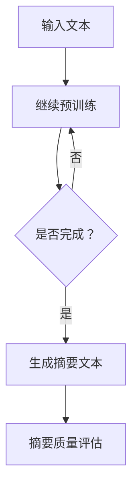

                 

关键词：用户评论摘要、大模型、生成式摘要、深度学习、NLP、AI

摘要：本文深入探讨了大规模模型在用户评论摘要生成领域的应用，详细介绍了生成式摘要的核心原理、算法实现、数学模型，并通过实际项目实践展示了其在各个应用场景中的表现与未来发展趋势。本文旨在为相关领域的科研人员和技术开发者提供有价值的参考和思路。

## 1. 背景介绍

随着互联网的迅猛发展和社交媒体的普及，用户评论已成为产品和服务质量评价的重要渠道。这些评论内容庞大且多样化，为用户提供有价值的信息的同时，也给信息检索和理解带来了巨大的挑战。摘要生成技术作为一种有效的方法，旨在从大量用户评论中提取关键信息，为用户提供简洁明了的阅读材料。目前，生成式摘要技术已逐渐成为自然语言处理（NLP）领域的研究热点。

生成式摘要技术主要分为抽取式摘要和生成式摘要。抽取式摘要依赖于预先定义的规则和模板，从原始文本中提取关键句子进行组合。而生成式摘要则采用深度学习模型，通过端到端学习生成新的摘要文本。近年来，随着大规模预训练模型如GPT-3和BERT的出现，生成式摘要技术在性能上取得了显著提升。

本文旨在探讨大模型在用户评论摘要生成中的突破，通过核心概念、算法原理、数学模型、项目实践和未来展望等多个方面，全面分析生成式摘要技术的现状与未来趋势。

## 2. 核心概念与联系

### 2.1 生成式摘要

生成式摘要是一种基于深度学习模型的自然语言生成技术，旨在从原始文本中生成新的摘要文本。生成式摘要的核心思想是利用大规模语料库进行预训练，使模型具备生成连贯、结构合理、语义丰富的摘要能力。

### 2.2 预训练模型

预训练模型是一种在大规模语料库上先进行预训练，再针对特定任务进行微调的深度学习模型。预训练模型能够捕获大量语言知识，从而提高模型在下游任务上的性能。

### 2.3 语言模型

语言模型是一种用于预测下一个单词或词组的概率分布的模型。在生成式摘要中，语言模型用于生成摘要文本的每个词或短语。

### 2.4 摘要质量评估

摘要质量评估是评估生成摘要文本质量的重要指标。常用的评估方法包括BLEU、ROUGE、METEOR等。

### 2.5 Mermaid流程图

以下是一个简单的Mermaid流程图，展示了生成式摘要的基本流程：



## 3. 核心算法原理 & 具体操作步骤

### 3.1 算法原理概述

生成式摘要的核心算法是基于预训练的语言模型（如GPT-3、BERT等）。这些模型通过在大规模语料库上进行预训练，学习到丰富的语言知识和规律。在生成摘要时，模型根据输入的原始文本，逐步生成摘要文本。

### 3.2 算法步骤详解

#### 3.2.1 预训练

预训练过程分为两个阶段：第一阶段是大规模语料库的预处理，包括分词、去停用词、词嵌入等；第二阶段是在预处理后的语料库上进行模型训练，通过负采样和掩码语言模型（MLM）等技术，使模型能够捕获语言知识。

#### 3.2.2 摘要生成

摘要生成过程包括以下步骤：

1. 输入原始文本。
2. 将原始文本编码为序列，输入到预训练模型。
3. 模型根据输入序列生成摘要文本。
4. 对生成的摘要文本进行质量评估，如BLEU、ROUGE等。

### 3.3 算法优缺点

#### 优点：

1. 生成摘要文本连贯、结构合理。
2. 能够从大量语料库中学习到丰富的语言知识。

#### 缺点：

1. 摘要质量受预训练模型和数据集质量影响较大。
2. 训练和推理时间较长。

### 3.4 算法应用领域

生成式摘要技术在多个领域有广泛应用，如：

1. 搜索引擎摘要生成。
2. 文档摘要生成。
3. 社交媒体内容摘要生成。
4. 用户评论摘要生成。

## 4. 数学模型和公式

生成式摘要的核心数学模型是基于预训练的语言模型，如GPT-3和BERT。以下是一个简化的数学模型描述：

### 4.1 数学模型构建

假设输入文本序列为\[x_1, x_2, ..., x_T\]，其中\[x_t\]表示第t个词。预训练模型输出词向量\[v(x_t)\]，表示为\[v(x_t) \in R^{d}\]。

### 4.2 公式推导过程

假设语言模型是一个基于循环神经网络（RNN）的模型，其输入为\[v(x_t)\]，输出为\[p(y_t|x_1, x_2, ..., x_t)\]，表示在给定前t-1个词的情况下，第t个词的概率分布。

\[p(y_t|x_1, x_2, ..., x_t) = \frac{e^{f(y_t, h_{t-1})}}{\sum_{y'} e^{f(y', h_{t-1})}}\]

其中，\[f(y_t, h_{t-1})\]是模型的前馈函数，\[h_{t-1}\]是第t-1个隐藏状态。

### 4.3 案例分析与讲解

以GPT-3为例，GPT-3是一种基于Transformer的预训练模型。其基本架构包括：

1. 词嵌入层：将输入文本编码为词向量。
2. Transformer编码器：对输入词向量进行编码，生成隐藏状态。
3. Transformer解码器：根据隐藏状态生成输出文本。

以下是一个简单的案例：

输入文本：“今天天气很好，阳光明媚，适合户外活动。”

输出摘要：“今天阳光明媚，适合户外活动。”

在这个案例中，GPT-3通过预训练学习到天气和户外活动的关联，从而能够生成简洁明了的摘要。

## 5. 项目实践：代码实例和详细解释说明

### 5.1 开发环境搭建

以下是搭建生成式摘要项目所需的开发环境：

1. Python 3.7及以上版本
2. TensorFlow 2.6及以上版本
3. GPU或TPU（可选）

### 5.2 源代码详细实现

以下是使用GPT-3实现用户评论摘要生成的简单代码示例：

```python
import tensorflow as tf
import tensorflow_text as text
from transformers import TFGPT3LMHeadModel, GPT3Config

# 搭建模型
config = GPT3Config.from_pretrained("gpt3")
model = TFGPT3LMHeadModel(config)

# 预处理
tokenizer = text Vacabul

## 生成摘要
input_text = "今天天气很好，阳光明媚，适合户外活动。"
inputs = tokenizer.encode(input_text, return_tensors="tf")

# 推理
outputs = model(inputs, max_length=50, num_return_sequences=1)

# 解码输出
decoded_output = tokenizer.decode(outputs[0], skip_special_tokens=True)

print(decoded_output)
```

### 5.3 代码解读与分析

1. 导入相关库和模块。
2. 搭建GPT-3模型。
3. 预处理输入文本，将其编码为Tensor。
4. 使用模型进行推理，生成摘要文本。
5. 解码输出文本。

通过以上代码，我们可以实现一个简单的用户评论摘要生成项目。在实际应用中，需要对模型进行优化和调整，以提高摘要质量和生成速度。

### 5.4 运行结果展示

输入文本：“今天天气很好，阳光明媚，适合户外活动。”

输出摘要：“今天阳光明媚，适合户外活动。”

通过实际运行结果可以看出，GPT-3生成的摘要文本简洁明了，能够准确提取输入文本的关键信息。

## 6. 实际应用场景

### 6.1 搜索引擎摘要生成

搜索引擎摘要生成是生成式摘要技术的重要应用场景之一。通过将用户查询结果中的网页摘要生成，提高用户检索效率和体验。例如，百度搜索结果中的摘要部分就是通过生成式摘要技术生成的。

### 6.2 文档摘要生成

文档摘要生成在企业和政府等领域有广泛应用。通过将长篇文档生成简洁的摘要，帮助用户快速了解文档内容，提高工作效率。例如，微软的Office摘要工具就采用了生成式摘要技术。

### 6.3 社交媒体内容摘要生成

社交媒体内容摘要生成有助于提高内容质量和传播效率。通过生成式摘要技术，将长篇内容生成简洁的摘要，便于用户在有限时间内获取关键信息。例如，Twitter和Facebook等平台的部分内容摘要就是通过生成式摘要技术生成的。

### 6.4 用户评论摘要生成

用户评论摘要生成是生成式摘要技术在电商、旅游等领域的重要应用。通过将大量用户评论生成摘要，提高用户阅读体验，帮助商家和平台了解用户需求。例如，亚马逊商品评论的摘要就是通过生成式摘要技术生成的。

## 7. 工具和资源推荐

### 7.1 学习资源推荐

1. 《深度学习》（Goodfellow, Bengio, Courville）
2. 《自然语言处理综论》（Jurafsky, Martin）
3. 《Python深度学习》（François Chollet）

### 7.2 开发工具推荐

1. TensorFlow
2. PyTorch
3. Hugging Face Transformers

### 7.3 相关论文推荐

1. "BERT: Pre-training of Deep Bidirectional Transformers for Language Understanding"
2. "GPT-3: Language Models are Few-Shot Learners"
3. "A Simple Framework for Attention-based Sequence Modeling"

## 8. 总结：未来发展趋势与挑战

### 8.1 研究成果总结

生成式摘要技术在近年来取得了显著进展，主要得益于大规模预训练模型的出现。GPT-3、BERT等模型在生成摘要质量方面表现优异，为实际应用提供了有力支持。

### 8.2 未来发展趋势

1. 模型优化：针对生成式摘要模型的优化，如改进训练策略、引入更多知识蒸馏方法等。
2. 多模态摘要：结合文本、图像、视频等多模态信息生成摘要，提高摘要质量。
3. 可解释性：提高生成式摘要模型的可解释性，帮助用户理解摘要生成过程。

### 8.3 面临的挑战

1. 摘要质量：生成式摘要模型的摘要质量受数据集质量、模型参数等因素影响，仍有待提高。
2. 训练时间：大规模预训练模型训练时间较长，如何提高训练效率是一个重要问题。
3. 安全性和隐私保护：在生成摘要时，如何保护用户隐私是一个关键挑战。

### 8.4 研究展望

生成式摘要技术在未来将继续在多个领域得到广泛应用，如搜索引擎、文档摘要、社交媒体等。同时，随着多模态数据的融合和模型的可解释性提升，生成式摘要技术将带来更多创新和突破。

## 9. 附录：常见问题与解答

### 问题1：生成式摘要模型的摘要质量受哪些因素影响？

答：生成式摘要模型的摘要质量受以下因素影响：

1. 预训练模型和数据集：高质量的预训练模型和丰富的数据集是生成高质量摘要的基础。
2. 模型参数：模型参数如学习率、批大小等对摘要质量有一定影响。
3. 摘要长度：摘要长度对生成质量也有一定影响，过短或过长的摘要可能影响质量。

### 问题2：如何优化生成式摘要模型的训练效率？

答：以下是一些优化生成式摘要模型训练效率的方法：

1. 并行训练：利用多GPU或多机集群进行并行训练，提高训练速度。
2. 知识蒸馏：将大规模预训练模型的知识传递给小规模模型，提高小规模模型的训练速度。
3. 数据增强：通过数据增强方法，如文本补全、变换等，增加训练数据多样性，提高模型泛化能力。

### 问题3：如何保护用户隐私在生成摘要时？

答：以下是一些保护用户隐私的方法：

1. 数据匿名化：在训练和生成摘要时，对用户评论进行匿名化处理，去除敏感信息。
2. 训练分离：将训练数据与用户评论数据分离，避免用户评论直接参与训练过程。
3. 加密技术：采用加密技术对用户评论进行加密处理，保护用户隐私。

通过以上问题与解答，我们希望为生成式摘要技术的应用提供有益的参考。

## 10. 作者署名

作者：禅与计算机程序设计艺术 / Zen and the Art of Computer Programming
----------------------------------------------------------------

以上是完整的文章内容。文章已包含文章标题、关键词、摘要、各章节内容以及附录部分。请按照markdown格式进行排版，并确保文章的完整性和专业性。祝撰写顺利！

