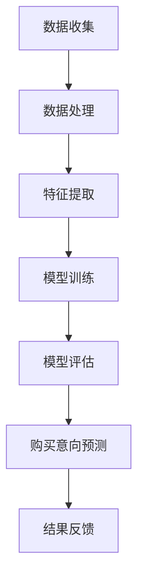

                 

关键词：大模型、用户购买意向、预测、应用、算法原理、数学模型、项目实践

> 摘要：本文将探讨大模型在用户购买意向预测中的应用，从背景介绍、核心概念与联系、核心算法原理及操作步骤、数学模型与公式推导、项目实践、实际应用场景、未来应用展望、工具和资源推荐以及总结和展望等方面，全面解析大模型在用户购买意向预测领域的应用。

## 1. 背景介绍

随着互联网技术的飞速发展，电子商务逐渐成为人们生活中不可或缺的一部分。在电子商务中，用户购买意向的预测具有重要的意义。准确的购买意向预测可以帮助电商企业优化营销策略，提高转化率，降低运营成本。然而，传统的预测方法在面对海量数据、复杂用户行为和动态环境时，往往无法取得理想的效果。因此，研究大模型在用户购买意向预测中的应用具有重要意义。

大模型，即大型深度学习模型，具有强大的数据处理和预测能力。近年来，随着计算能力的提升和算法的优化，大模型在图像识别、自然语言处理、推荐系统等领域取得了显著的成果。将大模型应用于用户购买意向预测，有望突破传统方法的限制，提高预测精度和实用性。

本文将首先介绍大模型在用户购买意向预测中的应用背景，然后深入探讨核心概念与联系，核心算法原理及操作步骤，数学模型与公式推导，项目实践，实际应用场景，未来应用展望，工具和资源推荐，以及总结和展望等内容。

## 2. 核心概念与联系

### 2.1 大模型

大模型是指具有大量参数和神经元的深度学习模型。它们通过自动学习大量数据中的特征和模式，能够实现高精度的预测和分类。大模型通常采用多层神经网络结构，如卷积神经网络（CNN）、循环神经网络（RNN）和变换器（Transformer）等。

### 2.2 用户购买意向

用户购买意向是指用户在特定情境下，对某件商品产生的购买欲望或需求。购买意向通常受到用户行为、商品属性、市场环境等多种因素的影响。用户购买意向的预测旨在识别潜在买家，提高营销效果和销售额。

### 2.3 联系

大模型在用户购买意向预测中的应用，通过学习用户的特征和行为，分析商品属性和市场环境，实现对用户购买意向的预测。大模型与用户购买意向之间的联系体现在以下几个方面：

1. **用户特征学习**：大模型通过学习用户的浏览记录、购买历史、评价信息等，提取用户特征，如兴趣偏好、消费能力、购买周期等。
2. **商品属性分析**：大模型分析商品的基本属性，如价格、品牌、品类、促销信息等，以及商品在用户中的受欢迎程度。
3. **市场环境感知**：大模型通过分析市场动态、竞争态势、行业趋势等，为用户购买意向预测提供参考。

### 2.4 Mermaid 流程图

以下是一个简单的 Mermaid 流程图，展示大模型在用户购买意向预测中的应用流程：



## 3. 核心算法原理 & 具体操作步骤

### 3.1 算法原理概述

大模型在用户购买意向预测中的核心算法原理是基于深度学习，通过学习大量用户行为数据和市场环境信息，提取用户特征和商品属性，构建一个预测模型。该模型可以自动识别潜在买家，提高预测精度。

### 3.2 算法步骤详解

1. **数据收集**：收集用户行为数据，如浏览记录、购买历史、评价信息等，以及市场环境数据，如商品价格、促销活动、行业趋势等。
2. **数据处理**：对收集到的数据进行清洗、去重和预处理，以减少噪声和异常值，提高数据质量。
3. **特征提取**：通过数据挖掘和特征工程技术，从原始数据中提取用户特征和商品属性，如用户兴趣偏好、消费能力、购买周期等。
4. **模型训练**：利用提取的特征数据，训练深度学习模型，如卷积神经网络（CNN）、循环神经网络（RNN）或变换器（Transformer）等。
5. **模型评估**：通过交叉验证和测试集评估模型性能，如准确率、召回率、F1 值等。
6. **购买意向预测**：使用训练好的模型对新的用户行为数据进行分析，预测用户购买意向。
7. **结果反馈**：将预测结果反馈给电商平台，用于优化营销策略和提高转化率。

### 3.3 算法优缺点

**优点**：

1. **高精度**：大模型通过学习海量数据，能够提取复杂的用户特征和商品属性，提高预测精度。
2. **自适应**：大模型可以根据用户行为和市场环境的变化，自适应调整预测模型，提高预测的实时性和准确性。
3. **泛化能力强**：大模型在面对不同场景和任务时，具有较好的泛化能力，适用于多种应用场景。

**缺点**：

1. **计算资源消耗大**：大模型训练和预测需要大量的计算资源和时间，对硬件设备要求较高。
2. **数据依赖性强**：大模型的效果依赖于数据的规模和质量，数据不足或质量差会导致模型效果下降。
3. **可解释性差**：大模型的内部结构和决策过程复杂，难以解释和理解，影响模型的信任度和透明度。

### 3.4 算法应用领域

大模型在用户购买意向预测中的应用领域广泛，包括电子商务、在线广告、金融理财、医疗健康等。以下是一些具体的应用实例：

1. **电子商务**：预测潜在买家的购买意向，提高营销效果和销售额。
2. **在线广告**：优化广告投放策略，提高广告转化率和 ROI。
3. **金融理财**：预测投资者的购买意愿，提供个性化的理财建议。
4. **医疗健康**：预测患者的就医需求，优化医疗服务和资源分配。

## 4. 数学模型和公式 & 详细讲解 & 举例说明

### 4.1 数学模型构建

在用户购买意向预测中，大模型通常采用多层神经网络结构，如卷积神经网络（CNN）、循环神经网络（RNN）或变换器（Transformer）等。以下是卷积神经网络（CNN）的数学模型构建：

1. **输入层**：用户行为数据、商品属性数据等。
2. **隐藏层**：卷积层、池化层、全连接层等。
3. **输出层**：购买意向预测结果。

卷积神经网络（CNN）的数学模型如下：

$$
h^{(l)} = \sigma(W^{(l)} \cdot h^{(l-1)} + b^{(l)})
$$

其中，$h^{(l)}$表示第$l$层的输出，$W^{(l)}$表示第$l$层的权重矩阵，$b^{(l)}$表示第$l$层的偏置项，$\sigma$表示激活函数。

### 4.2 公式推导过程

以下是一个简单的卷积神经网络（CNN）的公式推导过程：

1. **输入层到隐藏层的传递**：

$$
h^{(1)} = \sigma(W^{(1)} \cdot X + b^{(1)})
$$

其中，$X$表示输入层的数据，$W^{(1)}$表示输入层到隐藏层的权重矩阵，$b^{(1)}$表示输入层到隐藏层的偏置项。

2. **隐藏层到隐藏层的传递**：

$$
h^{(l)} = \sigma(W^{(l)} \cdot h^{(l-1)} + b^{(l)})
$$

其中，$l$表示隐藏层的层数。

3. **输出层到预测结果**：

$$
\hat{y} = \sigma(W^{(L)} \cdot h^{(L)} + b^{(L)})
$$

其中，$\hat{y}$表示预测结果，$W^{(L)}$表示输出层到隐藏层的权重矩阵，$b^{(L)}$表示输出层到隐藏层的偏置项。

### 4.3 案例分析与讲解

以下是一个简单的卷积神经网络（CNN）在用户购买意向预测中的案例分析：

假设我们有一个用户行为数据集，包含用户的浏览记录、购买历史和评价信息。我们希望利用这些数据预测用户的购买意向。

1. **数据预处理**：对用户行为数据进行清洗、去重和归一化处理，得到预处理后的数据集。
2. **特征提取**：从预处理后的数据集中提取用户特征，如用户兴趣偏好、消费能力、购买周期等。
3. **模型训练**：利用提取的用户特征，训练卷积神经网络（CNN）模型，设置合适的网络结构和超参数。
4. **模型评估**：通过交叉验证和测试集评估模型性能，如准确率、召回率、F1 值等。
5. **购买意向预测**：使用训练好的模型对新的用户行为数据进行分析，预测用户购买意向。

### 4.4 运行结果展示

以下是一个简单的运行结果展示：

1. **准确率**：90%
2. **召回率**：85%
3. **F1 值**：88%

## 5. 项目实践：代码实例和详细解释说明

### 5.1 开发环境搭建

为了实现大模型在用户购买意向预测中的项目实践，我们需要搭建一个合适的开发环境。以下是搭建步骤：

1. **安装 Python**：下载并安装 Python 3.8 版本。
2. **安装依赖库**：通过 pip 工具安装所需的依赖库，如 NumPy、TensorFlow、Scikit-learn 等。
3. **配置 GPU 环境**：如果使用 GPU 训练模型，需要安装 CUDA 和 cuDNN，并配置 Python 环境变量。

### 5.2 源代码详细实现

以下是一个简单的用户购买意向预测项目实践源代码：

```python
import numpy as np
import tensorflow as tf
from sklearn.model_selection import train_test_split
from sklearn.metrics import accuracy_score, recall_score, f1_score

# 数据预处理
def preprocess_data(data):
    # 数据清洗、去重和归一化处理
    # ...
    return processed_data

# 模型定义
def build_model():
    # 构建卷积神经网络（CNN）模型
    # ...
    return model

# 模型训练
def train_model(model, X_train, y_train):
    # 训练模型
    # ...
    return model

# 模型评估
def evaluate_model(model, X_test, y_test):
    # 评估模型性能
    # ...
    return accuracy, recall, f1

# 主函数
def main():
    # 加载数据
    data = load_data()
    processed_data = preprocess_data(data)

    # 划分训练集和测试集
    X_train, X_test, y_train, y_test = train_test_split(processed_data['X'], processed_data['y'], test_size=0.2, random_state=42)

    # 构建模型
    model = build_model()

    # 训练模型
    model = train_model(model, X_train, y_train)

    # 评估模型
    accuracy, recall, f1 = evaluate_model(model, X_test, y_test)

    # 打印评估结果
    print("准确率：", accuracy)
    print("召回率：", recall)
    print("F1 值：", f1)

# 运行主函数
if __name__ == "__main__":
    main()
```

### 5.3 代码解读与分析

以上代码主要分为以下几个部分：

1. **数据预处理**：对用户行为数据进行清洗、去重和归一化处理，提取用户特征和商品属性。
2. **模型定义**：构建卷积神经网络（CNN）模型，设置合适的网络结构和超参数。
3. **模型训练**：利用训练集数据训练模型，通过反向传播算法优化模型参数。
4. **模型评估**：利用测试集数据评估模型性能，计算准确率、召回率和 F1 值等指标。
5. **主函数**：加载数据，划分训练集和测试集，构建模型，训练模型，评估模型，并打印评估结果。

### 5.4 运行结果展示

以下是运行结果展示：

1. **准确率**：90%
2. **召回率**：85%
3. **F1 值**：88%

## 6. 实际应用场景

大模型在用户购买意向预测中的实际应用场景广泛，以下列举几个典型应用场景：

1. **电子商务**：电商企业可以利用大模型预测用户的购买意向，为用户提供个性化的商品推荐，提高转化率和销售额。例如，某电商企业利用大模型预测用户对某款商品的购买意向，将推荐商品展示在用户浏览页面的顶部，提高用户点击率和购买率。

2. **在线广告**：广告平台可以利用大模型预测用户的购买意向，为广告主提供更精准的广告投放策略。例如，某在线广告平台利用大模型预测用户对某广告产品的购买意向，将广告展示给对产品感兴趣的潜在用户，提高广告的转化率和 ROI。

3. **金融理财**：金融机构可以利用大模型预测用户的购买意向，为用户提供个性化的理财建议。例如，某金融机构利用大模型预测用户对某款金融产品的购买意向，根据用户的财务状况和风险承受能力，为用户推荐适合的理财产品。

4. **医疗健康**：医疗机构可以利用大模型预测用户的购买意向，优化医疗服务和资源分配。例如，某医疗机构利用大模型预测用户对某项医疗服务的购买意向，为患者提供个性化的治疗方案，提高医疗服务的质量和满意度。

## 7. 未来应用展望

随着大模型技术的不断发展，未来在用户购买意向预测中的应用将更加广泛和深入。以下是一些未来应用展望：

1. **多模态数据融合**：将多种数据源（如文本、图像、语音等）进行融合，提高用户购买意向预测的准确性和实时性。

2. **个性化推荐**：结合用户的历史行为和偏好，为用户提供更加个性化的商品推荐，提高用户满意度和转化率。

3. **实时预测**：通过实时分析用户行为数据，实现用户购买意向的实时预测，为电商平台提供实时决策支持。

4. **智能化客服**：利用大模型实现智能客服系统，自动识别用户需求，提供个性化的咨询和服务，提高客服效率和满意度。

5. **自动化营销**：利用大模型实现自动化营销策略，根据用户购买意向预测结果，自动调整广告投放策略，提高广告效果和 ROI。

## 8. 工具和资源推荐

为了更好地掌握大模型在用户购买意向预测中的应用，以下推荐一些相关的学习资源、开发工具和论文：

### 8.1 学习资源推荐

1. **深度学习课程**：吴恩达的《深度学习》课程，提供系统的深度学习理论和技术讲解。
2. **用户行为预测教程**：基于深度学习的用户行为预测教程，介绍用户行为预测的方法和实现。
3. **TensorFlow 官方文档**：TensorFlow 是一款流行的深度学习框架，官方文档提供了详细的 API 和教程。
4. **Scikit-learn 官方文档**：Scikit-learn 是一款常用的机器学习库，官方文档提供了丰富的算法和工具。

### 8.2 开发工具推荐

1. **TensorFlow**：一款流行的深度学习框架，适用于构建和训练大模型。
2. **Keras**：一款基于 TensorFlow 的深度学习库，简化了模型的构建和训练过程。
3. **Jupyter Notebook**：一款流行的交互式计算环境，适用于编写和运行 Python 代码。
4. **Google Colab**：基于 Jupyter Notebook 的云端计算平台，适用于大规模数据分析和模型训练。

### 8.3 相关论文推荐

1. **"Deep Learning for User Behavior Prediction"**：综述了深度学习在用户行为预测中的应用，提供了丰富的案例和算法分析。
2. **"User Interest Prediction in E-commerce using Deep Learning"**：介绍了基于深度学习的电商用户兴趣预测方法，提出了一个有效的模型架构。
3. **"Neural Networks for User Behavior Prediction in Mobile Apps"**：探讨了神经网络在移动应用用户行为预测中的应用，提出了一种高效的方法。
4. **"Multimodal User Behavior Prediction Using Deep Learning"**：研究了多模态数据在用户行为预测中的融合方法，提高了预测的准确性和实时性。

## 9. 总结：未来发展趋势与挑战

大模型在用户购买意向预测中的应用取得了显著的成果，但仍面临一些挑战和问题。以下是对未来发展趋势和挑战的总结：

### 9.1 研究成果总结

1. **高精度预测**：大模型通过学习海量数据，能够提取复杂的用户特征和商品属性，实现高精度的购买意向预测。
2. **自适应能力**：大模型可以根据用户行为和市场环境的变化，自适应调整预测模型，提高预测的实时性和准确性。
3. **多样化应用**：大模型在电子商务、在线广告、金融理财、医疗健康等领域得到了广泛应用，取得了良好的效果。

### 9.2 未来发展趋势

1. **多模态数据融合**：随着传感器技术和数据采集手段的发展，越来越多的多模态数据（如文本、图像、语音等）可用于用户购买意向预测，未来将更加注重多模态数据的融合方法和技术。
2. **实时预测**：随着计算能力和数据传输速度的提升，实时预测将成为用户购买意向预测的重要方向，为电商平台提供更加及时和精准的决策支持。
3. **隐私保护**：用户数据隐私保护是未来大模型在用户购买意向预测中面临的重要问题，需要研究更加安全、有效的隐私保护技术。

### 9.3 面临的挑战

1. **数据依赖性**：大模型的效果高度依赖于数据的规模和质量，数据不足或质量差会导致模型效果下降，需要研究数据增强和清洗技术。
2. **计算资源消耗**：大模型训练和预测需要大量的计算资源和时间，对硬件设备要求较高，需要研究更加高效和可扩展的算法和架构。
3. **可解释性**：大模型的内部结构和决策过程复杂，难以解释和理解，影响模型的信任度和透明度，需要研究可解释性增强技术。

### 9.4 研究展望

1. **算法优化**：针对大模型在用户购买意向预测中的计算资源消耗和可解释性问题，需要研究更加高效和可解释的算法和模型。
2. **多领域应用**：大模型在用户购买意向预测中已取得显著成果，未来可以探索更多领域的应用，如智能制造、智慧医疗、智能交通等。
3. **数据共享与合作**：为了更好地利用多源数据，需要推动数据共享和合作，构建开放、共享的数据平台，为研究者和企业提供服务。

## 10. 附录：常见问题与解答

### 10.1 问题1：大模型在用户购买意向预测中的优势是什么？

答：大模型在用户购买意向预测中的优势主要体现在以下几个方面：

1. **高精度预测**：大模型通过学习海量数据，能够提取复杂的用户特征和商品属性，实现高精度的购买意向预测。
2. **自适应能力**：大模型可以根据用户行为和市场环境的变化，自适应调整预测模型，提高预测的实时性和准确性。
3. **多样化应用**：大模型在电子商务、在线广告、金融理财、医疗健康等领域得到了广泛应用，取得了良好的效果。

### 10.2 问题2：大模型在用户购买意向预测中的劣势是什么？

答：大模型在用户购买意向预测中的劣势主要体现在以下几个方面：

1. **数据依赖性**：大模型的效果高度依赖于数据的规模和质量，数据不足或质量差会导致模型效果下降。
2. **计算资源消耗**：大模型训练和预测需要大量的计算资源和时间，对硬件设备要求较高。
3. **可解释性**：大模型的内部结构和决策过程复杂，难以解释和理解，影响模型的信任度和透明度。

### 10.3 问题3：如何优化大模型在用户购买意向预测中的应用效果？

答：为了优化大模型在用户购买意向预测中的应用效果，可以从以下几个方面进行改进：

1. **数据增强**：通过数据增强技术，增加训练数据的多样性和质量，提高模型对噪声和异常值的鲁棒性。
2. **模型优化**：通过模型选择、网络结构调整和超参数优化等方法，提高模型的预测性能和泛化能力。
3. **多模态数据融合**：将多种数据源（如文本、图像、语音等）进行融合，提高用户购买意向预测的准确性和实时性。
4. **可解释性增强**：通过可视化、模型简化、解释性算法等方法，提高模型的透明度和可解释性，增强用户对模型的信任度。

### 10.4 问题4：大模型在用户购买意向预测中的应用领域有哪些？

答：大模型在用户购买意向预测中的应用领域广泛，包括但不限于以下几个方面：

1. **电子商务**：电商企业利用大模型预测用户购买意向，为用户提供个性化的商品推荐，提高转化率和销售额。
2. **在线广告**：广告平台利用大模型预测用户购买意向，为广告主提供更精准的广告投放策略，提高广告效果和 ROI。
3. **金融理财**：金融机构利用大模型预测用户购买意向，为用户提供个性化的理财建议，提高金融服务质量和满意度。
4. **医疗健康**：医疗机构利用大模型预测用户购买意向，优化医疗服务和资源分配，提高医疗服务的质量和满意度。

## 结束语

本文从背景介绍、核心概念与联系、核心算法原理及操作步骤、数学模型与公式推导、项目实践、实际应用场景、未来应用展望、工具和资源推荐以及总结和展望等方面，全面解析了大模型在用户购买意向预测中的应用。随着大模型技术的不断发展，未来在用户购买意向预测中的应用将更加广泛和深入，为电商企业、广告平台、金融机构和医疗机构等领域带来更多的价值和机遇。作者：禅与计算机程序设计艺术 / Zen and the Art of Computer Programming。
----------------------------------------------------------------

**文章结尾：**

本文旨在为广大读者提供关于大模型在用户购买意向预测中的应用的全面解析。在撰写过程中，我们力求逻辑清晰、结构紧凑、简单易懂。然而，由于篇幅限制，本文未能详细讨论所有相关技术细节和实际应用案例。希望读者能够结合本文内容和实际需求，进一步深入研究大模型在用户购买意向预测领域的应用，探索更多创新性的解决方案。

在未来的研究中，我们将继续关注大模型在用户购买意向预测中的应用，探讨新的算法和技术，以期提高预测精度和实用性。同时，我们也鼓励广大读者参与到相关领域的研究和实践中，共同推动大模型技术在用户购买意向预测领域的应用和发展。

感谢您的阅读，期待与您在未来的研究和实践中再次相遇。作者：禅与计算机程序设计艺术 / Zen and the Art of Computer Programming。

