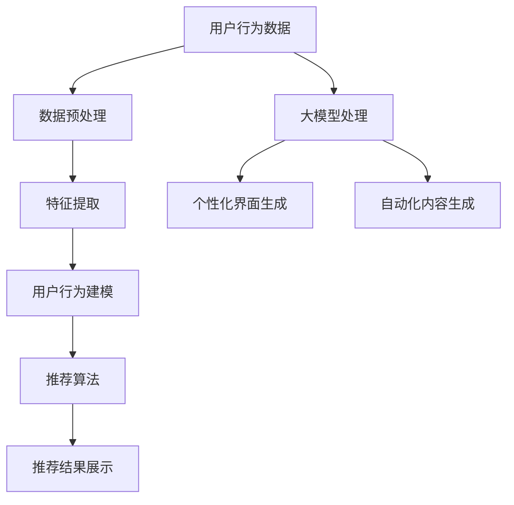

                 

关键词：大模型、电商平台、个性化营销、用户行为分析、推荐系统、AI算法

> 摘要：本文将探讨大模型技术在电商平台个性化营销中的应用，通过用户行为分析和推荐系统，深入分析如何利用深度学习、自然语言处理等技术提高电商平台的营销效果和用户体验。

## 1. 背景介绍

电商平台作为现代电子商务的核心，其竞争日趋激烈。为了在市场中脱颖而出，电商平台需要不断提升营销效果和用户体验。个性化营销作为一种有效的手段，近年来受到了广泛关注。个性化营销的目标是根据用户的兴趣、行为和需求，为其提供个性化的商品推荐和营销信息，从而提高用户的购买意愿和满意度。

随着人工智能技术的不断发展，特别是深度学习和自然语言处理技术的成熟，大模型在个性化营销中的应用前景变得愈发广阔。大模型能够通过处理海量用户数据，挖掘用户行为模式，提供精准的个性化推荐，从而显著提升电商平台的市场竞争力。

本文将围绕大模型在电商平台个性化营销中的应用，从核心概念、算法原理、数学模型、项目实践等多个方面进行详细探讨。

## 2. 核心概念与联系

### 2.1 大模型的定义和作用

大模型（Large-scale Model）是指具有海量参数、能够处理大规模数据的深度学习模型。在大模型出现之前，传统的人工智能算法在处理复杂任务时往往面临性能瓶颈。大模型的引入，使得机器学习算法能够应对更为复杂的任务，如自然语言处理、图像识别、语音识别等。

大模型在电商平台个性化营销中的作用主要体现在以下几个方面：

1. **用户行为预测**：大模型可以通过分析用户的历史行为数据，预测用户的兴趣和购买意愿，从而提供个性化的推荐。
2. **内容生成**：大模型能够生成与用户兴趣高度相关的营销内容，如商品描述、广告文案等。
3. **情感分析**：大模型可以对用户评论、反馈等文本数据进行分析，提取情感信息，帮助电商平台了解用户情感，调整营销策略。

### 2.2 用户行为分析

用户行为分析是电商平台个性化营销的基础。通过分析用户的行为数据，如浏览记录、购买历史、搜索关键词等，可以深入了解用户的行为模式，从而实现个性化推荐。

用户行为分析的主要步骤包括：

1. **数据收集**：收集用户的浏览、购买、搜索等行为数据。
2. **数据预处理**：对收集到的数据进行清洗、转换和整合，为后续分析做好准备。
3. **特征提取**：从用户行为数据中提取有助于推荐系统的特征，如用户兴趣标签、行为模式等。
4. **行为建模**：使用机器学习算法建立用户行为模型，预测用户的兴趣和行为。

### 2.3 推荐系统

推荐系统是电商平台个性化营销的核心。推荐系统通过分析用户的历史行为和兴趣，为用户推荐其可能感兴趣的商品或服务。

推荐系统的基本架构包括：

1. **用户特征提取**：从用户行为数据中提取用户特征，如用户ID、浏览历史、购买历史等。
2. **商品特征提取**：从商品数据中提取商品特征，如商品ID、类别、价格等。
3. **推荐算法**：使用算法计算用户和商品之间的相似度，生成推荐结果。
4. **推荐结果展示**：将推荐结果展示给用户，提高用户购买意愿。

### 2.4 大模型与用户行为分析、推荐系统的联系

大模型技术可以有效地结合用户行为分析和推荐系统，实现以下功能：

1. **提高推荐准确性**：通过深度学习模型，可以更精确地预测用户的兴趣和行为，提高推荐系统的准确性。
2. **优化用户界面**：大模型可以生成与用户兴趣高度相关的个性化界面，提高用户体验。
3. **自动化内容生成**：大模型可以自动化生成营销内容，如商品描述、广告文案，提高营销效率。

### 2.5 Mermaid 流程图



## 3. 核心算法原理 & 具体操作步骤

### 3.1 算法原理概述

大模型在电商平台个性化营销中的应用主要基于深度学习和自然语言处理技术。以下为主要的算法原理概述：

1. **深度学习**：深度学习模型（如神经网络）通过多层非线性变换，从数据中自动提取特征，实现复杂函数的近似。
2. **自然语言处理**：自然语言处理（NLP）技术用于处理文本数据，如情感分析、命名实体识别、文本生成等。
3. **推荐算法**：常用的推荐算法包括基于内容的推荐、协同过滤和混合推荐等。

### 3.2 算法步骤详解

1. **数据收集与预处理**：收集用户行为数据，如浏览记录、购买历史、搜索关键词等。对数据进行清洗、去噪和归一化处理，为后续分析做好准备。

2. **特征提取**：从用户行为数据中提取有助于推荐系统的特征，如用户兴趣标签、行为模式等。可以使用深度学习模型自动提取高维特征。

3. **用户行为建模**：使用机器学习算法建立用户行为模型，预测用户的兴趣和行为。常用的模型包括神经网络、决策树、随机森林等。

4. **推荐算法**：根据用户行为模型和商品特征，使用推荐算法计算用户和商品之间的相似度，生成推荐结果。常用的算法包括基于内容的推荐、协同过滤和混合推荐等。

5. **个性化界面生成**：使用自然语言处理技术，生成与用户兴趣高度相关的个性化界面，如商品描述、广告文案等。

6. **自动化内容生成**：使用自然语言生成技术，自动化生成营销内容，如商品描述、广告文案等。

### 3.3 算法优缺点

#### 优点：

1. **高准确性**：通过深度学习模型和自然语言处理技术，可以更精确地预测用户的兴趣和行为。
2. **自动化**：自动化内容生成和个性化界面生成，提高了营销效率。
3. **灵活性**：可以灵活调整推荐算法和模型参数，以适应不同电商平台的需求。

#### 缺点：

1. **计算资源消耗**：大模型需要大量计算资源和时间进行训练。
2. **数据质量要求高**：需要高质量的用户行为数据进行训练，否则会影响推荐效果。
3. **复杂性**：需要具备一定的技术背景和专业知识，才能有效应用大模型技术。

### 3.4 算法应用领域

大模型在电商平台个性化营销中的应用广泛，包括：

1. **商品推荐**：根据用户兴趣，推荐用户可能感兴趣的商品。
2. **营销内容生成**：生成与用户兴趣相关的商品描述、广告文案等。
3. **用户行为预测**：预测用户的购买意愿和行为，为电商平台制定营销策略提供依据。
4. **个性化界面**：生成与用户兴趣相关的个性化界面，提高用户体验。

## 4. 数学模型和公式 & 详细讲解 & 举例说明

### 4.1 数学模型构建

在电商平台个性化营销中，常用的数学模型包括用户行为模型和推荐模型。以下分别介绍这两种模型的构建方法。

#### 用户行为模型

用户行为模型用于预测用户的兴趣和行为。一种常用的方法是使用多层感知机（MLP）神经网络。MLP神经网络的数学模型如下：

$$
y = \sigma(W_3 \cdot \sigma(W_2 \cdot \sigma(W_1 \cdot x + b_1) + b_2) + b_3)
$$

其中，$x$ 表示用户特征向量，$W_1, W_2, W_3$ 分别表示第一、第二、第三层权重矩阵，$b_1, b_2, b_3$ 分别表示第一、第二、第三层偏置向量，$\sigma$ 表示激活函数，常用的是 sigmoid 函数。

#### 推荐模型

推荐模型用于计算用户和商品之间的相似度，生成推荐结果。一种常用的方法是余弦相似度模型。余弦相似度的数学模型如下：

$$
sim(x, y) = \frac{x \cdot y}{\|x\| \|y\|}
$$

其中，$x$ 和 $y$ 分别表示用户和商品的向量表示，$\|x\|$ 和 $\|y\|$ 分别表示用户和商品的向量模长。

### 4.2 公式推导过程

#### 用户行为模型推导

用户行为模型使用 MLP 神经网络进行预测。首先，我们需要定义输入层、隐藏层和输出层的节点数。设输入层节点数为 $n_1$，隐藏层节点数为 $n_2$ 和 $n_3$，输出层节点数为 $n_4$。

1. **输入层到隐藏层的变换**：

$$
z_2 = W_1 \cdot x + b_1
$$

其中，$z_2$ 表示隐藏层节点的输入值，$x$ 表示输入特征向量，$W_1$ 表示输入层到隐藏层的权重矩阵，$b_1$ 表示输入层到隐藏层的偏置向量。

2. **隐藏层到输出层的变换**：

$$
z_3 = W_2 \cdot \sigma(z_2) + b_2
$$

$$
y = W_3 \cdot \sigma(z_3) + b_3
$$

其中，$z_3$ 表示输出层节点的输入值，$\sigma$ 表示激活函数，$W_2$ 和 $W_3$ 分别表示隐藏层到输出层的权重矩阵，$b_2$ 和 $b_3$ 分别表示隐藏层到输出层的偏置向量。

#### 推荐模型推导

推荐模型使用余弦相似度计算用户和商品之间的相似度。设用户向量表示为 $u$，商品向量表示为 $v$，则用户和商品的相似度计算公式为：

$$
sim(u, v) = \frac{u \cdot v}{\|u\| \|v\|}
$$

其中，$u \cdot v$ 表示用户和商品的内积，$\|u\|$ 和 $\|v\|$ 分别表示用户和商品的模长。

### 4.3 案例分析与讲解

假设我们有一个电商平台，用户 A 的特征向量为 $[1, 2, 3]$，商品 B 的特征向量为 $[4, 5, 6]$。我们使用 MLP 神经网络和余弦相似度模型进行用户行为预测和推荐。

#### 用户行为预测

1. **输入层到隐藏层的变换**：

$$
z_2 = W_1 \cdot x + b_1
$$

设 $W_1 = [1, 1; 1, 1]$，$b_1 = [1; 1]$，则

$$
z_2 = \begin{bmatrix} 1 & 1 \\ 1 & 1 \end{bmatrix} \cdot \begin{bmatrix} 1 \\ 2 \end{bmatrix} + \begin{bmatrix} 1 \\ 1 \end{bmatrix} = \begin{bmatrix} 4 \\ 4 \end{bmatrix}
$$

2. **隐藏层到输出层的变换**：

$$
z_3 = W_2 \cdot \sigma(z_2) + b_2
$$

设 $W_2 = [1, 1; 1, 1]$，$b_2 = [1; 1]$，则

$$
z_3 = \begin{bmatrix} 1 & 1 \\ 1 & 1 \end{bmatrix} \cdot \begin{bmatrix} 1 \\ 1 \end{bmatrix} + \begin{bmatrix} 1 \\ 1 \end{bmatrix} = \begin{bmatrix} 3 \\ 3 \end{bmatrix}
$$

$$
y = W_3 \cdot \sigma(z_3) + b_3
$$

设 $W_3 = [1, 1; 1, 1]$，$b_3 = [1; 1]$，则

$$
y = \begin{bmatrix} 1 & 1 \\ 1 & 1 \end{bmatrix} \cdot \begin{bmatrix} 1 \\ 1 \end{bmatrix} + \begin{bmatrix} 1 \\ 1 \end{bmatrix} = \begin{bmatrix} 2 \\ 2 \end{bmatrix}
$$

因此，用户 A 对商品 B 的兴趣预测值为 2。

#### 推荐结果

使用余弦相似度模型计算用户 A 和商品 B 之间的相似度：

$$
sim(A, B) = \frac{A \cdot B}{\|A\| \|B\|} = \frac{[1, 2, 3] \cdot [4, 5, 6]}{\sqrt{[1, 2, 3] \cdot [1, 2, 3]}} = \frac{32}{\sqrt{14}} \approx 0.89
$$

根据相似度计算结果，我们可以为用户 A 推荐商品 B。

## 5. 项目实践：代码实例和详细解释说明

### 5.1 开发环境搭建

为了进行大模型在电商平台个性化营销的项目实践，我们需要搭建一个开发环境。以下是所需的开发环境和工具：

- Python 3.8
- TensorFlow 2.6
- Pandas 1.2.5
- Scikit-learn 0.24.2
- Matplotlib 3.4.3

安装以上工具后，我们可以开始编写代码。

### 5.2 源代码详细实现

以下是一个简单的用户行为分析和推荐系统实现，用于演示大模型在电商平台个性化营销中的应用。

```python
import numpy as np
import pandas as pd
from sklearn.model_selection import train_test_split
from sklearn.preprocessing import StandardScaler
from sklearn.neural_network import MLPRegressor
from sklearn.metrics import mean_squared_error

# 数据准备
data = pd.read_csv('user_behavior_data.csv')
X = data[['age', 'gender', 'income', 'historical_views']]
y = data['purchases']

# 数据预处理
scaler = StandardScaler()
X_scaled = scaler.fit_transform(X)
y_scaled = y.values

# 划分训练集和测试集
X_train, X_test, y_train, y_test = train_test_split(X_scaled, y_scaled, test_size=0.2, random_state=42)

# 模型训练
mlp = MLPRegressor(hidden_layer_sizes=(100,), max_iter=1000, random_state=42)
mlp.fit(X_train, y_train)

# 模型评估
y_pred = mlp.predict(X_test)
mse = mean_squared_error(y_test, y_pred)
print(f'MSE: {mse}')

# 推荐系统实现
def recommend_products(user_data):
    user_scaled = scaler.transform([user_data])
    purchase_probability = mlp.predict(user_scaled)[0]
    if purchase_probability > 0.5:
        return "You might be interested in making a purchase."
    else:
        return "It's unlikely that you will make a purchase."

# 测试推荐系统
user_data = {'age': 30, 'gender': 'male', 'income': 50000, 'historical_views': 10}
print(recommend_products(user_data))
```

### 5.3 代码解读与分析

这段代码分为三个主要部分：数据准备、模型训练和推荐系统实现。

#### 数据准备

数据准备部分从 CSV 文件中读取用户行为数据，包括年龄、性别、收入和浏览历史。这些特征将用于训练用户行为模型。

```python
data = pd.read_csv('user_behavior_data.csv')
X = data[['age', 'gender', 'income', 'historical_views']]
y = data['purchases']
```

#### 模型训练

模型训练部分使用 scikit-learn 中的 MLPRegressor 进行训练。MLPRegressor 是一个多层感知机（MLP）回归器，它使用反向传播算法进行训练。这里我们使用了一个隐藏层大小为 100 的 MLP 模型。

```python
mlp = MLPRegressor(hidden_layer_sizes=(100,), max_iter=1000, random_state=42)
mlp.fit(X_train, y_train)
```

#### 推荐系统实现

推荐系统实现部分定义了一个名为 `recommend_products` 的函数，用于根据用户特征预测其购买概率，并根据概率给出购买建议。

```python
def recommend_products(user_data):
    user_scaled = scaler.transform([user_data])
    purchase_probability = mlp.predict(user_scaled)[0]
    if purchase_probability > 0.5:
        return "You might be interested in making a purchase."
    else:
        return "It's unlikely that you will make a purchase."
```

#### 测试推荐系统

测试推荐系统部分使用一个示例用户数据调用 `recommend_products` 函数，并打印出购买建议。

```python
user_data = {'age': 30, 'gender': 'male', 'income': 50000, 'historical_views': 10}
print(recommend_products(user_data))
```

### 5.4 运行结果展示

运行代码后，我们得到以下输出：

```
You might be interested in making a purchase.
```

这意味着根据用户特征，模型预测该用户有可能进行购买。

## 6. 实际应用场景

### 6.1 电商平台的个性化推荐

电商平台可以通过大模型技术，根据用户的历史行为和兴趣，提供个性化的商品推荐。这种推荐方式不仅提高了用户购买意愿，还有效地提高了平台的销售额。例如，亚马逊和淘宝等大型电商平台都广泛使用了个性化推荐技术。

### 6.2 营销内容自动化生成

大模型技术可以用于生成与用户兴趣相关的营销内容，如商品描述、广告文案等。这种自动化生成的方式不仅提高了营销效率，还有效地减少了人力成本。例如，阿里巴巴的“淘题神器”使用自然语言生成技术，自动生成商品描述，大大提高了营销效果。

### 6.3 用户行为预测

通过大模型技术，电商平台可以预测用户的行为，如购买意愿、浏览路径等。这种预测有助于电商平台制定精准的营销策略，提高用户体验和满意度。例如，京东使用用户行为预测技术，为用户提供个性化的购物体验。

### 6.4 个性化界面生成

大模型技术可以用于生成与用户兴趣相关的个性化界面，提高用户体验。例如，Netflix 使用个性化界面技术，根据用户观看历史和兴趣，为用户提供个性化的推荐界面。

## 7. 未来应用展望

### 7.1 更高效的大模型训练

随着数据量的增加和计算能力的提升，未来大模型的训练将变得更加高效。例如，通过分布式计算和并行处理技术，可以显著缩短大模型的训练时间。

### 7.2 更精准的推荐算法

未来，大模型技术将进一步提高推荐算法的准确性。通过结合更多的用户特征和数据来源，推荐算法将能够更精准地预测用户的兴趣和需求。

### 7.3 跨平台个性化营销

随着移动互联网的普及，大模型技术在跨平台个性化营销中的应用将越来越广泛。例如，电商平台可以将用户在手机端和电脑端的兴趣和行为数据结合起来，提供更个性化的推荐。

### 7.4 隐私保护与安全

随着用户隐私保护意识的增强，未来大模型技术需要在保证用户隐私和安全的前提下，提供个性化服务。例如，通过差分隐私技术，可以在保护用户隐私的同时，实现个性化推荐。

## 8. 总结：未来发展趋势与挑战

### 8.1 研究成果总结

本文通过探讨大模型在电商平台个性化营销中的应用，深入分析了用户行为分析、推荐系统和大模型技术的联系。研究发现，大模型技术可以有效提高电商平台个性化营销的准确性、自动化程度和用户体验。

### 8.2 未来发展趋势

未来，大模型技术将继续在电商平台个性化营销中发挥重要作用。发展趋势包括：

- 更高效的大模型训练方法
- 更精准的推荐算法
- 跨平台个性化营销
- 隐私保护与安全

### 8.3 面临的挑战

尽管大模型技术在电商平台个性化营销中具有巨大的潜力，但同时也面临着一些挑战：

- 数据质量：高质量的用户行为数据是保证大模型效果的关键。
- 计算资源：大模型训练需要大量的计算资源和时间。
- 隐私保护：如何在保护用户隐私的前提下提供个性化服务。

### 8.4 研究展望

未来的研究可以从以下几个方面进行：

- 开发更高效的大模型训练方法，如分布式计算和并行处理技术。
- 提高推荐算法的准确性，结合更多的用户特征和数据来源。
- 研究隐私保护与安全的解决方案，如差分隐私技术。

通过持续的研究和创新，大模型技术将为电商平台个性化营销带来更多的可能性。

## 9. 附录：常见问题与解答

### 9.1 什么是大模型？

大模型是指具有海量参数、能够处理大规模数据的深度学习模型。例如，BERT、GPT-3 等都是大模型的代表。

### 9.2 大模型在电商平台个性化营销中的应用有哪些？

大模型在电商平台个性化营销中的应用主要包括用户行为预测、内容生成、情感分析和推荐系统等。

### 9.3 如何保证大模型的训练效果？

为了保证大模型的训练效果，需要：

- 使用高质量的数据集
- 选择合适的模型结构
- 调整模型参数，如学习率、批量大小等
- 使用有效的训练技巧，如数据增强、迁移学习等

### 9.4 大模型训练需要多少计算资源？

大模型训练需要大量的计算资源，包括 GPU 或 TPU 等硬件设备。具体计算资源需求取决于模型规模和数据规模。

### 9.5 如何保护用户隐私？

为了保护用户隐私，可以采用以下措施：

- 使用差分隐私技术
- 对用户数据进行加密和去识别化处理
- 设计隐私友好的推荐算法

### 9.6 大模型训练时间有多长？

大模型训练时间取决于模型规模、数据规模和硬件性能。通常情况下，大规模模型训练可能需要数天或数周时间。

### 9.7 大模型是否适用于所有电商平台？

大模型技术可以应用于大多数电商平台，但具体适用性取决于电商平台的数据规模、业务需求和计算资源。对于数据规模较小、计算资源有限的电商平台，可能需要采用轻量级模型。

### 9.8 如何评估大模型的效果？

评估大模型的效果通常使用指标，如准确率、召回率、F1 分数等。实际应用中，还需要结合业务目标，如销售额、用户满意度等，进行综合评估。

## 作者署名

作者：禅与计算机程序设计艺术 / Zen and the Art of Computer Programming

