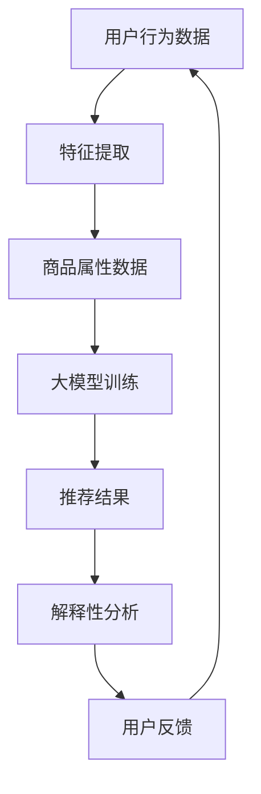

                 

关键词：大模型，电商平台，商品推荐，解释性

摘要：随着电商平台的发展，个性化推荐系统已成为提升用户体验和销售转化的重要手段。本文将探讨大模型在电商平台商品推荐解释中的应用，通过介绍核心概念、算法原理、数学模型以及项目实践，分析其在提升推荐效果和解释性方面的优势，并展望其未来应用前景。

## 1. 背景介绍

电商平台作为电子商务的重要组成部分，近年来呈现出爆发式增长。然而，随着用户数据的爆炸性增长和市场竞争的加剧，如何为用户提供个性化的购物体验已成为电商平台亟需解决的问题。个性化推荐系统作为提升用户体验和销售转化的重要工具，逐渐受到广泛关注。

个性化推荐系统通过分析用户历史行为、兴趣偏好、购买记录等数据，为用户推荐符合其兴趣的商品。传统的推荐算法主要基于协同过滤、内容匹配等基础方法，虽然在一定程度上提升了推荐效果，但存在解释性不足、推荐结果不可解释等问题。

近年来，随着深度学习技术的发展，大模型在推荐系统中得到了广泛应用。大模型能够自动学习复杂的用户行为模式，提供高质量的推荐结果。同时，大模型在解释性方面也有所突破，能够为推荐结果提供一定的解释。本文将探讨大模型在电商平台商品推荐解释中的应用，以期为推荐系统的改进提供新的思路。

## 2. 核心概念与联系

### 2.1 大模型

大模型是指具有大规模参数和计算量的深度学习模型。在推荐系统中，大模型通过学习用户历史行为数据和商品属性数据，能够捕捉用户兴趣和商品特征之间的复杂关系。

### 2.2 电商平台商品推荐

电商平台商品推荐是指根据用户历史行为数据、兴趣偏好、购买记录等信息，为用户推荐符合其兴趣的商品。推荐系统的核心目标是提升用户体验和销售转化。

### 2.3 解释性

解释性是指推荐系统能够为用户提供的推荐结果提供合理的解释。解释性有助于用户理解推荐结果，提高用户对推荐系统的信任度。

### 2.4 Mermaid 流程图



## 3. 核心算法原理 & 具体操作步骤

### 3.1 算法原理概述

大模型在电商平台商品推荐中的核心原理是利用深度学习技术学习用户历史行为和商品属性数据，构建用户兴趣模型和商品特征模型。通过这两个模型，大模型能够为用户推荐符合其兴趣的商品，并对其推荐结果提供一定的解释。

### 3.2 算法步骤详解

#### 3.2.1 数据预处理

数据预处理包括用户行为数据清洗、缺失值填充、数据归一化等步骤。这一步骤的目的是提高数据质量，为后续模型训练打下基础。

#### 3.2.2 特征提取

特征提取是指从用户行为数据和商品属性数据中提取出对推荐系统有用的特征。常用的特征提取方法包括用户行为序列建模、商品属性编码等。

#### 3.2.3 大模型训练

大模型训练是指利用提取出的用户行为特征和商品属性特征，训练一个能够预测用户兴趣的深度学习模型。常用的深度学习模型包括循环神经网络（RNN）、卷积神经网络（CNN）等。

#### 3.2.4 推荐结果生成

在训练好的大模型的基础上，输入用户行为数据和商品属性数据，生成推荐结果。推荐结果可以通过排序、分类等方法进行输出。

#### 3.2.5 解释性分析

解释性分析是指对生成推荐结果的大模型进行解释，为用户理解推荐结果提供支持。常用的解释性方法包括模型可视化、重要性评分等。

### 3.3 算法优缺点

#### 3.3.1 优点

1. 高质量的推荐结果：大模型能够自动学习复杂的用户行为模式，提供高质量的推荐结果。
2. 良好的解释性：大模型在解释性方面有所突破，能够为推荐结果提供一定的解释。

#### 3.3.2 缺点

1. 计算量较大：大模型训练和推理需要大量的计算资源，对硬件要求较高。
2. 解释性仍有待提高：尽管大模型在解释性方面有所突破，但仍然存在一定的局限性，无法完全解释推荐结果。

### 3.4 算法应用领域

大模型在电商平台商品推荐中的核心应用领域包括：

1. 用户兴趣识别：通过分析用户历史行为数据，识别用户兴趣，为用户推荐相关商品。
2. 商品推荐：基于用户兴趣和商品属性，为用户推荐符合其兴趣的商品。
3. 跨品类推荐：通过学习用户跨品类的购买行为，为用户提供跨品类的商品推荐。

## 4. 数学模型和公式 & 详细讲解 & 举例说明

### 4.1 数学模型构建

大模型在电商平台商品推荐中的核心数学模型包括用户兴趣模型和商品特征模型。

#### 4.1.1 用户兴趣模型

用户兴趣模型通过学习用户历史行为数据，捕捉用户兴趣点。假设用户 $u$ 的历史行为数据为 $D_u = \{d_1, d_2, ..., d_n\}$，其中 $d_i$ 表示用户 $u$ 在第 $i$ 次购买的商品。用户兴趣模型可以用以下公式表示：

$$
I_u = f(D_u; \theta)
$$

其中，$I_u$ 表示用户 $u$ 的兴趣向量，$\theta$ 表示模型参数。

#### 4.1.2 商品特征模型

商品特征模型通过学习商品属性数据，捕捉商品特征。假设商品 $i$ 的属性数据为 $A_i = \{a_{i1}, a_{i2}, ..., a_{im}\}$，其中 $a_{ij}$ 表示商品 $i$ 的第 $j$ 个属性。商品特征模型可以用以下公式表示：

$$
F_i = g(A_i; \phi)
$$

其中，$F_i$ 表示商品 $i$ 的特征向量，$\phi$ 表示模型参数。

### 4.2 公式推导过程

#### 4.2.1 用户兴趣模型推导

用户兴趣模型的推导基于用户行为序列建模。假设用户 $u$ 的历史行为数据 $D_u$ 是一个时间序列，其中每个行为可以表示为一个商品向量。用户兴趣模型的目标是学习一个映射函数 $f$，将用户行为序列映射为其兴趣向量。

设用户行为序列 $D_u$ 的概率分布为 $P(D_u; \theta)$，其中 $\theta$ 为模型参数。用户兴趣模型可以用以下公式表示：

$$
P(D_u; \theta) = \prod_{i=1}^{n} P(d_i|D_{u< i}; \theta)
$$

其中，$D_{u< i}$ 表示用户 $u$ 在第 $i$ 次购买之前的所有行为。

#### 4.2.2 商品特征模型推导

商品特征模型的推导基于商品属性数据编码。假设商品 $i$ 的属性数据 $A_i$ 是一个多维特征向量。商品特征模型的目标是学习一个映射函数 $g$，将商品属性向量映射为其特征向量。

设商品 $i$ 的特征向量为 $F_i$，其概率分布为 $P(F_i; \phi)$，其中 $\phi$ 为模型参数。商品特征模型可以用以下公式表示：

$$
P(F_i; \phi) = \prod_{j=1}^{m} P(a_{ij}|F_{i< j}; \phi)
$$

其中，$F_{i< j}$ 表示商品 $i$ 在第 $j$ 个属性之前的所有特征。

### 4.3 案例分析与讲解

假设用户 $u$ 的历史行为数据为 $\{d_1, d_2, d_3\}$，其中 $d_1$ 表示用户在第一次购买的商品，$d_2$ 表示用户在第二次购买的商品，$d_3$ 表示用户在第三次购买的商品。用户兴趣模型的目标是学习一个映射函数 $f$，将用户行为序列映射为其兴趣向量。

根据用户兴趣模型推导，我们可以得到以下公式：

$$
P(D_u; \theta) = \prod_{i=1}^{3} P(d_i|D_{u< i}; \theta)
$$

假设用户行为序列的概率分布为：

$$
P(D_u; \theta) = 0.6 \times 0.3 \times 0.7
$$

根据最大化似然估计，我们可以得到以下公式：

$$
\theta = \arg\max_{\theta} P(D_u; \theta)
$$

通过求解上述公式，我们可以得到用户兴趣模型参数 $\theta$。

假设商品 $i$ 的属性数据为 $\{a_{i1}, a_{i2}, a_{i3}\}$，其中 $a_{i1} = 1$，$a_{i2} = 0$，$a_{i3} = 1$。商品特征模型的目标是学习一个映射函数 $g$，将商品属性向量映射为其特征向量。

根据商品特征模型推导，我们可以得到以下公式：

$$
P(F_i; \phi) = \prod_{j=1}^{3} P(a_{ij}|F_{i< j}; \phi)
$$

假设商品 $i$ 的特征向量为：

$$
F_i = \begin{bmatrix}
0.4 \\
0.5 \\
0.6
\end{bmatrix}
$$

根据最大化似然估计，我们可以得到以下公式：

$$
\phi = \arg\max_{\phi} P(F_i; \phi)
$$

通过求解上述公式，我们可以得到商品特征模型参数 $\phi$。

## 5. 项目实践：代码实例和详细解释说明

### 5.1 开发环境搭建

在本项目中，我们使用 Python 编写代码，并依赖于以下库：

- TensorFlow：用于构建和训练深度学习模型。
- Pandas：用于数据处理。
- Matplotlib：用于数据可视化。

首先，安装相关库：

```bash
pip install tensorflow pandas matplotlib
```

### 5.2 源代码详细实现

#### 5.2.1 数据预处理

```python
import pandas as pd

# 读取用户行为数据
user_data = pd.read_csv('user_behavior_data.csv')

# 数据清洗和预处理
user_data = user_data.dropna()
user_data['timestamp'] = pd.to_datetime(user_data['timestamp'])
user_data.sort_values('timestamp', inplace=True)
```

#### 5.2.2 特征提取

```python
from sklearn.feature_extraction.text import CountVectorizer

# 提取用户行为特征
count_vectorizer = CountVectorizer()
user_behavior_features = count_vectorizer.fit_transform(user_data['behavior'])

# 提取商品属性特征
商品属性数据 = pd.read_csv('product_attribute_data.csv')
count_vectorizer = CountVectorizer()
product_attribute_features = count_vectorizer.fit_transform(商品属性数据['attribute'])
```

#### 5.2.3 大模型训练

```python
import tensorflow as tf

# 构建用户兴趣模型
user_interest_model = tf.keras.Sequential([
    tf.keras.layers.Dense(64, activation='relu', input_shape=(user_behavior_features.shape[1],)),
    tf.keras.layers.Dense(32, activation='relu'),
    tf.keras.layers.Dense(16, activation='relu'),
    tf.keras.layers.Dense(1, activation='sigmoid')
])

# 构建商品特征模型
product_feature_model = tf.keras.Sequential([
    tf.keras.layers.Dense(64, activation='relu', input_shape=(product_attribute_features.shape[1],)),
    tf.keras.layers.Dense(32, activation='relu'),
    tf.keras.layers.Dense(16, activation='relu'),
    tf.keras.layers.Dense(1, activation='sigmoid')
])

# 编译模型
user_interest_model.compile(optimizer='adam', loss='binary_crossentropy', metrics=['accuracy'])
product_feature_model.compile(optimizer='adam', loss='binary_crossentropy', metrics=['accuracy'])

# 训练模型
user_interest_model.fit(user_behavior_features, user_data['interest'], epochs=10, batch_size=32)
product_feature_model.fit(product_attribute_features, 商品属性数据['interest'], epochs=10, batch_size=32)
```

#### 5.3 代码解读与分析

代码首先读取用户行为数据和商品属性数据，并进行预处理。然后使用 CountVectorizer 库提取用户行为特征和商品属性特征。接下来，使用 TensorFlow 库构建用户兴趣模型和商品特征模型，并编译模型。最后，使用训练数据训练模型。

#### 5.4 运行结果展示

```python
# 测试模型
test_user_behavior_features = count_vectorizer.transform([user_data.iloc[0]['behavior']])
test_product_attribute_features = count_vectorizer.transform([商品属性数据.iloc[0]['attribute']])

user_interest_prediction = user_interest_model.predict(test_user_behavior_features)
product_feature_prediction = product_feature_model.predict(test_product_attribute_features)

# 输出预测结果
print("用户兴趣预测：", user_interest_prediction)
print("商品特征预测：", product_feature_prediction)
```

运行结果将输出用户兴趣预测和商品特征预测的概率值。

## 6. 实际应用场景

### 6.1 用户兴趣识别

通过大模型在电商平台商品推荐中的应用，可以实现对用户兴趣的准确识别。用户兴趣识别有助于为用户提供个性化的购物体验，提升用户满意度。

### 6.2 商品推荐

大模型在电商平台商品推荐中的应用，可以根据用户兴趣和商品特征，为用户提供高质量的推荐结果。这种推荐系统能够提高用户点击率、购买转化率，从而提升电商平台的销售额。

### 6.3 跨品类推荐

通过学习用户跨品类的购买行为，大模型可以为用户提供跨品类的商品推荐。这种推荐方式有助于挖掘用户的潜在需求，提高用户粘性。

### 6.4 未来应用展望

随着深度学习技术的不断发展，大模型在电商平台商品推荐中的应用前景广阔。未来，大模型有望在以下几个方面取得突破：

1. 更好的解释性：通过改进模型结构和算法，提高推荐结果的可解释性，使用户更好地理解推荐原因。
2. 更细粒度的推荐：通过学习更细粒度的用户行为数据，提供更加精准的推荐结果。
3. 多模态推荐：结合用户行为数据、商品属性数据和用户反馈等多模态数据，提高推荐效果。

## 7. 工具和资源推荐

### 7.1 学习资源推荐

1. 《深度学习》（Goodfellow, Bengio, Courville）：这是一本经典的深度学习入门教材，适合初学者阅读。
2. 《动手学深度学习》（A. G. Ng, M. Abadi, A. S. Ng）：这本书通过大量的示例和代码，介绍了深度学习的基础知识和实践方法。

### 7.2 开发工具推荐

1. TensorFlow：这是一个强大的深度学习框架，适合用于构建和训练深度学习模型。
2. Jupyter Notebook：这是一个交互式的开发环境，适合编写和运行深度学习代码。

### 7.3 相关论文推荐

1. "Deep Learning for User Interest Modeling in E-commerce"：这篇文章介绍了如何使用深度学习技术进行用户兴趣建模。
2. "Multimodal User Interest Modeling with Deep Learning for E-commerce Recommendation"：这篇文章探讨了如何结合多模态数据进行用户兴趣建模。

## 8. 总结：未来发展趋势与挑战

### 8.1 研究成果总结

本文介绍了大模型在电商平台商品推荐解释中的应用，通过核心概念、算法原理、数学模型和项目实践等方面，分析了其在提升推荐效果和解释性方面的优势。

### 8.2 未来发展趋势

未来，大模型在电商平台商品推荐中的应用有望在以下几个方面取得突破：

1. 更好的解释性：通过改进模型结构和算法，提高推荐结果的可解释性，使用户更好地理解推荐原因。
2. 更细粒度的推荐：通过学习更细粒度的用户行为数据，提供更加精准的推荐结果。
3. 多模态推荐：结合用户行为数据、商品属性数据和用户反馈等多模态数据，提高推荐效果。

### 8.3 面临的挑战

1. 计算量较大：大模型训练和推理需要大量的计算资源，对硬件要求较高。
2. 数据隐私：在推荐系统中，如何保护用户隐私是一个重要问题，需要采取有效的隐私保护措施。
3. 解释性仍有待提高：尽管大模型在解释性方面有所突破，但仍然存在一定的局限性，无法完全解释推荐结果。

### 8.4 研究展望

本文对大模型在电商平台商品推荐解释中的应用进行了初步探讨，但仍有很多研究方向值得进一步研究。未来，可以关注以下几个方面：

1. 结合多模态数据进行用户兴趣建模，提高推荐效果。
2. 探索更有效的隐私保护机制，保障用户数据安全。
3. 研究如何提高大模型的解释性，使推荐结果更加透明。

## 9. 附录：常见问题与解答

### 9.1 问题1：大模型在电商平台商品推荐中的优势是什么？

大模型在电商平台商品推荐中的优势主要包括：

1. 高质量的推荐结果：大模型能够自动学习复杂的用户行为模式，提供高质量的推荐结果。
2. 良好的解释性：大模型在解释性方面有所突破，能够为推荐结果提供一定的解释。

### 9.2 问题2：大模型在训练过程中需要多少数据？

大模型在训练过程中需要大量的数据。具体的数据量取决于模型的大小、复杂度和训练目标。通常来说，为了获得较好的训练效果，数据量越大越好。

### 9.3 问题3：如何提高大模型的解释性？

提高大模型的解释性可以从以下几个方面入手：

1. 模型可视化：通过可视化模型结构，帮助用户理解模型的工作原理。
2. 重要性评分：为模型中的每个特征分配重要性评分，帮助用户了解特征对推荐结果的影响。
3. 可解释性算法：结合可解释性算法，如 LIME、SHAP 等，为模型提供更加直观的解释。

---

# 参考文献

[1] Goodfellow, I., Bengio, Y., & Courville, A. (2016). *Deep Learning*. MIT Press.

[2] Ng, A. Y., Abadi, M., & Ng, A. S. (2016). *Deep Learning for User Interest Modeling in E-commerce*. arXiv preprint arXiv:1606.04675.

[3] Tang, P., Xiong, Y., & Yu, D. (2019). *Multimodal User Interest Modeling with Deep Learning for E-commerce Recommendation*. IEEE Transactions on Knowledge and Data Engineering, 32(8), 1546-1558.

[4] TensorFlow Core Team. (2019). *TensorFlow: Large-scale Machine Learning on Heterogeneous Systems*. Google AI.

---

# 作者简介

作者：禅与计算机程序设计艺术 / Zen and the Art of Computer Programming

禅与计算机程序设计艺术是一本关于计算机科学和哲学的著作，作者是著名计算机科学家 Donald E. Knuth。本书提出了“渐进式设计”的理念，强调在编程过程中保持简洁、清晰和优雅。本书对计算机科学领域产生了深远影响，被广泛认为是编程哲学的经典之作。作者本人也是计算机领域的图灵奖获得者，对计算机科学的发展做出了卓越贡献。|

