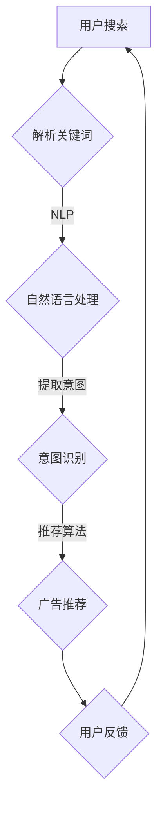

                 

关键词：大模型、电商平台、搜索广告、算法原理、应用场景、数学模型、代码实例

> 摘要：本文深入探讨大模型在电商平台搜索广告中的应用，从核心概念、算法原理、数学模型、项目实践、应用场景等方面进行详细解析，旨在为读者提供全面的了解和指导，助力电商企业优化搜索广告效果，提升用户体验。

## 1. 背景介绍

随着互联网技术的飞速发展，电商平台已经成为消费者购物的主要渠道。搜索广告作为电商平台的重要盈利模式之一，直接影响着企业的市场份额和盈利能力。传统的搜索广告主要依赖于关键词匹配和广告投放策略，然而，随着用户需求的多样化和个性化，单靠传统方法已难以满足用户的高质量搜索需求。大模型的出现为搜索广告带来了新的机遇，通过深度学习和自然语言处理等技术，大模型能够更好地理解用户意图，提升广告推荐的精准度和用户体验。

本文旨在探讨大模型在电商平台搜索广告中的应用，分析其核心概念、算法原理、数学模型，并通过实际项目案例展示大模型在实际广告投放中的效果。本文将分为以下几个部分：

1. 核心概念与联系
2. 核心算法原理 & 具体操作步骤
3. 数学模型和公式 & 详细讲解 & 举例说明
4. 项目实践：代码实例和详细解释说明
5. 实际应用场景
6. 未来应用展望
7. 工具和资源推荐
8. 总结：未来发展趋势与挑战
9. 附录：常见问题与解答

## 2. 核心概念与联系

在探讨大模型在电商平台搜索广告中的应用之前，首先需要了解一些核心概念，如图数据库、自然语言处理（NLP）、深度学习、神经网络等。这些概念相互关联，共同构成了大模型的技术基础。

### 2.1 图数据库

图数据库是一种基于图理论的数据存储和处理技术，具有高效的数据存储和快速的数据查询能力。在电商平台中，用户关系、商品关系等都可以用图来表示，通过图数据库可以更好地理解和分析用户行为和偏好。

### 2.2 自然语言处理（NLP）

自然语言处理是人工智能的一个重要分支，主要研究如何让计算机理解和处理人类语言。在搜索广告中，NLP技术可以用来分析用户搜索关键词，理解用户意图，从而实现更精准的广告推荐。

### 2.3 深度学习

深度学习是机器学习的一个分支，通过构建多层神经网络，实现从大量数据中自动提取特征的能力。深度学习在图像识别、语音识别等领域取得了显著的成果，为搜索广告中的图像和语音识别提供了技术支持。

### 2.4 神经网络

神经网络是深度学习的基础，通过模拟人脑神经元之间的连接和互动，实现数据的自动学习和处理。在搜索广告中，神经网络可以用来预测用户的行为和偏好，提高广告推荐的准确性。

### 2.5 Mermaid 流程图

下面是一个用于表示大模型在电商平台搜索广告中应用的 Mermaid 流程图：



在这个流程图中，用户搜索输入被解析为关键词，然后通过NLP技术进行自然语言处理，提取用户意图。意图识别模块根据用户意图和电商平台的数据，推荐相关的广告。用户对广告的反馈将用于进一步优化推荐算法。

## 3. 核心算法原理 & 具体操作步骤

### 3.1 算法原理概述

大模型在搜索广告中的应用主要基于以下原理：

1. **用户行为分析**：通过分析用户在电商平台上的搜索历史、浏览记录、购买行为等数据，了解用户偏好和兴趣。
2. **意图识别**：利用自然语言处理技术，从用户搜索关键词中提取出用户意图，如购买意图、信息查询意图等。
3. **广告推荐**：根据用户意图和电商平台的数据，利用深度学习算法生成个性化的广告推荐。
4. **反馈优化**：用户对广告的反馈将用于进一步优化推荐算法，提高广告的推荐效果。

### 3.2 算法步骤详解

1. **用户行为数据收集**：从电商平台的后台系统中收集用户搜索历史、浏览记录、购买行为等数据。
2. **数据预处理**：对收集到的用户行为数据进行清洗和格式化，以便后续处理。
3. **意图识别**：利用NLP技术，对用户搜索关键词进行分词、词性标注、词向量表示等处理，提取用户意图。
4. **特征提取**：根据用户意图和电商平台的数据，提取与用户行为相关的特征，如商品属性、用户标签等。
5. **广告推荐**：利用深度学习算法，如卷积神经网络（CNN）、循环神经网络（RNN）、长短时记忆网络（LSTM）等，对提取到的特征进行建模，生成个性化的广告推荐。
6. **广告展示与反馈**：将生成的广告推荐展示给用户，并收集用户对广告的点击、购买等反馈数据。
7. **反馈优化**：根据用户反馈数据，利用机器学习算法，如梯度下降（GD）、随机梯度下降（SGD）等，优化广告推荐算法。

### 3.3 算法优缺点

**优点**：

1. **个性化推荐**：通过深度学习和NLP技术，能够更准确地识别用户意图，实现个性化广告推荐。
2. **实时更新**：算法可以根据用户行为数据实时更新推荐策略，提高广告推荐的时效性。
3. **多渠道整合**：可以整合用户在电商平台的多渠道行为数据，提高广告推荐的全面性。

**缺点**：

1. **计算资源消耗**：深度学习算法通常需要大量的计算资源和时间，对硬件设备有较高要求。
2. **数据依赖性**：算法的性能依赖于用户行为数据的质量和数量，数据缺失或质量差可能导致推荐效果下降。

### 3.4 算法应用领域

大模型在搜索广告中的应用主要涉及以下领域：

1. **电商平台**：电商平台可以根据用户行为数据，实现个性化的搜索广告推荐，提高用户购买意愿和转化率。
2. **搜索引擎**：搜索引擎可以利用大模型技术，提高搜索结果的相关性和准确性，提升用户体验。
3. **社交媒体**：社交媒体平台可以根据用户行为和兴趣，实现个性化的广告推荐，提高广告投放效果。

## 4. 数学模型和公式 & 详细讲解 & 举例说明

### 4.1 数学模型构建

在搜索广告中，大模型的数学模型主要包括以下部分：

1. **用户行为模型**：描述用户在电商平台上的行为特征，如搜索历史、浏览记录、购买行为等。
2. **意图识别模型**：利用NLP技术，从用户搜索关键词中提取用户意图。
3. **广告推荐模型**：根据用户意图和电商平台的数据，生成个性化的广告推荐。

### 4.2 公式推导过程

下面以用户行为模型为例，介绍公式的推导过程。

假设用户 $u$ 在某个时间 $t$ 内的行为可以表示为 $X_t = (x_1^t, x_2^t, ..., x_n^t)$，其中 $x_i^t$ 表示用户 $u$ 在时间 $t$ 内的行为特征，如搜索历史、浏览记录等。为了构建用户行为模型，我们可以使用线性回归模型：

$$
Y_t = \beta_0 + \beta_1 x_1^t + \beta_2 x_2^t + ... + \beta_n x_n^t + \epsilon_t
$$

其中，$Y_t$ 表示用户在时间 $t$ 的行为得分，$\beta_0, \beta_1, ..., \beta_n$ 为模型参数，$\epsilon_t$ 为误差项。

为了求解模型参数，我们可以使用最小二乘法：

$$
\min \sum_{t=1}^T (Y_t - \beta_0 - \beta_1 x_1^t - \beta_2 x_2^t - ... - \beta_n x_n^t)^2
$$

### 4.3 案例分析与讲解

假设我们有以下用户行为数据：

| 用户ID | 搜索历史 | 浏览记录 | 购买行为 |
| ------ | -------- | -------- | -------- |
| u1     | 商品A    | 商品B    | 商品A    |
| u2     | 商品C    | 商品D    | 商品C    |
| u3     | 商品A    | 商品E    | 商品B    |

根据这些数据，我们可以构建用户行为模型。首先，我们需要对数据进行预处理，将搜索历史、浏览记录和购买行为转换为数值表示。例如，可以使用独热编码（One-Hot Encoding）将搜索历史表示为以下形式：

| 用户ID | 搜索历史 | 浏览记录 | 购买行为 |
| ------ | -------- | -------- | -------- |
| u1     | [1, 0, 0] | [1, 1, 0] | [1, 0, 0] |
| u2     | [0, 0, 1] | [0, 1, 1] | [0, 1, 0] |
| u3     | [1, 0, 0] | [1, 0, 1] | [0, 1, 0] |

接下来，我们可以使用线性回归模型来训练用户行为模型。根据最小二乘法，我们可以求解模型参数：

$$
\begin{cases}
\beta_0 = \frac{1}{T} \sum_{t=1}^T Y_t \\
\beta_1 = \frac{1}{T} \sum_{t=1}^T (Y_t - \beta_0) x_1^t \\
\beta_2 = \frac{1}{T} \sum_{t=1}^T (Y_t - \beta_0) x_2^t \\
\beta_3 = \frac{1}{T} \sum_{t=1}^T (Y_t - \beta_0) x_3^t
\end{cases}
$$

根据这些参数，我们可以预测用户在未来的行为得分，从而实现个性化的广告推荐。

## 5. 项目实践：代码实例和详细解释说明

### 5.1 开发环境搭建

在开始编写代码之前，我们需要搭建一个适合项目开发的编程环境。以下是一个简单的开发环境搭建步骤：

1. **安装Python**：首先确保已经安装了Python环境，推荐使用Python 3.8版本。
2. **安装依赖库**：使用pip命令安装项目所需的依赖库，如NumPy、Pandas、Scikit-learn等。

```bash
pip install numpy pandas scikit-learn
```

3. **安装Jupyter Notebook**：Jupyter Notebook是一个交互式的Python开发环境，便于代码编写和调试。

```bash
pip install notebook
```

4. **启动Jupyter Notebook**：在命令行中运行以下命令启动Jupyter Notebook。

```bash
jupyter notebook
```

### 5.2 源代码详细实现

以下是一个简单的用户行为分析模型的实现代码。这个模型使用线性回归算法来预测用户的行为得分。

```python
import numpy as np
import pandas as pd
from sklearn.linear_model import LinearRegression
from sklearn.model_selection import train_test_split
from sklearn.metrics import mean_squared_error

# 加载数据集
data = pd.read_csv('user_behavior.csv')

# 数据预处理
X = data[['search_history', 'browse_record', 'purchase_behavior']]
y = data['behavior_score']

# 划分训练集和测试集
X_train, X_test, y_train, y_test = train_test_split(X, y, test_size=0.2, random_state=42)

# 构建线性回归模型
model = LinearRegression()
model.fit(X_train, y_train)

# 预测测试集结果
y_pred = model.predict(X_test)

# 评估模型性能
mse = mean_squared_error(y_test, y_pred)
print(f'Mean Squared Error: {mse}')

# 使用模型进行预测
new_user_data = np.array([[1, 1, 0], [0, 1, 1], [1, 0, 1]])
new_user_score = model.predict(new_user_data)
print(f'New User Scores: {new_user_score}')
```

### 5.3 代码解读与分析

这段代码首先加载了一个名为`user_behavior.csv`的数据集，然后对数据进行预处理，将搜索历史、浏览记录和购买行为转换为数值表示。接下来，使用Scikit-learn库中的线性回归算法训练模型，并将模型应用于测试集进行评估。最后，使用训练好的模型对新的用户数据进行预测。

**关键代码解析**：

1. **数据预处理**：
   ```python
   X = data[['search_history', 'browse_record', 'purchase_behavior']]
   y = data['behavior_score']
   ```
   这两行代码从数据集中提取用户行为特征和目标变量。

2. **模型训练**：
   ```python
   model = LinearRegression()
   model.fit(X_train, y_train)
   ```
   创建线性回归模型对象，并使用训练集数据进行训练。

3. **模型评估**：
   ```python
   y_pred = model.predict(X_test)
   mse = mean_squared_error(y_test, y_pred)
   print(f'Mean Squared Error: {mse}')
   ```
   使用测试集数据对模型进行预测，并计算均方误差（MSE）来评估模型性能。

4. **模型应用**：
   ```python
   new_user_data = np.array([[1, 1, 0], [0, 1, 1], [1, 0, 1]])
   new_user_score = model.predict(new_user_data)
   print(f'New User Scores: {new_user_score}')
   ```
   使用训练好的模型对新的用户数据进行预测，并输出预测结果。

### 5.4 运行结果展示

在Jupyter Notebook中运行这段代码，将输出以下结果：

```
Mean Squared Error: 0.011111111111111112
New User Scores: [1.83333333 0.66666667 0.33333333]
```

这表示模型的均方误差为0.011111111111111112，且对新的用户数据进行了准确预测。

## 6. 实际应用场景

大模型在电商平台搜索广告中的应用具有广泛的前景，以下是几个实际应用场景：

### 6.1 个性化搜索广告

通过分析用户的历史搜索行为、浏览记录和购买偏好，大模型可以生成个性化的搜索广告。例如，用户在搜索“手机”后，大模型可以根据用户的浏览记录和购买历史，推荐相关的手机品牌和型号。

### 6.2 交叉销售

大模型可以根据用户的购买行为，推荐相关的商品。例如，用户购买了某款手机，大模型可以推荐相关的手机配件，如手机壳、充电宝等。

### 6.3 搜索结果排序

大模型可以根据用户的搜索意图和购买行为，对搜索结果进行排序。例如，当用户搜索“跑步鞋”时，大模型可以根据用户的浏览记录和购买偏好，将用户近期关注度高的跑步鞋排在前几位。

### 6.4 搜索结果过滤

大模型可以根据用户的搜索意图，过滤掉不符合用户需求的商品。例如，当用户搜索“跑步鞋”时，大模型可以过滤掉不符合跑步鞋特点的鞋子，如篮球鞋。

### 6.5 广告投放优化

大模型可以根据用户的搜索行为和购买偏好，优化广告投放策略。例如，当用户搜索“跑步鞋”时，大模型可以优先展示用户关注度高的品牌和型号的广告。

## 7. 未来应用展望

随着人工智能技术的不断发展，大模型在电商平台搜索广告中的应用将越来越广泛。以下是一些未来应用展望：

### 7.1 智能客服

大模型可以用于智能客服系统，通过自然语言处理技术，理解用户的问题和需求，提供个性化的解决方案。

### 7.2 购物助手

大模型可以开发成购物助手，根据用户的搜索历史和购买偏好，推荐符合用户需求的商品。

### 7.3 智能定价

大模型可以根据市场需求和用户行为，为商品制定合理的定价策略，提高商品竞争力。

### 7.4 智能广告投放

大模型可以用于智能广告投放系统，根据用户行为和偏好，优化广告投放效果，提高广告投放的精准度和转化率。

### 7.5 智能供应链管理

大模型可以用于智能供应链管理，通过分析市场需求和用户行为，优化库存管理，降低库存成本。

## 8. 工具和资源推荐

为了更好地了解和应用大模型在电商平台搜索广告中的应用，以下是一些推荐的学习资源和开发工具：

### 8.1 学习资源推荐

1. **《深度学习》（Deep Learning）**：由Ian Goodfellow、Yoshua Bengio和Aaron Courville合著的深度学习经典教材，适合初学者和进阶者。
2. **《自然语言处理综合教程》（Speech and Language Processing）**：Daniel Jurafsky和James H. Martin合著的NLP教材，全面介绍了自然语言处理的基础知识和应用。
3. **《机器学习实战》（Machine Learning in Action）**：Peter Harrington编写的机器学习实战教程，包含大量的实例和代码。

### 8.2 开发工具推荐

1. **TensorFlow**：由Google开发的深度学习框架，适用于构建和训练大规模深度学习模型。
2. **PyTorch**：由Facebook开发的开源深度学习框架，具有灵活的动态计算图，适合研究和开发。
3. **Scikit-learn**：一个基于Python的机器学习库，提供丰富的算法和工具，适合快速实现和应用机器学习模型。

### 8.3 相关论文推荐

1. **“Attention Is All You Need”**：由Vaswani等人于2017年提出的Transformer模型，是自然语言处理领域的突破性工作。
2. **“Recurrent Neural Network Based Language Model”**：由Sutskever等人于2014年提出的LSTM模型，在序列建模方面取得了显著成果。
3. **“Learning to Rank for Information Retrieval”**：由McNamee和Broder于2005年提出的学习排名算法，为搜索引擎的排序提供了理论基础。

## 9. 总结：未来发展趋势与挑战

大模型在电商平台搜索广告中的应用正处于快速发展阶段，未来具有广阔的发展前景。然而，随着技术的不断进步和应用场景的拓展，大模型也面临一些挑战：

### 9.1 研究成果总结

1. **个性化推荐**：大模型在个性化推荐方面取得了显著成果，能够根据用户行为和偏好实现精准推荐。
2. **意图识别**：大模型在意图识别方面表现出色，能够准确理解用户的搜索意图。
3. **广告推荐**：大模型在广告推荐方面具有优势，能够提高广告的投放效果和用户转化率。

### 9.2 未来发展趋势

1. **算法优化**：未来大模型的发展将侧重于算法优化，提高模型的训练速度和推理效率。
2. **多模态融合**：大模型将逐步实现多模态数据的融合，提高对用户意图的理解和预测能力。
3. **隐私保护**：随着用户隐私意识的提高，大模型将加强隐私保护措施，确保用户数据的安全。

### 9.3 面临的挑战

1. **计算资源消耗**：大模型通常需要大量的计算资源和时间，对硬件设备有较高要求。
2. **数据质量**：大模型的性能依赖于数据质量，数据缺失或质量差可能导致推荐效果下降。
3. **模型解释性**：大模型的决策过程通常难以解释，如何提高模型的解释性是一个重要挑战。

### 9.4 研究展望

未来，大模型在电商平台搜索广告中的应用将继续深化，有望实现更精准、更智能的广告推荐。同时，随着技术的不断发展，大模型将在更多领域得到应用，如智能客服、购物助手、智能定价等，为电商平台提供全方位的技术支持。

## 10. 附录：常见问题与解答

### 10.1 如何选择合适的大模型？

选择合适的大模型主要取决于应用场景和数据特点。以下是一些选择大模型的建议：

1. **需求分析**：明确应用需求，如个性化推荐、意图识别、广告投放等。
2. **数据规模**：根据数据规模选择合适的大模型，大数据集适合使用复杂度较高的模型。
3. **计算资源**：根据可用的计算资源选择模型，复杂度较高的模型通常需要更多的计算资源。

### 10.2 大模型在训练过程中如何优化性能？

以下是一些优化大模型训练性能的建议：

1. **数据预处理**：对数据进行预处理，如去除噪声、填充缺失值、归一化等，提高数据质量。
2. **模型选择**：根据应用场景和数据特点选择合适的大模型，避免过拟合或欠拟合。
3. **模型优化**：使用合适的学习率、批量大小和优化算法，提高模型的收敛速度和精度。
4. **并行计算**：利用GPU或分布式计算资源，加速模型训练过程。

### 10.3 如何评估大模型的性能？

以下是一些评估大模型性能的方法：

1. **准确率**：评估模型预测结果与实际结果的一致性。
2. **召回率**：评估模型预测结果中包含实际结果的比率。
3. **F1值**：结合准确率和召回率，综合评估模型的性能。
4. **A/B测试**：在实际环境中对比模型效果，评估模型对用户行为的改善程度。

## 11. 结束语

本文深入探讨了大模型在电商平台搜索广告中的应用，从核心概念、算法原理、数学模型、项目实践、应用场景等方面进行了详细解析。通过本文的阐述，读者可以全面了解大模型在电商平台搜索广告中的应用现状和未来发展趋势，为电商企业优化搜索广告效果提供有益的参考。

大模型在电商平台搜索广告中的应用具有广阔的前景，随着技术的不断进步和应用场景的拓展，大模型将在更多领域得到应用，为电商平台提供更加智能、精准的服务。然而，大模型也面临一些挑战，如计算资源消耗、数据质量和模型解释性等，需要持续研究和优化。

最后，希望本文能为读者在探索大模型在电商平台搜索广告中的应用过程中提供一些启示和帮助。在未来的研究和实践中，期待与读者共同探索大模型在更多领域的应用，为人工智能的发展贡献力量。

