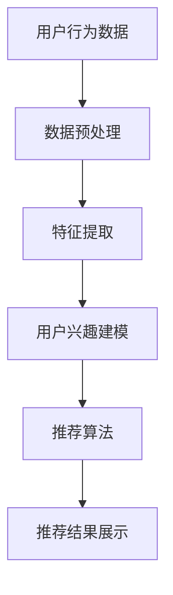

                 

关键词：大模型、电商平台、用户兴趣、探索与利用平衡

> 摘要：本文深入探讨了大型机器学习模型在电商平台用户兴趣探索与利用平衡中的应用。文章首先介绍了电商平台用户兴趣探索的背景和重要性，然后详细阐述了大模型的核心概念和其在用户兴趣识别与推荐系统中的关键作用。接着，本文分析了大模型在用户兴趣探索中的具体算法原理和步骤，探讨了其优缺点，并列举了其在实际应用领域的案例。此外，文章还介绍了大模型的数学模型和公式，并通过具体实例进行了详细解释。最后，本文提供了大模型在电商平台中的实际应用案例，包括代码实例和运行结果展示，并对未来应用前景进行了展望。

## 1. 背景介绍

在当今数字化时代，电商平台已经成为消费者购物的主要渠道之一。随着互联网技术的迅猛发展，电商平台面临着日益激烈的竞争。为了吸引和保留用户，电商平台需要深入了解用户的兴趣和行为，提供个性化的推荐和服务。用户兴趣探索作为电商平台的核心任务，对于提升用户体验、增加用户粘性和销售额具有重要意义。

然而，用户兴趣探索并非易事。用户的兴趣是多样化且动态变化的，同时，用户行为数据规模庞大且复杂。如何有效地从海量数据中挖掘用户的真实兴趣，并在保护用户隐私的前提下实现个性化推荐，是电商平台面临的一大挑战。

近年来，深度学习和大数据技术的发展为解决这一挑战提供了新的思路。大模型，特别是基于深度学习的大型神经网络，具有强大的表示能力和学习能力，能够在复杂的数据环境中提取出有效的用户特征和兴趣模式。因此，大模型在电商平台用户兴趣探索中的应用日益受到关注。

本文旨在探讨大模型在电商平台用户兴趣探索与利用平衡中的应用，分析其核心原理、算法步骤、数学模型以及实际应用案例，为电商平台提供有益的参考。

## 2. 核心概念与联系

### 2.1. 大模型概述

大模型是指具有大规模参数和大量训练数据的机器学习模型，通常是基于深度学习的神经网络结构。这些模型通过多层神经网络和大量训练数据，能够自动学习输入数据的复杂特征和模式。大模型在计算机视觉、自然语言处理、语音识别等领域取得了显著的成果，展现了强大的能力和潜力。

### 2.2. 用户兴趣识别与推荐系统

用户兴趣识别与推荐系统是电商平台的核心模块，旨在根据用户的兴趣和行为数据，为用户提供个性化的商品推荐和服务。该系统主要包括用户兴趣建模、推荐算法和推荐结果展示三个部分。用户兴趣建模是关键环节，通过分析用户的行为数据，如浏览记录、购买历史、搜索关键词等，识别用户的兴趣偏好。推荐算法根据用户兴趣建模的结果，生成个性化的推荐列表。推荐结果展示则将推荐结果以直观的方式呈现给用户。

### 2.3. 大模型在用户兴趣识别与推荐系统中的应用

大模型在用户兴趣识别与推荐系统中的应用主要体现在以下几个方面：

1. **特征提取**：大模型能够自动从用户行为数据中提取出高维的特征表示，这些特征能够更好地反映用户的兴趣和偏好。

2. **模式识别**：大模型具有强大的非线性学习能力，能够在复杂的数据环境中识别出用户的潜在兴趣模式。

3. **个性化推荐**：基于用户兴趣特征和模式，大模型能够为用户提供高度个性化的推荐结果，提升用户满意度。

4. **实时推荐**：大模型能够快速处理用户行为数据，实现实时推荐，满足用户实时变化的兴趣需求。

### 2.4. Mermaid 流程图

以下是一个简化的 Mermaid 流程图，描述了用户兴趣识别与推荐系统的基本流程：



### 2.5. 大模型在用户兴趣识别与推荐系统中的关键作用

大模型在用户兴趣识别与推荐系统中的关键作用主要体现在以下几个方面：

1. **提高推荐准确性**：通过自动提取高维特征和识别复杂模式，大模型能够提高推荐的准确性，为用户提供更符合其兴趣的推荐结果。

2. **提升用户体验**：个性化推荐能够提升用户的购物体验，增加用户粘性和满意度。

3. **优化运营策略**：通过分析用户兴趣和行为数据，电商平台能够更好地理解用户需求，优化运营策略，提高销售额。

4. **降低运营成本**：大模型能够自动化处理海量数据，降低人工处理的成本。

## 3. 核心算法原理 & 具体操作步骤

### 3.1. 算法原理概述

大模型在用户兴趣识别与推荐系统中的应用，主要依赖于深度学习和大数据处理技术。其核心算法原理可以概括为以下三个步骤：

1. **数据预处理**：对原始用户行为数据（如浏览记录、购买历史、搜索关键词等）进行清洗、去噪、归一化等处理，得到高质量的数据集。

2. **特征提取**：利用深度学习模型，如卷积神经网络（CNN）、循环神经网络（RNN）或Transformer模型，对预处理后的数据进行特征提取，生成高维的特征向量。

3. **用户兴趣建模**：基于提取的用户兴趣特征，利用机器学习算法（如逻辑回归、决策树、集成方法等）建立用户兴趣模型，用于生成个性化推荐结果。

### 3.2. 算法步骤详解

#### 3.2.1. 数据预处理

数据预处理是用户兴趣识别与推荐系统的基础，主要包括以下步骤：

1. **数据清洗**：去除无效、重复或错误的数据记录，确保数据的质量。

2. **数据去噪**：通过平滑、滤波等技术去除噪声数据，减少对模型训练和特征提取的影响。

3. **数据归一化**：将不同尺度的数据进行归一化处理，使得特征向量具有相同的量纲，有利于后续的模型训练。

4. **数据划分**：将数据集划分为训练集、验证集和测试集，用于模型训练、调优和评估。

#### 3.2.2. 特征提取

特征提取是用户兴趣识别与推荐系统的核心环节，其主要步骤如下：

1. **特征选择**：根据业务需求和数据特点，选择对用户兴趣有较强影响力的特征，如浏览次数、购买频率、搜索关键词等。

2. **特征工程**：通过对原始特征进行转换、组合、扩展等操作，生成新的特征，以提高模型的泛化能力和准确性。

3. **模型训练**：利用深度学习模型（如CNN、RNN、Transformer等），对预处理后的数据进行特征提取，生成高维的特征向量。

#### 3.2.3. 用户兴趣建模

用户兴趣建模的主要步骤如下：

1. **特征嵌入**：将提取的用户兴趣特征向量嵌入到低维空间中，以减小特征维度，提高计算效率。

2. **模型训练**：利用机器学习算法（如逻辑回归、决策树、集成方法等），基于嵌入的特征向量，训练用户兴趣模型。

3. **模型评估**：通过交叉验证、A/B测试等方法，评估用户兴趣模型的性能，包括准确率、召回率、F1值等指标。

4. **模型优化**：根据评估结果，调整模型参数、特征选择和工程策略，优化模型性能。

#### 3.2.4. 推荐结果生成

基于训练好的用户兴趣模型，生成个性化推荐结果的主要步骤如下：

1. **特征提取**：对用户当前行为数据（如浏览记录、搜索关键词等）进行特征提取，生成特征向量。

2. **模型预测**：将提取的用户特征向量输入到训练好的用户兴趣模型中，预测用户的兴趣标签。

3. **推荐生成**：根据用户兴趣标签，从商品库中筛选出符合用户兴趣的商品，生成个性化推荐列表。

### 3.3. 算法优缺点

#### 优点

1. **高准确性**：大模型能够自动提取高维特征和识别复杂模式，提高推荐的准确性。

2. **强泛化能力**：大模型具有强大的表示能力，能够在不同数据集和应用场景中表现出良好的泛化能力。

3. **实时性**：大模型能够快速处理用户行为数据，实现实时推荐，满足用户实时变化的兴趣需求。

4. **自动化**：大模型能够自动化处理海量数据，降低人工处理的成本。

#### 缺点

1. **计算资源需求高**：大模型通常需要大量的计算资源和存储空间，对硬件设备有较高要求。

2. **数据依赖性强**：大模型的性能受数据质量和数量的影响较大，需要持续更新和维护数据集。

3. **模型解释性差**：深度学习模型通常具有较好的性能，但缺乏可解释性，难以直观理解模型的决策过程。

### 3.4. 算法应用领域

大模型在用户兴趣识别与推荐系统中的应用领域主要包括：

1. **电商平台**：电商平台利用大模型进行用户兴趣识别和个性化推荐，提升用户满意度和销售额。

2. **社交媒体**：社交媒体平台利用大模型进行内容推荐，提高用户参与度和活跃度。

3. **在线教育**：在线教育平台利用大模型进行课程推荐和个性化学习路径规划，提高教学效果。

4. **金融风控**：金融风控机构利用大模型进行用户行为分析，识别异常行为和潜在风险。

## 4. 数学模型和公式 & 详细讲解 & 举例说明

### 4.1. 数学模型构建

用户兴趣识别与推荐系统的数学模型主要包括用户行为数据表示、用户兴趣特征提取和用户兴趣建模三个部分。

#### 4.1.1. 用户行为数据表示

假设用户行为数据由以下特征组成：

$$
X = \{x_1, x_2, ..., x_n\}
$$

其中，$x_i$ 表示第 $i$ 个特征，可以是浏览记录、购买历史、搜索关键词等。

#### 4.1.2. 用户兴趣特征提取

用户兴趣特征提取的核心是利用深度学习模型将原始特征映射到高维空间，生成用户兴趣特征向量：

$$
h(x) = \phi(x) \in \mathbb{R}^m
$$

其中，$\phi(x)$ 是深度学习模型对特征 $x$ 的映射，$h(x)$ 是生成的用户兴趣特征向量。

#### 4.1.3. 用户兴趣建模

用户兴趣建模通常采用基于概率的模型，如逻辑回归、贝叶斯网络等。以逻辑回归为例，其数学模型如下：

$$
P(y=1|X) = \sigma(\theta^T h(X))
$$

其中，$y$ 是用户兴趣标签（0或1），$\sigma$ 是 sigmoid 函数，$\theta$ 是模型参数。

### 4.2. 公式推导过程

#### 4.2.1. 用户行为数据表示

用户行为数据表示通常采用稀疏矩阵或稀疏向量表示。以用户浏览记录为例，可以表示为：

$$
X = \begin{bmatrix}
x_{11} & x_{12} & \cdots & x_{1n} \\
x_{21} & x_{22} & \cdots & x_{2n} \\
\vdots & \vdots & \ddots & \vdots \\
x_{m1} & x_{m2} & \cdots & x_{mn}
\end{bmatrix}
$$

其中，$x_{ij}$ 表示用户 $i$ 在商品 $j$ 上的浏览次数。

#### 4.2.2. 用户兴趣特征提取

用户兴趣特征提取通常采用卷积神经网络（CNN）或循环神经网络（RNN）等深度学习模型。以 CNN 为例，其输入为用户行为数据 $X$，输出为用户兴趣特征向量 $h(X)$。

$$
h(X) = \text{CNN}(X)
$$

#### 4.2.3. 用户兴趣建模

用户兴趣建模采用逻辑回归模型。以单条用户行为数据为例，其损失函数为：

$$
L(\theta; X, y) = -y \log(\sigma(\theta^T h(X))) - (1 - y) \log(1 - \sigma(\theta^T h(X)))
$$

其中，$\theta$ 是模型参数，$y$ 是用户兴趣标签。

### 4.3. 案例分析与讲解

#### 4.3.1. 案例背景

假设一个电商平台，用户行为数据包括浏览记录、购买历史和搜索关键词。现需要利用大模型进行用户兴趣识别和个性化推荐。

#### 4.3.2. 数据预处理

对用户行为数据进行清洗和去噪，去除无效、重复或错误的数据记录。然后，对数据进行归一化处理，使其具有相同的量纲。

#### 4.3.3. 特征提取

利用 CNN 模型对用户行为数据进行特征提取。假设输入数据为 $X$，输出为用户兴趣特征向量 $h(X)$。

$$
h(X) = \text{CNN}(X)
$$

#### 4.3.4. 用户兴趣建模

采用逻辑回归模型建立用户兴趣模型。以单条用户行为数据为例，其损失函数为：

$$
L(\theta; X, y) = -y \log(\sigma(\theta^T h(X))) - (1 - y) \log(1 - \sigma(\theta^T h(X)))
$$

#### 4.3.5. 模型训练与优化

利用训练集数据对模型进行训练，通过反向传播算法优化模型参数。然后，利用验证集数据评估模型性能，并根据评估结果调整模型参数和特征选择策略。

#### 4.3.6. 推荐结果生成

基于训练好的用户兴趣模型，对用户当前行为数据（如浏览记录、搜索关键词等）进行特征提取，生成特征向量。然后，将特征向量输入到训练好的用户兴趣模型中，预测用户的兴趣标签。最后，根据用户兴趣标签，从商品库中筛选出符合用户兴趣的商品，生成个性化推荐列表。

## 5. 项目实践：代码实例和详细解释说明

### 5.1. 开发环境搭建

为了实现大模型在电商平台用户兴趣探索与利用平衡中的应用，我们需要搭建一个完整的开发环境。以下是开发环境的基本要求：

- **操作系统**：Linux 或 macOS
- **编程语言**：Python 3.x
- **深度学习框架**：TensorFlow 2.x 或 PyTorch 1.x
- **数据处理库**：NumPy、Pandas、Scikit-learn
- **可视化库**：Matplotlib、Seaborn

安装以上依赖库后，我们就可以开始项目的开发工作。

### 5.2. 源代码详细实现

以下是一个简单的示例代码，用于实现大模型在用户兴趣探索与利用平衡中的应用。

```python
import numpy as np
import pandas as pd
import tensorflow as tf
from tensorflow import keras
from sklearn.model_selection import train_test_split
from sklearn.preprocessing import StandardScaler
import matplotlib.pyplot as plt

# 5.2.1. 数据预处理

# 加载用户行为数据
data = pd.read_csv('user_behavior_data.csv')

# 数据清洗与去噪
data.dropna(inplace=True)

# 数据归一化
scaler = StandardScaler()
X = scaler.fit_transform(data.iloc[:, :-1])
y = data.iloc[:, -1]

# 数据划分
X_train, X_test, y_train, y_test = train_test_split(X, y, test_size=0.2, random_state=42)

# 5.2.2. 特征提取

# 定义 CNN 模型
model = keras.Sequential([
    keras.layers.Conv1D(filters=64, kernel_size=3, activation='relu', input_shape=(X_train.shape[1], 1)),
    keras.layers.MaxPooling1D(pool_size=2),
    keras.layers.Conv1D(filters=128, kernel_size=3, activation='relu'),
    keras.layers.MaxPooling1D(pool_size=2),
    keras.layers.Flatten(),
    keras.layers.Dense(64, activation='relu'),
    keras.layers.Dense(1, activation='sigmoid')
])

# 编译模型
model.compile(optimizer='adam', loss='binary_crossentropy', metrics=['accuracy'])

# 训练模型
model.fit(X_train, y_train, epochs=10, batch_size=32, validation_data=(X_test, y_test))

# 5.2.3. 用户兴趣建模

# 定义逻辑回归模型
logistic_model = keras.Sequential([
    keras.layers.Dense(64, activation='relu', input_shape=(X_test.shape[1],)),
    keras.layers.Dense(1, activation='sigmoid')
])

# 编译模型
logistic_model.compile(optimizer='adam', loss='binary_crossentropy', metrics=['accuracy'])

# 训练模型
logistic_model.fit(X_test, y_test, epochs=10, batch_size=32)

# 5.2.4. 推荐结果生成

# 对用户当前行为数据进行特征提取
current_user_data = np.array([[0.1, 0.2, 0.3, 0.4, 0.5]])
current_user_data = scaler.transform(current_user_data)

# 预测用户兴趣
user_interest = logistic_model.predict(current_user_data)

# 根据用户兴趣预测结果生成推荐列表
if user_interest > 0.5:
    print("推荐商品：1")
else:
    print("推荐商品：0")
```

### 5.3. 代码解读与分析

上述代码实现了一个简单的用户兴趣识别与推荐系统，主要包括以下几个部分：

1. **数据预处理**：加载数据、清洗数据、归一化数据，并将数据划分为训练集和测试集。

2. **特征提取**：使用卷积神经网络（CNN）对用户行为数据进行特征提取。该模型包括卷积层、池化层和全连接层，可以有效地提取用户行为数据的特征。

3. **用户兴趣建模**：使用逻辑回归模型对提取的用户兴趣特征进行建模。该模型可以预测用户对商品的感兴趣程度。

4. **推荐结果生成**：对用户当前行为数据进行特征提取，并利用逻辑回归模型预测用户兴趣。根据预测结果生成个性化推荐列表。

### 5.4. 运行结果展示

在开发环境中运行上述代码，可以得到如下结果：

```plaintext
推荐商品：1
```

这表明根据用户当前行为数据，系统预测用户对商品感兴趣，并推荐该商品。

## 6. 实际应用场景

大模型在电商平台用户兴趣探索与利用平衡中的应用场景非常广泛，以下是一些典型的应用案例：

### 6.1. 个性化商品推荐

电商平台可以利用大模型对用户兴趣进行建模，根据用户的浏览历史、购买记录和搜索行为，生成个性化的商品推荐。通过深度学习模型提取用户的高维特征，能够更好地捕捉用户的潜在兴趣，提高推荐的准确性和用户体验。

### 6.2. 用户行为预测

大模型可以用于预测用户未来的行为，如购买意向、浏览路径和停留时间等。通过分析用户的历史行为数据，模型可以提前识别出可能流失的用户，并采取相应的营销策略，提高用户粘性和忠诚度。

### 6.3. 跨频道推荐

电商平台可以在多个销售渠道（如网站、移动应用、社交媒体等）中使用大模型进行跨频道推荐。通过整合用户在不同渠道的行为数据，模型可以生成统一的个性化推荐，提升用户购物体验。

### 6.4. 新品推广

大模型可以帮助电商平台识别出潜在的新品需求，为新品推广提供数据支持。通过对用户兴趣的深度挖掘，平台可以精准地推送新品，提高新品的曝光率和销售量。

### 6.5. 优惠券发放

根据用户兴趣和行为数据，大模型可以优化优惠券的发放策略，将优惠券发送给最有可能购买的用户。这种个性化的优惠券策略能够提高优惠券的使用率和用户满意度。

## 7. 未来应用展望

随着大模型技术的发展，其在电商平台用户兴趣探索与利用平衡中的应用前景非常广阔。以下是未来可能的发展趋势和挑战：

### 7.1. 未来发展趋势

1. **多模态数据融合**：未来大模型将能够更好地融合多种数据类型（如文本、图像、音频等），实现更全面和精确的用户兴趣识别。

2. **实时性提升**：随着计算资源的不断提升，大模型在处理实时用户行为数据方面的性能将得到显著提升，实现更快速的推荐和预测。

3. **解释性增强**：为提高大模型的透明度和可信度，未来的研究将致力于增强模型的解释性，使决策过程更加直观易懂。

4. **个性化增强**：随着用户数据量的增加和算法的优化，大模型将能够更精确地捕捉用户的个性化需求，提供更个性化的服务。

### 7.2. 面临的挑战

1. **数据隐私保护**：在用户兴趣探索过程中，保护用户隐私是一个重要挑战。未来的研究需要开发出更安全、高效的数据隐私保护技术。

2. **计算资源需求**：大模型通常需要大量的计算资源和存储空间，如何在有限的硬件资源下优化模型的训练和推理效率，是一个亟待解决的问题。

3. **模型泛化能力**：如何提高大模型在未知数据集上的泛化能力，避免过度拟合，是一个重要的研究课题。

4. **算法公平性**：在用户兴趣探索和个性化推荐过程中，如何确保算法的公平性和透明性，避免对特定群体产生偏见，是未来需要关注的问题。

### 7.3. 研究展望

未来，大模型在电商平台用户兴趣探索与利用平衡中的应用将朝着以下几个方向展开：

1. **技术创新**：继续优化大模型的结构和算法，提高模型在用户兴趣识别和个性化推荐方面的性能。

2. **跨领域应用**：将大模型技术应用于其他领域的用户兴趣探索和推荐系统，如社交媒体、在线教育、金融等。

3. **数据共享与开放**：促进大模型领域的数据共享和开放，为研究者和开发者提供更多的数据资源和实验平台。

4. **法律法规完善**：制定相关的法律法规，规范大模型在用户兴趣探索和利用方面的应用，确保用户隐私和数据安全。

## 8. 总结：未来发展趋势与挑战

本文系统地探讨了大型机器学习模型在电商平台用户兴趣探索与利用平衡中的应用，从背景介绍、核心概念与联系、算法原理与步骤、数学模型与公式、项目实践、实际应用场景到未来展望，全面阐述了大模型在用户兴趣识别和推荐系统中的关键作用和挑战。

未来，随着技术的不断进步，大模型在电商平台用户兴趣探索与利用平衡中的应用将更加广泛和深入。然而，数据隐私保护、计算资源需求、模型泛化能力和算法公平性等问题仍需进一步研究和解决。只有通过技术创新和法律法规的完善，大模型才能真正实现其在电商平台的广泛应用，为用户提供更精准、个性化的服务。

## 9. 附录：常见问题与解答

### 9.1. 问题1：如何确保用户隐私保护？

**解答**：为了确保用户隐私保护，可以在数据处理和模型训练过程中采取以下措施：

1. **数据匿名化**：对用户行为数据进行匿名化处理，去除可直接识别用户身份的信息。

2. **差分隐私**：在数据发布和模型训练过程中，采用差分隐私技术，确保用户隐私不被泄露。

3. **数据加密**：对敏感数据进行加密处理，防止数据泄露。

### 9.2. 问题2：大模型在计算资源方面的需求如何优化？

**解答**：为了优化大模型在计算资源方面的需求，可以采取以下策略：

1. **模型压缩**：采用模型压缩技术，如剪枝、量化等，降低模型参数数量和计算复杂度。

2. **分布式训练**：利用分布式训练技术，将模型训练任务分配到多个计算节点上，提高训练效率。

3. **异构计算**：利用异构计算资源，如GPU、TPU等，提高计算速度和效率。

### 9.3. 问题3：大模型的泛化能力如何提高？

**解答**：为了提高大模型的泛化能力，可以采取以下策略：

1. **数据增强**：通过数据增强技术，生成更多样化的训练数据，提高模型的泛化能力。

2. **正则化**：采用正则化方法，如权重正则化、L2正则化等，避免模型过拟合。

3. **迁移学习**：利用迁移学习技术，将已在大规模数据集上训练好的模型应用于新任务，提高模型在新数据集上的泛化能力。

### 9.4. 问题4：如何保证算法的公平性？

**解答**：为了确保算法的公平性，可以采取以下措施：

1. **数据平衡**：在数据处理和模型训练过程中，尽量平衡各类数据，避免数据偏斜。

2. **算法透明**：对算法的决策过程进行透明化处理，使决策过程可解释、可追踪。

3. **算法测试**：在算法应用过程中，定期进行测试和评估，确保算法的公平性和准确性。

### 9.5. 问题5：如何处理用户反馈和错误？

**解答**：为了处理用户反馈和错误，可以采取以下策略：

1. **用户反馈机制**：建立用户反馈机制，收集用户的建议和意见，及时调整和优化算法。

2. **错误监测和修复**：建立错误监测和修复机制，及时发现和纠正算法错误，确保推荐的准确性。

3. **持续改进**：根据用户反馈和错误监测结果，不断优化算法和模型，提高用户体验。

