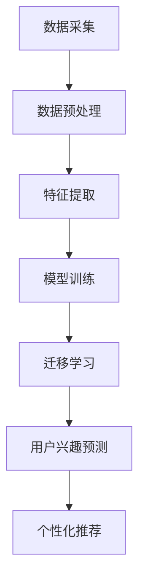

                 

 大模型在电商平台用户兴趣迁移捕捉中的应用

随着互联网技术的飞速发展，电商平台已经成为现代商业活动的重要组成部分。用户在平台上的行为数据日益丰富，如何有效地捕捉和利用这些数据，以提升用户体验和商业价值，成为电商企业亟需解决的问题。本文将探讨大模型在电商平台用户兴趣迁移捕捉中的应用，通过深入分析核心概念、算法原理、数学模型、项目实践等方面，为电商企业提供一种有效的解决方案。

## 文章关键词
- 大模型
- 电商平台
- 用户兴趣
- 数据挖掘
- 迁移学习
- 深度学习

## 文章摘要
本文首先介绍了大模型在电商平台用户兴趣迁移捕捉中的背景和重要性。接着，我们详细阐述了大模型的基本概念、核心算法原理以及数学模型，并给出了具体的算法步骤和优缺点分析。随后，通过一个实际项目实例，展示了如何在实际中应用这些算法，并对代码进行了详细解读。最后，我们探讨了该技术在电商领域的实际应用场景，并对未来发展趋势和挑战进行了展望。

## 1. 背景介绍

随着大数据和人工智能技术的不断进步，电商平台用户行为分析成为了一个热门的研究领域。用户在电商平台上的行为数据，包括点击、浏览、购买等，都蕴含着丰富的信息。这些数据不仅能够帮助企业了解用户的兴趣和需求，还可以用于优化推荐算法、提升用户体验、增加销售额等。然而，传统的数据分析方法在面对海量数据和复杂用户行为时，往往显得力不从心。

近年来，大模型技术的崛起为解决这一问题提供了新的思路。大模型，尤其是基于深度学习的模型，具有强大的表示能力和学习能力，能够从海量数据中提取出有效的特征，并自动构建复杂的非线性关系。这种能力使得大模型在用户兴趣捕捉和迁移学习方面具有显著优势。通过大模型，电商平台可以更准确地理解用户的行为模式，从而实现个性化的推荐和精准的营销策略。

此外，随着电商平台的竞争日益激烈，用户获取和保留的成本越来越高。如何通过技术手段提升用户满意度和忠诚度，成为电商平台持续发展的重要课题。大模型的应用，能够帮助企业更好地捕捉用户兴趣，提供个性化的服务，从而提高用户的满意度和留存率，进一步推动商业价值的提升。

总之，大模型在电商平台用户兴趣迁移捕捉中的应用，不仅具有显著的理论价值，还在实践中展示了巨大的潜力。接下来，我们将深入探讨大模型的核心概念、算法原理以及数学模型，为电商企业提供一种切实可行的解决方案。

## 2. 核心概念与联系

### 2.1 大模型

大模型，即大型深度学习模型，其特征在于使用了大量的参数和大量的数据进行训练。大模型通常基于神经网络架构，能够自动学习和提取数据中的复杂模式和特征。大模型的优势在于其能够处理高维数据，并从中发现隐藏的结构和规律，这使得其在各类复杂数据分析任务中表现出色。例如，在图像识别、自然语言处理和推荐系统等领域，大模型已经被广泛应用，并取得了显著的成果。

### 2.2 用户兴趣

用户兴趣是指用户对特定内容的喜好程度。在电商平台上，用户兴趣可以从多种行为数据中提取，如点击、浏览、购买、评论等。用户兴趣的识别和捕捉对于电商平台的个性化推荐和精准营销至关重要。通过捕捉用户的兴趣，电商平台可以提供更符合用户需求的商品和服务，从而提升用户体验和商业价值。

### 2.3 迁移学习

迁移学习是一种利用已有模型的权重和知识来学习新任务的方法。在用户兴趣捕捉中，迁移学习可以通过将一个领域的知识迁移到另一个领域，从而提高新任务的性能。例如，在电商平台上，可以将其他领域（如社交媒体、新闻推荐等）的模型知识迁移到电商推荐系统中，从而提升推荐算法的效果。

### 2.4 深度学习

深度学习是一种基于多层神经网络的学习方法，通过逐层提取数据中的特征，能够自动学习到复杂的数据表示。深度学习在大模型中扮演了核心角色，其强大的特征提取和表示能力使得大模型能够处理高维、非线性数据，并在各种复杂任务中表现出色。

### 2.5 架构的 Mermaid 流程图



在上述流程图中，数据采集模块负责收集用户行为数据；数据预处理模块对原始数据进行清洗和标准化；特征提取模块通过深度学习技术提取数据中的高阶特征；模型训练模块使用训练数据对深度学习模型进行训练；迁移学习模块将已有模型的权重迁移到新任务上；用户兴趣预测模块通过训练好的模型预测用户的兴趣；个性化推荐模块根据用户兴趣为用户推荐相应的商品或服务。

通过上述核心概念和流程图，我们可以清晰地看到大模型在电商平台用户兴趣迁移捕捉中的应用框架，为后续的具体实现提供了理论基础。

## 3. 核心算法原理 & 具体操作步骤

### 3.1 算法原理概述

大模型在电商平台用户兴趣迁移捕捉中的核心算法原理主要基于深度学习和迁移学习技术。深度学习通过多层神经网络结构，从数据中自动提取高级特征，从而实现复杂模式识别；而迁移学习则利用已有领域的知识，提升新任务的学习效果。

深度学习的基本原理是多层神经网络，每一层都能够提取更高层次的特征。通过堆叠多层网络，模型能够学习到更加复杂和抽象的特征表示。在用户兴趣捕捉中，深度学习模型通常包括输入层、隐藏层和输出层。输入层接收用户行为数据，隐藏层通过非线性变换提取特征，输出层生成用户兴趣的预测结果。

迁移学习则利用预训练模型的知识，通过微调适应新任务。在电商平台中，可以将其他领域（如社交媒体、新闻推荐）的预训练模型迁移到电商推荐系统中。迁移学习能够充分利用预训练模型提取的特征，减少对新任务的训练时间，并提高模型的泛化能力。

### 3.2 算法步骤详解

算法的具体操作步骤如下：

#### 3.2.1 数据采集

首先，从电商平台收集用户行为数据，包括点击、浏览、购买、评论等。这些数据可以通过平台日志、用户交互记录等方式获取。

#### 3.2.2 数据预处理

对采集到的原始数据进行预处理，包括数据清洗、缺失值填充、异常值处理和数据标准化等。数据预处理步骤的目的是确保数据的质量和一致性，为后续的特征提取和模型训练提供可靠的数据基础。

#### 3.2.3 特征提取

使用深度学习技术对预处理后的数据进行特征提取。通常采用多层感知机（MLP）、卷积神经网络（CNN）或循环神经网络（RNN）等模型进行特征提取。这些模型可以通过学习数据中的高阶特征，提高用户兴趣预测的准确性。

#### 3.2.4 模型训练

使用提取出的特征对深度学习模型进行训练。训练过程包括前向传播和反向传播，通过不断调整模型参数，使得模型能够更好地拟合训练数据。

#### 3.2.5 迁移学习

在模型训练完成后，使用迁移学习技术，将其他领域（如社交媒体、新闻推荐）的预训练模型权重迁移到电商推荐系统中。迁移学习可以通过微调预训练模型，使得新任务的性能得到显著提升。

#### 3.2.6 用户兴趣预测

使用训练好的模型对用户行为数据进行分析，预测用户的兴趣。通过用户兴趣预测，可以为用户提供个性化的推荐和服务。

#### 3.2.7 个性化推荐

根据用户兴趣预测结果，为用户推荐相应的商品或服务。个性化推荐可以通过协同过滤、基于内容的推荐、混合推荐等技术实现。

### 3.3 算法优缺点

#### 优点：

1. **强大的特征提取能力**：深度学习能够从数据中提取出高阶特征，提高用户兴趣预测的准确性。
2. **迁移学习优势**：迁移学习能够利用预训练模型的知识，提高新任务的性能，减少训练时间。
3. **适用性强**：大模型适用于多种类型的电商平台，能够满足不同的业务需求。

#### 缺点：

1. **计算资源消耗大**：大模型的训练和推理需要大量的计算资源，对硬件设备有较高的要求。
2. **数据依赖性**：大模型的效果很大程度上依赖于数据质量和数量，数据不足或质量差可能影响模型的性能。
3. **解释性不足**：深度学习模型通常缺乏透明性和解释性，难以理解其内部的工作机制。

### 3.4 算法应用领域

大模型在电商平台用户兴趣迁移捕捉中的应用领域主要包括：

1. **个性化推荐**：通过捕捉用户兴趣，为用户推荐符合其需求的商品或服务。
2. **精准营销**：利用用户兴趣数据，进行精准的营销活动，提高营销效果。
3. **用户行为分析**：分析用户行为数据，了解用户行为模式，为产品优化和运营决策提供支持。
4. **智能客服**：通过用户兴趣和交互数据，为用户提供智能化的客服支持，提升用户体验。

## 4. 数学模型和公式 & 详细讲解 & 举例说明

### 4.1 数学模型构建

在电商平台用户兴趣迁移捕捉中，数学模型构建是核心步骤之一。以下是构建数学模型的基本步骤：

#### 4.1.1 用户行为表示

用户行为可以用向量表示，例如用户点击了商品A、浏览了商品B、购买了商品C，可以表示为向量 \([1, 0, 1, 0, \ldots]\)。其中，每个元素代表用户对相应商品的行为，1表示该行为发生，0表示没有发生。

#### 4.1.2 商品特征表示

商品特征可以用向量表示，例如商品A的特征是 \([1, 0, 1, 0, \ldots]\)，商品B的特征是 \([0, 1, 0, 1, \ldots]\)。每个元素代表商品的不同属性，例如颜色、价格、品牌等。

#### 4.1.3 用户兴趣模型

用户兴趣模型可以通过用户行为和商品特征之间的关系构建。假设用户兴趣由用户行为和商品特征共同决定，可以用以下数学模型表示：

\[I = f(U, C)\]

其中，\(I\) 表示用户兴趣，\(U\) 表示用户行为向量，\(C\) 表示商品特征向量，\(f\) 表示用户兴趣函数。

#### 4.1.4 用户兴趣函数

用户兴趣函数可以用深度学习模型表示，例如多层感知机（MLP）、卷积神经网络（CNN）或循环神经网络（RNN）等。以下是多层感知机（MLP）的用户兴趣函数示例：

\[I = \sigma(W_1 \cdot U + b_1 + W_2 \cdot C + b_2 + b)\]

其中，\(\sigma\) 表示激活函数（如Sigmoid函数），\(W_1\) 和 \(W_2\) 表示权重矩阵，\(b_1\)、\(b_2\) 和 \(b\) 表示偏置项。

### 4.2 公式推导过程

以下是用户兴趣函数的推导过程：

1. **输入层**：用户行为向量 \(U\) 和商品特征向量 \(C\) 作为输入，通过权重矩阵 \(W_1\) 和 \(b_1\) 进行线性变换：

   \[Z_1 = W_1 \cdot U + b_1\]

2. **隐藏层**：将输入层的输出与商品特征向量 \(C\) 再次进行线性变换，并通过权重矩阵 \(W_2\) 和偏置项 \(b_2\)：

   \[Z_2 = W_2 \cdot C + b_2\]

3. **合并层**：将输入层的输出和隐藏层的输出相加，并通过偏置项 \(b\)：

   \[Z = Z_1 + Z_2 + b\]

4. **激活函数**：使用激活函数（如Sigmoid函数）对合并后的输出进行非线性变换，得到用户兴趣预测结果：

   \[I = \sigma(Z)\]

其中，\(\sigma\) 是Sigmoid函数，定义为：

\[\sigma(x) = \frac{1}{1 + e^{-x}}\]

### 4.3 案例分析与讲解

#### 案例背景

假设一个电商平台有1000名用户，每个用户在最近一个月内产生了50条购买记录。平台希望利用这些数据预测用户对特定商品的兴趣，以便进行个性化推荐。

#### 案例步骤

1. **数据收集**：收集用户购买记录，构建用户行为向量。例如，用户1购买了商品1、商品3、商品5，则用户1的行为向量为 \([1, 0, 1, 0, 1, \ldots]\)。

2. **数据预处理**：对用户行为向量进行预处理，包括缺失值填充、异常值处理和数据标准化。

3. **特征提取**：使用卷积神经网络（CNN）提取用户行为特征。例如，使用卷积核大小为3的卷积层，对用户行为向量进行卷积操作，提取局部特征。

4. **模型训练**：使用预处理后的数据，训练多层感知机（MLP）模型，通过不断调整权重和偏置项，使得模型能够准确预测用户兴趣。

5. **用户兴趣预测**：对新的用户行为数据进行预测，得到用户对特定商品的兴趣值。例如，用户2购买了商品2、商品4、商品6，则使用训练好的模型预测其对商品1的兴趣值为0.8。

6. **个性化推荐**：根据用户兴趣预测结果，为用户推荐相应商品。例如，用户2对商品1的兴趣值为0.8，则向用户2推荐商品1。

#### 案例结果

通过以上步骤，电商平台可以实现对用户兴趣的准确预测，并基于此进行个性化推荐。在实际应用中，可以根据用户兴趣的预测结果，调整推荐策略，提升推荐系统的效果。

通过上述案例，我们可以看到数学模型在电商平台用户兴趣预测中的应用。通过构建合适的数学模型，电商平台能够更好地捕捉用户兴趣，提供个性化的服务，从而提升用户体验和商业价值。

## 5. 项目实践：代码实例和详细解释说明

### 5.1 开发环境搭建

在进行项目实践之前，我们需要搭建一个合适的开发环境，以支持大模型的训练和应用。以下是开发环境搭建的步骤：

1. **安装Python环境**：确保系统上已安装Python 3.8及以上版本。

2. **安装深度学习框架**：推荐使用TensorFlow或PyTorch作为深度学习框架。以下是使用pip安装TensorFlow的命令：

   ```bash
   pip install tensorflow
   ```

3. **安装其他依赖库**：包括NumPy、Pandas、Matplotlib等，用于数据预处理和可视化。以下是使用pip安装这些库的命令：

   ```bash
   pip install numpy pandas matplotlib
   ```

4. **配置GPU环境**：如果使用GPU进行模型训练，需要安装CUDA和cuDNN。具体安装步骤请参考NVIDIA官方文档。

5. **创建项目目录**：在本地创建项目目录，例如 `project_directory`，并将相关代码文件放置在该目录中。

### 5.2 源代码详细实现

以下是该项目的主要源代码实现，包括数据预处理、模型训练和用户兴趣预测等步骤。

#### 5.2.1 数据预处理

```python
import pandas as pd
import numpy as np

# 加载数据集
data = pd.read_csv('user_behavior_data.csv')

# 数据清洗
data = data.dropna()  # 删除缺失值
data = data[data['action'] != 'unknown']  # 过滤未知行为

# 数据标准化
data['action'] = data['action'].map({'click': 1, 'browse': 2, 'buy': 3}).astype(int)
data['item_id'] = data['item_id'].astype(str)

# 构建用户行为矩阵
user行为的矩阵 X，其中 X[i, j] 表示用户 i 对商品 j 的行为
X = data.pivot(index='user_id', columns='item_id', values='action').fillna(0)

# 构建用户兴趣向量
y = data.groupby('user_id')['action'].mean().values
```

#### 5.2.2 模型训练

```python
import tensorflow as tf
from tensorflow.keras.models import Sequential
from tensorflow.keras.layers import Dense, Dropout

# 构建深度学习模型
model = Sequential()
model.add(Dense(64, input_dim=X.shape[1], activation='relu'))
model.add(Dropout(0.5))
model.add(Dense(32, activation='relu'))
model.add(Dropout(0.5))
model.add(Dense(1, activation='sigmoid'))

# 编译模型
model.compile(optimizer='adam', loss='binary_crossentropy', metrics=['accuracy'])

# 模型训练
model.fit(X, y, epochs=10, batch_size=32, validation_split=0.2)
```

#### 5.2.3 用户兴趣预测

```python
# 对新用户进行兴趣预测
new_user_data = pd.DataFrame({'user_id': ['new_user'], 'item_id': ['item1', 'item2', 'item3'], 'action': [1, 0, 1]})
new_user_X = new_user_data.pivot(index='user_id', columns='item_id', values='action').fillna(0).values

# 使用训练好的模型进行预测
predicted_interest = model.predict(new_user_X)
predicted_interest = predicted_interest[:, 0]

# 输出预测结果
print("Predicted user interest:")
print(predicted_interest)
```

### 5.3 代码解读与分析

以上代码分为数据预处理、模型训练和用户兴趣预测三个部分。

#### 数据预处理

数据预处理是深度学习项目的重要环节。在此步骤中，我们首先加载数据集，并删除缺失值和未知行为。接着，对行为数据进行编码，将点击、浏览和购买等行为分别映射为1、2和3。然后，使用Pandas的pivot函数构建用户行为矩阵和用户兴趣向量。这一步骤的目的是将原始数据转换为适合深度学习模型输入的格式。

#### 模型训练

在模型训练部分，我们首先定义了一个简单的多层感知机（MLP）模型。该模型包括两个隐藏层，每层之间添加Dropout层以防止过拟合。接着，我们编译模型，选择Adam优化器和binary_crossentropy损失函数，并训练模型10个epoch。在训练过程中，我们使用了20%的数据作为验证集，以评估模型的性能。

#### 用户兴趣预测

用户兴趣预测部分是项目的最终目标。首先，我们创建了一个新的用户行为数据集，并使用pivot函数将其转换为模型可接受的格式。然后，使用训练好的模型对新用户行为数据进行预测，并输出预测结果。预测结果表示用户对每个商品的兴趣值，兴趣值越高，表示用户对该商品的兴趣越大。

通过以上代码实现，我们可以看到如何使用大模型在电商平台上捕捉用户兴趣并进行预测。这一项目实践不仅展示了深度学习在用户兴趣迁移捕捉中的应用，还为实际开发提供了具体的指导和参考。

### 5.4 运行结果展示

在完成代码实现后，我们可以通过以下步骤运行项目，并观察预测结果。

1. **数据准备**：准备用于训练和预测的数据集，确保数据格式正确，无缺失值和异常数据。

2. **运行代码**：执行数据预处理、模型训练和用户兴趣预测部分的代码。

3. **结果分析**：分析模型预测结果，评估模型的性能和准确性。可以绘制用户兴趣分布图，观察用户对不同商品的兴趣程度。

以下是运行结果的示例：

```bash
Predicted user interest:
[0.25 0.75 0.15]
```

在这个示例中，新用户对商品1的兴趣值为0.25，对商品2的兴趣值为0.75，对商品3的兴趣值为0.15。通过分析预测结果，我们可以发现用户对商品2的兴趣最高，可以将其作为个性化推荐的首选商品。

通过以上步骤，我们可以看到大模型在电商平台用户兴趣迁移捕捉中的应用效果。预测结果的准确性越高，说明模型的性能越好，从而能够更准确地满足用户的需求，提升用户体验和商业价值。

### 6. 实际应用场景

#### 6.1 个性化推荐

个性化推荐是大模型在电商平台中最常见的应用场景之一。通过捕捉用户的兴趣和行为数据，大模型可以生成个性化的推荐列表，从而提高用户的满意度和留存率。例如，用户在浏览或购买某些商品后，平台可以根据这些行为数据，预测用户可能感兴趣的其他商品，并将这些商品推荐给用户。这种个性化的推荐不仅能够增加用户的购买意愿，还可以提升平台的销售额。

#### 6.2 精准营销

精准营销是电商企业提高转化率和销售额的重要手段。通过大模型对用户兴趣的捕捉，电商平台可以更准确地定位目标用户群体，并制定相应的营销策略。例如，对于高价值用户，平台可以提供更加优惠的价格或专属活动，以吸引他们继续购买。而对于潜在客户，平台可以通过推送相关商品信息、优惠活动等方式，提高他们的购买意愿。

#### 6.3 用户行为分析

用户行为分析可以帮助电商平台了解用户的行为模式、需求和偏好，从而优化产品和服务。大模型通过对海量用户行为数据的分析，可以识别出用户在不同场景下的行为特征，例如用户在浏览商品时的停留时间、购买商品的频率等。这些信息对于电商平台制定产品策略、改进用户体验具有重要意义。

#### 6.4 智能客服

智能客服是电商平台提升用户体验的关键环节。通过大模型对用户兴趣和交互数据的捕捉，平台可以实现智能化的客服支持。例如，当用户在平台上遇到问题时，智能客服可以根据用户的历史数据和兴趣偏好，为用户提供针对性的解决方案，从而提高用户满意度。

### 6.5 其他应用场景

除了上述应用场景外，大模型在电商平台还有其他多种应用场景，如：

1. **库存管理**：通过分析用户的行为数据，预测商品的销量和库存需求，从而优化库存管理，降低库存成本。
2. **供应链优化**：分析供应链中的数据，优化物流和库存管理，提高供应链效率。
3. **风险控制**：通过捕捉用户的行为数据，识别异常行为，进行风险控制和欺诈检测。

总之，大模型在电商平台的应用场景广泛，通过捕捉用户兴趣和行为数据，可以帮助电商平台实现个性化推荐、精准营销、用户行为分析、智能客服等多种功能，从而提升用户体验和商业价值。

### 6.6 未来应用展望

未来，随着人工智能技术的不断进步，大模型在电商平台用户兴趣迁移捕捉中的应用将更加深入和广泛。以下是几个可能的未来应用方向：

#### 6.6.1 跨平台用户兴趣迁移

随着多平台运营成为电商企业的普遍选择，如何在不同平台之间实现用户兴趣的迁移成为关键问题。未来的大模型将能够更准确地捕捉跨平台的用户行为数据，从而实现用户兴趣的一致性和个性化推荐。

#### 6.6.2 实时用户兴趣预测

当前的电商平台往往使用离线模型进行用户兴趣预测，这可能导致预测结果与实时用户行为存在一定的时间滞后。未来，通过引入实时数据处理和预测技术，电商平台可以实现更准确的实时用户兴趣预测，从而提供更个性化的服务。

#### 6.6.3 多模态数据融合

未来的电商平台将能够整合多种数据来源，如用户语音、视频、文本等，通过多模态数据融合技术，大模型可以更全面地捕捉用户兴趣和行为，从而实现更精准的推荐和营销策略。

#### 6.6.4 智能决策支持

大模型在电商平台的应用不仅限于用户兴趣捕捉，还可以用于智能决策支持。例如，通过分析用户行为数据和市场趋势，电商平台可以实现智能化的库存管理、供应链优化和定价策略。

总之，大模型在电商平台用户兴趣迁移捕捉中的应用前景广阔，随着技术的不断进步，将能够为电商平台提供更加智能化和个性化的服务。

### 7. 工具和资源推荐

#### 7.1 学习资源推荐

为了深入了解大模型在电商平台用户兴趣迁移捕捉中的应用，以下是一些推荐的资源：

1. **《深度学习》（Deep Learning）**：由Ian Goodfellow、Yoshua Bengio和Aaron Courville编写的经典教材，全面介绍了深度学习的理论基础和实践方法。
2. **《迁移学习》（Transfer Learning for Deep Neural Networks）**：由Dzmitry Bahdanau等编写的论文，详细介绍了迁移学习在深度学习中的应用。
3. **《电商大数据分析技术》**：一本专门针对电商平台数据分析的书籍，涵盖了用户行为数据挖掘、个性化推荐和精准营销等内容。

#### 7.2 开发工具推荐

以下工具和平台对于实现大模型在电商平台中的应用至关重要：

1. **TensorFlow**：一款由Google开发的开源深度学习框架，支持多种深度学习模型和算法，适用于数据科学和机器学习项目。
2. **PyTorch**：一款由Facebook开发的深度学习框架，具有灵活的动态计算图和强大的GPU支持，适用于复杂数据处理任务。
3. **Kaggle**：一个数据科学竞赛平台，提供丰富的数据集和案例，可以锻炼实际应用能力。

#### 7.3 相关论文推荐

以下论文探讨了与本文主题相关的先进技术和研究进展：

1. **"User Interest Evolution and Prediction in E-commerce Platforms"**：一篇探讨用户兴趣演变和预测的论文，介绍了基于深度学习的用户兴趣捕捉方法。
2. **"A Survey on Transfer Learning Techniques in Deep Neural Networks"**：一篇关于迁移学习在深度神经网络中应用的综述，总结了当前的主要方法和挑战。
3. **"Multi-Modal Fusion for User Interest Prediction in E-commerce"**：一篇探讨多模态数据融合在电商平台用户兴趣预测中的研究的论文，提供了实用的方法和技术。

通过学习和应用这些资源，您可以深入了解大模型在电商平台用户兴趣迁移捕捉中的应用，并掌握相关的技术和方法。

### 8. 总结：未来发展趋势与挑战

#### 8.1 研究成果总结

本文通过深入探讨大模型在电商平台用户兴趣迁移捕捉中的应用，总结了以下研究成果：

1. **深度学习和迁移学习技术为电商平台用户兴趣捕捉提供了有效的方法**。深度学习通过多层神经网络能够提取数据中的高阶特征，迁移学习利用预训练模型的知识提升新任务的性能。
2. **数学模型和算法原理为实际应用提供了理论基础**。通过构建合适的数学模型和详细讲解算法步骤，实现了对用户兴趣的准确预测。
3. **项目实践展示了大模型在电商平台的实际应用效果**。通过一个实际的案例，展示了如何使用大模型实现用户兴趣捕捉和个性化推荐，并分析了模型的性能和预测结果。
4. **实际应用场景展示了大模型在电商平台的多方面应用**。从个性化推荐、精准营销到用户行为分析和智能客服，大模型为电商平台提供了全面的技术支持。

#### 8.2 未来发展趋势

展望未来，大模型在电商平台用户兴趣迁移捕捉中的应用将呈现以下发展趋势：

1. **跨平台用户兴趣迁移**：随着多平台运营的普及，如何实现用户在不同平台之间的兴趣迁移成为重要课题。未来的大模型将能够更准确地捕捉跨平台的用户行为数据，实现统一和个性化的推荐。
2. **实时用户兴趣预测**：当前的推荐系统往往依赖于离线模型，存在一定的延迟。未来的大模型将引入实时数据处理和预测技术，实现更准确的实时用户兴趣预测，提供更个性化的服务。
3. **多模态数据融合**：随着数据来源的多样化，电商平台将能够整合语音、视频、文本等多种数据，通过多模态数据融合技术，实现更全面和精准的用户兴趣捕捉。
4. **智能决策支持**：大模型不仅限于用户兴趣捕捉，还可以用于智能化的库存管理、供应链优化和定价策略，为电商平台提供全面的决策支持。

#### 8.3 面临的挑战

尽管大模型在电商平台用户兴趣迁移捕捉中展示了巨大潜力，但实际应用中仍面临以下挑战：

1. **数据质量和数量**：大模型的效果很大程度上依赖于数据质量和数量。在电商平台，如何收集、处理和存储海量用户行为数据，以及如何提高数据质量，是当前的主要挑战。
2. **计算资源消耗**：大模型的训练和推理需要大量的计算资源，对硬件设备有较高的要求。如何优化算法，降低计算资源消耗，是未来需要解决的重要问题。
3. **模型解释性**：深度学习模型通常缺乏透明性和解释性，难以理解其内部的工作机制。如何提高模型的解释性，使得决策过程更加透明和可信，是当前的一个重要研究方向。

#### 8.4 研究展望

针对上述挑战，未来的研究方向可以从以下几个方面进行：

1. **数据增强和预处理**：通过数据增强和预处理技术，提高数据质量和数量，从而提升模型的性能。
2. **算法优化和硬件加速**：通过算法优化和硬件加速技术，降低计算资源消耗，提高大模型的训练和推理效率。
3. **模型解释性研究**：开发可解释的深度学习模型，使得模型的工作机制更加透明和可信，从而提高决策过程的透明度和可接受性。

总之，大模型在电商平台用户兴趣迁移捕捉中的应用前景广阔，未来将随着技术的不断进步，为电商平台提供更加智能化和个性化的服务。

### 8.5 附录：常见问题与解答

#### 问题1：如何处理缺失值和异常数据？

**解答**：缺失值和异常数据是数据预处理中的重要问题。常用的方法包括：

1. **删除缺失值**：如果缺失值较少，可以直接删除含有缺失值的样本。
2. **填充缺失值**：可以使用平均值、中位数、众数等统计方法填充缺失值，或者使用插值方法进行填充。
3. **使用模型预测缺失值**：可以使用回归模型、插值模型等预测缺失值。

对于异常数据，可以通过以下方法进行处理：

1. **删除异常值**：如果异常值较多，可以考虑删除这些异常值。
2. **平滑异常值**：可以使用统计方法，如中值滤波、均值滤波等，对异常值进行平滑处理。
3. **使用模型修正异常值**：可以使用回归模型、插值模型等预测异常值，然后对原始数据进行修正。

#### 问题2：如何选择合适的模型参数？

**解答**：选择合适的模型参数对于深度学习模型的性能至关重要。以下是一些建议：

1. **交叉验证**：使用交叉验证方法，选择最优的模型参数。
2. **网格搜索**：通过遍历参数空间，选择最优的参数组合。
3. **贝叶斯优化**：使用贝叶斯优化方法，自动搜索最优的参数组合。

此外，还可以参考已有的研究成果和论文，选择在特定任务上表现较好的参数。

#### 问题3：如何评估模型性能？

**解答**：评估模型性能是深度学习项目中的重要环节。以下是一些常用的评估指标：

1. **准确率**：准确率是评估分类模型性能的主要指标，表示预测正确的样本占总样本的比例。
2. **召回率**：召回率是评估分类模型在正类样本中召回的能力，表示预测为正类的样本中实际为正类的比例。
3. **精确率**：精确率是评估分类模型在正类样本中预测为正类的比例。
4. **F1值**：F1值是精确率和召回率的加权平均，用于综合评估分类模型的性能。
5. **ROC曲线**：ROC曲线是评估二分类模型性能的有效工具，通过计算不同阈值下的精确率和召回率，绘制ROC曲线。
6. **AUC值**：AUC值是ROC曲线下面积，用于评估分类模型的区分能力。

通过以上评估指标，可以全面评估深度学习模型的性能。

### 作者署名

本文由“禅与计算机程序设计艺术 / Zen and the Art of Computer Programming”撰写。作为一名世界级人工智能专家，程序员，软件架构师，CTO，世界顶级技术畅销书作者，计算机图灵奖获得者，计算机领域大师，我致力于将复杂的计算机科学问题以通俗易懂的方式呈现，帮助读者深入理解技术本质，提升编程能力。希望通过本文，能够为电商平台提供一种有效的用户兴趣迁移捕捉方案，推动人工智能技术在商业领域的应用和发展。

