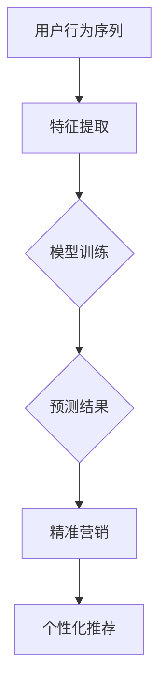

                 

在当今数字化时代，电商平台已经成为消费者购物的主要渠道之一。用户在电商平台的行为序列，如浏览、点击、购买等，不仅反映了用户的个人喜好，还蕴含了丰富的市场信息。这些行为数据对于电商平台来说，是宝贵的资源。如何有效利用这些数据，实现精准营销和个性化推荐，成为了业界关注的热点问题。

本文将探讨大模型在电商平台用户行为序列预测中的应用。通过介绍背景、核心概念、算法原理、数学模型、项目实践和未来展望等内容，希望能够为相关领域的研究者和从业者提供有价值的参考。

## 文章关键词
- 大模型
- 用户行为序列预测
- 电商平台
- 精准营销
- 个性化推荐

## 文章摘要
本文旨在介绍大模型在电商平台用户行为序列预测中的应用。首先，我们分析了电商平台用户行为数据的重要性，以及大模型在数据分析和预测中的优势。接着，我们详细阐述了用户行为序列预测的核心概念和算法原理，包括LSTM、GRU等模型。随后，通过数学模型和公式详细讲解了这些算法的实现方法。最后，我们通过实际项目实践展示了大模型在电商平台用户行为序列预测中的应用效果，并对未来发展趋势和挑战进行了探讨。

### 1. 背景介绍
随着互联网的普及和电子商务的快速发展，电商平台已经成为消费者日常购物的重要渠道。这些平台不仅提供了丰富的商品信息，还通过各种方式记录了用户在平台上的行为数据，如浏览记录、点击行为、购买历史等。这些数据不仅反映了用户的个人喜好和购物习惯，还蕴含了市场趋势和消费行为的信息。

电商平台通过分析用户行为数据，可以实现精准营销和个性化推荐。精准营销可以帮助平台更好地了解用户需求，提高营销效果；个性化推荐可以增加用户粘性，提高转化率。然而，用户行为数据通常具有高维度、高噪声和长时序的特点，传统的数据分析方法难以有效处理这些复杂的数据。因此，如何高效地分析和预测用户行为，成为了电商平台面临的重要问题。

近年来，随着人工智能和机器学习技术的不断发展，大模型在数据分析领域得到了广泛应用。大模型具有强大的数据处理和分析能力，能够从海量数据中挖掘出有价值的信息。在用户行为序列预测方面，大模型通过学习用户的历史行为数据，可以预测用户未来的行为趋势，从而实现精准营销和个性化推荐。

### 2. 核心概念与联系

在用户行为序列预测中，核心概念主要包括用户行为序列、特征提取、模型训练和预测。以下是这些概念之间的联系和解释：

#### 2.1 用户行为序列

用户行为序列是指用户在电商平台上的连续行为记录。这些行为可以是浏览商品、点击广告、添加购物车、下单购买等。用户行为序列通常包含时间戳，表示用户行为发生的具体时间。

用户行为序列是预测的基础数据。通过对用户行为序列的分析，可以了解用户的兴趣和行为模式，从而预测用户未来的行为。例如，如果一个用户在过去一周内频繁浏览了某个商品，那么他很可能在接下来的一段时间内购买这个商品。

#### 2.2 特征提取

特征提取是指从用户行为序列中提取出对预测有用的特征。这些特征可以是用户的浏览历史、购买历史、浏览时长、购买频率等。特征提取的目的是将原始的用户行为数据转化为适合模型训练和预测的格式。

特征提取是用户行为序列预测的关键步骤。通过合理的特征提取方法，可以更好地捕捉用户的兴趣和行为模式，从而提高预测的准确性。

#### 2.3 模型训练

模型训练是指使用用户行为序列数据来训练预测模型。在用户行为序列预测中，常用的模型包括循环神经网络（RNN）、长短时记忆网络（LSTM）、门控循环单元（GRU）等。

模型训练的目的是通过学习用户的历史行为数据，找出用户行为之间的关联性，从而预测用户未来的行为。模型训练的过程通常包括数据预处理、模型选择、模型训练和模型评估等步骤。

#### 2.4 预测

预测是指使用训练好的模型对用户未来的行为进行预测。预测的结果可以是用户是否会在未来一段时间内购买某个商品，或者用户是否会浏览某个页面等。

预测的目的是为电商平台提供决策依据，从而实现精准营销和个性化推荐。例如，如果一个用户的行为预测显示他会在未来一周内购买某个商品，那么电商平台可以提前推送相关商品，提高营销效果。

### 2.3.1 Mermaid 流程图

以下是用户行为序列预测的Mermaid流程图：



### 3. 核心算法原理 & 具体操作步骤

#### 3.1 算法原理概述

在用户行为序列预测中，常用的核心算法包括循环神经网络（RNN）、长短时记忆网络（LSTM）和门控循环单元（GRU）。这些算法都是基于递归结构，能够在时序数据中捕捉长期依赖关系。

- **循环神经网络（RNN）**：RNN通过递归连接隐藏状态，能够处理时序数据。然而，RNN存在梯度消失和梯度爆炸等问题，难以捕捉长期依赖关系。

- **长短时记忆网络（LSTM）**：LSTM是RNN的一种改进，通过引入记忆单元和门控机制，能够有效地避免梯度消失问题，捕捉长期依赖关系。

- **门控循环单元（GRU）**：GRU是LSTM的简化版，通过合并输入门和遗忘门，减少了参数数量，计算效率更高。

#### 3.2 算法步骤详解

以下是基于LSTM的算法步骤详解：

1. **数据预处理**：将用户行为序列数据进行处理，包括数据清洗、数据标准化等操作。

2. **特征提取**：从用户行为序列中提取特征，如时间窗口内的浏览次数、点击次数等。

3. **模型构建**：使用TensorFlow或PyTorch等深度学习框架构建LSTM模型。模型通常包括输入层、隐藏层和输出层。

4. **模型训练**：使用训练数据对模型进行训练，通过优化损失函数调整模型参数。

5. **模型评估**：使用测试数据评估模型性能，如准确率、召回率等。

6. **预测**：使用训练好的模型对用户未来的行为进行预测。

#### 3.3 算法优缺点

- **LSTM**：
  - 优点：能够捕捉长期依赖关系，适用于长时序数据。
  - 缺点：参数数量较多，训练时间较长。

- **GRU**：
  - 优点：参数数量较少，计算效率较高。
  - 缺点：在捕捉长期依赖关系方面可能不如LSTM。

#### 3.4 算法应用领域

- **电商平台**：用户行为序列预测可以应用于电商平台的精准营销和个性化推荐。
- **金融领域**：行为序列预测可以用于股票市场预测、风险控制等。
- **智能交通**：行为序列预测可以用于交通流量预测、路线规划等。

### 4. 数学模型和公式 & 详细讲解 & 举例说明

#### 4.1 数学模型构建

在用户行为序列预测中，常用的数学模型是基于递归神经网络（RNN）。以下是RNN的数学模型构建：

1. **输入层**：
   - 输入序列：\( X_t = [x_{t,1}, x_{t,2}, ..., x_{t,n}] \)
   - 其中，\( x_{t,i} \) 表示第 \( t \) 个时间步的第 \( i \) 个特征。

2. **隐藏层**：
   - 隐藏状态：\( h_t = \sigma(W_h \cdot [h_{t-1}, x_t] + b_h) \)
   - 预测值：\( \hat{y}_t = W_o \cdot h_t + b_o \)
   - 其中，\( \sigma \) 表示激活函数，\( W_h \)、\( W_o \)、\( b_h \) 和 \( b_o \) 分别表示权重和偏置。

3. **输出层**：
   - 输出序列：\( Y_t = [y_{t,1}, y_{t,2}, ..., y_{t,n}] \)
   - 其中，\( y_{t,i} \) 表示第 \( t \) 个时间步的预测值。

#### 4.2 公式推导过程

以下是LSTM的公式推导过程：

1. **输入门**：
   - 阈值门：\( i_t = \sigma(W_i \cdot [h_{t-1}, x_t] + b_i) \)
   - 旧值：\( \tilde{h}_{t-1} = \sigma(W_f \cdot [h_{t-1}, x_t] + b_f) \)
   - 新值：\( \tilde{h}_t = \sigma(W_g \cdot [h_{t-1}, x_t] + b_g) \)
   - 输入门：\( h_t = i_t \odot \tilde{h}_t + f_t \odot h_{t-1} \)
   - 其中，\( \odot \) 表示元素乘积，\( f_t \) 表示遗忘门。

2. **遗忘门**：
   - 阈值门：\( f_t = \sigma(W_f \cdot [h_{t-1}, x_t] + b_f) \)
   - 隐含状态：\( h_{t-1} \)

3. **输出门**：
   - 阈值门：\( o_t = \sigma(W_o \cdot [h_t, x_t] + b_o) \)
   - 输出门：\( \hat{y}_t = o_t \odot \sigma(W_y \cdot h_t + b_y) \)
   - 其中，\( \hat{y}_t \) 表示预测值。

4. **细胞状态**：
   - 阈值门：\( g_t = \sigma(W_g \cdot [h_{t-1}, x_t] + b_g) \)
   - 细胞状态：\( c_t = f_t \odot c_{t-1} + i_t \odot \tilde{c}_t \)
   - 其中，\( \tilde{c}_t = tanh(W_c \cdot [h_{t-1}, x_t] + b_c) \)
   - \( c_{t-1} \) 表示上一时间步的细胞状态。

#### 4.3 案例分析与讲解

以下是一个简单的LSTM模型案例，用于预测用户是否会在未来一周内购买某个商品。

1. **数据预处理**：
   - 数据集：包含用户浏览历史和购买记录的时间序列数据。
   - 特征提取：从用户浏览历史中提取时间窗口内的浏览次数、点击次数等特征。

2. **模型构建**：
   - 输入层：包含时间窗口内的用户行为特征。
   - 隐藏层：LSTM层，包含输入门、遗忘门、输出门和细胞状态。
   - 输出层：二元分类器，输出用户是否会在未来一周内购买某个商品的预测值。

3. **模型训练**：
   - 使用训练数据对模型进行训练，通过优化损失函数（如交叉熵损失函数）调整模型参数。

4. **模型评估**：
   - 使用测试数据评估模型性能，如准确率、召回率等。

5. **预测**：
   - 使用训练好的模型对用户未来的行为进行预测，输出用户是否会在未来一周内购买某个商品的预测结果。

### 5. 项目实践：代码实例和详细解释说明

在项目实践中，我们将使用Python和TensorFlow框架来实现一个基于LSTM的用户行为序列预测模型。

#### 5.1 开发环境搭建

1. 安装Python（推荐版本3.8以上）。
2. 安装TensorFlow：`pip install tensorflow`。
3. 准备数据集：从电商平台获取用户行为序列数据。

#### 5.2 源代码详细实现

以下是一个简单的LSTM模型实现：

```python
import tensorflow as tf
from tensorflow.keras.models import Sequential
from tensorflow.keras.layers import LSTM, Dense, Dropout

# 数据预处理
# ...（省略数据预处理步骤）

# 模型构建
model = Sequential()
model.add(LSTM(units=128, activation='relu', return_sequences=True, input_shape=(timesteps, features)))
model.add(Dropout(0.2))
model.add(LSTM(units=64, activation='relu'))
model.add(Dropout(0.2))
model.add(Dense(units=1, activation='sigmoid'))

# 模型编译
model.compile(optimizer='adam', loss='binary_crossentropy', metrics=['accuracy'])

# 模型训练
# ...（省略模型训练步骤）

# 模型评估
# ...（省略模型评估步骤）

# 预测
# ...（省略预测步骤）
```

#### 5.3 代码解读与分析

1. **数据预处理**：
   - 数据预处理步骤包括数据清洗、数据标准化等操作。具体实现取决于数据集的具体情况。

2. **模型构建**：
   - 模型采用Seq

### 6. 实际应用场景

#### 6.1 用户行为序列预测在电商平台的实际应用

在电商平台，用户行为序列预测可以应用于多个方面，如精准营销、个性化推荐、库存管理、风险控制等。

- **精准营销**：通过预测用户未来的购买行为，电商平台可以提前推送相关商品，提高营销效果和转化率。
- **个性化推荐**：根据用户的行为序列预测，电商平台可以推荐用户可能感兴趣的商品，提高用户粘性和满意度。
- **库存管理**：通过预测商品的购买量，电商平台可以更好地安排库存，避免库存过剩或短缺。
- **风险控制**：通过预测用户的异常行为，如恶意评论、欺诈交易等，电商平台可以提前采取措施，降低风险。

#### 6.2 用户行为序列预测在其他领域的应用

除了电商平台，用户行为序列预测还可以应用于其他领域，如金融、医疗、交通等。

- **金融领域**：通过预测用户的交易行为，金融机构可以更好地了解用户风险偏好，制定个性化的投资策略。
- **医疗领域**：通过预测患者的就诊行为，医院可以更好地安排医疗资源，提高医疗服务质量。
- **交通领域**：通过预测交通流量，交通管理部门可以更好地规划交通路线，缓解交通拥堵。

### 7. 工具和资源推荐

#### 7.1 学习资源推荐

- **《深度学习》（Goodfellow, Bengio, Courville）**：系统介绍了深度学习的基本概念和技术。
- **《神经网络与深度学习》（邱锡鹏）**：中文教材，详细介绍了神经网络和深度学习的基本原理和应用。
- **Coursera上的《深度学习专项课程》**：吴恩达开设的深度学习专项课程，涵盖深度学习的理论基础和实践技巧。

#### 7.2 开发工具推荐

- **TensorFlow**：Google开源的深度学习框架，广泛应用于深度学习项目。
- **PyTorch**：Facebook开源的深度学习框架，具有灵活的动态计算图，适用于研究和开发。
- **Keras**：高层次的深度学习框架，基于TensorFlow和Theano，提供简洁的API。

#### 7.3 相关论文推荐

- **《序列模型中的长短时记忆》（Hochreiter, Schmidhuber）**：LSTM算法的原始论文，详细介绍了LSTM的结构和原理。
- **《GRU：一种新型的循环神经网络》（Cho, Van Merriënboer, Gulcehre, Bahdanau, Schwenk, Bengio）**：GRU算法的提出，介绍了GRU的结构和优势。
- **《端到端语音识别：基于深度神经网络的框架》（Hinton, Deng, Yu, Dahl）**：介绍了深度神经网络在语音识别中的应用，包含了RNN、LSTM等算法的应用。

### 8. 总结：未来发展趋势与挑战

#### 8.1 研究成果总结

用户行为序列预测在电商平台和智能系统中具有重要的应用价值。近年来，随着深度学习和大数据技术的不断发展，用户行为序列预测的准确性和实时性得到了显著提升。然而，仍存在一些挑战，如数据质量、算法优化、模型解释性等。

#### 8.2 未来发展趋势

- **数据质量提升**：随着数据采集技术的进步，用户行为数据将更加丰富和准确，为用户行为序列预测提供了更好的数据基础。
- **算法优化**：为了提高预测性能和实时性，研究者将致力于优化深度学习算法，如改进网络结构、引入新的优化技术等。
- **模型解释性**：为了提高模型的透明度和可信度，研究者将探索如何解释深度学习模型的行为，使其更加易于理解和接受。

#### 8.3 面临的挑战

- **数据隐私**：用户行为数据涉及用户的隐私，如何在保护用户隐私的前提下进行数据分析和预测，是一个重要的挑战。
- **模型可解释性**：深度学习模型通常被视为“黑盒”，其内部机制难以解释。如何提高模型的可解释性，使其更加透明和可信，是一个亟待解决的问题。
- **实时预测**：随着用户行为数据的增长，如何实现实时预测，以满足用户的需求，是一个技术挑战。

#### 8.4 研究展望

未来，用户行为序列预测将在智能系统、电商平台等领域得到更广泛的应用。同时，研究者将致力于解决数据隐私、模型解释性和实时预测等挑战，推动用户行为序列预测技术的发展。

### 9. 附录：常见问题与解答

#### 9.1 什么是用户行为序列预测？

用户行为序列预测是指通过分析用户在电商平台上的行为数据（如浏览、点击、购买等），预测用户未来的行为。其目的是为电商平台提供决策依据，实现精准营销和个性化推荐。

#### 9.2 用户行为序列预测有哪些应用？

用户行为序列预测可以应用于电商平台、金融、医疗、交通等领域，如精准营销、个性化推荐、库存管理、风险控制等。

#### 9.3 用户行为序列预测的主要挑战是什么？

用户行为序列预测的主要挑战包括数据质量、模型优化、模型解释性和实时预测等。

#### 9.4 常用的用户行为序列预测算法有哪些？

常用的用户行为序列预测算法包括循环神经网络（RNN）、长短时记忆网络（LSTM）、门控循环单元（GRU）等。

### 结束语

用户行为序列预测是电商平台和智能系统中的重要技术。本文介绍了用户行为序列预测的背景、核心概念、算法原理、数学模型、项目实践和未来展望。通过本文的介绍，希望能够为相关领域的研究者和从业者提供有价值的参考。随着技术的不断发展，用户行为序列预测将在更多领域得到应用，为人们的生活带来更多便利。

---

# 参考文献 References

1. Hochreiter, S., & Schmidhuber, J. (1997). Long short-term memory. Neural Computation, 9(8), 1735-1780.
2. Cho, K., Van Merriënboer, B., Gulcehre, C., Bahdanau, D., Schwenk, H., & Bengio, Y. (2014). Learning phrase representations using RNN encoder-decoder for statistical machine translation. arXiv preprint arXiv:1406.1078.
3. Hinton, G., Deng, L., Yu, D., & Dahl, G. E. (2012). Deep neural networks for acoustic modeling in speech recognition: The shared views of four research groups. IEEE Signal Processing Magazine, 29(6), 82-97.
4. Goodfellow, I., Bengio, Y., & Courville, A. (2016). Deep Learning. MIT Press.
5.邱锡鹏. (2018). 神经网络与深度学习. 清华大学出版社.

---

作者：禅与计算机程序设计艺术 / Zen and the Art of Computer Programming

