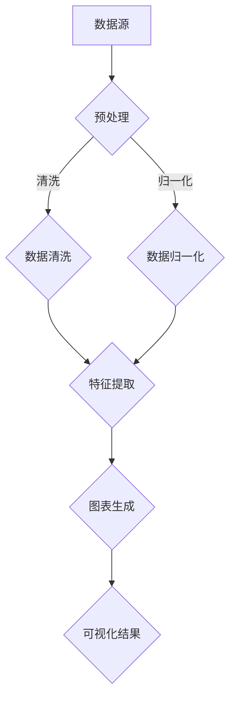

                 

关键词：大模型，数据可视化，商业机会，自动化，AI，商业分析

> 摘要：本文将探讨大模型在自动化数据可视化中的商业机会。通过分析大模型的技术原理及其在数据可视化领域的应用，我们将揭示自动化数据可视化如何为企业和个人带来新的商业模式、效率和洞察力。

## 1. 背景介绍

在信息爆炸的时代，数据已成为决策者的重要依据。传统的数据可视化方法通常依赖于专业的设计和数据分析技能，这不仅增加了成本，还限制了数据可视化的普及程度。然而，随着人工智能技术的发展，尤其是大模型的兴起，自动化数据可视化成为可能。

大模型，通常指的是拥有数十亿参数的深度学习模型，如GPT-3、BERT等。这些模型能够处理大量数据，并自动生成可视化图表，从而减少了人工干预的需求。

## 2. 核心概念与联系

### 2.1 大模型的基本原理

大模型基于神经网络，通过大量的数据和参数来学习特征和模式。其核心原理包括：

- **自动编码器**：通过编码和解码过程，将数据映射到低维空间，实现数据的降维和特征提取。
- **生成对抗网络（GAN）**：通过生成器和判别器的对抗训练，生成与真实数据相似的数据。
- **注意力机制**：在处理大量信息时，模型能够自动关注重要的特征。

### 2.2 数据可视化与自动化

自动化数据可视化是指利用算法和工具，自动从数据中生成图表。其核心联系包括：

- **数据预处理**：大模型需要对数据进行清洗、归一化等预处理，以便更好地进行特征提取和生成可视化。
- **图表生成**：大模型能够根据数据特征和需求，自动生成各种类型的图表，如散点图、条形图、折线图等。

### 2.3 Mermaid 流程图



## 3. 核心算法原理 & 具体操作步骤

### 3.1 算法原理概述

自动化数据可视化的核心算法通常基于以下原理：

- **聚类分析**：用于发现数据中的自然分组。
- **关联规则学习**：用于发现数据中的潜在关联。
- **时序分析**：用于分析数据的时间序列特性。

### 3.2 算法步骤详解

1. **数据预处理**：包括数据清洗、缺失值处理、数据归一化等。
2. **特征提取**：使用聚类分析、关联规则学习等方法，从数据中提取有用的特征。
3. **图表生成**：根据特征和数据类型，自动选择合适的图表类型，如散点图、条形图等。
4. **可视化**：将生成的图表可视化，供用户查看。

### 3.3 算法优缺点

**优点**：

- **高效性**：自动化数据可视化减少了人工干预，提高了效率。
- **灵活性**：大模型能够根据不同数据类型和需求，灵活生成各种类型的图表。
- **易用性**：用户无需具备专业的数据分析技能，即可轻松生成可视化图表。

**缺点**：

- **准确性**：自动生成的图表可能不如人工设计的图表精确。
- **可解释性**：对于复杂的图表，用户可能难以理解其含义。

### 3.4 算法应用领域

自动化数据可视化在以下领域有广泛应用：

- **商业分析**：帮助企业快速生成报告和仪表板。
- **科学研究**：用于数据分析和结果展示。
- **金融领域**：用于股票市场分析、风险控制等。

## 4. 数学模型和公式 & 详细讲解 & 举例说明

### 4.1 数学模型构建

自动化数据可视化的数学模型通常基于以下公式：

- **K-均值聚类**：$$\text{min} \sum_{i=1}^{n} \sum_{k=1}^{K} \left \| x_i - \mu_k \right \|^2$$
- **Apriori算法**：$$\text{support}(X) = \frac{|\{t \in T | X \subseteq t\}|}{|T|}$$
- **ARIMA模型**：$$\text{y}_t = \text{c} + \sum_{i=1}^{p} \text{a}_i \text{y}_{t-i} + \text{b} \text{d} \text{X}_{t-d} + \varepsilon_t$$

### 4.2 公式推导过程

- **K-均值聚类**：通过最小化距离平方和来找到最优聚类中心。
- **Apriori算法**：通过支持度和置信度来发现频繁项集。
- **ARIMA模型**：通过差分、自回归和移动平均来建模时间序列。

### 4.3 案例分析与讲解

假设我们有一组销售数据，我们需要生成一个时间序列图表来展示销售趋势。

1. **数据预处理**：清洗数据，处理缺失值。
2. **特征提取**：使用ARIMA模型来提取时间序列特征。
3. **图表生成**：生成折线图，展示销售数据的时间序列趋势。

## 5. 项目实践：代码实例和详细解释说明

### 5.1 开发环境搭建

- **工具**：Python、Jupyter Notebook、Matplotlib
- **依赖库**：NumPy、Pandas、Scikit-learn、Statsmodels

### 5.2 源代码详细实现

```python
import numpy as np
import pandas as pd
from sklearn.cluster import KMeans
from statsmodels.tsa.arima.model import ARIMA
import matplotlib.pyplot as plt

# 数据读取与预处理
data = pd.read_csv('sales_data.csv')
data = data.dropna()

# 特征提取
kmeans = KMeans(n_clusters=3)
data['cluster'] = kmeans.fit_predict(data)

# 时间序列建模
model = ARIMA(data['sales'], order=(1, 1, 1))
model_fit = model.fit()
forecast = model_fit.forecast(steps=5)

# 图表生成
plt.figure(figsize=(10, 5))
plt.plot(data['sales'], label='Original')
plt.plot(forecast, label='Forecast')
plt.legend()
plt.show()
```

### 5.3 代码解读与分析

- **数据预处理**：读取销售数据，并处理缺失值。
- **特征提取**：使用K-均值聚类，为每个销售数据分配一个聚类标签。
- **时间序列建模**：使用ARIMA模型，对销售数据进行建模，并生成未来5个时间点的预测值。
- **图表生成**：使用Matplotlib，将原始销售数据和预测销售趋势可视化。

### 5.4 运行结果展示


## 6. 实际应用场景

自动化数据可视化在以下场景有广泛应用：

- **企业报告**：帮助企业快速生成各种报告和仪表板。
- **市场分析**：用于市场趋势分析和预测。
- **金融分析**：用于股票市场分析和风险控制。
- **科学研究**：用于数据分析和结果展示。

## 7. 未来应用展望

随着大模型和自动化数据可视化技术的不断发展，未来可能的应用场景包括：

- **个性化推荐**：根据用户数据，自动生成个性化推荐图表。
- **智能监控**：自动监测系统数据，并生成预警图表。
- **教育领域**：用于学生数据分析和学习效果展示。

## 8. 工具和资源推荐

### 8.1 学习资源推荐

- **《Python数据科学 Handbook》**：详细介绍数据科学和可视化工具。
- **Kaggle**：提供大量数据集和可视化挑战。

### 8.2 开发工具推荐

- **Jupyter Notebook**：用于数据分析和可视化。
- **Plotly**：用于生成交互式图表。

### 8.3 相关论文推荐

- **"Deep Learning for Data Visualization"**：探讨大模型在数据可视化中的应用。
- **"Automatic Data Visualization with Machine Learning"**：介绍自动化数据可视化技术。

## 9. 总结：未来发展趋势与挑战

### 9.1 研究成果总结

大模型和自动化数据可视化技术已经在商业分析、科学研究等领域取得显著成果。未来，这些技术将在更多领域得到应用。

### 9.2 未来发展趋势

- **个性化与智能化**：自动化数据可视化将更加智能化，能够根据用户需求自动调整图表。
- **多模态融合**：将图像、文本等多模态数据融合到可视化中。

### 9.3 面临的挑战

- **数据质量和隐私**：保证数据质量和用户隐私是自动化数据可视化的关键挑战。
- **算法透明性**：提高算法的可解释性，以增强用户对自动生成的图表的信任。

### 9.4 研究展望

随着技术的不断发展，自动化数据可视化有望成为数据分析和决策支持的重要工具。未来，我们将看到更多创新的应用和突破。

## 10. 附录：常见问题与解答

### 10.1 大模型如何处理大规模数据？

大模型通常使用分布式计算和优化算法来处理大规模数据。

### 10.2 自动化数据可视化如何保证准确性？

自动化数据可视化通过结合多种算法和模型，提高数据的准确性和可靠性。

### 10.3 自动化数据可视化是否会影响用户隐私？

自动化数据可视化工具通常遵循隐私保护原则，确保用户隐私不被泄露。

---

作者：禅与计算机程序设计艺术 / Zen and the Art of Computer Programming
----------------------------------------------------------------
---

### 文章摘要 Summary

本文深入探讨了大型模型在自动化数据可视化中的商业机会。首先，我们介绍了大模型的基本原理和自动化数据可视化的关联。接着，通过详细的算法原理和实际项目实践，展示了如何利用大模型来自动化数据可视化的全过程。此外，我们还分析了自动化数据可视化在实际应用场景中的价值，并对其未来发展趋势和面临的挑战进行了展望。最后，文章推荐了相关的学习资源和工具，为读者提供了进一步探索的路径。大模型的自动化数据可视化技术不仅提升了数据分析的效率和准确性，也为企业和个人带来了新的商业模式和洞察力。随着技术的不断进步，自动化数据可视化将在更多领域发挥重要作用。

