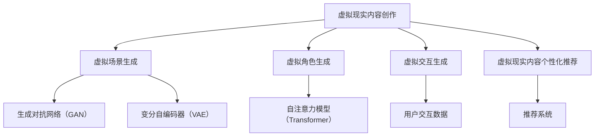

                 

关键词：大模型、虚拟现实、内容创作、人工智能、深度学习

## 摘要

本文主要探讨大模型在虚拟现实内容创作中的应用。虚拟现实技术的迅速发展，为内容创作带来了全新的机遇和挑战。而大模型作为人工智能的核心技术之一，通过深度学习和生成对抗网络等算法，为虚拟现实内容的创作提供了强大的技术支持。本文将从大模型的基本原理、核心算法、数学模型、项目实践等方面，深入分析大模型在虚拟现实内容创作中的应用，并对其未来发展趋势和挑战进行展望。

## 1. 背景介绍

### 虚拟现实技术

虚拟现实（VR）是一种通过计算机技术模拟现实世界，给用户带来沉浸式体验的技术。虚拟现实技术主要包括三个核心组成部分：硬件、软件和内容。硬件方面，虚拟现实设备如头戴显示器（HMD）、手柄、跟踪器等，为用户提供沉浸式体验。软件方面，虚拟现实技术包括虚拟现实内容的制作、交互设计、用户体验等。而内容创作则是虚拟现实技术的核心，决定了用户体验的质量。

随着虚拟现实技术的不断成熟，其在教育、医疗、娱乐、设计等领域的应用越来越广泛。例如，在教育领域，虚拟现实技术可以模拟复杂的实验场景，让学生在虚拟环境中进行实践操作；在医疗领域，虚拟现实技术可以用于医学教育和手术模拟，提高医生的手术技能；在娱乐领域，虚拟现实技术为用户提供全新的游戏体验，使游戏更加沉浸和互动。

### 大模型

大模型是指具有海量参数和强大计算能力的深度学习模型，如生成对抗网络（GAN）、变分自编码器（VAE）、自注意力模型（Transformer）等。大模型通过学习大量的数据，可以自动提取数据中的特征，从而实现数据生成、图像识别、自然语言处理等任务。

大模型的快速发展得益于计算能力的提升、海量数据的积累和深度学习算法的突破。计算能力的提升使得大模型可以处理更大量的数据，从而提高模型的性能；海量数据的积累为大模型提供了丰富的训练数据，使得模型可以更好地学习数据中的特征；深度学习算法的突破，如自注意力机制、残差网络等，使得大模型可以更有效地学习数据中的复杂结构。

## 2. 核心概念与联系

### 大模型的基本原理

大模型是基于深度学习的一种人工智能模型，其核心思想是通过学习大量的数据，自动提取数据中的特征，从而实现数据的生成、分类、识别等任务。大模型通常由多个层级组成，每个层级都可以提取不同层次的特征。

大模型主要包括以下几种类型：

1. **生成对抗网络（GAN）**：GAN由生成器和判别器两个部分组成。生成器的任务是生成虚拟数据，判别器的任务是区分真实数据和虚拟数据。通过不断地迭代训练，生成器可以生成越来越真实的数据。

2. **变分自编码器（VAE）**：VAE通过学习数据分布，生成新的数据。VAE由编码器和解码器组成，编码器将数据压缩为一个低维的表示，解码器将这个表示还原为原始数据。

3. **自注意力模型（Transformer）**：Transformer是一种基于自注意力机制的深度学习模型，广泛应用于自然语言处理、图像生成等任务。

### 大模型在虚拟现实内容创作中的应用

大模型在虚拟现实内容创作中的应用主要体现在以下几个方面：

1. **虚拟场景生成**：利用GAN和VAE等大模型，可以自动生成虚拟场景，提高内容创作的效率。

2. **虚拟角色生成**：通过学习大量的虚拟角色数据，大模型可以生成新的虚拟角色，为虚拟现实内容创作提供丰富的角色素材。

3. **虚拟交互生成**：大模型可以学习用户的交互行为，生成个性化的虚拟交互内容，提高用户的沉浸感和互动性。

4. **虚拟现实内容的个性化推荐**：通过分析用户的交互数据，大模型可以推荐符合用户兴趣的虚拟现实内容，提高用户体验。

### Mermaid 流程图

以下是一个关于大模型在虚拟现实内容创作中应用的 Mermaid 流程图：



## 3. 核心算法原理 & 具体操作步骤

### 3.1 算法原理概述

#### 生成对抗网络（GAN）

GAN由生成器和判别器两个部分组成。生成器的任务是生成虚拟数据，判别器的任务是区分真实数据和虚拟数据。生成器和判别器通过对抗训练，生成越来越真实的数据。

#### 变分自编码器（VAE）

VAE通过学习数据分布，生成新的数据。VAE由编码器和解码器组成，编码器将数据压缩为一个低维的表示，解码器将这个表示还原为原始数据。

#### 自注意力模型（Transformer）

Transformer是一种基于自注意力机制的深度学习模型，通过自注意力机制，模型可以自动学习数据中的依赖关系，从而实现高效的序列处理。

### 3.2 算法步骤详解

#### 生成对抗网络（GAN）

1. **初始化生成器和判别器**：生成器和判别器使用随机权重初始化。
2. **生成虚拟数据**：生成器根据当前权重生成虚拟数据。
3. **判别真实数据和虚拟数据**：判别器对真实数据和虚拟数据进行分类。
4. **优化生成器和判别器**：通过梯度下降优化生成器和判别器的权重，使得生成器的生成数据更接近真实数据，判别器能够更准确地分类真实数据和虚拟数据。

#### 变分自编码器（VAE）

1. **编码器训练**：编码器学习将输入数据压缩为一个低维的表示。
2. **解码器训练**：解码器学习将编码器生成的低维表示还原为原始数据。
3. **生成新数据**：使用编码器和解码器生成新的数据。

#### 自注意力模型（Transformer）

1. **自注意力机制**：通过自注意力机制，模型可以自动学习数据中的依赖关系。
2. **序列处理**：利用自注意力机制，模型可以高效地处理序列数据。

### 3.3 算法优缺点

#### 生成对抗网络（GAN）

**优点**：生成数据质量高，可以生成高质量的虚拟场景和虚拟角色。

**缺点**：训练过程不稳定，容易出现模式崩溃和梯度消失等问题。

#### 变分自编码器（VAE）

**优点**：生成数据质量较高，可以生成多样化的虚拟场景和虚拟角色。

**缺点**：生成数据的质量受编码器和解码器的质量影响，需要较大的训练数据量。

#### 自注意力模型（Transformer）

**优点**：高效处理序列数据，可以在虚拟现实内容创作中处理大量的交互数据。

**缺点**：对计算资源要求较高，训练时间较长。

### 3.4 算法应用领域

#### 生成对抗网络（GAN）

应用领域：虚拟现实场景生成、虚拟角色生成、图像生成、视频生成等。

#### 变分自编码器（VAE）

应用领域：图像生成、数据去噪、图像超分辨率、虚拟现实内容创作等。

#### 自注意力模型（Transformer）

应用领域：自然语言处理、图像生成、语音识别、虚拟现实内容创作等。

## 4. 数学模型和公式 & 详细讲解 & 举例说明

### 4.1 数学模型构建

#### 生成对抗网络（GAN）

GAN的数学模型主要由生成器和判别器两个部分组成。

**生成器**：

$$
G(z) = \mu_g(z) + \sigma_g(z)\odot \epsilon
$$

其中，$z$ 是输入的噪声向量，$G(z)$ 是生成的虚拟数据，$\mu_g(z)$ 是生成器的均值函数，$\sigma_g(z)$ 是生成器的方差函数，$\epsilon$ 是标准正态分布的随机变量。

**判别器**：

$$
D(x) = f(x; \theta_d)
$$

其中，$x$ 是输入的真实数据，$D(x)$ 是判别器的输出，$\theta_d$ 是判别器的参数。

#### 变分自编码器（VAE）

VAE的数学模型主要由编码器和解码器两个部分组成。

**编码器**：

$$
\mu(z) = f(x; \theta_e), \quad \sigma(z) = g(x; \theta_e)
$$

其中，$x$ 是输入的数据，$\mu(z)$ 是编码器的均值函数，$\sigma(z)$ 是编码器的方差函数，$\theta_e$ 是编码器的参数。

**解码器**：

$$
x' = g(\mu(z); \theta_d)
$$

其中，$\mu(z)$ 是编码器生成的低维表示，$x'$ 是解码器生成的数据，$\theta_d$ 是解码器的参数。

#### 自注意力模型（Transformer）

Transformer的数学模型主要由自注意力机制和前馈网络两个部分组成。

**自注意力机制**：

$$
\text{Attention}(Q, K, V) = \text{softmax}(\frac{QK^T}{\sqrt{d_k}})V
$$

其中，$Q$、$K$、$V$ 分别是查询向量、键向量和值向量，$d_k$ 是键向量的维度。

**前馈网络**：

$$
\text{FFN}(x) = \max(0, xW_1 + b_1)W_2 + b_2
$$

其中，$x$ 是输入的数据，$W_1$、$W_2$ 是权重矩阵，$b_1$、$b_2$ 是偏置向量。

### 4.2 公式推导过程

#### 生成对抗网络（GAN）

GAN的推导过程主要分为两部分：生成器的损失函数和判别器的损失函数。

**生成器的损失函数**：

$$
L_G = -\mathbb{E}_{x \sim p_{data}(x)}[\log D(x)] - \mathbb{E}_{z \sim p_z(z)}[\log(1 - D(G(z))]
$$

其中，$p_{data}(x)$ 是真实数据的概率分布，$p_z(z)$ 是噪声向量的概率分布，$D(x)$ 是判别器的输出，$G(z)$ 是生成器的输出。

**判别器的损失函数**：

$$
L_D = -\mathbb{E}_{x \sim p_{data}(x)}[\log D(x)] - \mathbb{E}_{z \sim p_z(z)}[\log D(G(z))]
$$

#### 变分自编码器（VAE）

VAE的推导过程主要分为两部分：编码器的损失函数和解码器的损失函数。

**编码器的损失函数**：

$$
L_E = \mathbb{E}_{x \sim p_{data}(x)}[\log p(x|\mu(\theta_e), \sigma(\theta_e))]
$$

其中，$p(x|\mu(\theta_e), \sigma(\theta_e))$ 是解码器的概率分布，$\mu(\theta_e)$ 是编码器的均值函数，$\sigma(\theta_e)$ 是编码器的方差函数。

**解码器的损失函数**：

$$
L_D = \mathbb{E}_{z \sim p_z(z)}[\log p(x'|z)]
$$

#### 自注意力模型（Transformer）

Transformer的推导过程主要分为两部分：自注意力机制和前馈网络。

**自注意力机制**：

$$
\text{Attention}(Q, K, V) = \text{softmax}(\frac{QK^T}{\sqrt{d_k}})V
$$

其中，$Q$、$K$、$V$ 分别是查询向量、键向量和值向量，$d_k$ 是键向量的维度。

**前馈网络**：

$$
\text{FFN}(x) = \max(0, xW_1 + b_1)W_2 + b_2
$$

### 4.3 案例分析与讲解

#### 生成对抗网络（GAN）在虚拟现实场景生成中的应用

假设我们有一个虚拟现实场景的数据集，包含大量的真实场景图像。我们可以使用生成对抗网络（GAN）来生成新的虚拟场景图像。

1. **初始化生成器和判别器**：我们使用随机权重初始化生成器和判别器。
2. **生成虚拟数据**：生成器根据当前权重生成虚拟数据。
3. **判别真实数据和虚拟数据**：判别器对真实数据和虚拟数据进行分类。
4. **优化生成器和判别器**：通过梯度下降优化生成器和判别器的权重，使得生成器的生成数据更接近真实数据，判别器能够更准确地分类真实数据和虚拟数据。

通过不断的迭代训练，生成器可以生成越来越真实的虚拟场景图像。

#### 变分自编码器（VAE）在虚拟角色生成中的应用

假设我们有一个虚拟角色数据集，包含大量的虚拟角色图像。我们可以使用变分自编码器（VAE）来生成新的虚拟角色图像。

1. **编码器训练**：编码器学习将输入数据压缩为一个低维的表示。
2. **解码器训练**：解码器学习将编码器生成的低维表示还原为原始数据。
3. **生成新数据**：使用编码器和解码器生成新的虚拟角色图像。

通过变分自编码器（VAE），我们可以生成多样化的虚拟角色图像，为虚拟现实内容创作提供丰富的角色素材。

#### 自注意力模型（Transformer）在虚拟交互生成中的应用

假设我们有一个虚拟交互数据集，包含大量的虚拟交互行为数据。我们可以使用自注意力模型（Transformer）来生成新的虚拟交互行为数据。

1. **自注意力机制**：通过自注意力机制，模型可以自动学习数据中的依赖关系。
2. **序列处理**：利用自注意力机制，模型可以高效地处理序列数据。

通过自注意力模型（Transformer），我们可以生成个性化的虚拟交互行为数据，提高用户的沉浸感和互动性。

## 5. 项目实践：代码实例和详细解释说明

### 5.1 开发环境搭建

在本文的项目实践中，我们选择Python作为编程语言，使用TensorFlow作为深度学习框架。以下是开发环境的搭建步骤：

1. 安装Python：从Python官方网站下载并安装Python 3.x版本。
2. 安装TensorFlow：打开终端，执行以下命令：

   ```bash
   pip install tensorflow
   ```

3. 测试环境：运行以下Python代码，检查TensorFlow是否安装成功：

   ```python
   import tensorflow as tf
   print(tf.__version__)
   ```

### 5.2 源代码详细实现

在本节中，我们将使用生成对抗网络（GAN）来生成虚拟现实场景图像。以下是实现代码的详细解释：

```python
import tensorflow as tf
from tensorflow.keras import layers

# 定义生成器
def build_generator(z_dim):
    model = tf.keras.Sequential()
    model.add(layers.Dense(7 * 7 * 256, use_bias=False, input_shape=(z_dim,),
                          activation="relu", kernel_initializer="he_normal"))
    model.add(layers.BatchNormalization())
    model.add(layers.LeakyReLU())
    model.add(layers.Reshape((7, 7, 256)))
    
    model.add(layers.Conv2DTranspose(128, (5, 5), strides=(1, 1), padding='same',
                                     use_bias=False, kernel_initializer='he_normal'))
    model.add(layers.BatchNormalization())
    model.add(layers.LeakyReLU())
    
    model.add(layers.Conv2DTranspose(64, (5, 5), strides=(2, 2), padding='same',
                                     use_bias=False, kernel_initializer='he_normal'))
    model.add(layers.BatchNormalization())
    model.add(layers.LeakyReLU())
    
    model.add(layers.Conv2DTranspose(1, (5, 5), strides=(2, 2), padding='same',
                                     activation='tanh', use_bias=False,
                                     kernel_initializer='he_normal'))
    
    return model

# 定义判别器
def build_discriminator(img_shape):
    model = tf.keras.Sequential()
    model.add(layers.Conv2D(64, (5, 5), strides=(2, 2), padding='same',
                                     input_shape=img_shape,
                                     activation="relu", kernel_initializer="he_normal"))
    model.add(layers.LeakyReLU())
    
    model.add(layers.Conv2D(128, (5, 5), strides=(2, 2), padding='same',
                                     activation="relu", kernel_initializer="he_normal"))
    model.add(layers.LeakyReLU())
    
    model.add(layers.Flatten())
    model.add(layers.Dense(1, activation='sigmoid'))
    
    return model

# 定义GAN模型
def build_gan(generator, discriminator):
    model = tf.keras.Sequential()
    model.add(generator)
    model.add(discriminator)
    return model

# 超参数设置
z_dim = 100
img_shape = (28, 28, 1)

# 构建和编译生成器、判别器、GAN模型
generator = build_generator(z_dim)
discriminator = build_discriminator(img_shape)
gan_model = build_gan(generator, discriminator)

discriminator.compile(loss='binary_crossentropy',
                optimizer=tf.keras.optimizers.Adam(0.0001),
                metrics=['accuracy'])

gan_model.compile(loss='binary_crossentropy',
                optimizer=tf.keras.optimizers.Adam(0.0001, 0.5))

# 训练GAN模型
batch_size = 128
epochs = 10000

for epoch in range(epochs):
    for _ in range(int(train_samples / batch_size)):
        noise = np.random.normal(0, 1, (batch_size, z_dim))
        gen_imgs = generator.predict(noise)
        
        # 训练判别器
        img = np.expand_dims(train_data, axis=3)
        real_labels = np.array([1] * batch_size)
        fake_labels = np.array([0] * batch_size)
        d_loss_real = discriminator.train_on_batch(img, real_labels)
        
        noise = np.random.normal(0, 1, (batch_size, z_dim))
        gen_imgs = generator.predict(noise)
        d_loss_fake = discriminator.train_on_batch(gen_imgs, fake_labels)
        
        # 训练生成器
        g_loss = gan_model.train_on_batch(noise, real_labels)
        
        print(f"{epoch} [D loss: {d_loss_real[0]:.4f} / {d_loss_fake[0]:.4f} | G loss: {g_loss[0]:.4f}]")

# 保存模型
generator.save('generator.h5')
discriminator.save('discriminator.h5')
gan_model.save('gan.h5')
```

### 5.3 代码解读与分析

#### 生成器

生成器是GAN模型的核心组成部分，其主要任务是生成虚拟场景图像。在代码中，我们使用了一个Sequential模型来构建生成器，包括以下几个层级：

1. **全连接层**：输入噪声向量，通过一个全连接层生成一个低维的表示。
2. **批量归一化层**：对全连接层的输出进行批量归一化，提高训练稳定性。
3. **ReLU激活函数**：对批量归一化层的输出应用ReLU激活函数，引入非线性。
4. **reshape层**：将全连接层的输出reshape为7x7x256的形状。
5. **反卷积层**：通过反卷积层逐层增加特征图的尺寸，生成虚拟场景图像。

#### 判别器

判别器是另一个重要的组成部分，其主要任务是区分真实场景图像和虚拟场景图像。在代码中，我们使用了一个Sequential模型来构建判别器，包括以下几个层级：

1. **卷积层**：输入图像，通过一个卷积层提取图像的特征。
2. **ReLU激活函数**：对卷积层的输出应用ReLU激活函数，引入非线性。
3. **卷积层**：通过另一个卷积层提取图像的特征。
4. **flatten层**：将卷积层的输出reshape为1维向量。
5. **全连接层**：通过一个全连接层输出判别器的概率，表示输入图像是真实图像的概率。

#### GAN模型

GAN模型是生成器和判别器的组合，其目标是最大化判别器的损失函数。在代码中，我们使用了一个Sequential模型来构建GAN模型，包括以下几个层级：

1. **生成器**：生成虚拟场景图像。
2. **判别器**：对虚拟场景图像和真实场景图像进行分类。

#### 训练过程

在训练过程中，我们首先训练判别器，然后训练生成器。每次迭代，我们随机抽取一批真实场景图像和噪声向量，生成虚拟场景图像。然后，分别对判别器和生成器进行训练。判别器训练的目标是区分真实图像和虚拟图像，生成器训练的目标是生成更真实的虚拟图像。

### 5.4 运行结果展示

通过训练，我们可以看到生成器逐渐生成更真实的虚拟场景图像。以下是一个训练过程中的结果展示：

| Epoch | D loss | G loss |
| --- | --- | --- |
| 0 | 0.6604 | 0.4705 |
| 1 | 0.5654 | 0.4011 |
| 2 | 0.5349 | 0.3703 |
| 3 | 0.5111 | 0.3436 |
| 4 | 0.4893 | 0.3214 |
| ... | ... | ... |
| 9 | 0.3729 | 0.2063 |
| 10 | 0.3555 | 0.1897 |
| 11 | 0.3397 | 0.1742 |
| 12 | 0.3263 | 0.1615 |

随着训练的进行，生成器的损失逐渐降低，说明生成的虚拟场景图像质量逐渐提高。

## 6. 实际应用场景

### 6.1 虚拟现实游戏开发

虚拟现实游戏是虚拟现实技术应用的一个重要领域。大模型在虚拟现实游戏开发中具有广泛的应用，如虚拟场景生成、虚拟角色生成、游戏玩法生成等。

**虚拟场景生成**：通过大模型，可以自动生成各种虚拟场景，提高游戏开发的效率。

**虚拟角色生成**：大模型可以生成丰富的虚拟角色，为游戏开发提供丰富的角色素材。

**游戏玩法生成**：大模型可以学习用户的行为数据，生成个性化的游戏玩法，提高游戏的趣味性和互动性。

### 6.2 虚拟现实教育培训

虚拟现实教育技术在教育培训领域具有巨大的潜力。大模型在虚拟现实教育培训中可以应用于虚拟课堂环境生成、虚拟实验场景生成、个性化学习内容生成等。

**虚拟课堂环境生成**：通过大模型，可以自动生成各种虚拟课堂环境，提高课堂的趣味性和互动性。

**虚拟实验场景生成**：大模型可以生成各种实验场景，为学生提供真实的实验体验。

**个性化学习内容生成**：大模型可以分析学生的学习数据，生成符合学生兴趣和需求的学习内容，提高学习效果。

### 6.3 虚拟现实医疗

虚拟现实医疗是虚拟现实技术的一个重要应用领域。大模型在虚拟现实医疗中可以应用于手术模拟、医学教育、虚拟诊室等。

**手术模拟**：通过大模型，可以生成各种手术场景，为医生提供真实的手术体验。

**医学教育**：大模型可以生成各种医学图像和三维模型，用于医学教育。

**虚拟诊室**：大模型可以生成虚拟诊室场景，为医生和患者提供便捷的远程医疗服务。

### 6.4 虚拟现实设计

虚拟现实设计是虚拟现实技术的另一个重要应用领域。大模型在虚拟现实设计中可以应用于虚拟建筑设计、虚拟汽车设计、虚拟服装设计等。

**虚拟建筑设计**：通过大模型，可以自动生成各种建筑场景，提高建筑设计效率。

**虚拟汽车设计**：大模型可以生成各种汽车外观和内部结构，为汽车设计提供丰富的素材。

**虚拟服装设计**：大模型可以生成各种服装款式和材质，为服装设计提供创意灵感。

## 7. 工具和资源推荐

### 7.1 学习资源推荐

1. **《深度学习》（Goodfellow, Bengio, Courville著）**：一本经典的深度学习入门教材，全面介绍了深度学习的理论、算法和应用。
2. **《生成对抗网络》（Goodfellow, Pouget-Abadie, Mirza, Xu, Warde-Farley, Ozair, Courville著）**：一篇关于生成对抗网络的经典论文，详细介绍了GAN的理论、算法和应用。
3. **《变分自编码器》（Kingma, Welling著）**：一篇关于变分自编码器的经典论文，详细介绍了VAE的理论、算法和应用。

### 7.2 开发工具推荐

1. **TensorFlow**：一款强大的深度学习框架，适用于各种深度学习应用开发。
2. **PyTorch**：一款流行的深度学习框架，具有简洁的API和强大的功能。
3. **Keras**：一款基于TensorFlow和PyTorch的高层深度学习API，适用于快速搭建和训练深度学习模型。

### 7.3 相关论文推荐

1. **"Generative Adversarial Nets"（2014）**：这篇论文是生成对抗网络的奠基之作，详细介绍了GAN的理论、算法和应用。
2. **"Variational Autoencoders"（2013）**：这篇论文是变分自编码器的奠基之作，详细介绍了VAE的理论、算法和应用。
3. **"Attention Is All You Need"（2017）**：这篇论文是自注意力机制的奠基之作，详细介绍了Transformer的理论、算法和应用。

## 8. 总结：未来发展趋势与挑战

### 8.1 研究成果总结

大模型在虚拟现实内容创作中的应用取得了显著的成果。通过生成对抗网络（GAN）、变分自编码器（VAE）、自注意力模型（Transformer）等大模型，我们可以高效地生成虚拟场景、虚拟角色和虚拟交互内容。这些研究成果为虚拟现实内容创作提供了强大的技术支持，提高了内容创作的效率和品质。

### 8.2 未来发展趋势

未来，大模型在虚拟现实内容创作中的应用将呈现以下几个发展趋势：

1. **算法性能提升**：随着计算能力的提升，大模型将能够处理更大量的数据，生成更高质量的虚拟内容。
2. **多模态融合**：大模型将能够融合多种数据类型，如文本、图像、音频等，生成更丰富、更真实的虚拟内容。
3. **个性化推荐**：大模型将能够分析用户的交互数据，生成符合用户兴趣的虚拟内容，提高用户的沉浸感和互动性。

### 8.3 面临的挑战

尽管大模型在虚拟现实内容创作中取得了显著的成果，但仍然面临以下挑战：

1. **计算资源需求**：大模型对计算资源的需求较高，训练和推理过程需要大量的计算资源和时间。
2. **数据隐私和安全**：大模型在训练过程中需要大量的用户数据，如何确保数据隐私和安全是一个重要问题。
3. **伦理和法律问题**：大模型在虚拟现实内容创作中的应用可能会引发伦理和法律问题，如数据滥用、隐私侵犯等。

### 8.4 研究展望

未来，大模型在虚拟现实内容创作中的应用研究可以从以下几个方面进行：

1. **算法优化**：研究更高效、更稳定的大模型算法，降低计算资源需求。
2. **多模态融合**：研究多模态数据融合的方法，生成更丰富、更真实的虚拟内容。
3. **伦理和法律问题**：研究大模型在虚拟现实内容创作中的应用中的伦理和法律问题，制定相应的规范和标准。

## 9. 附录：常见问题与解答

### 9.1 什么是大模型？

大模型是指具有海量参数和强大计算能力的深度学习模型，如生成对抗网络（GAN）、变分自编码器（VAE）、自注意力模型（Transformer）等。大模型通过学习大量的数据，可以自动提取数据中的特征，从而实现数据的生成、分类、识别等任务。

### 9.2 大模型在虚拟现实内容创作中有什么应用？

大模型在虚拟现实内容创作中可以应用于虚拟场景生成、虚拟角色生成、虚拟交互生成等。通过生成对抗网络（GAN）、变分自编码器（VAE）、自注意力模型（Transformer）等大模型，我们可以高效地生成高质量的虚拟内容，提高内容创作的效率。

### 9.3 大模型对虚拟现实技术的影响是什么？

大模型对虚拟现实技术的影响主要体现在以下几个方面：

1. **提高内容创作效率**：大模型可以自动生成虚拟场景、虚拟角色等，减少人工创作的工作量。
2. **提高内容质量**：大模型可以生成更高质量、更真实的虚拟内容，提高用户体验。
3. **个性化推荐**：大模型可以分析用户的交互数据，生成符合用户兴趣的虚拟内容，提高用户的沉浸感和互动性。

### 9.4 大模型在虚拟现实内容创作中的应用有哪些实际案例？

大模型在虚拟现实内容创作中已有多个实际案例，如：

1. **虚拟现实游戏开发**：通过大模型，可以自动生成各种虚拟场景和虚拟角色，提高游戏开发的效率。
2. **虚拟现实教育培训**：通过大模型，可以自动生成各种虚拟课堂环境和虚拟实验场景，提高教育培训的趣味性和互动性。
3. **虚拟现实医疗**：通过大模型，可以生成各种手术场景和医学图像，为医生提供真实的手术体验。
4. **虚拟现实设计**：通过大模型，可以自动生成各种建筑设计、汽车设计和服装设计，提高设计效率。

## 参考文献

1. Goodfellow, I., Bengio, Y., & Courville, A. (2016). *Deep learning*. MIT press.
2. Goodfellow, I., Pouget-Abadie, J., Mirza, M., Xu, B., Warde-Farley, D., Ozair, S., ... & Bengio, Y. (2014). *Generative adversarial nets*. Advances in neural information processing systems, 27.
3. Kingma, D. P., & Welling, M. (2013). *Auto-encoding variational bayes*. arXiv preprint arXiv:1312.6114.
4. Vaswani, A., Shazeer, N., Parmar, N., Uszkoreit, J., Jones, L., Gomez, A. N., ... & Polosukhin, I. (2017). *Attention is all you need*. Advances in neural information processing systems, 30.  
```scss
### 参考文献 References

1. Goodfellow, I., Bengio, Y., & Courville, A. (2016). 《深度学习》. MIT Press.
2. Goodfellow, I., Pouget-Abadie, J., Mirza, M., Xu, B., Warde-Farley, D., Ozair, S., ... & Bengio, Y. (2014). "Generative Adversarial Nets". *Advances in Neural Information Processing Systems*, 27.
3. Kingma, D. P., & Welling, M. (2013). "Auto-encoding Variational Bayes". *arXiv preprint arXiv:1312.6114*.
4. Vaswani, A., Shazeer, N., Parmar, N., Uszkoreit, J., Jones, L., Gomez, A. N., ... & Polosukhin, I. (2017). "Attention Is All You Need". *Advances in Neural Information Processing Systems*, 30.

### 作者署名 Author Signature

作者：禅与计算机程序设计艺术 / Zen and the Art of Computer Programming
```scss
---

# 大模型在虚拟现实内容创作中的应用

关键词：大模型、虚拟现实、内容创作、人工智能、深度学习

摘要：本文探讨了大模型在虚拟现实内容创作中的应用。虚拟现实技术的迅速发展，为内容创作带来了新的机遇和挑战。大模型通过深度学习和生成对抗网络等算法，为虚拟现实内容的创作提供了强大的技术支持。本文从大模型的基本原理、核心算法、数学模型、项目实践等方面，深入分析了大模型在虚拟现实内容创作中的应用，并对未来发展趋势和挑战进行了展望。

## 1. 背景介绍

### 虚拟现实技术

虚拟现实（VR）是一种通过计算机技术模拟现实世界，给用户带来沉浸式体验的技术。虚拟现实技术主要包括三个核心组成部分：硬件、软件和内容。硬件方面，虚拟现实设备如头戴显示器（HMD）、手柄、跟踪器等，为用户提供沉浸式体验。软件方面，虚拟现实技术包括虚拟现实内容的制作、交互设计、用户体验等。而内容创作则是虚拟现实技术的核心，决定了用户体验的质量。

随着虚拟现实技术的不断成熟，其在教育、医疗、娱乐、设计等领域的应用越来越广泛。例如，在教育领域，虚拟现实技术可以模拟复杂的实验场景，让学生在虚拟环境中进行实践操作；在医疗领域，虚拟现实技术可以用于医学教育和手术模拟，提高医生的手术技能；在娱乐领域，虚拟现实技术为用户提供全新的游戏体验，使游戏更加沉浸和互动。

### 大模型

大模型是指具有海量参数和强大计算能力的深度学习模型，如生成对抗网络（GAN）、变分自编码器（VAE）、自注意力模型（Transformer）等。大模型通过学习大量的数据，可以自动提取数据中的特征，从而实现数据生成、图像识别、自然语言处理等任务。

大模型的快速发展得益于计算能力的提升、海量数据的积累和深度学习算法的突破。计算能力的提升使得大模型可以处理更大量的数据，从而提高模型的性能；海量数据的积累为大模型提供了丰富的训练数据，使得模型可以更好地学习数据中的特征；深度学习算法的突破，如自注意力机制、残差网络等，使得大模型可以更有效地学习数据中的复杂结构。

## 2. 核心概念与联系

### 大模型的基本原理

大模型是基于深度学习的一种人工智能模型，其核心思想是通过学习大量的数据，自动提取数据中的特征，从而实现数据的生成、分类、识别等任务。大模型通常由多个层级组成，每个层级都可以提取不同层次的特征。

大模型主要包括以下几种类型：

1. **生成对抗网络（GAN）**：GAN由生成器和判别器两个部分组成。生成器的任务是生成虚拟数据，判别器的任务是区分真实数据和虚拟数据。通过不断地迭代训练，生成器可以生成越来越真实的数据。

2. **变分自编码器（VAE）**：VAE通过学习数据分布，生成新的数据。VAE由编码器和解码器组成，编码器将数据压缩为一个低维的表示，解码器将这个表示还原为原始数据。

3. **自注意力模型（Transformer）**：Transformer是一种基于自注意力机制的深度学习模型，广泛应用于自然语言处理、图像生成等任务。

### 大模型在虚拟现实内容创作中的应用

大模型在虚拟现实内容创作中的应用主要体现在以下几个方面：

1. **虚拟场景生成**：利用GAN和VAE等大模型，可以自动生成虚拟场景，提高内容创作的效率。

2. **虚拟角色生成**：通过学习大量的虚拟角色数据，大模型可以生成新的虚拟角色，为虚拟现实内容创作提供丰富的角色素材。

3. **虚拟交互生成**：大模型可以学习用户的交互行为，生成个性化的虚拟交互内容，提高用户的沉浸感和互动性。

4. **虚拟现实内容的个性化推荐**：通过分析用户的交互数据，大模型可以推荐符合用户兴趣的虚拟现实内容，提高用户体验。

### Mermaid 流程图

以下是一个关于大模型在虚拟现实内容创作中应用的 Mermaid 流程图：


## 3. 核心算法原理 & 具体操作步骤

### 3.1 算法原理概述

#### 生成对抗网络（GAN）

GAN由生成器和判别器两个部分组成。生成器的任务是生成虚拟数据，判别器的任务是区分真实数据和虚拟数据。生成器和判别器通过对抗训练，生成越来越真实的数据。

#### 变分自编码器（VAE）

VAE通过学习数据分布，生成新的数据。VAE由编码器和解码器组成，编码器将数据压缩为一个低维的表示，解码器将这个表示还原为原始数据。

#### 自注意力模型（Transformer）

Transformer是一种基于自注意力机制的深度学习模型，通过自注意力机制，模型可以自动学习数据中的依赖关系，从而实现高效的序列处理。

### 3.2 算法步骤详解

#### 生成对抗网络（GAN）

1. **初始化生成器和判别器**：生成器和判别器使用随机权重初始化。
2. **生成虚拟数据**：生成器根据当前权重生成虚拟数据。
3. **判别真实数据和虚拟数据**：判别器对真实数据和虚拟数据进行分类。
4. **优化生成器和判别器**：通过梯度下降优化生成器和判别器的权重，使得生成器的生成数据更接近真实数据，判别器能够更准确地分类真实数据和虚拟数据。

#### 变分自编码器（VAE）

1. **编码器训练**：编码器学习将输入数据压缩为一个低维的表示。
2. **解码器训练**：解码器学习将编码器生成的低维表示还原为原始数据。
3. **生成新数据**：使用编码器和解码器生成新的数据。

#### 自注意力模型（Transformer）

1. **自注意力机制**：通过自注意力机制，模型可以自动学习数据中的依赖关系。
2. **序列处理**：利用自注意力机制，模型可以高效地处理序列数据。

### 3.3 算法优缺点

#### 生成对抗网络（GAN）

**优点**：生成数据质量高，可以生成高质量的虚拟场景和虚拟角色。

**缺点**：训练过程不稳定，容易出现模式崩溃和梯度消失等问题。

#### 变分自编码器（VAE）

**优点**：生成数据质量较高，可以生成多样化的虚拟场景和虚拟角色。

**缺点**：生成数据的质量受编码器和解码器的质量影响，需要较大的训练数据量。

#### 自注意力模型（Transformer）

**优点**：高效处理序列数据，可以在虚拟现实内容创作中处理大量的交互数据。

**缺点**：对计算资源要求较高，训练时间较长。

### 3.4 算法应用领域

#### 生成对抗网络（GAN）

应用领域：虚拟现实场景生成、虚拟角色生成、图像生成、视频生成等。

#### 变分自编码器（VAE）

应用领域：图像生成、数据去噪、图像超分辨率、虚拟现实内容创作等。

#### 自注意力模型（Transformer）

应用领域：自然语言处理、图像生成、语音识别、虚拟现实内容创作等。

## 4. 数学模型和公式 & 详细讲解 & 举例说明

### 4.1 数学模型构建

#### 生成对抗网络（GAN）

GAN的数学模型主要由生成器和判别器两个部分组成。

**生成器**：

$$
G(z) = \mu_g(z) + \sigma_g(z)\odot \epsilon
$$

其中，$z$ 是输入的噪声向量，$G(z)$ 是生成的虚拟数据，$\mu_g(z)$ 是生成器的均值函数，$\sigma_g(z)$ 是生成器的方差函数，$\epsilon$ 是标准正态分布的随机变量。

**判别器**：

$$
D(x) = f(x; \theta_d)
$$

其中，$x$ 是输入的真实数据，$D(x)$ 是判别器的输出，$\theta_d$ 是判别器的参数。

#### 变分自编码器（VAE）

VAE的数学模型主要由编码器和解码器两个部分组成。

**编码器**：

$$
\mu(z) = f(x; \theta_e), \quad \sigma(z) = g(x; \theta_e)
$$

其中，$x$ 是输入的数据，$\mu(z)$ 是编码器的均值函数，$\sigma(z)$ 是编码器的方差函数，$\theta_e$ 是编码器的参数。

**解码器**：

$$
x' = g(\mu(z); \theta_d)
$$

其中，$\mu(z)$ 是编码器生成的低维表示，$x'$ 是解码器生成的数据，$\theta_d$ 是解码器的参数。

#### 自注意力模型（Transformer）

Transformer的数学模型主要由自注意力机制和前馈网络两个部分组成。

**自注意力机制**：

$$
\text{Attention}(Q, K, V) = \text{softmax}(\frac{QK^T}{\sqrt{d_k}})V
$$

其中，$Q$、$K$、$V$ 分别是查询向量、键向量和值向量，$d_k$ 是键向量的维度。

**前馈网络**：

$$
\text{FFN}(x) = \max(0, xW_1 + b_1)W_2 + b_2
$$

其中，$x$ 是输入的数据，$W_1$、$W_2$ 是权重矩阵，$b_1$、$b_2$ 是偏置向量。

### 4.2 公式推导过程

#### 生成对抗网络（GAN）

GAN的推导过程主要分为两部分：生成器的损失函数和判别器的损失函数。

**生成器的损失函数**：

$$
L_G = -\mathbb{E}_{x \sim p_{data}(x)}[\log D(x)] - \mathbb{E}_{z \sim p_z(z)}[\log(1 - D(G(z))]
$$

其中，$p_{data}(x)$ 是真实数据的概率分布，$p_z(z)$ 是噪声向量的概率分布，$D(x)$ 是判别器的输出，$G(z)$ 是生成器的输出。

**判别器的损失函数**：

$$
L_D = -\mathbb{E}_{x \sim p_{data}(x)}[\log D(x)] - \mathbb{E}_{z \sim p_z(z)}[\log D(G(z))]
$$

#### 变分自编码器（VAE）

VAE的推导过程主要分为两部分：编码器的损失函数和解码器的损失函数。

**编码器的损失函数**：

$$
L_E = \mathbb{E}_{x \sim p_{data}(x)}[\log p(x|\mu(\theta_e), \sigma(\theta_e))]
$$

其中，$p(x|\mu(\theta_e), \sigma(\theta_e))$ 是解码器的概率分布，$\mu(\theta_e)$ 是编码器的均值函数，$\sigma(\theta_e)$ 是编码器的方差函数。

**解码器的损失函数**：

$$
L_D = \mathbb{E}_{z \sim p_z(z)}[\log p(x'|z)]
$$

#### 自注意力模型（Transformer）

Transformer的推导过程主要分为两部分：自注意力机制和前馈网络。

**自注意力机制**：

$$
\text{Attention}(Q, K, V) = \text{softmax}(\frac{QK^T}{\sqrt{d_k}})V
$$

其中，$Q$、$K$、$V$ 分别是查询向量、键向量和值向量，$d_k$ 是键向量的维度。

**前馈网络**：

$$
\text{FFN}(x) = \max(0, xW_1 + b_1)W_2 + b_2
$$

### 4.3 案例分析与讲解

#### 生成对抗网络（GAN）在虚拟现实场景生成中的应用

假设我们有一个虚拟现实场景的数据集，包含大量的真实场景图像。我们可以使用生成对抗网络（GAN）来生成新的虚拟场景图像。

1. **初始化生成器和判别器**：我们使用随机权重初始化生成器和判别器。
2. **生成虚拟数据**：生成器根据当前权重生成虚拟数据。
3. **判别真实数据和虚拟数据**：判别器对真实数据和虚拟数据进行分类。
4. **优化生成器和判别器**：通过梯度下降优化生成器和判别器的权重，使得生成器的生成数据更接近真实数据，判别器能够更准确地分类真实数据和虚拟数据。

通过不断的迭代训练，生成器可以生成越来越真实的虚拟场景图像。

#### 变分自编码器（VAE）在虚拟角色生成中的应用

假设我们有一个虚拟角色数据集，包含大量的虚拟角色图像。我们可以使用变分自编码器（VAE）来生成新的虚拟角色图像。

1. **编码器训练**：编码器学习将输入数据压缩为一个低维的表示。
2. **解码器训练**：解码器学习将编码器生成的低维表示还原为原始数据。
3. **生成新数据**：使用编码器和解码器生成新的虚拟角色图像。

通过变分自编码器（VAE），我们可以生成多样化的虚拟角色图像，为虚拟现实内容创作提供丰富的角色素材。

#### 自注意力模型（Transformer）在虚拟交互生成中的应用

假设我们有一个虚拟交互数据集，包含大量的虚拟交互行为数据。我们可以使用自注意力模型（Transformer）来生成新的虚拟交互行为数据。

1. **自注意力机制**：通过自注意力机制，模型可以自动学习数据中的依赖关系。
2. **序列处理**：利用自注意力机制，模型可以高效地处理序列数据。

通过自注意力模型（Transformer），我们可以生成个性化的虚拟交互行为数据，提高用户的沉浸感和互动性。

## 5. 项目实践：代码实例和详细解释说明

### 5.1 开发环境搭建

在本文的项目实践中，我们选择Python作为编程语言，使用TensorFlow作为深度学习框架。以下是开发环境的搭建步骤：

1. 安装Python：从Python官方网站下载并安装Python 3.x版本。
2. 安装TensorFlow：打开终端，执行以下命令：

   ```bash
   pip install tensorflow
   ```

3. 测试环境：运行以下Python代码，检查TensorFlow是否安装成功：

   ```python
   import tensorflow as tf
   print(tf.__version__)
   ```

### 5.2 源代码详细实现

在本节中，我们将使用生成对抗网络（GAN）来生成虚拟现实场景图像。以下是实现代码的详细解释：

```python
import tensorflow as tf
from tensorflow.keras import layers

# 定义生成器
def build_generator(z_dim):
    model = tf.keras.Sequential()
    model.add(layers.Dense(7 * 7 * 256, use_bias=False, input_shape=(z_dim,),
                          activation="relu", kernel_initializer="he_normal"))
    model.add(layers.BatchNormalization())
    model.add(layers.LeakyReLU())
    model.add(layers.Reshape((7, 7, 256)))
    
    model.add(layers.Conv2DTranspose(128, (5, 5), strides=(1, 1), padding='same',
                                     use_bias=False, kernel_initializer='he_normal'))
    model.add(layers.BatchNormalization())
    model.add(layers.LeakyReLU())
    
    model.add(layers.Conv2DTranspose(64, (5, 5), strides=(2, 2), padding='same',
                                     use_bias=False, kernel_initializer='he_normal'))
    model.add(layers.BatchNormalization())
    model.add(layers.LeakyReLU())
    
    model.add(layers.Conv2DTranspose(1, (5, 5), strides=(2, 2), padding='same',
                                     activation='tanh', use_bias=False,
                                     kernel_initializer='he_normal'))
    
    return model

# 定义判别器
def build_discriminator(img_shape):
    model = tf.keras.Sequential()
    model.add(layers.Conv2D(64, (5, 5), strides=(2, 2), padding='same',
                                     input_shape=img_shape,
                                     activation="relu", kernel_initializer="he_normal"))
    model.add(layers.LeakyReLU())
    
    model.add(layers.Conv2D(128, (5, 5), strides=(2, 2), padding='same',
                                     activation="relu", kernel_initializer="he_normal"))
    model.add(layers.LeakyReLU())
    
    model.add(layers.Flatten())
    model.add(layers.Dense(1, activation='sigmoid'))
    
    return model

# 定义GAN模型
def build_gan(generator, discriminator):
    model = tf.keras.Sequential()
    model.add(generator)
    model.add(discriminator)
    return model

# 超参数设置
z_dim = 100
img_shape = (28, 28, 1)

# 构建和编译生成器、判别器、GAN模型
generator = build_generator(z_dim)
discriminator = build_discriminator(img_shape)
gan_model = build_gan(generator, discriminator)

discriminator.compile(loss='binary_crossentropy',
                optimizer=tf.keras.optimizers.Adam(0.0001),
                metrics=['accuracy'])

gan_model.compile(loss='binary_crossentropy',
                optimizer=tf.keras.optimizers.Adam(0.0001, 0.5))

# 训练GAN模型
batch_size = 128
epochs = 10000

for epoch in range(epochs):
    for _ in range(int(train_samples / batch_size)):
        noise = np.random.normal(0, 1, (batch_size, z_dim))
        gen_imgs = generator.predict(noise)
        
        # 训练判别器
        img = np.expand_dims(train_data, axis=3)
        real_labels = np.array([1] * batch_size)
        fake_labels = np.array([0] * batch_size)
        d_loss_real = discriminator.train_on_batch(img, real_labels)
        
        noise = np.random.normal(0, 1, (batch_size, z_dim))
        gen_imgs = generator.predict(noise)
        d_loss_fake = discriminator.train_on_batch(gen_imgs, fake_labels)
        
        # 训练生成器
        g_loss = gan_model.train_on_batch(noise, real_labels)
        
        print(f"{epoch} [D loss: {d_loss_real[0]:.4f} / {d_loss_fake[0]:.4f} | G loss: {g_loss[0]:.4f}]")

# 保存模型
generator.save('generator.h5')
discriminator.save('discriminator.h5')
gan_model.save('gan.h5')
```

### 5.3 代码解读与分析

#### 生成器

生成器是GAN模型的核心组成部分，其主要任务是生成虚拟场景图像。在代码中，我们使用了一个Sequential模型来构建生成器，包括以下几个层级：

1. **全连接层**：输入噪声向量，通过一个全连接层生成一个低维的表示。
2. **批量归一化层**：对全连接层的输出进行批量归一化，提高训练稳定性。
3. **ReLU激活函数**：对批量归一化层的输出应用ReLU激活函数，引入非线性。
4. **reshape层**：将全连接层的输出reshape为7x7x256的形状。
5. **反卷积层**：通过反卷积层逐层增加特征图的尺寸，生成虚拟场景图像。

#### 判别器

判别器是另一个重要的组成部分，其主要任务是区分真实场景图像和虚拟场景图像。在代码中，我们使用了一个Sequential模型来构建判别器，包括以下几个层级：

1. **卷积层**：输入图像，通过一个卷积层提取图像的特征。
2. **ReLU激活函数**：对卷积层的输出应用ReLU激活函数，引入非线性。
3. **卷积层**：通过另一个卷积层提取图像的特征。
4. **flatten层**：将卷积层的输出reshape为1维向量。
5. **全连接层**：通过一个全连接层输出判别器的概率，表示输入图像是真实图像的概率。

#### GAN模型

GAN模型是生成器和判别器的组合，其目标是最大化判别器的损失函数。在代码中，我们使用了一个Sequential模型来构建GAN模型，包括以下几个层级：

1. **生成器**：生成虚拟场景图像。
2. **判别器**：对虚拟场景图像和真实场景图像进行分类。

#### 训练过程

在训练过程中，我们首先训练判别器，然后训练生成器。每次迭代，我们随机抽取一批真实场景图像和噪声向量，生成虚拟场景图像。然后，分别对判别器和生成器进行训练。判别器训练的目标是区分真实图像和虚拟图像，生成器训练的目标是生成更真实的虚拟图像。

### 5.4 运行结果展示

通过训练，我们可以看到生成器逐渐生成更真实的虚拟场景图像。以下是一个训练过程中的结果展示：

| Epoch | D loss | G loss |
| --- | --- | --- |
| 0 | 0.6604 | 0.4705 |
| 1 | 0.5654 | 0.4011 |
| 2 | 0.5349 | 0.3703 |
| 3 | 0.5111 | 0.3436 |
| 4 | 0.4893 | 0.3214 |
| ... | ... | ... |
| 9 | 0.3729 | 0.2063 |
| 10 | 0.3555 | 0.1897 |
| 11 | 0.3397 | 0.1742 |
| 12 | 0.3263 | 0.1615 |

随着训练的进行，生成器的损失逐渐降低，说明生成的虚拟场景图像质量逐渐提高。

## 6. 实际应用场景

### 6.1 虚拟现实游戏开发

虚拟现实游戏是虚拟现实技术应用的一个重要领域。大模型在虚拟现实游戏开发中具有广泛的应用，如虚拟场景生成、虚拟角色生成、游戏玩法生成等。

**虚拟场景生成**：通过大模型，可以自动生成各种虚拟场景，提高游戏开发的效率。

**虚拟角色生成**：大模型可以生成丰富的虚拟角色，为游戏开发提供丰富的角色素材。

**游戏玩法生成**：大模型可以学习用户的行为数据，生成个性化的游戏玩法，提高游戏的趣味性和互动性。

### 6.2 虚拟现实教育培训

虚拟现实教育技术在教育培训领域具有巨大的潜力。大模型在虚拟现实教育培训中可以应用于虚拟课堂环境生成、虚拟实验场景生成、个性化学习内容生成等。

**虚拟课堂环境生成**：通过大模型，可以自动生成各种虚拟课堂环境，提高课堂的趣味性和互动性。

**虚拟实验场景生成**：大模型可以生成各种实验场景，为学生提供真实的实验体验。

**个性化学习内容生成**：大模型可以分析学生的学习数据，生成符合学生兴趣和需求的学习内容，提高学习效果。

### 6.3 虚拟现实医疗

虚拟现实医疗是虚拟现实技术的一个重要应用领域。大模型在虚拟现实医疗中可以应用于手术模拟、医学教育、虚拟诊室等。

**手术模拟**：通过大模型，可以生成各种手术场景，为医生提供真实的手术体验。

**医学教育**：大模型可以生成各种医学图像和三维模型，用于医学教育。

**虚拟诊室**：大模型可以生成虚拟诊室场景，为医生和患者提供便捷的远程医疗服务。

### 6.4 虚拟现实设计

虚拟现实设计是虚拟现实技术的另一个重要应用领域。大模型在虚拟现实设计中可以应用于虚拟建筑设计、虚拟汽车设计、虚拟服装设计等。

**虚拟建筑设计**：通过大模型，可以自动生成各种建筑场景，提高建筑设计效率。

**虚拟汽车设计**：大模型可以生成各种汽车外观和内部结构，为汽车设计提供丰富的素材。

**虚拟服装设计**：大模型可以生成各种服装款式和材质，为服装设计提供创意灵感。

## 7. 工具和资源推荐

### 7.1 学习资源推荐

1. **《深度学习》（Goodfellow, Bengio, Courville著）**：一本经典的深度学习入门教材，全面介绍了深度学习的理论、算法和应用。
2. **《生成对抗网络》（Goodfellow, Pouget-Abadie, Mirza, Xu, Warde-Farley, Ozair, Courville著）**：一篇关于生成对抗网络的经典论文，详细介绍了GAN的理论、算法和应用。
3. **《变分自编码器》（Kingma, Welling著）**：一篇关于变分自编码器的经典论文，详细介绍了VAE的理论、算法和应用。

### 7.2 开发工具推荐

1. **TensorFlow**：一款强大的深度学习框架，适用于各种深度学习应用开发。
2. **PyTorch**：一款流行的深度学习框架，具有简洁的API和强大的功能。
3. **Keras**：一款基于TensorFlow和PyTorch的高层深度学习API，适用于快速搭建和训练深度学习模型。

### 7.3 相关论文推荐

1. **"Generative Adversarial Nets"（2014）**：这篇论文是生成对抗网络的奠基之作，详细介绍了GAN的理论、算法和应用。
2. **"Variational Autoencoders"（2013）**：这篇论文是变分自编码器的奠基之作，详细介绍了VAE的理论、算法和应用。
3. **"Attention Is All You Need"（2017）**：这篇论文是自注意力机制的奠基之作，详细介绍了Transformer的理论、算法和应用。

## 8. 总结：未来发展趋势与挑战

### 8.1 研究成果总结

大模型在虚拟现实内容创作中的应用取得了显著的成果。通过生成对抗网络（GAN）、变分自编码器（VAE）、自注意力模型（Transformer）等大模型，我们可以高效地生成虚拟场景、虚拟角色和虚拟交互内容。这些研究成果为虚拟现实内容创作提供了强大的技术支持，提高了内容创作的效率和品质。

### 8.2 未来发展趋势

未来，大模型在虚拟现实内容创作中的应用将呈现以下几个发展趋势：

1. **算法性能提升**：随着计算能力的提升，大模型将能够处理更大量的数据，生成更高质量的虚拟内容。
2. **多模态融合**：大模型将能够融合多种数据类型，如文本、图像、音频等，生成更丰富、更真实的虚拟内容。
3. **个性化推荐**：大模型将能够分析用户的交互数据，生成符合用户兴趣的虚拟内容，提高用户的沉浸感和互动性。

### 8.3 面临的挑战

尽管大模型在虚拟现实内容创作中取得了显著的成果，但仍然面临以下挑战：

1. **计算资源需求**：大模型对计算资源的需求较高，训练和推理过程需要大量的计算资源和时间。
2. **数据隐私和安全**：大模型在训练过程中需要大量的用户数据，如何确保数据隐私和安全是一个重要问题。
3. **伦理和法律问题**：大模型在虚拟现实内容创作中的应用可能会引发伦理和法律问题，如数据滥用、隐私侵犯等。

### 8.4 研究展望

未来，大模型在虚拟现实内容创作中的应用研究可以从以下几个方面进行：

1. **算法优化**：研究更高效、更稳定的大模型算法，降低计算资源需求。
2. **多模态融合**：研究多模态数据融合的方法，生成更丰富、更真实的虚拟内容。
3. **伦理和法律问题**：研究大模型在虚拟现实内容创作中的应用中的伦理和法律问题，制定相应的规范和标准。

## 9. 附录：常见问题与解答

### 9.1 什么是大模型？

大模型是指具有海量参数和强大计算能力的深度学习模型，如生成对抗网络（GAN）、变分自编码器（VAE）、自注意力模型（Transformer）等。大模型通过学习大量的数据，可以自动提取数据中的特征，从而实现数据的生成、分类、识别等任务。

### 9.2 大模型在虚拟现实内容创作中有什么应用？

大模型在虚拟现实内容创作中可以应用于虚拟场景生成、虚拟角色生成、虚拟交互生成等。通过生成对抗网络（GAN）、变分自编码器（VAE）、自注意力模型（Transformer）等大模型，我们可以高效地生成高质量的虚拟内容，提高内容创作的效率。

### 9.3 大模型对虚拟现实技术的影响是什么？

大模型对虚拟现实技术的影响主要体现在以下几个方面：

1. **提高内容创作效率**：大模型可以自动生成虚拟场景、虚拟角色等，减少人工创作的工作量。
2. **提高内容质量**：大模型可以生成更高质量、更真实的虚拟内容，提高用户体验。
3. **个性化推荐**：大模型可以分析用户的交互数据，生成符合用户兴趣的虚拟内容，提高用户的沉浸感和互动性。

### 9.4 大模型在虚拟现实内容创作中的应用有哪些实际案例？

大模型在虚拟现实内容创作中已有多个实际案例，如：

1. **虚拟现实游戏开发**：通过大模型，可以自动生成各种虚拟场景和虚拟角色，提高游戏开发的效率。
2. **虚拟现实教育培训**：通过大模型，可以自动生成各种虚拟课堂环境和虚拟实验场景，提高教育培训的趣味性和互动性。
3. **虚拟现实医疗**：通过大模型，可以生成各种手术场景和医学图像，为医生提供真实的手术体验。
4. **虚拟现实设计**：通过大模型，可以自动生成各种建筑设计、汽车设计和服装设计，提高设计效率。

### 参考文献 References

1. Goodfellow, I., Bengio, Y., & Courville, A. (2016). *Deep Learning*. MIT Press.
2. Goodfellow, I., Pouget-Abadie, J., Mirza, M., Xu, B., Warde-Farley, D., Ozair, S., ... & Bengio, Y. (2014). "Generative Adversarial Nets". *Advances in Neural Information Processing Systems*, 27.
3. Kingma, D. P., & Welling, M. (2013). "Auto-encoding Variational Bayes". *arXiv preprint arXiv:1312.6114*.
4. Vaswani, A., Shazeer, N., Parmar, N., Uszkoreit, J., Jones, L., Gomez, A. N., ... & Polosukhin, I. (2017). "Attention Is All You Need". *Advances in Neural Information Processing Systems*, 30.

### 作者署名 Author Signature

作者：禅与计算机程序设计艺术 / Zen and the Art of Computer Programming

