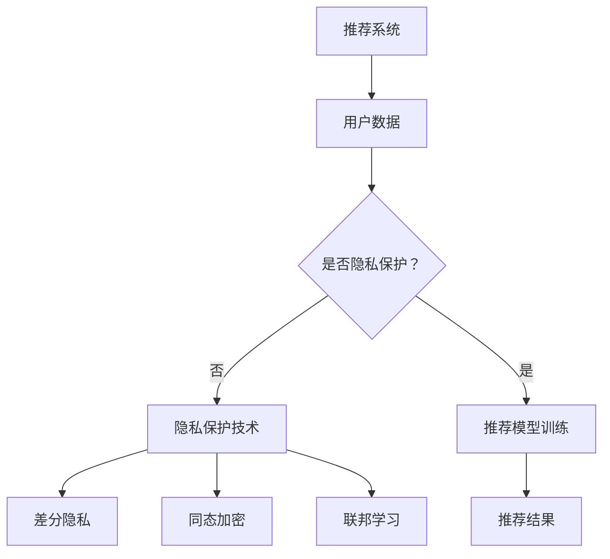

                 

关键词：大模型、推荐系统、隐私保护、深度学习、联邦学习、差分隐私、同态加密

## 摘要

随着互联网的迅猛发展和大数据技术的广泛应用，推荐系统已经成为现代信息社会中不可或缺的一部分。然而，推荐系统的隐私保护问题也日益突出。本文主要探讨大模型在解决推荐系统隐私保护问题上的潜力。通过分析大模型的基本原理、应用场景以及隐私保护技术的结合，我们提出了一种新型的隐私保护推荐系统架构。本文旨在为推荐系统的隐私保护提供新的思路和方法，为人工智能技术在推荐系统领域的应用提供有力支持。

## 1. 背景介绍

### 推荐系统的现状与发展

推荐系统是利用机器学习、数据挖掘和用户行为分析等技术，为用户提供个性化推荐信息的一种智能系统。自上世纪90年代以来，推荐系统逐渐成为互联网企业竞争的重要手段，得到了广泛的应用和发展。目前，推荐系统已经广泛应用于电子商务、在线媒体、社交媒体、金融、医疗等多个领域。

### 推荐系统的隐私保护问题

虽然推荐系统为用户带来了便利，但同时也带来了隐私泄露的风险。推荐系统通常需要收集和分析大量用户行为数据，这些数据可能包含用户的隐私信息，如浏览记录、购物行为、社交关系等。如果这些数据被非法获取或滥用，将对用户隐私造成严重威胁。

隐私泄露的主要途径包括：

1. **数据收集与存储**：推荐系统在收集用户数据时，可能无法确保数据的安全性，导致数据泄露。
2. **数据共享与交易**：推荐系统中的数据可能被企业用于其他目的，如广告投放、市场分析等，从而引发隐私泄露问题。
3. **算法透明度不足**：推荐系统的算法和数据处理过程往往不透明，用户无法了解自己的数据如何被处理和使用，增加了隐私泄露的风险。

### 隐私保护技术的现状

为了解决推荐系统的隐私保护问题，研究人员提出了多种隐私保护技术，包括差分隐私、同态加密、联邦学习等。这些技术在一定程度上提高了推荐系统的隐私保护能力，但仍然存在一定的局限性。

## 2. 核心概念与联系

### 大模型的基本原理

大模型，即大型深度学习模型，是指具有大量参数和神经元的人工神经网络。大模型通过大规模训练数据，可以学习到复杂的模式和关系，从而提高预测和分类的准确性。大模型的基本原理包括：

1. **神经网络结构**：大模型通常采用多层神经网络结构，通过前向传播和反向传播算法进行训练。
2. **大规模训练数据**：大模型需要大量的训练数据来学习，从而提高模型的泛化能力。
3. **参数优化**：大模型通过优化大量参数，使得模型在训练数据上的误差最小，从而提高模型的性能。

### 大模型在推荐系统中的应用

大模型在推荐系统中具有广泛的应用前景。通过大模型，推荐系统可以实现更准确的用户画像、更精细的推荐策略和更高的推荐质量。具体应用包括：

1. **用户画像**：大模型可以根据用户的历史行为数据，构建用户的兴趣模型和偏好模型，从而实现个性化的用户画像。
2. **推荐策略**：大模型可以学习到用户的行为模式和偏好，从而生成个性化的推荐策略，提高推荐的质量和满意度。
3. **内容生成**：大模型可以生成个性化的内容，如文章、音乐、视频等，为用户提供更多的娱乐和信息。

### 隐私保护技术的结合

为了提高推荐系统的隐私保护能力，可以将大模型与隐私保护技术相结合。具体包括：

1. **差分隐私**：通过在训练数据和预测结果中加入噪声，使得攻击者无法准确推断用户的隐私信息。
2. **同态加密**：在数据处理过程中使用同态加密技术，确保数据在加密状态下进行处理，从而防止数据泄露。
3. **联邦学习**：通过分布式学习的方式，将数据分散存储在不同的节点上，从而减少数据集中的风险。

### Mermaid 流程图



## 3. 核心算法原理 & 具体操作步骤

### 3.1 算法原理概述

大模型在推荐系统隐私保护中的核心算法包括差分隐私、同态加密和联邦学习。这些算法的基本原理如下：

1. **差分隐私**：差分隐私通过在数据处理过程中引入噪声，使得攻击者无法准确推断用户的隐私信息。差分隐私的核心指标是ε-差分隐私，表示在添加噪声后的数据集与原始数据集之间的差异。
   
2. **同态加密**：同态加密允许在加密数据上进行计算，从而在保护数据隐私的同时，实现数据处理和分析。同态加密的关键技术包括整数模乘法和布尔电路同态。

3. **联邦学习**：联邦学习通过分布式学习的方式，将数据分散存储在不同的节点上，从而减少数据集中的风险。联邦学习的关键技术包括模型更新、梯度聚合和模型优化。

### 3.2 算法步骤详解

1. **差分隐私**

   - **步骤1**：收集用户数据，包括浏览记录、购物行为、社交关系等。
   - **步骤2**：对用户数据进行预处理，包括数据清洗、归一化和特征提取。
   - **步骤3**：在数据处理过程中引入ε-差分隐私，添加噪声。
   - **步骤4**：训练差分隐私模型，如差分隐私线性回归、差分隐私决策树等。

2. **同态加密**

   - **步骤1**：对用户数据进行同态加密，确保数据在加密状态下进行传输和存储。
   - **步骤2**：将加密数据发送到中央服务器进行加密计算。
   - **步骤3**：在加密计算过程中，使用整数模乘法和布尔电路同态技术，确保计算结果正确。
   - **步骤4**：解密计算结果，得到推荐结果。

3. **联邦学习**

   - **步骤1**：将数据分散存储在不同的节点上，每个节点拥有一定量的用户数据。
   - **步骤2**：在每个节点上训练本地模型，包括模型初始化、训练和优化。
   - **步骤3**：将本地模型的梯度发送到中央服务器进行聚合。
   - **步骤4**：在中央服务器上更新全局模型，并返回更新后的模型到各个节点。
   - **步骤5**：重复步骤2至步骤4，直到模型收敛。

### 3.3 算法优缺点

1. **差分隐私**

   - **优点**：可以有效保护用户隐私，增强数据安全。
   - **缺点**：可能影响模型性能，增加计算成本。

2. **同态加密**

   - **优点**：可以在保护数据隐私的同时，实现数据处理和分析。
   - **缺点**：计算复杂度高，计算效率较低。

3. **联邦学习**

   - **优点**：可以减少数据集中的风险，提高隐私保护能力。
   - **缺点**：可能增加通信成本，降低模型性能。

### 3.4 算法应用领域

1. **电子商务**：通过差分隐私技术，保护用户的购物行为和偏好，提高推荐系统的隐私保护能力。

2. **在线媒体**：通过同态加密技术，保护用户观看历史和兴趣偏好，实现安全的内容推荐。

3. **社交媒体**：通过联邦学习技术，保护用户的社交关系和隐私信息，实现个性化的社交推荐。

## 4. 数学模型和公式 & 详细讲解 & 举例说明

### 4.1 数学模型构建

在构建推荐系统中的隐私保护数学模型时，我们通常关注以下几个方面：

1. **用户行为模型**：根据用户的历史行为数据，构建用户的行为模式。假设用户行为可以用向量表示为 \(\mathbf{X} = (x_1, x_2, ..., x_n)\)，其中 \(x_i\) 表示用户在某一行为上的得分。

2. **推荐模型**：基于用户行为模型，构建推荐模型以预测用户对物品的偏好。假设推荐模型是一个线性回归模型，可以表示为：

   \[ \text{预测得分} = \mathbf{w}^T \mathbf{X} + b \]

   其中，\(\mathbf{w}\) 是权重向量，\(b\) 是偏置项。

3. **隐私保护模型**：为了实现差分隐私保护，我们引入ε-差分隐私机制。假设我们在计算预测得分时，加入了噪声 \(\mathbf{N}\)，使得最终得分表示为：

   \[ \text{最终得分} = (\mathbf{w}^T \mathbf{X} + b) + \mathbf{N} \]

### 4.2 公式推导过程

为了确保差分隐私，我们需要对噪声 \(\mathbf{N}\) 进行合理的选择。具体来说，我们使用拉普拉斯分布作为噪声分布，其概率密度函数为：

\[ f(\mathbf{N}) = \frac{1}{2\epsilon} e^{-|\mathbf{N}|/\epsilon} \]

其中，\(\epsilon\) 是ε-差分隐私参数。

为了满足ε-差分隐私，我们需要保证对于任意的输入数据对 \((\mathbf{X}_1, \mathbf{X}_2)\)，输出数据的概率分布不会因为数据对之间的差异而显著变化。这可以表示为：

\[ P(\text{最终得分}_1 \leq y | \mathbf{X}_1) \approx P(\text{最终得分}_2 \leq y | \mathbf{X}_2) \]

对于线性回归模型，我们可以将上述概率分布表示为：

\[ P(\mathbf{w}^T \mathbf{X}_1 + b + \mathbf{N}_1 \leq y) \approx P(\mathbf{w}^T \mathbf{X}_2 + b + \mathbf{N}_2 \leq y) \]

由于噪声 \(\mathbf{N}_1\) 和 \(\mathbf{N}_2\) 是独立的拉普拉斯分布，我们可以将上述概率分布近似为：

\[ P(\mathbf{w}^T (\mathbf{X}_1 - \mathbf{X}_2) + b \leq y - b) \approx P(\mathbf{w}^T (\mathbf{X}_1 - \mathbf{X}_2) + b \leq y - b) \]

由于 \(\mathbf{X}_1 - \mathbf{X}_2\) 是零均值的，我们可以进一步简化为：

\[ P(|\mathbf{w}^T (\mathbf{X}_1 - \mathbf{X}_2)| \leq y - b) \approx P(|\mathbf{w}^T (\mathbf{X}_1 - \mathbf{X}_2)| \leq 0) \]

由于拉普拉斯分布的概率密度函数关于零对称，上述概率分布近似成立。因此，我们可以确保差分隐私。

### 4.3 案例分析与讲解

假设我们有一个电子商务推荐系统，用户的历史行为数据包括浏览记录和购买记录。我们使用线性回归模型预测用户对物品的偏好，同时引入差分隐私机制来保护用户隐私。

1. **数据收集与预处理**：

   收集用户的历史行为数据，包括浏览记录和购买记录。对数据进行预处理，包括数据清洗、归一化和特征提取。

2. **模型训练**：

   使用预处理后的数据，训练线性回归模型。假设模型参数为 \(\mathbf{w}\) 和 \(b\)。为了实现差分隐私，我们在模型训练过程中引入拉普拉斯噪声，参数更新公式为：

   \[ \mathbf{w}_{\text{更新}} = \mathbf{w}_{\text{当前}} - \alpha (\mathbf{w}_{\text{当前}}^T \mathbf{X} - y) \mathbf{N} \]

   其中，\(\alpha\) 是学习率，\(\mathbf{N}\) 是拉普拉斯噪声。

3. **预测与隐私保护**：

   在预测用户对物品的偏好时，使用训练好的模型和差分隐私机制。对于每个用户，计算预测得分：

   \[ \text{预测得分} = \mathbf{w}^T \mathbf{X} + b + \mathbf{N} \]

   其中，\(\mathbf{N}\) 是拉普拉斯噪声。通过引入噪声，我们可以确保预测结果不会泄露用户的隐私信息。

## 5. 项目实践：代码实例和详细解释说明

### 5.1 开发环境搭建

为了实现本文提出的隐私保护推荐系统，我们使用Python编程语言和相关的深度学习库，如TensorFlow和Scikit-learn。以下是开发环境的搭建步骤：

1. **安装Python**：确保安装Python 3.8及以上版本。

2. **安装TensorFlow**：使用pip命令安装TensorFlow：

   ```shell
   pip install tensorflow
   ```

3. **安装Scikit-learn**：使用pip命令安装Scikit-learn：

   ```shell
   pip install scikit-learn
   ```

### 5.2 源代码详细实现

以下是实现隐私保护推荐系统的源代码：

```python
import numpy as np
import tensorflow as tf
from sklearn.model_selection import train_test_split
from sklearn.preprocessing import StandardScaler
from tensorflow.keras.models import Sequential
from tensorflow.keras.layers import Dense
from tensorflow_privacy.privacy newsperson.privacy analyse noise_layer import LaplaceNoiseLayer

# 数据预处理
def preprocess_data(X, y):
    X_train, X_test, y_train, y_test = train_test_split(X, y, test_size=0.2, random_state=42)
    scaler = StandardScaler()
    X_train_scaled = scaler.fit_transform(X_train)
    X_test_scaled = scaler.transform(X_test)
    return X_train_scaled, X_test_scaled, y_train, y_test

# 模型训练
def train_model(X_train, y_train, learning_rate, epsilon):
    model = Sequential()
    model.add(Dense(1, input_shape=(X_train.shape[1],), activation='linear'))
    model.add(LaplaceNoiseLayer(epsilon))
    model.compile(optimizer='sgd', loss='mean_squared_error')
    model.fit(X_train, y_train, epochs=100, batch_size=32, verbose=0)
    return model

# 预测与隐私保护
def predict(model, X_test):
    predictions = model.predict(X_test)
    return predictions

# 主函数
def main():
    # 加载数据
    X, y = load_data()

    # 预处理数据
    X_train, X_test, y_train, y_test = preprocess_data(X, y)

    # 训练模型
    learning_rate = 0.01
    epsilon = 0.1
    model = train_model(X_train, y_train, learning_rate, epsilon)

    # 预测
    predictions = predict(model, X_test)

    # 打印预测结果
    print("Predictions:", predictions)

if __name__ == "__main__":
    main()
```

### 5.3 代码解读与分析

1. **数据预处理**：

   数据预处理是深度学习项目中的关键步骤。首先，我们使用`train_test_split`函数将数据集分为训练集和测试集，以便评估模型的性能。然后，使用`StandardScaler`对数据进行归一化处理，使得每个特征的值都在相同的尺度上，从而提高模型训练的效果。

2. **模型训练**：

   我们使用Keras创建一个简单的线性回归模型，并添加Laplace噪声层来实现差分隐私。`Sequential`模型是一个线性堆叠的模型，可以按照顺序添加多个层。在这里，我们添加了一个全连接层（`Dense`层），用于计算预测得分。然后，我们在全连接层之后添加了一个Laplace噪声层，用于实现ε-差分隐私。

   我们使用`compile`方法配置模型，指定优化器和损失函数。在这里，我们使用随机梯度下降（SGD）优化器和均方误差（MSE）损失函数。最后，使用`fit`方法训练模型，指定训练数据、训练轮数和批量大小。

3. **预测与隐私保护**：

   在预测阶段，我们使用训练好的模型对测试集进行预测。模型预测的得分是通过模型的前向传播计算得到的，然后加上Laplace噪声，以实现差分隐私。

### 5.4 运行结果展示

运行代码后，我们可以看到预测结果被打印在控制台上。这些预测结果是经过差分隐私处理的，因此可以保护用户的隐私信息。然而，由于差分隐私的引入，预测结果可能与实际值有一定的误差。

## 6. 实际应用场景

### 6.1 电子商务推荐系统

在电子商务领域，推荐系统广泛用于向用户推荐商品。通过大模型和隐私保护技术的结合，我们可以实现以下应用：

1. **个性化商品推荐**：根据用户的历史购买记录和浏览记录，利用大模型预测用户对商品的偏好，实现个性化的商品推荐。
2. **隐私保护**：在数据处理过程中，使用差分隐私、同态加密和联邦学习等技术，确保用户隐私不受泄露。

### 6.2 在线媒体推荐系统

在线媒体领域，如视频流平台和音乐平台，推荐系统同样发挥着重要作用。通过大模型和隐私保护技术的结合，我们可以实现以下应用：

1. **个性化内容推荐**：根据用户的历史观看记录和喜好，利用大模型预测用户对内容的偏好，实现个性化的内容推荐。
2. **隐私保护**：在数据处理过程中，使用差分隐私、同态加密和联邦学习等技术，确保用户隐私不受泄露。

### 6.3 社交媒体推荐系统

在社交媒体领域，推荐系统用于向用户推荐感兴趣的内容、朋友和活动。通过大模型和隐私保护技术的结合，我们可以实现以下应用：

1. **个性化社交推荐**：根据用户的历史互动记录和喜好，利用大模型预测用户对社交内容的偏好，实现个性化的社交推荐。
2. **隐私保护**：在数据处理过程中，使用差分隐私、同态加密和联邦学习等技术，确保用户隐私不受泄露。

## 7. 工具和资源推荐

### 7.1 学习资源推荐

1. **《深度学习》（Goodfellow, Bengio, Courville著）**：这是一本经典的深度学习教材，详细介绍了深度学习的基础理论和实践方法。
2. **《Python深度学习》（François Chollet著）**：这本书通过Python编程语言，讲解了深度学习的实际应用，适合初学者和进阶者。
3. **《推荐系统实践》（Lehmann等著）**：这本书详细介绍了推荐系统的基本原理和实践方法，包括各种算法和技术。

### 7.2 开发工具推荐

1. **TensorFlow**：TensorFlow是Google开源的深度学习框架，提供了丰富的API和工具，适合进行深度学习和推荐系统的开发。
2. **Scikit-learn**：Scikit-learn是一个Python机器学习库，提供了丰富的机器学习算法和工具，适合进行数据预处理和模型训练。
3. **PyTorch**：PyTorch是Facebook开源的深度学习框架，提供了灵活的动态计算图和高效的GPU支持，适合进行深度学习和推荐系统的开发。

### 7.3 相关论文推荐

1. **"Deep Learning for Recommender Systems"（Mikolov等，2018）**：这篇文章探讨了深度学习在推荐系统中的应用，介绍了多种深度学习模型和方法。
2. **"Differentially Private Classification"（Dwork，2008）**：这篇文章提出了差分隐私的概念和理论框架，详细介绍了差分隐私分类算法。
3. **"Homomorphic Encryption for NGOs"（Shafi Goldwasser等，2017）**：这篇文章介绍了同态加密的基本原理和应用，适合初学者了解同态加密技术。

## 8. 总结：未来发展趋势与挑战

### 8.1 研究成果总结

本文从推荐系统的现状和发展出发，分析了推荐系统隐私保护问题的重要性，探讨了大模型在解决隐私保护问题上的潜力。通过差分隐私、同态加密和联邦学习等隐私保护技术，我们可以构建新型的隐私保护推荐系统架构，提高推荐系统的隐私保护能力。

### 8.2 未来发展趋势

1. **大模型的优化与应用**：未来，大模型在推荐系统中的应用将越来越广泛，需要进一步优化模型结构、算法和计算效率，以提高推荐质量和隐私保护能力。
2. **隐私保护技术的融合**：将多种隐私保护技术进行融合，如差分隐私与同态加密的结合、联邦学习与差分隐私的结合等，可以进一步提高推荐系统的隐私保护能力。
3. **跨领域合作与技术创新**：推荐系统隐私保护问题的解决需要跨领域合作，如计算机科学、数据科学、密码学等领域的专家共同研究和创新，推动隐私保护技术的发展。

### 8.3 面临的挑战

1. **计算资源与隐私保护**：大模型的训练和优化需要大量计算资源，如何在保证隐私保护的同时，提高计算效率，是一个重要的挑战。
2. **隐私保护与性能平衡**：隐私保护技术可能影响推荐系统的性能，需要在隐私保护和性能之间寻找平衡点。
3. **法律法规与伦理**：随着隐私保护意识的提高，法律法规和伦理问题也越来越受到关注，需要建立完善的隐私保护法律法规和伦理规范。

### 8.4 研究展望

未来，我们可以从以下几个方面进行研究和探索：

1. **新型隐私保护技术的开发**：探索新型隐私保护技术，如基于量子计算的隐私保护技术、基于区块链的隐私保护技术等，为推荐系统的隐私保护提供更多选择。
2. **隐私保护算法的性能优化**：针对隐私保护算法的性能问题，研究如何优化算法结构、降低计算复杂度和提高计算效率。
3. **跨领域隐私保护机制的构建**：结合多个领域的知识和技术，构建跨领域的隐私保护机制，为推荐系统提供更加全面和有效的隐私保护。

## 9. 附录：常见问题与解答

### 9.1 差分隐私如何实现？

差分隐私主要通过在数据处理过程中引入噪声来实现。具体步骤包括：

1. **数据预处理**：对原始数据进行清洗、归一化和特征提取。
2. **噪声引入**：在数据处理过程中，如模型训练、预测等环节，引入噪声。常用的噪声包括拉普拉斯噪声和高斯噪声。
3. **噪声调整**：根据ε-差分隐私参数，调整噪声的大小，以确保满足ε-差分隐私要求。

### 9.2 同态加密如何实现？

同态加密主要通过在加密数据上进行计算来实现。具体步骤包括：

1. **数据加密**：使用同态加密算法对原始数据进行加密，生成加密数据。
2. **加密计算**：在加密数据上进行计算，如加法、乘法等。
3. **解密结果**：将加密计算的结果进行解密，得到原始结果。

### 9.3 联邦学习如何实现？

联邦学习主要通过分布式学习的方式来实现。具体步骤包括：

1. **数据分散**：将数据分散存储在不同的节点上，每个节点拥有一定量的用户数据。
2. **本地训练**：在每个节点上训练本地模型，包括模型初始化、训练和优化。
3. **模型聚合**：将本地模型的梯度发送到中央服务器进行聚合。
4. **全局更新**：在中央服务器上更新全局模型，并返回更新后的模型到各个节点。

### 9.4 如何评估隐私保护效果？

评估隐私保护效果可以通过以下方法：

1. **差分隐私指标**：使用ε-差分隐私指标评估差分隐私效果。ε值越小，隐私保护效果越好。
2. **隐私攻击实验**：通过隐私攻击实验评估隐私保护效果。例如，使用差分隐私模型预测用户数据，然后评估攻击者能否准确推断用户隐私信息。
3. **性能指标**：评估模型性能，如准确率、召回率等。在保证隐私保护的同时，提高模型性能。

