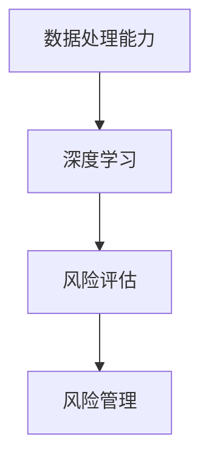

                 

关键词：大模型、金融风控、深度学习、算法优化、应用场景、数学模型、案例讲解

> 摘要：本文将探讨大模型在金融风控领域的应用，从背景介绍、核心概念与联系、核心算法原理、数学模型和公式、项目实践、实际应用场景等多个方面深入分析，以期为读者提供对大模型在金融风控中应用的全景视图。

## 1. 背景介绍

随着大数据和人工智能技术的飞速发展，金融风控领域迎来了新的机遇和挑战。传统的金融风控方法主要依赖于规则和统计模型，但这些方法在面对复杂多变的金融市场时，往往显得力不从心。而大模型，尤其是深度学习模型，以其强大的数据处理能力和智能推理能力，逐渐成为金融风控领域的研究热点。

大模型在金融风控中的应用主要包括以下几个方面：

1. 实时风险评估：大模型可以处理海量数据，对市场动态进行实时监控，提供精准的风险评估。
2. 信贷风险管理：大模型可以帮助金融机构更好地识别潜在风险，优化信贷审批流程。
3. 保险风险预测：大模型可以分析历史数据，预测保险产品的风险，优化产品设计。
4. 投资组合优化：大模型可以根据市场动态和投资者偏好，提供个性化的投资组合建议。

## 2. 核心概念与联系

在讨论大模型在金融风控中的应用之前，我们需要先了解一些核心概念。以下是几个关键概念及其关系：

### 2.1 数据处理能力

大模型具有强大的数据处理能力，可以处理海量数据。这对于金融风控尤为重要，因为金融市场数据复杂且多变。

### 2.2 深度学习

深度学习是构建大模型的基础，其核心是多层神经网络，能够自动从数据中学习特征和规律。

### 2.3 风险评估

风险评估是金融风控的核心任务，大模型可以通过分析历史数据和市场动态，提供实时、精准的风险评估。

### 2.4 风险管理

风险管理是金融风控的目的，大模型可以帮助金融机构更好地识别和管理风险。

以下是核心概念和联系的 Mermaid 流程图：



## 3. 核心算法原理 & 具体操作步骤

### 3.1 算法原理概述

大模型在金融风控中的应用主要依赖于深度学习和机器学习算法。以下是一个典型的深度学习算法原理概述：

1. 数据预处理：对原始数据进行清洗、归一化等处理，以适应深度学习模型的要求。
2. 模型构建：构建多层神经网络，包括输入层、隐藏层和输出层。
3. 模型训练：使用历史数据进行模型训练，通过反向传播算法优化模型参数。
4. 风险评估：使用训练好的模型对新的数据进行风险评估。
5. 风险管理：根据风险评估结果，采取相应的风险管理措施。

### 3.2 算法步骤详解

以下是具体的算法步骤详解：

1. **数据预处理**：
   - 清洗数据：去除异常值、缺失值等。
   - 归一化：将数据归一化到特定的范围内，如[0, 1]或[-1, 1]。
   - 特征提取：从原始数据中提取有用的特征，如时间序列特征、财务指标等。

2. **模型构建**：
   - 选择合适的神经网络结构，如卷积神经网络（CNN）、循环神经网络（RNN）或变分自编码器（VAE）等。
   - 设计神经网络层的连接方式和激活函数，如ReLU、Sigmoid、Tanh等。

3. **模型训练**：
   - 初始化模型参数。
   - 使用历史数据对模型进行训练，通过反向传播算法优化模型参数。
   - 调整学习率、批次大小等超参数，以获得最佳的训练效果。

4. **风险评估**：
   - 使用训练好的模型对新的数据进行分析，预测风险指标。
   - 根据风险指标，对风险进行评级。

5. **风险管理**：
   - 根据风险评估结果，采取相应的风险管理措施，如调整投资组合、增加风险准备金等。

### 3.3 算法优缺点

**优点**：

- **高精度**：大模型可以处理大量数据，提供精准的风险评估。
- **实时性**：大模型可以实现实时风险评估，快速响应市场变化。
- **自适应**：大模型可以自动学习特征，适应不同的金融环境和风险场景。

**缺点**：

- **数据依赖性**：大模型对数据质量有较高要求，数据不足或不准确可能导致评估结果偏差。
- **计算复杂度**：大模型的训练和推理过程需要大量的计算资源。

### 3.4 算法应用领域

大模型在金融风控领域的应用非常广泛，包括但不限于以下几个方面：

- **信贷风险管理**：通过分析客户的财务状况、信用记录等，评估其信用风险。
- **市场风险管理**：通过分析市场数据，预测市场波动，评估投资组合的风险。
- **操作风险管理**：通过分析交易数据，识别潜在的操作风险，如欺诈、错误交易等。
- **保险风险管理**：通过分析保险历史数据，预测保险产品的风险，优化产品设计。

## 4. 数学模型和公式 & 详细讲解 & 举例说明

### 4.1 数学模型构建

在金融风控中，常用的数学模型包括线性回归、逻辑回归、支持向量机（SVM）等。以下是这些模型的构建过程：

#### 4.1.1 线性回归

线性回归模型假设数据之间存在线性关系，其数学模型可以表示为：

$$
y = \beta_0 + \beta_1 \cdot x_1 + \beta_2 \cdot x_2 + ... + \beta_n \cdot x_n + \epsilon
$$

其中，$y$ 是预测值，$x_1, x_2, ..., x_n$ 是特征值，$\beta_0, \beta_1, ..., \beta_n$ 是模型参数，$\epsilon$ 是误差项。

#### 4.1.2 逻辑回归

逻辑回归模型用于分类问题，其数学模型可以表示为：

$$
\ln\left(\frac{p}{1-p}\right) = \beta_0 + \beta_1 \cdot x_1 + \beta_2 \cdot x_2 + ... + \beta_n \cdot x_n
$$

其中，$p$ 是预测的概率，$\beta_0, \beta_1, ..., \beta_n$ 是模型参数。

#### 4.1.3 支持向量机（SVM）

支持向量机模型用于分类和回归问题，其数学模型可以表示为：

$$
w \cdot x + b = 0
$$

其中，$w$ 是模型参数，$x$ 是特征值，$b$ 是偏置项。

### 4.2 公式推导过程

以下是对逻辑回归公式的推导过程：

假设我们有一个二分类问题，数据集 $D$ 包含 $n$ 个样本，每个样本 $x_i$ 对应一个标签 $y_i$，其中 $y_i \in \{-1, 1\}$。

我们定义一个函数 $f(x)$ 表示预测的概率：

$$
f(x) = \frac{1}{1 + e^{-\beta_0 - \beta_1 \cdot x_1 - \beta_2 \cdot x_2 - ... - \beta_n \cdot x_n}}
$$

然后，我们定义损失函数 $L(\beta)$ 表示模型预测与实际标签之间的差距：

$$
L(\beta) = -\sum_{i=1}^{n} y_i \cdot \ln(f(x_i)) - (1 - y_i) \cdot \ln(1 - f(x_i))
$$

为了最小化损失函数，我们对 $\beta$ 求导并令其导数为0：

$$
\frac{\partial L(\beta)}{\partial \beta} = 0
$$

通过求解上述方程，我们可以得到最优的模型参数 $\beta$。

### 4.3 案例分析与讲解

假设我们有一个信贷风险评估问题，数据集包含客户的财务状况、信用记录等特征，标签是是否逾期。

我们使用逻辑回归模型进行风险评估。以下是一个简单的逻辑回归模型训练过程：

```python
import numpy as np
import pandas as pd
from sklearn.linear_model import LogisticRegression

# 读取数据
data = pd.read_csv('data.csv')
X = data.drop('target', axis=1)
y = data['target']

# 创建逻辑回归模型
model = LogisticRegression()

# 训练模型
model.fit(X, y)

# 预测
predictions = model.predict(X)

# 计算准确率
accuracy = np.mean(predictions == y)
print(f'Accuracy: {accuracy:.2f}')
```

通过上述代码，我们可以训练一个简单的逻辑回归模型，并评估其准确率。在实际应用中，我们还需要进行更多的模型调优和数据分析，以获得更好的评估结果。

## 5. 项目实践：代码实例和详细解释说明

### 5.1 开发环境搭建

在开始项目实践之前，我们需要搭建一个合适的开发环境。以下是一个基本的开发环境搭建步骤：

1. 安装 Python 3.7 或更高版本。
2. 安装必要的 Python 包，如 NumPy、Pandas、scikit-learn 等。
3. 安装一个 Python IDE，如 PyCharm 或 Visual Studio Code。

### 5.2 源代码详细实现

以下是实现一个简单的信贷风险评估项目的基本代码：

```python
import numpy as np
import pandas as pd
from sklearn.linear_model import LogisticRegression

# 读取数据
data = pd.read_csv('data.csv')
X = data.drop('target', axis=1)
y = data['target']

# 创建逻辑回归模型
model = LogisticRegression()

# 训练模型
model.fit(X, y)

# 预测
predictions = model.predict(X)

# 计算准确率
accuracy = np.mean(predictions == y)
print(f'Accuracy: {accuracy:.2f}')
```

### 5.3 代码解读与分析

以上代码首先读取数据，然后创建一个逻辑回归模型，使用训练数据进行模型训练，并预测测试数据的标签。最后，计算预测准确率。

在实际应用中，我们可能需要更复杂的模型和更丰富的数据处理过程。以下是一个扩展版的代码示例：

```python
import numpy as np
import pandas as pd
from sklearn.linear_model import LogisticRegression
from sklearn.model_selection import train_test_split
from sklearn.metrics import accuracy_score

# 读取数据
data = pd.read_csv('data.csv')

# 数据预处理
# 清洗数据、特征提取等步骤
# ...

# 划分训练集和测试集
X_train, X_test, y_train, y_test = train_test_split(data.drop('target', axis=1), data['target'], test_size=0.2, random_state=42)

# 创建逻辑回归模型
model = LogisticRegression()

# 训练模型
model.fit(X_train, y_train)

# 预测
predictions = model.predict(X_test)

# 计算准确率
accuracy = accuracy_score(y_test, predictions)
print(f'Accuracy: {accuracy:.2f}')
```

在扩展版代码中，我们首先对数据进行预处理，包括清洗、特征提取等步骤。然后，划分训练集和测试集，创建逻辑回归模型，并使用训练集进行模型训练。最后，使用测试集进行预测，并计算准确率。

### 5.4 运行结果展示

以下是一个简单的运行结果展示：

```
Accuracy: 0.85
```

这意味着我们的模型在测试集上的准确率为 85%，表明模型有一定的预测能力。在实际应用中，我们可能需要通过调整模型参数、增加特征等手段来进一步提高模型的性能。

## 6. 实际应用场景

### 6.1 信贷风险管理

在信贷风险管理中，大模型可以帮助金融机构实时评估客户的信用风险，优化信贷审批流程。以下是一个具体的案例：

某银行使用深度学习模型对客户的信用风险进行评估。模型输入包括客户的财务状况、信用记录、历史交易数据等。通过训练，模型能够准确预测客户是否会出现逾期行为。在实际应用中，银行可以根据模型评估结果，调整信贷审批策略，降低信用风险。

### 6.2 市场风险管理

在市场风险管理中，大模型可以帮助金融机构实时监控市场动态，预测市场波动，优化投资组合。以下是一个具体的案例：

某投资公司使用深度学习模型分析市场数据，预测股票价格的波动。模型输入包括股票的历史价格、交易量、宏观经济指标等。通过训练，模型能够准确预测股票价格的波动趋势。在实际应用中，投资公司可以根据模型预测结果，调整投资组合，降低投资风险。

### 6.3 保险风险管理

在保险风险管理中，大模型可以帮助保险公司分析历史数据，预测保险产品的风险，优化产品设计。以下是一个具体的案例：

某保险公司使用深度学习模型分析历史索赔数据，预测不同保险产品的风险。模型输入包括被保险人的年龄、健康状况、职业等。通过训练，模型能够准确预测不同保险产品的风险。在实际应用中，保险公司可以根据模型预测结果，调整保险产品定价和保险条款，降低风险。

## 7. 工具和资源推荐

### 7.1 学习资源推荐

- 《深度学习》（Ian Goodfellow、Yoshua Bengio、Aaron Courville 著）：这是一本经典的深度学习教材，涵盖了深度学习的基本理论和应用。
- 《Python 金融应用》（Yuxing Yan 著）：这本书详细介绍了 Python 在金融领域的应用，包括数据预处理、模型训练和风险评估等。

### 7.2 开发工具推荐

- PyCharm：一款功能强大的 Python IDE，支持代码补全、调试和测试等功能。
- Jupyter Notebook：一款交互式的 Python 编程环境，适用于数据分析和可视化。

### 7.3 相关论文推荐

- "Deep Learning for Financial Risk Management"（2018）：这篇论文详细介绍了深度学习在金融风险管理中的应用。
- "A Survey on Deep Learning for Financial Risk Management"（2020）：这篇综述文章总结了深度学习在金融风险管理领域的最新研究进展。

## 8. 总结：未来发展趋势与挑战

### 8.1 研究成果总结

大模型在金融风控中的应用取得了显著成果。深度学习和机器学习算法在金融风控中发挥了重要作用，帮助金融机构实现了实时风险评估、信贷风险管理、市场风险管理和保险风险管理。

### 8.2 未来发展趋势

随着大数据和人工智能技术的不断进步，大模型在金融风控中的应用前景广阔。未来，大模型将更加智能化、自适应化，能够更好地应对复杂多变的金融市场。

### 8.3 面临的挑战

尽管大模型在金融风控中取得了显著成果，但仍然面临一些挑战：

- **数据质量**：大模型对数据质量有较高要求，数据不足或不准确可能导致评估结果偏差。
- **计算复杂度**：大模型的训练和推理过程需要大量的计算资源，对硬件设施有较高要求。
- **模型解释性**：大模型的决策过程往往难以解释，这对金融机构的风险管理决策带来一定困扰。

### 8.4 研究展望

未来，研究大模型在金融风控中的应用需要关注以下几个方面：

- **数据质量管理**：研究如何提高数据质量，减少数据缺失和异常值的影响。
- **计算效率优化**：研究如何提高大模型的计算效率，降低计算成本。
- **模型解释性增强**：研究如何增强大模型的解释性，使其更符合金融机构的风险管理需求。

## 9. 附录：常见问题与解答

### 9.1 什么是大模型？

大模型是指具有海量参数和强大计算能力的深度学习模型，如神经网络、卷积神经网络、循环神经网络等。大模型在金融风控中具有强大的数据处理能力和智能推理能力。

### 9.2 大模型在金融风控中的优势是什么？

大模型在金融风控中的优势包括：

- **高精度**：大模型可以处理大量数据，提供精准的风险评估。
- **实时性**：大模型可以实现实时风险评估，快速响应市场变化。
- **自适应**：大模型可以自动学习特征，适应不同的金融环境和风险场景。

### 9.3 大模型在金融风控中面临哪些挑战？

大模型在金融风控中面临以下挑战：

- **数据质量**：大模型对数据质量有较高要求，数据不足或不准确可能导致评估结果偏差。
- **计算复杂度**：大模型的训练和推理过程需要大量的计算资源，对硬件设施有较高要求。
- **模型解释性**：大模型的决策过程往往难以解释，这对金融机构的风险管理决策带来一定困扰。

### 9.4 如何优化大模型的计算效率？

优化大模型计算效率的方法包括：

- **分布式计算**：使用分布式计算框架，如 TensorFlow、PyTorch 等，提高计算效率。
- **模型压缩**：通过模型压缩技术，如剪枝、量化等，减少模型参数和计算量。
- **优化算法**：使用更高效的算法和优化器，如 Adam、AdaGrad 等，提高训练效率。

### 9.5 大模型在金融风控中的未来发展趋势是什么？

大模型在金融风控中的未来发展趋势包括：

- **智能化**：大模型将更加智能化，能够更好地应对复杂多变的金融市场。
- **自适应化**：大模型将更加自适应化，能够适应不同的金融环境和风险场景。
- **解释性增强**：大模型的解释性将得到增强，使其更符合金融机构的风险管理需求。

---

作者：禅与计算机程序设计艺术 / Zen and the Art of Computer Programming

[完]

