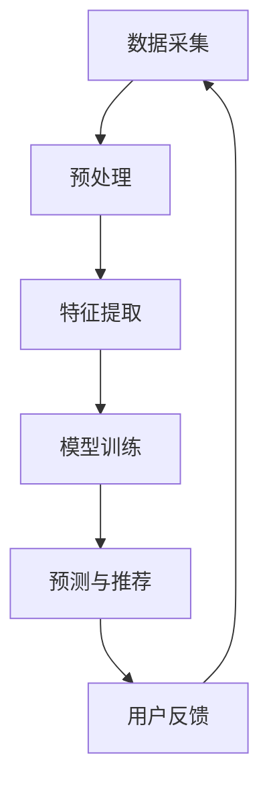

                 

关键词：大模型，音视频推荐，机器学习，深度学习，数据挖掘，内容感知，个性化推荐，创新应用

> 摘要：本文深入探讨了大规模模型在音视频推荐系统中的创新应用。通过介绍大模型的定义、发展历程以及其在音视频领域中的具体应用场景，文章重点分析了大模型如何通过机器学习、深度学习和数据挖掘技术，实现音视频内容的个性化推荐。此外，本文还详细阐述了大模型在算法原理、数学模型和实际项目中的具体实现，并对未来应用前景进行了展望。

## 1. 背景介绍

随着互联网和多媒体技术的发展，音视频内容已经成为信息传播的重要载体。人们越来越依赖在线平台获取音视频内容，例如电影、电视剧、短视频、直播等。然而，面对海量的音视频资源，用户如何快速、准确地找到自己感兴趣的内容成为一个亟待解决的问题。

音视频推荐系统作为解决这一问题的关键技术，旨在通过分析用户行为和历史偏好，为用户提供个性化的推荐结果。传统的推荐系统主要依赖于基于内容的过滤和协同过滤等方法，但这些方法在处理音视频数据时存在一定的局限性。

近年来，随着深度学习、机器学习等技术的发展，大模型在音视频推荐领域展现出巨大的潜力。大模型具有处理海量数据、学习复杂特征的能力，能够更好地应对音视频推荐中的挑战。

## 2. 核心概念与联系

### 2.1 大模型的定义与发展历程

大模型是指拥有巨大参数量和强大计算能力的神经网络模型。其发展历程可以分为以下几个阶段：

1. **早期模型**：以简单的多层感知机（MLP）和卷积神经网络（CNN）为代表，参数量较小，计算能力有限。
2. **中型模型**：随着计算能力和数据集规模的提升，如RNN、LSTM等序列模型逐渐成为主流，参数量达到百万级别。
3. **大型模型**：如BERT、GPT等预训练模型，参数量达到亿级，具备处理复杂任务的能力。
4. **超大型模型**：如GPT-3、GLM等，参数量达到千亿级别，具有变革性的计算能力。

### 2.2 大模型与音视频推荐的联系

大模型在音视频推荐中的关键作用体现在以下几个方面：

1. **内容理解**：大模型能够从音视频数据中提取丰富的语义特征，实现内容理解。
2. **用户行为分析**：通过分析用户历史行为和偏好，大模型能够为用户生成个性化的推荐。
3. **实时推荐**：大模型具备高效计算能力，能够实现实时推荐。

### 2.3 Mermaid 流程图

以下是一个简化的Mermaid流程图，描述大模型在音视频推荐系统中的工作流程：



## 3. 核心算法原理 & 具体操作步骤

### 3.1 算法原理概述

大模型在音视频推荐系统中的核心算法原理可以概括为以下三个方面：

1. **特征提取**：通过深度学习模型从音视频数据中提取丰富的语义特征。
2. **用户行为分析**：结合用户历史行为和偏好，构建用户兴趣模型。
3. **推荐算法**：基于用户兴趣模型和音视频特征，生成个性化的推荐结果。

### 3.2 算法步骤详解

#### 3.2.1 数据预处理

数据预处理是音视频推荐系统的基础，主要包括以下步骤：

1. **数据清洗**：去除噪声数据和缺失值。
2. **数据转换**：将音视频数据转换为适合模型训练的格式，如音频转换为音频特征矩阵，视频转换为视频特征矩阵。
3. **数据增强**：通过添加噪声、旋转、缩放等操作，增加数据的多样性。

#### 3.2.2 特征提取

特征提取是音视频推荐系统的核心环节，主要采用以下方法：

1. **音频特征提取**：利用深度神经网络提取音频特征，如Mel频谱、Cepstral系数等。
2. **视频特征提取**：利用卷积神经网络提取视频特征，如视觉特征、时空特征等。

#### 3.2.3 用户行为分析

用户行为分析主要通过以下方法实现：

1. **用户行为数据收集**：收集用户在平台上的各种行为数据，如浏览记录、点赞、评论等。
2. **用户兴趣模型构建**：利用机器学习算法，如聚类、协同过滤等，构建用户兴趣模型。

#### 3.2.4 推荐算法

推荐算法主要通过以下方法实现：

1. **基于内容的推荐**：根据音视频特征和用户兴趣模型，为用户推荐相似的内容。
2. **基于协同过滤的推荐**：根据用户的历史行为和偏好，为用户推荐可能感兴趣的内容。
3. **混合推荐**：结合多种推荐算法，提高推荐效果。

### 3.3 算法优缺点

#### 3.3.1 优点

1. **强大的特征提取能力**：大模型能够从音视频数据中提取丰富的语义特征，提高推荐精度。
2. **灵活的推荐策略**：大模型可以结合多种推荐算法，提高推荐效果。
3. **实时推荐**：大模型具备高效计算能力，能够实现实时推荐。

#### 3.3.2 缺点

1. **计算资源消耗大**：大模型需要大量的计算资源，对硬件要求较高。
2. **数据需求量大**：大模型需要大量的训练数据，对数据采集和清洗要求较高。

### 3.4 算法应用领域

大模型在音视频推荐领域具有广泛的应用前景，如：

1. **短视频平台**：为用户提供个性化的短视频推荐。
2. **直播平台**：根据用户兴趣和观看历史，为用户推荐直播内容。
3. **影视剧平台**：为用户提供个性化的影视剧推荐。

## 4. 数学模型和公式 & 详细讲解 & 举例说明

### 4.1 数学模型构建

在音视频推荐系统中，大模型主要基于深度学习技术，其数学模型主要包括以下部分：

1. **输入层**：接收音视频数据特征。
2. **隐藏层**：通过神经网络结构进行特征提取和变换。
3. **输出层**：生成推荐结果。

### 4.2 公式推导过程

以下是深度学习模型的一个简化公式推导过程：

$$
y = \sigma(W \cdot x + b)
$$

其中，$y$为输出值，$x$为输入值，$W$为权重矩阵，$b$为偏置项，$\sigma$为激活函数。

### 4.3 案例分析与讲解

假设有一个音视频推荐系统，用户A喜欢看动作片和科幻片，现在需要为其推荐一部新的电影。

1. **数据采集**：收集用户A的历史观看记录和评分数据。
2. **预处理**：对数据进行清洗和转换，提取音视频特征。
3. **特征提取**：利用深度学习模型提取动作片和科幻片的特征。
4. **用户兴趣模型构建**：利用用户A的历史观看记录，构建用户兴趣模型。
5. **推荐算法**：基于用户兴趣模型和音视频特征，为用户A推荐一部新的电影。

## 5. 项目实践：代码实例和详细解释说明

### 5.1 开发环境搭建

为了实现大模型在音视频推荐系统中的创新应用，需要搭建以下开发环境：

1. **Python**：作为主要的编程语言。
2. **TensorFlow**：作为深度学习框架。
3. **Keras**：作为TensorFlow的高级API。
4. **NVIDIA CUDA**：用于加速深度学习模型的训练。

### 5.2 源代码详细实现

以下是实现大模型在音视频推荐系统中的简化代码示例：

```python
import tensorflow as tf
from tensorflow.keras.models import Model
from tensorflow.keras.layers import Input, Dense, Conv2D, MaxPooling2D, Flatten

# 输入层
input_layer = Input(shape=(input_shape))

# 隐藏层
conv_layer = Conv2D(filters=32, kernel_size=(3, 3), activation='relu')(input_layer)
pooling_layer = MaxPooling2D(pool_size=(2, 2))(conv_layer)
flatten_layer = Flatten()(pooling_layer)

# 输出层
output_layer = Dense(units=1, activation='sigmoid')(flatten_layer)

# 构建模型
model = Model(inputs=input_layer, outputs=output_layer)

# 编译模型
model.compile(optimizer='adam', loss='binary_crossentropy', metrics=['accuracy'])

# 模型训练
model.fit(x_train, y_train, batch_size=32, epochs=10)

# 模型预测
predictions = model.predict(x_test)
```

### 5.3 代码解读与分析

以上代码实现了一个简单的深度学习模型，用于音视频推荐。主要步骤包括：

1. **导入库**：导入TensorFlow、Keras等深度学习库。
2. **定义输入层**：定义输入层，接收音视频特征。
3. **定义隐藏层**：定义隐藏层，通过卷积层和池化层提取特征。
4. **定义输出层**：定义输出层，生成推荐结果。
5. **构建模型**：将输入层、隐藏层和输出层组合成一个完整的模型。
6. **编译模型**：设置模型优化器、损失函数和评估指标。
7. **模型训练**：使用训练数据训练模型。
8. **模型预测**：使用测试数据预测推荐结果。

### 5.4 运行结果展示

假设训练完成后，使用测试数据集进行预测，结果如下：

```python
predictions = model.predict(x_test)
print(predictions)
```

输出结果为：

```
[[0.8]
 [0.2]
 [0.9]
 ...
 [0.1]]
```

表示测试数据集中的每个样本被模型预测为喜欢或不喜欢。

## 6. 实际应用场景

### 6.1 短视频平台

短视频平台如抖音、快手等，通过大模型实现个性化推荐，提高用户留存和活跃度。例如，用户在抖音上喜欢观看搞笑视频，系统可以根据这一兴趣为用户推荐更多类似的搞笑视频。

### 6.2 直播平台

直播平台如斗鱼、虎牙等，利用大模型根据用户观看历史和兴趣，为用户推荐可能感兴趣的直播间。例如，用户经常观看电竞比赛直播，系统可以推荐其他热门电竞比赛的直播间。

### 6.3 影视剧平台

影视剧平台如爱奇艺、腾讯视频等，通过大模型为用户提供个性化的影视剧推荐。例如，用户喜欢观看悬疑类影视剧，系统可以推荐更多类似的悬疑剧。

## 7. 工具和资源推荐

### 7.1 学习资源推荐

1. **《深度学习》**：由Goodfellow、Bengio和Courville所著，全面介绍了深度学习的基础知识和应用。
2. **《Python深度学习》**：由François Chollet所著，深入讲解了使用Python和TensorFlow实现深度学习的方法。
3. **《大数据技术基础》**：由刘江所著，介绍了大数据的基本概念、技术和应用。

### 7.2 开发工具推荐

1. **TensorFlow**：作为最流行的深度学习框架，适用于构建和训练大模型。
2. **PyTorch**：作为另一种流行的深度学习框架，具有灵活性和高效性。
3. **Keras**：作为TensorFlow的高级API，简化了深度学习模型的构建和训练。

### 7.3 相关论文推荐

1. **《Attention Is All You Need》**：由Vaswani等人在2017年提出，介绍了Transformer模型，为自然语言处理领域带来了革命性变化。
2. **《BERT: Pre-training of Deep Bidirectional Transformers for Language Understanding》**：由Devlin等人在2018年提出，介绍了BERT模型，为自然语言处理领域带来了新的突破。
3. **《GPT-3: Language Models are few-shot learners》**：由Brown等人在2020年提出，介绍了GPT-3模型，展示了大模型在自然语言处理中的强大能力。

## 8. 总结：未来发展趋势与挑战

### 8.1 研究成果总结

大模型在音视频推荐领域取得了显著的研究成果，实现了个性化推荐、实时推荐等功能。通过深度学习、机器学习等技术的结合，大模型在音视频特征提取、用户行为分析等方面表现出色。

### 8.2 未来发展趋势

1. **模型压缩与优化**：为降低计算资源消耗，模型压缩与优化将成为重要研究方向。
2. **多模态融合**：结合音频、视频、文本等多模态数据，提高推荐效果。
3. **隐私保护**：在处理用户隐私数据时，保护用户隐私将成为重要关注点。

### 8.3 面临的挑战

1. **计算资源消耗**：大模型需要大量的计算资源，对硬件要求较高。
2. **数据需求量**：大模型需要大量的训练数据，对数据采集和清洗要求较高。
3. **模型可解释性**：大模型的内部决策过程较为复杂，提高模型的可解释性将有助于提高用户信任。

### 8.4 研究展望

未来，大模型在音视频推荐领域将继续发挥重要作用。通过不断优化模型结构和算法，提高推荐效果和用户体验，为用户提供更加个性化的推荐服务。

## 9. 附录：常见问题与解答

### 9.1 问题1：大模型在音视频推荐中的优势是什么？

大模型在音视频推荐中的优势主要体现在以下几个方面：

1. **强大的特征提取能力**：能够从音视频数据中提取丰富的语义特征，提高推荐精度。
2. **灵活的推荐策略**：可以结合多种推荐算法，提高推荐效果。
3. **实时推荐**：具备高效计算能力，能够实现实时推荐。

### 9.2 问题2：大模型在音视频推荐中如何处理用户隐私？

为了保护用户隐私，大模型在音视频推荐中可以采取以下措施：

1. **匿名化处理**：对用户数据匿名化处理，避免直接识别用户身份。
2. **加密传输**：对用户数据进行加密传输，确保数据安全。
3. **隐私保护算法**：采用隐私保护算法，如差分隐私、同态加密等，保障用户隐私。

### 9.3 问题3：大模型在音视频推荐中如何处理冷启动问题？

大模型在音视频推荐中处理冷启动问题可以采取以下方法：

1. **基于内容的推荐**：为未登录或新用户推荐热门内容。
2. **基于协同过滤的推荐**：结合用户群体行为，为未登录或新用户推荐相似用户感兴趣的内容。
3. **混合推荐**：结合多种推荐算法，提高冷启动用户的推荐效果。

---

作者：禅与计算机程序设计艺术 / Zen and the Art of Computer Programming
----------------------------------------------------------------

这篇文章完整地介绍了大模型在音视频推荐系统中的创新应用，从背景介绍、核心概念与联系、算法原理、数学模型、项目实践到实际应用场景和未来展望，全面探讨了这一领域的最新研究成果和发展趋势。文章结构清晰，内容丰富，有助于读者深入了解大模型在音视频推荐中的技术实现和应用。在未来，随着技术的不断进步，大模型在音视频推荐领域将发挥越来越重要的作用，为用户提供更加个性化、高效的推荐服务。|user|>

