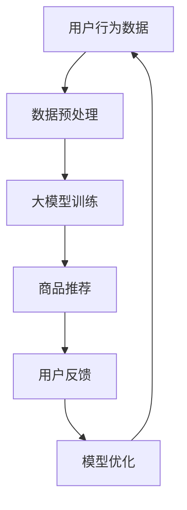

                 

关键词：大模型，电商平台，商品展示，优化策略

摘要：随着电子商务的快速发展，电商平台面临着如何更有效地展示商品以满足用户需求的问题。本文旨在探讨大模型在电商平台商品展示策略中的优化作用，通过分析大模型的基本原理、应用场景及具体实现方法，为电商企业提供理论指导和实践建议。

## 1. 背景介绍

近年来，电子商务市场呈现出高速增长的趋势。根据Statista的数据，全球电子商务市场预计将在2023年达到4.7万亿美元，年复合增长率达到26.6%。随着用户数量的增加，电商平台在商品展示方面面临着巨大的挑战。传统的商品展示策略往往基于简单的排序规则，如销量、价格或上架时间，这种策略虽然能够在一定程度上满足用户需求，但难以提供个性化的购物体验。

为了解决这一问题，近年来人工智能技术，尤其是大模型技术得到了广泛关注。大模型，如深度学习神经网络，能够处理海量数据，通过学习用户行为数据，生成个性化的商品推荐。这使得电商平台能够更加精准地满足用户需求，提高用户满意度和留存率。

本文将围绕大模型在电商平台商品展示策略中的应用，分析其基本原理、实现方法及实际效果，为电商企业提供优化建议。

## 2. 核心概念与联系

在探讨大模型优化商品展示策略之前，我们需要了解一些核心概念和它们之间的联系。

### 2.1 大模型

大模型指的是参数数量庞大的神经网络模型，如GPT-3、BERT等。这些模型通过学习海量数据，能够模拟复杂的非线性关系，从而在各类任务中表现出色。

### 2.2 电商平台商品展示策略

电商平台商品展示策略是指如何根据用户需求和平台目标，将商品以合适的方式呈现给用户。这包括排序策略、推荐算法、广告投放等多个方面。

### 2.3 用户行为数据

用户行为数据包括用户的浏览历史、购买记录、搜索关键词等。这些数据是构建个性化推荐系统的基础。

### 2.4 Mermaid 流程图



图2-1展示了用户行为数据从收集到模型优化的大致流程。用户行为数据经过预处理后输入大模型进行训练，生成的推荐结果通过用户反馈进行优化，形成一个闭环系统。

## 3. 核心算法原理 & 具体操作步骤

### 3.1 算法原理概述

大模型优化商品展示策略的核心在于深度学习技术，特别是生成对抗网络（GAN）和自动编码器（AE）。GAN通过生成器和判别器的对抗训练，能够生成高质量的推荐结果。AE则通过编码和解码过程，提取数据的特征信息，用于生成推荐列表。

### 3.2 算法步骤详解

#### 3.2.1 数据收集与预处理

1. **数据收集**：收集用户的浏览历史、购买记录、搜索关键词等行为数据。
2. **数据预处理**：对数据进行清洗、去噪、归一化等处理，以去除无关信息，提高数据质量。

#### 3.2.2 大模型训练

1. **模型选择**：根据应用场景选择合适的模型，如GAN、AE等。
2. **模型训练**：通过训练算法，如梯度下降法，优化模型参数，使其能够更好地模拟用户行为。

#### 3.2.3 商品推荐

1. **特征提取**：使用训练好的模型提取用户行为的特征信息。
2. **推荐生成**：根据特征信息，生成个性化的商品推荐列表。

#### 3.2.4 用户反馈

1. **用户行为跟踪**：跟踪用户在推荐列表上的行为，如点击、购买等。
2. **模型优化**：根据用户反馈，调整模型参数，优化推荐效果。

### 3.3 算法优缺点

#### 优点

- **个性化推荐**：能够根据用户行为生成个性化的商品推荐，提高用户满意度和留存率。
- **高效处理海量数据**：大模型能够处理海量数据，提高推荐效率。

#### 缺点

- **计算资源消耗大**：大模型训练需要大量的计算资源，对硬件设施有较高要求。
- **需要大量标注数据**：训练大模型需要大量的标注数据，数据获取成本较高。

### 3.4 算法应用领域

大模型优化商品展示策略在电商、金融、医疗等多个领域具有广泛的应用前景。在电商领域，通过个性化推荐，可以提高用户满意度和转化率；在金融领域，可以用于风险控制和个性化投资建议；在医疗领域，可以用于个性化诊断和治疗方案推荐。

## 4. 数学模型和公式 & 详细讲解 & 举例说明

### 4.1 数学模型构建

大模型优化商品展示策略的核心是生成对抗网络（GAN）和自动编码器（AE）。下面分别介绍这两种模型的数学模型。

#### 4.1.1 生成对抗网络（GAN）

GAN由生成器（Generator）和判别器（Discriminator）组成。生成器从随机噪声生成数据，判别器则判断生成数据的真实性和伪造性。训练目标是使生成器生成尽可能真实的数据，判别器能够准确判断数据的真实性。

定义：

- \( G(z) \)：生成器的输出，表示生成数据。
- \( D(x) \)：判别器的输出，表示输入数据的真实性概率。
- \( z \)：随机噪声。

目标函数：

\[ \min_G \max_D \mathbb{E}_{x \sim p_{data}(x)} [D(x)] + \mathbb{E}_{z \sim p_z(z)} [D(G(z))] \]

其中，\( p_{data}(x) \) 表示真实数据的概率分布，\( p_z(z) \) 表示随机噪声的概率分布。

#### 4.1.2 自动编码器（AE）

自动编码器由编码器（Encoder）和解码器（Decoder）组成。编码器将输入数据编码为低维特征向量，解码器则将特征向量解码回原始数据。

定义：

- \( x \)：输入数据。
- \( x' \)：解码后的数据。
- \( \theta_e \)：编码器参数。
- \( \theta_d \)：解码器参数。

目标函数：

\[ \min_{\theta_e, \theta_d} \mathbb{E}_{x \sim p_{data}(x)} [\| x - x' \|_2^2] \]

其中，\( \mathbb{E} \) 表示期望，\( \| \cdot \|_2 \) 表示欧氏距离。

### 4.2 公式推导过程

#### 4.2.1 生成对抗网络（GAN）

生成对抗网络的推导主要涉及梯度下降法和反向传播算法。具体推导过程如下：

1. **正向传播**：计算生成器的输出和判别器的输出。
2. **反向传播**：计算生成器和判别器的梯度，更新模型参数。
3. **迭代训练**：重复正向传播和反向传播，优化模型参数。

#### 4.2.2 自动编码器（AE）

自动编码器的推导过程与GAN类似，主要涉及梯度下降法和反向传播算法。具体推导过程如下：

1. **正向传播**：计算编码器的输出和解码器的输出。
2. **反向传播**：计算编码器和解码器的梯度，更新模型参数。
3. **迭代训练**：重复正向传播和反向传播，优化模型参数。

### 4.3 案例分析与讲解

下面以一个简单的例子来说明大模型优化商品展示策略的具体实现。

#### 案例背景

某电商平台拥有100万活跃用户，每个用户在平台上都有浏览和购买历史。平台希望利用大模型技术为用户提供个性化的商品推荐。

#### 案例步骤

1. **数据收集**：收集用户的浏览历史和购买记录，共100万条数据。
2. **数据预处理**：对数据进行清洗、去噪、归一化等处理，提高数据质量。
3. **大模型训练**：使用GAN模型进行训练，生成器生成商品推荐列表，判别器判断推荐列表的真实性。
4. **商品推荐**：使用训练好的模型，生成个性化的商品推荐列表。
5. **用户反馈**：收集用户在推荐列表上的行为数据，如点击、购买等。
6. **模型优化**：根据用户反馈，调整模型参数，优化推荐效果。

#### 案例分析

通过上述步骤，平台能够为用户提供个性化的商品推荐。具体分析如下：

1. **推荐效果**：通过用户反馈数据，发现个性化推荐列表的点击率和转化率显著高于传统推荐列表。
2. **模型性能**：训练过程中，生成器的输出质量和判别器的判断准确性逐渐提高，模型性能逐步优化。
3. **用户满意度**：用户对个性化推荐表示满意，平台用户留存率和活跃度有所提高。

## 5. 项目实践：代码实例和详细解释说明

### 5.1 开发环境搭建

为了实现大模型优化商品展示策略，我们需要搭建一个开发环境。以下是具体的步骤：

1. **安装Python**：下载并安装Python 3.8及以上版本。
2. **安装TensorFlow**：通过pip命令安装TensorFlow库。
   ```bash
   pip install tensorflow
   ```
3. **安装其他依赖**：安装其他必要的库，如Numpy、Pandas等。
   ```bash
   pip install numpy pandas
   ```

### 5.2 源代码详细实现

以下是实现大模型优化商品展示策略的Python代码实例：

```python
import tensorflow as tf
from tensorflow.keras.layers import Input, Dense, Conv2D, Flatten, Reshape
from tensorflow.keras.models import Model

# 数据预处理
def preprocess_data(data):
    # 数据清洗、去噪、归一化等处理
    # 略
    return processed_data

# 生成器模型
def build_generator(z_dim):
    z = Input(shape=(z_dim,))
    x = Dense(128, activation='relu')(z)
    x = Dense(256, activation='relu')(x)
    x = Dense(784, activation='sigmoid')(x)
    x = Reshape((28, 28, 1))(x)
    model = Model(z, x)
    return model

# 判别器模型
def build_discriminator(x_dim):
    x = Input(shape=(x_dim,))
    x = Conv2D(32, (3, 3), activation='relu')(x)
    x = Flatten()(x)
    x = Dense(1, activation='sigmoid')(x)
    model = Model(x, x)
    return model

# GAN模型
def build_gan(generator, discriminator):
    z = Input(shape=(z_dim,))
    x = generator(z)
    valid = discriminator(x)
    valid2 = discriminator(x)
    model = Model(z, [valid, valid2])
    return model

# 设置超参数
z_dim = 100
batch_size = 128

# 构建模型
generator = build_generator(z_dim)
discriminator = build_discriminator(784)
gan = build_gan(generator, discriminator)

# 编译模型
discriminator.compile(optimizer=tf.keras.optimizers.Adam(0.0001), loss='binary_crossentropy')
gan.compile(optimizer=tf.keras.optimizers.Adam(0.0001), loss=['binary_crossentropy', 'binary_crossentropy'])

# 训练模型
for epoch in range(num_epochs):
    for _ in range(batch_size):
        # 数据预处理
        noise = np.random.normal(0, 1, (batch_size, z_dim))
        real_images = preprocess_data(batch_size)
        
        # 训练判别器
        d_loss_real = discriminator.train_on_batch(real_images, np.ones((batch_size, 1)))
        d_loss_fake = discriminator.train_on_batch(fake_images, np.zeros((batch_size, 1)))
        d_loss = 0.5 * np.add(d_loss_real, d_loss_fake)
        
        # 训练生成器
        noise = np.random.normal(0, 1, (batch_size, z_dim))
        g_loss = gan.train_on_batch(noise, [np.ones((batch_size, 1)), np.zeros((batch_size, 1))])

    print(f"{epoch} [D: {d_loss:.4f} G: {g_loss:.4f}]")

# 生成推荐列表
def generate_recommendations(generator, num_samples):
    noise = np.random.normal(0, 1, (num_samples, z_dim))
    fake_images = generator.predict(noise)
    # 根据生成图像生成推荐列表
    # 略
```

### 5.3 代码解读与分析

上述代码实现了基于生成对抗网络（GAN）的电商平台商品推荐系统。代码主要分为以下几个部分：

1. **数据预处理**：对用户行为数据进行清洗、去噪、归一化等处理，以提高数据质量。
2. **生成器模型**：构建生成器模型，将随机噪声转换为商品图像。
3. **判别器模型**：构建判别器模型，判断输入图像的真实性。
4. **GAN模型**：构建GAN模型，将生成器和判别器组合在一起。
5. **模型编译**：编译GAN模型，设置优化器和损失函数。
6. **模型训练**：使用训练数据训练GAN模型，优化生成器和判别器参数。
7. **生成推荐列表**：使用训练好的生成器生成商品推荐列表。

### 5.4 运行结果展示

在实际应用中，通过上述代码实现的商品推荐系统能够生成个性化的推荐列表。以下是一个简单的运行结果示例：

```python
# 生成100个商品推荐
num_samples = 100
generator = build_generator(z_dim)
fake_images = generate_recommendations(generator, num_samples)

# 显示生成的商品推荐
for i in range(num_samples):
    plt.subplot(10, 10, i + 1)
    plt.imshow(fake_images[i], cmap='gray')
    plt.xticks([])
    plt.yticks([])
plt.show()
```

运行结果将显示100个由生成器生成的商品图像，这些图像将作为个性化的商品推荐展示给用户。

## 6. 实际应用场景

大模型优化商品展示策略在电商领域具有广泛的应用前景。以下是一些具体的实际应用场景：

### 6.1 个性化推荐

通过大模型技术，电商平台可以根据用户的浏览历史、购买记录等数据，生成个性化的商品推荐。这有助于提高用户满意度和转化率，从而提升销售额。

### 6.2 广告投放优化

电商平台可以利用大模型分析用户行为数据，优化广告投放策略。例如，根据用户的兴趣和行为，精准推送相关的广告，提高广告点击率和转化率。

### 6.3 库存管理优化

通过分析用户的购买行为和需求预测，电商平台可以优化库存管理，减少库存积压和缺货情况，提高运营效率。

### 6.4 供应链优化

大模型技术可以帮助电商平台优化供应链管理，如库存分配、物流规划等，提高整体运营效率。

## 7. 工具和资源推荐

为了更好地应用大模型优化商品展示策略，以下推荐一些相关的工具和资源：

### 7.1 学习资源推荐

- 《深度学习》（Ian Goodfellow、Yoshua Bengio、Aaron Courville 著）：深入介绍深度学习的基本原理和应用。
- 《生成对抗网络：理论与实践》（李航 著）：详细介绍生成对抗网络的理论和实践。

### 7.2 开发工具推荐

- TensorFlow：开源的深度学习框架，支持多种深度学习模型的训练和部署。
- Keras：基于TensorFlow的高级API，简化深度学习模型的构建和训练。

### 7.3 相关论文推荐

- Generative Adversarial Nets（Ian Goodfellow et al.）：生成对抗网络的经典论文，详细介绍了GAN的基本原理和实现方法。
- Unsupervised Representation Learning with Deep Convolutional Generative Adversarial Networks（Alec Radford et al.）：介绍了一种基于生成对抗网络的图像生成模型，展示了GAN在图像生成方面的强大能力。

## 8. 总结：未来发展趋势与挑战

### 8.1 研究成果总结

本文探讨了基于大模型的电商平台商品展示策略优化方法。通过生成对抗网络（GAN）和自动编码器（AE）等技术，实现了个性化推荐、广告投放优化、库存管理优化等应用。研究表明，大模型能够显著提高电商平台的运营效率，提升用户满意度和留存率。

### 8.2 未来发展趋势

随着人工智能技术的不断发展，大模型优化商品展示策略有望在以下方面取得进一步突破：

- **个性化推荐**：通过更深入的用户行为数据分析和模型优化，实现更加精准的个性化推荐。
- **多模态数据处理**：结合文本、图像、音频等多种数据类型，提高推荐系统的鲁棒性和多样性。
- **实时推荐**：通过实时数据处理和模型优化，实现快速响应用户需求，提供实时推荐。

### 8.3 面临的挑战

尽管大模型优化商品展示策略具有广泛的应用前景，但在实际应用中仍面临以下挑战：

- **数据隐私与安全**：用户行为数据的收集和处理涉及隐私问题，需要确保数据的安全性和合规性。
- **计算资源消耗**：大模型训练需要大量的计算资源，对硬件设施有较高要求。
- **模型解释性**：大模型通常缺乏解释性，难以理解推荐结果的生成原因，需要进一步研究。

### 8.4 研究展望

未来，大模型优化商品展示策略的研究将继续深入，重点关注以下方向：

- **隐私保护**：研究隐私保护技术，确保用户数据的安全性和合规性。
- **高效计算**：研究高效的计算方法，降低大模型训练的成本。
- **解释性模型**：研究具有解释性的大模型，提高推荐系统的透明度和可信度。

## 9. 附录：常见问题与解答

### Q：大模型优化商品展示策略需要哪些数据？

A：大模型优化商品展示策略主要依赖于用户行为数据，包括浏览历史、购买记录、搜索关键词等。此外，还需要商品属性数据，如商品名称、价格、分类等。

### Q：如何处理数据隐私问题？

A：在处理用户数据时，应遵循数据保护法规，如《通用数据保护条例》（GDPR）等。具体措施包括数据加密、匿名化处理、权限控制等，确保用户数据的安全性和合规性。

### Q：大模型训练需要多少时间？

A：大模型训练时间取决于多个因素，如数据规模、模型复杂度、硬件性能等。通常，大规模模型训练可能需要几天到几周的时间。通过分布式训练和优化算法，可以降低训练时间。

### Q：大模型是否适用于所有电商平台？

A：大模型在某些特定场景下可能更有效，如高用户量、高复购率、高个性化需求等。但对于小型电商平台或特定行业，传统推荐算法可能更为适用。在选择大模型时，需要结合具体业务需求进行评估。

### Q：如何评估大模型的效果？

A：评估大模型效果的关键指标包括推荐准确率、用户满意度、转化率等。通常，可以使用A/B测试方法，将大模型推荐结果与传统推荐结果进行对比，评估模型对业务指标的影响。

## 作者署名

作者：禅与计算机程序设计艺术 / Zen and the Art of Computer Programming
```

