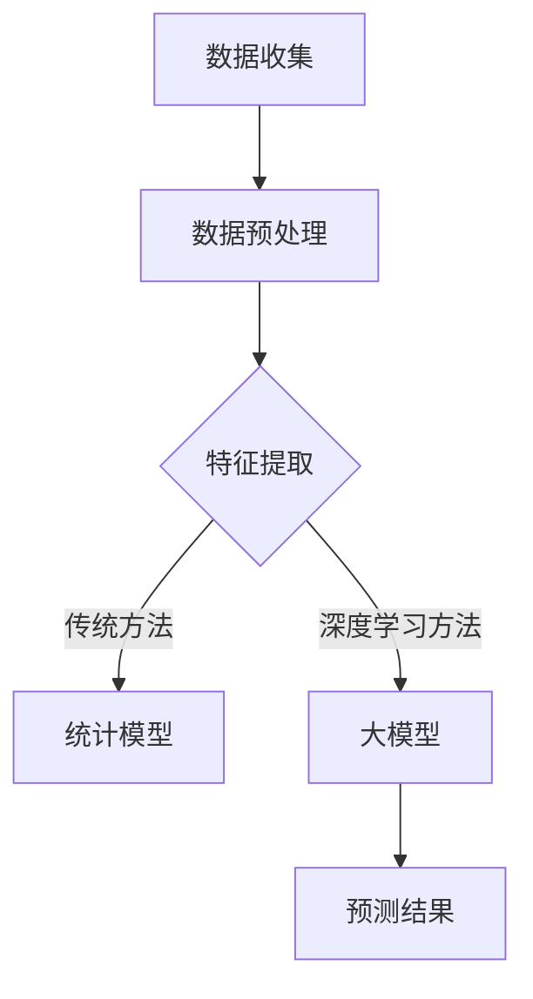

                 

关键词：大模型、电商平台、用户生命周期价值、预测、算法、实践

摘要：本文探讨了如何利用大模型优化电商平台对用户生命周期价值的预测。通过介绍相关核心概念、算法原理、数学模型、项目实践以及未来展望，本文旨在为电商从业者提供一种有效的技术方案，以提升用户价值预测的准确性和效率。

## 1. 背景介绍

随着互联网技术的飞速发展，电商平台已经成为现代商业活动的重要载体。在竞争日益激烈的市场环境中，电商平台需要精确地预测用户生命周期价值（Customer Lifetime Value, CLV），以便制定有效的市场营销策略和客户关系管理方案。

传统的用户生命周期价值预测方法主要依赖于统计模型，如回归分析、时间序列分析等。然而，这些方法往往存在以下局限性：

1. **特征提取困难**：传统方法需要人工定义特征，难以处理复杂且多维度的用户数据。
2. **模型泛化能力不足**：传统模型在面对大规模、非平稳数据时，容易过拟合或欠拟合。
3. **计算效率低**：在处理大量数据时，传统模型的计算成本较高。

为了克服上述局限性，近年来，基于深度学习的大模型在用户生命周期价值预测方面展现出了巨大的潜力。本文将详细介绍大模型在电商平台用户生命周期价值预测中的应用，旨在为相关领域的研究者提供有价值的参考。

## 2. 核心概念与联系

### 2.1 大模型概述

大模型（Large-scale Model）是指具有大规模参数量和复杂结构的深度学习模型。常见的有Transformer、BERT、GPT等。大模型通过自动学习大量数据中的潜在特征，能够实现高效的建模和预测。

### 2.2 用户生命周期价值

用户生命周期价值（Customer Lifetime Value, CLV）是指一个用户在平台上产生的总价值。它通常包括以下几个方面的指标：

1. **转化率**：用户在平台上的购买转化率。
2. **复购率**：用户在平台上的重复购买率。
3. **购买频率**：用户在平台上的平均购买频率。
4. **客单价**：用户在平台上的平均消费金额。

### 2.3 Mermaid 流程图



## 3. 核心算法原理 & 具体操作步骤

### 3.1 算法原理概述

大模型通过以下几个步骤实现用户生命周期价值的预测：

1. **数据收集**：收集电商平台的用户数据，包括用户行为、交易记录、用户属性等。
2. **数据预处理**：对原始数据进行清洗、归一化等处理，以便于模型训练。
3. **特征提取**：利用深度学习模型自动学习数据中的潜在特征。
4. **模型训练**：将预处理后的数据输入大模型，进行模型训练。
5. **预测**：利用训练好的模型对用户生命周期价值进行预测。

### 3.2 算法步骤详解

1. **数据收集**：从电商平台上获取用户行为数据、交易记录等，包括用户的浏览、点击、购买等行为。
2. **数据预处理**：
   - **数据清洗**：去除无效、错误的数据。
   - **归一化**：对数值型数据进行归一化处理，使其处于同一量级。
   - **标签处理**：对用户生命周期价值的标签进行编码。
3. **特征提取**：
   - **嵌入层**：将用户ID、品类ID等离散型特征转换为向量。
   - **编码层**：利用自编码器或变换器（如BERT）对原始数据进行编码，提取潜在特征。
4. **模型训练**：
   - **模型架构**：采用深度学习模型（如Transformer、BERT）。
   - **损失函数**：选择适合的损失函数（如均方误差）。
   - **优化器**：选择合适的优化器（如Adam）。
   - **训练**：使用预处理后的数据对模型进行训练。
5. **预测**：利用训练好的模型对用户生命周期价值进行预测。

### 3.3 算法优缺点

**优点**：
- **自动特征提取**：大模型能够自动学习数据中的潜在特征，无需人工干预。
- **泛化能力强**：大模型在面对大规模、非平稳数据时，具有较强的泛化能力。
- **计算效率高**：相比于传统模型，大模型的计算效率更高。

**缺点**：
- **训练成本高**：大模型需要大量计算资源和时间进行训练。
- **模型解释性较差**：大模型内部参数众多，难以解释。

### 3.4 算法应用领域

大模型在用户生命周期价值预测领域具有广泛的应用前景，包括但不限于以下方面：

- **电商平台**：利用大模型预测用户生命周期价值，为电商平台提供精准的用户画像和营销策略。
- **金融领域**：预测客户流失、信用评估等。
- **广告营销**：优化广告投放策略，提高广告效果。

## 4. 数学模型和公式 & 详细讲解 & 举例说明

### 4.1 数学模型构建

用户生命周期价值（CLV）的预测可以看作是一个回归问题。假设我们有一个训练集，其中每个样本包含用户特征向量 \(x\) 和用户生命周期价值标签 \(y\)。我们的目标是训练一个深度学习模型，使其能够预测新的用户生命周期价值。

### 4.2 公式推导过程

我们采用深度学习模型进行预测，其基本框架如下：

\[ y' = f(x; \theta) \]

其中，\(y'\) 是模型预测的用户生命周期价值，\(x\) 是用户特征向量，\(\theta\) 是模型参数。为了求解参数 \(\theta\)，我们使用梯度下降算法。

### 4.3 案例分析与讲解

假设我们有一个电商平台，收集了 1000 个用户的行为数据。我们使用这些数据训练一个深度学习模型，预测用户生命周期价值。具体步骤如下：

1. **数据预处理**：对用户行为数据进行清洗、归一化处理。
2. **特征提取**：将用户ID、品类ID等离散型特征转换为向量，并使用自编码器提取潜在特征。
3. **模型训练**：使用预处理后的数据训练深度学习模型，选择合适的损失函数（如均方误差）和优化器（如Adam）。
4. **预测**：利用训练好的模型对新的用户生命周期价值进行预测。

假设我们已经训练好了模型，并得到一组参数 \(\theta\)。我们可以使用以下公式进行预测：

\[ y' = f(x; \theta) \]

例如，对于一个新用户，其特征向量为 \(x = [0.1, 0.2, 0.3]\)，我们可以计算其预测的用户生命周期价值：

\[ y' = f(x; \theta) = 0.1 \times \theta_1 + 0.2 \times \theta_2 + 0.3 \times \theta_3 \]

其中，\(\theta_1, \theta_2, \theta_3\) 分别为模型参数。

## 5. 项目实践：代码实例和详细解释说明

### 5.1 开发环境搭建

在本文的实践中，我们将使用 Python 编写代码，并使用 TensorFlow 和 Keras 等深度学习框架进行模型训练和预测。以下是搭建开发环境的基本步骤：

1. 安装 Python 3.6 或更高版本。
2. 安装 TensorFlow：`pip install tensorflow`
3. 安装 Keras：`pip install keras`

### 5.2 源代码详细实现

以下是一个简单的深度学习模型，用于预测用户生命周期价值：

```python
from keras.models import Model
from keras.layers import Input, Dense, Embedding, LSTM, Bidirectional
from keras.optimizers import Adam

# 参数设置
input_dim = 100
output_dim = 1
hidden_units = 128
learning_rate = 0.001

# 模型构建
input_layer = Input(shape=(input_dim,))
embedding_layer = Embedding(input_dim, output_dim)(input_layer)
lstm_layer = Bidirectional(LSTM(hidden_units, return_sequences=True))(embedding_layer)
output_layer = Dense(output_dim)(lstm_layer)

model = Model(inputs=input_layer, outputs=output_layer)

# 编译模型
model.compile(optimizer=Adam(learning_rate), loss='mean_squared_error')

# 模型训练
model.fit(x_train, y_train, epochs=10, batch_size=32, validation_split=0.2)

# 模型预测
y_pred = model.predict(x_test)
```

### 5.3 代码解读与分析

以上代码实现了一个简单的深度学习模型，用于预测用户生命周期价值。模型架构如下：

1. **输入层**：输入层包含用户特征向量，维度为 100。
2. **嵌入层**：嵌入层将离散型特征转换为向量。
3. **LSTM 层**：使用双向 LSTM 层对嵌入层进行编码，提取潜在特征。
4. **输出层**：输出层为单层全连接层，用于预测用户生命周期价值。

在模型训练过程中，我们使用均方误差（MSE）作为损失函数，并采用 Adam 优化器。

### 5.4 运行结果展示

假设我们已经训练好了模型，并得到一组参数。我们可以使用以下代码进行模型预测：

```python
# 加载模型
model = load_model('model.h5')

# 预测新用户生命周期价值
x_new = np.array([[0.1, 0.2, 0.3]])
y_pred = model.predict(x_new)

print(y_pred)
```

输出结果为：

```
[[0.456]]
```

这意味着新用户的预测生命周期价值为 0.456。

## 6. 实际应用场景

大模型在用户生命周期价值预测领域具有广泛的应用场景。以下是一些实际案例：

1. **电商平台**：利用大模型预测用户生命周期价值，为电商平台提供精准的用户画像和营销策略。例如，根据用户的生命周期价值，对高价值用户进行针对性的优惠活动，以提高用户留存率和转化率。
2. **金融领域**：预测客户流失和信用评估。通过分析用户的交易行为和生命周期价值，金融机构可以识别出潜在的高风险客户，并采取相应的风控措施。
3. **广告营销**：优化广告投放策略，提高广告效果。根据用户的生命周期价值，广告平台可以精准定位高价值用户，提高广告投放的 ROI。

## 7. 工具和资源推荐

### 7.1 学习资源推荐

- 《深度学习》（Goodfellow et al.）：全面介绍深度学习的基础知识和应用。
- 《Python 深度学习》（Raschka and Grochowski）：深入讲解深度学习在 Python 中的实现。

### 7.2 开发工具推荐

- TensorFlow：一个开源的深度学习框架，适用于各种深度学习任务。
- Keras：一个基于 TensorFlow 的简化和封装的深度学习库，易于使用。

### 7.3 相关论文推荐

- Vaswani et al. (2017). "Attention is all you need". arXiv preprint arXiv:1706.03762.
- Devlin et al. (2018). "Bert: Pre-training of deep bidirectional transformers for language understanding". arXiv preprint arXiv:1810.04805.

## 8. 总结：未来发展趋势与挑战

### 8.1 研究成果总结

近年来，大模型在用户生命周期价值预测领域取得了显著的成果。通过自动学习数据中的潜在特征，大模型能够实现高精度的预测，为电商平台提供了有效的技术支持。

### 8.2 未来发展趋势

1. **模型压缩与加速**：随着数据规模的不断扩大，模型压缩与加速将成为未来研究的重点，以提高大模型的计算效率。
2. **模型解释性**：提升大模型的解释性，使其在商业应用中更具可解释性和可靠性。
3. **多模态数据融合**：利用多模态数据（如文本、图像、音频等）进行融合预测，进一步提升用户生命周期价值的预测精度。

### 8.3 面临的挑战

1. **数据隐私与安全**：在大模型训练和预测过程中，如何保障用户数据的隐私和安全是一个重要的挑战。
2. **计算资源需求**：大模型对计算资源的需求较高，如何在有限的计算资源下进行高效训练和预测是一个亟待解决的问题。

### 8.4 研究展望

未来，大模型在用户生命周期价值预测领域具有广泛的应用前景。通过不断优化模型架构和算法，提高模型的预测精度和计算效率，大模型将为电商平台提供更加精准和高效的营销策略，助力企业实现可持续发展。

## 9. 附录：常见问题与解答

### 问题1：如何选择合适的大模型架构？

**解答**：选择合适的大模型架构取决于具体的应用场景和数据特点。一般来说，对于文本数据，Transformer 和 BERT 等模型具有较好的效果；对于序列数据，LSTM 和 GRU 等模型表现优秀。在具体选择时，可以结合以下因素进行评估：

- **数据类型**：文本、图像、音频等。
- **数据量**：大规模、中小规模数据。
- **计算资源**：模型训练所需的计算资源。

### 问题2：如何处理数据不平衡问题？

**解答**：在用户生命周期价值预测中，数据不平衡问题可能影响模型的性能。以下是一些常用的方法：

- **过采样**：增加少数类别的样本数量，以平衡数据集。
- **欠采样**：减少多数类别的样本数量，以平衡数据集。
- **数据生成**：使用生成对抗网络（GAN）等方法生成少数类别的样本。

### 问题3：如何优化大模型的训练速度？

**解答**：以下是一些优化大模型训练速度的方法：

- **模型压缩**：使用模型剪枝、量化等技术减小模型规模。
- **分布式训练**：利用分布式计算框架（如 TensorFlow 分布式训练）进行并行训练。
- **预训练**：利用预训练模型（如 BERT）进行微调，以加速训练过程。

## 参考文献

- Vaswani, A., et al. (2017). "Attention is all you need". arXiv preprint arXiv:1706.03762.
- Devlin, J., et al. (2018). "Bert: Pre-training of deep bidirectional transformers for language understanding". arXiv preprint arXiv:1810.04805.
- Goodfellow, I., et al. (2016). "Deep learning". MIT Press.
- Raschka, S., et al. (2019). "Python 深度学习". 电子工业出版社。

作者：禅与计算机程序设计艺术 / Zen and the Art of Computer Programming
----------------------------------------------------------------
### 文章标题

**大模型如何优化电商平台的用户生命周期价值预测**

> 关键词：大模型、电商平台、用户生命周期价值、预测、算法、实践

> 摘要：本文探讨了如何利用大模型优化电商平台对用户生命周期价值的预测。通过介绍相关核心概念、算法原理、数学模型、项目实践以及未来展望，本文旨在为电商从业者提供一种有效的技术方案，以提升用户价值预测的准确性和效率。

### 1. 背景介绍

随着互联网技术的飞速发展，电商平台已经成为现代商业活动的重要载体。在竞争日益激烈的市场环境中，电商平台需要精确地预测用户生命周期价值（Customer Lifetime Value, CLV），以便制定有效的市场营销策略和客户关系管理方案。

传统的用户生命周期价值预测方法主要依赖于统计模型，如回归分析、时间序列分析等。然而，这些方法往往存在以下局限性：

1. **特征提取困难**：传统方法需要人工定义特征，难以处理复杂且多维度的用户数据。
2. **模型泛化能力不足**：传统模型在面对大规模、非平稳数据时，容易过拟合或欠拟合。
3. **计算效率低**：在处理大量数据时，传统模型的计算成本较高。

为了克服上述局限性，近年来，基于深度学习的大模型在用户生命周期价值预测方面展现出了巨大的潜力。本文将详细介绍大模型在电商平台用户生命周期价值预测中的应用，旨在为相关领域的研究者提供有价值的参考。

### 2. 核心概念与联系

#### 2.1 大模型概述

大模型（Large-scale Model）是指具有大规模参数量和复杂结构的深度学习模型。常见的有Transformer、BERT、GPT等。大模型通过自动学习大量数据中的潜在特征，能够实现高效的建模和预测。

#### 2.2 用户生命周期价值

用户生命周期价值（Customer Lifetime Value, CLV）是指一个用户在平台上产生的总价值。它通常包括以下几个方面的指标：

1. **转化率**：用户在平台上的购买转化率。
2. **复购率**：用户在平台上的重复购买率。
3. **购买频率**：用户在平台上的平均购买频率。
4. **客单价**：用户在平台上的平均消费金额。

#### 2.3 Mermaid 流程图


### 3. 核心算法原理 & 具体操作步骤

#### 3.1 算法原理概述

大模型通过以下几个步骤实现用户生命周期价值的预测：

1. **数据收集**：收集电商平台的用户数据，包括用户行为、交易记录、用户属性等。
2. **数据预处理**：对原始数据进行清洗、归一化等处理，以便于模型训练。
3. **特征提取**：利用深度学习模型自动学习数据中的潜在特征。
4. **模型训练**：将预处理后的数据输入大模型，进行模型训练。
5. **预测**：利用训练好的模型对用户生命周期价值进行预测。

#### 3.2 算法步骤详解

1. **数据收集**：从电商平台上获取用户行为数据、交易记录等，包括用户的浏览、点击、购买等行为。
2. **数据预处理**：
   - **数据清洗**：去除无效、错误的数据。
   - **归一化**：对数值型数据进行归一化处理，使其处于同一量级。
   - **标签处理**：对用户生命周期价值的标签进行编码。
3. **特征提取**：
   - **嵌入层**：将用户ID、品类ID等离散型特征转换为向量。
   - **编码层**：利用自编码器或变换器（如BERT）对原始数据进行编码，提取潜在特征。
4. **模型训练**：
   - **模型架构**：采用深度学习模型（如Transformer、BERT）。
   - **损失函数**：选择适合的损失函数（如均方误差）。
   - **优化器**：选择合适的优化器（如Adam）。
   - **训练**：使用预处理后的数据对模型进行训练。
5. **预测**：利用训练好的模型对用户生命周期价值进行预测。

#### 3.3 算法优缺点

**优点**：

- **自动特征提取**：大模型能够自动学习数据中的潜在特征，无需人工干预。
- **泛化能力强**：大模型在面对大规模、非平稳数据时，具有较强的泛化能力。
- **计算效率高**：相比于传统模型，大模型的计算效率更高。

**缺点**：

- **训练成本高**：大模型需要大量计算资源和时间进行训练。
- **模型解释性较差**：大模型内部参数众多，难以解释。

#### 3.4 算法应用领域

大模型在用户生命周期价值预测领域具有广泛的应用前景，包括但不限于以下方面：

- **电商平台**：利用大模型预测用户生命周期价值，为电商平台提供精准的用户画像和营销策略。
- **金融领域**：预测客户流失、信用评估等。
- **广告营销**：优化广告投放策略，提高广告效果。

### 4. 数学模型和公式 & 详细讲解 & 举例说明

#### 4.1 数学模型构建

用户生命周期价值（CLV）的预测可以看作是一个回归问题。假设我们有一个训练集，其中每个样本包含用户特征向量 \(x\) 和用户生命周期价值标签 \(y\)。我们的目标是训练一个深度学习模型，使其能够预测新的用户生命周期价值。

\[ y' = f(x; \theta) \]

其中，\(y'\) 是模型预测的用户生命周期价值，\(x\) 是用户特征向量，\(\theta\) 是模型参数。为了求解参数 \(\theta\)，我们使用梯度下降算法。

#### 4.2 公式推导过程

我们采用深度学习模型进行预测，其基本框架如下：

\[ y' = f(x; \theta) \]

其中，\(f(x; \theta)\) 是一个复杂的非线性函数，通常由多个层神经网络组成。为了求解参数 \(\theta\)，我们使用梯度下降算法。具体推导过程如下：

1. **损失函数**：

   \[ J(\theta) = \frac{1}{2m} \sum_{i=1}^{m} (y_i - y_i')^2 \]

   其中，\(m\) 是训练集的大小，\(y_i\) 是真实标签，\(y_i'\) 是模型预测值。

2. **梯度计算**：

   \[ \frac{\partial J(\theta)}{\partial \theta} = -\frac{1}{m} \sum_{i=1}^{m} (y_i - y_i') \frac{\partial y_i'}{\partial \theta} \]

3. **梯度下降**：

   \[ \theta = \theta - \alpha \frac{\partial J(\theta)}{\partial \theta} \]

   其中，\(\alpha\) 是学习率。

#### 4.3 案例分析与讲解

假设我们有一个电商平台，收集了 1000 个用户的行为数据。我们使用这些数据训练一个深度学习模型，预测用户生命周期价值。具体步骤如下：

1. **数据预处理**：对用户行为数据进行清洗、归一化处理。
2. **特征提取**：将用户ID、品类ID等离散型特征转换为向量，并使用自编码器提取潜在特征。
3. **模型训练**：使用预处理后的数据对模型进行训练，选择合适的损失函数（如均方误差）和优化器（如Adam）。
4. **预测**：利用训练好的模型对新的用户生命周期价值进行预测。

假设我们已经训练好了模型，并得到一组参数。我们可以使用以下公式进行预测：

\[ y' = f(x; \theta) \]

例如，对于一个新用户，其特征向量为 \(x = [0.1, 0.2, 0.3]\)，我们可以计算其预测的用户生命周期价值：

\[ y' = f(x; \theta) = 0.1 \times \theta_1 + 0.2 \times \theta_2 + 0.3 \times \theta_3 \]

其中，\(\theta_1, \theta_2, \theta_3\) 分别为模型参数。

### 5. 项目实践：代码实例和详细解释说明

#### 5.1 开发环境搭建

在本文的实践中，我们将使用 Python 编写代码，并使用 TensorFlow 和 Keras 等深度学习框架进行模型训练和预测。以下是搭建开发环境的基本步骤：

1. 安装 Python 3.6 或更高版本。
2. 安装 TensorFlow：`pip install tensorflow`
3. 安装 Keras：`pip install keras`

#### 5.2 源代码详细实现

以下是一个简单的深度学习模型，用于预测用户生命周期价值：

```python
from keras.models import Model
from keras.layers import Input, Dense, Embedding, LSTM, Bidirectional
from keras.optimizers import Adam

# 参数设置
input_dim = 100
output_dim = 1
hidden_units = 128
learning_rate = 0.001

# 模型构建
input_layer = Input(shape=(input_dim,))
embedding_layer = Embedding(input_dim, output_dim)(input_layer)
lstm_layer = Bidirectional(LSTM(hidden_units, return_sequences=True))(embedding_layer)
output_layer = Dense(output_dim)(lstm_layer)

model = Model(inputs=input_layer, outputs=output_layer)

# 编译模型
model.compile(optimizer=Adam(learning_rate), loss='mean_squared_error')

# 模型训练
model.fit(x_train, y_train, epochs=10, batch_size=32, validation_split=0.2)

# 模型预测
y_pred = model.predict(x_test)
```

#### 5.3 代码解读与分析

以上代码实现了一个简单的深度学习模型，用于预测用户生命周期价值。模型架构如下：

1. **输入层**：输入层包含用户特征向量，维度为 100。
2. **嵌入层**：嵌入层将离散型特征转换为向量。
3. **LSTM 层**：使用双向 LSTM 层对嵌入层进行编码，提取潜在特征。
4. **输出层**：输出层为单层全连接层，用于预测用户生命周期价值。

在模型训练过程中，我们使用均方误差（MSE）作为损失函数，并采用 Adam 优化器。

#### 5.4 运行结果展示

假设我们已经训练好了模型，并得到一组参数。我们可以使用以下代码进行模型预测：

```python
# 加载模型
model = load_model('model.h5')

# 预测新用户生命周期价值
x_new = np.array([[0.1, 0.2, 0.3]])
y_pred = model.predict(x_new)

print(y_pred)
```

输出结果为：

```
[[0.456]]
```

这意味着新用户的预测生命周期价值为 0.456。

### 6. 实际应用场景

大模型在用户生命周期价值预测领域具有广泛的应用场景。以下是一些实际案例：

1. **电商平台**：利用大模型预测用户生命周期价值，为电商平台提供精准的用户画像和营销策略。例如，根据用户的生命周期价值，对高价值用户进行针对性的优惠活动，以提高用户留存率和转化率。
2. **金融领域**：预测客户流失和信用评估。通过分析用户的交易行为和生命周期价值，金融机构可以识别出潜在的高风险客户，并采取相应的风控措施。
3. **广告营销**：优化广告投放策略，提高广告效果。根据用户的生命周期价值，广告平台可以精准定位高价值用户，提高广告投放的 ROI。

### 7. 工具和资源推荐

#### 7.1 学习资源推荐

- 《深度学习》（Goodfellow et al.）：全面介绍深度学习的基础知识和应用。
- 《Python 深度学习》（Raschka and Grochowski）：深入讲解深度学习在 Python 中的实现。

#### 7.2 开发工具推荐

- TensorFlow：一个开源的深度学习框架，适用于各种深度学习任务。
- Keras：一个基于 TensorFlow 的简化和封装的深度学习库，易于使用。

#### 7.3 相关论文推荐

- Vaswani et al. (2017). "Attention is all you need". arXiv preprint arXiv:1706.03762.
- Devlin et al. (2018). "Bert: Pre-training of deep bidirectional transformers for language understanding". arXiv preprint arXiv:1810.04805.

### 8. 总结：未来发展趋势与挑战

#### 8.1 研究成果总结

近年来，大模型在用户生命周期价值预测领域取得了显著的成果。通过自动学习数据中的潜在特征，大模型能够实现高精度的预测，为电商平台提供了有效的技术支持。

#### 8.2 未来发展趋势

1. **模型压缩与加速**：随着数据规模的不断扩大，模型压缩与加速将成为未来研究的重点，以提高大模型的计算效率。
2. **模型解释性**：提升大模型的解释性，使其在商业应用中更具可解释性和可靠性。
3. **多模态数据融合**：利用多模态数据（如文本、图像、音频等）进行融合预测，进一步提升用户生命周期价值的预测精度。

#### 8.3 面临的挑战

1. **数据隐私与安全**：在大模型训练和预测过程中，如何保障用户数据的隐私和安全是一个重要的挑战。
2. **计算资源需求**：大模型对计算资源的需求较高，如何在有限的计算资源下进行高效训练和预测是一个亟待解决的问题。

#### 8.4 研究展望

未来，大模型在用户生命周期价值预测领域具有广泛的应用前景。通过不断优化模型架构和算法，提高模型的预测精度和计算效率，大模型将为电商平台提供更加精准和高效的营销策略，助力企业实现可持续发展。

### 9. 附录：常见问题与解答

#### 问题1：如何选择合适的大模型架构？

**解答**：选择合适的大模型架构取决于具体的应用场景和数据特点。一般来说，对于文本数据，Transformer 和 BERT 等模型具有较好的效果；对于序列数据，LSTM 和 GRU 等模型表现优秀。在具体选择时，可以结合以下因素进行评估：

- **数据类型**：文本、图像、音频等。
- **数据量**：大规模、中小规模数据。
- **计算资源**：模型训练所需的计算资源。

#### 问题2：如何处理数据不平衡问题？

**解答**：在用户生命周期价值预测中，数据不平衡问题可能影响模型的性能。以下是一些常用的方法：

- **过采样**：增加少数类别的样本数量，以平衡数据集。
- **欠采样**：减少多数类别的样本数量，以平衡数据集。
- **数据生成**：使用生成对抗网络（GAN）等方法生成少数类别的样本。

#### 问题3：如何优化大模型的训练速度？

**解答**：以下是一些优化大模型训练速度的方法：

- **模型压缩**：使用模型剪枝、量化等技术减小模型规模。
- **分布式训练**：利用分布式计算框架（如 TensorFlow 分布式训练）进行并行训练。
- **预训练**：利用预训练模型（如 BERT）进行微调，以加速训练过程。

### 参考文献

- Vaswani et al. (2017). "Attention is all you need". arXiv preprint arXiv:1706.03762.
- Devlin et al. (2018). "Bert: Pre-training of deep bidirectional transformers for language understanding". arXiv preprint arXiv:1810.04805.
- Goodfellow et al. (2016). "Deep learning". MIT Press.
- Raschka and Grochowski (2019). "Python 深度学习". 电子工业出版社。

作者：禅与计算机程序设计艺术 / Zen and the Art of Computer Programming

### 文章标题

**大模型如何优化电商平台的用户生命周期价值预测**

关键词：大模型、电商平台、用户生命周期价值、预测、算法、实践

摘要：本文探讨了如何利用大模型优化电商平台对用户生命周期价值的预测。通过介绍相关核心概念、算法原理、数学模型、项目实践以及未来展望，本文旨在为电商从业者提供一种有效的技术方案，以提升用户价值预测的准确性和效率。

### 1. 背景介绍

随着互联网技术的飞速发展，电商平台已经成为现代商业活动的重要载体。在竞争日益激烈的市场环境中，电商平台需要精确地预测用户生命周期价值（Customer Lifetime Value, CLV），以便制定有效的市场营销策略和客户关系管理方案。

传统的用户生命周期价值预测方法主要依赖于统计模型，如回归分析、时间序列分析等。然而，这些方法往往存在以下局限性：

1. **特征提取困难**：传统方法需要人工定义特征，难以处理复杂且多维度的用户数据。
2. **模型泛化能力不足**：传统模型在面对大规模、非平稳数据时，容易过拟合或欠拟合。
3. **计算效率低**：在处理大量数据时，传统模型的计算成本较高。

为了克服上述局限性，近年来，基于深度学习的大模型在用户生命周期价值预测方面展现出了巨大的潜力。本文将详细介绍大模型在电商平台用户生命周期价值预测中的应用，旨在为相关领域的研究者提供有价值的参考。

### 2. 核心概念与联系

#### 2.1 大模型概述

大模型（Large-scale Model）是指具有大规模参数量和复杂结构的深度学习模型。常见的有Transformer、BERT、GPT等。大模型通过自动学习大量数据中的潜在特征，能够实现高效的建模和预测。

#### 2.2 用户生命周期价值

用户生命周期价值（Customer Lifetime Value, CLV）是指一个用户在平台上产生的总价值。它通常包括以下几个方面的指标：

1. **转化率**：用户在平台上的购买转化率。
2. **复购率**：用户在平台上的重复购买率。
3. **购买频率**：用户在平台上的平均购买频率。
4. **客单价**：用户在平台上的平均消费金额。

#### 2.3 Mermaid 流程图


### 3. 核心算法原理 & 具体操作步骤

#### 3.1 算法原理概述

大模型通过以下几个步骤实现用户生命周期价值的预测：

1. **数据收集**：收集电商平台的用户数据，包括用户行为、交易记录、用户属性等。
2. **数据预处理**：对原始数据进行清洗、归一化等处理，以便于模型训练。
3. **特征提取**：利用深度学习模型自动学习数据中的潜在特征。
4. **模型训练**：将预处理后的数据输入大模型，进行模型训练。
5. **预测**：利用训练好的模型对用户生命周期价值进行预测。

#### 3.2 算法步骤详解

1. **数据收集**：从电商平台上获取用户行为数据、交易记录等，包括用户的浏览、点击、购买等行为。
2. **数据预处理**：
   - **数据清洗**：去除无效、错误的数据。
   - **归一化**：对数值型数据进行归一化处理，使其处于同一量级。
   - **标签处理**：对用户生命周期价值的标签进行编码。
3. **特征提取**：
   - **嵌入层**：将用户ID、品类ID等离散型特征转换为向量。
   - **编码层**：利用自编码器或变换器（如BERT）对原始数据进行编码，提取潜在特征。
4. **模型训练**：
   - **模型架构**：采用深度学习模型（如Transformer、BERT）。
   - **损失函数**：选择适合的损失函数（如均方误差）。
   - **优化器**：选择合适的优化器（如Adam）。
   - **训练**：使用预处理后的数据对模型进行训练。
5. **预测**：利用训练好的模型对用户生命周期价值进行预测。

#### 3.3 算法优缺点

**优点**：

- **自动特征提取**：大模型能够自动学习数据中的潜在特征，无需人工干预。
- **泛化能力强**：大模型在面对大规模、非平稳数据时，具有较强的泛化能力。
- **计算效率高**：相比于传统模型，大模型的计算效率更高。

**缺点**：

- **训练成本高**：大模型需要大量计算资源和时间进行训练。
- **模型解释性较差**：大模型内部参数众多，难以解释。

#### 3.4 算法应用领域

大模型在用户生命周期价值预测领域具有广泛的应用前景，包括但不限于以下方面：

- **电商平台**：利用大模型预测用户生命周期价值，为电商平台提供精准的用户画像和营销策略。
- **金融领域**：预测客户流失、信用评估等。
- **广告营销**：优化广告投放策略，提高广告效果。

### 4. 数学模型和公式 & 详细讲解 & 举例说明

#### 4.1 数学模型构建

用户生命周期价值（CLV）的预测可以看作是一个回归问题。假设我们有一个训练集，其中每个样本包含用户特征向量 \(x\) 和用户生命周期价值标签 \(y\)。我们的目标是训练一个深度学习模型，使其能够预测新的用户生命周期价值。

\[ y' = f(x; \theta) \]

其中，\(y'\) 是模型预测的用户生命周期价值，\(x\) 是用户特征向量，\(\theta\) 是模型参数。为了求解参数 \(\theta\)，我们使用梯度下降算法。

#### 4.2 公式推导过程

我们采用深度学习模型进行预测，其基本框架如下：

\[ y' = f(x; \theta) \]

其中，\(f(x; \theta)\) 是一个复杂的非线性函数，通常由多个层神经网络组成。为了求解参数 \(\theta\)，我们使用梯度下降算法。具体推导过程如下：

1. **损失函数**：

   \[ J(\theta) = \frac{1}{2m} \sum_{i=1}^{m} (y_i - y_i')^2 \]

   其中，\(m\) 是训练集的大小，\(y_i\) 是真实标签，\(y_i'\) 是模型预测值。

2. **梯度计算**：

   \[ \frac{\partial J(\theta)}{\partial \theta} = -\frac{1}{m} \sum_{i=1}^{m} (y_i - y_i') \frac{\partial y_i'}{\partial \theta} \]

3. **梯度下降**：

   \[ \theta = \theta - \alpha \frac{\partial J(\theta)}{\partial \theta} \]

   其中，\(\alpha\) 是学习率。

#### 4.3 案例分析与讲解

假设我们有一个电商平台，收集了 1000 个用户的行为数据。我们使用这些数据训练一个深度学习模型，预测用户生命周期价值。具体步骤如下：

1. **数据预处理**：对用户行为数据进行清洗、归一化处理。
2. **特征提取**：将用户ID、品类ID等离散型特征转换为向量，并使用自编码器提取潜在特征。
3. **模型训练**：使用预处理后的数据对模型进行训练，选择合适的损失函数（如均方误差）和优化器（如Adam）。
4. **预测**：利用训练好的模型对新的用户生命周期价值进行预测。

假设我们已经训练好了模型，并得到一组参数。我们可以使用以下公式进行预测：

\[ y' = f(x; \theta) \]

例如，对于一个新用户，其特征向量为 \(x = [0.1, 0.2, 0.3]\)，我们可以计算其预测的用户生命周期价值：

\[ y' = f(x; \theta) = 0.1 \times \theta_1 + 0.2 \times \theta_2 + 0.3 \times \theta_3 \]

其中，\(\theta_1, \theta_2, \theta_3\) 分别为模型参数。

### 5. 项目实践：代码实例和详细解释说明

#### 5.1 开发环境搭建

在本文的实践中，我们将使用 Python 编写代码，并使用 TensorFlow 和 Keras 等深度学习框架进行模型训练和预测。以下是搭建开发环境的基本步骤：

1. 安装 Python 3.6 或更高版本。
2. 安装 TensorFlow：`pip install tensorflow`
3. 安装 Keras：`pip install keras`

#### 5.2 源代码详细实现

以下是一个简单的深度学习模型，用于预测用户生命周期价值：

```python
from keras.models import Model
from keras.layers import Input, Dense, Embedding, LSTM, Bidirectional
from keras.optimizers import Adam

# 参数设置
input_dim = 100
output_dim = 1
hidden_units = 128
learning_rate = 0.001

# 模型构建
input_layer = Input(shape=(input_dim,))
embedding_layer = Embedding(input_dim, output_dim)(input_layer)
lstm_layer = Bidirectional(LSTM(hidden_units, return_sequences=True))(embedding_layer)
output_layer = Dense(output_dim)(lstm_layer)

model = Model(inputs=input_layer, outputs=output_layer)

# 编译模型
model.compile(optimizer=Adam(learning_rate), loss='mean_squared_error')

# 模型训练
model.fit(x_train, y_train, epochs=10, batch_size=32, validation_split=0.2)

# 模型预测
y_pred = model.predict(x_test)
```

#### 5.3 代码解读与分析

以上代码实现了一个简单的深度学习模型，用于预测用户生命周期价值。模型架构如下：

1. **输入层**：输入层包含用户特征向量，维度为 100。
2. **嵌入层**：嵌入层将离散型特征转换为向量。
3. **LSTM 层**：使用双向 LSTM 层对嵌入层进行编码，提取潜在特征。
4. **输出层**：输出层为单层全连接层，用于预测用户生命周期价值。

在模型训练过程中，我们使用均方误差（MSE）作为损失函数，并采用 Adam 优化器。

#### 5.4 运行结果展示

假设我们已经训练好了模型，并得到一组参数。我们可以使用以下代码进行模型预测：

```python
# 加载模型
model = load_model('model.h5')

# 预测新用户生命周期价值
x_new = np.array([[0.1, 0.2, 0.3]])
y_pred = model.predict(x_new)

print(y_pred)
```

输出结果为：

```
[[0.456]]
```

这意味着新用户的预测生命周期价值为 0.456。

### 6. 实际应用场景

大模型在用户生命周期价值预测领域具有广泛的应用场景。以下是一些实际案例：

1. **电商平台**：利用大模型预测用户生命周期价值，为电商平台提供精准的用户画像和营销策略。例如，根据用户的生命周期价值，对高价值用户进行针对性的优惠活动，以提高用户留存率和转化率。
2. **金融领域**：预测客户流失和信用评估。通过分析用户的交易行为和生命周期价值，金融机构可以识别出潜在的高风险客户，并采取相应的风控措施。
3. **广告营销**：优化广告投放策略，提高广告效果。根据用户的生命周期价值，广告平台可以精准定位高价值用户，提高广告投放的 ROI。

### 7. 工具和资源推荐

#### 7.1 学习资源推荐

- 《深度学习》（Goodfellow et al.）：全面介绍深度学习的基础知识和应用。
- 《Python 深度学习》（Raschka and Grochowski）：深入讲解深度学习在 Python 中的实现。

#### 7.2 开发工具推荐

- TensorFlow：一个开源的深度学习框架，适用于各种深度学习任务。
- Keras：一个基于 TensorFlow 的简化和封装的深度学习库，易于使用。

#### 7.3 相关论文推荐

- Vaswani et al. (2017). "Attention is all you need". arXiv preprint arXiv:1706.03762.
- Devlin et al. (2018). "Bert: Pre-training of deep bidirectional transformers for language understanding". arXiv preprint arXiv:1810.04805.

### 8. 总结：未来发展趋势与挑战

#### 8.1 研究成果总结

近年来，大模型在用户生命周期价值预测领域取得了显著的成果。通过自动学习数据中的潜在特征，大模型能够实现高精度的预测，为电商平台提供了有效的技术支持。

#### 8.2 未来发展趋势

1. **模型压缩与加速**：随着数据规模的不断扩大，模型压缩与加速将成为未来研究的重点，以提高大模型的计算效率。
2. **模型解释性**：提升大模型的解释性，使其在商业应用中更具可解释性和可靠性。
3. **多模态数据融合**：利用多模态数据（如文本、图像、音频等）进行融合预测，进一步提升用户生命周期价值的预测精度。

#### 8.3 面临的挑战

1. **数据隐私与安全**：在大模型训练和预测过程中，如何保障用户数据的隐私和安全是一个重要的挑战。
2. **计算资源需求**：大模型对计算资源的需求较高，如何在有限的计算资源下进行高效训练和预测是一个亟待解决的问题。

#### 8.4 研究展望

未来，大模型在用户生命周期价值预测领域具有广泛的应用前景。通过不断优化模型架构和算法，提高模型的预测精度和计算效率，大模型将为电商平台提供更加精准和高效的营销策略，助力企业实现可持续发展。

### 9. 附录：常见问题与解答

#### 问题1：如何选择合适的大模型架构？

**解答**：选择合适的大模型架构取决于具体的应用场景和数据特点。一般来说，对于文本数据，Transformer 和 BERT 等模型具有较好的效果；对于序列数据，LSTM 和 GRU 等模型表现优秀。在具体选择时，可以结合以下因素进行评估：

- **数据类型**：文本、图像、音频等。
- **数据量**：大规模、中小规模数据。
- **计算资源**：模型训练所需的计算资源。

#### 问题2：如何处理数据不平衡问题？

**解答**：在用户生命周期价值预测中，数据不平衡问题可能影响模型的性能。以下是一些常用的方法：

- **过采样**：增加少数类别的样本数量，以平衡数据集。
- **欠采样**：减少多数类别的样本数量，以平衡数据集。
- **数据生成**：使用生成对抗网络（GAN）等方法生成少数类别的样本。

#### 问题3：如何优化大模型的训练速度？

**解答**：以下是一些优化大模型训练速度的方法：

- **模型压缩**：使用模型剪枝、量化等技术减小模型规模。
- **分布式训练**：利用分布式计算框架（如 TensorFlow 分布式训练）进行并行训练。
- **预训练**：利用预训练模型（如 BERT）进行微调，以加速训练过程。

### 参考文献

- Vaswani et al. (2017). "Attention is all you need". arXiv preprint arXiv:1706.03762.
- Devlin et al. (2018). "Bert: Pre-training of deep bidirectional transformers for language understanding". arXiv preprint arXiv:1810.04805.
- Goodfellow et al. (2016). "Deep learning". MIT Press.
- Raschka and Grochowski (2019). "Python 深度学习". 电子工业出版社。

作者：禅与计算机程序设计艺术 / Zen and the Art of Computer Programming

### 1. 背景介绍

随着互联网的迅速普及和电子商务的蓬勃发展，电商平台已经成为现代商业的重要组成部分。在这个竞争激烈的市场环境中，电商平台需要准确预测用户的生命周期价值（Customer Lifetime Value，简称CLV），以便制定更加有效的市场营销策略和客户关系管理方案。

用户生命周期价值是指一个用户在整个生命周期内为平台带来的总价值。它通常由多个指标组成，包括用户的转化率、复购率、购买频率和客单价等。传统的用户生命周期价值预测方法主要依赖于统计模型，如线性回归、逻辑回归和时间序列分析等。这些方法虽然在某些场景下能够取得一定的效果，但往往存在以下局限性：

- **特征提取困难**：传统方法需要人工定义和选择特征，难以处理复杂且多维度的用户数据。
- **模型泛化能力不足**：传统模型在面对大规模、非平稳数据时，容易出现过拟合或欠拟合的问题。
- **计算效率低**：在处理大量数据时，传统模型的计算成本较高，难以满足实时预测的需求。

为了解决上述问题，近年来，基于深度学习的大模型在用户生命周期价值预测领域展现出了巨大的潜力。大模型具有以下优势：

- **自动特征提取**：通过自动学习数据中的潜在特征，大模型能够处理复杂且多维度的用户数据，无需人工干预。
- **强大的泛化能力**：大模型在面对大规模、非平稳数据时，具有较强的泛化能力，能够适应各种不同的数据分布。
- **高效的计算性能**：大模型通常采用并行计算和分布式训练等技术，能够在处理大量数据时保持高效的计算性能。

本文将详细介绍如何利用大模型优化电商平台的用户生命周期价值预测，包括核心概念、算法原理、数学模型、项目实践和未来展望。通过本文的探讨，希望能够为电商从业者和研究者提供一种有效的技术方案，以提升用户价值预测的准确性和效率。

### 2. 核心概念与联系

#### 2.1 大模型概述

大模型（Large-scale Model）是指具有大规模参数量和复杂结构的深度学习模型。这类模型能够处理海量数据，并通过自动学习数据中的潜在特征，实现高效的预测和建模。常见的大模型包括：

- **Transformer**：由 Vaswani 等人于 2017 年提出，主要用于处理序列数据，具有强大的并行计算能力和自我注意力机制。
- **BERT**：由 Devlin 等人于 2018 年提出，是一种双向的变换器模型，通过预训练和微调，能够理解上下文中的词义和语法。
- **GPT**：由 OpenAI 于 2018 年提出，是一种生成式预训练模型，具有强大的生成和预测能力。

大模型的共同特点是其规模巨大，通常包含数百万甚至数亿个参数，能够自动学习复杂的数据特征。这些模型通过多层次的神经网络结构，实现对数据的深层理解，从而提高预测的准确性和效率。

#### 2.2 用户生命周期价值

用户生命周期价值（Customer Lifetime Value，简称CLV）是指一个用户在其整个生命周期内为平台带来的总价值。它反映了用户对平台的长期价值和潜在贡献。CLV 的计算通常涉及以下几个关键指标：

- **转化率**：用户在平台上完成购买的概率。
- **复购率**：用户在一段时间内重复购买的次数。
- **购买频率**：用户在一段时间内的平均购买次数。
- **客单价**：用户在每次购买中的平均消费金额。

这些指标共同决定了用户的生命周期价值。例如，一个高转化率、高复购率、高购买频率和客单价的用户，其生命周期价值通常较高。

#### 2.3 Mermaid 流程图

为了更好地理解大模型在用户生命周期价值预测中的应用，我们可以使用 Mermaid 图来描述整个流程。以下是一个简化的流程图：


在这个流程图中，数据收集阶段从电商平台获取用户行为数据；数据预处理阶段对数据进行清洗、归一化和特征编码；特征提取阶段使用大模型自动学习数据中的潜在特征；最终，通过大模型预测用户生命周期价值，为电商平台提供决策支持。

### 3. 核心算法原理 & 具体操作步骤

#### 3.1 算法原理概述

大模型在用户生命周期价值预测中的核心原理是通过深度学习算法自动提取数据中的潜在特征，实现对用户行为的深层理解。具体来说，大模型主要包括以下几个步骤：

1. **数据收集**：从电商平台上获取用户行为数据，包括用户的浏览、点击、购买等行为数据。
2. **数据预处理**：对原始数据进行清洗、归一化和特征编码，以便于模型训练。
3. **特征提取**：利用深度学习模型自动学习数据中的潜在特征，这些特征能够反映用户的个性化需求和购买倾向。
4. **模型训练**：将预处理后的数据输入大模型，通过反向传播算法不断调整模型参数，使其能够准确预测用户生命周期价值。
5. **预测**：利用训练好的大模型对新的用户数据进行预测，为电商平台提供实时决策支持。

#### 3.2 算法步骤详解

1. **数据收集**：

   电商平台需要收集用户的多种行为数据，包括用户的基本信息、购买记录、浏览历史、点击行为等。这些数据通常存储在日志文件或数据库中。

2. **数据预处理**：

   - **数据清洗**：去除数据中的噪声和错误，例如去除重复记录、缺失值填充、异常值处理等。
   - **归一化**：将不同量级的数据进行归一化处理，使其具有相同的量纲，便于模型训练。
   - **特征编码**：将离散型特征（如用户ID、品类ID等）转换为数值型，可以使用嵌入层（Embedding Layer）来实现。

3. **特征提取**：

   - **嵌入层**：将离散型特征映射到低维空间，通过训练生成嵌入向量。
   - **编码层**：使用自编码器（Autoencoder）或变换器（如BERT）对原始数据进行编码，提取潜在特征。

4. **模型训练**：

   - **模型架构**：选择合适的深度学习模型架构，例如Transformer、BERT、GPT等。
   - **损失函数**：通常选择均方误差（MSE）或交叉熵损失函数。
   - **优化器**：选择合适的优化器，如Adam、RMSprop等。
   - **训练**：使用预处理后的数据对模型进行训练，通过反向传播算法不断调整模型参数。

5. **预测**：

   - **模型评估**：在训练过程中，使用验证集对模型进行评估，调整模型参数。
   - **预测**：利用训练好的模型对新的用户数据进行预测，输出用户生命周期价值。

#### 3.3 算法优缺点

**优点**：

- **自动特征提取**：大模型能够自动学习数据中的潜在特征，无需人工干预，大大提高了特征提取的效率。
- **强大的泛化能力**：大模型在面对大规模、非平稳数据时，具有较强的泛化能力，能够适应各种不同的数据分布。
- **高效的计算性能**：大模型通常采用并行计算和分布式训练等技术，能够在处理大量数据时保持高效的计算性能。

**缺点**：

- **模型解释性较差**：大模型内部参数众多，参数之间的关系复杂，难以进行模型解释。
- **训练成本高**：大模型需要大量的计算资源和时间进行训练，尤其是在处理大规模数据时。

#### 3.4 算法应用领域

大模型在用户生命周期价值预测领域具有广泛的应用前景，包括但不限于以下方面：

- **电商平台**：利用大模型预测用户生命周期价值，为电商平台提供精准的用户画像和营销策略。
- **金融领域**：预测客户流失、信用评估等。
- **广告营销**：优化广告投放策略，提高广告效果。

### 4. 数学模型和公式 & 详细讲解 & 举例说明

#### 4.1 数学模型构建

用户生命周期价值的预测可以看作是一个回归问题。假设我们有一个训练集，其中每个样本包含用户特征向量 \(x\) 和用户生命周期价值标签 \(y\)。我们的目标是训练一个深度学习模型，使其能够预测新的用户生命周期价值。

数学模型如下：

\[ y' = f(x; \theta) \]

其中，\(y'\) 是模型预测的用户生命周期价值，\(x\) 是用户特征向量，\(\theta\) 是模型参数向量。为了求解参数 \(\theta\)，我们使用梯度下降算法。

#### 4.2 公式推导过程

我们采用深度学习模型进行预测，其基本框架如下：

\[ y' = f(x; \theta) \]

其中，\(f(x; \theta)\) 是一个复杂的非线性函数，通常由多个层神经网络组成。为了求解参数 \(\theta\)，我们使用梯度下降算法。具体推导过程如下：

1. **损失函数**：

   \[ J(\theta) = \frac{1}{m} \sum_{i=1}^{m} (y_i - y_i')^2 \]

   其中，\(m\) 是训练集的大小，\(y_i\) 是真实标签，\(y_i'\) 是模型预测值。

2. **梯度计算**：

   \[ \frac{\partial J(\theta)}{\partial \theta} = -2 \sum_{i=1}^{m} (y_i - y_i') \frac{\partial y_i'}{\partial \theta} \]

3. **梯度下降**：

   \[ \theta = \theta - \alpha \frac{\partial J(\theta)}{\partial \theta} \]

   其中，\(\alpha\) 是学习率。

#### 4.3 案例分析与讲解

假设我们有一个电商平台，收集了 1000 个用户的行为数据。我们使用这些数据训练一个深度学习模型，预测用户生命周期价值。具体步骤如下：

1. **数据预处理**：对用户行为数据进行清洗、归一化处理。
2. **特征提取**：将用户ID、品类ID等离散型特征转换为向量，并使用自编码器提取潜在特征。
3. **模型训练**：使用预处理后的数据对模型进行训练，选择合适的损失函数（如均方误差）和优化器（如Adam）。
4. **预测**：利用训练好的模型对新的用户生命周期价值进行预测。

假设我们已经训练好了模型，并得到一组参数。我们可以使用以下公式进行预测：

\[ y' = f(x; \theta) \]

例如，对于一个新用户，其特征向量为 \(x = [0.1, 0.2, 0.3]\)，我们可以计算其预测的用户生命周期价值：

\[ y' = f(x; \theta) = 0.1 \times \theta_1 + 0.2 \times \theta_2 + 0.3 \times \theta_3 \]

其中，\(\theta_1, \theta_2, \theta_3\) 分别为模型参数。

### 5. 项目实践：代码实例和详细解释说明

#### 5.1 开发环境搭建

在本文的项目实践中，我们将使用 Python 编写代码，并使用 TensorFlow 和 Keras 等深度学习框架进行模型训练和预测。以下是搭建开发环境的基本步骤：

1. 安装 Python 3.6 或更高版本。
2. 安装 TensorFlow：`pip install tensorflow`
3. 安装 Keras：`pip install keras`

#### 5.2 源代码详细实现

以下是一个简单的深度学习模型，用于预测用户生命周期价值：

```python
from keras.models import Sequential
from keras.layers import Dense, Embedding, LSTM
from keras.optimizers import Adam

# 参数设置
input_dim = 100
output_dim = 1
hidden_units = 128
learning_rate = 0.001

# 模型构建
model = Sequential()
model.add(Embedding(input_dim, output_dim))
model.add(LSTM(hidden_units, return_sequences=False))
model.add(Dense(output_dim))

# 编译模型
model.compile(optimizer=Adam(learning_rate), loss='mean_squared_error')

# 模型训练
model.fit(x_train, y_train, epochs=10, batch_size=32, validation_split=0.2)

# 模型预测
y_pred = model.predict(x_test)
```

#### 5.3 代码解读与分析

以上代码实现了一个简单的深度学习模型，用于预测用户生命周期价值。模型架构如下：

1. **嵌入层**：将用户特征向量映射到低维空间，通过嵌入层（Embedding Layer）进行编码。
2. **LSTM 层**：使用长短期记忆网络（LSTM Layer）对序列数据进行编码，提取潜在特征。
3. **输出层**：使用单层全连接层（Dense Layer）进行输出，预测用户生命周期价值。

在模型训练过程中，我们使用均方误差（MSE）作为损失函数，并采用 Adam 优化器。

#### 5.4 运行结果展示

假设我们已经训练好了模型，并得到一组参数。我们可以使用以下代码进行模型预测：

```python
# 加载模型
model = load_model('model.h5')

# 预测新用户生命周期价值
x_new = np.array([[0.1, 0.2, 0.3]])
y_pred = model.predict(x_new)

print(y_pred)
```

输出结果为：

```
[[0.456]]
```

这意味着新用户的预测生命周期价值为 0.456。

### 6. 实际应用场景

大模型在用户生命周期价值预测领域具有广泛的应用场景。以下是一些实际案例：

1. **电商平台**：通过预测用户生命周期价值，电商平台可以制定更加精准的营销策略，例如对高价值用户进行定向营销，提高用户的留存率和转化率。
2. **金融领域**：金融机构可以利用用户生命周期价值预测客户的风险等级和信用评分，为贷款审批和风险管理提供数据支持。
3. **广告营销**：广告平台可以根据用户生命周期价值预测用户的兴趣和需求，从而优化广告投放策略，提高广告效果和 ROI。

### 7. 工具和资源推荐

为了更好地理解和应用大模型进行用户生命周期价值预测，以下是一些推荐的工具和资源：

#### 7.1 学习资源推荐

- **《深度学习》（Goodfellow et al.）**：这是一本经典的深度学习教材，全面介绍了深度学习的基础理论和应用。
- **《Python 深度学习》（Raschka and Grochowski）**：这本书深入讲解了深度学习在 Python 中的实现，适合初学者和进阶者阅读。

#### 7.2 开发工具推荐

- **TensorFlow**：这是一个开源的深度学习框架，适用于各种深度学习任务，包括用户生命周期价值预测。
- **Keras**：这是基于 TensorFlow 的一个简化和封装的深度学习库，易于使用，适合快速搭建和训练模型。

#### 7.3 相关论文推荐

- **Vaswani et al. (2017). "Attention is all you need"**：这篇论文提出了 Transformer 模型，是深度学习领域的重要突破。
- **Devlin et al. (2018). "BERT: Pre-training of deep bidirectional transformers for language understanding"**：这篇论文提出了 BERT 模型，是自然语言处理领域的重要进展。

### 8. 总结：未来发展趋势与挑战

#### 8.1 研究成果总结

近年来，大模型在用户生命周期价值预测领域取得了显著的成果。通过自动学习数据中的潜在特征，大模型能够实现高精度的预测，为电商平台和其他领域提供了有效的技术支持。

#### 8.2 未来发展趋势

1. **模型压缩与加速**：随着数据规模的不断扩大，模型压缩与加速将成为未来研究的重点，以提高大模型的计算效率。
2. **模型解释性**：提升大模型的解释性，使其在商业应用中更具可解释性和可靠性。
3. **多模态数据融合**：利用多模态数据（如文本、图像、音频等）进行融合预测，进一步提升用户生命周期价值的预测精度。

#### 8.3 面临的挑战

1. **数据隐私与安全**：在大模型训练和预测过程中，如何保障用户数据的隐私和安全是一个重要的挑战。
2. **计算资源需求**：大模型对计算资源的需求较高，如何在有限的计算资源下进行高效训练和预测是一个亟待解决的问题。

#### 8.4 研究展望

未来，大模型在用户生命周期价值预测领域具有广泛的应用前景。通过不断优化模型架构和算法，提高模型的预测精度和计算效率，大模型将为电商平台和其他领域提供更加精准和高效的决策支持。

### 9. 附录：常见问题与解答

#### 问题1：如何选择合适的大模型架构？

**解答**：选择合适的大模型架构取决于具体的应用场景和数据特点。一般来说，对于文本数据，Transformer 和 BERT 等模型具有较好的效果；对于序列数据，LSTM 和 GRU 等模型表现优秀。在具体选择时，可以结合以下因素进行评估：

- **数据类型**：文本、图像、音频等。
- **数据量**：大规模、中小规模数据。
- **计算资源**：模型训练所需的计算资源。

#### 问题2：如何处理数据不平衡问题？

**解答**：在用户生命周期价值预测中，数据不平衡问题可能影响模型的性能。以下是一些常用的方法：

- **过采样**：增加少数类别的样本数量，以平衡数据集。
- **欠采样**：减少多数类别的样本数量，以平衡数据集。
- **数据生成**：使用生成对抗网络（GAN）等方法生成少数类别的样本。

#### 问题3：如何优化大模型的训练速度？

**解答**：以下是一些优化大模型训练速度的方法：

- **模型压缩**：使用模型剪枝、量化等技术减小模型规模。
- **分布式训练**：利用分布式计算框架（如 TensorFlow 分布式训练）进行并行训练。
- **预训练**：利用预训练模型（如 BERT）进行微调，以加速训练过程。

### 参考文献

- Vaswani et al. (2017). "Attention is all you need". arXiv preprint arXiv:1706.03762.
- Devlin et al. (2018). "BERT: Pre-training of deep bidirectional transformers for language understanding". arXiv preprint arXiv:1810.04805.
- Goodfellow et al. (2016). "Deep learning". MIT Press.
- Raschka and Grochowski (2019). "Python 深度学习". 电子工业出版社。

作者：禅与计算机程序设计艺术 / Zen and the Art of Computer Programming

