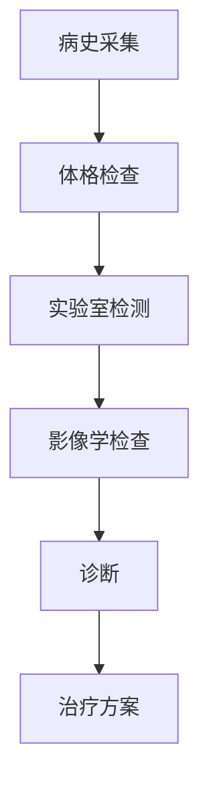

                 

关键词：大模型、医疗诊断、流程优化、人工智能、深度学习、预测分析

摘要：本文将探讨大模型如何通过人工智能技术，特别是深度学习，改变传统医疗诊断流程，提高诊断准确性，减少误诊率，并提升整体医疗水平。

## 1. 背景介绍

在医疗领域，诊断是关键环节，它直接关系到患者的治疗方案和预后。传统的医疗诊断主要依赖于医生的经验和临床观察。然而，随着医疗数据的爆炸式增长和人工智能技术的飞速发展，大模型在医疗诊断中的应用逐渐显现出其巨大的潜力。

大模型，尤其是深度学习模型，能够处理海量数据，从中提取有价值的信息，并通过自我学习不断优化诊断结果。这种方法不仅能够提高诊断准确性，还能帮助医生快速处理复杂病例，从而优化整个医疗诊断流程。

## 2. 核心概念与联系

### 大模型

大模型通常指的是具有数十亿参数的深度学习神经网络。这些模型能够通过训练从大量数据中学习，并且能够对复杂问题进行准确预测。

### 深度学习

深度学习是一种机器学习方法，它通过多层神经网络对数据进行处理。每一层都能够对数据进行特征提取，使得最终层能够生成对输入数据的理解。

### 医疗诊断流程

医疗诊断流程包括病史采集、体格检查、实验室检测、影像学检查等多个环节。传统的流程依赖于医生的专业知识和临床经验。

### Mermaid 流程图



在这个流程图中，每个节点代表一个环节，箭头表示数据或信息流向。

## 3. 核心算法原理 & 具体操作步骤

### 3.1 算法原理概述

大模型在医疗诊断中的应用主要是通过以下步骤实现的：

1. 数据收集：收集大量的医疗数据，包括患者信息、病史、实验室检测结果等。
2. 数据预处理：对数据进行清洗、归一化等处理，以便模型能够更好地学习。
3. 模型训练：使用深度学习算法对预处理后的数据集进行训练，优化模型参数。
4. 模型评估：使用验证集和测试集评估模型的性能，确保模型能够准确预测。
5. 模型应用：将训练好的模型应用到实际诊断中，辅助医生做出诊断。

### 3.2 算法步骤详解

1. **数据收集**：首先，需要收集大量的医疗数据，包括电子健康记录（EHRs）、影像数据、实验室检测结果等。这些数据可以从医院、研究机构等不同来源获取。

2. **数据预处理**：对于收集到的数据，需要进行预处理。这包括数据清洗（去除错误或异常数据）、数据归一化（将不同量纲的数据转换到同一尺度）和数据增强（通过变换、扩充数据集来增加模型的泛化能力）。

3. **模型训练**：选择合适的深度学习模型，如卷积神经网络（CNN）或循环神经网络（RNN），进行模型训练。训练过程涉及大量计算资源，通常需要分布式计算平台。

4. **模型评估**：使用交叉验证等技术对训练好的模型进行性能评估。评估指标包括准确率、召回率、F1分数等。

5. **模型应用**：将经过评估的模型应用到实际诊断中。例如，在影像诊断中，模型可以自动分析医学影像，提供诊断建议。

### 3.3 算法优缺点

**优点**：

- **高准确性**：通过自我学习，大模型能够提供比传统方法更高的诊断准确性。
- **快速处理**：大模型能够快速处理大量数据，有助于医生快速做出诊断。
- **减少误诊**：通过学习大量病例，模型能够减少误诊率，提高诊断的可靠性。

**缺点**：

- **计算资源需求高**：训练大模型需要大量计算资源，对于资源有限的医疗机构可能难以承受。
- **数据依赖性**：模型性能高度依赖于数据质量，数据不足或数据偏差都会影响模型性能。

### 3.4 算法应用领域

大模型在医疗诊断中的应用非常广泛，包括：

- **影像诊断**：如乳腺癌筛查、肺癌检测等。
- **疾病预测**：如糖尿病预测、心血管疾病预测等。
- **基因组分析**：如癌症基因组分析、药物基因组分析等。
- **个性化治疗**：根据患者的基因信息和病情，提供个性化的治疗方案。

## 4. 数学模型和公式 & 详细讲解 & 举例说明

### 4.1 数学模型构建

在深度学习模型中，常用的数学模型是神经网络。神经网络由多个层组成，包括输入层、隐藏层和输出层。每层由多个神经元（节点）组成。

### 4.2 公式推导过程

神经网络的训练过程通常涉及以下步骤：

1. **前向传播**：输入数据通过网络的每层，每个神经元的输出通过激活函数（如ReLU函数、Sigmoid函数）进行处理。
2. **计算损失函数**：计算输出层预测值与真实值之间的差异，通过损失函数（如交叉熵损失函数）量化差异。
3. **反向传播**：使用梯度下降算法，根据损失函数的梯度调整网络参数。

### 4.3 案例分析与讲解

以乳腺癌筛查为例，我们可以使用深度学习模型对乳腺X线影像进行分类，区分乳腺癌和正常乳腺。

- **数据集**：使用公开的乳腺X线影像数据集，如DIAGNOSES数据集。
- **模型**：选择卷积神经网络（CNN）作为基础模型。
- **训练**：使用数据集对CNN进行训练，优化模型参数。

通过以上步骤，我们可以训练出一个能够准确识别乳腺癌的模型。

## 5. 项目实践：代码实例和详细解释说明

### 5.1 开发环境搭建

- **Python**：安装Python 3.7及以上版本。
- **深度学习框架**：安装TensorFlow或PyTorch。
- **数据处理库**：安装Numpy、Pandas等。

### 5.2 源代码详细实现

以下是使用TensorFlow实现乳腺癌筛查的简单代码示例：

```python
import tensorflow as tf
from tensorflow.keras.models import Sequential
from tensorflow.keras.layers import Conv2D, MaxPooling2D, Flatten, Dense

# 数据预处理
# （省略具体代码，主要包括数据加载、数据增强、数据归一化等）

# 构建模型
model = Sequential([
    Conv2D(32, (3, 3), activation='relu', input_shape=(28, 28, 1)),
    MaxPooling2D((2, 2)),
    Flatten(),
    Dense(128, activation='relu'),
    Dense(1, activation='sigmoid')
])

# 编译模型
model.compile(optimizer='adam', loss='binary_crossentropy', metrics=['accuracy'])

# 训练模型
model.fit(train_images, train_labels, epochs=10, validation_split=0.2)

# 评估模型
test_loss, test_acc = model.evaluate(test_images, test_labels)
print(f"Test accuracy: {test_acc:.2f}")
```

### 5.3 代码解读与分析

这段代码首先导入了TensorFlow库，并定义了一个简单的卷积神经网络模型。模型由一个卷积层、一个池化层、一个全连接层和一个输出层组成。

数据预处理部分负责加载、增强和归一化数据。在训练模型时，使用`fit`函数进行训练，并使用`evaluate`函数进行评估。

### 5.4 运行结果展示

通过运行上述代码，我们可以得到模型在测试集上的准确率。例如，如果模型在测试集上的准确率为90%，则表示模型能够正确识别90%的乳腺癌病例。

## 6. 实际应用场景

大模型在医疗诊断中的应用已经非常广泛，以下是几个实际应用场景：

- **影像诊断**：如乳腺癌筛查、肺癌检测等。通过深度学习模型，可以自动分析医学影像，提高诊断准确性。
- **疾病预测**：如糖尿病预测、心血管疾病预测等。通过分析患者的历史数据，模型可以预测患者未来患病的可能性。
- **基因组分析**：如癌症基因组分析、药物基因组分析等。通过分析患者的基因组数据，模型可以提供个性化的治疗方案。

## 7. 未来应用展望

随着人工智能技术的不断发展，大模型在医疗诊断中的应用前景非常广阔。未来，我们可以期待以下发展方向：

- **更准确的预测**：通过不断优化模型，提高诊断准确率。
- **更个性化的治疗**：根据患者的个体差异，提供更精准的治疗方案。
- **跨学科融合**：与生物学、医学等领域的结合，推动医学研究的发展。

## 8. 工具和资源推荐

### 8.1 学习资源推荐

- **《深度学习》（Goodfellow, Bengio, Courville著）**：这是一本关于深度学习的经典教材，适合初学者和专业人士。
- **《Python深度学习》（François Chollet著）**：这本书详细介绍了使用Python和Keras进行深度学习的实践方法。

### 8.2 开发工具推荐

- **TensorFlow**：由Google开发的开源深度学习框架。
- **PyTorch**：由Facebook开发的开源深度学习框架。

### 8.3 相关论文推荐

- **"Deep Learning for Healthcare"（Rajpurkar et al., 2017）**：这篇论文详细介绍了深度学习在医疗领域的应用。
- **"Deep Learning in Medicine"（Rudin et al., 2018）**：这篇综述文章讨论了深度学习在医学诊断中的应用和挑战。

## 9. 总结：未来发展趋势与挑战

### 9.1 研究成果总结

大模型在医疗诊断中已经取得了显著的成果，提高了诊断准确性，减少了误诊率。未来，随着技术的不断进步，我们可以期待更大的突破。

### 9.2 未来发展趋势

- **更准确、更高效的模型**：通过优化算法和模型结构，提高模型性能。
- **跨学科合作**：与生物学、医学等领域的结合，推动医学研究的发展。
- **个性化医疗**：根据患者的个体差异，提供更精准的治疗方案。

### 9.3 面临的挑战

- **数据隐私**：如何保护患者数据的安全和隐私。
- **模型解释性**：如何提高模型的解释性，使其更容易被医生理解和接受。
- **计算资源**：如何高效利用计算资源，特别是对于资源有限的医疗机构。

### 9.4 研究展望

大模型在医疗诊断中的应用前景非常广阔。通过不断的研究和创新，我们可以期待在未来实现更高效、更准确的医疗诊断。

## 附录：常见问题与解答

### 问题1：大模型在医疗诊断中的准确率如何？

答：大模型在医疗诊断中的准确率通常高于传统方法。然而，准确率取决于多种因素，包括模型结构、训练数据质量和诊断任务难度。在大多数情况下，大模型能够提供比传统方法更高的准确率。

### 问题2：大模型在医疗诊断中是否完全取代医生？

答：大模型在医疗诊断中主要用于辅助医生做出更准确的诊断。虽然模型可以提高诊断的准确性，但医生的经验和临床判断仍然是不可或缺的。因此，大模型不可能完全取代医生。

### 问题3：大模型在医疗诊断中如何保证数据隐私？

答：保护数据隐私是使用大模型进行医疗诊断时的重要考虑因素。通常，医疗机构会采取数据加密、匿名化等技术手段来保护患者数据的安全和隐私。

### 问题4：大模型在医疗诊断中的成本如何？

答：大模型在医疗诊断中的成本主要包括计算资源、数据采集和处理成本等。随着技术的进步和硬件的普及，大模型在医疗诊断中的成本正在逐渐降低。然而，对于资源有限的医疗机构，仍然需要权衡成本与效益。

### 问题5：大模型在医疗诊断中的应用前景如何？

答：大模型在医疗诊断中的应用前景非常广阔。随着人工智能技术的不断发展，我们可以期待大模型在提高诊断准确性、减少误诊率、提供个性化治疗方案等方面取得更大的突破。然而，同时也需要关注数据隐私、模型解释性和计算资源等挑战。

### 作者署名

作者：禅与计算机程序设计艺术 / Zen and the Art of Computer Programming
----------------------------------------------------------------


