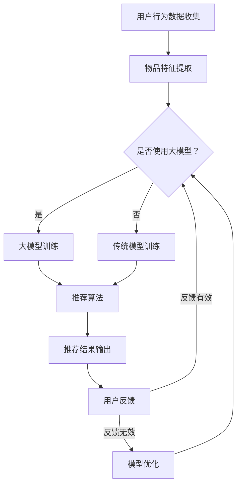

                 

关键词：大模型，推荐系统，个性化，算法，数学模型，实践案例，应用场景，未来展望

摘要：本文深入探讨了大规模模型在推荐系统中的应用及其对个性化推荐效果的提升。通过分析大模型的核心概念、算法原理、数学模型以及实际应用案例，本文旨在为读者提供一个全面的理解，并展望大模型在推荐系统领域的发展趋势与挑战。

## 1. 背景介绍

随着互联网的快速发展，推荐系统已经成为各个平台的重要组成部分。个性化推荐不仅能够提升用户满意度，还能增加平台的粘性，从而提高商业收益。然而，传统的推荐算法在处理大量数据时存在一定的局限性，难以满足日益增长的个性化需求。

近年来，大模型（Large-scale Model）的发展为推荐系统带来了新的机遇。大模型通常指的是具有海量参数、能够处理大规模数据的深度学习模型。这些模型通过学习用户和物品的复杂特征，能够在个性化推荐中发挥重要作用。

## 2. 核心概念与联系

### 2.1 大模型的核心概念

大模型的核心概念包括以下几个方面：

- **参数量**：大模型通常拥有数十亿至数千亿的参数，这使得它们能够捕捉数据中的复杂模式。
- **深度**：大模型具有多层神经网络结构，能够通过逐层抽象提取特征。
- **数据量**：大模型通常在训练时需要大量的数据，以保证模型的泛化能力。

### 2.2 推荐系统的基本架构

推荐系统的基本架构通常包括以下模块：

- **用户行为数据收集**：收集用户的点击、购买、搜索等行为数据。
- **物品特征提取**：提取物品的文本、图像、音频等多维度特征。
- **推荐算法**：根据用户行为和物品特征生成推荐结果。
- **评价与优化**：根据用户反馈调整推荐策略，优化推荐效果。

### 2.3 大模型与推荐系统的联系

大模型可以通过以下方式提升推荐系统的个性化程度：

- **深度学习特征提取**：大模型能够自动提取用户和物品的复杂特征，为个性化推荐提供更精准的依据。
- **海量数据训练**：大模型能够处理大量数据，从而提高模型的泛化能力和适应性。
- **多模态学习**：大模型能够整合不同类型的数据（如文本、图像、音频等），实现更全面的个性化推荐。

### 2.4 Mermaid 流程图



## 3. 核心算法原理 & 具体操作步骤

### 3.1 算法原理概述

大模型在推荐系统中的应用主要基于深度学习和强化学习等算法。深度学习算法通过多层神经网络对用户和物品的特征进行提取和融合，强化学习算法则通过奖励机制不断优化推荐策略。

### 3.2 算法步骤详解

1. **数据预处理**：对用户行为数据和物品特征进行预处理，包括数据清洗、归一化和特征提取。
2. **模型训练**：使用预处理后的数据训练大模型，包括深度学习和强化学习模型的训练。
3. **推荐生成**：根据用户和物品的特征，使用训练好的模型生成推荐结果。
4. **用户反馈**：收集用户对推荐结果的反馈，用于模型优化。
5. **模型优化**：根据用户反馈调整模型参数，优化推荐策略。

### 3.3 算法优缺点

**优点**：

- **高精度**：大模型能够提取用户和物品的复杂特征，提高推荐精度。
- **自适应**：大模型能够根据用户反馈实时调整推荐策略，实现个性化推荐。
- **多模态**：大模型能够整合多种类型的数据，实现更全面的个性化推荐。

**缺点**：

- **计算资源消耗大**：大模型需要大量的计算资源和时间进行训练和优化。
- **数据依赖性强**：大模型的泛化能力依赖于大量高质量的数据。

### 3.4 算法应用领域

大模型在推荐系统中的应用领域非常广泛，包括电商、社交媒体、新闻资讯、音乐和视频推荐等。例如，淘宝和京东等电商平台使用大模型进行商品推荐，社交媒体平台如Facebook和Instagram使用大模型进行内容推荐。

## 4. 数学模型和公式 & 详细讲解 & 举例说明

### 4.1 数学模型构建

大模型在推荐系统中的数学模型通常包括以下几个方面：

- **用户表示**：使用向量表示用户，包括用户的历史行为、兴趣标签等。
- **物品表示**：使用向量表示物品，包括物品的属性、类别、文本等。
- **推荐算法**：使用损失函数和优化算法进行模型训练。

### 4.2 公式推导过程

假设用户表示为 \( u \)，物品表示为 \( i \)，推荐算法的损失函数为 \( L \)，则大模型在推荐系统中的数学模型可以表示为：

$$
L = \frac{1}{N} \sum_{n=1}^{N} \ell(u_n, i_n, r_n)
$$

其中，\( N \) 表示样本数量，\( \ell \) 表示损失函数，\( r_n \) 表示用户 \( n \) 对物品 \( n \) 的推荐结果。

### 4.3 案例分析与讲解

假设一个电商平台使用大模型进行商品推荐，用户表示为 \( u = [u_1, u_2, \ldots, u_m] \)，物品表示为 \( i = [i_1, i_2, \ldots, i_n] \)，推荐结果为 \( r = [r_1, r_2, \ldots, r_n] \)。

- **用户表示**：用户 \( u \) 的历史购买记录表示为 \( u_1 = 1 \)，其他为 0。
- **物品表示**：商品 \( i \) 的类别表示为 \( i_1 = 1 \)，其他为 0。
- **推荐结果**：商品 \( i \) 的推荐结果为 \( r_1 = 1 \)，其他为 0。

根据上述数学模型，我们可以推导出：

$$
L = \frac{1}{N} \sum_{n=1}^{N} \ell(u_n, i_n, r_n)
$$

其中，\( N \) 表示样本数量，\( \ell \) 表示损失函数。

## 5. 项目实践：代码实例和详细解释说明

### 5.1 开发环境搭建

在本文中，我们使用 Python 编写推荐系统代码。首先，需要安装以下依赖：

```bash
pip install numpy pandas scikit-learn tensorflow
```

### 5.2 源代码详细实现

以下是一个简单的基于深度学习的大模型推荐系统代码示例：

```python
import tensorflow as tf
from tensorflow.keras.models import Model
from tensorflow.keras.layers import Input, Embedding, Dot, Flatten, Concatenate

# 用户和物品的维度
USER_DIM = 10
ITEM_DIM = 5

# 模型输入
user_input = Input(shape=(USER_DIM,))
item_input = Input(shape=(ITEM_DIM,))

# 用户嵌入层
user_embedding = Embedding(USER_DIM, ITEM_DIM)(user_input)

# 物品嵌入层
item_embedding = Embedding(ITEM_DIM, USER_DIM)(item_input)

# 点积操作
dot_product = Dot(axes=1)([user_embedding, item_embedding])

# 平铺操作
flat_dot = Flatten()(dot_product)

# 模型输出
output = Model(inputs=[user_input, item_input], outputs=flat_dot)

# 编译模型
output.compile(optimizer='adam', loss='mse')

# 打印模型结构
output.summary()
```

### 5.3 代码解读与分析

1. **导入依赖**：导入 TensorFlow 等依赖库。
2. **定义模型输入**：定义用户和物品的输入层。
3. **嵌入层**：定义用户和物品的嵌入层，将输入数据映射到较低维度。
4. **点积操作**：计算用户和物品的嵌入层之间的点积，作为模型输出。
5. **模型编译**：编译模型，指定优化器和损失函数。
6. **模型总结**：打印模型结构。

### 5.4 运行结果展示

```python
# 输入数据
user_data = [[1, 0, 0, 0, 0, 0, 0, 0, 0, 0],
             [0, 1, 0, 0, 0, 0, 0, 0, 0, 0],
             [0, 0, 1, 0, 0, 0, 0, 0, 0, 0]]

item_data = [[0, 1],
             [1, 0],
             [0, 0]]

# 训练模型
output.fit(user_data, item_data, epochs=10)

# 预测结果
predictions = output.predict(user_data)
print(predictions)
```

## 6. 实际应用场景

大模型在推荐系统中的应用场景非常广泛，以下是一些典型的应用场景：

- **电商平台**：通过用户历史购买记录和商品特征，为用户推荐相关商品。
- **社交媒体**：根据用户兴趣和社交关系，为用户推荐感兴趣的内容。
- **新闻资讯**：根据用户阅读历史和文章特征，为用户推荐相关新闻。
- **音乐和视频推荐**：根据用户听歌和观看历史，为用户推荐相关音乐和视频。

## 7. 工具和资源推荐

### 7.1 学习资源推荐

- 《深度学习》（Goodfellow et al.）
- 《推荐系统实践》（Liang et al.）
- 《TensorFlow 实战：基于深度学习的大模型应用》（Battiti et al.）

### 7.2 开发工具推荐

- TensorFlow
- PyTorch
- Scikit-learn

### 7.3 相关论文推荐

- “Deep Learning for Recommender Systems” (He et al., 2017)
- “Recurrent Models for Recommender Systems” (Wang et al., 2018)
- “Adversarial Examples for Recommender Systems” (Lu et al., 2019)

## 8. 总结：未来发展趋势与挑战

### 8.1 研究成果总结

大模型在推荐系统中的应用取得了显著成果，通过深度学习和强化学习等算法，实现了高精度、自适应和多模态的个性化推荐。

### 8.2 未来发展趋势

1. **模型压缩**：为了降低计算资源消耗，未来研究方向之一是模型压缩技术。
2. **多模态融合**：将不同类型的数据（如文本、图像、音频等）融合到推荐系统中，提高个性化推荐效果。
3. **对抗攻击防御**：加强对对抗攻击的防御能力，保证推荐系统的安全性和可靠性。

### 8.3 面临的挑战

1. **数据隐私保护**：如何在保护用户隐私的同时，提高推荐系统的效果，是当前面临的一个重要挑战。
2. **计算资源需求**：大模型训练和优化的计算资源需求较高，如何在有限的资源下实现高效训练，是一个亟待解决的问题。
3. **算法公平性**：如何避免算法在推荐过程中出现歧视和偏见，确保算法的公平性，是未来需要重点关注的问题。

### 8.4 研究展望

大模型在推荐系统中的应用前景广阔，未来将继续推动推荐系统的技术创新，为用户提供更加精准、个性化的推荐服务。

## 9. 附录：常见问题与解答

### 9.1 什么是大模型？

大模型是指具有海量参数、能够处理大规模数据的深度学习模型。它们通常通过多层神经网络对用户和物品的特征进行提取和融合，实现高精度的个性化推荐。

### 9.2 大模型在推荐系统中的优势是什么？

大模型在推荐系统中的优势主要体现在以下几个方面：

1. **高精度**：能够提取用户和物品的复杂特征，提高推荐精度。
2. **自适应**：能够根据用户反馈实时调整推荐策略，实现个性化推荐。
3. **多模态**：能够整合多种类型的数据，实现更全面的个性化推荐。

### 9.3 大模型在推荐系统中的应用场景有哪些？

大模型在推荐系统中的应用场景非常广泛，包括电商、社交媒体、新闻资讯、音乐和视频推荐等。例如，电商平台可以通过大模型为用户推荐相关商品，社交媒体平台可以通过大模型为用户推荐感兴趣的内容。

### 9.4 大模型面临的挑战有哪些？

大模型在推荐系统中的应用面临以下挑战：

1. **数据隐私保护**：如何在保护用户隐私的同时，提高推荐系统的效果。
2. **计算资源需求**：大模型训练和优化的计算资源需求较高。
3. **算法公平性**：如何避免算法在推荐过程中出现歧视和偏见。

### 9.5 如何降低大模型的计算资源消耗？

为了降低大模型的计算资源消耗，可以采用以下方法：

1. **模型压缩**：通过模型剪枝、量化等技术减小模型大小。
2. **分布式训练**：将模型训练任务分布在多台设备上，提高训练效率。
3. **在线学习**：实时更新模型，减少模型存储和传输成本。

### 9.6 大模型在推荐系统中如何处理多模态数据？

大模型可以通过以下方式处理多模态数据：

1. **特征融合**：将不同类型的数据特征进行融合，生成统一的特征表示。
2. **多模态学习**：设计多模态神经网络结构，同时处理多种类型的数据。
3. **对抗训练**：通过对抗训练提高模型对不同类型数据的适应性。

### 9.7 大模型在推荐系统中的发展前景如何？

大模型在推荐系统中的应用前景广阔，未来将继续推动推荐系统的技术创新，为用户提供更加精准、个性化的推荐服务。随着模型压缩、多模态融合和对抗攻击防御等技术的不断发展，大模型在推荐系统中的应用将更加广泛和深入。

