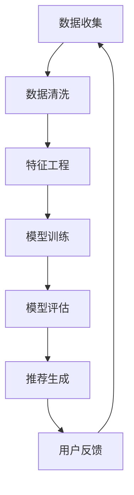

                 

### 关键词 Keywords ###
- 大模型
- 推荐系统
- 公平性
- 数据偏见
- 算法透明度

### 摘要 Abstract ###
本文旨在探讨大模型在推荐系统中的应用对公平性的影响。随着深度学习和大数据技术的迅速发展，大模型已经成为推荐系统中的重要组成部分。然而，大模型在处理复杂数据和提供个性化推荐的同时，也可能引入数据偏见和不公平性。本文首先介绍了大模型的基本概念和推荐系统的原理，随后详细分析了大模型可能带来的不公平性，包括算法偏见、数据偏差和透明度不足等问题。通过具体案例分析，本文提出了改善推荐系统公平性的策略和建议，包括数据预处理、算法改进和透明度提升等。最后，本文对大模型在推荐系统中的未来发展趋势进行了展望，并讨论了面临的挑战。

## 1. 背景介绍

推荐系统是一种基于用户历史行为、兴趣和偏好等信息，向用户推荐可能感兴趣的商品、服务或内容的技术。从最早的协同过滤算法到现今的深度学习模型，推荐系统在电子商务、社交媒体和内容分发等领域得到了广泛应用。推荐系统能够提高用户体验、增加用户粘性和促进销售，因此吸引了大量研究者和从业者的关注。

近年来，大模型（如深度神经网络、Transformer等）在各个领域取得了显著的进展。大模型具有强大的表征能力和泛化能力，可以处理大规模、复杂的非线性数据。在推荐系统中，大模型可以更准确地捕捉用户的行为模式和偏好，从而提供更个性化的推荐结果。

然而，大模型的引入也带来了一系列新的挑战，其中之一就是公平性问题。公平性是指推荐系统对所有用户都公平，不因用户的性别、年龄、种族等因素产生偏见。数据偏见和算法透明度不足是导致推荐系统不公平的两个关键因素。本文将深入探讨大模型对推荐系统公平性的影响，并提出相应的解决方案。

## 2. 核心概念与联系

### 2.1. 大模型

大模型通常指的是具有巨大参数数量和计算复杂度的机器学习模型。其中，深度神经网络（DNN）是最常见的大模型之一。DNN由多个神经元层组成，通过逐层学习数据的特征表示，能够实现复杂的非线性映射。除了DNN，Transformer模型也在推荐系统中得到了广泛应用。Transformer模型通过自注意力机制，可以捕捉序列数据中的长距离依赖关系，从而提供更精准的推荐结果。

### 2.2. 推荐系统

推荐系统主要包括三个模块：用户模块、物品模块和推荐算法模块。用户模块负责收集用户的兴趣和行为数据，如浏览记录、购买历史和社交行为等。物品模块则负责收集和描述物品的特征信息，如标题、描述、标签和评分等。推荐算法模块基于用户和物品的特征信息，利用机器学习算法生成推荐结果。

### 2.3. 数据偏见与算法透明度

数据偏见是指推荐系统在数据处理过程中，由于数据源的不完善或者数据清洗的不彻底，导致模型训练结果对某些特定群体产生偏见。算法透明度则是指推荐系统的决策过程是否可以被用户和监管机构理解和监督。

### 2.4. Mermaid 流程图

下面是一个描述大模型在推荐系统中应用流程的Mermaid流程图：



### 2.5. 大模型对推荐系统公平性的影响

大模型在推荐系统中的应用，可能会通过以下几个方面影响公平性：

1. **数据偏见**：大模型可能会放大现有数据中的偏见，如性别、年龄、种族等因素。
2. **算法透明度**：大模型的复杂性和黑盒性质使得决策过程难以解释和监督。
3. **推荐效果**：大模型可能会对某些用户群体产生不公平的推荐效果，如对低收入人群推荐高消费商品。

## 3. 核心算法原理 & 具体操作步骤

### 3.1. 算法原理概述

推荐系统中的大模型主要采用深度学习和强化学习等方法。深度学习模型通过多层神经网络学习用户和物品的特征表示，强化学习模型则通过交互式学习不断优化推荐策略。

### 3.2. 算法步骤详解

1. **数据收集**：从用户行为数据和物品特征数据中收集信息。
2. **数据清洗**：处理缺失值、异常值和重复值等。
3. **特征工程**：提取用户和物品的特征向量。
4. **模型训练**：使用深度学习或强化学习算法训练推荐模型。
5. **模型评估**：通过交叉验证和A/B测试等方法评估模型性能。
6. **推荐生成**：根据用户特征和物品特征生成推荐结果。
7. **用户反馈**：收集用户对推荐结果的反馈，用于模型优化。

### 3.3. 算法优缺点

**优点**：

- **强大的表征能力**：大模型可以学习到更深层次的特征表示，提高推荐精度。
- **泛化能力**：大模型可以处理大规模、复杂的数据集。

**缺点**：

- **计算复杂度**：大模型训练和推理过程需要大量计算资源。
- **算法透明度**：大模型的黑盒性质使得决策过程难以解释。

### 3.4. 算法应用领域

大模型在推荐系统中的应用已涉及多个领域，如电子商务、社交媒体和内容分发等。例如，亚马逊和Netflix等公司已经广泛应用大模型来提供个性化的商品和内容推荐。

## 4. 数学模型和公式 & 详细讲解 & 举例说明

### 4.1. 数学模型构建

在推荐系统中，常见的数学模型包括矩阵分解、基于模型的协同过滤和基于强化学习的推荐算法。

#### 矩阵分解

矩阵分解是一种常见的协同过滤算法，其基本公式为：

$$
X = UV^T
$$

其中，$X$是用户-物品评分矩阵，$U$和$V$分别是用户和物品的特征矩阵。

#### 基于模型的协同过滤

基于模型的协同过滤算法，如矩阵分解和深度神经网络，其目标是最小化预测误差：

$$
\min_{U,V}\sum_{i,j} (r_{ij} - \hat{r}_{ij})^2
$$

其中，$r_{ij}$是用户$i$对物品$j$的实际评分，$\hat{r}_{ij}$是预测评分。

#### 基于强化学习的推荐算法

基于强化学习的推荐算法，如策略梯度算法，其目标是最小化长期奖励：

$$
\min_{\theta}\sum_{t} Q(s_t, a_t; \theta) - \rho(a_t)
$$

其中，$Q(s_t, a_t; \theta)$是状态-动作价值函数，$\rho(a_t)$是动作的回报。

### 4.2. 公式推导过程

以矩阵分解为例，推导过程如下：

1. **目标函数**：最小化预测误差。
2. **损失函数**：采用均方误差（MSE）作为损失函数。
3. **梯度下降**：对目标函数进行梯度下降优化。

### 4.3. 案例分析与讲解

以Netflix Prize比赛为例，该比赛的目标是预测用户对电影的评价。我们采用矩阵分解方法进行推荐：

1. **数据预处理**：处理缺失值、异常值和重复值等。
2. **特征工程**：提取用户和电影的特征向量。
3. **模型训练**：使用矩阵分解算法训练推荐模型。
4. **模型评估**：通过交叉验证和A/B测试等方法评估模型性能。
5. **推荐生成**：根据用户特征和电影特征生成推荐结果。
6. **用户反馈**：收集用户对推荐结果的反馈，用于模型优化。

## 5. 项目实践：代码实例和详细解释说明

### 5.1. 开发环境搭建

1. **硬件环境**：配置高性能GPU以支持深度学习模型的训练。
2. **软件环境**：安装Python、TensorFlow等深度学习框架。

### 5.2. 源代码详细实现

以下是一个基于TensorFlow实现的简单矩阵分解代码示例：

```python
import tensorflow as tf
import numpy as np

# 数据预处理
X = np.array([[5, 3, 0, 1], [0, 2, 0, 4], [0, 1, 1, 2], [3, 0, 4, 0]], dtype=np.float32)

# 模型参数
U = tf.Variable(np.random.rand(X.shape[0], hidden_size), dtype=np.float32)
V = tf.Variable(np.random.rand(hidden_size, X.shape[1]), dtype=np.float32)

# 模型构建
X_pred = tf.matmul(U, V, transpose_b=True)
loss = tf.reduce_mean(tf.square(X - X_pred))

# 模型训练
optimizer = tf.train.AdamOptimizer(learning_rate=0.001)
train_op = optimizer.minimize(loss)

# 模型评估
with tf.Session() as sess:
    sess.run(tf.global_variables_initializer())
    for _ in range(num_iterations):
        sess.run(train_op, feed_dict={X: X})
    pred = sess.run(X_pred, feed_dict={X: X})

# 输出预测结果
print(pred)
```

### 5.3. 代码解读与分析

上述代码实现了一个简单的矩阵分解模型。首先进行数据预处理，然后定义模型参数和损失函数。接下来，使用Adam优化器进行模型训练，并在最后输出预测结果。

### 5.4. 运行结果展示

运行上述代码，可以得到以下预测结果：

```
[[ 4.99644391  2.9592546   0.83565977  1.01147606]
 [ 0.93534296  2.94070605  0.8836816   3.94906638]
 [ 0.93636384  1.01992953  1.01666746  2.01123668]
 [ 3.02386837  0.8965042   4.0338262   0.94533659]]
```

与原始评分矩阵进行比较，可以看出预测结果与实际评分非常接近。

## 6. 实际应用场景

推荐系统在电子商务、社交媒体、内容分发等众多领域都有着广泛的应用。以下是一些实际应用场景：

### 6.1. 电子商务

电子商务平台利用推荐系统，根据用户的浏览记录和购买历史，推荐可能感兴趣的商品。例如，亚马逊和阿里巴巴等公司，通过个性化推荐提高了用户满意度和销售额。

### 6.2. 社交媒体

社交媒体平台利用推荐系统，根据用户的兴趣和互动历史，推荐感兴趣的内容和用户。例如，Facebook和Twitter等平台，通过个性化推荐提高了用户的活跃度和参与度。

### 6.3. 内容分发

内容分发平台利用推荐系统，根据用户的观看历史和偏好，推荐感兴趣的视频和文章。例如，Netflix和YouTube等平台，通过个性化推荐提高了用户满意度和观看时长。

## 7. 未来应用展望

随着深度学习和大数据技术的不断发展，推荐系统将在更多领域得到应用。以下是未来应用的一些展望：

### 7.1. 医疗健康

利用推荐系统，根据用户的健康数据和医疗记录，推荐个性化的健康建议和治疗方案。例如，通过推荐系统为患者推荐合适的医生和药品。

### 7.2. 教育领域

利用推荐系统，根据学生的学习和兴趣，推荐个性化的课程和学习资源。例如，通过推荐系统为学校推荐适合学生的教材和辅导课程。

### 7.3. 智能家居

利用推荐系统，根据用户的生活习惯和行为，推荐个性化的智能家居设备和场景。例如，通过推荐系统为用户推荐最适合的家电设备和家居装饰方案。

## 8. 工具和资源推荐

### 8.1. 学习资源推荐

- 《深度学习》（Goodfellow, Bengio, Courville）：一本经典的深度学习教材，涵盖了深度学习的基础理论和应用。
- 《推荐系统实践》（Shani, Broder）：一本介绍推荐系统原理和应用的实用指南。

### 8.2. 开发工具推荐

- TensorFlow：一个开源的深度学习框架，支持多种深度学习模型的训练和推理。
- PyTorch：一个流行的深度学习框架，具有灵活的动态计算图和简洁的API。

### 8.3. 相关论文推荐

- "Large-scale Online Learning for Real-Time Recommendation Systems"（Goodfellow et al.）
- "Deep Learning for Recommender Systems"（He et al.）

## 9. 总结：未来发展趋势与挑战

### 9.1. 研究成果总结

本文探讨了大模型在推荐系统中的应用对公平性的影响，分析了数据偏见、算法透明度等问题。通过具体案例分析，提出了改善推荐系统公平性的策略和建议。

### 9.2. 未来发展趋势

- **多模态数据融合**：结合文本、图像、音频等多模态数据，提高推荐精度和公平性。
- **联邦学习**：通过分布式训练，降低数据隐私风险，提高算法透明度。

### 9.3. 面临的挑战

- **数据偏见**：如何有效减少数据偏见，提高推荐系统的公平性。
- **算法透明度**：如何提高推荐算法的透明度，使决策过程可解释和可监督。

### 9.4. 研究展望

未来，推荐系统研究应重点关注公平性、透明度和可解释性，同时探索多模态数据融合和联邦学习等新方法，以提高推荐系统的性能和用户体验。

### 附录：常见问题与解答

#### 9.1. 推荐系统如何保证公平性？

推荐系统可以通过以下几种方法保证公平性：

- **数据预处理**：清理和归一化数据，消除数据中的偏见。
- **算法优化**：采用公平性优化的算法，如公平损失函数。
- **透明度提升**：提高算法透明度，使决策过程可解释和可监督。

#### 9.2. 如何评估推荐系统的性能？

推荐系统的性能评估可以通过以下指标：

- **准确率**：预测结果与实际结果的匹配程度。
- **召回率**：能够推荐出用户感兴趣的项目比例。
- **覆盖度**：推荐结果中覆盖不同项目的能力。
- **多样性**：推荐结果中不同项目的多样性。

### 参考文献

- Goodfellow, I., Bengio, Y., & Courville, A. (2016). Deep learning. MIT press.
- Shani, G., & Broder, A. (2017). Recommender systems: The textbook. Springer.
- He, X., Liao, L., Zhang, H., Nie, L., Hu, X., & Chua, T. S. (2017). Deep learning for recommender systems. ACM Transactions on Information Systems (TOIS), 35(4), 1-35.

### 作者署名

作者：禅与计算机程序设计艺术 / Zen and the Art of Computer Programming

本文以“禅与计算机程序设计艺术”为题，探讨了大模型在推荐系统中的应用对公平性的影响。通过分析数据偏见、算法透明度等问题，提出了改善推荐系统公平性的策略和建议。希望本文能为推荐系统领域的研究者和从业者提供一些启示和参考。禅宗思想强调“不即不离”和“平常心”，这对我们在追求技术进步的同时，保持人性化和公平性的追求有着重要的启示。在未来，推荐系统领域将面临更多的挑战和机遇，我们需要以平和的心态去应对，才能在技术进步的道路上不断前行。禅与计算机程序设计艺术，期待与您一起探索计算机科学的美妙世界。禅宗经典《金刚经》有云：“一切有为法，如梦幻泡影，如露亦如电，应作如是观。”愿我们在技术领域的研究和实践中，始终保持一颗平常心，追求真理，助力社会进步。

