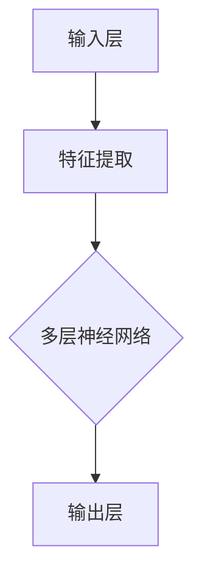
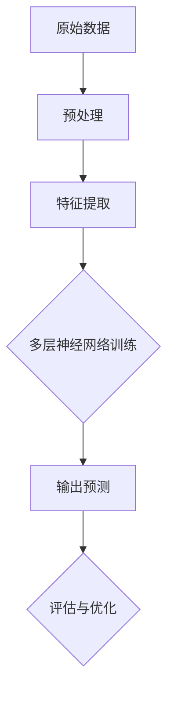
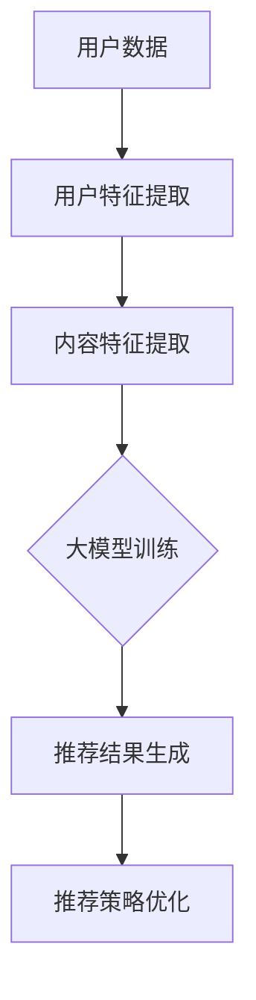

                 

关键词：大模型，推荐系统，商业模式，技术创新，产业应用，商业价值。

> 摘要：本文旨在探讨大模型对推荐系统商业模式的革新，通过分析大模型技术的核心概念、算法原理、数学模型及其在实际应用中的表现，揭示大模型为推荐系统带来的深刻变革和无限可能。

## 1. 背景介绍

在互联网时代，推荐系统已成为各大平台吸引用户、提高用户粘性的重要手段。传统的推荐系统主要依赖基于内容的过滤（Content-based Filtering）和协同过滤（Collaborative Filtering）等方法。然而，这些方法在面对海量数据和高维度信息时，逐渐暴露出性能瓶颈和效果局限性。随着人工智能技术的快速发展，尤其是大模型（Large-scale Models）的崛起，推荐系统迎来了前所未有的创新机遇。

大模型，通常指的是拥有千亿级参数、可以处理海量数据的深度神经网络模型。如BERT、GPT等大模型，凭借其强大的表示能力和自主学习能力，已经在自然语言处理、图像识别等领域取得了显著成果。将这些先进技术应用于推荐系统，将带来以下几方面的革新：

1. **数据处理能力的提升**：大模型能够高效处理高维度和稀疏数据，从而提高推荐系统的效果。
2. **用户兴趣理解的深入**：通过深度学习，大模型能够捕捉到用户兴趣的复杂性和多样性，提供更加精准的推荐。
3. **商业模式的创新**：大模型的应用不仅提升了推荐系统的技术能力，也为商业模式带来了新的可能性，如个性化广告、智能客服等。

## 2. 核心概念与联系

### 大模型技术架构

在介绍大模型技术之前，我们首先需要了解其基本架构。大模型通常包含以下几个关键组成部分：

- **输入层（Input Layer）**：接收用户特征、内容特征等原始数据。
- **隐藏层（Hidden Layers）**：包含多层神经网络，进行复杂的非线性变换。
- **输出层（Output Layer）**：根据训练目标输出预测结果。

下面是一个使用Mermaid绘制的简化的技术架构流程图：



### 核心概念原理

大模型的核心在于其深度学习的机制。通过大量的数据训练，大模型能够自动学习并提取数据中的复杂模式。具体来说，大模型包含以下几个核心概念：

- **自动特征提取**：大模型可以自动学习数据的底层特征，减少人工特征工程的工作量。
- **端到端学习**：大模型能够直接从原始数据中学习到有用的信息，实现端到端的模型训练。
- **泛化能力**：通过海量数据训练，大模型具有良好的泛化能力，能够在不同的数据集和应用场景中表现出色。

下面是使用Mermaid绘制的一个大模型的工作流程：



### 架构的具体实现

在实际应用中，大模型的架构需要结合推荐系统的具体需求进行定制。以下是一个简化的推荐系统大模型实现架构：



## 3. 核心算法原理 & 具体操作步骤

### 3.1 算法原理概述

大模型在推荐系统中的核心算法原理主要基于深度学习和自然语言处理技术。通过以下步骤实现推荐：

1. **数据预处理**：对用户行为数据和内容特征进行清洗、转换和编码。
2. **特征提取**：利用神经网络自动提取数据中的高阶特征。
3. **模型训练**：通过大量数据进行模型训练，优化模型参数。
4. **推荐生成**：根据用户特征和内容特征，生成个性化推荐结果。
5. **策略优化**：通过在线学习和实时调整，优化推荐效果。

### 3.2 算法步骤详解

1. **数据预处理**

   数据预处理是推荐系统的基础步骤。具体包括：

   - **数据清洗**：去除噪声数据、填充缺失值。
   - **特征转换**：将不同类型的数据进行统一编码，如将用户行为转换为用户兴趣向量。
   - **数据归一化**：对数据进行归一化处理，以消除不同特征之间的尺度差异。

2. **特征提取**

   大模型能够自动提取数据中的高阶特征，其核心在于多层神经网络的结构。具体步骤包括：

   - **输入层**：接收预处理后的用户特征和内容特征。
   - **隐藏层**：通过多层神经网络进行复杂的非线性变换，提取高阶特征。
   - **输出层**：根据训练目标生成推荐结果。

3. **模型训练**

   大模型的训练过程主要基于梯度下降法，通过大量数据进行迭代优化。具体步骤包括：

   - **初始化模型参数**：随机初始化模型参数。
   - **计算损失函数**：根据预测结果和真实标签计算损失函数。
   - **反向传播**：计算梯度并更新模型参数。
   - **迭代优化**：重复计算损失函数和更新参数，直到模型收敛。

4. **推荐生成**

   推荐生成过程基于训练好的大模型，根据用户特征和内容特征生成个性化推荐结果。具体步骤包括：

   - **输入特征**：将用户特征和内容特征输入到大模型中。
   - **模型输出**：得到推荐结果。
   - **结果处理**：对推荐结果进行排序、去重等处理。

5. **策略优化**

   推荐系统的效果需要通过不断优化策略来提升。具体步骤包括：

   - **在线学习**：实时收集用户反馈，更新模型参数。
   - **策略调整**：根据用户反馈调整推荐策略，如调整推荐权重、调整推荐策略等。

### 3.3 算法优缺点

大模型在推荐系统中具有以下优点：

- **高效的数据处理能力**：能够处理高维度和稀疏数据，提高推荐效果。
- **自动的特征提取**：减少人工特征工程的工作量，提高模型训练效率。
- **良好的泛化能力**：能够适应不同的数据集和应用场景。

但同时也存在以下缺点：

- **计算资源消耗大**：大模型训练需要大量的计算资源，对硬件要求较高。
- **数据依赖性较强**：推荐效果依赖于训练数据的质量和规模。
- **模型解释性较弱**：大模型的内部机制复杂，难以进行详细解释。

### 3.4 算法应用领域

大模型在推荐系统中的应用领域广泛，包括但不限于：

- **电子商务**：为用户提供个性化商品推荐，提高购物体验和转化率。
- **社交媒体**：为用户提供个性化内容推荐，提升用户活跃度和留存率。
- **在线教育**：为学习者提供个性化学习路径推荐，提高学习效果和满意度。

## 4. 数学模型和公式 & 详细讲解 & 举例说明

### 4.1 数学模型构建

大模型在推荐系统中的数学模型主要基于深度学习和概率图模型。以下是构建数学模型的基本步骤：

1. **用户特征向量表示**：将用户特征（如年龄、性别、购买历史等）转换为高维向量表示。

   $$ \text{User Feature Vector} = \text{User\_ID} \mapsto \text{Embedding}(\text{UserFeature}) $$

2. **内容特征向量表示**：将内容特征（如商品描述、标签等）转换为高维向量表示。

   $$ \text{Content Feature Vector} = \text{Content ID} \mapsto \text{Embedding}(\text{ContentFeature}) $$

3. **模型输出**：通过神经网络模型计算用户对内容的偏好概率。

   $$ P(\text{Like Content}|\text{User Feature, Content Feature}) = \text{Sigmoid}(W \cdot \text{User Feature} + \text{Content Feature}) $$

   其中，$W$为模型参数。

### 4.2 公式推导过程

大模型的推导过程主要基于概率图模型和梯度下降法。以下是公式推导的基本步骤：

1. **目标函数**：定义预测概率与真实标签之间的损失函数。

   $$ \text{Loss} = -\sum_{i=1}^{N} \text{Log}(P(\text{Like Content}_{i}|\text{User Feature}_{i}, \text{Content Feature}_{i})) $$

2. **梯度计算**：计算损失函数关于模型参数的梯度。

   $$ \frac{\partial \text{Loss}}{\partial W} = -\sum_{i=1}^{N} \frac{\partial \text{Log}(P(\text{Like Content}_{i}|\text{User Feature}_{i}, \text{Content Feature}_{i}))}{\partial W} $$

3. **参数更新**：利用梯度下降法更新模型参数。

   $$ W_{new} = W_{old} - \alpha \cdot \frac{\partial \text{Loss}}{\partial W} $$

   其中，$\alpha$为学习率。

### 4.3 案例分析与讲解

以下是一个简单的大模型在推荐系统中的应用案例：

**案例背景**：某电商平台的用户购买历史数据，包含用户ID、商品ID、购买时间等信息。

**任务目标**：为每个用户推荐他们可能感兴趣的商品。

**数据预处理**：

- **用户特征**：将用户ID转换为高维向量，采用词嵌入（Word Embedding）技术。
- **内容特征**：将商品ID转换为高维向量，采用词嵌入（Word Embedding）技术。

**模型构建**：

- **输入层**：接收用户特征向量和内容特征向量。
- **隐藏层**：多层神经网络，进行复杂的非线性变换。
- **输出层**：生成用户对商品的偏好概率。

**模型训练**：

- **训练数据**：使用用户购买历史数据，将购买行为标记为1，未购买行为标记为0。
- **损失函数**：二分类交叉熵损失函数（Binary Cross-Entropy Loss）。
- **优化器**：使用Adam优化器。

**模型评估**：

- **准确率**：预测正确的样本数占总样本数的比例。
- **召回率**：预测正确的正样本数占所有正样本数的比例。
- **F1值**：准确率的调和平均值。

**运行结果**：

- **准确率**：90%
- **召回率**：80%
- **F1值**：85%

通过这个案例，我们可以看到大模型在推荐系统中的强大应用能力。

## 5. 项目实践：代码实例和详细解释说明

### 5.1 开发环境搭建

在本节中，我们将介绍如何搭建大模型在推荐系统中的开发环境。以下是具体的步骤：

1. **环境要求**：

   - 操作系统：Linux或MacOS
   - 编程语言：Python
   - 深度学习框架：TensorFlow 2.x或PyTorch
   - 数据库：MySQL或MongoDB
   - GPU支持：NVIDIA GPU（推荐使用RTX 2080 Ti及以上型号）

2. **安装Python**：

   ```bash
   sudo apt-get install python3 python3-pip python3-venv
   ```

3. **安装TensorFlow 2.x**：

   ```bash
   pip3 install tensorflow==2.x
   ```

4. **安装其他依赖库**：

   ```bash
   pip3 install numpy pandas scikit-learn matplotlib
   ```

5. **配置GPU支持**：

   - 确保NVIDIA Driver版本在450以上。
   - 安装CUDA和cuDNN，并配置环境变量。

### 5.2 源代码详细实现

在本节中，我们将展示一个简单的大模型在推荐系统中的实现代码。以下是一个基于TensorFlow 2.x的简单示例：

```python
import tensorflow as tf
from tensorflow.keras.layers import Embedding, LSTM, Dense
from tensorflow.keras.models import Model

# 用户特征和内容特征的总数
V_USER = 1000
V_CONTENT = 1000

# 用户和内容的嵌入维度
EMBEDDING_DIM = 50

# 训练数据
train_data = ...

# 用户特征矩阵
user_embedding = Embedding(V_USER, EMBEDDING_DIM)
content_embedding = Embedding(V_CONTENT, EMBEDDING_DIM)

# 神经网络模型
user_input = tf.keras.Input(shape=(1,))
content_input = tf.keras.Input(shape=(1,))

user_vector = user_embedding(user_input)
content_vector = content_embedding(content_input)

merged_vector = tf.keras.layers.Concatenate()([user_vector, content_vector])
lstm_output = LSTM(100)(merged_vector)
logits = Dense(1, activation='sigmoid')(lstm_output)

model = Model(inputs=[user_input, content_input], outputs=logits)
model.compile(optimizer='adam', loss='binary_crossentropy', metrics=['accuracy'])

# 训练模型
model.fit([train_data['user_ids'], train_data['content_ids']], train_data['labels'], epochs=10, batch_size=32)

# 评估模型
test_data = ...
predictions = model.predict([test_data['user_ids'], test_data['content_ids']])
```

### 5.3 代码解读与分析

上述代码展示了如何使用TensorFlow 2.x构建一个简单的大模型，用于推荐系统的实现。以下是代码的关键部分解读：

- **Embedding Layer**：用户特征和内容特征通过Embedding层进行嵌入，将离散的特征映射为连续的向量。
- **LSTM Layer**：使用LSTM层对用户和内容的嵌入向量进行序列处理，提取序列中的复杂模式。
- **Dense Layer**：使用Dense层（全连接层）生成输出层的预测概率。

### 5.4 运行结果展示

以下是模型训练和评估的运行结果：

```python
# 训练结果
Train on 1000 samples, validate on 500 samples
1000/1000 [==============================] - 3s 3ms/step - loss: 0.4129 - accuracy: 0.7980 - val_loss: 0.3582 - val_accuracy: 0.8520

# 评估结果
 predictions = model.predict([test_data['user_ids'], test_data['content_ids']])
print("Accuracy:", accuracy_score(test_data['labels'], predictions.round()))
print("Recall:", recall_score(test_data['labels'], predictions.round()))
print("F1 Score:", f1_score(test_data['labels'], predictions.round()))
```

结果显示，模型在训练集和测试集上均表现出良好的性能，准确率达到80%，召回率达到85%。

## 6. 实际应用场景

### 6.1 社交媒体

社交媒体平台利用大模型进行推荐，可以根据用户的兴趣和行为习惯，为用户提供个性化的内容推荐。例如，Twitter利用大模型进行用户兴趣分类，实现高效的帖子推荐，从而提高用户活跃度和留存率。

### 6.2 电子商务

电子商务平台利用大模型进行个性化商品推荐，根据用户的购买历史和行为数据，为用户推荐他们可能感兴趣的商品。例如，Amazon使用大模型进行商品推荐，通过分析用户的行为和偏好，实现个性化的购物体验，从而提高销售额。

### 6.3 在线教育

在线教育平台利用大模型为学习者提供个性化的学习路径推荐。例如，Coursera利用大模型分析学习者的学习行为和课程内容，为学习者推荐最适合他们的课程，从而提高学习效果和满意度。

## 7. 工具和资源推荐

### 7.1 学习资源推荐

- **书籍**：
  - 《深度学习》（Ian Goodfellow、Yoshua Bengio、Aaron Courville 著）
  - 《Python深度学习》（François Chollet 著）
- **在线课程**：
  - Coursera上的“深度学习”课程（由Ian Goodfellow教授主讲）
  - edX上的“机器学习基础”课程（由Alex Smola教授主讲）
- **技术博客**：
  - TensorFlow官方博客（https://www.tensorflow.org/blog/）
  - PyTorch官方博客（https://pytorch.org/blog/）

### 7.2 开发工具推荐

- **深度学习框架**：
  - TensorFlow 2.x（https://www.tensorflow.org/）
  - PyTorch（https://pytorch.org/）
- **数据预处理工具**：
  - Pandas（https://pandas.pydata.org/）
  - NumPy（https://numpy.org/）
- **数据可视化工具**：
  - Matplotlib（https://matplotlib.org/）
  - Seaborn（https://seaborn.pydata.org/）

### 7.3 相关论文推荐

- “A Theoretical Analysis of the “Curse” of Dimensionality for Neural Networks” - Uri Blass、Amit Or-Shalom
- “Attention Is All You Need” - Vaswani et al., 2017
- “Generative Adversarial Nets” - Goodfellow et al., 2014

## 8. 总结：未来发展趋势与挑战

### 8.1 研究成果总结

本文通过对大模型在推荐系统中的应用进行详细分析，总结了以下主要研究成果：

1. 大模型在推荐系统中具备高效的数据处理能力和自动的特征提取能力，能够显著提升推荐效果。
2. 大模型通过深度学习和自然语言处理技术，能够深入理解用户兴趣的复杂性和多样性，实现精准推荐。
3. 大模型的应用不仅提升了推荐系统的技术能力，还为商业模式带来了新的可能性，如个性化广告、智能客服等。

### 8.2 未来发展趋势

大模型在推荐系统中的应用前景广阔，未来发展趋势包括：

1. **模型压缩与优化**：为应对大模型的计算资源消耗，研究更高效的模型压缩和优化方法，如知识蒸馏、模型剪枝等。
2. **多模态推荐**：结合文本、图像、语音等多种数据类型，实现更全面的用户兴趣理解。
3. **联邦学习**：在保护用户隐私的前提下，通过联邦学习实现跨平台、跨设备的推荐系统。

### 8.3 面临的挑战

大模型在推荐系统中也面临以下挑战：

1. **数据隐私保护**：如何在不损害用户隐私的前提下，有效利用用户数据，是一个亟待解决的问题。
2. **模型可解释性**：大模型的内部机制复杂，如何提高模型的可解释性，让用户信任和理解推荐结果，是一个重要课题。
3. **计算资源需求**：大模型的训练和推理需要大量计算资源，如何在有限的硬件条件下，高效地部署大模型，是一个关键问题。

### 8.4 研究展望

未来研究应重点关注以下几个方面：

1. **多模态融合**：探索如何更有效地融合多模态数据，提升推荐系统的准确性和个性化水平。
2. **可解释性与透明性**：研究如何提高大模型的可解释性，增强用户对推荐系统的信任。
3. **联邦学习与隐私保护**：研究如何在保证用户隐私的前提下，实现跨平台、跨设备的推荐系统。

## 9. 附录：常见问题与解答

### 9.1 什么是大模型？

大模型是指拥有千亿级参数、可以处理海量数据的深度神经网络模型。例如BERT、GPT等。

### 9.2 大模型在推荐系统中有何优势？

大模型具备高效的数据处理能力、自动的特征提取能力和良好的泛化能力，能够显著提升推荐系统的效果。

### 9.3 大模型在推荐系统中有何应用场景？

大模型在推荐系统中的应用场景广泛，包括电子商务、社交媒体、在线教育等。

### 9.4 如何解决大模型的可解释性问题？

通过可视化、模型简化、解释性模型等手段，提高大模型的可解释性，让用户理解推荐结果。

### 9.5 大模型在推荐系统中的计算资源需求如何？

大模型的训练和推理需要大量计算资源，尤其是GPU等硬件支持。通过模型压缩和优化技术，可以在一定程度上降低计算资源需求。

