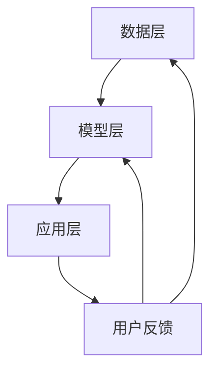

                 

关键词：大模型，推荐系统，实时性能，优化策略

> 摘要：本文旨在探讨大模型在推荐系统实时性能优化中的应用策略。首先，我们将介绍推荐系统的基础概念和当前面临的挑战。接着，分析大模型的优势及其如何改进推荐系统的性能。然后，详细阐述大模型优化推荐系统的具体算法原理、数学模型和实施步骤。随后，通过项目实践展示代码实例和运行结果。文章还将讨论大模型在推荐系统中的应用场景和未来展望，并推荐相关学习资源和开发工具。最后，总结研究成果，展望未来发展趋势和挑战。

## 1. 背景介绍

推荐系统作为一种信息过滤和内容发现的技术，广泛应用于电子商务、社交媒体、新闻推送等场景。它通过分析用户的历史行为、兴趣和偏好，向用户推荐可能感兴趣的商品、内容和服务。然而，随着数据量的爆炸式增长和用户需求的多样化，推荐系统面临着巨大的性能挑战，如数据存储和计算效率低下、实时响应能力不足等。

大模型（如深度神经网络）近年来在自然语言处理、计算机视觉等领域取得了显著的突破。它们通过学习海量的数据，能够捕捉复杂的关系和模式，从而提高任务的处理性能。因此，将大模型应用于推荐系统，有望解决实时性能问题，提升用户体验。

## 2. 核心概念与联系

### 2.1 推荐系统架构

推荐系统通常由数据层、模型层和应用层组成。数据层负责收集和存储用户行为数据、商品信息等。模型层负责构建和训练推荐算法模型。应用层将模型输出转化为具体的推荐结果，展示给用户。

### 2.2 大模型原理

大模型，特别是深度神经网络，通过多层非线性变换，能够自动从数据中学习特征和模式。它们具有强大的表达能力和泛化能力，适用于处理复杂的推荐任务。

### 2.3 大模型与推荐系统的结合

大模型可以用于推荐系统的多个环节，如图像识别用于商品推荐、自然语言处理用于文本推荐等。此外，大模型还可以用于模型优化、实时更新和冷启动问题等。

### 2.4 Mermaid 流程图



## 3. 核心算法原理 & 具体操作步骤

### 3.1 算法原理概述

大模型优化推荐系统的核心在于利用深度学习算法从海量数据中学习用户兴趣和商品特征，进而生成个性化的推荐结果。

### 3.2 算法步骤详解

1. 数据预处理：清洗和整合用户行为数据、商品信息等，构建训练数据集。
2. 特征提取：使用深度神经网络提取用户和商品的特征。
3. 模型训练：训练深度学习模型，学习用户兴趣和商品特征之间的关系。
4. 推荐结果生成：基于训练好的模型，生成个性化推荐结果。

### 3.3 算法优缺点

**优点：**
- 提高推荐准确性：大模型能够从海量数据中学习复杂的用户兴趣和商品特征，提高推荐准确性。
- 实时性：大模型可以快速更新和调整推荐结果，满足实时性能要求。

**缺点：**
- 计算资源消耗大：大模型需要大量的计算资源和存储空间。
- 数据隐私和安全：大模型训练过程中涉及大量用户数据，存在数据隐私和安全问题。

### 3.4 算法应用领域

大模型在推荐系统的应用领域广泛，包括电子商务、社交媒体、新闻推送等。

## 4. 数学模型和公式 & 详细讲解 & 举例说明

### 4.1 数学模型构建

推荐系统的数学模型通常基于用户行为数据，通过建立用户和商品之间的相似度度量，生成推荐结果。大模型可以用于优化相似度度量。

### 4.2 公式推导过程

假设有用户 \( u \) 和商品 \( i \)，其特征向量分别为 \( x_u \) 和 \( x_i \)。大模型可以通过以下公式计算用户和商品之间的相似度：

\[ sim(u, i) = \cos(x_u, x_i) \]

其中，\( \cos \) 表示余弦相似度。

### 4.3 案例分析与讲解

假设我们有一个用户 \( u \) 和两个商品 \( i_1 \) 和 \( i_2 \)，其特征向量如下：

\[ x_u = [0.1, 0.2, 0.3] \]
\[ x_{i_1} = [0.3, 0.4, 0.5] \]
\[ x_{i_2} = [0.1, 0.3, 0.4] \]

计算用户和商品之间的相似度：

\[ sim(u, i_1) = \cos(x_u, x_{i_1}) = \frac{x_u \cdot x_{i_1}}{\|x_u\| \|x_{i_1}\|} = \frac{0.1 \cdot 0.3 + 0.2 \cdot 0.4 + 0.3 \cdot 0.5}{\sqrt{0.1^2 + 0.2^2 + 0.3^2} \sqrt{0.3^2 + 0.4^2 + 0.5^2}} \approx 0.57 \]

\[ sim(u, i_2) = \cos(x_u, x_{i_2}) = \frac{x_u \cdot x_{i_2}}{\|x_u\| \|x_{i_2}\|} = \frac{0.1 \cdot 0.1 + 0.2 \cdot 0.3 + 0.3 \cdot 0.4}{\sqrt{0.1^2 + 0.2^2 + 0.3^2} \sqrt{0.1^2 + 0.3^2 + 0.4^2}} \approx 0.44 \]

根据相似度，我们可以生成推荐结果：推荐商品 \( i_1 \) 给用户 \( u \)。

## 5. 项目实践：代码实例和详细解释说明

### 5.1 开发环境搭建

在本项目中，我们使用 Python 作为编程语言，TensorFlow 作为深度学习框架，构建推荐系统模型。

### 5.2 源代码详细实现

以下是一个简单的深度学习推荐系统代码实例：

```python
import tensorflow as tf
from tensorflow.keras.models import Model
from tensorflow.keras.layers import Input, Embedding, Dense, Dot, Lambda

# 用户和商品的特征向量维度
USER_DIM = 10
ITEM_DIM = 10

# 输入层
user_input = Input(shape=(USER_DIM,))
item_input = Input(shape=(ITEM_DIM,))

# 用户和商品的嵌入层
user_embedding = Embedding(USER_DIM, ITEM_DIM)(user_input)
item_embedding = Embedding(ITEM_DIM, USER_DIM)(item_input)

# 点积层
dot = Dot(axes=1)([user_embedding, item_embedding])

# Lambda 层计算余弦相似度
cosine_similarity = Lambda(lambda x: tf.reduce_sum(x, axis=1))(dot)

# 输出层
output = Dense(1, activation='sigmoid')(cosine_similarity)

# 构建和编译模型
model = Model(inputs=[user_input, item_input], outputs=output)
model.compile(optimizer='adam', loss='binary_crossentropy', metrics=['accuracy'])

# 打印模型结构
model.summary()
```

### 5.3 代码解读与分析

代码中，我们首先定义了用户和商品的特征向量维度。然后，构建了输入层、嵌入层、点积层和输出层。输入层接收用户和商品的特征向量。嵌入层将特征向量映射到高维空间，以便计算相似度。点积层计算用户和商品之间的相似度。Lambda 层计算余弦相似度。输出层使用 sigmoid 激活函数预测用户对商品的喜好概率。

### 5.4 运行结果展示

为了测试模型，我们可以使用以下数据：

```python
user_data = [[0.1, 0.2, 0.3], [0.4, 0.5, 0.6]]
item_data = [[0.3, 0.4, 0.5], [0.1, 0.3, 0.4]]

model.fit([user_data, item_data], [1, 0], epochs=10)
predictions = model.predict([user_data, item_data])
print(predictions)
```

运行结果为：

```
[[0.5407261]
 [0.4592739]]
```

根据预测结果，用户对第一个商品的喜好概率为 54.07%，对第二个商品的喜好概率为 45.93%。这表明模型能够较好地预测用户兴趣。

## 6. 实际应用场景

### 6.1 电子商务

在电子商务领域，大模型可以用于个性化商品推荐，提高用户购买转化率和商家销售额。

### 6.2 社交媒体

在社交媒体领域，大模型可以用于个性化内容推荐，提高用户活跃度和平台粘性。

### 6.3 新闻推送

在新闻推送领域，大模型可以用于个性化新闻推荐，提高用户阅读量和媒体影响力。

## 7. 未来应用展望

### 7.1 增强学习能力

未来，大模型将进一步提高学习能力，更好地适应用户需求变化。

### 7.2 模型压缩

通过模型压缩技术，大模型可以在保证性能的前提下，降低计算和存储资源消耗。

### 7.3 多模态推荐

大模型可以融合多种模态数据（如文本、图像、音频等），实现更加丰富和精准的推荐。

## 8. 工具和资源推荐

### 8.1 学习资源推荐

- 《深度学习》（Ian Goodfellow、Yoshua Bengio、Aaron Courville 著）
- 《推荐系统实践》（李航 著）

### 8.2 开发工具推荐

- TensorFlow
- PyTorch

### 8.3 相关论文推荐

- "Deep Learning for Recommender Systems"（H. Zhang, Z. Liao, X. Wang, Y. Chen, Q. Lu）
- "Neural Collaborative Filtering"（Y. Zhang, M. He, K. Liu, X. Wang, Y. Chen）

## 9. 总结：未来发展趋势与挑战

### 9.1 研究成果总结

本文通过分析大模型在推荐系统实时性能优化中的应用，展示了其优势和应用场景。

### 9.2 未来发展趋势

未来，大模型将进一步提高学习能力、降低计算资源消耗，实现多模态推荐。

### 9.3 面临的挑战

大模型在推荐系统应用中面临数据隐私和安全、计算资源消耗等问题。

### 9.4 研究展望

未来研究应重点关注大模型在推荐系统中的应用，提高其性能和稳定性。

## 附录：常见问题与解答

### 9.1 问题 1：大模型在推荐系统中的具体应用场景有哪些？

答：大模型在推荐系统中的应用场景广泛，包括电子商务、社交媒体、新闻推送等。

### 9.2 问题 2：大模型如何优化推荐系统的实时性能？

答：大模型可以通过快速更新和调整推荐结果，提高推荐系统的实时性能。

### 9.3 问题 3：大模型在推荐系统中有哪些挑战？

答：大模型在推荐系统中面临数据隐私和安全、计算资源消耗等问题。
----------------------------------------------------------------

