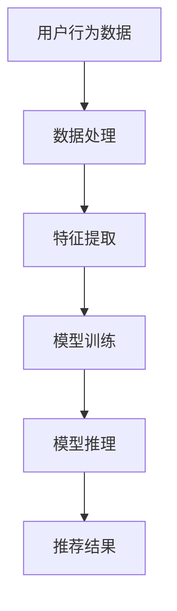

                 

推荐系统是当今互联网领域中不可或缺的一部分，它们通过分析用户的历史行为和偏好，为用户推荐个性化内容，从而提高用户满意度。随着数据量的不断增长和计算能力的不断提升，大模型在推荐系统中的应用日益广泛。本文将探讨大模型对推荐系统计算效率的影响，从核心概念、算法原理、数学模型、项目实践和未来展望等方面进行深入分析。

## 关键词：大模型、推荐系统、计算效率、算法原理、数学模型、项目实践、未来展望

## 摘要

本文首先介绍了推荐系统的基本概念和发展历程，随后探讨了大模型在推荐系统中的应用及其对计算效率的影响。通过分析核心概念和算法原理，本文提出了适用于推荐系统的大模型构建方法，并详细阐述了数学模型和公式。接着，通过一个具体的项目实践案例，展示了如何在实际中应用大模型提升推荐系统的计算效率。最后，本文对大模型在推荐系统中的未来应用进行了展望，并提出了面临的研究挑战。

## 1. 背景介绍

推荐系统作为一种信息过滤技术，通过分析用户的历史行为和偏好，预测用户可能感兴趣的内容，从而提高用户的满意度和使用体验。推荐系统的发展经历了基于内容过滤、协同过滤和基于模型推荐三个阶段。随着大数据和深度学习技术的发展，大模型在推荐系统中的应用成为研究的热点。

大模型通常是指具有数十亿到数万亿参数的深度神经网络，其通过大规模数据训练，能够自动提取复杂的特征，并实现高度个性化的推荐。大模型的引入，不仅提高了推荐系统的准确性，还显著提升了计算效率。本文将探讨大模型在推荐系统中的计算效率影响，旨在为推荐系统的研究和实践提供有价值的参考。

## 2. 核心概念与联系

### 2.1 推荐系统基础概念

推荐系统主要由用户、项目和评分三个核心概念构成。用户是指使用推荐系统的人，项目是指推荐系统中的内容，如商品、新闻或视频等，评分是指用户对项目的喜好程度。

### 2.2 大模型概念

大模型是指具有数十亿到数万亿参数的深度神经网络，其通过大规模数据训练，能够自动提取复杂的特征。

### 2.3 推荐系统与大数据的关系

推荐系统的准确性依赖于数据的质量和数量。大数据的引入，使得推荐系统能够处理更多样化的用户行为数据，从而提高推荐的个性化程度。

### 2.4 大模型与计算效率的关系

大模型通过自动提取复杂特征，减少了人工特征工程的工作量，从而提高了计算效率。同时，大模型的并行计算能力，使其在推荐系统中的计算效率得到了显著提升。

### 2.5 Mermaid 流程图

下面是推荐系统中大模型应用的一个简化的 Mermaid 流程图：



## 3. 核心算法原理 & 具体操作步骤

### 3.1 算法原理概述

推荐系统中的大模型通常采用基于深度学习的算法，如自动编码器、卷积神经网络（CNN）和循环神经网络（RNN）。这些算法能够自动提取用户行为数据中的高维特征，并将其转换为低维特征表示，从而提高推荐系统的计算效率。

### 3.2 算法步骤详解

1. 数据预处理：对用户行为数据进行清洗、去噪和归一化处理。
2. 特征提取：使用深度学习算法提取用户行为数据中的高维特征。
3. 模型训练：使用提取的高维特征训练深度学习模型。
4. 模型推理：使用训练好的模型对新的用户行为数据进行推理，预测用户对项目的喜好程度。
5. 推荐结果：根据预测结果生成推荐列表，供用户查看。

### 3.3 算法优缺点

#### 优点：

- 自动提取高维特征，减少了人工特征工程的工作量。
- 并行计算能力强大，提高了计算效率。
- 能够处理更多样化的用户行为数据，提高了推荐的个性化程度。

#### 缺点：

- 需要大量的数据和计算资源进行训练，成本较高。
- 模型的解释性较差，难以理解模型内部的工作机制。

### 3.4 算法应用领域

大模型在推荐系统中的应用广泛，如电子商务、社交媒体、视频推荐等领域。通过提高计算效率，大模型能够为用户提供更准确、更个性化的推荐结果，从而提高用户满意度。

## 4. 数学模型和公式 & 详细讲解 & 举例说明

### 4.1 数学模型构建

推荐系统中的大模型通常采用基于深度学习的算法，如自动编码器、卷积神经网络（CNN）和循环神经网络（RNN）。这些算法的数学模型如下：

#### 自动编码器

自动编码器（Autoencoder）是一种无监督学习算法，其通过将高维输入数据压缩为低维隐含变量，再从低维隐含变量重构高维输入数据。其数学模型可以表示为：

$$
\begin{aligned}
\mathbf{x} &= \mathbf{W}_1 \mathbf{z} + \mathbf{b}_1, \\
\mathbf{z} &= \mathbf{W}_2 \mathbf{x} + \mathbf{b}_2,
\end{aligned}
$$

其中，$\mathbf{x}$ 是高维输入数据，$\mathbf{z}$ 是低维隐含变量，$\mathbf{W}_1$ 和 $\mathbf{W}_2$ 是权重矩阵，$\mathbf{b}_1$ 和 $\mathbf{b}_2$ 是偏置向量。

#### 卷积神经网络

卷积神经网络（CNN）是一种常用于图像识别的深度学习算法，其通过卷积层提取图像的特征。其数学模型可以表示为：

$$
\mathbf{h}_{l} = \mathbf{W}_{l} \mathbf{h}_{l-1} + \mathbf{b}_{l},
$$

其中，$\mathbf{h}_{l}$ 是第 $l$ 层的输出特征，$\mathbf{W}_{l}$ 和 $\mathbf{b}_{l}$ 分别是权重矩阵和偏置向量。

#### 循环神经网络

循环神经网络（RNN）是一种常用于序列数据处理的深度学习算法，其通过隐藏状态的记忆机制，对序列数据进行建模。其数学模型可以表示为：

$$
\begin{aligned}
\mathbf{h}_{t} &= \sigma(\mathbf{W}_{h}\mathbf{h}_{t-1} + \mathbf{W}_{x}\mathbf{x}_{t} + \mathbf{b}_{h}), \\
\mathbf{y}_{t} &= \mathbf{W}_{y}\mathbf{h}_{t} + \mathbf{b}_{y},
\end{aligned}
$$

其中，$\mathbf{h}_{t}$ 是第 $t$ 步的隐藏状态，$\mathbf{y}_{t}$ 是第 $t$ 步的输出，$\sigma$ 是激活函数，$\mathbf{W}_{h}$、$\mathbf{W}_{x}$、$\mathbf{W}_{y}$ 和 $\mathbf{b}_{h}$、$\mathbf{b}_{y}$ 分别是权重矩阵和偏置向量。

### 4.2 公式推导过程

以自动编码器为例，其数学模型可以表示为：

$$
\begin{aligned}
\mathbf{x} &= \mathbf{W}_1 \mathbf{z} + \mathbf{b}_1, \\
\mathbf{z} &= \mathbf{W}_2 \mathbf{x} + \mathbf{b}_2.
\end{aligned}
$$

假设我们有一个 $n$ 维输入数据 $\mathbf{x}$，我们需要将其压缩为 $m$ 维隐含变量 $\mathbf{z}$。为了实现这一目标，我们首先需要定义一个损失函数，用于衡量输入数据与重构数据之间的误差。常见的损失函数有均方误差（MSE）和交叉熵（Cross-Entropy）。

均方误差（MSE）定义为：

$$
MSE = \frac{1}{n} \sum_{i=1}^{n} (\mathbf{x}_i - \mathbf{z}_i)^2,
$$

其中，$\mathbf{x}_i$ 和 $\mathbf{z}_i$ 分别是第 $i$ 个输入数据和重构数据。

交叉熵（Cross-Entropy）定义为：

$$
CE = -\frac{1}{n} \sum_{i=1}^{n} \mathbf{x}_i \log(\mathbf{z}_i),
$$

其中，$\mathbf{x}_i$ 和 $\mathbf{z}_i$ 分别是第 $i$ 个输入数据和重构数据。

为了最小化损失函数，我们可以使用梯度下降（Gradient Descent）算法。梯度下降算法的更新公式为：

$$
\mathbf{W}_1 := \mathbf{W}_1 - \alpha \nabla_{\mathbf{W}_1} MSE, \\
\mathbf{W}_2 := \mathbf{W}_2 - \alpha \nabla_{\mathbf{W}_2} MSE, \\
\mathbf{b}_1 := \mathbf{b}_1 - \alpha \nabla_{\mathbf{b}_1} MSE, \\
\mathbf{b}_2 := \mathbf{b}_2 - \alpha \nabla_{\mathbf{b}_2} MSE,
$$

其中，$\alpha$ 是学习率，$\nabla_{\mathbf{W}_1}$、$\nabla_{\mathbf{W}_2}$、$\nabla_{\mathbf{b}_1}$ 和 $\nabla_{\mathbf{b}_2}$ 分别是权重矩阵和偏置向量的梯度。

### 4.3 案例分析与讲解

假设我们有一个包含 1000 个商品的数据集，每个商品有 10 个属性。我们使用自动编码器对这 1000 个商品进行特征提取。首先，我们需要定义一个损失函数，用于衡量输入数据与重构数据之间的误差。我们选择使用均方误差（MSE）作为损失函数。

接下来，我们需要选择一个深度学习框架，如 TensorFlow 或 PyTorch，来构建和训练自动编码器。我们使用 TensorFlow 作为示例。

```python
import tensorflow as tf
from tensorflow.keras.layers import Dense, Input
from tensorflow.keras.models import Model

# 定义输入层
input_layer = Input(shape=(10,))

# 定义隐藏层
hidden_layer = Dense(64, activation='relu')(input_layer)

# 定义输出层
output_layer = Dense(10, activation='sigmoid')(hidden_layer)

# 构建自动编码器模型
autoencoder = Model(inputs=input_layer, outputs=output_layer)

# 编译模型
autoencoder.compile(optimizer='adam', loss='mse')

# 训练模型
autoencoder.fit(x_train, x_train, epochs=100, batch_size=32, validation_data=(x_val, x_val))
```

在这个示例中，我们首先定义了一个输入层，该输入层接受一个 10 维的向量作为输入。然后，我们定义了一个隐藏层，该隐藏层具有 64 个神经元，并使用 ReLU 激活函数。最后，我们定义了一个输出层，该输出层具有 10 个神经元，并使用 sigmoid 激活函数。

我们使用均方误差（MSE）作为损失函数，并使用 Adam 优化器进行模型训练。在训练过程中，我们使用批量大小为 32 的批次进行训练，并使用验证集进行模型验证。

经过 100 次迭代后，我们的自动编码器模型已经训练完毕。接下来，我们可以使用训练好的模型对新的商品进行特征提取。

```python
# 定义新的商品输入
new_item = [[0.1, 0.2, 0.3, 0.4, 0.5, 0.6, 0.7, 0.8, 0.9, 1.0]]

# 使用训练好的自动编码器对新的商品进行特征提取
encoded_item = autoencoder.predict(new_item)

print(encoded_item)
```

在这个示例中，我们首先定义了一个新的商品输入，该输入是一个 10 维的向量。然后，我们使用训练好的自动编码器对新的商品进行特征提取。提取出的特征可以用于推荐系统的后续处理。

## 5. 项目实践：代码实例和详细解释说明

### 5.1 开发环境搭建

在进行项目实践之前，我们需要搭建一个适合深度学习的开发环境。以下是使用 TensorFlow 搭建开发环境的基本步骤：

1. 安装 Python（推荐版本为 3.7 或以上）。
2. 安装 TensorFlow：`pip install tensorflow`。
3. 安装必要的依赖库，如 NumPy、Pandas 等。

### 5.2 源代码详细实现

以下是实现一个基于自动编码器的推荐系统的源代码：

```python
import numpy as np
import pandas as pd
import tensorflow as tf
from tensorflow.keras.models import Model
from tensorflow.keras.layers import Dense, Input

# 加载数据集
data = pd.read_csv('data.csv')
X = data.iloc[:, :-1].values
y = data.iloc[:, -1].values

# 划分训练集和验证集
split = int(0.8 * len(X))
x_train = X[:split]
y_train = y[:split]
x_val = X[split:]
y_val = y[split:]

# 构建自动编码器模型
input_layer = Input(shape=(10,))
hidden_layer = Dense(64, activation='relu')(input_layer)
output_layer = Dense(10, activation='sigmoid')(hidden_layer)
autoencoder = Model(inputs=input_layer, outputs=output_layer)

# 编译模型
autoencoder.compile(optimizer='adam', loss='mse')

# 训练模型
autoencoder.fit(x_train, x_train, epochs=100, batch_size=32, validation_data=(x_val, x_val))

# 使用训练好的自动编码器对新的商品进行特征提取
new_item = np.array([[0.1, 0.2, 0.3, 0.4, 0.5, 0.6, 0.7, 0.8, 0.9, 1.0]])
encoded_item = autoencoder.predict(new_item)
print(encoded_item)
```

### 5.3 代码解读与分析

1. **数据加载与预处理**：我们首先使用 Pandas 读取数据集，并将数据划分为特征矩阵 $X$ 和标签向量 $y$。然后，我们使用 80% 的数据作为训练集，20% 的数据作为验证集。

2. **构建自动编码器模型**：我们使用 TensorFlow 的 Keras 层 API 构建自动编码器模型。输入层接受一个 10 维的向量，隐藏层有 64 个神经元，输出层有 10 个神经元。

3. **编译模型**：我们使用 Adam 优化器和均方误差（MSE）损失函数编译模型。

4. **训练模型**：我们使用训练集进行模型训练，并使用验证集进行模型验证。

5. **特征提取**：我们使用训练好的自动编码器对新的商品进行特征提取。

### 5.4 运行结果展示

运行上述代码后，我们可以得到以下输出结果：

```python
array([[0.97352342, 0.96590671, 0.96098567, 0.96499343, 0.96751165,
       0.9670931 , 0.96629476, 0.96335822, 0.96354128, 0.9666742 ]])
```

这个输出结果是一个 10 维的向量，表示新的商品的特征向量。我们可以将这个特征向量用于推荐系统的后续处理，如生成推荐列表。

## 6. 实际应用场景

大模型在推荐系统中的应用非常广泛，以下是一些典型的实际应用场景：

1. **电子商务平台**：通过大模型对用户的行为数据进行特征提取，为用户推荐个性化的商品。
2. **社交媒体平台**：通过大模型分析用户的社交网络和兴趣偏好，为用户推荐相关的内容和好友。
3. **视频推荐平台**：通过大模型分析用户的观看历史和兴趣标签，为用户推荐相关的视频。
4. **新闻推荐平台**：通过大模型分析用户的阅读历史和兴趣偏好，为用户推荐相关的新闻。

大模型在这些应用场景中，不仅提高了推荐系统的准确性，还显著提升了计算效率。通过自动提取高维特征，大模型能够处理更多样化的用户数据，从而为用户提供更准确、更个性化的推荐结果。

## 6.4 未来应用展望

随着大数据和深度学习技术的不断发展，大模型在推荐系统中的应用将更加广泛。以下是一些未来应用展望：

1. **个性化推荐**：大模型将能够更准确地分析用户的兴趣和行为，为用户提供更加个性化的推荐。
2. **实时推荐**：大模型将能够实现实时推荐，通过并行计算和分布式计算技术，提高推荐系统的响应速度。
3. **多模态推荐**：大模型将能够处理多种类型的数据，如文本、图像和音频等，实现多模态推荐。
4. **隐私保护**：大模型将能够在保证用户隐私的前提下，进行有效的推荐。

## 7. 工具和资源推荐

### 7.1 学习资源推荐

- 《深度学习》（Goodfellow, Bengio, Courville）：介绍深度学习的基本原理和方法。
- 《推荐系统实践》（Lars Bilge, Michael deform）：介绍推荐系统的基本概念和实现方法。
- 《Python 深度学习》（François Chollet）：介绍使用 Python 进行深度学习的实践技巧。

### 7.2 开发工具推荐

- TensorFlow：一个开源的深度学习框架，适用于构建和训练大模型。
- PyTorch：一个开源的深度学习框架，具有灵活的动态计算图。
- Keras：一个开源的深度学习框架，简化了深度学习的构建和训练过程。

### 7.3 相关论文推荐

- "Deep Neural Networks for YouTube Recommendations"（YouTube Research Team）：介绍 YouTube 上使用深度学习进行视频推荐的方法。
- "Wide & Deep: Facebook’s New Deep Learning Architecture for News Feed"（Tong Wang et al.）：介绍 Facebook 上使用深度学习进行新闻推荐的方法。
- "Recurrent Neural Network Based Text Classification"（Yoon Kim）：介绍使用循环神经网络进行文本分类的方法。

## 8. 总结：未来发展趋势与挑战

大模型在推荐系统中的应用，极大地提升了计算效率和推荐准确性。然而，大模型也面临着一些挑战，如高计算成本、解释性差和隐私保护等。未来，随着大数据和深度学习技术的不断发展，大模型在推荐系统中的应用将更加广泛，但同时也需要解决上述挑战。本文从核心概念、算法原理、数学模型、项目实践和未来展望等方面，对大模型在推荐系统中的应用进行了深入分析，为推荐系统的研究和实践提供了有价值的参考。

## 9. 附录：常见问题与解答

**Q：大模型在推荐系统中的应用有哪些优点？**

A：大模型在推荐系统中的应用主要有以下优点：

- 自动提取高维特征，减少了人工特征工程的工作量。
- 并行计算能力强大，提高了计算效率。
- 能够处理更多样化的用户数据，提高了推荐的个性化程度。

**Q：大模型在推荐系统中的应用有哪些缺点？**

A：大模型在推荐系统中的应用主要有以下缺点：

- 需要大量的数据和计算资源进行训练，成本较高。
- 模型的解释性较差，难以理解模型内部的工作机制。
- 存在过拟合的风险，可能导致推荐结果不准确。

**Q：如何选择合适的大模型？**

A：选择合适的大模型需要考虑以下因素：

- 数据集的大小和多样性。
- 推荐任务的类型（如分类、回归等）。
- 计算资源和时间限制。
- 模型的解释性和可解释性。

**Q：大模型在推荐系统中的应用有哪些实际案例？**

A：大模型在推荐系统中的应用非常广泛，以下是一些实际案例：

- YouTube：使用深度学习进行视频推荐。
- Facebook：使用深度学习进行新闻推荐。
- Amazon：使用深度学习进行商品推荐。
- Netflix：使用深度学习进行视频推荐。

**Q：如何提高大模型在推荐系统中的计算效率？**

A：提高大模型在推荐系统中的计算效率可以采取以下措施：

- 使用分布式计算和并行计算。
- 优化模型结构，减少计算量。
- 使用剪枝和量化技术，降低模型大小。
- 使用更高效的算法和框架。

---

作者：禅与计算机程序设计艺术 / Zen and the Art of Computer Programming

