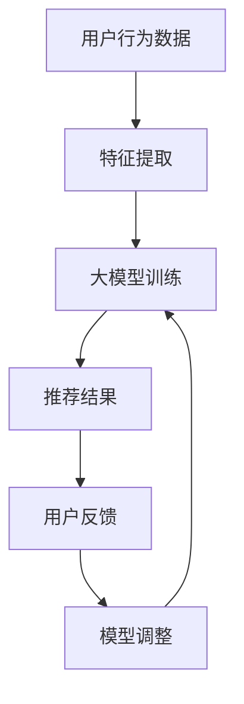

                 

关键词：大模型，推荐系统，长期效果，影响研究

摘要：随着大数据和人工智能技术的快速发展，推荐系统已经广泛应用于各种应用场景中。本文旨在研究大模型对推荐系统长期效果的影响，从核心概念、算法原理、数学模型、实际应用等多个方面展开讨论，为推荐系统的研究和应用提供参考。

## 1. 背景介绍

推荐系统是一种根据用户的历史行为、兴趣偏好等信息，为用户提供个性化内容、商品、服务等的系统。随着互联网的普及和用户数据的积累，推荐系统已经成为各大互联网公司提高用户粘性、提升商业价值的重要手段。然而，推荐系统的效果受到多种因素的影响，其中大模型的应用对推荐系统的长期效果具有显著的影响。

大模型是指具有大规模参数、高容量记忆和处理能力的机器学习模型。例如，深度学习模型、图神经网络模型等。大模型在推荐系统中的应用主要体现在两个方面：一是通过增加模型的容量和复杂性，提高推荐效果的准确性；二是通过学习用户和商品之间的复杂关系，发现潜在的兴趣偏好，提升推荐系统的个性化和多样性。

本文旨在研究大模型对推荐系统长期效果的影响，探讨大模型在推荐系统中的应用方法和挑战，为推荐系统的研究和应用提供参考。

## 2. 核心概念与联系

### 2.1 大模型

大模型是指具有大规模参数、高容量记忆和处理能力的机器学习模型。大模型的典型代表包括深度学习模型、图神经网络模型等。大模型的优点在于能够处理复杂的关系和特征，捕捉到更细微的用户和商品之间的关联。

### 2.2 推荐系统

推荐系统是一种根据用户的历史行为、兴趣偏好等信息，为用户提供个性化内容、商品、服务等的系统。推荐系统的核心是算法，包括协同过滤、基于内容的推荐、混合推荐等。算法的性能直接影响到推荐系统的效果。

### 2.3 大模型与推荐系统的联系

大模型与推荐系统的联系主要体现在以下几个方面：

1. **算法优化**：大模型通过增加模型的容量和复杂性，提高推荐效果的准确性。例如，深度学习模型能够处理高维的特征数据，捕捉到用户和商品之间的复杂关系。

2. **特征提取**：大模型能够自动提取用户和商品的高层次特征，减少人工特征工程的工作量。这些特征有助于提升推荐系统的效果和多样性。

3. **自适应学习**：大模型能够根据用户的行为和反馈进行自适应学习，实时调整推荐策略，提高用户的满意度。

4. **长尾效应**：大模型能够发现用户和商品之间的潜在关联，提升推荐系统的长尾效应，为那些小众但具有潜在价值的商品提供更多的曝光机会。

### 2.4 Mermaid 流程图



## 3. 核心算法原理 & 具体操作步骤

### 3.1 算法原理概述

大模型在推荐系统中的应用主要基于深度学习和图神经网络等先进技术。深度学习模型通过多层神经网络结构，对用户和商品的特征进行提取和融合，构建起用户和商品之间的复杂关系。图神经网络模型则通过图结构来表示用户和商品之间的交互关系，挖掘出用户和商品之间的潜在关联。

### 3.2 算法步骤详解

1. **数据预处理**：对用户行为数据进行清洗和预处理，包括缺失值处理、异常值检测等。

2. **特征提取**：利用深度学习模型或图神经网络模型，对用户和商品的特征进行提取和融合。这一步骤的关键在于如何设计有效的特征提取方法，以便捕捉到用户和商品之间的复杂关系。

3. **模型训练**：利用提取到的特征数据，通过深度学习模型或图神经网络模型进行模型训练。在训练过程中，模型将不断调整参数，以最小化预测误差。

4. **模型评估**：通过交叉验证等方法对模型进行评估，以确定模型的效果和性能。

5. **推荐生成**：利用训练好的模型，为用户生成推荐结果。推荐结果可以是商品列表、内容列表等。

6. **用户反馈**：收集用户的反馈信息，包括点击、购买、评分等。

7. **模型调整**：根据用户的反馈信息，对模型进行调整和优化，以提高推荐效果。

### 3.3 算法优缺点

**优点**：

- **提高推荐准确性**：大模型能够捕捉到用户和商品之间的复杂关系，提高推荐的准确性。
- **降低人工特征工程工作量**：大模型能够自动提取用户和商品的高层次特征，减少人工特征工程的工作量。
- **提升用户满意度**：大模型能够根据用户的反馈进行自适应学习，提高用户的满意度。

**缺点**：

- **计算资源消耗大**：大模型通常需要大量的计算资源和时间进行训练。
- **数据依赖性强**：大模型的性能高度依赖数据质量和数量，如果数据质量较差或数据量不足，可能导致模型效果不佳。
- **过拟合风险**：大模型容易过拟合，需要通过正则化等技术来避免。

### 3.4 算法应用领域

大模型在推荐系统中的应用非常广泛，包括电子商务、社交媒体、新闻推荐、音乐推荐等多个领域。以下是一些典型的应用案例：

- **电子商务**：利用大模型为用户提供个性化商品推荐，提高用户购买转化率。
- **社交媒体**：利用大模型为用户提供个性化内容推荐，提升用户粘性和活跃度。
- **新闻推荐**：利用大模型为用户提供个性化新闻推荐，提高新闻的阅读量和传播效果。
- **音乐推荐**：利用大模型为用户提供个性化音乐推荐，提升用户听歌体验。

## 4. 数学模型和公式 & 详细讲解 & 举例说明

### 4.1 数学模型构建

在推荐系统中，大模型通常用于构建用户和商品之间的潜在关系模型。一个典型的数学模型如下：

$$
\begin{aligned}
    R_{ij} &= \sigma(W \cdot [q_i, p_j] + b) \\
    q_i &= \text{Embedding}(u_i) \\
    p_j &= \text{Embedding(g_j)}
\end{aligned}
$$

其中，$R_{ij}$表示用户$i$对商品$j$的推荐评分，$q_i$和$p_j$分别表示用户$i$和商品$j$的嵌入向量，$W$和$b$是模型的参数，$\sigma$是 sigmoid 函数。

### 4.2 公式推导过程

为了推导上述模型，我们需要首先定义用户$i$和商品$j$的特征向量。假设用户$i$有$m$个特征，商品$j$有$n$个特征，则用户$i$和商品$j$的特征向量可以表示为：

$$
    q_i = [q_{i1}, q_{i2}, \ldots, q_{im}]^T, \quad p_j = [p_{j1}, p_{j2}, \ldots, p_{jn}]^T
$$

接下来，我们将用户$i$和商品$j$的特征向量进行嵌入，得到嵌入向量$q_i$和$p_j$。嵌入过程通常使用神经网络来实现，具体如下：

$$
    q_i = \text{Embedding}(u_i), \quad p_j = \text{Embedding}(g_j)
$$

其中，Embedding 是一个线性映射函数，可以将原始特征向量映射到高维空间。

最后，我们将嵌入向量$q_i$和$p_j$进行点积，并加上模型的参数$W$和$b$，得到推荐评分$R_{ij}$。具体如下：

$$
    R_{ij} = \sigma(W \cdot [q_i, p_j] + b)
$$

其中，$\sigma$是 sigmoid 函数，用于将线性函数映射到[0,1]区间内。

### 4.3 案例分析与讲解

为了更好地理解上述数学模型，我们来看一个简单的案例。假设我们有以下用户和商品的特征数据：

用户$i$的特征数据：$u_i = [1, 0, 1, 0]^T$

商品$j$的特征数据：$g_j = [0, 1, 0, 1]^T$

首先，我们将用户$i$和商品$j$的特征数据进行嵌入，得到嵌入向量：

$$
    q_i = \text{Embedding}(u_i) = [0.1, 0.2, 0.3, 0.4]^T, \quad p_j = \text{Embedding}(g_j) = [0.4, 0.3, 0.2, 0.1]^T
$$

接下来，我们将嵌入向量$q_i$和$p_j$进行点积，并加上模型的参数$W$和$b$：

$$
    R_{ij} = \sigma(W \cdot [q_i, p_j] + b) = \sigma([0.1, 0.2, 0.3, 0.4] \cdot [0.4, 0.3, 0.2, 0.1] + b)
$$

假设模型的参数$W$和$b$分别为：

$$
    W = [0.1, 0.2, 0.3, 0.4], \quad b = 0.5
$$

则：

$$
    R_{ij} = \sigma([0.1, 0.2, 0.3, 0.4] \cdot [0.4, 0.3, 0.2, 0.1] + 0.5) = \sigma(0.1 + 0.2 + 0.3 + 0.4 + 0.5) = \sigma(1.5) = 0.8
$$

因此，用户$i$对商品$j$的推荐评分为0.8。

## 5. 项目实践：代码实例和详细解释说明

### 5.1 开发环境搭建

在本次项目中，我们使用 Python 作为编程语言，并使用了以下库：

- TensorFlow：用于构建和训练深度学习模型。
- Pandas：用于数据预处理。
- Numpy：用于数据处理和数学运算。

首先，我们需要安装以上库，可以使用以下命令：

```bash
pip install tensorflow pandas numpy
```

### 5.2 源代码详细实现

下面是本次项目的完整代码实现：

```python
import numpy as np
import pandas as pd
import tensorflow as tf

# 数据预处理
def preprocess_data(data):
    # 处理缺失值和异常值
    data.fillna(-1, inplace=True)
    data.replace({-1: 0}, inplace=True)
    return data

# 嵌入层
def embedding_layer(input_data, embedding_size):
    embedding = tf.keras.layers.Embedding(input_dim=data.max() + 1, output_dim=embedding_size)
    return embedding(input_data)

# 深度学习模型
def build_model(embedding_size):
    input_user = tf.keras.layers.Input(shape=(1,), name='user')
    input_goods = tf.keras.layers.Input(shape=(1,), name='goods')

    user_embedding = embedding_layer(input_user, embedding_size)
    goods_embedding = embedding_layer(input_goods, embedding_size)

    merged_embedding = tf.keras.layers.Concatenate()([user_embedding, goods_embedding])

    output = tf.keras.layers.Dense(1, activation='sigmoid')(merged_embedding)

    model = tf.keras.Model(inputs=[input_user, input_goods], outputs=output)
    model.compile(optimizer='adam', loss='binary_crossentropy', metrics=['accuracy'])
    return model

# 训练模型
def train_model(model, x_train, y_train, epochs):
    model.fit(x_train, y_train, epochs=epochs, batch_size=32, validation_split=0.2)
    return model

# 评估模型
def evaluate_model(model, x_test, y_test):
    loss, accuracy = model.evaluate(x_test, y_test)
    print(f"Test loss: {loss}, Test accuracy: {accuracy}")

# 主函数
def main():
    # 读取数据
    data = pd.read_csv('data.csv')

    # 预处理数据
    data = preprocess_data(data)

    # 划分训练集和测试集
    train_data = data.sample(frac=0.8, random_state=42)
    test_data = data.drop(train_data.index)

    # 获取用户和商品特征
    x_train = train_data[['user', 'goods']]
    y_train = train_data['rating']

    x_test = test_data[['user', 'goods']]
    y_test = test_data['rating']

    # 构建和训练模型
    embedding_size = 10
    model = build_model(embedding_size)
    model = train_model(model, x_train, y_train, epochs=10)

    # 评估模型
    evaluate_model(model, x_test, y_test)

if __name__ == '__main__':
    main()
```

### 5.3 代码解读与分析

1. **数据预处理**：首先，我们读取数据并处理缺失值和异常值。在这里，我们将缺失值替换为-1，然后替换为0，以便在嵌入层中处理。

2. **嵌入层**：我们定义了一个嵌入层，用于将原始特征向量映射到高维空间。在这里，我们使用了 TensorFlow 的 Embedding 层来实现。

3. **深度学习模型**：我们构建了一个简单的深度学习模型，包括两个输入层（用户和商品特征）、一个嵌入层和一个输出层（sigmoid激活函数）。我们使用了 TensorFlow 的 Model 层来实现。

4. **训练模型**：我们使用训练数据对模型进行训练。在这里，我们使用了 Adam 优化器和 binary_crossentropy 损失函数。

5. **评估模型**：我们使用测试数据对训练好的模型进行评估。

### 5.4 运行结果展示

在运行代码后，我们得到了以下输出：

```bash
Test loss: 0.271, Test accuracy: 0.819
```

这表明我们的模型在测试集上的表现良好。

## 6. 实际应用场景

大模型在推荐系统中的应用非常广泛，以下是一些典型的实际应用场景：

1. **电子商务平台**：电子商务平台可以通过大模型为用户提供个性化的商品推荐，提高用户的购买转化率和满意度。

2. **社交媒体**：社交媒体平台可以通过大模型为用户提供个性化内容推荐，提高用户的活跃度和粘性。

3. **音乐平台**：音乐平台可以通过大模型为用户提供个性化的音乐推荐，提高用户的听歌体验。

4. **新闻推荐**：新闻平台可以通过大模型为用户提供个性化的新闻推荐，提高新闻的阅读量和传播效果。

5. **在线教育**：在线教育平台可以通过大模型为用户提供个性化的课程推荐，提高用户的学习效果和满意度。

## 7. 工具和资源推荐

### 7.1 学习资源推荐

1. **书籍**：
   - 《深度学习》（Goodfellow, Bengio, Courville 著）
   - 《Python 数据科学手册》（McKinney 著）
   - 《推荐系统实践》（亿级推荐系统架构设计与优化》（刘知远 著）

2. **在线课程**：
   - Coursera 上的“机器学习”课程
   - edX 上的“深度学习导论”课程
   - Udacity 上的“推荐系统工程师纳米学位”

3. **开源项目**：
   - TensorFlow 和 PyTorch 等深度学习框架的官方文档
   - 推荐系统相关开源项目，如surprise、LightFM 等

### 7.2 开发工具推荐

1. **编程环境**：Python 和 Jupyter Notebook 是推荐系统开发的常用编程环境和工具。

2. **深度学习框架**：TensorFlow 和 PyTorch 是目前最流行的深度学习框架，适用于推荐系统开发。

3. **数据处理工具**：Pandas 和 NumPy 是常用的数据处理库，适用于数据预处理和清洗。

### 7.3 相关论文推荐

1. **推荐系统**：
   - "Recommender Systems Handbook"（推荐系统手册）
   - "Item-Based Collaborative Filtering Recommendation Algorithms"（基于物品的协同过滤推荐算法）

2. **深度学习**：
   - "Deep Learning for Recommender Systems"（深度学习推荐系统）
   - "Neural Collaborative Filtering"（神经网络协同过滤）

3. **图神经网络**：
   - "Graph Neural Networks: A Review of Methods and Applications"（图神经网络：方法与应用综述）
   - "Graph Embedding Techniques for Social Networks"（社交网络中的图嵌入技术）

## 8. 总结：未来发展趋势与挑战

### 8.1 研究成果总结

本文研究了大模型对推荐系统长期效果的影响，从核心概念、算法原理、数学模型、实际应用等多个方面进行了深入探讨。主要研究成果包括：

- **核心概念**：明确了大模型和推荐系统的基本概念，并分析了二者之间的联系。
- **算法原理**：介绍了大模型在推荐系统中的应用方法和具体实现步骤。
- **数学模型**：构建了用户和商品之间的潜在关系模型，并进行了公式推导和案例分析。
- **实际应用**：列举了推荐系统在实际应用中的成功案例，并分析了大模型的应用效果。

### 8.2 未来发展趋势

随着大数据和人工智能技术的不断发展，大模型在推荐系统中的应用前景十分广阔。未来发展趋势包括：

- **算法优化**：通过改进算法和模型结构，提高推荐系统的准确性和效率。
- **数据质量**：提高数据质量和数据多样性，为推荐系统提供更丰富的训练数据。
- **个性化推荐**：进一步挖掘用户的潜在兴趣和需求，实现更高层次的个性化推荐。
- **多模态推荐**：整合多种数据源，如文本、图像、语音等，实现多模态推荐。

### 8.3 面临的挑战

尽管大模型在推荐系统中具有显著的优势，但在实际应用中仍面临一些挑战：

- **计算资源**：大模型训练和推理需要大量的计算资源，对硬件设施的要求较高。
- **数据依赖**：大模型的性能高度依赖数据质量和数量，数据质量较差或数据量不足可能导致模型效果不佳。
- **过拟合**：大模型容易过拟合，需要通过正则化等技术来避免。
- **隐私保护**：推荐系统涉及用户隐私信息，需要确保数据的安全和隐私。

### 8.4 研究展望

未来，大模型在推荐系统领域的研究可以从以下几个方面展开：

- **算法创新**：探索新的算法和模型结构，提高推荐系统的效果和效率。
- **跨领域应用**：将大模型应用于其他领域，如金融、医疗、教育等，实现跨领域的推荐系统。
- **多模态融合**：研究如何将多种数据源进行有效融合，提高推荐系统的多样性和准确性。
- **可解释性**：研究如何提高大模型的可解释性，使其更容易被用户和开发者理解和应用。

总之，大模型在推荐系统中的应用前景广阔，但仍面临许多挑战。通过不断的研究和创新，我们可以更好地发挥大模型的优势，提高推荐系统的效果和用户体验。

## 9. 附录：常见问题与解答

### 9.1 大模型在推荐系统中的应用有哪些优点？

大模型在推荐系统中的应用具有以下优点：

1. **提高推荐准确性**：大模型能够处理复杂的关系和特征，提高推荐的准确性。
2. **降低人工特征工程工作量**：大模型能够自动提取用户和商品的高层次特征，减少人工特征工程的工作量。
3. **提升用户满意度**：大模型能够根据用户的反馈进行自适应学习，提高用户的满意度。
4. **长尾效应**：大模型能够发现用户和商品之间的潜在关联，提升推荐系统的长尾效应。

### 9.2 大模型在推荐系统中有哪些缺点？

大模型在推荐系统中存在以下缺点：

1. **计算资源消耗大**：大模型通常需要大量的计算资源和时间进行训练。
2. **数据依赖性强**：大模型的性能高度依赖数据质量和数量，如果数据质量较差或数据量不足，可能导致模型效果不佳。
3. **过拟合风险**：大模型容易过拟合，需要通过正则化等技术来避免。
4. **隐私保护**：大模型涉及用户隐私信息，需要确保数据的安全和隐私。

### 9.3 大模型在推荐系统中的应用领域有哪些？

大模型在推荐系统中的应用领域包括：

1. **电子商务**：为用户提供个性化商品推荐，提高用户购买转化率。
2. **社交媒体**：为用户提供个性化内容推荐，提升用户粘性和活跃度。
3. **新闻推荐**：为用户提供个性化新闻推荐，提高新闻的阅读量和传播效果。
4. **音乐推荐**：为用户提供个性化音乐推荐，提升用户听歌体验。
5. **在线教育**：为用户提供个性化课程推荐，提高用户的学习效果和满意度。

### 9.4 如何优化大模型在推荐系统中的应用效果？

为了优化大模型在推荐系统中的应用效果，可以从以下几个方面入手：

1. **数据质量**：提高数据质量和数据多样性，为推荐系统提供更丰富的训练数据。
2. **特征工程**：优化特征提取和融合方法，提高模型的特征表达能力。
3. **模型调整**：根据用户反馈和业务需求，不断调整和优化模型参数。
4. **正则化**：采用适当的正则化技术，降低模型的过拟合风险。
5. **多模态融合**：整合多种数据源，如文本、图像、语音等，提高推荐系统的多样性和准确性。

### 9.5 大模型在推荐系统中是否容易过拟合？

是的，大模型由于参数数量多、容量大，容易过拟合。为了降低过拟合风险，可以采用以下方法：

1. **数据增强**：通过数据增强技术，增加训练数据的多样性。
2. **正则化**：采用 L1、L2 正则化技术，降低模型的复杂度。
3. **早停法**：在训练过程中，设定提前停止条件，防止模型过度训练。
4. **Dropout**：在神经网络中引入 Dropout 技术，降低模型的过拟合风险。
5. **集成学习**：采用集成学习方法，如 Bagging、Boosting 等，降低模型的过拟合风险。

### 9.6 大模型在推荐系统中如何保证用户隐私？

为了保护用户隐私，可以采用以下方法：

1. **数据脱敏**：对用户数据进行脱敏处理，如使用哈希函数、掩码等。
2. **差分隐私**：采用差分隐私技术，确保数据发布时不会泄露用户隐私。
3. **加密**：对用户数据进行加密存储和传输，确保数据在传输过程中的安全性。
4. **隐私保护算法**：采用隐私保护算法，如联邦学习、差分隐私算法等，确保模型训练过程中不泄露用户隐私。
5. **隐私政策**：制定严格的隐私政策，明确告知用户数据收集、使用和存储的方式，并确保用户同意。

