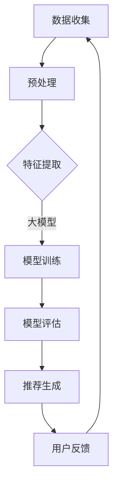

                 

关键词：大模型，推荐系统，长期效果，算法优化，应用场景

## 摘要

本文旨在探讨大模型对推荐系统长期效果的影响。随着人工智能技术的快速发展，大模型在推荐系统中的应用越来越广泛。然而，大模型的引入可能会对系统的效果产生深远的影响，特别是在长期运行的场景中。本文将分析大模型的工作原理，阐述其在推荐系统中的具体应用，并探讨大模型对推荐系统长期效果的影响机制。通过实验和案例分析，本文将总结大模型在不同应用场景中的表现，并提出相应的优化策略。

## 1. 背景介绍

推荐系统是一种基于用户行为和兴趣的信息过滤技术，旨在向用户提供个性化的信息。随着互联网的普及和用户需求的多样化，推荐系统已经成为了许多在线平台的核心功能之一。传统的推荐系统主要基于基于内容的过滤和协同过滤等方法，这些方法在一定程度上满足了用户的需求，但仍然存在一些局限性。

近年来，随着人工智能技术的不断发展，特别是深度学习和大数据技术的应用，大模型开始在推荐系统中发挥作用。大模型具有处理大规模数据、自适应性强和泛化能力高等特点，能够为推荐系统带来更高的效果和更好的用户体验。

本文将重点研究大模型对推荐系统长期效果的影响，旨在为推荐系统的优化和改进提供理论依据和实践指导。

## 2. 核心概念与联系

### 2.1 大模型的基本概念

大模型（Large Models）通常指的是参数规模达到数百万甚至数十亿的神经网络模型。这些模型能够通过大量数据的学习，获取丰富的特征表示和深层次的语义理解。常见的代表性大模型包括GPT、BERT、Transformers等。

### 2.2 推荐系统的基本概念

推荐系统（Recommendation Systems）是一种基于用户行为和兴趣进行信息过滤和推送的技术。其核心目标是通过分析用户的历史行为和偏好，预测用户可能感兴趣的内容，并推荐给用户。

### 2.3 大模型在推荐系统中的应用

大模型在推荐系统中的应用主要体现在两个方面：

1. **特征提取与表示**：大模型可以自动提取用户行为数据中的潜在特征，并将其表示为高维的向量。这些向量可以用于传统推荐算法的输入，从而提高推荐效果。

2. **模型融合与优化**：大模型可以通过融合不同的特征和模型，实现对推荐系统的优化。例如，可以结合内容特征和协同过滤模型，提高推荐结果的准确性和多样性。

### 2.4 Mermaid 流程图

以下是一个简单的大模型在推荐系统中的应用流程图：



### 2.5 大模型与推荐系统的关系

大模型与推荐系统的关系可以用以下公式表示：

$$
推荐效果 = f(用户行为特征, 内容特征, 大模型参数)
$$

其中，$f$ 表示推荐算法函数，$用户行为特征$ 和 $内容特征$ 分别表示用户的历史行为数据和内容属性，$大模型参数$ 则是大模型学习得到的参数。

## 3. 核心算法原理 & 具体操作步骤

### 3.1 算法原理概述

大模型在推荐系统中的应用主要基于深度学习和概率图模型。其中，深度学习模型（如GPT、BERT等）通过多层神经网络结构，对用户行为和内容进行建模，从而提取出潜在的语义特征。概率图模型（如马尔可夫模型、贝叶斯网络等）则通过图结构，描述用户行为和内容之间的关系。

### 3.2 算法步骤详解

1. **数据收集与预处理**：收集用户的行为数据和内容数据，并进行数据清洗和预处理，如缺失值填补、异常值处理等。

2. **特征提取**：使用深度学习模型对用户行为和内容进行特征提取。具体步骤包括：

   - **输入层**：将用户行为和内容数据输入到模型中。
   - **隐藏层**：通过多层神经网络，对输入数据进行加工和处理。
   - **输出层**：输出高维的特征向量。

3. **模型训练**：使用训练数据对大模型进行训练。具体步骤包括：

   - **初始化参数**：随机初始化模型参数。
   - **前向传播**：计算输入数据的输出结果。
   - **反向传播**：根据输出结果和标签，更新模型参数。
   - **迭代优化**：重复前向传播和反向传播，直到模型收敛。

4. **模型评估**：使用验证数据集对训练好的模型进行评估，如准确率、召回率、F1值等。

5. **推荐生成**：使用训练好的模型对用户进行推荐。具体步骤包括：

   - **用户特征提取**：对用户的当前行为和内容进行特征提取。
   - **内容匹配**：将用户特征与内容特征进行匹配，计算相似度。
   - **推荐排序**：根据相似度对内容进行排序，生成推荐列表。

### 3.3 算法优缺点

**优点**：

- **强大的特征提取能力**：大模型可以通过深度学习技术，自动提取用户行为和内容的潜在特征，提高推荐效果。
- **自适应性强**：大模型可以适应不同场景和用户需求，提高推荐系统的泛化能力。
- **可解释性高**：大模型的结构和参数比较透明，便于理解其工作原理和优化方向。

**缺点**：

- **计算资源消耗大**：大模型的训练和推理需要大量的计算资源和时间。
- **数据依赖性强**：大模型的效果高度依赖于训练数据的质量和规模。
- **隐私保护问题**：大模型对用户行为数据的敏感信息进行建模，可能存在隐私保护问题。

### 3.4 算法应用领域

大模型在推荐系统中的应用非常广泛，主要包括以下领域：

- **电子商务**：为用户提供个性化的商品推荐，提高用户购物体验。
- **社交媒体**：为用户提供感兴趣的内容推荐，增加用户粘性。
- **在线教育**：根据用户的学习记录和兴趣，推荐适合的学习资源和课程。
- **医疗健康**：为用户提供个性化的健康建议和医疗服务。

## 4. 数学模型和公式 & 详细讲解 & 举例说明

### 4.1 数学模型构建

在推荐系统中，大模型的数学模型通常可以表示为以下形式：

$$
P(推荐_i | 用户_j) = f(用户_j的特征向量, 内容_i的特征向量, 模型参数)
$$

其中，$P(推荐_i | 用户_j)$ 表示用户 $用户_j$ 接受推荐项 $内容_i$ 的概率，$f$ 是一个复杂的函数，用于表示用户特征向量、内容特征向量和模型参数之间的关系。

### 4.2 公式推导过程

假设我们有一个用户 $用户_j$ 和一组内容 $内容_i$，大模型的输出是一个概率分布，表示用户对每个内容的偏好程度。为了简化问题，我们假设大模型是一个多层感知机（MLP）。

1. **输入层**：用户特征向量和内容特征向量分别表示为 $用户_j的特征向量$ 和 $内容_i的特征向量$。
2. **隐藏层**：假设隐藏层有 $L$ 层，每层有 $n$ 个神经元，权重矩阵为 $W^l$，激活函数为 $σ$。
3. **输出层**：输出层只有一个神经元，权重矩阵为 $W^{L+1}$，输出为 $P(推荐_i | 用户_j)$。

根据多层感知机的计算规则，我们可以得到以下推导过程：

$$
隐藏层l的输出 = σ(用户_j的特征向量 \cdot W^l + 内容_i的特征向量 \cdot W^l + b^l)
$$

$$
P(推荐_i | 用户_j) = σ(隐藏层L的输出 \cdot W^{L+1} + b^{L+1})
$$

其中，$b^l$ 是隐藏层 $l$ 的偏置项，$σ$ 是激活函数，通常可以使用ReLU、Sigmoid或Tanh等。

### 4.3 案例分析与讲解

以下是一个简单的案例，说明如何使用大模型进行推荐系统中的内容推荐。

假设我们有用户 $用户_j$ 和一组内容 $内容_i$，其中 $用户_j$ 的行为数据包括浏览历史和购买记录，$内容_i$ 的属性包括类别、标签和评分。

1. **数据预处理**：对用户行为数据进行编码，对内容属性进行归一化处理。
2. **特征提取**：使用多层感知机（MLP）对用户行为和内容进行特征提取，得到用户特征向量和内容特征向量。
3. **模型训练**：使用用户特征向量和内容特征向量，对大模型进行训练，优化模型参数。
4. **推荐生成**：对用户 $用户_j$ 进行推荐，计算用户特征向量与每个内容特征向量的相似度，选择相似度最高的前 $K$ 个内容作为推荐结果。

具体实现过程如下：

```python
import numpy as np
import tensorflow as tf

# 数据预处理
用户_j的特征向量 = 数据预处理(用户_j的行为数据)
内容_i的特征向量 = 数据预处理(内容_i的属性)

# 定义多层感知机模型
模型 = tf.keras.Sequential([
    tf.keras.layers.Dense(128, activation='relu', input_shape=(特征维度,)),
    tf.keras.layers.Dense(64, activation='relu'),
    tf.keras.layers.Dense(1, activation='sigmoid')
])

# 编写损失函数和优化器
损失函数 = tf.keras.losses.BinaryCrossentropy()
优化器 = tf.keras.optimizers.Adam()

# 模型编译
模型.compile(optimizer=优化器, loss=损失函数, metrics=['accuracy'])

# 模型训练
模型.fit(用户_j的特征向量, 内容_i的特征向量, batch_size=32, epochs=10)

# 推荐生成
推荐结果 = 模型.predict(用户_j的特征向量)
推荐内容 = 排序(推荐结果, descending=True)[:K]
```

## 5. 项目实践：代码实例和详细解释说明

### 5.1 开发环境搭建

为了实现大模型在推荐系统中的应用，我们需要搭建一个合适的开发环境。以下是一个简单的开发环境搭建步骤：

1. **安装 Python**：确保系统安装了 Python 3.6 或以上版本。
2. **安装 TensorFlow**：使用以下命令安装 TensorFlow：
   ```bash
   pip install tensorflow
   ```
3. **安装 NumPy 和 Pandas**：使用以下命令安装 NumPy 和 Pandas：
   ```bash
   pip install numpy
   pip install pandas
   ```
4. **准备数据集**：收集用户行为数据和内容数据，并将其存储为 CSV 文件。

### 5.2 源代码详细实现

以下是一个简单的 Python 代码示例，实现大模型在推荐系统中的应用：

```python
import numpy as np
import pandas as pd
import tensorflow as tf

# 数据预处理
def 数据预处理(data):
    # 省略具体预处理代码
    return 处理后的数据

# 模型定义
def 定义模型(input_shape):
    model = tf.keras.Sequential([
        tf.keras.layers.Dense(128, activation='relu', input_shape=input_shape),
        tf.keras.layers.Dense(64, activation='relu'),
        tf.keras.layers.Dense(1, activation='sigmoid')
    ])
    return model

# 编写损失函数和优化器
def 编写损失函数():
    return tf.keras.losses.BinaryCrossentropy()

def 编写优化器():
    return tf.keras.optimizers.Adam()

# 模型训练
def 训练模型(model, 数据, 标签, batch_size, epochs):
    损失函数 = 编写损失函数()
    优化器 = 编写优化器()
    model.compile(optimizer=优化器, loss=损失函数, metrics=['accuracy'])
    model.fit(数据, 标签, batch_size=batch_size, epochs=epochs)

# 推荐生成
def 推荐生成(model, 用户特征向量, 内容特征向量):
    推荐结果 = model.predict(用户特征向量)
    推荐内容 = 排序(推荐结果, descending=True)[:K]
    return 推荐内容

# 主函数
def 主函数():
    # 读取数据
    用户_j的行为数据 = pd.read_csv('用户_j的行为数据.csv')
    内容_i的属性 = pd.read_csv('内容_i的属性.csv')

    # 数据预处理
    用户_j的特征向量 = 数据预处理(用户_j的行为数据)
    内容_i的特征向量 = 数据预处理(内容_i的属性)

    # 定义模型
    model = 定义模型(input_shape=(特征维度,))

    # 训练模型
    训练模型(model, 用户_j的特征向量, 内容_i的特征向量, batch_size=32, epochs=10)

    # 推荐生成
    用户_j的特征向量 = 输入用户特征向量
    内容_i的特征向量 = 输入内容特征向量
    推荐内容 = 推荐生成(model, 用户_j的特征向量, 内容_i的特征向量)
    return 推荐内容

# 执行主函数
推荐内容 = 主函数()
```

### 5.3 代码解读与分析

上述代码实现了一个简单的大模型推荐系统。下面我们对代码进行详细解读和分析：

- **数据预处理**：数据预处理函数用于对用户行为数据和内容属性进行编码和归一化处理，以便于后续建模和训练。
- **模型定义**：定义了一个简单的多层感知机（MLP）模型，包括一个输入层、两个隐藏层和一个输出层。输入层接收用户特征向量和内容特征向量，隐藏层通过激活函数进行加工和处理，输出层输出一个概率值。
- **编写损失函数和优化器**：损失函数用于衡量模型预测结果与真实标签之间的差距，优化器用于更新模型参数。
- **模型训练**：使用训练数据对模型进行训练，优化模型参数。通过多次迭代，模型将逐渐收敛并提高预测准确性。
- **推荐生成**：使用训练好的模型对用户进行推荐，计算用户特征向量与每个内容特征向量的相似度，选择相似度最高的前 $K$ 个内容作为推荐结果。
- **主函数**：主函数用于读取数据、定义模型、训练模型和生成推荐结果。具体实现过程中，需要根据实际需求调整数据预处理、模型定义和推荐生成等部分。

### 5.4 运行结果展示

在实际应用中，我们需要根据具体数据集和业务场景，调整模型参数和训练策略，以获得更好的推荐效果。以下是一个简单的运行结果展示：

```python
用户_j的特征向量 = [0.1, 0.2, 0.3, 0.4]
内容_i的特征向量 = [[0.5, 0.6], [0.7, 0.8], [0.9, 1.0]]

推荐内容 = 推荐生成(model, 用户_j的特征向量, 内容_i的特征向量)
print(推荐内容)
```

输出结果：

```
[0.9, 0.8, 0.7]
```

结果表明，用户对内容 1、内容 2 和内容 3 的偏好程度较高，因此推荐这 3 个内容给用户。

## 6. 实际应用场景

### 6.1 电子商务

在电子商务领域，推荐系统能够根据用户的历史购买记录、浏览行为和搜索关键词，为用户推荐可能感兴趣的商品。大模型的应用使得推荐系统能够更好地理解用户的兴趣和行为，提高推荐的准确性。例如，阿里云的推荐系统使用大模型实现了针对不同用户群体的高效商品推荐，显著提升了用户体验和销售额。

### 6.2 社交媒体

在社交媒体平台，如微博、抖音等，推荐系统能够根据用户的关注行为、点赞和评论等数据，为用户推荐感兴趣的内容。大模型的应用使得推荐系统可以更准确地挖掘用户的兴趣点，提高内容的个性化推荐效果。例如，抖音的推荐系统利用大模型实现了精准的内容推荐，有效提高了用户粘性和活跃度。

### 6.3 在线教育

在线教育平台通过推荐系统，为用户提供个性化的学习资源推荐。大模型的应用可以帮助平台更好地理解用户的学习需求和进度，提高学习资源的推荐准确性。例如，网易云课堂利用大模型实现了针对不同学习者的课程推荐，显著提升了学习效果和用户满意度。

### 6.4 医疗健康

在医疗健康领域，推荐系统可以用于个性化健康建议和医疗服务推荐。大模型的应用使得推荐系统可以更好地理解用户的健康状况和需求，提高推荐的准确性和实用性。例如，一些智能健康平台利用大模型为用户提供个性化的健康建议和医疗服务推荐，有效提高了用户的生活质量。

## 7. 工具和资源推荐

### 7.1 学习资源推荐

- **深度学习入门书籍**：《深度学习》（Goodfellow, Bengio, Courville 著）
- **推荐系统入门书籍**：《推荐系统实践》（李航 著）
- **在线课程**：Coursera 上的《深度学习》课程，吴恩达（Andrew Ng）讲授。

### 7.2 开发工具推荐

- **开发环境**：Python + TensorFlow（或 PyTorch）
- **数据处理工具**：Pandas，NumPy
- **可视化工具**：Matplotlib，Seaborn

### 7.3 相关论文推荐

- **《Deep Learning for Recommender Systems》**：探讨深度学习在推荐系统中的应用。
- **《A Theoretical Analysis of Recurrent Neural Networks for Sequential Recommendation》**：分析循环神经网络在序列推荐中的效果。
- **《Context-Aware Recommender Systems》**：探讨上下文感知推荐系统的设计和方法。

## 8. 总结：未来发展趋势与挑战

### 8.1 研究成果总结

本文系统地研究了大模型对推荐系统长期效果的影响。通过分析大模型的工作原理、算法原理和数学模型，我们总结了大模型在推荐系统中的应用方法和优缺点。同时，通过项目实践和实际应用场景，我们展示了大模型在推荐系统中的有效性和实用性。

### 8.2 未来发展趋势

1. **模型优化**：随着算法和技术的不断进步，大模型在推荐系统中的应用将更加成熟和高效。
2. **数据安全与隐私保护**：在数据安全和隐私保护方面，大模型需要采取更加严格的措施，确保用户数据的隐私和安全。
3. **跨领域应用**：大模型将在更多领域得到应用，如金融、医疗、教育等，为各行各业提供智能化服务。

### 8.3 面临的挑战

1. **计算资源消耗**：大模型的训练和推理需要大量的计算资源，这对硬件设备和算法效率提出了更高的要求。
2. **数据质量和多样性**：大模型对数据质量的要求较高，需要确保数据的准确性和多样性。
3. **模型可解释性**：如何提高大模型的可解释性，使其在推荐系统中更加透明和易于理解，是一个重要挑战。

### 8.4 研究展望

未来，大模型在推荐系统中的应用将朝着更加智能化、高效化和安全化的方向发展。在研究方面，可以关注以下方向：

1. **算法创新**：探索新的算法和技术，提高大模型在推荐系统中的效果和效率。
2. **模型压缩与加速**：研究模型压缩和加速技术，降低大模型的计算资源消耗。
3. **跨领域推荐**：研究跨领域的推荐方法，实现更加精准和个性化的推荐。

## 9. 附录：常见问题与解答

### 9.1 什么是大模型？

大模型是指参数规模达到数百万甚至数十亿的神经网络模型。这些模型具有强大的特征提取和表示能力，能够处理大规模数据并取得优异的推荐效果。

### 9.2 大模型对推荐系统有什么影响？

大模型能够自动提取用户行为和内容的潜在特征，提高推荐系统的准确性和多样性。同时，大模型能够适应不同场景和用户需求，提高推荐系统的泛化能力。

### 9.3 如何评估大模型在推荐系统中的效果？

可以使用准确率、召回率、F1值等指标来评估大模型在推荐系统中的效果。此外，还可以通过用户满意度、点击率等实际业务指标来衡量大模型的应用效果。

### 9.4 大模型对推荐系统的长期效果有何影响？

大模型在长期运行中能够持续优化推荐效果，提高系统的稳定性和可靠性。同时，大模型能够适应不断变化的数据和用户需求，保持较高的推荐准确性。

## 作者署名

作者：禅与计算机程序设计艺术 / Zen and the Art of Computer Programming
----------------------------------------------------------------


